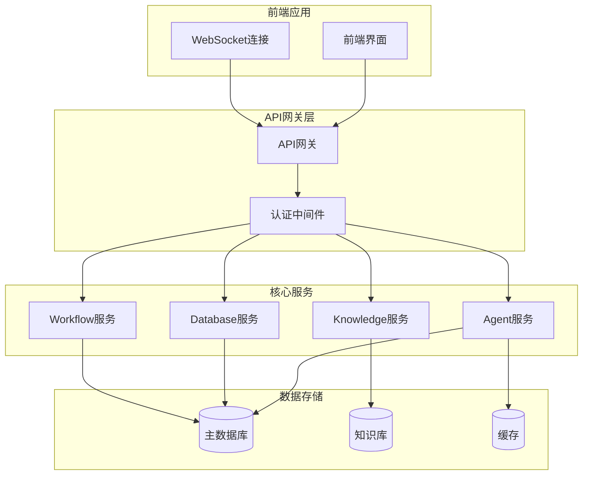
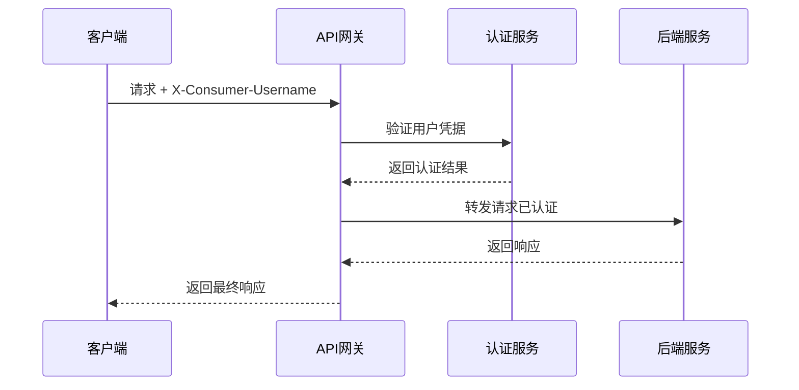
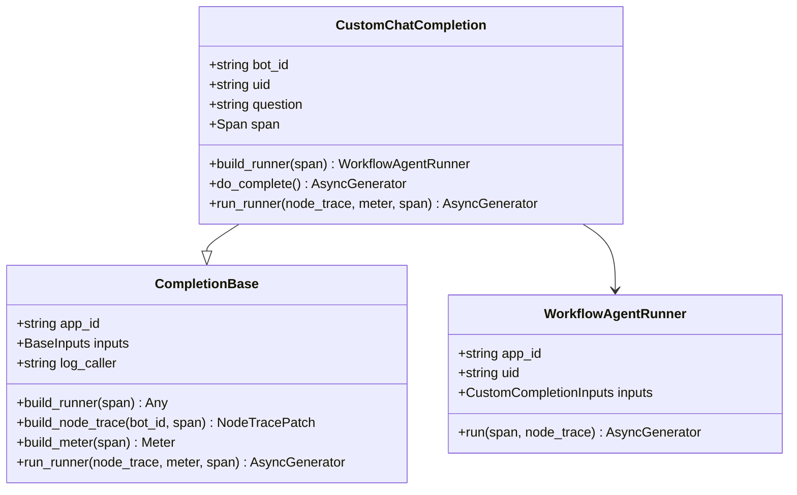
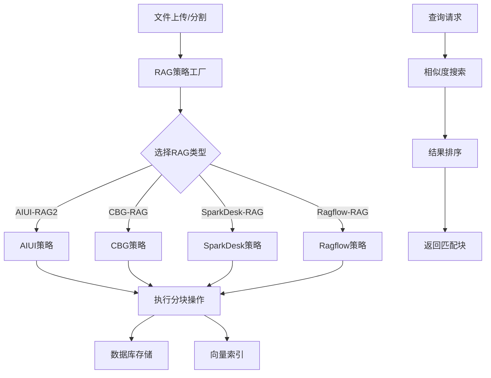
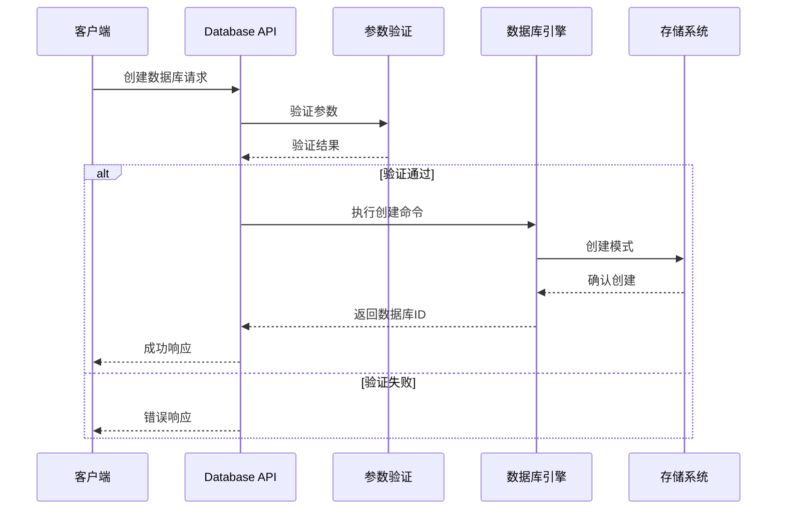
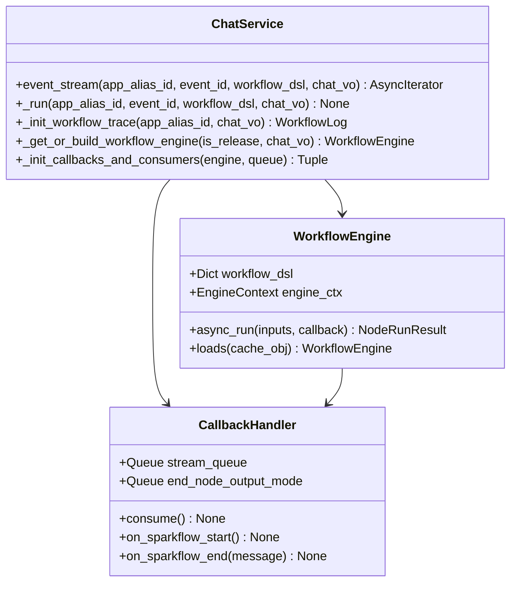
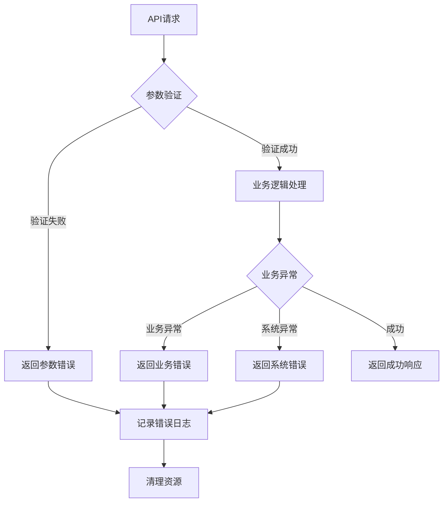

# API参考

<cite>
**本文档中引用的文件**
- [workflow_agent.py](file://core/agent/api/v1/workflow_agent.py)
- [api.py](file://core/knowledge/api/v1/api.py)
- [db_operator.py](file://core/memory/database/api/v1/db_operator.py)
- [chat_service.py](file://core/workflow/service/chat_service.py)
- [base_api.py](file://core/agent/api/v1/base_api.py)
- [chunk_dto.py](file://core/knowledge/domain/entity/chunk_dto.py)
- [create_db_types.py](file://core/memory/database/api/schemas/create_db_types.py)
- [response.py](file://core/knowledge/domain/response.py)
- [error_code.py](file://core/knowledge/consts/error_code.py)
- [app.py](file://core/agent/api/app.py)
- [chat.ts](file://console/frontend/src/services/chat.ts)
</cite>

## 目录
1. [简介](#简介)
2. [认证机制](#认证机制)
3. [Agent服务API](#agent服务api)
4. [Knowledge服务API](#knowledge服务api)
5. [Database服务API](#database服务api)
6. [Workflow服务API](#workflow服务api)
7. [错误处理](#错误处理)
8. [使用示例](#使用示例)

## 简介

astron-agent是一个基于FastAPI框架构建的企业级AI Agent平台，提供了完整的Agent服务、知识管理、数据库操作和工作流管理功能。本文档详细描述了所有公共API接口，包括HTTP方法、URL模式、请求/响应格式和认证方法。

### 系统架构概览



**图表来源**
- [app.py](file://core/agent/api/app.py#L1-L85)
- [workflow_agent.py](file://core/agent/api/v1/workflow_agent.py#L1-L106)

## 认证机制

### 头部认证

所有API请求都需要在请求头中包含以下认证信息：

| 参数名 | 类型 | 必需 | 描述 |
|--------|------|------|------|
| `X-Consumer-Username` | string | 是 | 用户标识符，用于身份验证和权限控制 |

### 认证流程



**图表来源**
- [workflow_agent.py](file://core/agent/api/v1/workflow_agent.py#L65-L106)

**节来源**
- [workflow_agent.py](file://core/agent/api/v1/workflow_agent.py#L65-L106)
- [app.py](file://core/agent/api/app.py#L1-L85)

## Agent服务API

Agent服务提供了智能Agent执行的核心功能，支持流式响应和多种工作流配置。

### Agent执行接口

#### 自定义聊天完成

**端点**: `POST /agent/v1/custom/chat/completions`

**描述**: 执行Agent工作流，返回流式响应。

**请求参数**:

| 参数名 | 类型 | 必需 | 描述 |
|--------|------|------|------|
| `x_consumer_username` | string | 是 | 用户标识符（请求头） |
| `completion_inputs` | CustomCompletionInputs | 是 | 请求体参数 |

**CustomCompletionInputs结构**:

| 字段名 | 类型 | 必需 | 描述 |
|--------|------|------|------|
| `uid` | string | 是 | 用户唯一标识符 |
| `meta_data` | object | 是 | 元数据信息 |
| `parameters` | object | 是 | 工作流参数 |
| `flow_id` | string | 是 | 工作流标识符 |
| `version` | string | 是 | 工作流版本 |
| `stream` | boolean | 否 | 是否启用流式响应，默认false |

**响应格式**:

```json
{
  "id": "string",
  "object": "chat.completion.chunk",
  "created": integer,
  "model": "string",
  "choices": [
    {
      "index": 0,
      "delta": {
        "role": "assistant",
        "content": "响应内容"
      },
      "finish_reason": "stop"
    }
  ]
}
```

**流式响应**: 使用Server-Sent Events (SSE) 格式，每条消息以`data:`开头，以两个换行符结尾。

**节来源**
- [workflow_agent.py](file://core/agent/api/v1/workflow_agent.py#L65-L106)
- [base_api.py](file://core/agent/api/v1/base_api.py#L1-L227)

### Agent服务架构



**图表来源**
- [workflow_agent.py](file://core/agent/api/v1/workflow_agent.py#L18-L60)
- [base_api.py](file://core/agent/api/v1/base_api.py#L40-L227)

## Knowledge服务API

Knowledge服务提供了完整的RAG（检索增强生成）功能，包括文档上传、分块、索引和检索。

### 文档处理接口

#### 文件分割

**端点**: `POST /knowledge/v1/document/split`

**描述**: 解析用户提供的文本内容，然后执行分块处理。

**请求参数**:

| 参数名 | 类型 | 必需 | 描述 |
|--------|------|------|------|
| `file` | string | 是 | 文件内容或路径 |
| `resourceType` | integer | 否 | 资源类型：0-常规文件，1-URL网页，默认0 |
| `ragType` | RAGType | 是 | RAG类型枚举 |
| `lengthRange` | array | 否 | 分割长度范围，如`[256, 1024]` |
| `overlap` | integer | 否 | 重叠长度 |
| `separator` | array | 否 | 分隔符列表，如`["\n", ". "]` |
| `cutOff` | array | 否 | 截断标记列表 |
| `titleSplit` | boolean | 否 | 是否按标题分割，默认false |

**RAGType枚举**:
- `AIUI-RAG2`
- `CBG-RAG`
- `SparkDesk-RAG`
- `Ragflow-RAG`

**响应格式**:

```json
{
  "code": 0,
  "message": "success",
  "data": {
    "chunks": [
      {
        "id": "chunk_id",
        "content": "分块内容",
        "metadata": {
          "doc_id": "document_id",
          "chunk_index": 0,
          "start_pos": 0,
          "end_pos": 100
        }
      }
    ]
  },
  "sid": "trace_id"
}
```

#### 文件上传

**端点**: `POST /knowledge/v1/document/upload`

**描述**: 上传文件并执行分块处理，支持表单数据模式。

**请求格式**: `multipart/form-data`

**请求参数**:

| 参数名 | 类型 | 必需 | 描述 |
|--------|------|------|------|
| `file` | file | 是 | 上传的文件 |
| `ragType` | string | 是 | RAG类型 |
| `lengthRange` | string | 否 | 长度范围JSON数组，如`"[256, 1024]"` |
| `separator` | string | 否 | 分隔符JSON数组，如`"[\n, . ]"` |

**节来源**
- [api.py](file://core/knowledge/api/v1/api.py#L150-L250)
- [chunk_dto.py](file://core/knowledge/domain/entity/chunk_dto.py#L1-L164)

### 知识库管理接口

#### 块保存

**端点**: `POST /knowledge/v1/chunks/save`

**描述**: 将分块数据保存到数据库，或添加新的分块。

**请求参数**:

| 字段名 | 类型 | 必需 | 描述 |
|--------|------|------|------|
| `docId` | string | 是 | 文档ID |
| `group` | string | 是 | 分组标识符 |
| `uid` | string | 否 | 用户ID |
| `chunks` | array | 是 | 分块列表，至少包含一个元素 |
| `ragType` | RAGType | 是 | RAG类型 |

#### 块更新

**端点**: `POST /knowledge/v1/chunk/update`

**描述**: 更新知识分块。

**请求参数**:

| 字段名 | 类型 | 必需 | 描述 |
|--------|------|------|------|
| `docId` | string | 是 | 文档ID |
| `group` | string | 是 | 分组标识符 |
| `uid` | string | 否 | 用户ID |
| `chunks` | array | 是 | 分块字典列表 |
| `ragType` | RAGType | 是 | RAG类型 |

#### 块删除

**端点**: `POST /knowledge/v1/chunk/delete`

**描述**: 删除知识分块。

**请求参数**:

| 字段名 | 类型 | 必需 | 描述 |
|--------|------|------|------|
| `docId` | string | 是 | 文档ID |
| `chunkIds` | array | 否 | 分块ID列表 |
| `ragType` | RAGType | 是 | RAG类型 |

#### 块查询

**端点**: `POST /knowledge/v1/chunk/query`

**描述**: 基于用户输入内容检索相似文档块。

**请求参数**:

| 字段名 | 类型 | 必需 | 描述 |
|--------|------|------|------|
| `query` | string | 是 | 查询文本 |
| `topN` | integer | 是 | 返回结果数量，范围1-5 |
| `match` | QueryMatch | 是 | 匹配条件 |
| `ragType` | RAGType | 是 | RAG类型 |

**QueryMatch结构**:

| 字段名 | 类型 | 必需 | 描述 |
|--------|------|------|------|
| `docIds` | array | 否 | 文档ID列表 |
| `repoId` | array | 是 | 知识库ID列表，至少包含一个元素 |
| `threshold` | float | 否 | 相似度阈值，范围0-1，默认0 |
| `flowId` | string | 否 | 流程ID |

**节来源**
- [api.py](file://core/knowledge/api/v1/api.py#L250-L478)

### Knowledge服务架构



**图表来源**
- [api.py](file://core/knowledge/api/v1/api.py#L1-L50)

## Database服务API

Database服务提供了完整的数据库操作功能，包括创建、克隆、删除和修改数据库。

### 数据库操作接口

#### 创建数据库

**端点**: `POST /database/v1/create_database`

**描述**: 创建新的数据库实例，包含生产和测试模式。

**请求参数**:

| 字段名 | 类型 | 必需 | 描述 |
|--------|------|------|------|
| `database_name` | string | 是 | 数据库名称（1-20字符，字母开头，仅包含字母、数字和下划线） |
| `uid` | string | 是 | 用户ID（1-64字符，无中文或特殊字符） |
| `description` | string | 否 | 可选描述（最大200字符） |
| `space_id` | string | 否 | 可选团队空间ID |

**响应格式**:

```json
{
  "code": 0,
  "message": "success",
  "data": {
    "database_id": 12345
  },
  "sid": "trace_id"
}
```

#### 克隆数据库

**端点**: `POST /database/v1/clone_database`

**描述**: 克隆现有数据库及其所有模式和数据。

**请求参数**:

| 字段名 | 类型 | 必需 | 描述 |
|--------|------|------|------|
| `database_id` | integer | 是 | 源数据库ID |
| `uid` | string | 是 | 用户ID |
| `new_database_name` | string | 是 | 新数据库名称 |

#### 删除数据库

**端点**: `POST /database/v1/drop_database`

**描述**: 删除现有数据库及其所有模式。

**请求参数**:

| 字段名 | 类型 | 必需 | 描述 |
|--------|------|------|------|
| `database_id` | integer | 是 | 数据库ID |
| `uid` | string | 是 | 用户ID |
| `space_id` | string | 否 | 团队空间ID |

#### 修改数据库描述

**端点**: `POST /database/v1/modify_db_description`

**描述**: 修改现有数据库的描述信息。

**请求参数**:

| 字段名 | 类型 | 必需 | 描述 |
|--------|------|------|------|
| `database_id` | integer | 是 | 数据库ID |
| `uid` | string | 是 | 用户ID |
| `description` | string | 是 | 新描述 |
| `space_id` | string | 否 | 团队空间ID |

### 数据库操作流程



**图表来源**
- [db_operator.py](file://core/memory/database/api/v1/db_operator.py#L1-L100)

**节来源**
- [db_operator.py](file://core/memory/database/api/v1/db_operator.py#L1-L517)
- [create_db_types.py](file://core/memory/database/api/schemas/create_db_types.py#L1-L38)

## Workflow服务API

Workflow服务提供了强大的工作流管理和聊天交互功能，支持实时流式响应。

### 聊天接口

#### 实时聊天

**端点**: `POST /workflow/chat`

**描述**: 发起实时聊天会话，支持流式响应。

**请求参数**:

| 参数名 | 类型 | 必需 | 描述 |
|--------|------|------|------|
| `botId` | integer | 是 | 智能体ID |
| `message` | string | 是 | 用户消息 |
| `chatId` | integer | 否 | 会话ID（可选） |
| `stream` | boolean | 否 | 是否启用流式响应，默认false |

**响应格式**:

```json
{
  "id": "chat_123",
  "object": "chat.completion",
  "created": 1640995200,
  "choices": [
    {
      "index": 0,
      "message": {
        "role": "assistant",
        "content": "响应内容"
      },
      "finish_reason": "stop"
    }
  ],
  "usage": {
    "prompt_tokens": 10,
    "completion_tokens": 20,
    "total_tokens": 30
  }
}
```

#### 流式聊天

**端点**: `GET /workflow/chat/stream/{chatId}`

**描述**: 建立WebSocket连接，实现实时流式聊天。

**连接参数**:

| 参数名 | 类型 | 必需 | 描述 |
|--------|------|------|------|
| `chatId` | string | 是 | 会话标识符 |
| `Authorization` | string | 是 | 认证令牌 |

**消息格式**:

```json
{
  "type": "message",
  "data": {
    "content": "部分响应内容",
    "timestamp": 1640995200
  }
}
```

### 聊天服务架构



**图表来源**
- [chat_service.py](file://core/workflow/service/chat_service.py#L1-L100)

**节来源**
- [chat_service.py](file://core/workflow/service/chat_service.py#L1-L799)

## 错误处理

### 错误响应格式

所有API接口都遵循统一的错误响应格式：

```json
{
  "code": 10001,
  "message": "参数检查异常",
  "sid": "trace_id"
}
```

### 错误码定义

| 错误码 | 错误名称 | 描述 |
|--------|----------|------|
| 10001 | ParameterCheckException | 参数检查异常 |
| 10002 | MissingParameter | 缺少必要参数 |
| 10003 | ParameterInvalid | 参数无效 |
| 10016 | FileSplitFailed | 文件分割失败 |
| 10017 | ChunkSaveFailed | 分块保存失败 |
| 10018 | ChunkUpdateFailed | 分块更新失败 |
| 10019 | ChunkDeleteFailed | 分块删除失败 |
| 10020 | ChunkQueryFailed | 分块查询失败 |
| 10024 | GetFileContentFailed | 文件内容获取失败 |
| 10025 | FileStorageError | 文件存储失败 |
| 10026 | CBG_RAGError | CBG知识库请求失败 |
| 10027 | AIUI_RAGError | AIUI知识库请求失败 |
| 10028 | DESK_RAGError | DESK知识库请求失败 |
| 11111 | ThirdPartyServiceFailed | 第三方服务失败 |
| 14999 | ServiceException | 服务异常 |

### 异常处理流程



**图表来源**
- [error_code.py](file://core/knowledge/consts/error_code.py#L1-L48)
- [response.py](file://core/knowledge/domain/response.py#L1-L59)

**节来源**
- [error_code.py](file://core/knowledge/consts/error_code.py#L1-L48)
- [response.py](file://core/knowledge/domain/response.py#L1-L59)

## 使用示例

### Python示例

#### Agent服务调用

```python
import requests
import json

# 设置请求头
headers = {
    "X-Consumer-Username": "user123",
    "Content-Type": "application/json"
}

# 定义请求数据
data = {
    "uid": "user123",
    "meta_data": {
        "caller": "python_client"
    },
    "parameters": {
        "question": "你好，请介绍一下自己",
        "flow_id": "default_flow",
        "version": "v1.0"
    },
    "flow_id": "default_flow",
    "version": "v1.0",
    "stream": True
}

# 发送请求
response = requests.post(
    "http://localhost:8000/agent/v1/custom/chat/completions",
    headers=headers,
    json=data,
    stream=True
)

# 处理流式响应
for line in response.iter_lines():
    if line:
        print(line.decode('utf-8'))
```

#### Knowledge服务调用

```python
import requests
import json

# 文件上传示例
def upload_document(file_path, rag_type="AIUI-RAG2"):
    headers = {"X-Consumer-Username": "user123"}
    
    with open(file_path, 'rb') as f:
        files = {
            'file': (file_path, f, 'application/pdf'),
            'ragType': (None, rag_type)
        }
        
        response = requests.post(
            "http://localhost:8000/knowledge/v1/document/upload",
            headers=headers,
            files=files
        )
        
        return response.json()

# 分块查询示例
def query_chunks(query_text, top_n=3):
    headers = {"X-Consumer-Username": "user123"}
    data = {
        "query": query_text,
        "topN": top_n,
        "match": {
            "repoId": ["knowledge_base_1"],
            "threshold": 0.7
        },
        "ragType": "AIUI-RAG2"
    }
    
    response = requests.post(
        "http://localhost:8000/knowledge/v1/chunk/query",
        headers=headers,
        json=data
    )
    
    return response.json()
```

#### Database服务调用

```python
import requests

# 创建数据库示例
def create_database(name, description=None):
    headers = {"X-Consumer-Username": "user123"}
    data = {
        "database_name": name,
        "uid": "user123",
        "description": description
    }
    
    response = requests.post(
        "http://localhost:8000/database/v1/create_database",
        headers=headers,
        json=data
    )
    
    return response.json()

# 克隆数据库示例
def clone_database(source_id, new_name):
    headers = {"X-Consumer-Username": "user123"}
    data = {
        "database_id": source_id,
        "uid": "user123",
        "new_database_name": new_name
    }
    
    response = requests.post(
        "http://localhost:8000/database/v1/clone_database",
        headers=headers,
        json=data
    )
    
    return response.json()
```

### cURL示例

#### Agent服务

```bash
# 流式聊天完成
curl -X POST "http://localhost:8000/agent/v1/custom/chat/completions" \
  -H "X-Consumer-Username: user123" \
  -H "Content-Type: application/json" \
  -d '{
    "uid": "user123",
    "meta_data": {
      "caller": "curl_client"
    },
    "parameters": {
      "question": "解释什么是人工智能",
      "flow_id": "default_flow",
      "version": "v1.0"
    },
    "flow_id": "default_flow",
    "version": "v1.0",
    "stream": true
  }'

# 非流式聊天完成
curl -X POST "http://localhost:8000/agent/v1/custom/chat/completions" \
  -H "X-Consumer-Username: user123" \
  -H "Content-Type: application/json" \
  -d '{
    "uid": "user123",
    "meta_data": {
      "caller": "curl_client"
    },
    "parameters": {
      "question": "解释什么是人工智能",
      "flow_id": "default_flow",
      "version": "v1.0"
    },
    "flow_id": "default_flow",
    "version": "v1.0",
    "stream": false
  }'
```

#### Knowledge服务

```bash
# 文件上传
curl -X POST "http://localhost:8000/knowledge/v1/document/upload" \
  -H "X-Consumer-Username: user123" \
  -F "file=@document.pdf" \
  -F "ragType=AIUI-RAG2" \
  -F "lengthRange=[256,1024]" \
  -F "separator=[\"\\n\", \". \"]"

# 分块查询
curl -X POST "http://localhost:8000/knowledge/v1/chunk/query" \
  -H "X-Consumer-Username: user123" \
  -H "Content-Type: application/json" \
  -d '{
    "query": "机器学习算法",
    "topN": 5,
    "match": {
      "repoId": ["knowledge_base_1"],
      "threshold": 0.7
    },
    "ragType": "AIUI-RAG2"
  }'
```

#### Database服务

```bash
# 创建数据库
curl -X POST "http://localhost:8000/database/v1/create_database" \
  -H "X-Consumer-Username: user123" \
  -H "Content-Type: application/json" \
  -d '{
    "database_name": "my_database",
    "uid": "user123",
    "description": "测试数据库"
  }'

# 克隆数据库
curl -X POST "http://localhost:8000/database/v1/clone_database" \
  -H "X-Consumer-Username: user123" \
  -H "Content-Type: application/json" \
  -d '{
    "database_id": 123,
    "uid": "user123",
    "new_database_name": "cloned_database"
  }'
```

### 前端集成示例

#### React Hook示例

```typescript
import { useState, useEffect } from 'react';
import { chatService } from '@/services/chat';

export function useChat(botId: number) {
  const [messages, setMessages] = useState<Message[]>([]);
  const [isLoading, setIsLoading] = useState(false);
  const [error, setError] = useState<string | null>(null);

  const sendMessage = async (content: string) => {
    setIsLoading(true);
    setError(null);

    try {
      const response = await chatService.sendMessage(botId, content);
      
      // 处理流式响应
      if (response.stream) {
        const reader = response.body?.getReader();
        if (reader) {
          const decoder = new TextDecoder();
          let result = '';

          while (true) {
            const { done, value } = await reader.read();
            if (done) break;
            
            result += decoder.decode(value, { stream: true });
            // 解析SSE格式
            const lines = result.split('\n\n');
            lines.forEach(line => {
              if (line.startsWith('data: ')) {
                try {
                  const chunk = JSON.parse(line.slice(6));
                  // 更新UI
                  setMessages(prev => [...prev, {
                    role: 'assistant',
                    content: chunk.choices[0].delta.content || ''
                  }]);
                } catch (e) {
                  console.error('解析错误:', e);
                }
              }
            });
            result = lines[lines.length - 1];
          }
        }
      } else {
        // 处理非流式响应
        setMessages(prev => [...prev, {
          role: 'assistant',
          content: response.choices[0].message.content
        }]);
      }
    } catch (err) {
      setError(err instanceof Error ? err.message : '发送消息失败');
    } finally {
      setIsLoading(false);
    }
  };

  return { messages, isLoading, error, sendMessage };
}
```

**节来源**
- [chat.ts](file://console/frontend/src/services/chat.ts#L1-L261)

## 性能优化建议

### Agent服务优化

1. **连接池管理**: 使用异步连接池处理大量并发请求
2. **缓存策略**: 缓存常用的工作流模板和配置
3. **流式处理**: 对于长文本生成，优先使用流式响应减少延迟

### Knowledge服务优化

1. **批量操作**: 对于大量文档处理，使用批量API减少网络开销
2. **索引优化**: 定期重建向量索引提高查询性能
3. **分片存储**: 对于大型知识库，考虑分片存储策略

### Database服务优化

1. **事务管理**: 合理使用数据库事务，避免长时间锁定
2. **连接复用**: 使用连接池管理数据库连接
3. **备份策略**: 定期备份数据库，确保数据安全

## 监控和日志

### 分布式追踪

系统集成了OTLP分布式追踪，每个API请求都会生成唯一的trace ID，便于问题排查和性能分析。

### 指标收集

- **请求计数**: 统计每个API端点的调用次数
- **响应时间**: 监控API响应时间分布
- **错误率**: 跟踪各类错误的发生频率
- **资源使用**: 监控CPU、内存和磁盘使用情况

### 日志级别

- **ERROR**: 严重错误，影响服务可用性
- **WARNING**: 警告信息，可能影响性能
- **INFO**: 一般信息，记录重要操作
- **DEBUG**: 详细调试信息，用于开发和故障排查

## 安全考虑

### 输入验证

所有API接口都进行了严格的输入验证，防止SQL注入、XSS攻击等安全威胁。

### 权限控制

- **用户隔离**: 每个用户的资源完全隔离
- **操作审计**: 所有敏感操作都会记录审计日志
- **速率限制**: 防止API滥用和DDoS攻击

### 数据保护

- **传输加密**: 所有API通信都使用HTTPS加密
- **存储加密**: 敏感数据在存储时进行加密
- **访问控制**: 基于角色的访问控制(RBAC)

## 版本管理

### API版本控制

目前主要使用`v1`版本，未来会逐步推出`v2`等新版本以支持新功能。

### 向后兼容性

- **破坏性变更**: 重大变更会通过新版本号体现
- **废弃通知**: 废弃的功能会提前通知并提供迁移指南
- **渐进式升级**: 支持新旧版本并存，便于平滑升级

## 故障排除

### 常见问题

1. **认证失败**: 检查`X-Consumer-Username`头是否正确设置
2. **参数错误**: 查看错误响应中的具体参数问题
3. **超时问题**: 调整请求超时时间和重试策略
4. **资源不足**: 监控系统资源使用情况，及时扩容

### 调试工具

- **Postman集合**: 提供完整的API测试集合
- **Swagger文档**: 自动生成的API文档
- **日志分析**: 结合trace ID进行日志分析
- **性能监控**: 实时监控系统性能指标

## 扩展阅读

- [FastAPI官方文档](https://fastapi.tiangolo.com/)
- [OpenAPI规范](https://spec.openapis.org/oas/latest.html)
- [Server-Sent Events规范](https://html.spec.whatwg.org/multipage/server-sent-events.html)
- [OTLP规范](https://opentelemetry.io/docs/specs/otlp/)