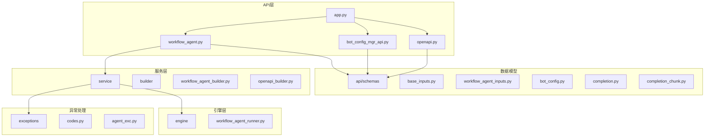
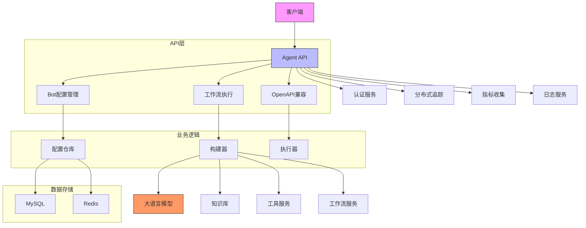
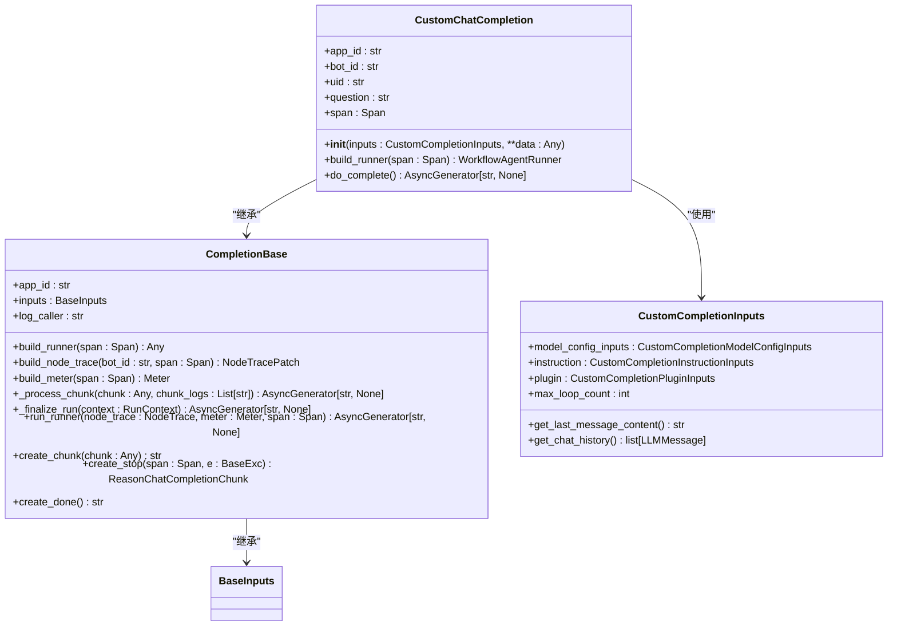
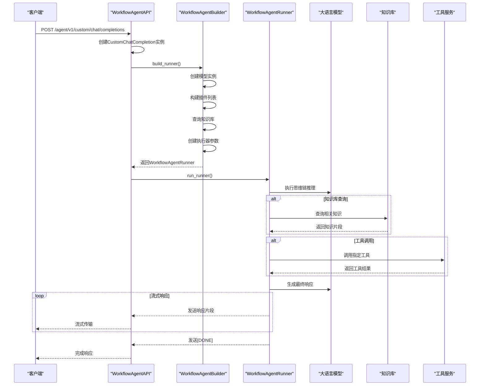
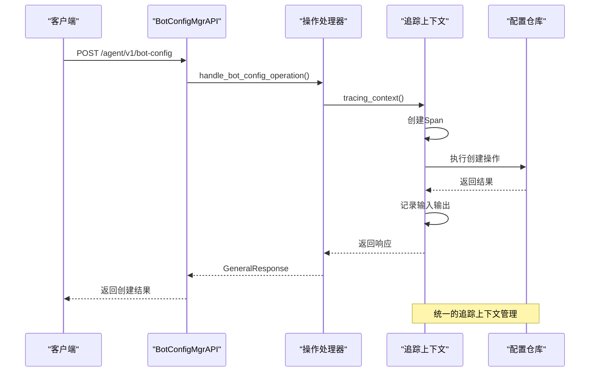
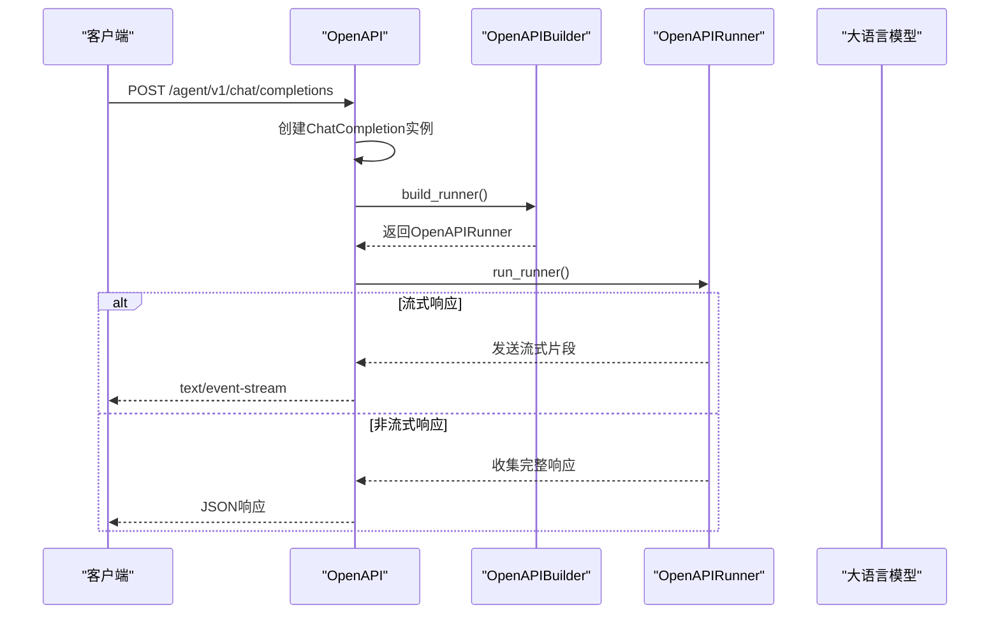
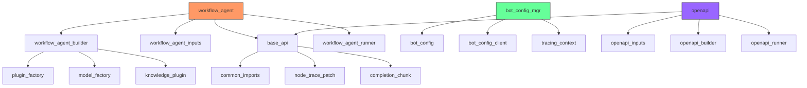

# Agent API

<cite>
**本文档引用的文件**
- [workflow_agent.py](file://core/agent/api/v1/workflow_agent.py)
- [bot_config_mgr_api.py](file://core/agent/api/v1/bot_config_mgr_api.py)
- [openapi.py](file://core/agent/api/v1/openapi.py)
- [app.py](file://core/agent/api/app.py)
- [workflow_agent_inputs.py](file://core/agent/api/schemas/workflow_agent_inputs.py)
- [bot_config.py](file://core/agent/api/schemas/bot_config.py)
- [base_inputs.py](file://core/agent/api/schemas/base_inputs.py)
- [completion.py](file://core/agent/api/schemas/completion.py)
- [completion_chunk.py](file://core/agent/api/schemas/completion_chunk.py)
- [agent_response.py](file://core/agent/api/schemas/agent_response.py)
- [codes.py](file://core/agent/exceptions/codes.py)
- [middleware.py](file://core/agent/infra/config/middleware.py)
- [workflow_agent_builder.py](file://core/agent/service/builder/workflow_agent_builder.py)
</cite>

## 目录
1. [简介](#简介)
2. [项目结构](#项目结构)
3. [核心组件](#核心组件)
4. [架构概述](#架构概述)
5. [详细组件分析](#详细组件分析)
6. [依赖分析](#依赖分析)
7. [性能考虑](#性能考虑)
8. [故障排除指南](#故障排除指南)
9. [结论](#结论)

## 简介
Agent API 文档详细介绍了智能体服务的API接口，重点涵盖工作流执行、Bot配置管理和OpenAPI接口。API基于FastAPI框架构建，提供流式和非流式响应模式，支持复杂的智能体工作流执行。系统通过分布式追踪、指标收集和错误处理机制确保高可用性和可观测性。

## 项目结构
Agent服务位于core/agent目录下，采用分层架构设计。API层位于api目录，包含v1版本的端点定义；schemas目录定义了所有请求和响应的数据模型；service目录包含业务逻辑构建器；engine目录实现核心执行引擎；exceptions目录管理错误码和异常处理。

**图源**
- [workflow_agent.py](file://core/agent/api/v1/workflow_agent.py)
- [bot_config_mgr_api.py](file://core/agent/api/v1/bot_config_mgr_api.py)
- [openapi.py](file://core/agent/api/v1/openapi.py)
- [app.py](file://core/agent/api/app.py)

**章节源**
- [workflow_agent.py](file://core/agent/api/v1/workflow_agent.py#L1-L105)
- [bot_config_mgr_api.py](file://core/agent/api/v1/bot_config_mgr_api.py#L1-L211)
- [openapi.py](file://core/agent/api/v1/openapi.py#L1-L209)

## 核心组件
Agent API的核心组件包括工作流执行引擎、Bot配置管理器和OpenAPI兼容接口。工作流执行引擎支持复杂的思维链(CoT)推理过程，集成知识库检索、工具调用和工作流执行功能。Bot配置管理器提供对智能体配置的CRUD操作，支持配置的持久化存储。OpenAPI接口确保与标准OpenAI API的兼容性，便于现有应用集成。

**章节源**
- [workflow_agent.py](file://core/agent/api/v1/workflow_agent.py#L1-L105)
- [bot_config_mgr_api.py](file://core/agent/api/v1/bot_config_mgr_api.py#L1-L211)
- [openapi.py](file://core/agent/api/v1/openapi.py#L1-L209)

## 架构概述
Agent服务采用微服务架构，通过FastAPI提供RESTful API接口。系统集成分布式追踪(OTLP)、指标收集和日志记录功能，确保系统的可观测性。API层与业务逻辑层分离，通过构建器模式创建执行器实例。配置管理基于Polaris系统，支持动态配置更新。

**图源**
- [app.py](file://core/agent/api/app.py#L1-L84)
- [middleware.py](file://core/agent/infra/config/middleware.py#L1-L63)

## 详细组件分析

### 工作流执行API分析
工作流执行API提供智能体的核心执行功能，支持自定义模型配置、插件集成和思维链推理。API通过流式响应提供实时结果传输，适用于对话式应用场景。

#### 工作流执行类图

**图源**
- [workflow_agent.py](file://core/agent/api/v1/workflow_agent.py#L1-L105)
- [base_api.py](file://core/agent/api/v1/base_api.py#L1-L226)
- [workflow_agent_inputs.py](file://core/agent/api/schemas/workflow_agent_inputs.py#L1-L50)

#### 工作流执行序列图

**图源**
- [workflow_agent.py](file://core/agent/api/v1/workflow_agent.py#L1-L105)
- [workflow_agent_builder.py](file://core/agent/service/builder/workflow_agent_builder.py#L1-L230)

### Bot配置管理API分析
Bot配置管理API提供对智能体配置的完整生命周期管理，包括创建、读取、更新和删除操作。API集成分布式追踪，确保每个操作的可追溯性。

#### Bot配置管理序列图

**图源**
- [bot_config_mgr_api.py](file://core/agent/api/v1/bot_config_mgr_api.py#L1-L211)
- [bot_config.py](file://core/agent/api/schemas/bot_config.py#L1-L58)

### OpenAPI接口分析
OpenAPI接口提供与标准OpenAI API兼容的端点，支持流式和非流式响应模式。接口设计确保与现有OpenAI客户端的无缝集成。

#### OpenAPI接口序列图

**图源**
- [openapi.py](file://core/agent/api/v1/openapi.py#L1-L209)
- [openapi_builder.py](file://core/agent/service/builder/openapi_builder.py#L1-L100)

## 依赖分析
Agent服务依赖多个内部和外部组件，形成复杂的依赖网络。核心依赖包括分布式追踪系统、配置管理服务、数据库存储和第三方API服务。

**图源**
- [app.py](file://core/agent/api/app.py#L1-L84)
- [workflow_agent.py](file://core/agent/api/v1/workflow_agent.py#L1-L105)
- [bot_config_mgr_api.py](file://core/agent/api/v1/bot_config_mgr_api.py#L1-L211)
- [openapi.py](file://core/agent/api/v1/openapi.py#L1-L209)

**章节源**
- [app.py](file://core/agent/api/app.py#L1-L84)
- [workflow_agent.py](file://core/agent/api/v1/workflow_agent.py#L1-L105)

## 性能考虑
Agent服务在设计时考虑了多项性能优化措施。流式响应减少客户端等待时间，分布式追踪和指标收集帮助识别性能瓶颈。缓存机制减少重复计算，异步I/O提高并发处理能力。系统支持水平扩展，通过增加工作进程处理高并发请求。

## 故障排除指南
当遇到API调用问题时，首先检查错误码和消息。常见的错误包括认证失败(40040)、配置无效(40003)和模型调用失败(40029)。启用详细的追踪日志可以帮助诊断问题根源。对于流式响应中断，检查网络连接和超时设置。

**章节源**
- [codes.py](file://core/agent/exceptions/codes.py#L1-L177)
- [base_api.py](file://core/agent/api/v1/base_api.py#L1-L226)

## 结论
Agent API提供了一套完整的智能体管理和服务执行接口，支持复杂的工作流执行、灵活的配置管理和标准的OpenAPI兼容性。系统设计注重可观测性、可扩展性和可靠性，适用于各种智能体应用场景。通过合理的错误处理和性能优化，确保服务的高可用性和响应性。