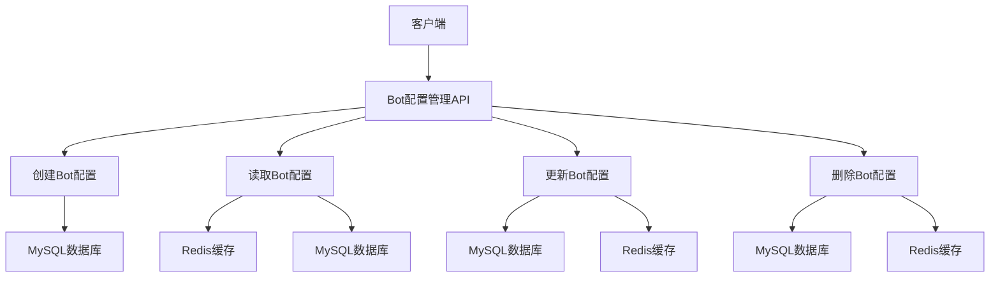
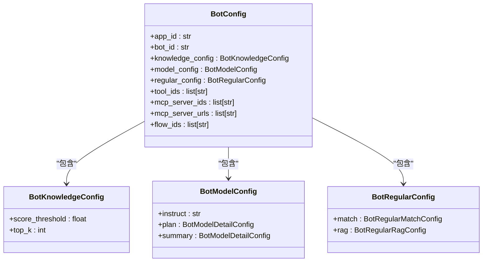
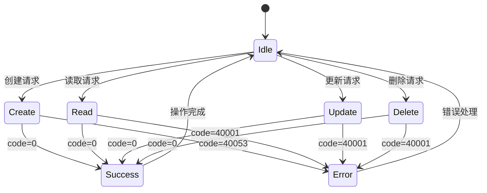
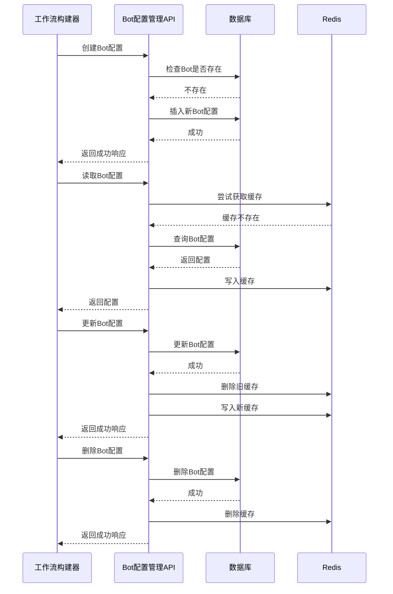

# Bot配置管理API

<cite>
**本文档引用的文件**
- [bot_config_mgr_api.py](file://core/agent/api/v1/bot_config_mgr_api.py)
- [bot_config.py](file://core/agent/api/schemas/bot_config.py)
- [bot_config_mgr_inputs.py](file://core/agent/api/schemas/bot_config_mgr_inputs.py)
- [bot_config_mgr_response.py](file://core/agent/api/schemas/bot_config_mgr_response.py)
- [bot_config_client.py](file://core/agent/repository/bot_config_client.py)
- [bot_config_exc.py](file://core/agent/exceptions/bot_config_exc.py)
- [http.ts](file://console/frontend/src/utils/http.ts)
</cite>

## 目录
1. [简介](#简介)
2. [API端点](#api端点)
3. [配置参数说明](#配置参数说明)
4. [请求/响应示例](#请求响应示例)
5. [错误码说明](#错误码说明)
6. [与工作流构建器的集成](#与工作流构建器的集成)
7. [使用示例和最佳实践](#使用示例和最佳实践)

## 简介

Bot配置管理API是astron-agent系统的核心组件，负责管理智能体（Bot）的配置信息。该API提供了创建、读取、更新和删除Bot配置的完整CRUD操作，支持通过HTTP接口对Bot的提示词、LLM设置、节点配置等关键参数进行管理。

API采用分层架构设计，前端通过HTTP请求与后端交互，后端通过统一的处理函数`handle_bot_config_operation`来处理所有配置操作。系统实现了完整的追踪上下文管理，确保每个操作都有详细的日志记录和性能监控。配置数据存储在MySQL数据库中，并通过Redis进行缓存以提高访问性能。

**Section sources**
- [bot_config_mgr_api.py](file://core/agent/api/v1/bot_config_mgr_api.py#L1-L211)
- [bot_config_client.py](file://core/agent/repository/bot_config_client.py#L1-L310)

## API端点

Bot配置管理API提供了一组RESTful端点，用于管理Bot配置。所有端点都位于`/agent/v1`前缀下，通过不同的HTTP方法实现CRUD操作。



**Diagram sources**
- [bot_config_mgr_api.py](file://core/agent/api/v1/bot_config_mgr_api.py#L1-L211)
- [bot_config_client.py](file://core/agent/repository/bot_config_client.py#L1-L310)

### 创建Bot配置

- **HTTP方法**: POST
- **URL模式**: `/agent/v1/bot-config`
- **认证方法**: Bearer Token（通过Authorization头传递）
- **请求体**: BotConfig对象（JSON格式）
- **响应**: GeneralResponse对象

该端点用于创建新的Bot配置。如果指定的Bot ID已存在，则返回40053错误码。

**Section sources**
- [bot_config_mgr_api.py](file://core/agent/api/v1/bot_config_mgr_api.py#L100-L117)

### 读取Bot配置

- **HTTP方法**: GET
- **URL模式**: `/agent/v1/bot-config`
- **认证方法**: Bearer Token（通过Authorization头传递）
- **查询参数**: 
  - `app_id` (必填): 应用ID
  - `bot_id` (必填): Bot ID
- **响应**: GeneralResponse对象

该端点用于获取指定Bot的配置信息。系统首先尝试从Redis缓存中读取，如果缓存中不存在，则从MySQL数据库中读取，并将结果写入缓存。

**Section sources**
- [bot_config_mgr_api.py](file://core/agent/api/v1/bot_config_mgr_api.py#L178-L197)

### 更新Bot配置

- **HTTP方法**: PUT
- **URL模式**: `/agent/v1/bot-config`
- **认证方法**: Bearer Token（通过Authorization头传递）
- **请求体**: BotConfig对象（JSON格式）
- **响应**: GeneralResponse对象

该端点用于更新现有Bot的配置。如果指定的Bot不存在，则返回40001错误码。

**Section sources**
- [bot_config_mgr_api.py](file://core/agent/api/v1/bot_config_mgr_api.py#L146-L165)

### 删除Bot配置

- **HTTP方法**: DELETE
- **URL模式**: `/agent/v1/bot-config`
- **认证方法**: Bearer Token（通过Authorization头传递）
- **查询参数**: 
  - `app_id` (必填): 应用ID
  - `bot_id` (必填): Bot ID
- **响应**: GeneralResponse对象

该端点用于删除指定的Bot配置。系统会同时从MySQL数据库和Redis缓存中删除相应的记录。

**Section sources**
- [bot_config_mgr_api.py](file://core/agent/api/v1/bot_config_mgr_api.py#L120-L143)

## 配置参数说明

Bot配置包含多个嵌套的对象，每个对象负责管理特定方面的配置。以下是完整的配置参数说明：

### BotConfig主对象

BotConfig是配置的根对象，包含所有配置信息：

- `app_id`: 应用ID（必填，长度1-64）
- `bot_id`: Bot ID（必填，长度1-64）
- `knowledge_config`: 知识库配置
- `model_config`: 模型配置
- `regular_config`: 常规配置
- `tool_ids`: 工具ID列表
- `mcp_server_ids`: MCP服务器ID列表
- `mcp_server_urls`: MCP服务器URL列表
- `flow_ids`: 工作流ID列表



**Diagram sources**
- [bot_config.py](file://core/agent/api/schemas/bot_config.py#L1-L58)

### 知识库配置 (BotKnowledgeConfig)

知识库配置控制Bot在检索增强生成（RAG）过程中的行为：

- `score_threshold`: 相似度分数阈值（默认0.3）
- `top_k`: 返回的最相关结果数量（默认3）

### 模型配置 (BotModelConfig)

模型配置管理Bot使用的语言模型及其参数：

- `instruct`: 指令配置（JSON字符串，包含think_tip和answer_tip）
- `plan`: 计划阶段模型配置
- `summary`: 总结阶段模型配置

#### 模型详细配置 (BotModelDetailConfig)

每个阶段的模型配置包含以下参数：

- `api`: API端点
- `domain`: 域名
- `sk`: 密钥
- `parameter`: 参数配置
- `patch_id`: 补丁ID列表
- `support_function_call`: 是否支持函数调用

#### 模型参数配置 (BotModelDetailParameterConfig)

模型参数配置包含具体的生成参数：

- `max_tokens`: 最大生成令牌数（默认2048）
- `question_type`: 问题类型（默认"not_knowledge"）
- `temperature`: 温度参数（默认0.5）
- `top_k`: top-k采样参数（默认4）

### 常规配置 (BotRegularConfig)

常规配置管理Bot的常规行为：

- `match`: 匹配配置
- `rag`: RAG配置

#### 匹配配置 (BotRegularMatchConfig)

匹配配置定义Bot在知识库中搜索时的匹配规则：

- `repoId`: 知识库ID列表
- `docId`: 文档ID列表

#### RAG配置 (BotRegularRagConfig)

RAG配置定义检索增强生成的类型：

- `type`: RAG类型（默认"AIUI-RAG2"）

**Section sources**
- [bot_config.py](file://core/agent/api/schemas/bot_config.py#L1-L58)

## 请求/响应示例

### 创建Bot配置请求示例

```json
{
  "app_id": "app_123456",
  "bot_id": "bot_789012",
  "knowledge_config": {
    "score_threshold": 0.4,
    "top_k": 5
  },
  "model_config": {
    "instruct": "{\"think_tip\": \"思考提示\", \"answer_tip\": \"回答提示\"}",
    "plan": {
      "api": "https://api.example.com/v1",
      "domain": "example.com",
      "sk": "sk-123456",
      "parameter": {
        "max_tokens": 2048,
        "question_type": "knowledge",
        "temperature": 0.7,
        "top_k": 4
      },
      "patch_id": [],
      "support_function_call": true
    },
    "summary": {
      "api": "https://api.example.com/v1",
      "domain": "example.com",
      "sk": "sk-123456",
      "parameter": {
        "max_tokens": 1024,
        "question_type": "summary",
        "temperature": 0.5,
        "top_k": 3
      },
      "patch_id": [],
      "support_function_call": false
    }
  },
  "regular_config": {
    "match": {
      "repoId": ["repo_001", "repo_002"],
      "docId": ["doc_001"]
    },
    "rag": {
      "type": "AIUI-RAG2"
    }
  },
  "tool_ids": ["tool_001", "tool_002"],
  "mcp_server_ids": ["mcp_001"],
  "mcp_server_urls": ["https://mcp.example.com"],
  "flow_ids": ["flow_001"]
}
```

### 创建成功响应示例

```json
{
  "code": 0,
  "message": "success",
  "data": {
    "app_id": "app_123456",
    "bot_id": "bot_789012",
    "knowledge_config": {
      "score_threshold": 0.4,
      "top_k": 5
    },
    "model_config": {
      "instruct": "{\"think_tip\": \"思考提示\", \"answer_tip\": \"回答提示\"}",
      "plan": {
        "api": "https://api.example.com/v1",
        "domain": "example.com",
        "sk": "sk-123456",
        "parameter": {
          "max_tokens": 2048,
          "question_type": "knowledge",
          "temperature": 0.7,
          "top_k": 4
        },
        "patch_id": [],
        "support_function_call": true
      },
      "summary": {
        "api": "https://api.example.com/v1",
        "domain": "example.com",
        "sk": "sk-123456",
        "parameter": {
          "max_tokens": 1024,
          "question_type": "summary",
          "temperature": 0.5,
          "top_k": 3
        },
        "patch_id": [],
        "support_function_call": false
      }
    },
    "regular_config": {
      "match": {
        "repoId": ["repo_001", "repo_002"],
        "docId": ["doc_001"]
      },
      "rag": {
        "type": "AIUI-RAG2"
      }
    },
    "tool_ids": ["tool_001", "tool_002"],
    "mcp_server_ids": ["mcp_001"],
    "mcp_server_urls": ["https://mcp.example.com"],
    "flow_ids": ["flow_001"]
  }
}
```

### 读取配置请求示例

```
GET /agent/v1/bot-config?app_id=app_123456&bot_id=bot_789012 HTTP/1.1
Authorization: Bearer your-access-token
```

### 读取成功响应示例

```json
{
  "code": 0,
  "message": "success",
  "data": {
    "app_id": "app_123456",
    "bot_id": "bot_789012",
    "knowledge_config": {
      "score_threshold": 0.4,
      "top_k": 5
    },
    "model_config": {
      "instruct": "{\"think_tip\": \"思考提示\", \"answer_tip\": \"回答提示\"}",
      "plan": {
        "api": "https://api.example.com/v1",
        "domain": "example.com",
        "sk": "sk-123456",
        "parameter": {
          "max_tokens": 2048,
          "question_type": "knowledge",
          "temperature": 0.7,
          "top_k": 4
        },
        "patch_id": [],
        "support_function_call": true
      },
      "summary": {
        "api": "https://api.example.com/v1",
        "domain": "example.com",
        "sk": "sk-123456",
        "parameter": {
          "max_tokens": 1024,
          "question_type": "summary",
          "temperature": 0.5,
          "top_k": 3
        },
        "patch_id": [],
        "support_function_call": false
      }
    },
    "regular_config": {
      "match": {
        "repoId": ["repo_001", "repo_002"],
        "docId": ["doc_001"]
      },
      "rag": {
        "type": "AIUI-RAG2"
      }
    },
    "tool_ids": ["tool_001", "tool_002"],
    "mcp_server_ids": ["mcp_001"],
    "mcp_server_urls": ["https://mcp.example.com"],
    "flow_ids": ["flow_001"]
  }
}
```

**Section sources**
- [bot_config_mgr_api.py](file://core/agent/api/v1/bot_config_mgr_api.py#L100-L197)
- [bot_config.py](file://core/agent/api/schemas/bot_config.py#L1-L58)

## 错误码说明

Bot配置管理API定义了一套完整的错误码系统，用于指示操作结果和错误原因。所有错误响应都遵循GeneralResponse格式，包含code、message和可选的data字段。

### 通用错误码

| 错误码 | 说明 | 可能原因 |
|--------|------|----------|
| 0 | 成功 | 操作成功完成 |
| 40001 | 无法检索Bot配置 | Bot不存在或ID不匹配 |
| 40003 | 无效的Bot配置 | 配置数据格式错误或损坏 |
| 500 | 服务器内部错误 | 服务端发生未预期的错误 |

### 配置管理特定错误码

| 错误码 | 说明 | 可能原因 |
|--------|------|----------|
| 40050 | Bot配置添加失败 | 数据库操作失败 |
| 40051 | Bot配置删除失败 | 删除操作失败 |
| 40052 | Bot配置更新失败 | 更新操作失败 |
| 40053 | Bot配置已存在 | 尝试创建已存在的Bot |



**Diagram sources**
- [bot_config_mgr_response.py](file://core/agent/api/schemas/bot_config_mgr_response.py#L1-L14)
- [bot_config_exc.py](file://core/agent/exceptions/bot_config_exc.py#L1-L12)

**Section sources**
- [bot_config_mgr_response.py](file://core/agent/api/schemas/bot_config_mgr_response.py#L1-L14)
- [bot_config_exc.py](file://core/agent/exceptions/bot_config_exc.py#L1-L12)

## 与工作流构建器的集成

Bot配置管理API与工作流构建器紧密集成，为智能体的生命周期管理提供支持。工作流构建器通过调用Bot配置管理API来创建、配置和管理智能体，实现从设计到部署的完整流程。



**Diagram sources**
- [bot_config_mgr_api.py](file://core/agent/api/v1/bot_config_mgr_api.py#L1-L211)
- [bot_config_client.py](file://core/agent/repository/bot_config_client.py#L1-L310)

在智能体生命周期管理中，Bot配置管理API扮演着核心角色：

1. **创建阶段**: 当用户在工作流构建器中创建新的智能体时，系统调用创建Bot配置端点，初始化智能体的基本配置。

2. **配置阶段**: 用户在工作流构建器中配置智能体的提示词、LLM设置、节点等参数时，系统通过更新Bot配置端点保存这些配置。

3. **部署阶段**: 当智能体准备部署时，系统通过读取Bot配置端点获取完整的配置信息，用于初始化运行时环境。

4. **维护阶段**: 在智能体运行期间，系统可以随时通过API更新配置，实现动态调整。

5. **退役阶段**: 当智能体不再需要时，系统调用删除Bot配置端点，清理相关资源。

这种集成方式确保了配置的一致性和可靠性，同时提供了灵活的管理能力。

**Section sources**
- [bot_config_mgr_api.py](file://core/agent/api/v1/bot_config_mgr_api.py#L1-L211)
- [bot_config_client.py](file://core/agent/repository/bot_config_client.py#L1-L310)

## 使用示例和最佳实践

### 使用示例

以下是一个完整的使用示例，展示如何通过Bot配置管理API管理智能体配置：

```python
import requests
import json

# API基础URL
BASE_URL = "https://api.example.com/agent/v1"

# 认证令牌
AUTH_TOKEN = "your-access-token"

# 创建Bot配置
def create_bot_config():
    url = f"{BASE_URL}/bot-config"
    headers = {
        "Authorization": f"Bearer {AUTH_TOKEN}",
        "Content-Type": "application/json"
    }
    data = {
        "app_id": "app_123456",
        "bot_id": "bot_789012",
        "knowledge_config": {
            "score_threshold": 0.4,
            "top_k": 5
        },
        "model_config": {
            "instruct": "{\"think_tip\": \"思考提示\", \"answer_tip\": \"回答提示\"}",
            "plan": {
                "api": "https://api.example.com/v1",
                "domain": "example.com",
                "sk": "sk-123456",
                "parameter": {
                    "max_tokens": 2048,
                    "question_type": "knowledge",
                    "temperature": 0.7,
                    "top_k": 4
                },
                "patch_id": [],
                "support_function_call": True
            },
            "summary": {
                "api": "https://api.example.com/v1",
                "domain": "example.com",
                "sk": "sk-123456",
                "parameter": {
                    "max_tokens": 1024,
                    "question_type": "summary",
                    "temperature": 0.5,
                    "top_k": 3
                },
                "patch_id": [],
                "support_function_call": False
            }
        },
        "regular_config": {
            "match": {
                "repoId": ["repo_001", "repo_002"],
                "docId": ["doc_001"]
            },
            "rag": {
                "type": "AIUI-RAG2"
            }
        },
        "tool_ids": ["tool_001", "tool_002"],
        "mcp_server_ids": ["mcp_001"],
        "mcp_server_urls": ["https://mcp.example.com"],
        "flow_ids": ["flow_001"]
    }
    
    response = requests.post(url, headers=headers, json=data)
    return response.json()

# 读取Bot配置
def get_bot_config(app_id, bot_id):
    url = f"{BASE_URL}/bot-config"
    headers = {
        "Authorization": f"Bearer {AUTH_TOKEN}"
    }
    params = {
        "app_id": app_id,
        "bot_id": bot_id
    }
    
    response = requests.get(url, headers=headers, params=params)
    return response.json()

# 更新Bot配置
def update_bot_config():
    url = f"{BASE_URL}/bot-config"
    headers = {
        "Authorization": f"Bearer {AUTH_TOKEN}",
        "Content-Type": "application/json"
    }
    data = {
        "app_id": "app_123456",
        "bot_id": "bot_789012",
        "knowledge_config": {
            "score_threshold": 0.5,
            "top_k": 6
        },
        "model_config": {
            "instruct": "{\"think_tip\": \"新的思考提示\", \"answer_tip\": \"新的回答提示\"}",
            "plan": {
                "api": "https://api.example.com/v1",
                "domain": "example.com",
                "sk": "sk-123456",
                "parameter": {
                    "max_tokens": 2048,
                    "question_type": "knowledge",
                    "temperature": 0.8,
                    "top_k": 5
                },
                "patch_id": [],
                "support_function_call": True
            },
            "summary": {
                "api": "https://api.example.com/v1",
                "domain": "example.com",
                "sk": "sk-123456",
                "parameter": {
                    "max_tokens": 1024,
                    "question_type": "summary",
                    "temperature": 0.6,
                    "top_k": 4
                },
                "patch_id": [],
                "support_function_call": False
            }
        },
        "regular_config": {
            "match": {
                "repoId": ["repo_001", "repo_002", "repo_003"],
                "docId": ["doc_001", "doc_002"]
            },
            "rag": {
                "type": "AIUI-RAG2"
            }
        },
        "tool_ids": ["tool_001", "tool_002", "tool_003"],
        "mcp_server_ids": ["mcp_001", "mcp_002"],
        "mcp_server_urls": ["https://mcp.example.com", "https://mcp2.example.com"],
        "flow_ids": ["flow_001", "flow_002"]
    }
    
    response = requests.put(url, headers=headers, json=data)
    return response.json()

# 删除Bot配置
def delete_bot_config(app_id, bot_id):
    url = f"{BASE_URL}/bot-config"
    headers = {
        "Authorization": f"Bearer {AUTH_TOKEN}"
    }
    params = {
        "app_id": app_id,
        "bot_id": bot_id
    }
    
    response = requests.delete(url, headers=headers, params=params)
    return response.json()
```

### 最佳实践

1. **错误处理**: 始终检查API响应的code字段，根据不同的错误码采取相应的处理措施。

2. **缓存利用**: 由于系统使用Redis缓存，频繁读取相同配置时性能较高。但对于更新操作，需要考虑缓存更新的延迟。

3. **批量操作**: 如果需要管理多个Bot配置，建议使用批量操作模式，减少API调用次数。

4. **配置验证**: 在发送配置到API之前，先在客户端进行基本验证，避免不必要的网络请求。

5. **安全考虑**: 确保API密钥和令牌的安全存储，避免在客户端代码中硬编码敏感信息。

6. **监控和日志**: 记录所有API调用和响应，便于问题排查和性能分析。

7. **版本控制**: 对于重要的配置变更，建议实现配置版本控制，便于回滚和审计。

8. **并发控制**: 在高并发场景下，注意处理可能的竞态条件，特别是在创建和删除操作时。

**Section sources**
- [bot_config_mgr_api.py](file://core/agent/api/v1/bot_config_mgr_api.py#L1-L211)
- [bot_config_client.py](file://core/agent/repository/bot_config_client.py#L1-L310)