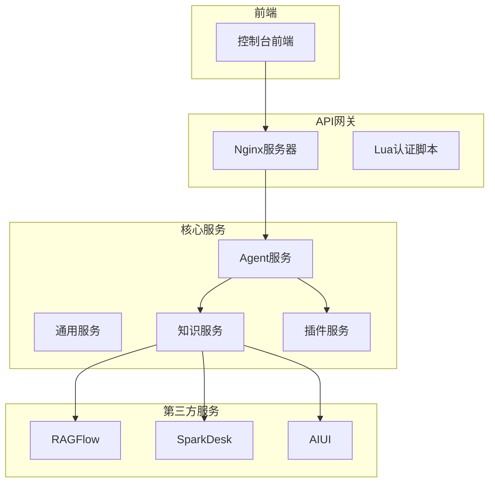
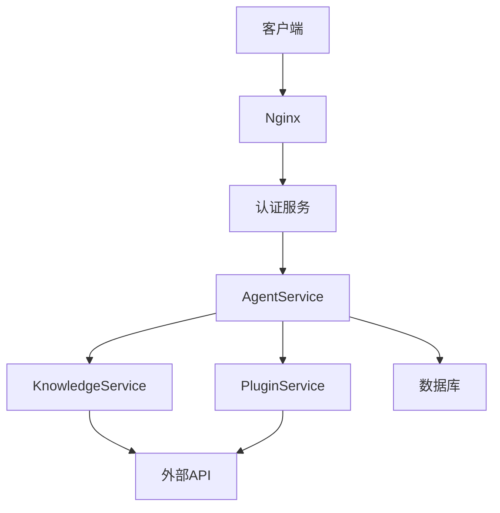
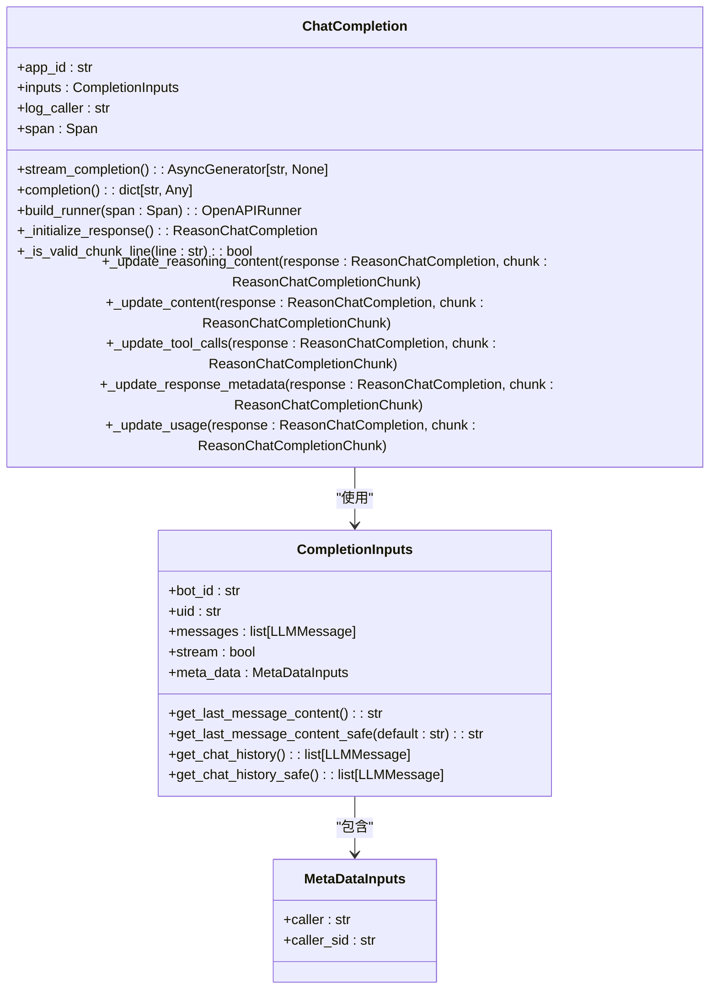
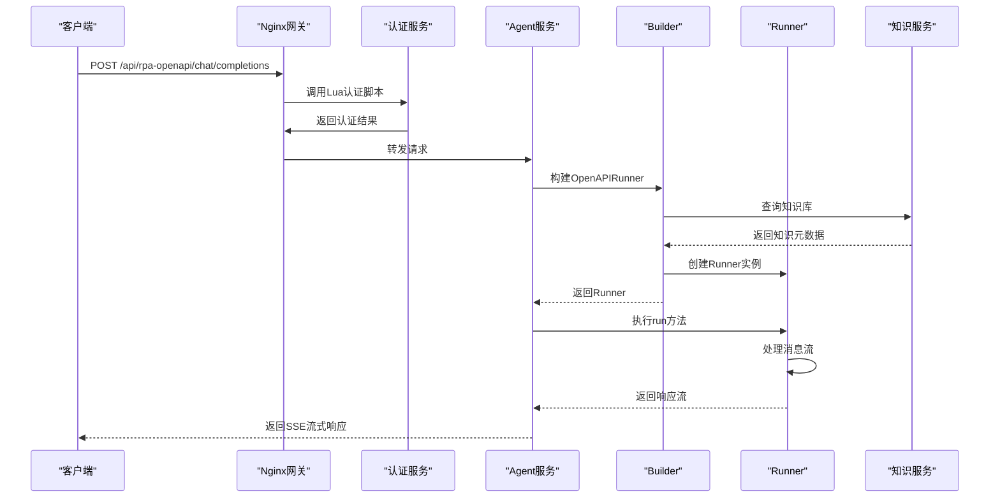
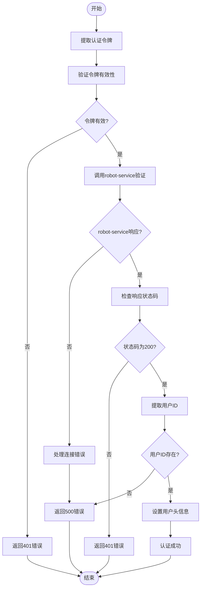
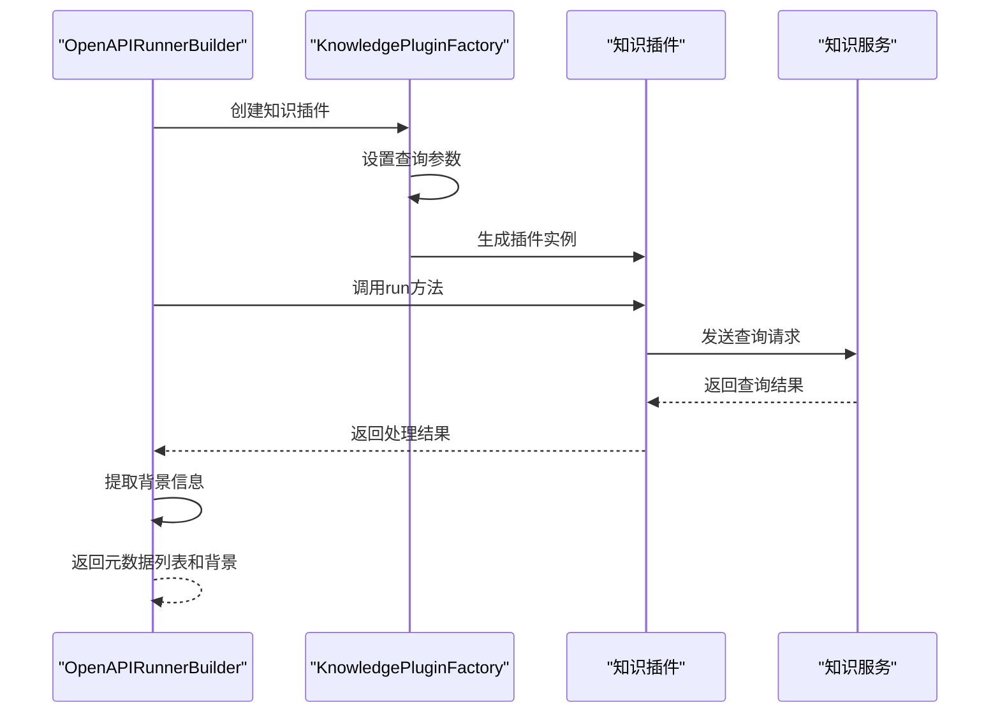
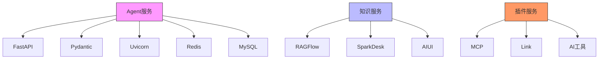

# OpenAPI接口

<cite>
**本文档引用的文件**
- [openapi.py](file://core/agent/api/v1/openapi.py)
- [openapi_inputs.py](file://core/agent/api/schemas/openapi_inputs.py)
- [base_inputs.py](file://core/agent/api/schemas/base_inputs.py)
- [base_api.py](file://core/agent/api/v1/base_api.py)
- [openapi_builder.py](file://core/agent/service/builder/openapi_builder.py)
- [openapi_runner.py](file://core/agent/service/runner/openapi_runner.py)
- [app.py](file://core/agent/api/app.py)
- [default.conf](file://docker/astronAgent/astronRPA/volumes/nginx/default.conf)
- [auth_handler.lua](file://docker/astronAgent/astronRPA/volumes/nginx/lua/auth_handler.lua)
- [init_data.json](file://docker/astronAgent/casdoor/conf/init_data.json)
</cite>

## 目录
1. [简介](#简介)
2. [项目结构](#项目结构)
3. [核心组件](#核心组件)
4. [架构概述](#架构概述)
5. [详细组件分析](#详细组件分析)
6. [依赖分析](#依赖分析)
7. [性能考虑](#性能考虑)
8. [故障排除指南](#故障排除指南)
9. [结论](#结论)

## 简介
本项目是一个基于Python的智能代理系统，提供OpenAPI接口用于与外部系统集成。系统采用FastAPI框架构建，支持流式响应和非流式响应两种模式。API接口通过Nginx进行路由和认证处理，使用Lua脚本实现认证逻辑。系统支持与第三方知识库（如RAGFlow、SparkDesk等）集成，并提供插件化架构支持多种功能扩展。

## 项目结构
项目采用分层架构设计，主要分为控制台前端、核心服务和Docker部署配置三个部分。核心服务包含agent、common、knowledge、memory/database、plugin和workflow等模块，每个模块负责不同的功能。API接口主要位于core/agent/api目录下，通过FastAPI实现。

**图表来源**
- [default.conf](file://docker/astronAgent/astronRPA/volumes/nginx/default.conf)
- [auth_handler.lua](file://docker/astronAgent/astronRPA/volumes/nginx/lua/auth_handler.lua)

**章节来源**
- [default.conf](file://docker/astronAgent/astronRPA/volumes/nginx/default.conf)
- [auth_handler.lua](file://docker/astronAgent/astronRPA/volumes/nginx/lua/auth_handler.lua)

## 核心组件
OpenAPI接口的核心组件包括请求处理、认证授权、知识库查询和响应生成等部分。系统通过CompletionInputs接收客户端请求，经过认证后调用相应的runner处理请求，并将结果转换为标准的OpenAPI响应格式。

**章节来源**
- [openapi.py](file://core/agent/api/v1/openapi.py)
- [openapi_inputs.py](file://core/agent/api/schemas/openapi_inputs.py)
- [base_inputs.py](file://core/agent/api/schemas/base_inputs.py)

## 架构概述
系统采用微服务架构，通过Nginx作为API网关统一处理所有外部请求。Nginx负责路由分发和认证处理，将请求转发给后端的Agent服务。Agent服务使用FastAPI框架实现OpenAPI接口，通过构建不同的runner来处理各种类型的请求。

**图表来源**
- [default.conf](file://docker/astronAgent/astronRPA/volumes/nginx/default.conf)
- [app.py](file://core/agent/api/app.py)

## 详细组件分析

### OpenAPI接口分析
OpenAPI接口是系统与外部集成的主要方式，支持标准的OpenAI API格式。接口通过POST方法接收请求，支持流式和非流式两种响应模式。

#### 接口实现类

**图表来源**
- [openapi.py](file://core/agent/api/v1/openapi.py)
- [openapi_inputs.py](file://core/agent/api/schemas/openapi_inputs.py)
- [base_inputs.py](file://core/agent/api/schemas/base_inputs.py)

#### 请求处理流程

**图表来源**
- [openapi.py](file://core/agent/api/v1/openapi.py)
- [openapi_builder.py](file://core/agent/service/builder/openapi_builder.py)
- [openapi_runner.py](file://core/agent/service/runner/openapi_runner.py)
- [default.conf](file://docker/astronAgent/astronRPA/volumes/nginx/default.conf)

#### 认证流程

**图表来源**
- [auth_handler.lua](file://docker/astronAgent/astronRPA/volumes/nginx/lua/auth_handler.lua)

**章节来源**
- [auth_handler.lua](file://docker/astronAgent/astronRPA/volumes/nginx/lua/auth_handler.lua)

### 知识库集成分析
系统支持与多种第三方知识库集成，包括RAGFlow、SparkDesk和AIUI等。通过知识插件工厂模式实现不同知识库的适配。

#### 知识库查询流程

**图表来源**
- [openapi_builder.py](file://core/agent/service/builder/openapi_builder.py)

## 依赖分析
系统依赖多个外部服务和库，包括FastAPI、Pydantic、Uvicorn等。通过uv.lock文件管理Python依赖，确保依赖版本的一致性。

**图表来源**
- [uv.lock](file://core/agent/uv.lock)
- [pyproject.toml](file://core/agent/pyproject.toml)

**章节来源**
- [uv.lock](file://core/agent/uv.lock)

## 性能考虑
系统在设计时考虑了性能优化，包括使用流式响应减少延迟、通过Redis缓存提高响应速度、使用异步处理提高并发能力等。Nginx配置中设置了较长的超时时间（600秒），以支持长时间运行的请求。

## 故障排除指南
常见问题包括认证失败、知识库查询超时、插件调用错误等。可以通过查看Nginx日志、Lua脚本日志和Agent服务日志来定位问题。对于认证问题，需要检查Lua脚本中的认证逻辑和robot-service的响应。

**章节来源**
- [auth_handler.lua](file://docker/astronAgent/astronRPA/volumes/nginx/lua/auth_handler.lua)
- [openapi.py](file://core/agent/api/v1/openapi.py)

## 结论
本OpenAPI接口文档详细描述了系统的API接口设计、认证机制、知识库集成和性能优化策略。系统采用现代化的微服务架构，通过Nginx网关统一管理API请求，使用FastAPI框架实现高性能的API服务。接口设计遵循OpenAI API标准，便于与现有生态系统集成。