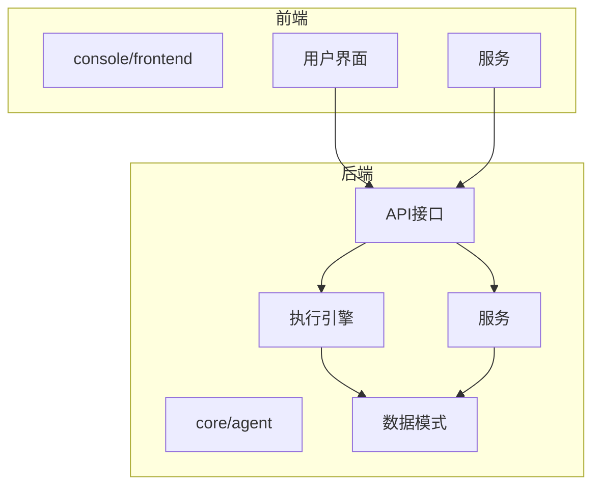
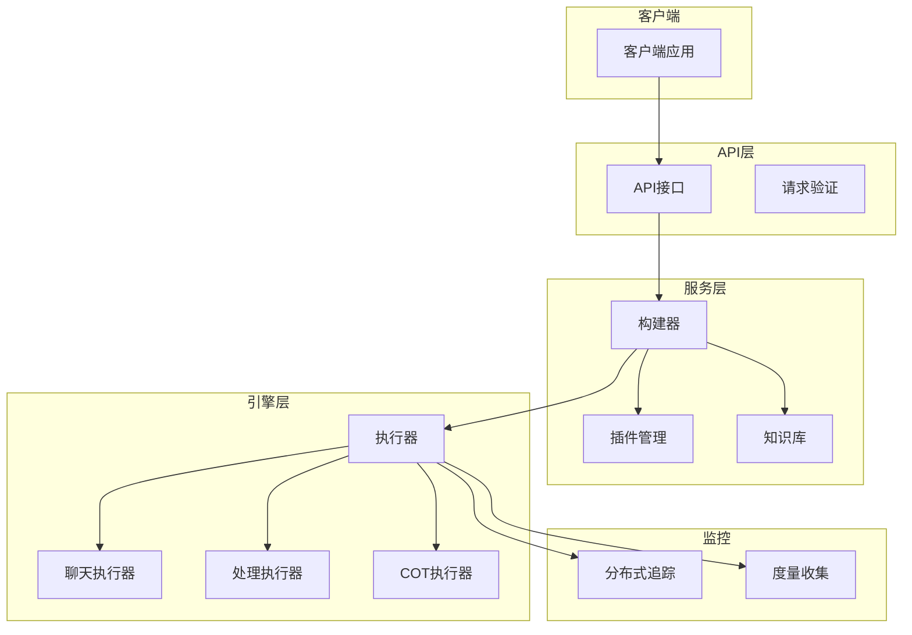
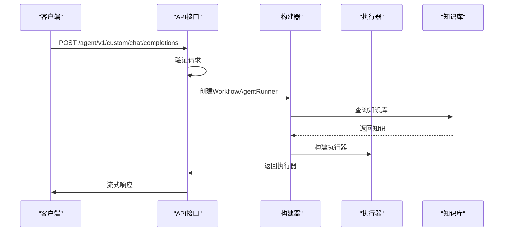
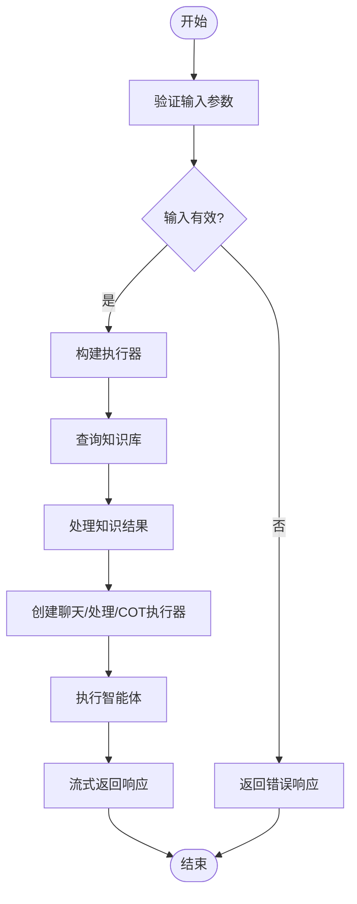
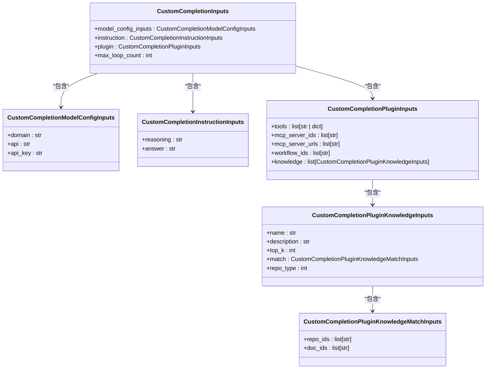
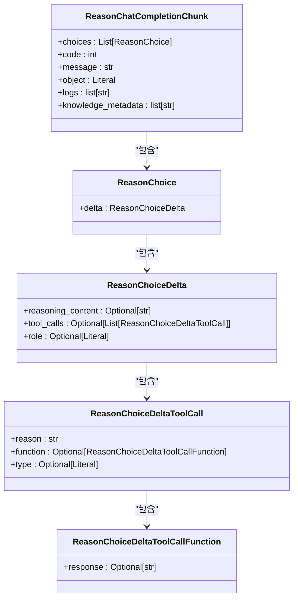
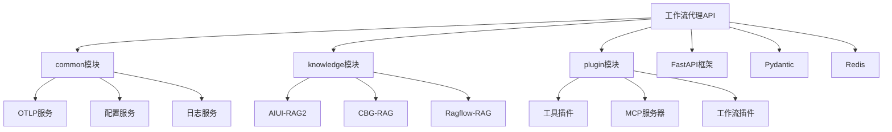

# 工作流代理API

<cite>
**本文档引用的文件**   
- [workflow_agent.py](file://core/agent/api/v1/workflow_agent.py)
- [app.py](file://core/agent/api/app.py)
- [workflow_agent_inputs.py](file://core/agent/api/schemas/workflow_agent_inputs.py)
- [base_inputs.py](file://core/agent/api/schemas/base_inputs.py)
- [completion_chunk.py](file://core/agent/api/schemas/completion_chunk.py)
- [workflow_agent_builder.py](file://core/agent/service/builder/workflow_agent_builder.py)
- [bot_config_mgr_api.py](file://core/agent/api/v1/bot_config_mgr_api.py)
</cite>

## 目录
1. [介绍](#介绍)
2. [项目结构](#项目结构)
3. [核心组件](#核心组件)
4. [架构概述](#架构概述)
5. [详细组件分析](#详细组件分析)
6. [依赖分析](#依赖分析)
7. [性能考虑](#性能考虑)
8. [故障排除指南](#故障排除指南)
9. [结论](#结论)

## 介绍
工作流代理API是astron-agent项目的核心组件，提供智能体执行、调试和流式响应功能。该API作为工作流引擎的代理，处理用户请求并协调各种插件和知识库的集成。API支持流式响应，允许实时获取智能体的执行结果。系统通过分布式追踪和度量收集提供详细的执行日志和性能监控。

## 项目结构
该项目采用分层架构，前端和后端分离。核心功能实现在core目录下，包括agent、common、knowledge、memory/database、plugin和workflow等模块。agent模块包含API接口、引擎、异常处理、基础设施、存储库、服务和测试等子模块。API接口定义在api目录下，使用FastAPI框架实现。数据模型和请求/响应模式定义在schemas目录中。

**Diagram sources**
- [app.py](file://core/agent/api/app.py#L1-L85)
- [workflow_agent.py](file://core/agent/api/v1/workflow_agent.py#L1-L106)

**Section sources**
- [app.py](file://core/agent/api/app.py#L1-L85)
- [workflow_agent.py](file://core/agent/api/v1/workflow_agent.py#L1-L106)

## 核心组件
工作流代理API的核心组件包括API路由、请求处理、流式响应生成和执行引擎。API使用FastAPI框架实现，通过`custom_chat_completions`端点处理用户请求。请求数据通过`CustomCompletionInputs`模式验证，然后传递给`WorkflowAgentRunner`执行。系统支持流式响应，通过`StreamingResponse`返回逐步生成的结果。执行过程中，系统会收集追踪信息和度量数据，用于监控和调试。

**Section sources**
- [workflow_agent.py](file://core/agent/api/v1/workflow_agent.py#L1-L106)
- [workflow_agent_builder.py](file://core/agent/service/builder/workflow_agent_builder.py#L1-L231)

## 架构概述
工作流代理API采用微服务架构，通过清晰的分层设计实现高内聚低耦合。API层负责接收和验证请求，服务层处理业务逻辑，引擎层执行智能体工作流。系统使用分布式追踪（OTLP）和度量收集来监控性能和调试问题。API通过构建器模式创建执行器，支持灵活的配置和扩展。知识库查询通过工厂模式实现，支持多种RAG类型。

**Diagram sources**
- [workflow_agent.py](file://core/agent/api/v1/workflow_agent.py#L1-L106)
- [workflow_agent_builder.py](file://core/agent/service/builder/workflow_agent_builder.py#L1-L231)

## 详细组件分析

### 工作流代理分析
工作流代理是API的核心执行组件，负责协调智能体的执行过程。它通过构建器模式创建，接收用户请求并生成相应的执行器。代理支持多种插件，包括工具、MCP服务器、工作流和知识库。执行过程中，代理会收集详细的追踪信息，包括执行时间、资源使用和错误日志。系统支持最大循环次数限制，防止无限循环。

#### 对于API/服务组件：

**Diagram sources**
- [workflow_agent.py](file://core/agent/api/v1/workflow_agent.py#L1-L106)
- [workflow_agent_builder.py](file://core/agent/service/builder/workflow_agent_builder.py#L1-L231)

#### 对于复杂逻辑组件：

**Diagram sources**
- [workflow_agent_builder.py](file://core/agent/service/builder/workflow_agent_builder.py#L1-L231)
- [workflow_agent.py](file://core/agent/api/v1/workflow_agent.py#L1-L106)

**Section sources**
- [workflow_agent.py](file://core/agent/api/v1/workflow_agent.py#L1-L106)
- [workflow_agent_builder.py](file://core/agent/service/builder/workflow_agent_builder.py#L1-L231)

### 请求模式分析
请求模式定义了客户端与API交互的数据结构。`CustomCompletionInputs`模式是主要的请求体，包含模型配置、指令、插件配置和最大循环次数。模型配置指定LLM的域、API地址和API密钥。指令包含推理和回答内容。插件配置支持工具、MCP服务器、工作流和知识库。知识库配置包括仓库ID、文档ID、top_k值和匹配条件。

**Diagram sources**
- [workflow_agent_inputs.py](file://core/agent/api/schemas/workflow_agent_inputs.py#L1-L51)
- [base_inputs.py](file://core/agent/api/schemas/base_inputs.py#L1-L142)

**Section sources**
- [workflow_agent_inputs.py](file://core/agent/api/schemas/workflow_agent_inputs.py#L1-L51)
- [base_inputs.py](file://core/agent/api/schemas/base_inputs.py#L1-L142)

### 响应模式分析
响应模式定义了API返回给客户端的数据结构。`ReasonChatCompletionChunk`是主要的响应模式，继承自OpenAI的`ChatCompletionChunk`。它包含选择、代码、消息、对象类型、日志和知识库元数据。选择包含增量内容、工具调用和角色信息。工具调用支持工作流、工具和知识库类型。系统支持多种对象类型，包括聊天完成块、日志和知识库元数据。

**Diagram sources**
- [completion_chunk.py](file://core/agent/api/schemas/completion_chunk.py#L1-L46)
- [workflow_agent.py](file://core/agent/api/v1/workflow_agent.py#L1-L106)

**Section sources**
- [completion_chunk.py](file://core/agent/api/schemas/completion_chunk.py#L1-L46)
- [workflow_agent.py](file://core/agent/api/v1/workflow_agent.py#L1-L106)

## 依赖分析
工作流代理API依赖多个内部和外部组件。内部依赖包括common、knowledge、plugin等模块。common模块提供通用服务，如分布式追踪、度量收集和配置管理。knowledge模块提供知识库查询功能，支持多种RAG类型。plugin模块提供工具和MCP服务器集成。外部依赖包括FastAPI、Pydantic、Redis等。系统通过构建器模式和工厂模式实现依赖注入，提高代码的可测试性和可维护性。

**Diagram sources**
- [app.py](file://core/agent/api/app.py#L1-L85)
- [workflow_agent_builder.py](file://core/agent/service/builder/workflow_agent_builder.py#L1-L231)

**Section sources**
- [app.py](file://core/agent/api/app.py#L1-L85)
- [workflow_agent_builder.py](file://core/agent/service/builder/workflow_agent_builder.py#L1-L231)

## 性能考虑
工作流代理API在设计时考虑了性能优化。系统使用流式响应，避免大响应体的内存压力。分布式追踪和度量收集在后台异步执行，不影响主执行路径。知识库查询使用异步任务并行执行，提高查询效率。系统支持最大循环次数限制，防止无限循环导致的资源耗尽。缓存机制用于减少重复计算和外部服务调用。错误处理机制确保系统在异常情况下仍能返回有意义的响应。

## 故障排除指南
当遇到API问题时，首先检查请求格式是否符合`CustomCompletionInputs`模式。验证API密钥和权限是否正确。查看分布式追踪信息，定位执行过程中的瓶颈和错误。检查知识库配置，确保仓库ID和文档ID正确。对于流式响应问题，确认客户端支持SSE（Server-Sent Events）。查看日志中的错误代码和消息，根据错误类型采取相应措施。使用`bot_config_mgr_api`端点管理机器人配置，确保配置正确。

**Section sources**
- [workflow_agent.py](file://core/agent/api/v1/workflow_agent.py#L1-L106)
- [bot_config_mgr_api.py](file://core/agent/api/v1/bot_config_mgr_api.py#L1-L212)

## 结论
工作流代理API是一个功能强大且灵活的智能体执行平台。它通过清晰的分层架构和模块化设计，支持复杂的智能体工作流执行。API提供丰富的配置选项和插件支持，满足多样化的应用场景。流式响应和分布式追踪功能为实时交互和系统监控提供了强大支持。通过合理的性能优化和错误处理，系统能够稳定可靠地处理大量并发请求。未来可以进一步扩展插件生态，增强知识库集成能力，提升智能体的执行效率和质量。