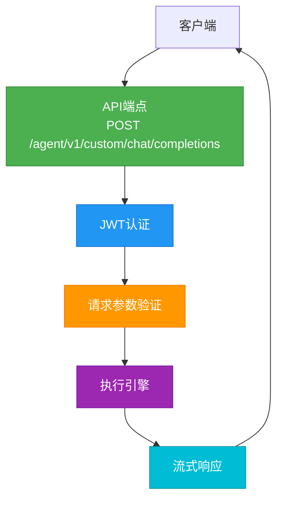
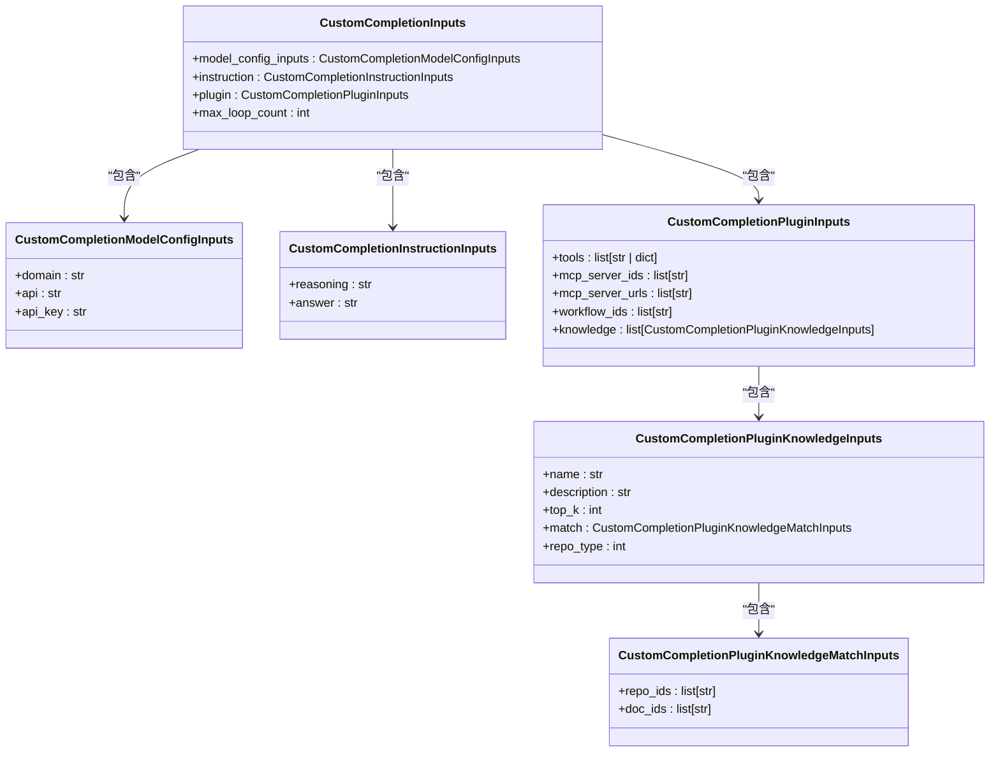
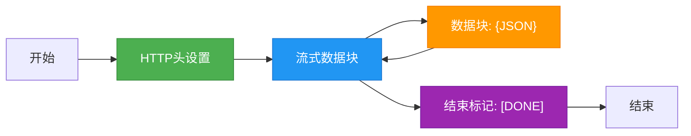
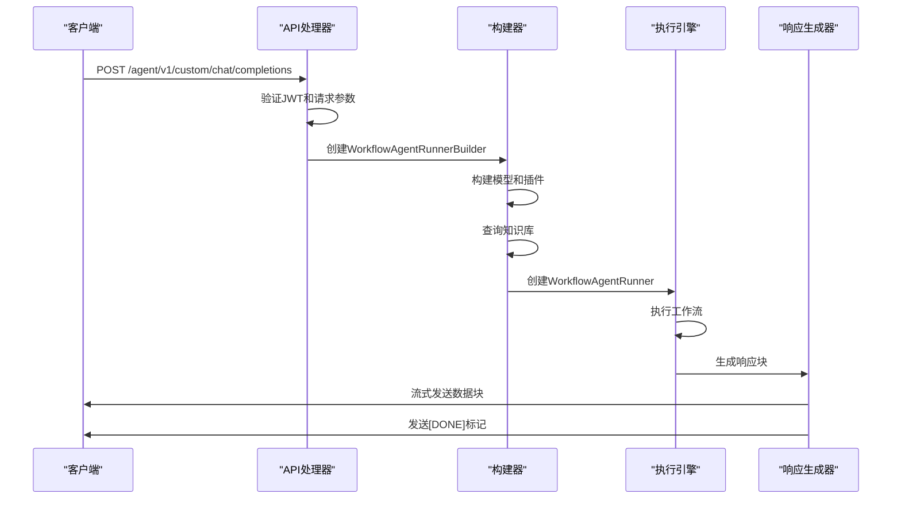
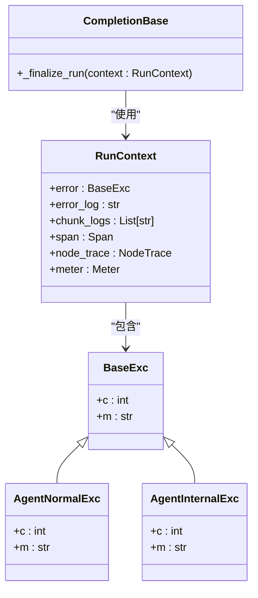
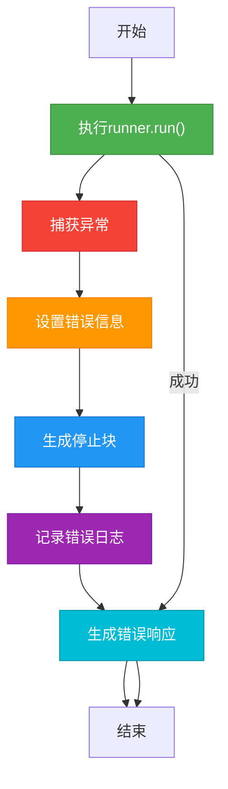

# 执行API

<cite>
**本文档中引用的文件**  
- [workflow_agent.py](file://core/agent/api/v1/workflow_agent.py)
- [workflow_agent_inputs.py](file://core/agent/api/schemas/workflow_agent_inputs.py)
- [base_api.py](file://core/agent/api/v1/base_api.py)
- [completion.py](file://core/agent/api/schemas/completion.py)
- [completion_chunk.py](file://core/agent/api/schemas/completion_chunk.py)
- [workflow_agent_builder.py](file://core/agent/service/builder/workflow_agent_builder.py)
- [workflow_agent_runner.py](file://core/agent/engine/workflow_agent_runner.py)
</cite>

## 目录
1. [简介](#简介)
2. [API端点详情](#api端点详情)
3. [请求参数说明](#请求参数说明)
4. [响应格式说明](#响应格式说明)
5. [执行流程分析](#执行流程分析)
6. [错误处理机制](#错误处理机制)
7. [使用示例](#使用示例)
8. [结论](#结论)

## 简介
本文档详细描述了工作流代理执行API的实现细节。该API允许用户通过HTTP请求触发工作流代理的执行，支持自定义输入参数和用户身份验证。系统基于JWT认证机制，通过FastAPI框架实现RESTful接口，支持流式响应。API设计遵循模块化架构，将请求处理、参数验证、执行引擎和响应生成分离，确保系统的可维护性和可扩展性。

**Section sources**
- [workflow_agent.py](file://core/agent/api/v1/workflow_agent.py)
- [base_api.py](file://core/agent/api/v1/base_api.py)

## API端点详情

### HTTP方法和URL模式
工作流代理执行API使用POST方法，URL模式为`/agent/v1/custom/chat/completions`。该端点用于触发工作流代理的执行，支持流式响应，允许客户端实时接收处理结果。



**Diagram sources**
- [workflow_agent.py](file://core/agent/api/v1/workflow_agent.py)

### 认证方法
API使用JWT（JSON Web Token）进行认证，通过HTTP头`x-consumer-username`传递认证信息。该设计确保了API调用的安全性，防止未授权访问。认证信息在请求处理的初始阶段进行验证，只有通过验证的请求才能继续执行后续逻辑。

**Section sources**
- [workflow_agent.py](file://core/agent/api/v1/workflow_agent.py)

## 请求参数说明

### 核心参数
请求体包含以下核心参数，这些参数定义了工作流代理的执行上下文和行为。

| 参数 | 类型 | 必需 | 描述 | 约束 |
|------|------|------|------|------|
| workflow_id | string | 是 | 工作流唯一标识符 | 最小长度1，最大长度128 |
| inputs | object | 是 | 输入参数对象 | 包含模型配置、指令和插件信息 |
| user_id | string | 是 | 用户唯一标识符 | 最小长度1 |

### 输入参数结构
`inputs`参数包含多个子对象，用于配置工作流代理的不同方面。



**Diagram sources**
- [workflow_agent_inputs.py](file://core/agent/api/schemas/workflow_agent_inputs.py)

#### 模型配置参数
`model_config_inputs`对象定义了LLM（大语言模型）的配置信息：
- **domain**: 模型领域，用于确定模型类型
- **api**: API端点地址，指定模型服务位置
- **api_key**: 认证密钥，用于访问模型服务

#### 指令参数
`instruction`对象包含两个关键指令：
- **reasoning**: 推理指令，指导模型的思考过程
- **answer**: 答案生成指令，定义最终输出的格式和内容要求

#### 插件参数
`plugin`对象配置了工作流代理使用的各种插件：
- **tools**: 工具列表，可以是工具ID或工具定义
- **mcp_server_ids**: MCP服务器ID列表
- **mcp_server_urls**: MCP服务器URL列表
- **workflow_ids**: 子工作流ID列表
- **knowledge**: 知识库配置列表

**Section sources**
- [workflow_agent_inputs.py](file://core/agent/api/schemas/workflow_agent_inputs.py)

## 响应格式说明

### 响应字段
API响应包含以下关键字段，提供执行状态和结果信息。

| 字段 | 类型 | 描述 |
|------|------|------|
| trace_id | string | 跟踪ID，用于请求追踪 |
| status | string | 执行状态（success, error, running） |
| output | object | 执行结果输出 |

### 响应结构
响应采用流式JSON格式，每个数据块以`data: `前缀开始，以`\n\n`结束。最终响应以`data: [DONE]\n\n`标记结束。



**Diagram sources**
- [base_api.py](file://core/agent/api/v1/base_api.py)

### 成功响应示例
```json
data: {"id":"trace-123","code":0,"message":"success","choices":[{"index":0,"finish_reason":"stop","delta":{"content":"Hello, how can I help you?"}}],"created":1700000000,"model":"","object":"chat.completion.chunk"}

data: {"id":"trace-123","code":0,"message":"success","choices":[{"index":0,"finish_reason":"stop","delta":{"content":"I can assist with various tasks."}}],"created":1700000001,"model":"","object":"chat.completion.chunk"}

data: [DONE]
```

**Section sources**
- [completion_chunk.py](file://core/agent/api/schemas/completion_chunk.py)

## 执行流程分析

### 执行引擎调用
API通过`workflow_agent_runner`执行工作流实例。执行流程从接收请求开始，经过参数验证、构建执行上下文、调用执行引擎，最终生成流式响应。



**Diagram sources**
- [workflow_agent.py](file://core/agent/api/v1/workflow_agent.py)
- [workflow_agent_builder.py](file://core/agent/service/builder/workflow_agent_builder.py)
- [workflow_agent_runner.py](file://core/agent/engine/workflow_agent_runner.py)

### 工作流代理构建器
`WorkflowAgentRunnerBuilder`负责构建执行所需的各个组件：
1. 创建LLM模型实例
2. 构建插件系统
3. 查询知识库获取上下文信息
4. 创建聊天和推理执行器
5. 返回配置完整的`WorkflowAgentRunner`

**Section sources**
- [workflow_agent_builder.py](file://core/agent/service/builder/workflow_agent_builder.py)

## 错误处理机制

### 错误分类
系统实现了分层错误处理机制，能够捕获和处理不同类型的错误。



**Diagram sources**
- [base_api.py](file://core/agent/api/v1/base_api.py)
- [exceptions/agent_exc.py](file://core/agent/exceptions/agent_exc.py)

### 错误处理流程
错误处理在`_finalize_run`方法中完成，确保无论执行成功或失败都能生成适当的响应。



**Section sources**
- [base_api.py](file://core/agent/api/v1/base_api.py)

## 使用示例

### Python requests库示例
```python
import requests
import json

url = "http://localhost:8080/agent/v1/custom/chat/completions"
headers = {
    "x-consumer-username": "your-jwt-token",
    "Content-Type": "application/json"
}
data = {
    "workflow_id": "workflow-123",
    "inputs": {
        "model_config": {
            "domain": "general",
            "api": "http://llm-service:8080",
            "api_key": "your-api-key"
        },
        "instruction": {
            "reasoning": "Think step by step",
            "answer": "Provide clear and concise answers"
        },
        "plugin": {
            "tools": [],
            "mcp_server_ids": [],
            "mcp_server_urls": [],
            "workflow_ids": [],
            "knowledge": []
        },
        "max_loop_count": 10
    },
    "uid": "user-123"
}

response = requests.post(url, headers=headers, json=data, stream=True)
for chunk in response.iter_lines():
    if chunk:
        print(chunk.decode())
```

### cURL示例
```bash
curl -X POST "http://localhost:8080/agent/v1/custom/chat/completions" \
  -H "x-consumer-username: your-jwt-token" \
  -H "Content-Type: application/json" \
  -d '{
    "workflow_id": "workflow-123",
    "inputs": {
      "model_config": {
        "domain": "general",
        "api": "http://llm-service:8080",
        "api_key": "your-api-key"
      },
      "instruction": {
        "reasoning": "Think step by step",
        "answer": "Provide clear and concise answers"
      },
      "plugin": {
        "tools": [],
        "mcp_server_ids": [],
        "mcp_server_urls": [],
        "workflow_ids": [],
        "knowledge": []
      },
      "max_loop_count": 10
    },
    "uid": "user-123"
  }' \
  --no-buffer
```

**Section sources**
- [workflow_agent.py](file://core/agent/api/v1/workflow_agent.py)

## 结论
工作流代理执行API提供了一个强大而灵活的接口，用于触发和管理复杂的工作流执行。通过精心设计的请求参数结构和流式响应机制，API能够支持各种应用场景，从简单的问答到复杂的工作流自动化。系统的模块化设计和完善的错误处理机制确保了高可靠性和可维护性，为构建智能代理应用提供了坚实的基础。