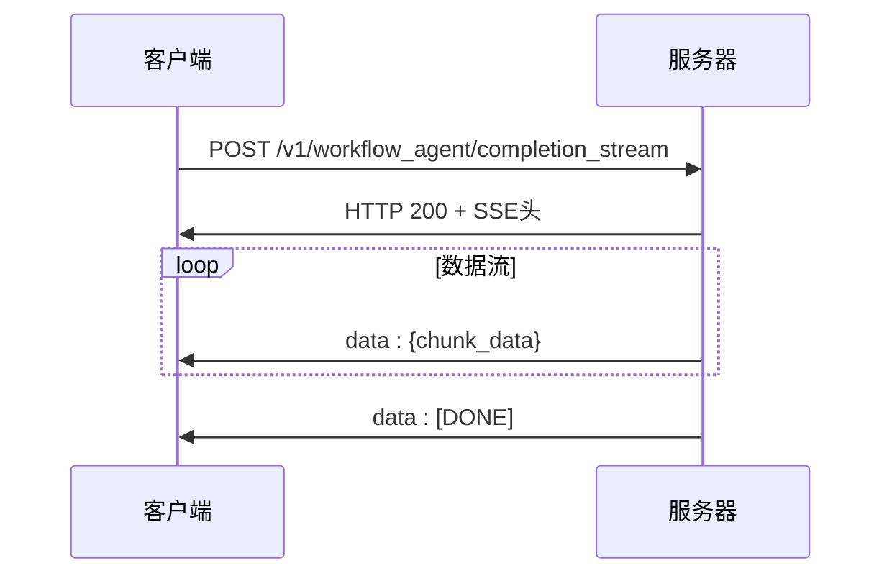
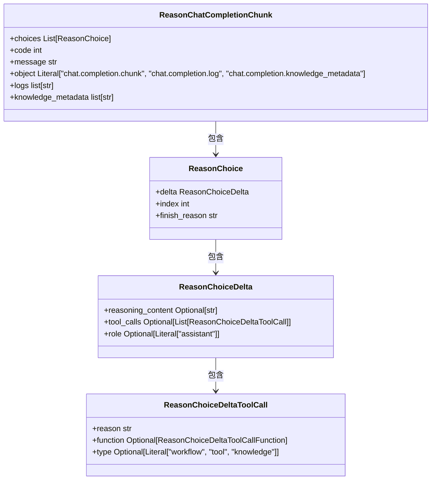
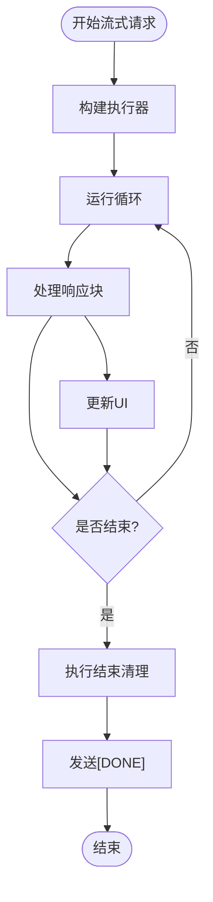

# 流式响应API

<cite>
**本文档引用的文件**   
- [workflow_agent.py](file://core/agent/api/v1/workflow_agent.py)
- [completion_chunk.py](file://core/agent/api/schemas/completion_chunk.py)
- [base_api.py](file://core/agent/api/v1/base_api.py)
- [use-chat.ts](file://console/frontend/src/hooks/use-chat.ts)
- [chat.ts](file://console/frontend/src/services/chat.ts)
- [http.ts](file://console/frontend/src/utils/http.ts)
</cite>

## 目录
1. [简介](#简介)
2. [API端点与协议](#api端点与协议)
3. [流式数据结构](#流式数据结构)
4. [前端客户端实现](#前端客户端实现)
5. [性能与连接管理](#性能与连接管理)
6. [错误处理](#错误处理)
7. [总结](#总结)

## 简介
流式响应API为工作流代理提供实时、低延迟的响应能力。该API采用Server-Sent Events（SSE）协议，允许服务器将响应数据分块推送给客户端，实现渐进式内容呈现。这种设计特别适用于长对话场景，用户可以在模型生成响应的同时看到实时进度更新，提升交互体验。

## API端点与协议
流式响应API通过POST方法暴露在`/v1/workflow_agent/completion_stream`端点上，使用SSE（Server-Sent Events）协议实现流式传输。SSE是一种基于HTTP的单向通信协议，允许服务器持续向客户端推送数据。

API配置了关键的HTTP头信息以确保流式传输的正确性：
- `Cache-Control: no-cache`：禁用缓存，确保客户端接收实时数据
- `X-Accel-Buffering: no`：禁用Nginx等代理服务器的缓冲，实现真正的实时流



**Diagram sources**
- [workflow_agent.py](file://core/agent/api/v1/workflow_agent.py#L1-L105)
- [base_api.py](file://core/agent/api/v1/base_api.py#L1-L226)

**Section sources**
- [workflow_agent.py](file://core/agent/api/v1/workflow_agent.py#L1-L105)

## 流式数据结构
流式响应的数据结构在`completion_chunk.py`文件中定义，基于OpenAI的ChatCompletionChunk进行扩展，支持更丰富的流式功能。

核心数据结构包括：
- `ReasonChatCompletionChunk`：基础响应块，包含代码、消息和对象类型
- `ReasonChoiceDelta`：增量选择，包含推理内容和工具调用
- `ReasonChoiceDeltaToolCall`：工具调用详情，包含类型和函数信息

响应块的`object`字段定义了三种类型：
- `chat.completion.chunk`：常规响应内容
- `chat.completion.log`：日志信息
- `chat.completion.knowledge_metadata`：知识库元数据



**Diagram sources**
- [completion_chunk.py](file://core/agent/api/schemas/completion_chunk.py#L1-L45)

**Section sources**
- [completion_chunk.py](file://core/agent/api/schemas/completion_chunk.py#L1-L45)

## 前端客户端实现
前端通过`use-chat.ts`中的`fetchSSE`函数实现SSE流处理，使用`@microsoft/fetch-event-source`库处理SSE连接。

### JavaScript客户端示例
```javascript
const fetchSSE = async (url, form) => {
  const controller = new AbortController();
  
  fetchEventSource(url, {
    method: 'POST',
    body: form,
    headers: {
      'Accept-Language': 'zh-CN',
      'Authorization': 'Bearer ' + token
    },
    signal: controller.signal,
    onmessage(event) {
      const data = JSON.parse(event.data);
      // 处理不同类型的响应块
      if (data.choices?.[0]?.delta?.content) {
        // 累积内容
        content += data.choices[0].delta.content;
        updateUI(content);
      }
      if (data.workflow_step?.progress) {
        // 更新进度条
        updateProgress(parseFloat(data.workflow_step.progress) * 100);
      }
      if (data.end) {
        // 流结束
        finalizeResponse();
      }
    },
    onerror(err) {
      console.error('SSE连接错误:', err);
    }
  });
};
```

### Python客户端示例
```python
import asyncio
import httpx
from httpx_sse import connect_sse

async def stream_completion():
    async with httpx.AsyncClient() as client:
        async with connect_sse(
            client,
            "POST",
            "http://localhost:8000/v1/workflow_agent/completion_stream",
            json={
                "question": "你好",
                "bot_id": "123",
                "uid": "user_1"
            }
        ) as event_source:
            async for sse_event in event_source.aiter_sse():
                if sse_event.data != "[DONE]":
                    chunk = json.loads(sse_event.data[6:])  # 移除"data: "前缀
                    if chunk.get("choices"):
                        print(chunk["choices"][0]["delta"].get("content", ""))
```

**Section sources**
- [use-chat.ts](file://console/frontend/src/hooks/use-chat.ts#L1-L302)
- [chat.ts](file://console/frontend/src/services/chat.ts#L1-L260)
- [http.ts](file://console/frontend/src/utils/http.ts#L1-L485)

## 性能与连接管理
流式API通过以下机制实现低延迟响应和高效连接管理：

1. **实时进度更新**：通过`workflow_step.progress`字段提供工作流执行进度，客户端可据此更新进度条
2. **连接超时管理**：前端使用AbortController管理SSE连接生命周期，支持手动中断
3. **错误恢复**：实现token刷新机制，在认证失效时自动刷新访问令牌
4. **资源清理**：在流结束或错误时及时清理连接和相关资源

服务端通过`run_runner`方法实现流式处理管道，包含：
- `build_runner`：构建执行器
- `_process_chunk`：处理单个响应块
- `_finalize_run`：运行结束后的清理工作



**Diagram sources**
- [base_api.py](file://core/agent/api/v1/base_api.py#L1-L226)

**Section sources**
- [base_api.py](file://core/agent/api/v1/base_api.py#L1-L226)

## 错误处理
流式API实现了分层错误处理机制：

1. **客户端错误处理**：
   - 网络连接错误：通过onerror回调处理
   - 认证失效：自动刷新token并重试
   - 业务错误：根据错误码显示相应提示

2. **服务端错误处理**：
   - 在`_finalize_run`方法中捕获异常
   - 生成包含错误信息的终止块
   - 记录错误日志和追踪信息

错误响应包含：
- `code`：错误码
- `message`：错误消息
- `finish_reason`：结束原因（如"stop"、"error"）

**Section sources**
- [base_api.py](file://core/agent/api/v1/base_api.py#L1-L226)
- [use-chat.ts](file://console/frontend/src/hooks/use-chat.ts#L1-L302)

## 总结
流式响应API通过SSE协议实现了工作流代理的实时交互能力。该设计在长对话场景中具有显著优势，用户无需等待完整响应生成即可看到部分内容和进度更新。API的分块响应机制支持丰富的交互功能，包括实时进度显示、工具调用溯源和错误恢复。前端通过标准化的SSE处理模式，确保了跨平台客户端的一致性体验。