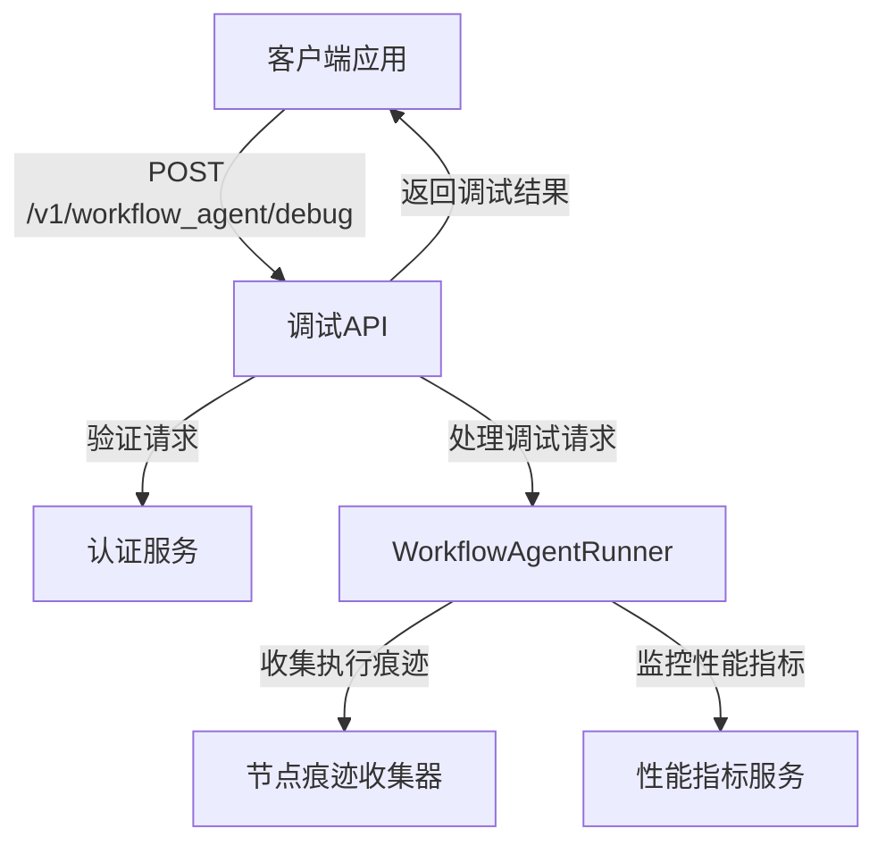
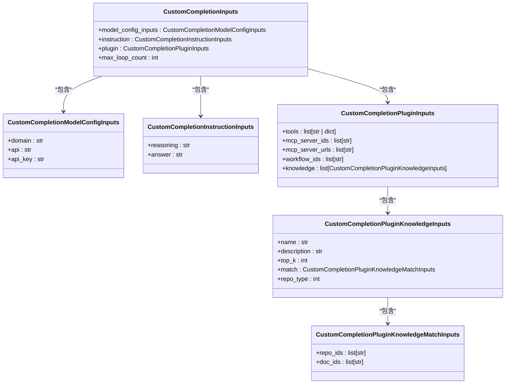
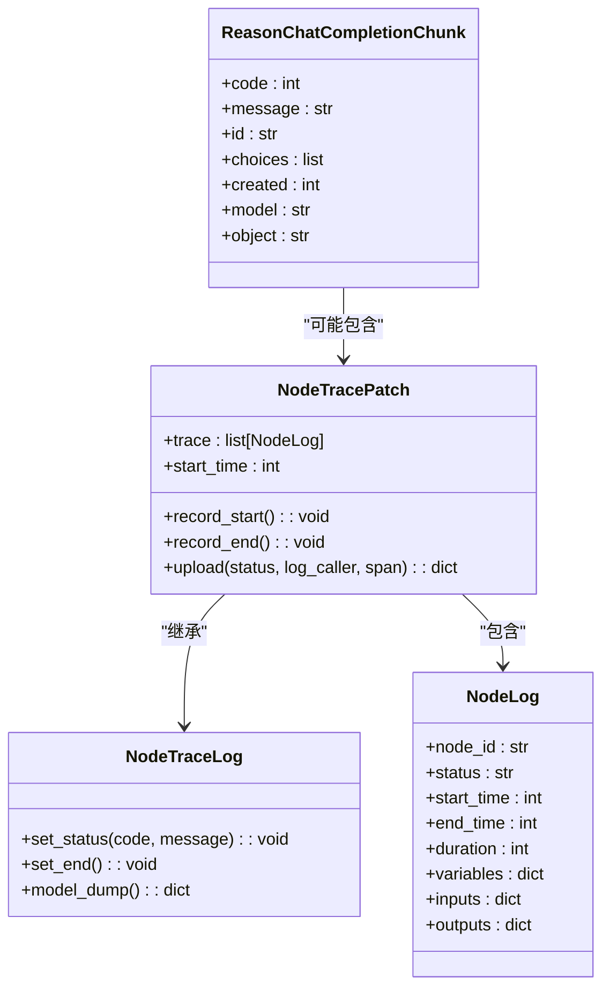
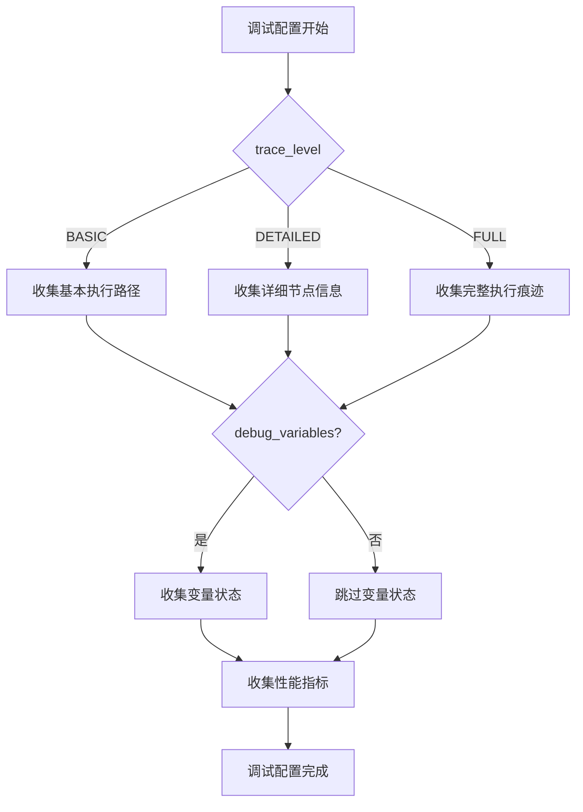
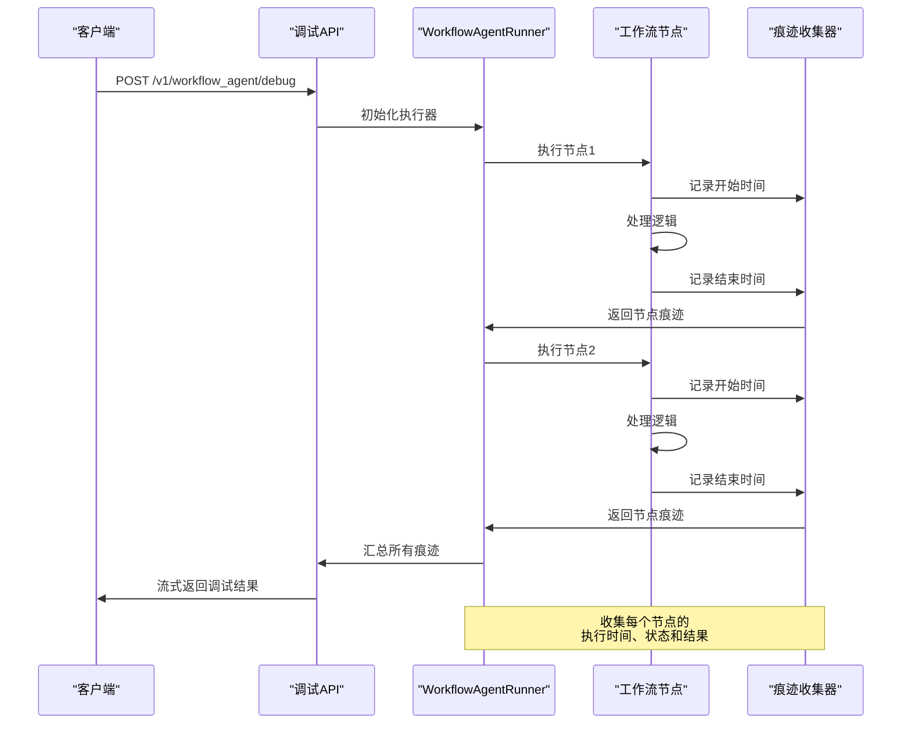
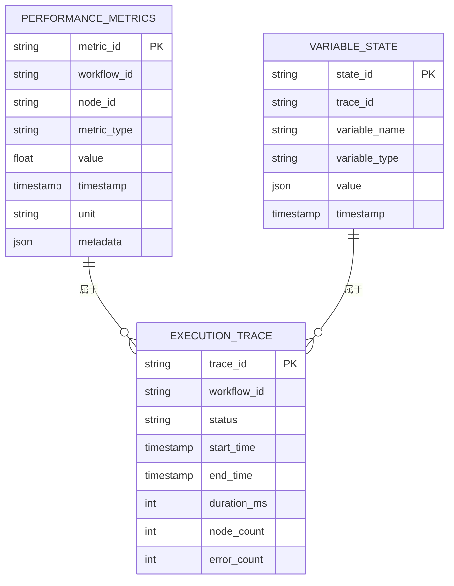
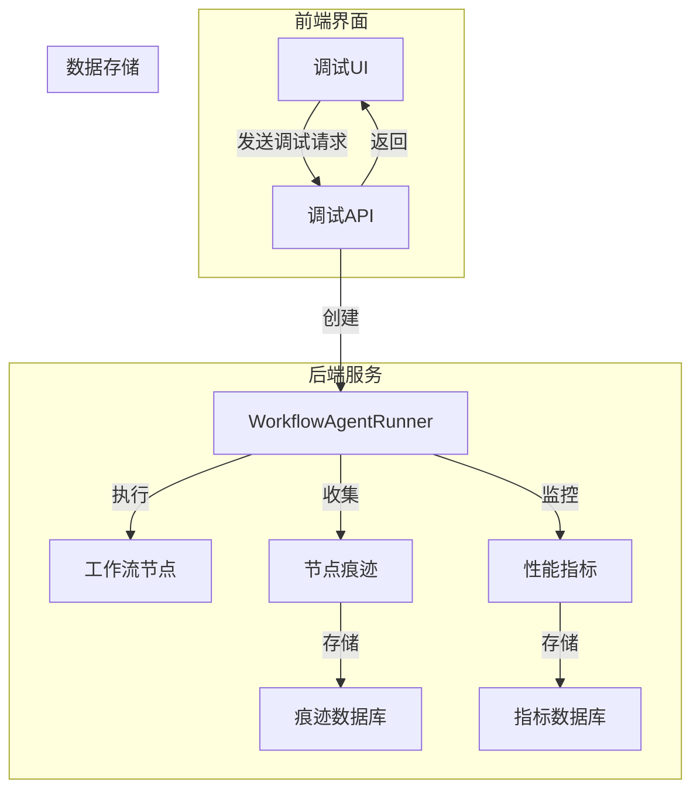
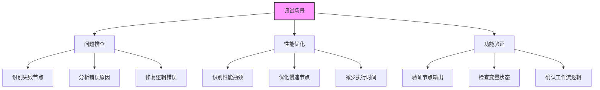

# 调试API

<cite>
**本文档中引用的文件**  
- [workflow_agent.py](file://core/agent/api/v1/workflow_agent.py)
- [workflow_agent_inputs.py](file://core/agent/api/schemas/workflow_agent_inputs.py)
- [workflow_agent_runner.py](file://core/agent/engine/workflow_agent_runner.py)
- [debug.py](file://core/workflow/api/v1/chat/debug.py)
- [node_debug.py](file://core/workflow/api/v1/chat/node_debug.py)
- [node_debug_vo.py](file://core/workflow/domain/entities/node_debug_vo.py)
- [node_trace_patch.py](file://core/agent/api/schemas/node_trace_patch.py)
</cite>

## 目录
1. [简介](#简介)
2. [调试API端点](#调试api端点)
3. [请求参数](#请求参数)
4. [响应结构](#响应结构)
5. [调试模式参数](#调试模式参数)
6. [执行痕迹与状态监控](#执行痕迹与状态监控)
7. [性能指标](#性能指标)
8. [API集成](#api集成)
9. [使用示例](#使用示例)
10. [最佳实践](#最佳实践)

## 简介
调试API为工作流代理提供了详细的调试功能，允许开发者在开发和问题排查过程中获取节点级执行痕迹、变量状态和性能指标。该API通过POST请求与/v1/workflow_agent/debug端点交互，支持详细的调试信息收集和分析。

**Section sources**
- [workflow_agent.py](file://core/agent/api/v1/workflow_agent.py#L1-L106)
- [debug.py](file://core/workflow/api/v1/chat/debug.py#L1-L50)

## 调试API端点
调试API提供了一个主要的调试端点，用于执行工作流代理的调试操作。



**Diagram sources**
- [workflow_agent.py](file://core/agent/api/v1/workflow_agent.py#L1-L106)
- [debug.py](file://core/workflow/api/v1/chat/debug.py#L1-L50)

**Section sources**
- [workflow_agent.py](file://core/agent/api/v1/workflow_agent.py#L1-L106)
- [debug.py](file://core/workflow/api/v1/chat/debug.py#L1-L50)

## 请求参数
调试API接受POST请求，包含必要的认证信息和调试参数。

### HTTP方法和URL模式
- **HTTP方法**: POST
- **URL模式**: /v1/workflow_agent/debug

### 认证方法
API使用基于Header的认证，需要在请求头中包含用户身份信息：
- `x_consumer_username`: 消费者用户名，用于身份验证

### 主要请求参数


**Diagram sources**
- [workflow_agent_inputs.py](file://core/agent/api/schemas/workflow_agent_inputs.py#L1-L51)
- [workflow_agent.py](file://core/agent/api/v1/workflow_agent.py#L1-L106)

**Section sources**
- [workflow_agent_inputs.py](file://core/agent/api/schemas/workflow_agent_inputs.py#L1-L51)
- [workflow_agent.py](file://core/agent/api/v1/workflow_agent.py#L1-L106)

## 响应结构
调试API返回流式响应，包含详细的执行信息和调试数据。

### 响应格式
API返回StreamingResponse，媒体类型为application/json，包含以下头部信息：
- Cache-Control: no-cache
- X-Accel-Buffering: no

### 响应数据结构


**Diagram sources**
- [workflow_agent.py](file://core/agent/api/v1/workflow_agent.py#L1-L106)
- [node_trace_patch.py](file://core/agent/api/schemas/node_trace_patch.py#L1-L51)
- [completion_chunk.py](file://core/agent/api/schemas/completion_chunk.py#L1-L20)

**Section sources**
- [workflow_agent.py](file://core/agent/api/v1/workflow_agent.py#L1-L106)
- [node_trace_patch.py](file://core/agent/api/schemas/node_trace_patch.py#L1-L51)

## 调试模式参数
在调试模式下，API支持额外的请求参数，用于控制调试行为和信息收集级别。

### 调试信息参数
- **debug_info**: 布尔值，指示是否返回详细的调试信息
- **trace_level**: 枚举值，指定痕迹收集的详细程度
  - BASIC: 基本执行路径信息
  - DETAILED: 详细节点执行信息
  - FULL: 完整的执行痕迹，包括变量状态

### 调试配置参数


**Diagram sources**
- [workflow_agent_inputs.py](file://core/agent/api/schemas/workflow_agent_inputs.py#L1-L51)
- [debug.py](file://core/workflow/api/v1/chat/debug.py#L1-L50)

**Section sources**
- [workflow_agent_inputs.py](file://core/agent/api/schemas/workflow_agent_inputs.py#L1-L51)
- [debug.py](file://core/workflow/api/v1/chat/debug.py#L1-L50)

## 执行痕迹与状态监控
调试API提供了详细的节点级执行痕迹和变量状态监控功能。

### 节点执行痕迹


**Diagram sources**
- [workflow_agent_runner.py](file://core/agent/engine/workflow_agent_runner.py#L1-L6)
- [node_trace_patch.py](file://core/agent/api/schemas/node_trace_patch.py#L1-L51)
- [node_debug.py](file://core/workflow/api/v1/chat/node_debug.py#L1-L30)

**Section sources**
- [workflow_agent_runner.py](file://core/agent/engine/workflow_agent_runner.py#L1-L6)
- [node_trace_patch.py](file://core/agent/api/schemas/node_trace_patch.py#L1-L51)

## 性能指标
调试API收集和报告工作流执行的性能指标，帮助优化工作流性能。

### 性能指标类型


**Diagram sources**
- [node_debug_vo.py](file://core/workflow/domain/entities/node_debug_vo.py#L1-L40)
- [node_trace_patch.py](file://core/agent/api/schemas/node_trace_patch.py#L1-L51)

**Section sources**
- [node_debug_vo.py](file://core/workflow/domain/entities/node_debug_vo.py#L1-L40)
- [node_trace_patch.py](file://core/agent/api/schemas/node_trace_patch.py#L1-L51)

## API集成
调试API与workflow_agent_runner的调试功能紧密集成，提供完整的调试解决方案。

### 集成架构


**Diagram sources**
- [workflow_agent.py](file://core/agent/api/v1/workflow_agent.py#L1-L106)
- [workflow_agent_runner.py](file://core/agent/engine/workflow_agent_runner.py#L1-L6)
- [app.py](file://core/agent/api/app.py#L1-L85)

**Section sources**
- [workflow_agent.py](file://core/agent/api/v1/workflow_agent.py#L1-L106)
- [workflow_agent_runner.py](file://core/agent/engine/workflow_agent_runner.py#L1-L6)

## 使用示例
以下示例展示了如何使用调试API进行工作流调试。

### 基本调试请求
```json
{
  "model_config": {
    "domain": "general",
    "api": "llm_api",
    "api_key": "your_api_key"
  },
  "instruction": {
    "reasoning": "analyze the input and provide a response",
    "answer": "generate a comprehensive answer"
  },
  "plugin": {
    "tools": [],
    "mcp_server_ids": [],
    "mcp_server_urls": [],
    "workflow_ids": [],
    "knowledge": []
  },
  "max_loop_count": 10
}
```

### 调试响应示例
```json
{
  "code": 200,
  "message": "success",
  "id": "trace_12345",
  "choices": [
    {
      "node_id": "node_1",
      "status": "success",
      "start_time": 1700000000000,
      "end_time": 1700000001000,
      "duration": 1000,
      "inputs": {
        "question": "What is the weather today?"
      },
      "outputs": {
        "response": "The weather is sunny today."
      },
      "variables": {
        "temperature": 25,
        "condition": "sunny"
      }
    }
  ],
  "created": 1700000000,
  "model": "workflow_agent",
  "object": "chat.completion.chunk"
}
```

**Section sources**
- [workflow_agent.py](file://core/agent/api/v1/workflow_agent.py#L1-L106)
- [node_trace_patch.py](file://core/agent/api/schemas/node_trace_patch.py#L1-L51)

## 最佳实践
使用调试API时，遵循以下最佳实践可以提高调试效率和工作流性能。

### 调试场景


**Diagram sources**
- [debug.py](file://core/workflow/api/v1/chat/debug.py#L1-L50)
- [node_debug.py](file://core/workflow/api/v1/chat/node_debug.py#L1-L30)

**Section sources**
- [debug.py](file://core/workflow/api/v1/chat/debug.py#L1-L50)
- [node_debug.py](file://core/workflow/api/v1/chat/node_debug.py#L1-L30)