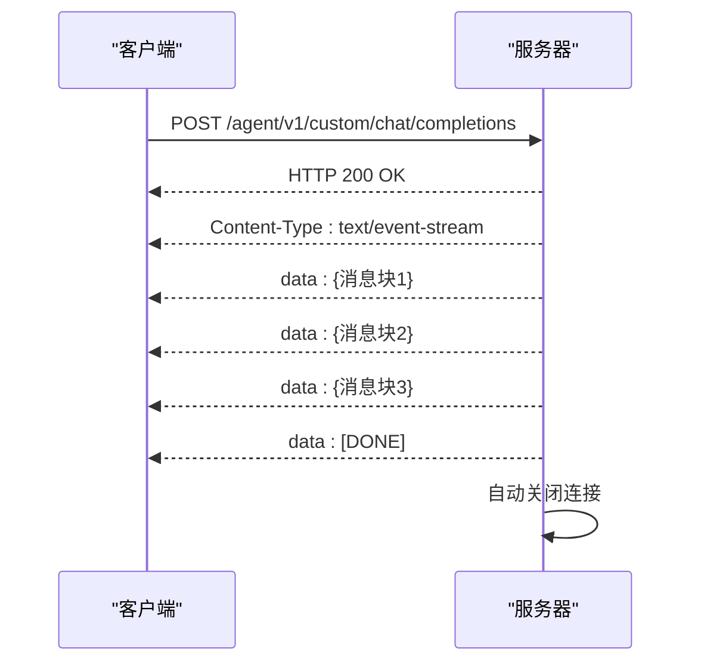

# 工作流API

<cite>
**本文档引用的文件**  
- [workflow_agent.py](file://core/agent/api/v1/workflow_agent.py)
- [chat_service.py](file://core/workflow/service/chat_service.py)
- [chat.ts](file://console/frontend/src/services/chat.ts)
- [base_api.py](file://core/agent/api/v1/base_api.py)
</cite>

## 目录
1. [简介](#简介)
2. [认证与授权](#认证与授权)
3. [聊天会话API](#聊天会话api)
4. [实时通信与SSE](#实时通信与sse)
5. [调试与会话管理](#调试与会话管理)
6. [错误码参考](#错误码参考)
7. [使用示例](#使用示例)

## 简介

本API文档详细描述了工作流服务的聊天接口实时交互模式。系统提供基于Server-Sent Events (SSE)的实时通信机制，支持聊天会话创建、消息发送、调试和会话管理等功能。API设计遵循RESTful原则，使用JSON作为数据交换格式，并通过SSE实现服务器到客户端的实时消息推送。

工作流服务的核心是智能体（Agent）执行引擎，它能够处理复杂的业务流程和决策逻辑。聊天接口作为用户与智能体交互的主要通道，支持流式响应、文件上传、会话历史管理等高级功能。

**Section sources**
- [workflow_agent.py](file://core/agent/api/v1/workflow_agent.py#L1-L106)
- [chat_service.py](file://core/workflow/service/chat_service.py#L1-L1245)

## 认证与授权

### 认证机制
工作流API采用基于HTTP头部的认证机制。客户端需要在每个请求中包含以下认证信息：

- `X-Consumer-Username`: 应用ID，用于标识调用方
- `Authorization`: Bearer令牌（如适用）

```http
POST /agent/v1/custom/chat/completions HTTP/1.1
Host: api.example.com
X-Consumer-Username: your_app_id
Content-Type: application/json
```

### 权限管理
系统通过应用ID（app_id）进行访问控制和配额管理。每个应用ID关联特定的权限策略和使用配额。生产环境和调试环境使用不同的权限策略。

**Section sources**
- [workflow_agent.py](file://core/agent/api/v1/workflow_agent.py#L80-L106)
- [base_api.py](file://core/agent/api/v1/base_api.py#L1-L227)

## 聊天会话API

### 创建聊天会话
创建新的聊天会话，获取会话ID用于后续交互。

**端点**: `POST /chat-list/v1/create-chat-list`  
**方法**: POST  
**认证**: 需要有效应用ID

#### 请求参数
| 参数 | 类型 | 必需 | 描述 |
|------|------|------|------|
| botId | integer | 是 | 智能体ID |

#### 请求示例
```json
{
  "botId": 12345
}
```

#### 响应示例
```json
{
  "id": 98765,
  "botId": 12345,
  "createdAt": "2024-01-01T00:00:00Z"
}
```

### 发送消息
向指定聊天会话发送消息，启用SSE流式响应。

**端点**: `POST /agent/v1/custom/chat/completions`  
**方法**: POST  
**认证**: 需要有效应用ID  
**媒体类型**: `application/json`

#### 请求参数
| 参数 | 类型 | 必需 | 描述 |
|------|------|------|------|
| x_consumer_username | string | 是 | HTTP头部，应用ID |
| inputs | object | 是 | 消息输入对象 |

#### inputs对象结构
| 字段 | 类型 | 必需 | 描述 |
|------|------|------|------|
| messages | array | 是 | 消息数组 |
| uid | string | 是 | 用户ID |
| metaData | object | 否 | 元数据 |

#### 请求示例
```json
{
  "inputs": {
    "messages": [
      {
        "role": "user",
        "content": "你好，今天天气怎么样？"
      }
    ],
    "uid": "user_123",
    "metaData": {
      "caller": "web_client"
    }
  }
}
```

#### 响应格式
使用SSE协议，响应为流式数据：
```
data: {"id":"evt_1","object":"chat.completion.chunk","created":1700000000000,"model":"","choices":[{"index":0,"delta":{"content":"今"},"finish_reason":null}]}
data: {"id":"evt_2","object":"chat.completion.chunk","created":1700000000100,"model":"","choices":[{"index":0,"delta":{"content":"天"},"finish_reason":null}]}
data: {"id":"evt_3","object":"chat.completion.chunk","created":1700000000200,"model":"","choices":[{"index":0,"delta":{"content":"天气"},"finish_reason":null}]}
data: [DONE]
```

**Section sources**
- [workflow_agent.py](file://core/agent/api/v1/workflow_agent.py#L50-L106)
- [chat_service.py](file://core/workflow/service/chat_service.py#L1-L1245)

## 实时通信与SSE

### SSE（Server-Sent Events）概述
SSE是一种服务器向客户端推送实时更新的技术。与WebSocket不同，SSE是单向的（服务器到客户端），基于HTTP协议，更适合聊天应用的消息推送场景。

### SSE特性
- **自动重连**: 客户端支持自动重连机制
- **事件ID跟踪**: 每个事件有唯一ID，便于错误恢复
- **流式传输**: 服务器逐字推送响应，减少等待时间
- **简单协议**: 基于文本的简单协议，易于实现和调试

### 响应事件类型
系统支持多种SSE事件类型：

#### 1. 消息块事件 (chat.completion.chunk)
```json
{
  "id": "event_id",
  "object": "chat.completion.chunk",
  "created": 1700000000000,
  "model": "",
  "choices": [
    {
      "index": 0,
      "delta": {
        "content": "部分响应内容"
      },
      "finish_reason": null
    }
  ]
}
```

#### 2. 停止事件 (stop)
```json
{
  "id": "event_id",
  "object": "chat.completion.chunk",
  "created": 1700000000000,
  "model": "",
  "choices": [
    {
      "index": 0,
      "delta": {},
      "finish_reason": "stop"
    }
  ],
  "usage": {
    "prompt_tokens": 100,
    "completion_tokens": 50,
    "total_tokens": 150
  }
}
```

#### 3. 错误事件
```json
{
  "id": "event_id",
  "object": "chat.completion.chunk",
  "code": 4001,
  "message": "参数验证错误",
  "choices": [
    {
      "index": 0,
      "delta": {},
      "finish_reason": "error"
    }
  ]
}
```

#### 4. 心跳事件 (ping)
```json
{
  "id": "ping_id",
  "object": "chat.completion.chunk",
  "created": 1700000000000,
  "choices": [
    {
      "index": 0,
      "delta": {},
      "finish_reason": "ping"
    }
  ]
}
```

### 连接管理
- **超时设置**: 服务器在30秒无数据后发送心跳
- **错误处理**: 客户端应处理网络错误并实现指数退避重连
- **资源清理**: 服务器在会话结束后自动关闭连接



**Diagram sources**
- [workflow_agent.py](file://core/agent/api/v1/workflow_agent.py#L50-L106)
- [chat_service.py](file://core/workflow/service/chat_service.py#L1-L1245)

**Section sources**
- [workflow_agent.py](file://core/agent/api/v1/workflow_agent.py#L50-L106)
- [chat_service.py](file://core/workflow/service/chat_service.py#L1-L1245)

## 调试与会话管理

### 获取智能体信息
获取指定智能体的配置信息。

**端点**: `GET /chat-list/v1/get-bot-info`  
**方法**: GET

#### 请求参数
| 参数 | 类型 | 必需 | 描述 |
|------|------|------|------|
| botId | integer | 是 | 智能体ID |
| workflowVersion | string | 否 | 工作流版本 |

#### 响应示例
```json
{
  "id": 12345,
  "name": "客服助手",
  "description": "智能客服机器人",
  "version": "1.0.0"
}
```

### 获取会话历史
获取指定聊天会话的完整历史记录。

**端点**: `GET /chat-history/all/{chatId}`  
**方法**: GET

#### 响应示例
```json
[
  {
    "id": 1,
    "role": "user",
    "content": "你好",
    "createdAt": "2024-01-01T00:00:00Z"
  },
  {
    "id": 2,
    "role": "assistant",
    "content": "您好，有什么可以帮助您？",
    "createdAt": "2024-01-01T00:00:01Z"
  }
]
```

### 全新对话
清除当前会话历史，开始新的对话。

**端点**: `POST /chat-restart/restart`  
**方法**: POST

#### 请求参数
| 参数 | 类型 | 必需 | 描述 |
|------|------|------|------|
| chatId | integer | 是 | 聊天会话ID |

### 中止生成
停止正在进行的流式响应生成。

**端点**: `POST /chat-message/stop`  
**方法**: POST

#### 请求参数
| 参数 | 类型 | 必需 | 描述 |
|------|------|------|------|
| streamId | string | 是 | 流ID |

### 清除对话历史
删除指定会话的所有历史记录。

**端点**: `GET /chat-message/clear`  
**方法**: GET

#### 请求参数
| 参数 | 类型 | 必需 | 描述 |
|------|------|------|------|
| chatId | integer | 是 | 聊天会话ID |
| botId | integer | 是 | 智能体ID |

**Section sources**
- [chat.ts](file://console/frontend/src/services/chat.ts#L1-L261)
- [chat_service.py](file://core/workflow/service/chat_service.py#L1-L1245)

## 错误码参考

### 通用错误码
| 错误码 | 描述 | 建议操作 |
|--------|------|----------|
| 4000 | 通用错误 | 检查请求格式 |
| 4001 | 参数验证错误 | 验证请求参数 |
| 4002 | 认证失败 | 检查应用ID和令牌 |
| 4003 | 权限不足 | 检查应用权限 |
| 4004 | 资源不存在 | 验证资源ID |
| 4005 | 配额超限 | 检查使用配额 |

### 业务错误码
| 错误码 | 描述 | 建议操作 |
|--------|------|----------|
| 5001 | 工作流执行错误 | 检查工作流配置 |
| 5002 | 模型调用失败 | 重试或检查模型状态 |
| 5003 | 文件处理错误 | 验证文件格式和大小 |
| 5004 | 数据库连接错误 | 检查数据库配置 |
| 5005 | 缓存服务不可用 | 重试或联系管理员 |

### 客户端错误处理
```javascript
async function handleSSEError(error) {
  switch(error.code) {
    case 4002:
      // 重新获取认证令牌
      await refreshAuthToken();
      break;
    case 4004:
      // 提示用户资源已删除
      showResourceDeleted();
      break;
    case 5001:
      // 显示工作流错误信息
      showWorkflowError(error.message);
      break;
    default:
      // 通用错误处理
      showGenericError();
  }
}
```

**Section sources**
- [base_api.py](file://core/agent/api/v1/base_api.py#L1-L227)
- [chat_service.py](file://core/workflow/service/chat_service.py#L1-L1245)

## 使用示例

### Python示例
```python
import requests
import sseclient

def chat_completion(app_id, bot_id, user_id, message):
    url = "http://localhost:8000/agent/v1/custom/chat/completions"
    
    headers = {
        "X-Consumer-Username": app_id,
        "Content-Type": "application/json"
    }
    
    data = {
        "inputs": {
            "messages": [
                {"role": "user", "content": message}
            ],
            "uid": user_id,
            "metaData": {
                "caller": "python_client"
            }
        }
    }
    
    response = requests.post(
        url, 
        json=data, 
        headers=headers, 
        stream=True
    )
    
    client = sseclient.SSEClient(response)
    
    full_response = ""
    for event in client.events():
        if event.data == "[DONE]":
            break
            
        data = json.loads(event.data)
        if data.get("choices"):
            content = data["choices"][0]["delta"].get("content", "")
            full_response += content
            print(f"流式响应: {content}")
    
    return full_response

# 使用示例
response = chat_completion(
    app_id="your_app_id",
    bot_id="12345",
    user_id="user_123",
    message="请介绍一下你自己"
)
print(f"完整响应: {response}")
```

### cURL示例
```bash
# 发送聊天请求
curl -X POST \
  http://localhost:8000/agent/v1/custom/chat/completions \
  -H "X-Consumer-Username: your_app_id" \
  -H "Content-Type: application/json" \
  -d '{
    "inputs": {
      "messages": [
        {
          "role": "user",
          "content": "你好"
        }
      ],
      "uid": "user_123",
      "metaData": {
        "caller": "curl_client"
      }
    }
  }' \
  --no-buffer

# 创建聊天会话
curl -X POST \
  http://localhost:8000/chat-list/v1/create-chat-list \
  -H "Content-Type: application/json" \
  -d '{
    "botId": 12345
  }'
```

### JavaScript示例
```javascript
class WorkflowClient {
  constructor(appId) {
    this.appId = appId;
    this.baseUrl = 'http://localhost:8000';
  }

  async createChatSession(botId) {
    const response = await fetch(`${this.baseUrl}/chat-list/v1/create-chat-list`, {
      method: 'POST',
      headers: {
        'Content-Type': 'application/json',
      },
      body: JSON.stringify({ botId })
    });
    
    const data = await response.json();
    return data.id;
  }

  async chatStream(chatId, message, onChunk, onDone, onError) {
    const controller = new AbortController();
    
    try {
      const response = await fetch(`${this.baseUrl}/agent/v1/custom/chat/completions`, {
        method: 'POST',
        headers: {
          'X-Consumer-Username': this.appId,
          'Content-Type': 'application/json',
        },
        body: JSON.stringify({
          inputs: {
            messages: [{ role: 'user', content: message }],
            uid: `user_${Date.now()}`,
            metaData: { caller: 'web_client' }
          }
        }),
        signal: controller.signal
      });

      if (!response.body) {
        throw new Error('ReadableStream not supported');
      }

      const reader = response.body.getReader();
      const decoder = new TextDecoder();
      let buffer = '';

      while (true) {
        const { value, done } = await reader.read();
        
        if (done) break;
        
        buffer += decoder.decode(value, { stream: true });
        
        // 处理SSE数据
        const lines = buffer.split('\n');
        buffer = lines.pop(); // 保留未完成的行
        
        for (const line of lines) {
          if (line.startsWith('data: ')) {
            const data = line.slice(6);
            
            if (data === '[DONE]') {
              onDone();
              return;
            }
            
            try {
              const json = JSON.parse(data);
              onChunk(json);
            } catch (e) {
              console.error('解析JSON失败:', e);
            }
          }
        }
      }
    } catch (error) {
      if (error.name === 'AbortError') {
        console.log('请求被取消');
      } else {
        onError(error);
      }
    }
  }

  stopStream() {
    this.controller?.abort();
  }
}

// 使用示例
const client = new WorkflowClient('your_app_id');

// 创建会话
const chatId = await client.createChatSession(12345);

// 发送消息
client.chatStream(
  chatId,
  '请介绍一下你自己',
  (chunk) => {
    const content = chunk.choices?.[0]?.delta?.content;
    if (content) {
      console.log('实时响应:', content);
    }
  },
  () => console.log('响应完成'),
  (error) => console.error('错误:', error)
);
```

**Section sources**
- [chat.ts](file://console/frontend/src/services/chat.ts#L1-L261)
- [workflow_agent.py](file://core/agent/api/v1/workflow_agent.py#L50-L106)