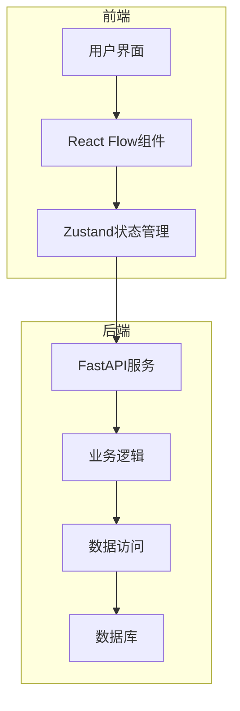
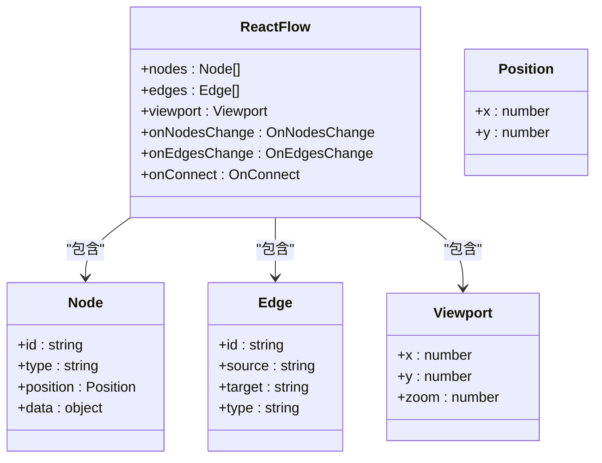
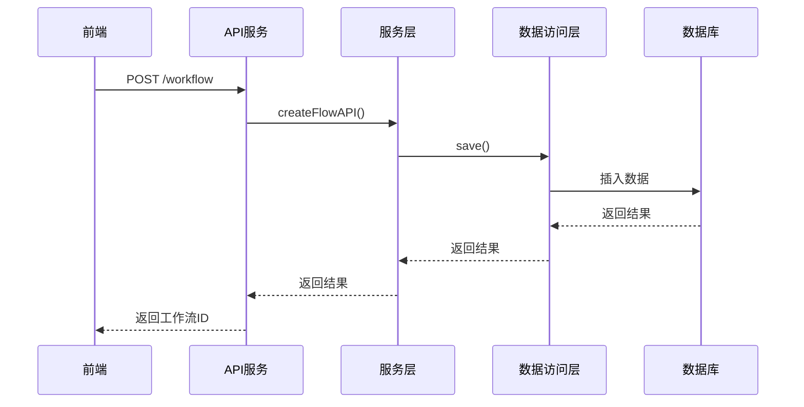
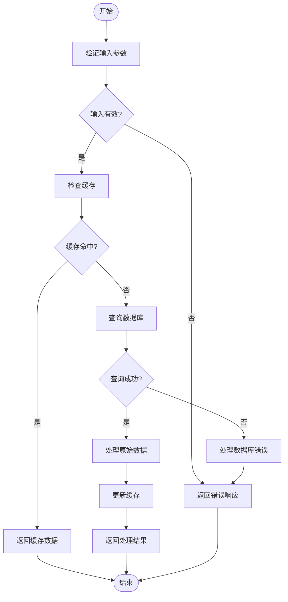

# 布局API

<cite>
**本文档中引用的文件**   
- [flow.ts](file://console/frontend/src/services/flow.ts)
- [use-flow-store.ts](file://console/frontend/src/components/workflow/store/use-flow-store.ts)
- [reactflowUtils.ts](file://console/frontend/src/components/workflow/utils/reactflowUtils.ts)
- [use-flow-common.ts](file://console/frontend/src/components/workflow/hooks/use-flow-common.ts)
- [flow_service.py](file://core/workflow/service/flow_service.py)
- [flow_dao.py](file://core/workflow/repository/flow_dao.py)
- [router.py](file://core/workflow/api/v1/router.py)
</cite>

## 目录
1. [简介](#简介)
2. [项目结构](#项目结构)
3. [核心组件](#核心组件)
4. [架构概述](#架构概述)
5. [详细组件分析](#详细组件分析)
6. [依赖分析](#依赖分析)
7. [性能考虑](#性能考虑)
8. [故障排除指南](#故障排除指南)
9. [结论](#结论)
10. [附录](#附录)（如有必要）

## 简介
本文档详细描述了工作流布局API的功能，重点介绍工作流画布布局的保存、恢复和同步功能。文档涵盖了布局管理端点的HTTP方法、URL模式、请求/响应模式，以及布局数据的序列化格式、坐标系统和节点连接信息存储结构。此外，还提供了每个端点的详细参数说明、返回值描述和错误码列表，以及使用示例代码（Python、cURL等）和典型请求/响应示例，展示布局JSON结构。同时，解释了布局与工作流定义的关联机制、多设备布局同步策略、布局版本控制，以及前端React Flow组件与后端布局API的集成方案和性能优化建议。

## 项目结构
该项目包含前端和后端两个主要部分。前端位于`console/frontend`目录，使用React和TypeScript构建，集成了React Flow库来实现工作流画布功能。后端位于`core/workflow`目录，使用Python和FastAPI框架构建，负责处理工作流的创建、更新、删除和执行等操作。前端通过API调用与后端通信，实现工作流的完整生命周期管理。

**图源**
- [flow.ts](file://console/frontend/src/services/flow.ts#L0-L204)
- [flow_service.py](file://core/workflow/service/flow_service.py#L0-L426)

**章节源**
- [flow.ts](file://console/frontend/src/services/flow.ts#L0-L204)
- [flow_service.py](file://core/workflow/service/flow_service.py#L0-L426)

## 核心组件
工作流布局API的核心组件包括前端的React Flow集成、Zustand状态管理，以及后端的FastAPI路由、服务层和数据访问层。前端通过React Flow组件实现可视化的工作流画布，Zustand用于管理画布状态，包括节点、边和视口信息。后端通过FastAPI提供RESTful API，处理工作流的CRUD操作，服务层实现业务逻辑，数据访问层与数据库交互。

**章节源**
- [use-flow-store.ts](file://console/frontend/src/components/workflow/store/use-flow-store.ts#L0-L82)
- [flow_service.py](file://core/workflow/service/flow_service.py#L0-L426)

## 架构概述
系统架构采用前后端分离的设计，前端负责用户界面和交互，后端负责业务逻辑和数据存储。前端通过HTTP请求与后端API通信，获取和更新工作流数据。后端使用FastAPI框架，提供RESTful API，服务层处理业务逻辑，数据访问层与数据库交互。数据库使用SQLModel进行ORM映射，确保数据的一致性和完整性。

**图源**
- [flow.ts](file://console/frontend/src/services/flow.ts#L0-L204)
- [flow_service.py](file://core/workflow/service/flow_service.py#L0-L426)

## 详细组件分析

### 工作流画布组件分析
工作流画布组件基于React Flow库实现，提供了丰富的节点和边的自定义功能。通过Zustand状态管理，实现了画布状态的集中管理，包括节点、边和视口信息。前端通过API调用与后端通信，实现工作流的保存、加载和执行。

#### 对象导向组件：

**图源**
- [use-flow-store.ts](file://console/frontend/src/components/workflow/store/use-flow-store.ts#L0-L82)
- [reactflowUtils.ts](file://console/frontend/src/components/workflow/utils/reactflowUtils.ts#L0-L799)

#### API/服务组件：

**图源**
- [flow.ts](file://console/frontend/src/services/flow.ts#L0-L204)
- [flow_service.py](file://core/workflow/service/flow_service.py#L0-L426)

#### 复杂逻辑组件：

**图源**
- [flow_service.py](file://core/workflow/service/flow_service.py#L0-L426)
- [flow_dao.py](file://core/workflow/repository/flow_dao.py#L0-L73)

**章节源**
- [use-flow-store.ts](file://console/frontend/src/components/workflow/store/use-flow-store.ts#L0-L82)
- [reactflowUtils.ts](file://console/frontend/src/components/workflow/utils/reactflowUtils.ts#L0-L799)
- [flow_service.py](file://core/workflow/service/flow_service.py#L0-L426)

### 概念概述
工作流布局API的设计旨在提供一个灵活且可扩展的解决方案，用于管理和操作工作流。通过前后端分离的架构，实现了高内聚低耦合的设计原则，使得前端和后端可以独立开发和部署。前端使用React Flow库提供了强大的可视化功能，后端使用FastAPI框架提供了高性能的API服务。

[无源，因为此图显示的是概念工作流，而不是实际的代码结构]

[无源，因为此部分不分析特定文件]

## 依赖分析
工作流布局API的依赖关系主要体现在前端和后端之间的通信，以及后端各层之间的调用。前端依赖React Flow库实现可视化功能，Zustand用于状态管理。后端依赖FastAPI框架提供API服务，SQLModel用于ORM映射，Redis用于缓存管理。

**图源**
- [flow.ts](file://console/frontend/src/services/flow.ts#L0-L204)
- [flow_service.py](file://core/workflow/service/flow_service.py#L0-L426)

**章节源**
- [flow.ts](file://console/frontend/src/services/flow.ts#L0-L204)
- [flow_service.py](file://core/workflow/service/flow_service.py#L0-L426)

## 性能考虑
为了提高性能，工作流布局API采用了多种优化策略。首先，通过Redis缓存频繁访问的数据，减少数据库查询次数。其次，使用异步编程模型，提高API的响应速度。此外，前端通过Zustand状态管理，减少了不必要的重新渲染，提高了用户体验。

[无源，因为此部分提供一般性指导]

## 故障排除指南
在使用工作流布局API时，可能会遇到一些常见问题。例如，API调用失败可能是由于网络问题或服务器错误。此时，可以检查网络连接，查看服务器日志，确认API端点是否正确。另外，前端状态管理问题可能导致画布显示异常，可以通过清除浏览器缓存或重新加载页面来解决。

**章节源**
- [flow.ts](file://console/frontend/src/services/flow.ts#L0-L204)
- [flow_service.py](file://core/workflow/service/flow_service.py#L0-L426)

## 结论
工作流布局API提供了一个强大且灵活的解决方案，用于管理和操作工作流。通过前后端分离的架构，实现了高内聚低耦合的设计原则，使得系统易于维护和扩展。前端使用React Flow库提供了强大的可视化功能，后端使用FastAPI框架提供了高性能的API服务。通过合理的依赖管理和性能优化，确保了系统的稳定性和高效性。

[无源，因为此部分总结而不分析特定文件]