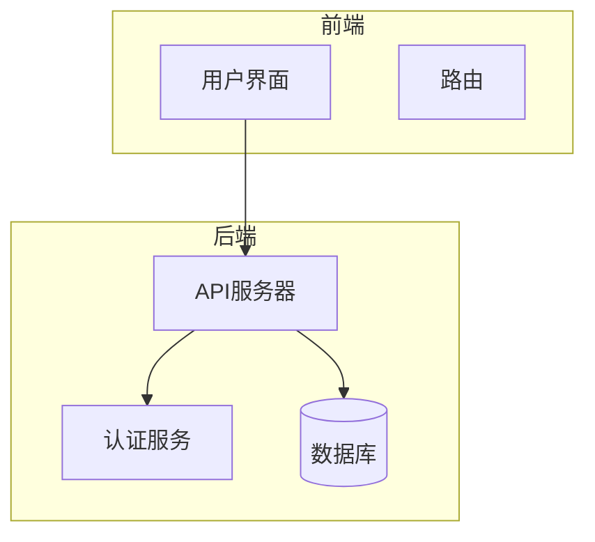
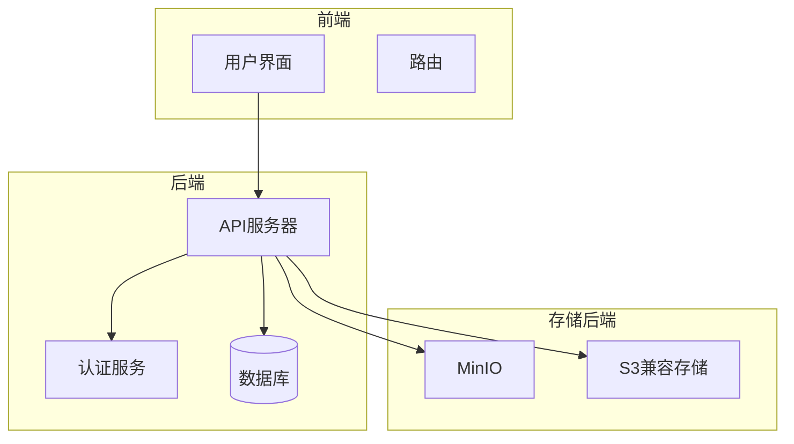
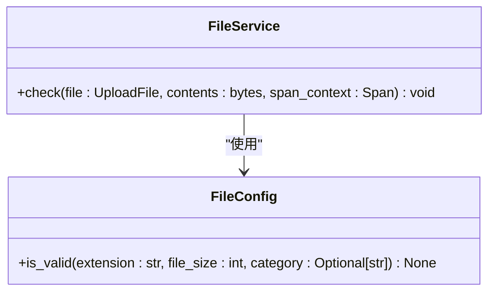
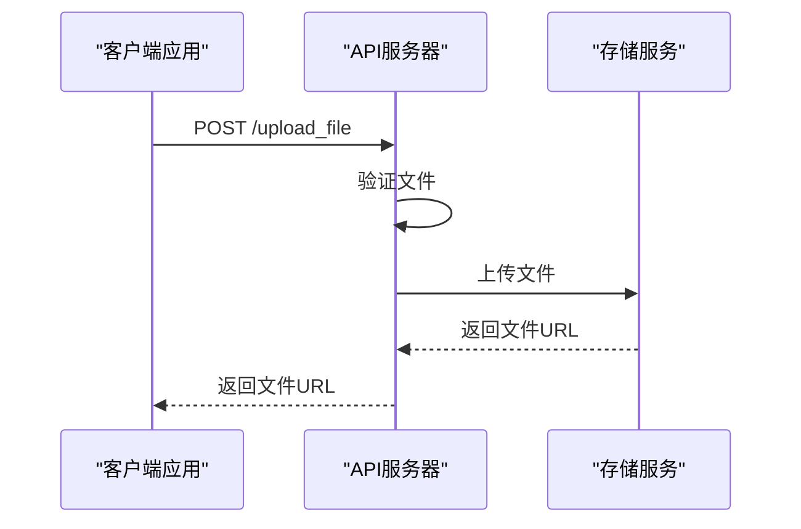
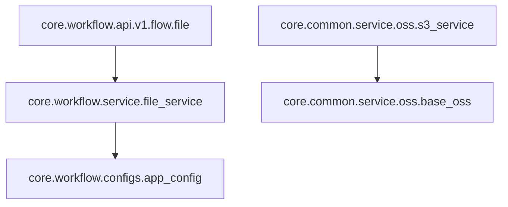

# 文件API

<cite>
**本文档引用的文件**
- [file.py](file://core/workflow/api/v1/flow/file.py)
- [file_service.py](file://core/workflow/service/file_service.py)
- [app_config.py](file://core/workflow/configs/app_config.py)
- [s3_service.py](file://core/common/service/oss/s3_service.py)
- [base_oss.py](file://core/common/service/oss/base_oss.py)
- [use-document-page.tsx](file://console/frontend/src/pages/resource-management/knowledge-detail/document-page/hooks/use-document-page.tsx)
- [knowledge.ts](file://console/frontend/src/services/knowledge.ts)
- [resource.ts](file://console/frontend/src/types/resource.ts)
</cite>

## 目录
1. [简介](#简介)
2. [项目结构](#项目结构)
3. [核心组件](#核心组件)
4. [架构概述](#架构概述)
5. [详细组件分析](#详细组件分析)
6. [依赖分析](#依赖分析)
7. [性能考虑](#性能考虑)
8. [故障排除指南](#故障排除指南)
9. [结论](#结论)

## 简介
本文档详细描述了工作流系统中的文件API，重点介绍文件上传、下载和管理功能。文档涵盖了文件操作端点的HTTP方法、URL模式、请求/响应模式，以及文件上传、下载、删除等操作的实现细节。文档还解释了文件存储后端（如MinIO）、文件权限控制和文件版本管理机制，并提供了大文件上传优化建议和错误处理策略。

## 项目结构
项目结构包括前端和后端两个主要部分。前端位于`console/frontend`目录，后端位于`core`目录。文件API相关的代码主要分布在`core/workflow/api/v1/flow/file.py`和`core/workflow/service/file_service.py`中。

**图表来源**
- [file.py](file://core/workflow/api/v1/flow/file.py#L1-L112)
- [file_service.py](file://core/workflow/service/file_service.py#L1-L33)

**章节来源**
- [file.py](file://core/workflow/api/v1/flow/file.py#L1-L112)
- [file_service.py](file://core/workflow/service/file_service.py#L1-L33)

## 核心组件
核心组件包括文件上传、下载和管理功能。文件上传功能通过`upload_file`和`upload_files`端点实现，支持单个和多个文件上传。文件管理功能包括文件列表查询、文件夹创建、文件更新和启用/禁用文件。

**章节来源**
- [file.py](file://core/workflow/api/v1/flow/file.py#L1-L112)
- [file_service.py](file://core/workflow/service/file_service.py#L1-L33)

## 架构概述
系统架构包括前端、后端和存储后端。前端通过API与后端通信，后端处理文件上传、下载和管理请求，并将文件存储在MinIO或S3兼容的存储服务中。

**图表来源**
- [file.py](file://core/workflow/api/v1/flow/file.py#L1-L112)
- [s3_service.py](file://core/common/service/oss/s3_service.py#L1-L198)

## 详细组件分析
### 文件上传分析
文件上传功能通过`upload_file`和`upload_files`端点实现，支持单个和多个文件上传。上传的文件经过验证后存储在MinIO或S3兼容的存储服务中。

#### 对象导向组件：

**图表来源**
- [file_service.py](file://core/workflow/service/file_service.py#L1-L33)
- [app_config.py](file://core/workflow/configs/app_config.py#L1-L149)

#### API/服务组件：

**图表来源**
- [file.py](file://core/workflow/api/v1/flow/file.py#L1-L112)
- [s3_service.py](file://core/common/service/oss/s3_service.py#L1-L198)

**章节来源**
- [file.py](file://core/workflow/api/v1/flow/file.py#L1-L112)
- [file_service.py](file://core/workflow/service/file_service.py#L1-L33)

### 文件管理分析
文件管理功能包括文件列表查询、文件夹创建、文件更新和启用/禁用文件。这些功能通过相应的API端点实现，支持对文件和文件夹的增删改查操作。

**章节来源**
- [use-document-page.tsx](file://console/frontend/src/pages/resource-management/knowledge-detail/document-page/hooks/use-document-page.tsx#L1-L587)
- [knowledge.ts](file://console/frontend/src/services/knowledge.ts#L1-L340)

## 依赖分析
系统依赖包括MinIO、S3兼容存储服务、MySQL数据库和Redis缓存。这些依赖通过相应的配置文件进行配置，并在运行时加载。

**图表来源**
- [file.py](file://core/workflow/api/v1/flow/file.py#L1-L112)
- [file_service.py](file://core/workflow/service/file_service.py#L1-L33)
- [s3_service.py](file://core/common/service/oss/s3_service.py#L1-L198)

**章节来源**
- [file.py](file://core/workflow/api/v1/flow/file.py#L1-L112)
- [file_service.py](file://core/workflow/service/file_service.py#L1-L33)
- [s3_service.py](file://core/common/service/oss/s3_service.py#L1-L198)

## 性能考虑
系统在处理大文件上传时，建议使用分块上传策略以提高上传效率和可靠性。此外，系统通过MinIO或S3兼容存储服务的公共读取策略优化文件下载性能。

## 故障排除指南
常见问题包括文件上传失败、文件下载失败和文件管理操作失败。这些问题通常与文件大小限制、文件类型限制或存储服务配置有关。建议检查文件大小和类型是否符合要求，并确保存储服务配置正确。

**章节来源**
- [file.py](file://core/workflow/api/v1/flow/file.py#L1-L112)
- [file_service.py](file://core/workflow/service/file_service.py#L1-L33)

## 结论
本文档详细描述了工作流系统中的文件API，涵盖了文件上传、下载和管理功能的实现细节。通过本文档，开发者可以更好地理解和使用文件API，优化文件操作性能，并有效处理常见问题。