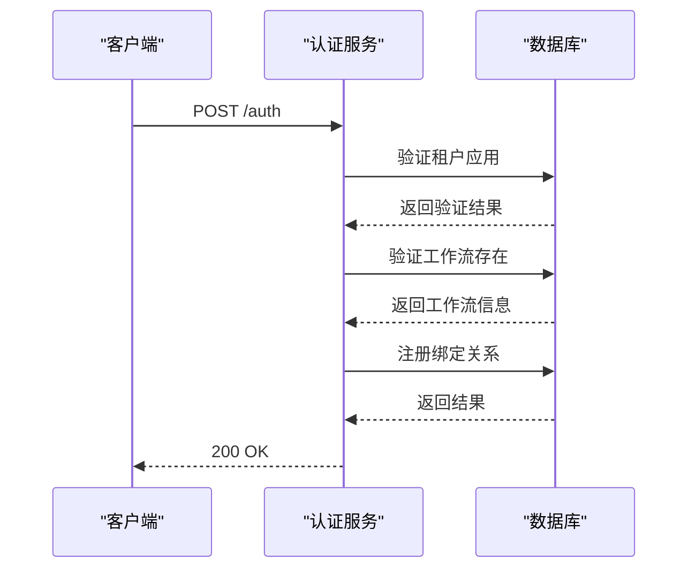
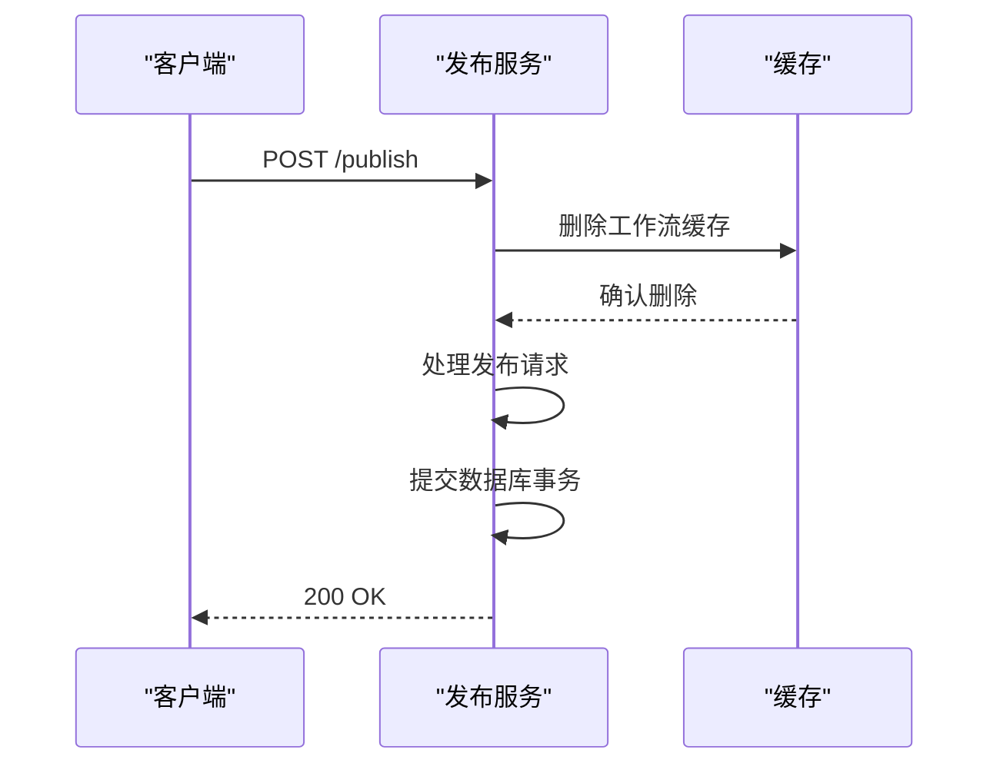
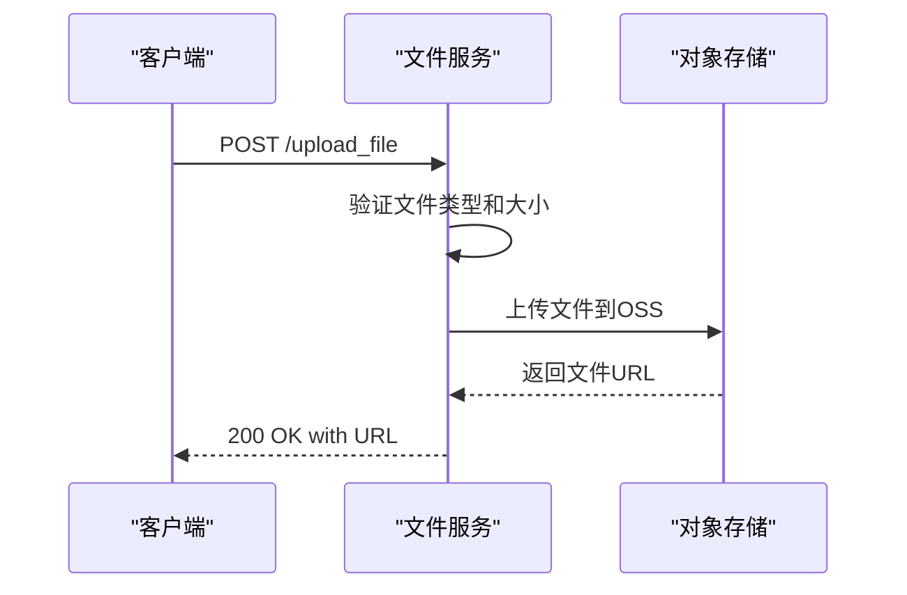
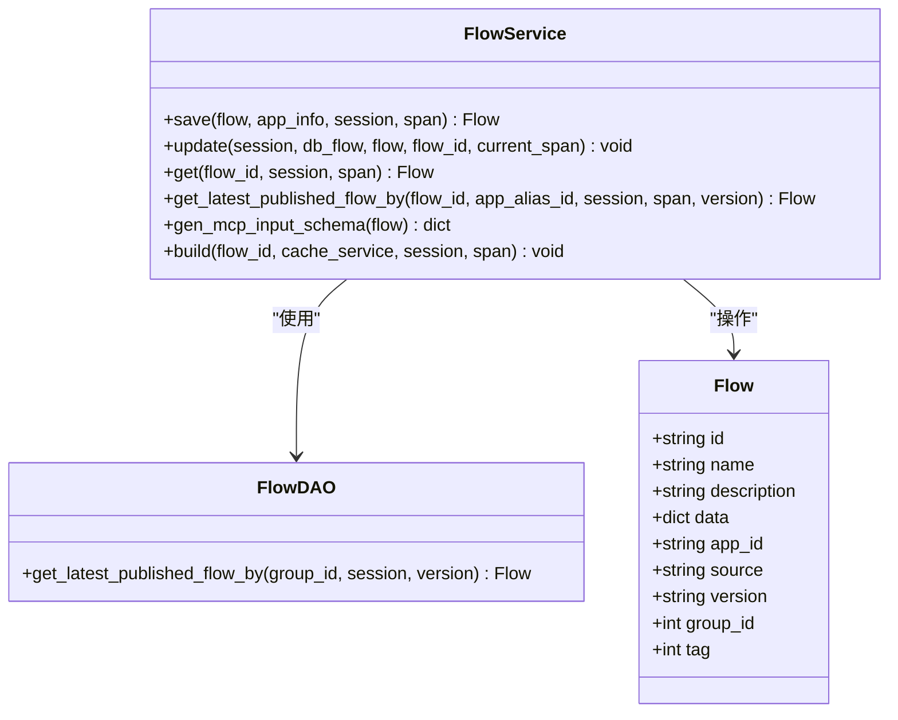
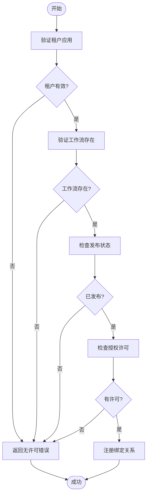
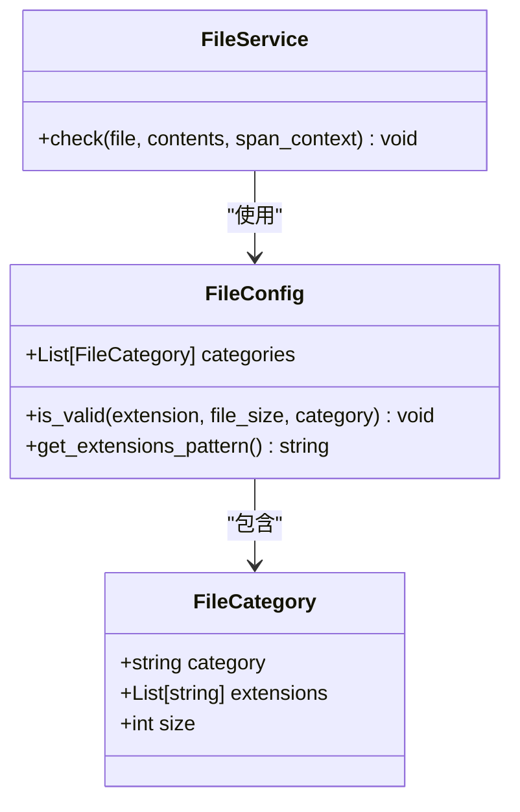
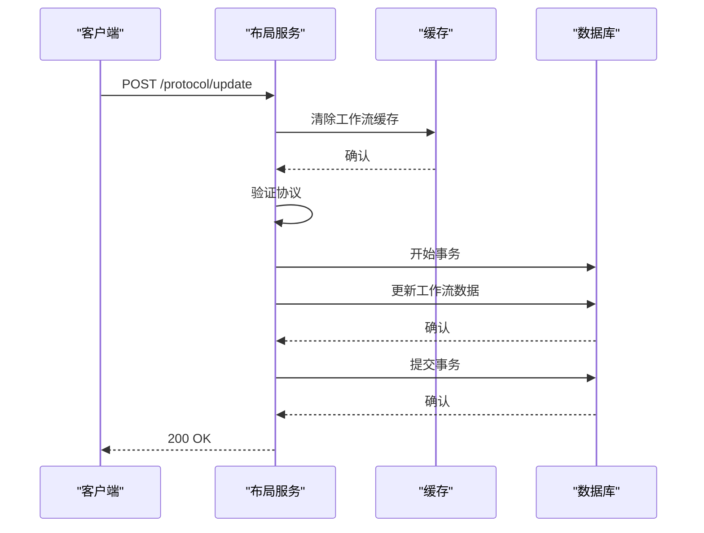

# 流程管理API

<cite>
**本文档引用的文件**
- [auth.py](file://core/workflow/api/v1/flow/auth.py)
- [file.py](file://core/workflow/api/v1/flow/file.py)
- [layout.py](file://core/workflow/api/v1/flow/layout.py)
- [flow_service.py](file://core/workflow/service/flow_service.py)
- [auth_service.py](file://core/workflow/service/auth_service.py)
- [file_service.py](file://core/workflow/service/file_service.py)
- [app_config.py](file://core/workflow/configs/app_config.py)
- [flow.py](file://core/workflow/domain/entities/flow.py)
- [response.py](file://core/workflow/domain/entities/response.py)
</cite>

## 目录
1. [简介](#简介)
2. [认证机制](#认证机制)
3. [文件操作](#文件操作)
4. [布局管理](#布局管理)
5. [权限控制](#权限控制)
6. [文件存储策略](#文件存储策略)
7. [布局同步机制](#布局同步机制)
8. [错误码列表](#错误码列表)
9. [使用示例](#使用示例)

## 简介
流程管理API提供了一套完整的流程管理功能，包括认证、文件操作和布局管理。该API允许用户通过HTTP请求创建、更新、删除和执行工作流，同时提供了文件上传下载和布局保存恢复功能。API采用RESTful设计，支持JSON格式的请求和响应。

**Section sources**
- [auth.py](file://core/workflow/api/v1/flow/auth.py#L1-L120)
- [file.py](file://core/workflow/api/v1/flow/file.py#L1-L112)
- [layout.py](file://core/workflow/api/v1/flow/layout.py#L1-L394)

## 认证机制
流程管理API使用基于HTTP头部的认证机制，通过`x_consumer_username`头部传递用户身份信息。认证功能主要通过`/auth`和`/publish`端点实现，确保只有授权用户才能访问和修改工作流。

### 认证端点
#### POST /auth
认证并绑定应用到工作流

**请求参数**
- `x_consumer_username`: (Header) 消费者用户名
- `flow_id`: (Body) 工作流ID
- `app_id`: (Body) 应用ID

**响应**
- `200 OK`: 认证成功
- `400 Bad Request`: 认证失败

**错误码**
- `APP_TENANT_NOT_FOUND_ERROR`: 租户应用未找到
- `FLOW_NOT_FOUND_ERROR`: 工作流未找到
- `FLOW_NOT_PUBLISH_ERROR`: 工作流未发布
- `APP_FLOW_NOT_AUTH_BOND_ERROR`: 应用与工作流未授权绑定



**Diagram sources**
- [auth.py](file://core/workflow/api/v1/flow/auth.py#L50-L119)
- [auth_service.py](file://core/workflow/service/auth_service.py#L1-L84)

#### POST /publish
发布工作流使其可用

**请求参数**
- `x_consumer_username`: (Header) 消费者用户名
- `flow_id`: (Body) 工作流ID
- `release_status`: (Body) 发布状态码
- `plat`: (Body) 平台标识
- `version`: (Body) 版本号

**响应**
- `200 OK`: 发布成功
- `400 Bad Request`: 发布失败

**错误码**
- `FLOW_PUBLISH_ERROR`: 工作流发布失败



**Diagram sources**
- [auth.py](file://core/workflow/api/v1/flow/auth.py#L20-L49)
- [publish_service.py](file://core/workflow/service/publish_service.py)

**Section sources**
- [auth.py](file://core/workflow/api/v1/flow/auth.py#L1-L120)
- [auth_service.py](file://core/workflow/service/auth_service.py#L1-L84)

## 文件操作
文件操作API提供文件上传功能，支持单文件和多文件上传。系统会对上传的文件进行类型和大小验证，确保符合配置要求。

### 文件上传端点
#### POST /upload_file
上传单个文件

**请求参数**
- `x_consumer_username`: (Header) 消费者用户名
- `file`: (Form Data) 要上传的文件

**响应**
- `200 OK`: 上传成功，返回文件URL
- `400 Bad Request`: 上传失败

**请求示例**
```json
{
  "file": "binary file data"
}
```

**响应示例**
```json
{
  "code": 0,
  "message": "success",
  "data": {
    "url": "https://oss.example.com/files/uuid.ext"
  }
}
```

#### POST /upload_files
上传多个文件

**请求参数**
- `x_consumer_username`: (Header) 消费者用户名
- `files`: (Form Data) 要上传的文件列表

**响应**
- `200 OK`: 上传成功，返回文件URL列表
- `400 Bad Request`: 上传失败

**请求示例**
```json
{
  "files": ["binary file data 1", "binary file data 2"]
}
```

**响应示例**
```json
{
  "code": 0,
  "message": "success",
  "data": {
    "urls": [
      "https://oss.example.com/files/uuid1.ext",
      "https://oss.example.com/files/uuid2.ext"
    ]
  }
}
```

**错误码**
- `FILE_INVALID_ERROR`: 文件无效（类型不支持或大小超限）
- `FILE_STORAGE_ERROR`: 文件存储失败



**Diagram sources**
- [file.py](file://core/workflow/api/v1/flow/file.py#L1-L112)
- [file_service.py](file://core/workflow/service/file_service.py#L1-L33)

**Section sources**
- [file.py](file://core/workflow/api/v1/flow/file.py#L1-L112)
- [file_service.py](file://core/workflow/service/file_service.py#L1-L33)
- [app_config.py](file://core/workflow/configs/app_config.py#L1-L149)

## 布局管理
布局管理API提供工作流的创建、更新、删除和构建功能，支持工作流的版本比较和MCP输入模式生成。

### 布局管理端点
#### POST /protocol/add
添加新的工作流协议

**请求参数**
- `flow`: (Body) 工作流数据
  - `id`: 工作流ID
  - `name`: 工作流名称
  - `description`: 描述
  - `data`: 工作流数据
  - `app_id`: 应用ID

**响应**
- `200 OK`: 添加成功，返回工作流ID
- `400 Bad Request`: 添加失败

**错误码**
- `PROTOCOL_CREATE_ERROR`: 协议创建失败

#### POST /protocol/get
获取工作流协议

**请求参数**
- `flow_read`: (Body) 工作流读取请求
  - `flow_id`: 工作流ID
  - `app_id`: 应用ID

**响应**
- `200 OK`: 获取成功，返回工作流数据
- `400 Bad Request`: 获取失败

**错误码**
- `FLOW_GET_ERROR`: 工作流获取失败
- `FLOW_NOT_FOUND_ERROR`: 工作流未找到

#### POST /protocol/update/{flow_id}
更新工作流协议

**路径参数**
- `flow_id`: 要更新的工作流ID

**请求参数**
- `flow`: (Body) 工作流更新数据
  - `name`: 新名称
  - `description`: 新描述
  - `data`: 新工作流数据

**响应**
- `200 OK`: 更新成功
- `400 Bad Request`: 更新失败

**错误码**
- `PROTOCOL_UPDATE_ERROR`: 协议更新失败
- `FLOW_NOT_FOUND_ERROR`: 工作流未找到

#### POST /protocol/delete
删除工作流协议

**请求参数**
- `flow`: (Body) 工作流读取请求
  - `flow_id`: 要删除的工作流ID
  - `app_id`: 应用ID

**响应**
- `200 OK`: 删除成功
- `400 Bad Request`: 删除失败

**错误码**
- `PROTOCOL_DELETE_ERROR`: 协议删除失败

#### POST /protocol/build/{flow_id}
构建工作流协议

**路径参数**
- `flow_id`: 要构建的工作流ID

**响应**
- `200 OK`: 构建成功（流式响应）
- `400 Bad Request`: 构建失败

**错误码**
- `PROTOCOL_BUILD_ERROR`: 协议构建失败
- `OPEN_API_ERROR`: OpenAPI错误

#### GET /get_flow_info/{flow_id}
获取工作流信息用于MCP输入模式

**路径参数**
- `flow_id`: 工作流ID

**请求头部**
- `x_consumer_username`: 消费者用户名

**响应**
- `200 OK`: 获取成功，返回MCP输入模式
- `400 Bad Request`: 获取失败

**错误码**
- `FLOW_GET_ERROR`: 工作流获取失败



**Diagram sources**
- [layout.py](file://core/workflow/api/v1/flow/layout.py#L1-L394)
- [flow_service.py](file://core/workflow/service/flow_service.py#L1-L427)
- [flow.py](file://core/workflow/domain/entities/flow.py#L1-L129)

**Section sources**
- [layout.py](file://core/workflow/api/v1/flow/layout.py#L1-L394)
- [flow_service.py](file://core/workflow/service/flow_service.py#L1-L427)

## 权限控制
系统通过多层权限控制机制确保工作流的安全访问：

1. **租户验证**: 验证请求的租户应用是否存在且为租户
2. **工作流存在性验证**: 验证工作流是否存在于系统中
3. **发布状态验证**: 验证工作流是否已发布或未从所有平台下架
4. **授权绑定验证**: 验证应用与工作流之间是否存在授权绑定关系

权限控制主要在`auth_service.py`中实现，通过`handle`函数处理认证和授权逻辑。



**Diagram sources**
- [auth_service.py](file://core/workflow/service/auth_service.py#L1-L84)

**Section sources**
- [auth_service.py](file://core/workflow/service/auth_service.py#L1-L84)

## 文件存储策略
系统采用对象存储服务(OSS)进行文件存储，具有以下特点：

1. **文件类型验证**: 根据配置的文件策略验证上传文件的扩展名
2. **文件大小限制**: 根据文件类别设置不同的大小限制
3. **唯一文件名**: 使用UUID生成唯一文件名，避免冲突
4. **安全存储**: 文件存储在安全的对象存储服务中

文件存储策略在`app_config.py`中定义，通过`FileConfig`类实现。



**Diagram sources**
- [app_config.py](file://core/workflow/configs/app_config.py#L1-L149)
- [file_service.py](file://core/workflow/service/file_service.py#L1-L33)

**Section sources**
- [app_config.py](file://core/workflow/configs/app_config.py#L1-L149)

## 布局同步机制
布局同步机制确保工作流在不同环境和版本之间的一致性：

1. **缓存清除**: 在更新工作流时清除相关缓存
2. **版本管理**: 支持工作流的版本比较和保存
3. **协议验证**: 在创建和更新时验证工作流协议的有效性
4. **数据一致性**: 通过数据库事务确保数据一致性



**Diagram sources**
- [layout.py](file://core/workflow/api/v1/flow/layout.py#L1-L394)
- [flow_service.py](file://core/workflow/service/flow_service.py#L1-L427)

**Section sources**
- [layout.py](file://core/workflow/api/v1/flow/layout.py#L1-L394)

## 错误码列表
以下是API中使用的错误码列表：

| 错误码 | 描述 | HTTP状态码 |
|--------|------|-----------|
| APP_TENANT_NOT_FOUND_ERROR | 租户应用未找到 | 400 |
| FLOW_NOT_FOUND_ERROR | 工作流未找到 | 400 |
| FLOW_NOT_PUBLISH_ERROR | 工作流未发布 | 400 |
| APP_FLOW_NOT_AUTH_BOND_ERROR | 应用与工作流未授权绑定 | 400 |
| APP_FLOW_NO_LICENSE_ERROR | 应用无工作流许可 | 400 |
| FLOW_PUBLISH_ERROR | 工作流发布失败 | 400 |
| FILE_INVALID_ERROR | 文件无效 | 400 |
| FILE_STORAGE_ERROR | 文件存储失败 | 400 |
| PROTOCOL_CREATE_ERROR | 协议创建失败 | 400 |
| FLOW_GET_ERROR | 工作流获取失败 | 400 |
| PROTOCOL_UPDATE_ERROR | 协议更新失败 | 400 |
| PROTOCOL_DELETE_ERROR | 协议删除失败 | 400 |
| PROTOCOL_BUILD_ERROR | 协议构建失败 | 400 |
| OPEN_API_ERROR | OpenAPI错误 | 400 |

**Section sources**
- [err_code.py](file://core/workflow/exception/errors/err_code.py)
- [response.py](file://core/workflow/domain/entities/response.py#L1-L186)

## 使用示例
### Python示例
```python
import requests
import json

# 认证工作流
def auth_workflow(tenant_id, flow_id, app_id):
    url = "http://api.example.com/workflow/v1/auth"
    headers = {
        "x_consumer_username": tenant_id,
        "Content-Type": "application/json"
    }
    data = {
        "flow_id": flow_id,
        "app_id": app_id
    }
    response = requests.post(url, headers=headers, json=data)
    return response.json()

# 上传文件
def upload_file(tenant_id, file_path):
    url = "http://api.example.com/workflow/v1/upload_file"
    headers = {
        "x_consumer_username": tenant_id
    }
    files = {
        "file": open(file_path, "rb")
    }
    response = requests.post(url, headers=headers, files=files)
    return response.json()

# 获取工作流信息
def get_flow_info(tenant_id, flow_id):
    url = f"http://api.example.com/workflow/v1/get_flow_info/{flow_id}"
    headers = {
        "x_consumer_username": tenant_id
    }
    response = requests.get(url, headers=headers)
    return response.json()
```

### cURL示例
```bash
# 认证工作流
curl -X POST "http://api.example.com/workflow/v1/auth" \
  -H "x_consumer_username: tenant123" \
  -H "Content-Type: application/json" \
  -d '{
    "flow_id": "flow456",
    "app_id": "app789"
  }'

# 上传文件
curl -X POST "http://api.example.com/workflow/v1/upload_file" \
  -H "x_consumer_username: tenant123" \
  -F "file=@/path/to/file.pdf"

# 获取工作流信息
curl -X GET "http://api.example.com/workflow/v1/get_flow_info/flow456" \
  -H "x_consumer_username: tenant123"
```

**Section sources**
- [auth.py](file://core/workflow/api/v1/flow/auth.py#L1-L120)
- [file.py](file://core/workflow/api/v1/flow/file.py#L1-L112)
- [layout.py](file://core/workflow/api/v1/flow/layout.py#L1-L394)