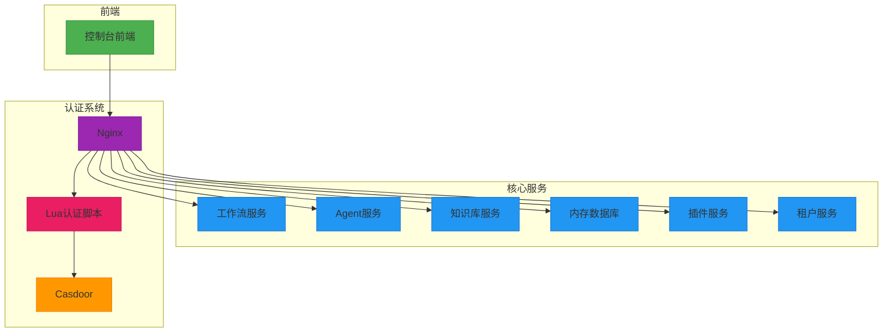
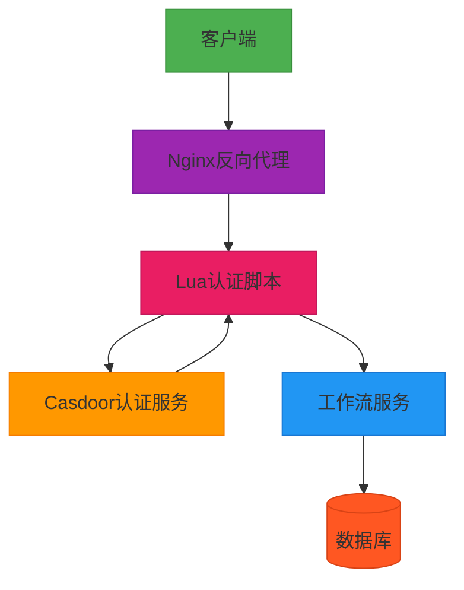
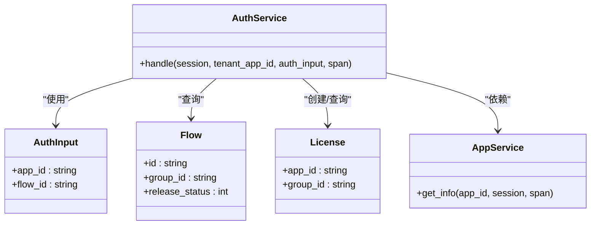
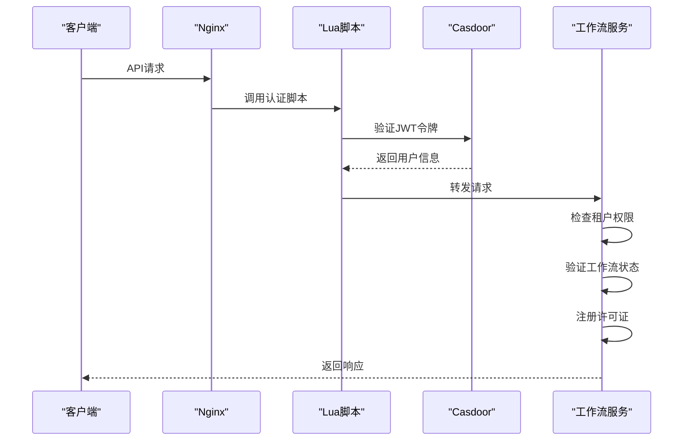
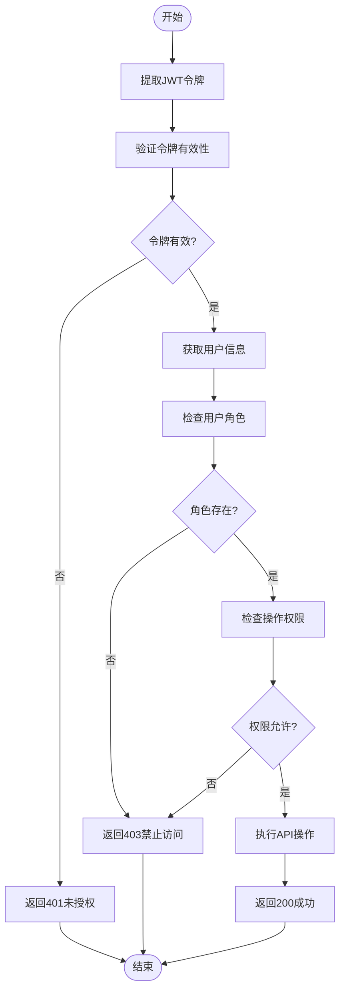
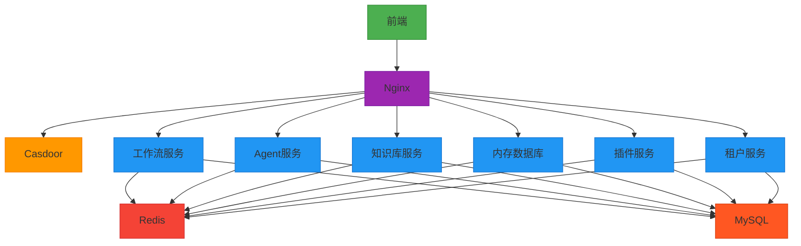

# 认证API

<cite>
**本文档引用的文件**  
- [auth_service.py](file://core/workflow/service/auth_service.py)
- [router.py](file://core/workflow/api/v1/router.py)
- [init_data.json](file://docker/astronAgent/casdoor/conf/init_data.json)
- [auth_handler.lua](file://docker/astronAgent/astronRPA/volumes/nginx/lua/auth_handler.lua)
- [default.conf](file://docker/astronAgent/astronRPA/volumes/nginx/default.conf)
- [permission.ts](file://console/frontend/src/types/permission.ts)
- [casdoor.ts](file://console/frontend/src/config/casdoor.ts)
</cite>

## 目录
1. [简介](#简介)
2. [项目结构](#项目结构)
3. [核心组件](#核心组件)
4. [架构概述](#架构概述)
5. [详细组件分析](#详细组件分析)
6. [依赖分析](#依赖分析)
7. [性能考虑](#性能考虑)
8. [故障排除指南](#故障排除指南)
9. [结论](#结论)

## 简介
本项目是一个基于微服务架构的智能工作流系统，提供完整的认证和权限控制机制。系统采用Casdoor作为统一身份认证平台，通过JWT令牌、API密钥等多种方式进行安全验证。工作流访问控制实现了租户级别的权限检查，确保不同用户只能访问授权的资源。认证流程集成OAuth 2.0协议，支持多种授权类型，包括授权码模式、密码模式和客户端凭证模式。系统还实现了细粒度的权限管理，通过角色和操作权限的映射来控制用户对工作流的访问和操作。

## 项目结构
项目采用分层架构设计，包含控制台前端、核心服务和Docker部署配置。认证系统主要由Casdoor身份认证服务、Nginx反向代理和Lua认证脚本组成，通过中间件方式集成到各个微服务中。

**图源**  
- [default.conf](file://docker/astronAgent/astronRPA/volumes/nginx/default.conf)
- [auth_handler.lua](file://docker/astronAgent/astronRPA/volumes/nginx/lua/auth_handler.lua)

**本节来源**  
- [default.conf](file://docker/astronAgent/astronRPA/volumes/nginx/default.conf)
- [auth_handler.lua](file://docker/astronAgent/astronRPA/volumes/nginx/lua/auth_handler.lua)

## 核心组件
系统的核心认证组件包括Casdoor身份认证服务、Nginx反向代理和Lua认证脚本。Casdoor提供统一的用户管理和认证接口，Nginx作为反向代理服务器处理所有API请求，Lua脚本实现认证逻辑的扩展。工作流服务中的认证服务处理租户权限检查和工作流访问控制。

**本节来源**  
- [auth_service.py](file://core/workflow/service/auth_service.py)
- [auth_handler.lua](file://docker/astronAgent/astronRPA/volumes/nginx/lua/auth_handler.lua)
- [init_data.json](file://docker/astronAgent/casdoor/conf/init_data.json)

## 架构概述
系统采用分层安全架构，从外到内包括网络层、认证层、权限层和应用层。网络层通过Nginx反向代理接收所有API请求，认证层使用Lua脚本调用Casdoor服务验证JWT令牌，权限层检查用户的角色和操作权限，应用层执行具体的业务逻辑。

**图源**  
- [default.conf](file://docker/astronAgent/astronRPA/volumes/nginx/default.conf)
- [auth_handler.lua](file://docker/astronAgent/astronRPA/volumes/nginx/lua/auth_handler.lua)
- [auth_service.py](file://core/workflow/service/auth_service.py)

## 详细组件分析
### 认证服务分析
认证服务负责处理工作流的访问控制和权限验证，包括租户验证、工作流发布状态检查和许可证注册。

#### 认证服务类图

**图源**  
- [auth_service.py](file://core/workflow/service/auth_service.py)

#### 认证流程序列图

**图源**  
- [auth_handler.lua](file://docker/astronAgent/astronRPA/volumes/nginx/lua/auth_handler.lua)
- [auth_service.py](file://core/workflow/service/auth_service.py)

### 权限控制分析
系统实现了基于角色的访问控制(RBAC)，通过角色和操作权限的映射来管理用户对资源的访问。

#### 权限控制流程图

**图源**  
- [auth_handler.lua](file://docker/astronAgent/astronRPA/volumes/nginx/lua/auth_handler.lua)
- [permission.ts](file://console/frontend/src/types/permission.ts)

**本节来源**  
- [auth_service.py](file://core/workflow/service/auth_service.py)
- [auth_handler.lua](file://docker/astronAgent/astronRPA/volumes/nginx/lua/auth_handler.lua)
- [permission.ts](file://console/frontend/src/types/permission.ts)

## 依赖分析
系统依赖于多个外部组件和服务，包括Casdoor身份认证平台、Nginx反向代理、Redis缓存和MySQL数据库。这些组件通过清晰的接口进行通信，确保系统的可维护性和可扩展性。

**图源**  
- [docker-compose.yaml](file://docker/astronAgent/docker-compose.yaml)
- [go.mod](file://core/tenant/go.mod)
- [pyproject.toml](file://core/workflow/pyproject.toml)

**本节来源**  
- [docker-compose.yaml](file://docker/astronAgent/docker-compose.yaml)
- [go.mod](file://core/tenant/go.mod)
- [pyproject.toml](file://core/workflow/pyproject.toml)

## 性能考虑
系统在认证和权限控制方面进行了多项性能优化。首先，通过Redis缓存用户信息和权限数据，减少数据库查询次数。其次，采用异步处理方式执行认证逻辑，避免阻塞主线程。此外，JWT令牌验证在Nginx层完成，减轻后端服务的压力。对于高频访问的API端点，实现了请求频率限制和缓存机制。

## 故障排除指南
### 常见认证问题
1. **401未授权错误**：检查JWT令牌是否有效、是否过期、是否包含正确的用户信息。
2. **403禁止访问错误**：验证用户角色是否有权限执行请求的操作。
3. **500内部服务器错误**：检查认证服务是否正常运行，数据库连接是否正常。
4. **令牌刷新失败**：确认刷新令牌是否有效，客户端凭证是否正确。

### 调试步骤
1. 检查Nginx日志，确认请求是否到达反向代理。
2. 查看Lua脚本日志，了解认证过程中的详细信息。
3. 验证Casdoor服务状态，确保身份认证功能正常。
4. 检查工作流服务日志，定位权限验证的具体问题。

**本节来源**  
- [auth_handler.lua](file://docker/astronAgent/astronRPA/volumes/nginx/lua/auth_handler.lua)
- [auth_service.py](file://core/workflow/service/auth_service.py)

## 结论
本认证API系统提供了完整的工作流访问控制和权限验证机制，通过多层安全架构确保系统的安全性。系统采用标准化的JWT令牌验证和OAuth 2.0协议，支持多种认证方式。租户权限检查和细粒度的操作权限控制确保了资源的安全访问。通过Nginx和Lua脚本的组合，实现了高效的认证处理，减轻了后端服务的负担。整体架构设计合理，具有良好的可扩展性和可维护性。