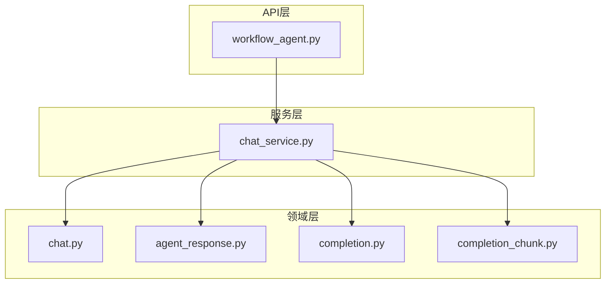
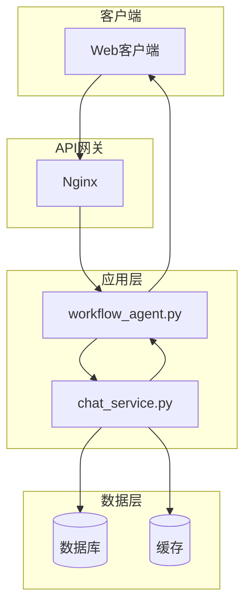
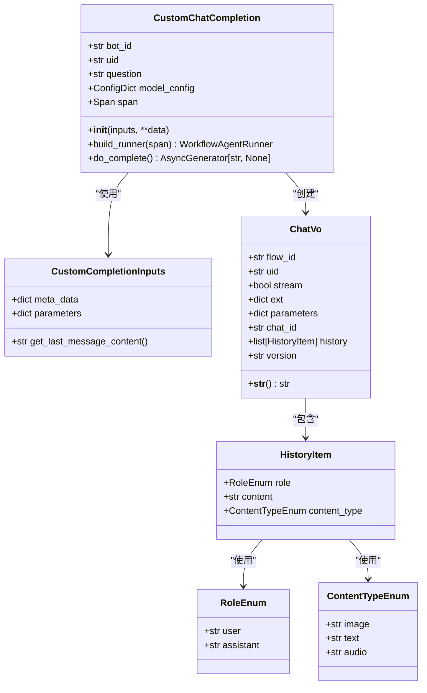
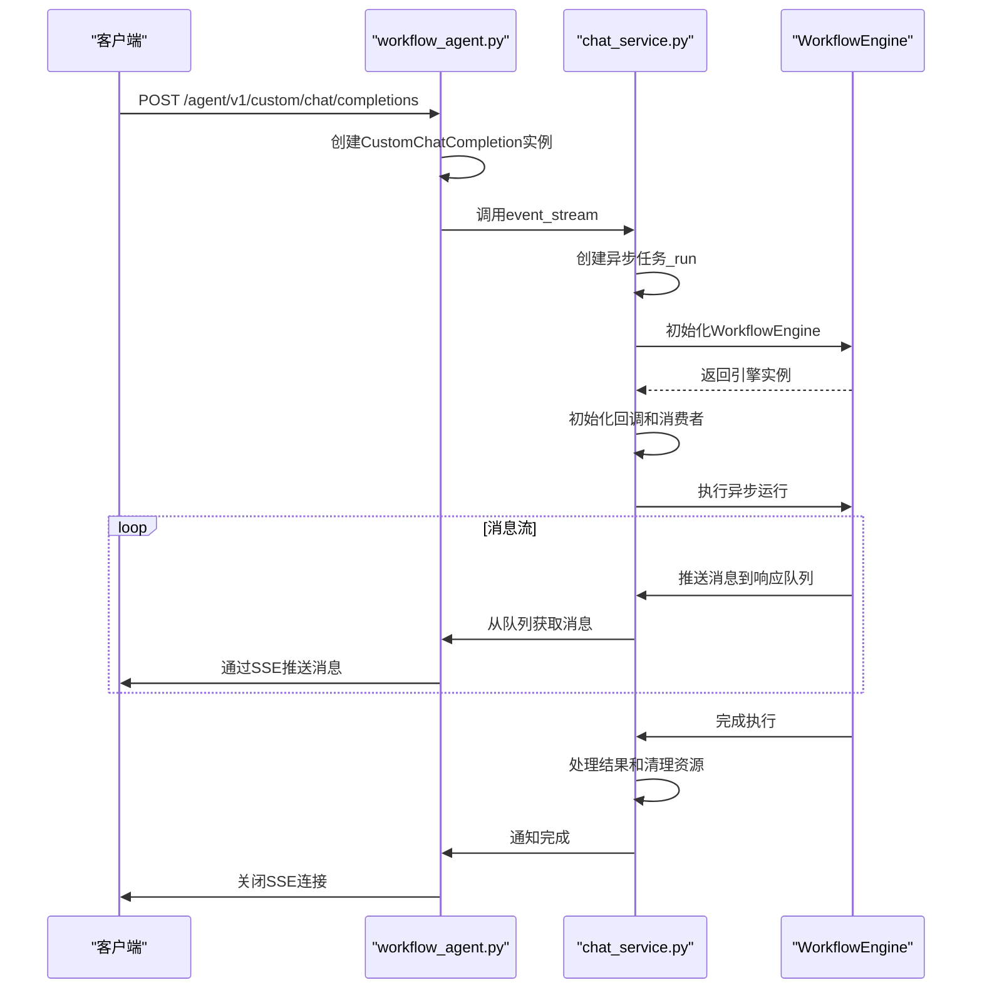
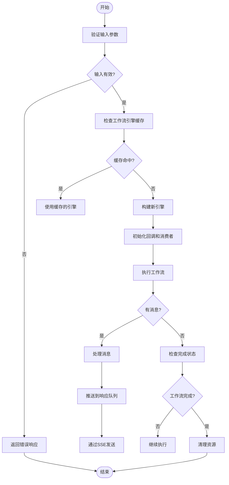
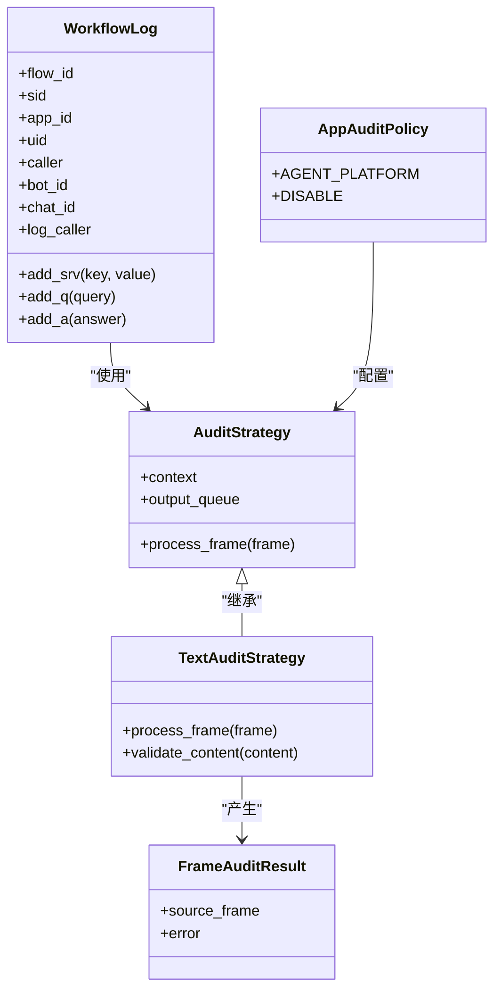
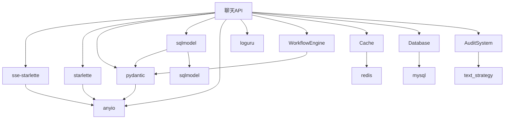

# 聊天API

<cite>
**本文档引用的文件**   
- [workflow_agent.py](file://core/agent/api/v1/workflow_agent.py)
- [chat_service.py](file://core/workflow/service/chat_service.py)
- [chat.py](file://core/workflow/domain/entities/chat.py)
- [agent_response.py](file://core/agent/api/schemas/agent_response.py)
- [completion.py](file://core/agent/api/schemas/completion.py)
- [completion_chunk.py](file://core/agent/api/schemas/completion_chunk.py)
</cite>

## 目录
1. [简介](#简介)
2. [项目结构](#项目结构)
3. [核心组件](#核心组件)
4. [架构概述](#架构概述)
5. [详细组件分析](#详细组件分析)
6. [依赖分析](#依赖分析)
7. [性能考虑](#性能考虑)
8. [故障排除指南](#故障排除指南)
9. [结论](#结论)
10. [附录](#附录)（如有必要）

## 简介
聊天API是Astron Agent系统的核心组件，提供实时聊天交互功能。该API基于Server-Sent Events (SSE)技术实现，支持流式响应和实时通信。API主要处理工作流代理的执行，包括用户模式和调试模式的聊天交互。系统通过SSE实现服务器到客户端的单向实时通信，确保消息的低延迟传输。API设计遵循RESTful原则，同时利用SSE实现流式数据传输，为用户提供流畅的聊天体验。系统还集成了会话状态管理、消息流控制和调试功能，支持复杂的聊天工作流。

## 项目结构
聊天API的实现分布在多个核心模块中，主要位于core/agent和core/workflow目录下。API端点定义在core/agent/api/v1/workflow_agent.py中，而核心业务逻辑和服务实现在core/workflow/service/chat_service.py中。数据模型和实体定义在core/workflow/domain/entities/chat.py中，而API请求和响应的模式定义在core/agent/api/schemas/目录下。这种分层架构将API接口、业务逻辑和数据模型分离，提高了代码的可维护性和可扩展性。

**图表来源**
- [workflow_agent.py](file://core/agent/api/v1/workflow_agent.py)
- [chat_service.py](file://core/workflow/service/chat_service.py)
- [chat.py](file://core/workflow/domain/entities/chat.py)

**章节来源**
- [workflow_agent.py](file://core/agent/api/v1/workflow_agent.py#L1-L106)
- [chat_service.py](file://core/workflow/service/chat_service.py#L1-L1245)
- [chat.py](file://core/workflow/domain/entities/chat.py#L1-L95)

## 核心组件
聊天API的核心组件包括API端点、流式响应服务、聊天实体模型和SSE实现。API端点处理HTTP请求并返回流式响应，而chat_service.py实现了核心的聊天逻辑，包括会话管理、消息处理和工作流执行。ChatVo实体模型定义了聊天请求的数据结构，包括工作流ID、用户ID、流式标志、扩展字段、参数、聊天ID、历史记录和版本号。系统通过SSE实现服务器到客户端的实时消息推送，确保聊天消息的即时传输。API还支持调试模式，允许开发者在开发和测试过程中调试聊天工作流。

**章节来源**
- [workflow_agent.py](file://core/agent/api/v1/workflow_agent.py#L1-L106)
- [chat_service.py](file://core/workflow/service/chat_service.py#L1-L1245)
- [chat.py](file://core/workflow/domain/entities/chat.py#L1-L95)

## 架构概述
聊天API采用分层架构设计，包括API层、服务层和领域层。API层负责处理HTTP请求和响应，服务层实现核心业务逻辑，领域层定义数据模型和实体。系统通过SSE实现流式通信，客户端建立HTTP连接后，服务器可以持续推送消息到客户端，直到会话结束。这种架构支持实时聊天交互，同时保持了良好的可扩展性和可维护性。

**图表来源**
- [workflow_agent.py](file://core/agent/api/v1/workflow_agent.py#L1-L106)
- [chat_service.py](file://core/workflow/service/chat_service.py#L1-L1245)

## 详细组件分析

### API端点分析
聊天API提供了多个端点来支持不同的聊天交互模式。主要端点包括/open用于建立聊天会话，/debug用于调试模式，以及/node_debug用于节点级别的调试。这些端点都基于POST方法，接收JSON格式的请求体，并返回SSE流式响应。

#### API端点类图

**图表来源**
- [workflow_agent.py](file://core/agent/api/v1/workflow_agent.py#L1-L106)
- [chat.py](file://core/workflow/domain/entities/chat.py#L1-L95)

#### 聊天API调用序列图

**图表来源**
- [workflow_agent.py](file://core/agent/api/v1/workflow_agent.py#L1-L106)
- [chat_service.py](file://core/workflow/service/chat_service.py#L1-L1245)

#### 聊天消息流控制流程图

**图表来源**
- [chat_service.py](file://core/workflow/service/chat_service.py#L1-L1245)

**章节来源**
- [workflow_agent.py](file://core/agent/api/v1/workflow_agent.py#L1-L106)
- [chat_service.py](file://core/workflow/service/chat_service.py#L1-L1245)
- [chat.py](file://core/workflow/domain/entities/chat.py#L1-L95)

### 调试模式分析
调试模式是聊天API的重要特性，允许开发者在开发和测试过程中调试聊天工作流。调试模式通过/debug端点提供，支持详细的日志记录和状态跟踪。系统通过AuditStrategy和TextAuditStrategy实现内容审核策略，确保调试过程中的数据安全和合规性。

#### 调试模式类图

**图表来源**
- [chat_service.py](file://core/workflow/service/chat_service.py#L1-L1245)

**章节来源**
- [chat_service.py](file://core/workflow/service/chat_service.py#L1-L1245)

## 依赖分析
聊天API依赖于多个内部和外部组件。内部依赖包括workflow_engine、cache、database和audit_system等模块。外部依赖通过Python包管理，包括sse-starlette用于SSE实现，starlette用于Web框架，pydantic用于数据验证，sqlmodel用于数据库操作。这些依赖关系确保了API的功能完整性和性能优化。

**图表来源**
- [workflow_agent.py](file://core/agent/api/v1/workflow_agent.py)
- [chat_service.py](file://core/workflow/service/chat_service.py)
- [uv.lock](file://core/plugin/link/uv.lock)

**章节来源**
- [workflow_agent.py](file://core/agent/api/v1/workflow_agent.py#L1-L106)
- [chat_service.py](file://core/workflow/service/chat_service.py#L1-L1245)
- [uv.lock](file://core/plugin/link/uv.lock#L1794-L1817)

## 性能考虑
聊天API在设计时考虑了多项性能优化措施。首先，通过缓存机制减少工作流引擎的重复构建，提高响应速度。其次，使用异步编程模型和协程处理并发请求，充分利用系统资源。此外，SSE流式传输减少了HTTP连接的开销，提高了消息传输效率。系统还实现了连接超时和资源清理机制，防止资源泄漏。对于大数据量的传输，系统支持分块处理和流式读取，避免内存溢出。

## 故障排除指南
在使用聊天API时可能遇到的常见问题包括连接超时、认证失败、流式响应中断等。对于连接超时问题，建议检查网络状况和服务器负载，适当调整超时设置。认证失败通常与API密钥或令牌有关，需要验证认证信息的正确性。流式响应中断可能是由于网络不稳定或服务器异常，建议实现重连机制。调试模式下，可以通过查看详细的日志信息来定位问题。此外，监控系统性能指标，如响应时间、错误率和资源使用情况，有助于及时发现和解决问题。

**章节来源**
- [workflow_agent.py](file://core/agent/api/v1/workflow_agent.py#L1-L106)
- [chat_service.py](file://core/workflow/service/chat_service.py#L1-L1245)

## 结论
聊天API通过SSE技术实现了高效的实时聊天交互，支持复杂的聊天工作流和调试功能。API设计遵循分层架构原则，具有良好的可维护性和可扩展性。通过缓存、异步处理和流式传输等技术，系统在性能和用户体验方面表现出色。未来可以进一步优化错误处理机制，增强安全性，并提供更多高级功能，如多语言支持和智能推荐。