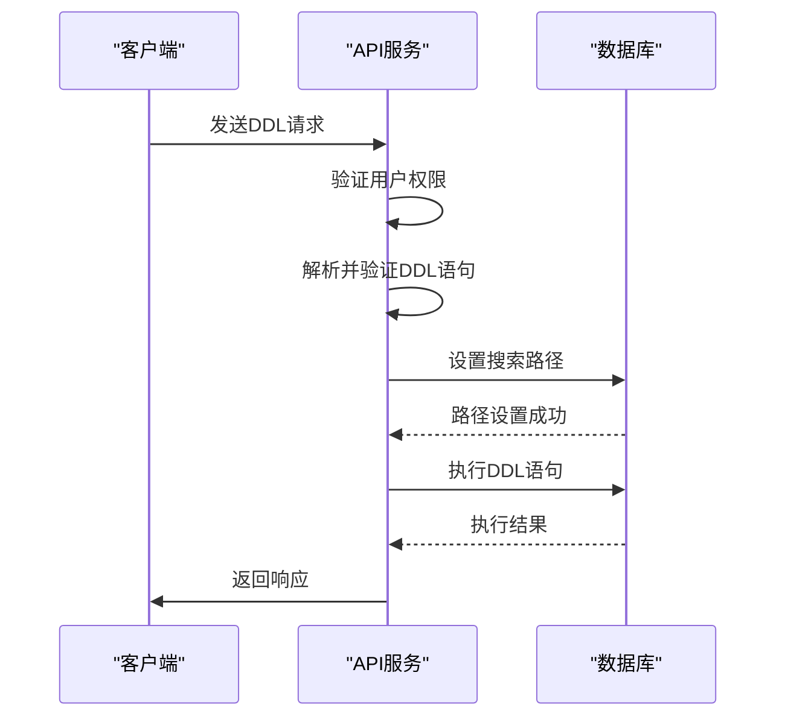
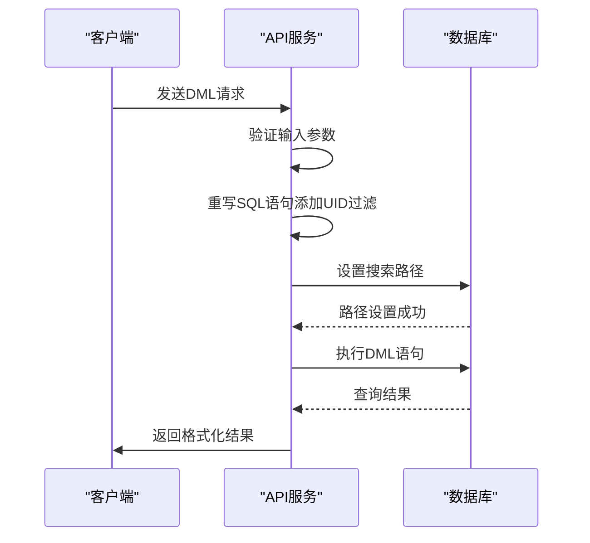
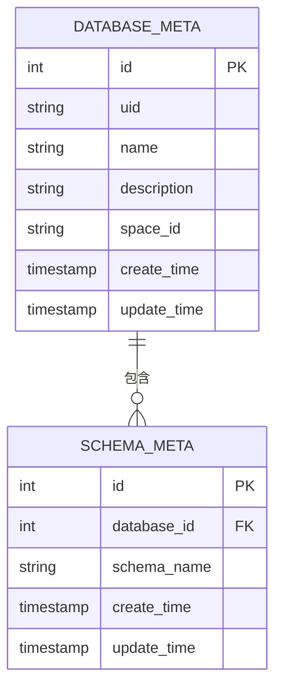
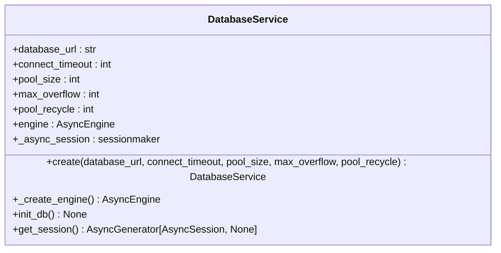

# 数据库API

<cite>
**本文档引用的文件**
- [db_operator.py](file://core/memory/database/api/v1/db_operator.py)
- [exec_ddl.py](file://core/memory/database/api/v1/exec_ddl.py)
- [exec_dml.py](file://core/memory/database/api/v1/exec_dml.py)
- [upload_data.py](file://core/memory/database/api/v1/upload_data.py)
- [export_data.py](file://core/memory/database/api/v1/export_data.py)
- [db_manager.py](file://core/memory/database/repository/middleware/database/db_manager.py)
- [error_code.py](file://core/memory/database/exceptions/error_code.py)
- [exec_ddl_types.py](file://core/memory/database/api/schemas/exec_ddl_types.py)
- [exec_dml_types.py](file://core/memory/database/api/schemas/exec_dml_types.py)
- [database.ts](file://console/frontend/src/types/database.ts)
- [database-store.ts](file://console/frontend/src/store/database-store.ts)
- [database.ts](file://console/frontend/src/services/database.ts)
</cite>

## 目录
1. [简介](#简介)
2. [数据库管理API](#数据库管理api)
3. [DDL操作API](#ddl操作api)
4. [DML操作API](#dml操作api)
5. [数据导入导出API](#数据导入导出api)
6. [元数据管理与连接池配置](#元数据管理与连接池配置)
7. [错误码列表](#错误码列表)
8. [使用示例](#使用示例)

## 简介
数据库API服务为Astron Agent平台提供完整的数据库管理功能，支持数据库的创建、表结构管理、数据操作以及数据导入导出等核心功能。该服务基于PostgreSQL实现，通过RESTful API接口提供对数据库的全面控制。

API服务采用分层架构设计，前端通过TypeScript类型定义确保类型安全，后端使用Python FastAPI框架实现高性能的API处理。数据库连接通过异步连接池管理，确保高并发场景下的性能和稳定性。

**Section sources**
- [db_operator.py](file://core/memory/database/api/v1/db_operator.py#L1-L517)
- [database.ts](file://console/frontend/src/types/database.ts#L0-L257)

## 数据库管理API
数据库管理API提供对数据库实例的全生命周期管理功能，包括创建、查询、更新、删除和复制等操作。

### 创建数据库
创建新的数据库实例，系统会自动为该数据库创建生产环境和测试环境两个独立的schema。

**API端点**: `POST /db/create`

**请求参数**:
- `name`: 数据库名称 (必填)
- `description`: 数据库描述 (可选)
- `avatarIcon`: 图标 (可选)
- `avatarColor`: 颜色 (可选)

**返回值**:
- `code`: 状态码
- `data`: 包含新创建数据库ID的对象
- `message`: 响应消息
- `sid`: 会话ID

**Section sources**
- [db_operator.py](file://core/memory/database/api/v1/db_operator.py#L200-L250)
- [database.ts](file://console/frontend/src/services/database.ts#L10-L15)

### 查询数据库
分页查询数据库列表或获取特定数据库的详细信息。

**API端点**: 
- `POST /db/page-list` (分页查询)
- `GET /db/detail` (详情查询)

**请求参数**:
- `search`: 搜索关键字 (可选)
- `pageNum`: 页码
- `pageSize`: 每页数量

**返回值**:
- `records`: 数据库记录数组
- `total`: 总记录数
- `size`: 每页大小
- `current`: 当前页码
- `pages`: 总页数

**Section sources**
- [database.ts](file://console/frontend/src/services/database.ts#L5-L9)
- [database.ts](file://console/frontend/src/types/database.ts#L100-L120)

### 更新数据库
修改现有数据库的属性，如名称、描述等。

**API端点**: `POST /db/update`

**请求参数**:
- `id`: 数据库ID (必填)
- `name`: 新名称 (可选)
- `description`: 新描述 (可选)
- `avatarIcon`: 新图标 (可选)
- `avatarColor`: 新颜色 (可选)

**返回值**:
- `code`: 状态码
- `message`: 响应消息
- `sid`: 会话ID

**Section sources**
- [db_operator.py](file://core/memory/database/api/v1/db_operator.py#L350-L400)
- [database.ts](file://console/frontend/src/services/database.ts#L25-L29)

### 删除数据库
删除指定的数据库实例及其所有相关数据。

**API端点**: `GET /db/delete`

**请求参数**:
- `id`: 数据库ID

**返回值**:
- `code`: 状态码
- `message`: 响应消息
- `sid`: 会话ID

**Section sources**
- [db_operator.py](file://core/memory/database/api/v1/db_operator.py#L400-L450)
- [database.ts](file://console/frontend/src/services/database.ts#L30-L34)

### 复制数据库
创建现有数据库的副本，包括所有表结构和数据。

**API端点**: `GET /db/copy`

**请求参数**:
- `id`: 源数据库ID
- `name`: 新数据库名称 (可选)

**返回值**:
- `code`: 状态码
- `data`: 包含新数据库ID的对象
- `message`: 响应消息
- `sid`: 会话ID

**Section sources**
- [db_operator.py](file://core/memory/database/api/v1/db_operator.py#L100-L150)
- [database.ts](file://console/frontend/src/services/database.ts#L35-L39)

## DDL操作API
DDL（数据定义语言）操作API允许执行数据库结构变更操作，如创建、修改和删除表等。

### 执行DDL语句
在指定数据库上执行DDL语句。

**API端点**: `POST /db/exec_ddl`

**请求参数**:
- `database_id`: 目标数据库ID (必填)
- `uid`: 用户ID (必填)
- `ddl`: DDL语句 (必填)
- `space_id`: 团队空间ID (可选)



**Diagram sources**
- [exec_ddl.py](file://core/memory/database/api/v1/exec_ddl.py#L100-L227)
- [db_operator.py](file://core/memory/database/api/v1/db_operator.py#L50-L60)

**允许的DDL语句**:
- `CREATE TABLE`
- `ALTER TABLE`
- `DROP TABLE`
- `COMMENT`
- `RENAME`

**返回值**:
- `code`: 状态码
- `message`: 响应消息
- `sid`: 会话ID

**Section sources**
- [exec_ddl.py](file://core/memory/database/api/v1/exec_ddl.py#L100-L227)
- [exec_ddl_types.py](file://core/memory/database/api/schemas/exec_ddl_types.py#L1-L27)

## DML操作API
DML（数据操作语言）操作API提供对数据库中数据的增删改查功能。

### 执行DML语句
在指定数据库上执行DML语句。

**API端点**: `POST /db/exec_dml`

**请求参数**:
- `app_id`: 应用ID (必填)
- `database_id`: 目标数据库ID (必填)
- `uid`: 用户ID (必填)
- `dml`: DML语句 (必填)
- `env`: 环境 (prod/test)
- `space_id`: 团队空间ID (可选)



**Diagram sources**
- [exec_dml.py](file://core/memory/database/api/v1/exec_dml.py#L200-L457)
- [db_operator.py](file://core/memory/database/api/v1/db_operator.py#L50-L60)

**支持的DML操作**:
- `SELECT`
- `INSERT`
- `UPDATE`
- `DELETE`

**安全特性**:
- 自动为查询添加UID过滤条件，确保数据隔离
- SELECT查询默认限制返回100条记录
- INSERT操作自动添加id和uid字段

**返回值**:
- `code`: 状态码
- `data`: 包含执行结果的对象
  - `exec_success`: 成功执行的结果
  - `exec_failure`: 失败的执行
  - `exec_time`: 执行时间
- `message`: 响应消息
- `sid`: 会话ID

**Section sources**
- [exec_dml.py](file://core/memory/database/api/v1/exec_dml.py#L200-L457)
- [exec_dml_types.py](file://core/memory/database/api/schemas/exec_dml_types.py#L1-L40)

## 数据导入导出API
提供数据导入导出功能，支持多种文件格式。

### 数据导入
将外部数据文件导入到指定数据库表中。

**API端点**: `POST /db/import-table-data`

**请求参数**:
- `tbId`: 目标表ID
- `execDev`: 执行环境 (1-测试, 2-生产)
- `file`: 上传的文件

**支持的文件格式**:
- CSV
- XLS
- XLSX

**处理流程**:
1. 解析上传的文件
2. 验证列名与目标表结构匹配
3. 分批插入数据
4. 返回成功和失败的行信息

**返回值**:
- `code`: 状态码
- `data`: 包含导入结果的对象
  - `success_rows`: 成功插入的行ID
  - `failed_rows`: 失败的行及错误信息
- `message`: 响应消息
- `sid`: 会话ID

**Section sources**
- [upload_data.py](file://core/memory/database/api/v1/upload_data.py#L100-L257)
- [database.ts](file://console/frontend/src/services/database.ts#L100-L110)

### 数据导出
将数据库表中的数据导出为CSV文件。

**API端点**: `POST /db/export-table-data`

**请求参数**:
- `tbId`: 源表ID
- `execDev`: 执行环境 (1-测试, 2-生产)
- `dataIds`: 数据ID列表 (可选)

**处理流程**:
1. 设置数据库搜索路径
2. 执行SELECT查询获取数据
3. 生成CSV格式的响应流
4. 返回文件下载响应

**返回值**:
- 流式CSV文件响应
- Content-Disposition头包含文件名

**Section sources**
- [export_data.py](file://core/memory/database/api/v1/export_data.py#L50-L183)
- [database.ts](file://console/frontend/src/services/database.ts#L115-L120)

## 元数据管理与连接池配置
数据库服务的元数据管理和连接池配置确保系统的高性能和稳定性。

### 数据库元数据管理
系统使用专门的元数据表来跟踪数据库实例信息。

**核心元数据表**:
- `database_meta`: 存储数据库基本信息
  - `id`: 数据库ID
  - `uid`: 用户ID
  - `name`: 数据库名称
  - `description`: 描述
  - `space_id`: 团队空间ID
- `schema_meta`: 存储schema信息
  - `database_id`: 关联的数据库ID
  - `schema_name`: schema名称

**Schema命名规则**:
- 生产环境: `prod_{uid}_{database_id}`
- 测试环境: `test_{uid}_{database_id}`



**Diagram sources**
- [db_operator.py](file://core/memory/database/api/v1/db_operator.py#L50-L100)
- [database_meta.py](file://core/memory/database/domain/models/database_meta.py)

### 连接池配置
数据库连接池配置优化了数据库连接的性能和资源利用率。

**连接池参数**:
- `pool_size`: 连接池大小 (默认20)
- `max_overflow`: 最大溢出连接数 (默认20)
- `pool_recycle`: 连接回收时间 (默认3600秒)
- `connect_timeout`: 连接超时时间 (默认10秒)
- `statement_cache_size`: 语句缓存大小 (禁用)

**连接管理特性**:
- 使用异步连接池提高并发性能
- 自动连接预检确保连接有效性
- 事务管理确保数据一致性
- 错误处理和自动回滚



**Diagram sources**
- [db_manager.py](file://core/memory/database/repository/middleware/database/db_manager.py#L1-L134)
- [database.ts](file://console/frontend/src/store/database-store.ts#L1-L13)

**Section sources**
- [db_manager.py](file://core/memory/database/repository/middleware/database/db_manager.py#L1-L134)
- [database-store.ts](file://console/frontend/src/store/database-store.ts#L1-L13)

## 错误码列表
API返回标准化的错误码，便于客户端处理各种异常情况。

| 错误码 | 错误名称 | 描述 |
|--------|---------|------|
| 0 | Successes | 操作成功 |
| 25500 | HttpError | 服务器错误 |
| 25000 | ParamError | 参数验证错误 |
| 25010 | DatabaseExecutionError | 数据库操作失败 |
| 25011 | CreatDBError | 创建数据库失败 |
| 25012 | DeleteDBError | 删除数据库失败 |
| 25013 | DatabaseNotExistError | 数据库不存在 |
| 25014 | ModifyDBDescriptionError | 修改数据库描述失败 |
| 25015 | SpaceIDNotExistError | 团队空间不存在 |
| 25020 | NoAuthorityError | 权限错误 |
| 25021 | NoSchemaError | 用户schema不存在 |
| 25030 | SQLParseError | SQL语法解析失败 |
| 25040 | DDLNotAllowed | DDL语法不被允许 |
| 25041 | DDLExecutionError | DDL语句执行失败 |
| 25050 | DMLNotAllowed | DML语法不被允许 |
| 25051 | DMLExecutionError | DML语句执行失败 |
| 25100 | UploadFileTypeError | 上传文件类型错误 |
| 25200 | ParseFileError | 文件解析失败 |
| 25300 | FileEmptyError | 文件为空 |

**Section sources**
- [error_code.py](file://core/memory/database/exceptions/error_code.py#L1-L41)

## 使用示例
提供多种编程语言的使用示例，帮助开发者快速集成API。

### Python示例
```python
import requests
import json

# 创建数据库
def create_database():
    url = "http://localhost:8000/db/create"
    headers = {"Content-Type": "application/json"}
    data = {
        "name": "my_database",
        "description": "My first database"
    }
    
    response = requests.post(url, headers=headers, json=data)
    return response.json()

# 执行DML查询
def query_data():
    url = "http://localhost:8000/db/exec_dml"
    headers = {"Content-Type": "application/json"}
    data = {
        "app_id": "my_app",
        "database_id": 123,
        "uid": "user123",
        "dml": "SELECT * FROM users",
        "env": "prod"
    }
    
    response = requests.post(url, headers=headers, json=data)
    return response.json()

# 导入数据
def import_data():
    url = "http://localhost:8000/db/import-table-data"
    files = {'file': open('data.csv', 'rb')}
    data = {
        'tbId': 456,
        'execDev': 1
    }
    
    response = requests.post(url, data=data, files=files)
    return response.json()
```

### cURL示例
```bash
# 创建数据库
curl -X POST http://localhost:8000/db/create \
  -H "Content-Type: application/json" \
  -d '{
    "name": "my_database",
    "description": "My first database"
  }'

# 执行DML查询
curl -X POST http://localhost:8000/db/exec_dml \
  -H "Content-Type: application/json" \
  -d '{
    "app_id": "my_app",
    "database_id": 123,
    "uid": "user123",
    "dml": "SELECT * FROM users",
    "env": "prod"
  }'

# 导出数据
curl -X POST http://localhost:8000/db/export-table-data \
  -H "Content-Type: application/json" \
  -d '{
    "tbId": 456,
    "execDev": 1
  }' \
  --output users_export.csv
```

### 前端TypeScript示例
```typescript
import { create, pageList, dbDetail } from '@/services/database';
import type { CreateDbParams, DbPageListParams } from '@/types/database';

// 创建数据库
const createDatabase = async () => {
  const params: CreateDbParams = {
    name: 'my_database',
    description: 'My first database'
  };
  
  try {
    await create(params);
    console.log('数据库创建成功');
  } catch (error) {
    console.error('创建失败:', error);
  }
};

// 查询数据库列表
const getDatabaseList = async () => {
  const params: DbPageListParams = {
    pageNum: 1,
    pageSize: 10
  };
  
  try {
    const result = await pageList(params);
    console.log('数据库列表:', result.records);
  } catch (error) {
    console.error('查询失败:', error);
  }
};
```

**Section sources**
- [database.ts](file://console/frontend/src/services/database.ts#L1-L165)
- [database.ts](file://console/frontend/src/types/database.ts#L0-L257)