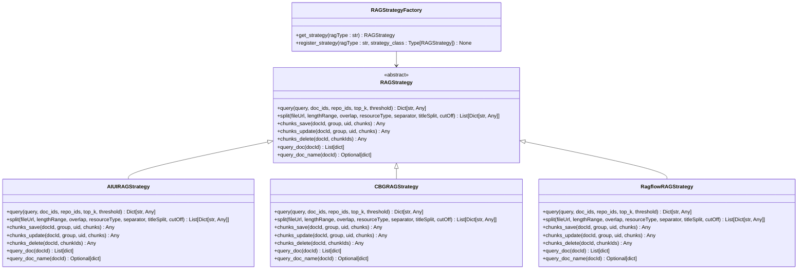
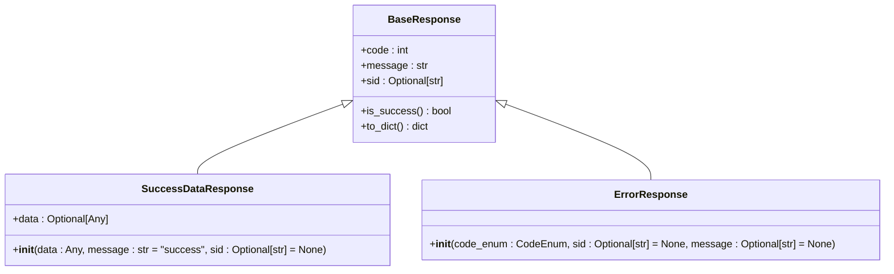
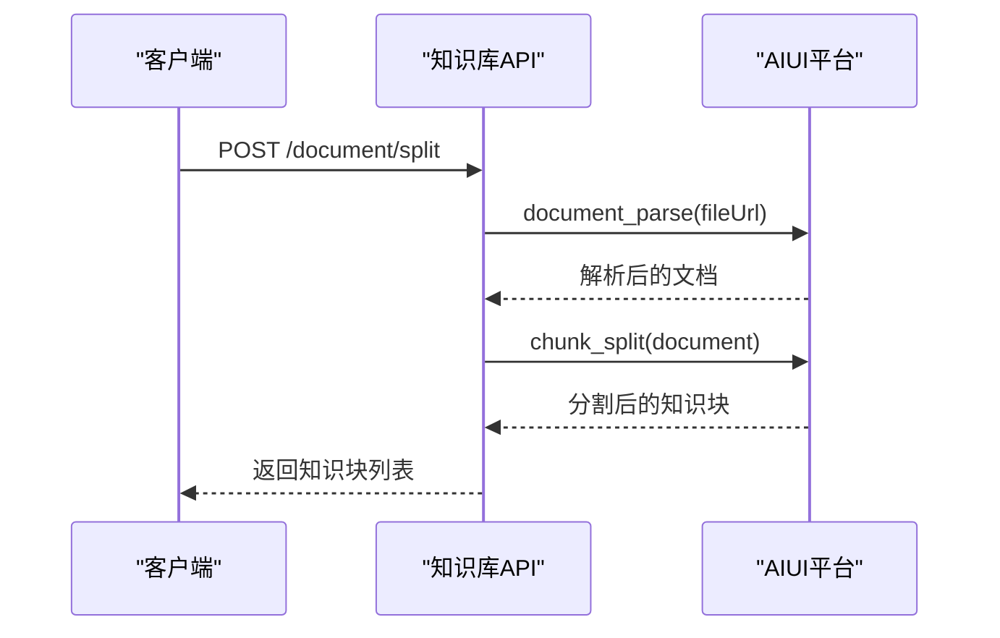
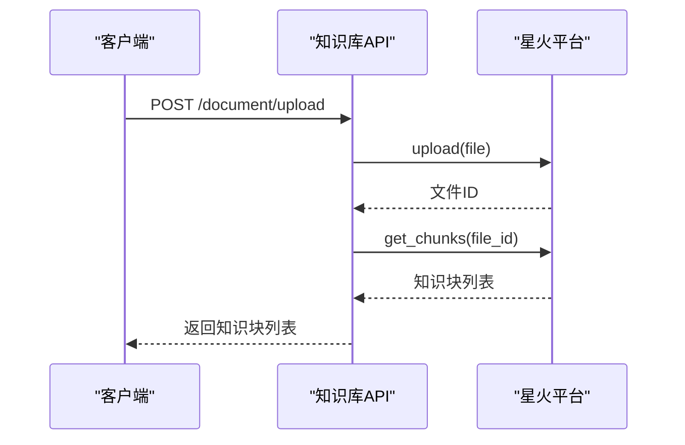
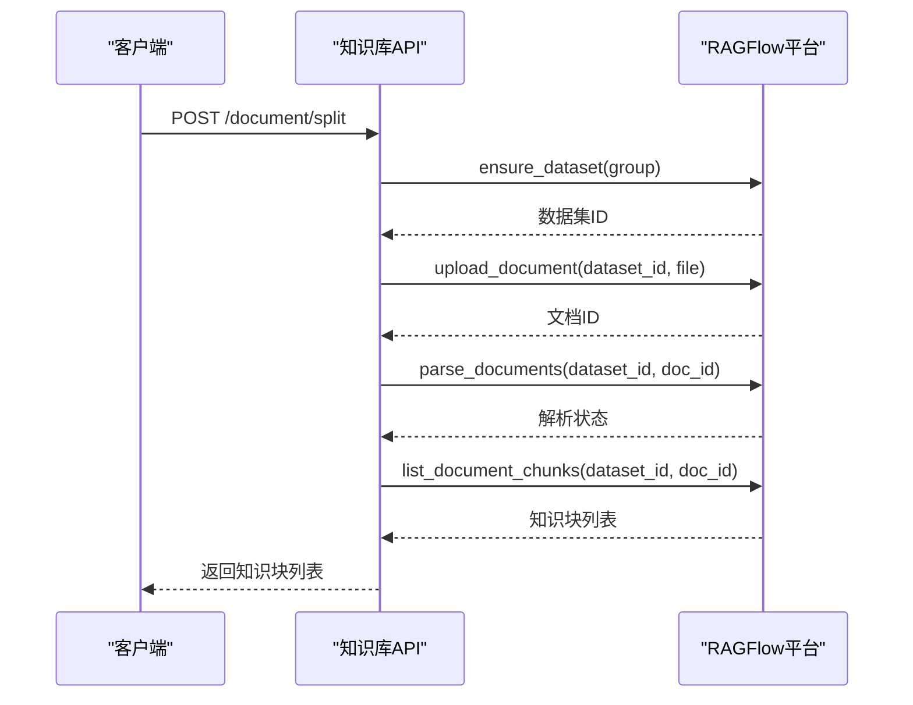

# 知识库API

<cite>
**本文档引用的文件**
- [api.py](file://core/knowledge/api/v1/api.py)
- [rag_strategy_factory.py](file://core/knowledge/service/rag_strategy_factory.py)
- [rag_strategy.py](file://core/knowledge/service/rag_strategy.py)
- [chunk_dto.py](file://core/knowledge/domain/entity/chunk_dto.py)
- [rag_do.py](file://core/knowledge/domain/entity/rag_do.py)
- [response.py](file://core/knowledge/domain/response.py)
- [error_code.py](file://core/knowledge/consts/error_code.py)
- [exception.py](file://core/knowledge/exceptions/exception.py)
- [aiui_strategy.py](file://core/knowledge/service/impl/aiui_strategy.py)
- [cbg_strategy.py](file://core/knowledge/service/impl/cbg_strategy.py)
- [ragflow_strategy.py](file://core/knowledge/service/impl/ragflow_strategy.py)
</cite>

## 目录
1. [简介](#简介)
2. [核心概念](#核心概念)
3. [通用响应格式](#通用响应格式)
4. [文档处理API](#文档处理api)
   - [文档分割](#文档分割)
   - [文件上传与分割](#文件上传与分割)
5. [知识库管理API](#知识库管理api)
   - [保存知识块](#保存知识块)
   - [更新知识块](#更新知识块)
   - [删除知识块](#删除知识块)
6. [检索API](#检索api)
   - [知识块查询](#知识块查询)
   - [文档信息查询](#文档信息查询)
   - [文档名称查询](#文档名称查询)
7. [知识库策略实现](#知识库策略实现)
   - [AIUI策略](#aiui策略)
   - [CBG策略](#cbg策略)
   - [Ragflow策略](#ragflow策略)
8. [错误码列表](#错误码列表)
9. [使用示例](#使用示例)

## 简介
知识库API提供了一套完整的文档上传、索引和检索功能，支持多种知识库策略（AIUI、CBG、Ragflow）。该API允许用户创建、更新和管理知识库，并通过RESTful接口进行文档的分割、索引和检索操作。

**Section sources**
- [api.py](file://core/knowledge/api/v1/api.py#L1-L479)

## 核心概念
知识库API基于RAG（Retrieval-Augmented Generation）技术，主要包含以下核心概念：

- **知识库策略 (RAGType)**: 支持多种知识库实现策略，包括AIUI-RAG2、CBG-RAG、SparkDesk-RAG和Ragflow-RAG。
- **文档分割**: 将上传的文档按照指定规则分割成多个知识块。
- **知识块 (Chunk)**: 文档分割后的基本单位，包含文本内容和元数据。
- **索引**: 将知识块存储到知识库中，以便后续检索。
- **检索**: 根据用户查询从知识库中检索相关知识块。



**Diagram sources**
- [rag_strategy.py](file://core/knowledge/service/rag_strategy.py#L1-L87)
- [rag_strategy_factory.py](file://core/knowledge/service/rag_strategy_factory.py#L1-L95)
- [aiui_strategy.py](file://core/knowledge/service/impl/aiui_strategy.py#L1-L270)
- [cbg_strategy.py](file://core/knowledge/service/impl/cbg_strategy.py#L1-L375)
- [ragflow_strategy.py](file://core/knowledge/service/impl/ragflow_strategy.py#L1-L1016)

## 通用响应格式
所有API端点返回统一的响应格式，包含成功响应和错误响应两种类型。

### 成功响应
```json
{
  "code": 0,
  "message": "success",
  "sid": "string",
  "data": {}
}
```

### 错误响应
```json
{
  "code": 10001,
  "message": "Parameter check exception",
  "sid": "string"
}
```



**Diagram sources**
- [response.py](file://core/knowledge/domain/response.py#L1-L59)

**Section sources**
- [response.py](file://core/knowledge/domain/response.py#L1-L59)

## 文档处理API
文档处理API提供了文档分割和文件上传功能，支持多种输入方式和分割参数。

### 文档分割
将提供的文本内容进行分割。

**端点**: `POST /knowledge/v1/document/split`

#### 请求参数
| 参数 | 类型 | 必填 | 描述 |
|------|------|------|------|
| file | string | 是 | 文件内容或路径 |
| resourceType | int | 否 | 资源类型，0-普通文件，1-URL网页，默认为0 |
| ragType | string | 是 | RAG类型，支持AIUI-RAG2、CBG-RAG、SparkDesk-RAG、Ragflow-RAG |
| lengthRange | array[int] | 否 | 分割长度范围 |
| overlap | int | 否 | 重叠长度 |
| separator | array[string] | 否 | 分隔符列表 |
| cutOff | array[string] | 否 | 截断标记列表 |
| titleSplit | boolean | 否 | 是否按标题分割，默认为False |

#### 返回值
分割后的知识块列表。

#### 错误码
- 10001: 参数检查异常
- 10016: 文件分割失败

**Section sources**
- [api.py](file://core/knowledge/api/v1/api.py#L100-L130)
- [chunk_dto.py](file://core/knowledge/domain/entity/chunk_dto.py#L1-L164)

### 文件上传与分割
上传文件并进行分割。

**端点**: `POST /knowledge/v1/document/upload`

#### 请求参数
| 参数 | 类型 | 必填 | 描述 |
|------|------|------|------|
| file | file | 是 | 上传的文件 |
| ragType | string | 是 | RAG类型 |
| lengthRange | string | 否 | 分割长度范围的JSON数组字符串，如"[256, 1024]" |
| separator | string | 否 | 分隔符列表的JSON数组字符串，如"[\\"\\n\\", ". "]" |

#### 返回值
分割后的知识块列表。

#### 错误码
- 10001: 参数检查异常
- 10016: 文件分割失败

**Section sources**
- [api.py](file://core/knowledge/api/v1/api.py#L132-L184)
- [chunk_dto.py](file://core/knowledge/domain/entity/chunk_dto.py#L1-L164)

## 知识库管理API
知识库管理API提供了知识块的保存、更新和删除功能。

### 保存知识块
将分割后的知识块保存到知识库中。

**端点**: `POST /knowledge/v1/chunks/save`

#### 请求参数
| 参数 | 类型 | 必填 | 描述 |
|------|------|------|------|
| docId | string | 是 | 文档ID |
| group | string | 是 | 组标识符 |
| uid | string | 否 | 用户ID |
| chunks | array[any] | 是 | 知识块列表，至少包含一个元素 |
| ragType | string | 是 | RAG类型 |

#### 返回值
保存操作的结果。

#### 错误码
- 10001: 参数检查异常
- 10017: 知识块保存失败

**Section sources**
- [api.py](file://core/knowledge/api/v1/api.py#L186-L210)
- [chunk_dto.py](file://core/knowledge/domain/entity/chunk_dto.py#L1-L164)

### 更新知识块
更新知识库中的知识块。

**端点**: `POST /knowledge/v1/chunk/update`

#### 请求参数
| 参数 | 类型 | 必填 | 描述 |
|------|------|------|------|
| docId | string | 是 | 文档ID |
| group | string | 是 | 组标识符 |
| uid | string | 否 | 用户ID |
| chunks | array[dict] | 是 | 知识块字典列表，至少包含一个元素 |
| ragType | string | 是 | RAG类型 |

#### 返回值
更新操作的结果。

#### 错误码
- 10001: 参数检查异常
- 10018: 知识块更新失败

**Section sources**
- [api.py](file://core/knowledge/api/v1/api.py#L212-L236)
- [chunk_dto.py](file://core/knowledge/domain/entity/chunk_dto.py#L1-L164)

### 删除知识块
从知识库中删除知识块。

**端点**: `POST /knowledge/v1/chunk/delete`

#### 请求参数
| 参数 | 类型 | 必填 | 描述 |
|------|------|------|------|
| docId | string | 是 | 文档ID |
| chunkIds | array[string] | 否 | 知识块ID列表 |
| ragType | string | 是 | RAG类型 |

#### 返回值
删除操作的结果。

#### 错误码
- 10001: 参数检查异常
- 10019: 知识块删除失败

**Section sources**
- [api.py](file://core/knowledge/api/v1/api.py#L238-L262)
- [chunk_dto.py](file://core/knowledge/domain/entity/chunk_dto.py#L1-L164)

## 检索API
检索API提供了基于用户查询内容的知识块检索功能。

### 知识块查询
根据用户输入内容检索相似的知识块。

**端点**: `POST /knowledge/v1/chunk/query`

#### 请求参数
| 参数 | 类型 | 必填 | 描述 |
|------|------|------|------|
| query | string | 是 | 查询文本 |
| topN | int | 是 | 返回结果数量，范围1~5 |
| match | object | 是 | 匹配条件 |
| &nbsp;&nbsp;docIds | array[string] | 否 | 文档ID列表 |
| &nbsp;&nbsp;repoId | array[string] | 是 | 知识库ID列表，至少包含一个元素 |
| &nbsp;&nbsp;threshold | float | 否 | 相似度阈值，范围0~1，默认为0 |
| &nbsp;&nbsp;flowId | string | 否 | 流程ID |
| ragType | string | 是 | RAG类型 |

#### 返回值
检索结果，包含查询文本、结果数量和结果列表。

#### 错误码
- 10001: 参数检查异常
- 10020: 知识块查询失败

**Section sources**
- [api.py](file://core/knowledge/api/v1/api.py#L264-L288)
- [chunk_dto.py](file://core/knowledge/domain/entity/chunk_dto.py#L1-L164)

### 文档信息查询
查询文档的知识块信息。

**端点**: `POST /knowledge/v1/document/chunk`

#### 请求参数
| 参数 | 类型 | 必填 | 描述 |
|------|------|------|------|
| docId | string | 是 | 文档ID |
| ragType | string | 是 | RAG类型 |

#### 返回值
文档的所有知识块信息列表。

#### 错误码
- 10001: 参数检查异常
- 10024: 文件内容获取失败

**Section sources**
- [api.py](file://core/knowledge/api/v1/api.py#L290-L310)
- [chunk_dto.py](file://core/knowledge/domain/entity/chunk_dto.py#L1-L164)

### 文档名称查询
查询文档的名称信息。

**端点**: `POST /knowledge/v1/document/name`

#### 请求参数
| 参数 | 类型 | 必填 | 描述 |
|------|------|------|------|
| docId | string | 是 | 文档ID |
| ragType | string | 是 | RAG类型 |

#### 返回值
文档的名称和信息。

#### 错误码
- 10001: 参数检查异常

**Section sources**
- [api.py](file://core/knowledge/api/v1/api.py#L312-L332)
- [chunk_dto.py](file://core/knowledge/domain/entity/chunk_dto.py#L1-L164)

## 知识库策略实现
知识库API支持多种策略实现，每种策略针对不同的应用场景和需求。

### AIUI策略
AIUI策略基于AIUI平台实现，提供强大的文档解析和知识管理功能。

#### 实现特点
- 强制按标题分割
- 默认分割长度范围为[16, 512]
- 默认重叠长度为16
- 默认分隔符为["。", "！", "；", "？"]

#### 使用场景
适用于需要精确按标题结构分割文档的场景，特别适合技术文档、论文等结构化文档的处理。



**Diagram sources**
- [aiui_strategy.py](file://core/knowledge/service/impl/aiui_strategy.py#L1-L270)

**Section sources**
- [aiui_strategy.py](file://core/knowledge/service/impl/aiui_strategy.py#L1-L270)

### CBG策略
CBG策略基于星火大模型实现，提供高效的文档处理和检索能力。

#### 实现特点
- 支持Base64编码的分隔符
- 默认分割长度为2000，最小分割长度为256
- 支持URL和文件上传两种输入方式

#### 使用场景
适用于需要处理大文件和复杂格式文档的场景，特别适合企业知识库、客户支持文档等大规模文档集合的管理。



**Diagram sources**
- [cbg_strategy.py](file://core/knowledge/service/impl/cbg_strategy.py#L1-L375)

**Section sources**
- [cbg_strategy.py](file://core/knowledge/service/impl/cbg_strategy.py#L1-L375)

### Ragflow策略
Ragflow策略基于RAGFlow平台实现，提供完整的文档处理流水线。

#### 实现特点
- 支持数据集管理
- 完整的文档处理流程：上传、解析、分割、索引
- 支持配置默认数据集
- 提供详细的错误处理和日志记录

#### 使用场景
适用于需要完整文档处理流水线的场景，特别适合需要严格控制文档处理流程和质量的企业应用。



**Diagram sources**
- [ragflow_strategy.py](file://core/knowledge/service/impl/ragflow_strategy.py#L1-L1016)

**Section sources**
- [ragflow_strategy.py](file://core/knowledge/service/impl/ragflow_strategy.py#L1-L1016)

## 错误码列表
以下是知识库API使用的错误码列表：

| 错误码 | 错误信息 | 描述 |
|--------|---------|------|
| 10001 | Parameter check exception | 参数检查异常 |
| 10002 | Missing parameter | 缺少参数 |
| 10003 | Parameter invalid | 参数无效 |
| 10004 | Unexpected recv user message invalid | 意外的用户消息无效 |
| 10016 | File splitting failed | 文件分割失败 |
| 10017 | Chunk save failed | 知识块保存失败 |
| 10018 | Chunk update failed | 知识块更新失败 |
| 10019 | Chunk delete failed | 知识块删除失败 |
| 10020 | Chunk query failed | 知识块查询失败 |
| 10024 | File content retrieval failed | 文件内容获取失败 |
| 10025 | File storage failed | 文件存储失败 |
| 10026 | Xinghuo knowledge base request failed | 星火知识库请求失败 |
| 10027 | AIUI knowledge base request failed | AIUI知识库请求失败 |
| 10028 | DESK knowledge base request failed | DESK知识库请求失败 |
| 11111 | Third Party Service Failed | 第三方服务失败 |
| 14999 | Service Exception | 服务异常 |

**Section sources**
- [error_code.py](file://core/knowledge/consts/error_code.py#L1-L48)

## 使用示例
以下是一些使用知识库API的示例代码。

### Python示例
```python
import requests
import json

# 设置请求头
headers = {
    "app_id": "your_app_id",
    "Content-Type": "application/json"
}

# 文档分割示例
split_data = {
    "file": "path/to/your/document.pdf",
    "ragType": "AIUI-RAG2",
    "lengthRange": [256, 1024],
    "separator": ["\n", ". "]
}

response = requests.post(
    "http://your-api-server/knowledge/v1/document/split",
    headers=headers,
    json=split_data
)

print(response.json())
```

### cURL示例
```bash
# 文件上传与分割
curl -X POST "http://your-api-server/knowledge/v1/document/upload" \
  -H "app_id: your_app_id" \
  -F "file=@document.pdf" \
  -F "ragType=CBG-RAG" \
  -F "lengthRange=[256, 1024]" \
  -F "separator=[\"\\n\", \". \"]"

# 知识块查询
curl -X POST "http://your-api-server/knowledge/v1/chunk/query" \
  -H "app_id: your_app_id" \
  -H "Content-Type: application/json" \
  -d '{
    "query": "人工智能的发展",
    "topN": 3,
    "match": {
      "repoId": ["repo_123"],
      "threshold": 0.8
    },
    "ragType": "Ragflow-RAG"
  }'
```

**Section sources**
- [api.py](file://core/knowledge/api/v1/api.py#L1-L479)
- [rag_strategy_factory.py](file://core/knowledge/service/rag_strategy_factory.py#L1-L95)