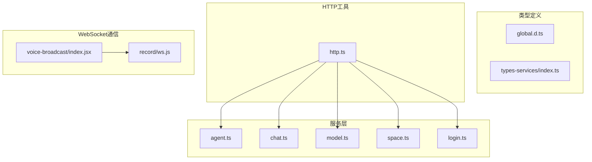
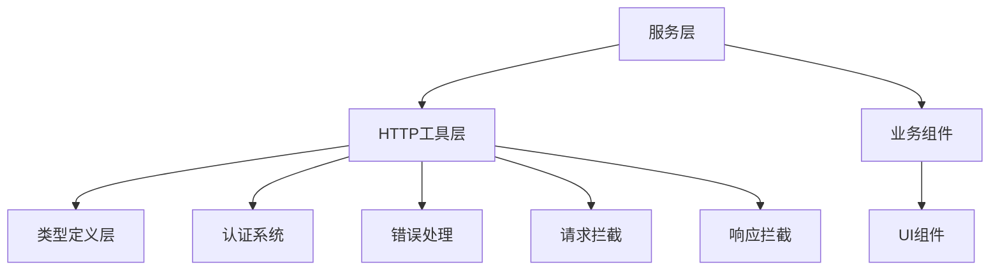
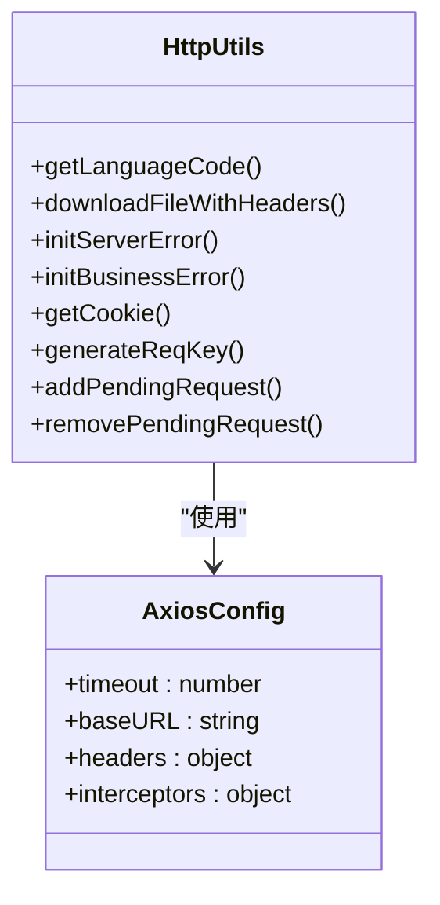
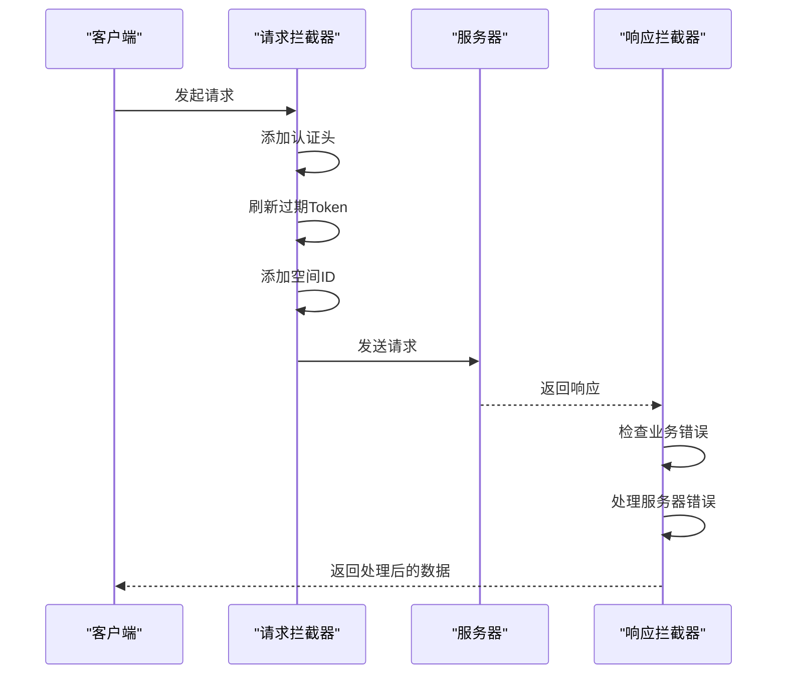
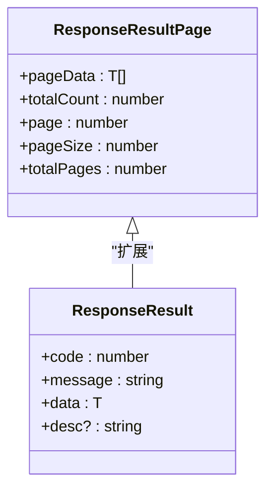
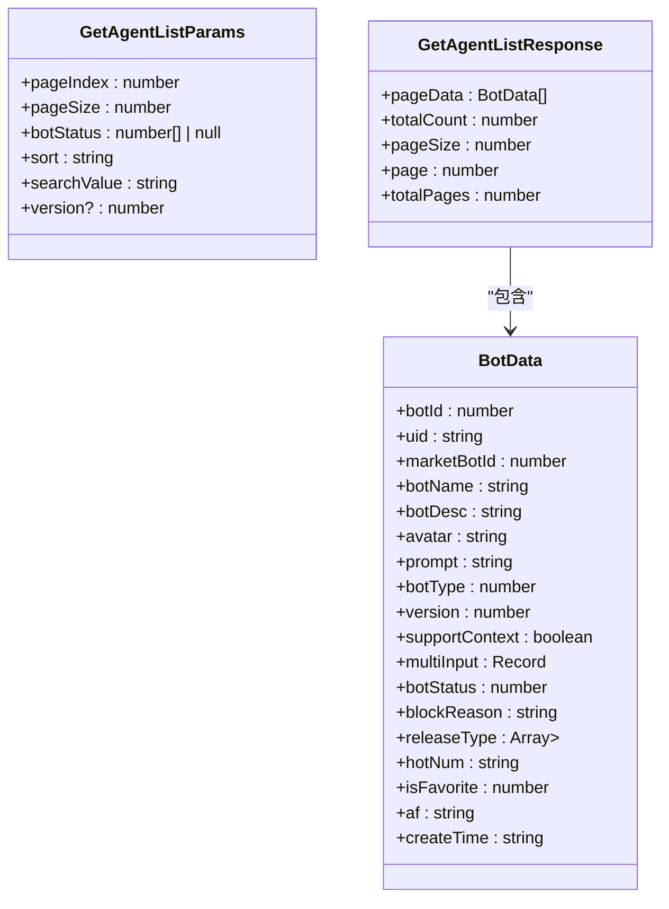
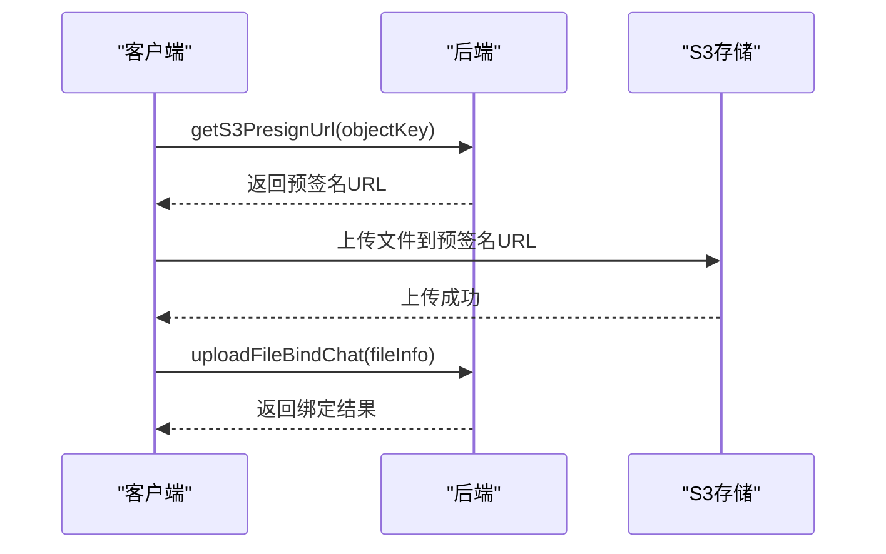
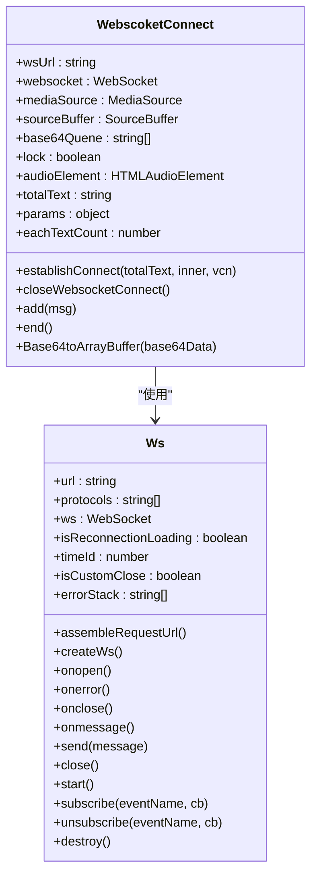
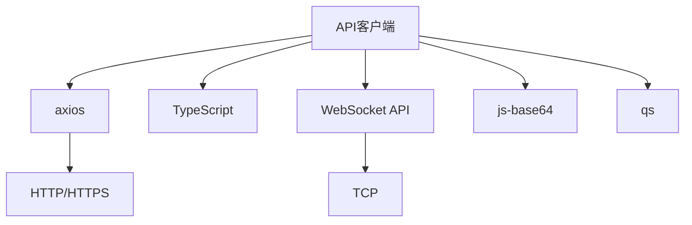

# API客户端

<cite>
**本文档引用的文件**
- [http.ts](file://console/frontend/src/utils/http.ts)
- [agent.ts](file://console/frontend/src/services/agent.ts)
- [chat.ts](file://console/frontend/src/services/chat.ts)
- [model.ts](file://console/frontend/src/services/model.ts)
- [space.ts](file://console/frontend/src/services/space.ts)
- [login.ts](file://console/frontend/src/services/login.ts)
- [global.d.ts](file://console/frontend/src/types/global.d.ts)
- [index.ts](file://console/frontend/src/types/types-services/index.ts)
- [WebscoketConnect](file://console/frontend/src/components/voice-broadcast/index.jsx)
- [ws.js](file://console/frontend/src/utils/record/ws.js)
</cite>

## 目录
1. [简介](#简介)
2. [项目结构](#项目结构)
3. [核心组件](#核心组件)
4. [架构概述](#架构概述)
5. [详细组件分析](#详细组件分析)
6. [依赖分析](#依赖分析)
7. [性能考虑](#性能考虑)
8. [故障排除指南](#故障排除指南)
9. [结论](#结论)
10. [附录](#附录)（如有必要）

## 简介
本文档详细描述了astron-agent项目中API客户端的实现，重点关注前端与后端微服务的通信机制。文档涵盖了服务层的组织结构、HTTP客户端的封装与配置、请求/响应的数据转换、类型安全的实现，以及文件上传、WebSocket通信等特殊通信模式的处理。

## 项目结构
前端API客户端的实现主要位于`console/frontend/src`目录下，其结构清晰地分离了服务、类型定义和工具函数。



**Diagram sources**
- [http.ts](file://console/frontend/src/utils/http.ts)
- [services](file://console/frontend/src/services)
- [types](file://console/frontend/src/types)
- [voice-broadcast/index.jsx](file://console/frontend/src/components/voice-broadcast/index.jsx)
- [ws.js](file://console/frontend/src/utils/record/ws.js)

**Section sources**
- [http.ts](file://console/frontend/src/utils/http.ts)
- [services](file://console/frontend/src/services)

## 核心组件
API客户端的核心组件包括HTTP请求封装、服务层实现、类型安全机制和WebSocket通信。HTTP客户端基于axios库进行封装，提供了统一的请求拦截、响应处理、错误处理和认证机制。服务层将后端API按功能模块化，每个服务文件对应一组相关的API端点。

**Section sources**
- [http.ts](file://console/frontend/src/utils/http.ts)
- [services](file://console/frontend/src/services)

## 架构概述
API客户端的架构采用分层设计，从上到下分为服务层、HTTP工具层和类型定义层。服务层提供业务逻辑相关的API调用接口，HTTP工具层负责底层的HTTP通信和通用处理逻辑，类型定义层确保数据的类型安全。



**Diagram sources**
- [http.ts](file://console/frontend/src/utils/http.ts)
- [services](file://console/frontend/src/services)

## 详细组件分析

### HTTP客户端封装与配置
API客户端使用axios库进行HTTP通信的封装，通过`http.ts`文件提供了统一的配置和拦截器。

#### HTTP客户端配置


**Diagram sources**
- [http.ts](file://console/frontend/src/utils/http.ts#L1-L485)

#### 请求/响应拦截器


**Diagram sources**
- [http.ts](file://console/frontend/src/utils/http.ts#L200-L400)

**Section sources**
- [http.ts](file://console/frontend/src/utils/http.ts#L200-L485)

### 服务层组织结构
服务层位于`src/services`目录下，每个文件对应后端的一个功能模块，实现了与后端API的通信。

#### 服务文件与API对应关系
| 服务文件 | 对应API功能 | 主要端点 |
|---------|-----------|---------|
| agent.ts | 智能体管理 | /sparkbot/createBot, /sparkbot/updateBot |
| chat.ts | 聊天会话 | /chat-list/v1/create-chat-list, /chat-message/stop |
| model.ts | 模型管理 | /api/model, /api/model/list |
| space.ts | 空间管理 | /space/create-personal-space, /space/personal-list |
| login.ts | 登录认证 | /api/v1/auth/userLogout, /user-info/me |

**Section sources**
- [agent.ts](file://console/frontend/src/services/agent.ts)
- [chat.ts](file://console/frontend/src/services/chat.ts)
- [model.ts](file://console/frontend/src/services/model.ts)
- [space.ts](file://console/frontend/src/services/space.ts)
- [login.ts](file://console/frontend/src/services/login.ts)

### 类型安全实现
API客户端通过TypeScript接口确保请求和响应数据的类型安全。

#### 响应结果类型定义


**Diagram sources**
- [global.d.ts](file://console/frontend/src/types/global.d.ts#L1-L40)

#### 服务类型定义


**Diagram sources**
- [agent.ts](file://console/frontend/src/services/agent.ts#L1-L50)
- [types-services/index.ts](file://console/frontend/src/types/types-services/index.ts)

**Section sources**
- [global.d.ts](file://console/frontend/src/types/global.d.ts)
- [types-services/index.ts](file://console/frontend/src/types/types-services/index.ts)

### 特殊通信模式处理

#### 文件上传处理
文件上传采用分步处理模式：首先获取S3预签名URL，然后直接上传到S3，最后通知后端绑定文件。



**Diagram sources**
- [chat.ts](file://console/frontend/src/services/chat.ts#L150-L200)

#### WebSocket通信
WebSocket通信用于实时语音合成和语音识别，通过自定义的WebSocket封装类实现。



**Diagram sources**
- [voice-broadcast/index.jsx](file://console/frontend/src/components/voice-broadcast/index.jsx)
- [ws.js](file://console/frontend/src/utils/record/ws.js)

**Section sources**
- [voice-broadcast/index.jsx](file://console/frontend/src/components/voice-broadcast/index.jsx)
- [ws.js](file://console/frontend/src/utils/record/ws.js)

## 依赖分析
API客户端的依赖关系清晰，主要依赖axios进行HTTP通信，依赖TypeScript进行类型安全，依赖WebSocket API进行实时通信。



**Diagram sources**
- [package.json](file://console/frontend/package.json)
- [http.ts](file://console/frontend/src/utils/http.ts)

**Section sources**
- [http.ts](file://console/frontend/src/utils/http.ts)
- [package.json](file://console/frontend/package.json)

## 性能考虑
API客户端在性能方面进行了多项优化，包括请求取消、重复请求处理、Token自动刷新等。

### 请求取消与重复请求处理
客户端实现了请求取消机制，通过`pendingRequest` Map存储待处理的请求，并在新的相同请求发起时取消之前的请求，避免重复请求造成的资源浪费。

### Token自动刷新
客户端实现了Token自动刷新机制，通过`refreshingPromise`确保在Token过期时只发起一次刷新请求，避免多个并发请求同时触发刷新。

### 预签名URL上传
文件上传采用预签名URL直接上传到S3的模式，避免了通过后端中转造成的带宽和性能瓶颈。

## 故障排除指南
### 常见错误代码处理
| 错误代码 | 含义 | 处理方式 |
|--------|-----|--------|
| 100 | 服务器错误 | 显示"服务器开小差了~稍后再试" |
| 101 | 未登录 | 跳转到登录页 |
| 11120 | 套餐用量耗尽 | 显示用量耗尽提示 |
| 80000, 90000 | 登录异常 | 跳转到登录页 |
| 80001, 80004 | 空间不存在 | 跳转到智能体列表页 |
| 99900 | 星火注销 | 跳转到星火页面 |
| 10004 | 永久封禁 | 跳转到封禁页面 |
| 10003 | 24小时封禁 | 显示错误并跳转 |

**Section sources**
- [http.ts](file://console/frontend/src/utils/http.ts#L150-L200)

### 调试技巧
1. 在浏览器开发者工具中查看网络请求，检查请求头、响应状态码和响应数据
2. 检查localStorage中的accessToken和refreshToken是否有效
3. 查看控制台日志，特别是WebSocket连接和错误信息
4. 使用`downloadFileWithHeaders`函数调试文件下载问题

## 结论
astron-agent项目的API客户端实现了完整的前端与后端微服务通信机制。通过合理的分层设计、类型安全的实现和高效的通信模式，客户端提供了稳定可靠的API访问能力。HTTP客户端的封装提供了统一的认证、错误处理和请求管理，服务层的模块化设计使代码易于维护和扩展。对于实时通信需求，WebSocket的实现提供了低延迟的语音合成和识别能力。

## 附录

### API调用示例
```typescript
// 创建智能体
import { createBotAPI } from '@/services/agent';

const params = {
  botName: '我的智能体',
  botDesc: '这是一个测试智能体',
  avatar: 'avatar.png',
  prompt: '你是一个助手'
};

try {
  const response = await createBotAPI(params);
  console.log('智能体创建成功:', response);
} catch (error) {
  console.error('创建失败:', error);
}

// 创建聊天会话
import { postCreateChat } from '@/services/chat';

try {
  const response = await postCreateChat(123);
  console.log('聊天会话创建成功:', response);
} catch (error) {
  console.error('创建失败:', error);
}

// WebSocket语音合成
import WebscoketConnect from '@/components/voice-broadcast';

const wsUrl = 'wss://example.com/tts';
const audioElement = document.getElementById('audio');
const wsConnect = new WebscoketConnect(wsUrl, audioElement);

wsConnect.establishConnect('要合成的文本', false, 'xiaoyan');
```