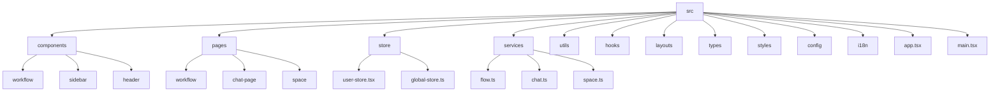
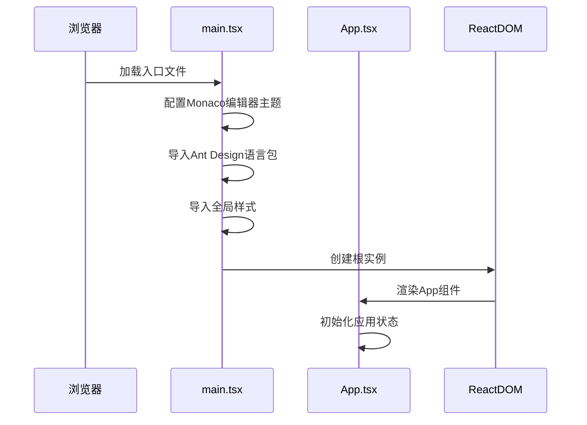
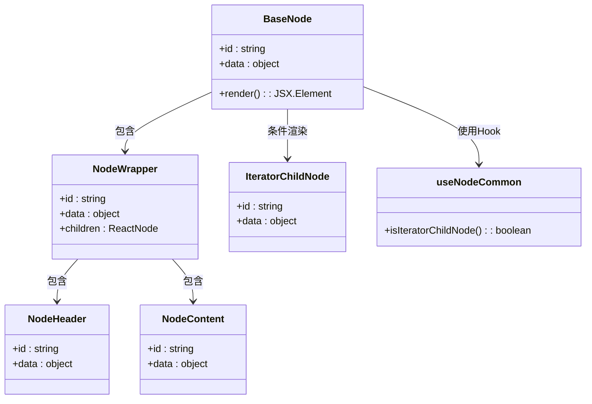
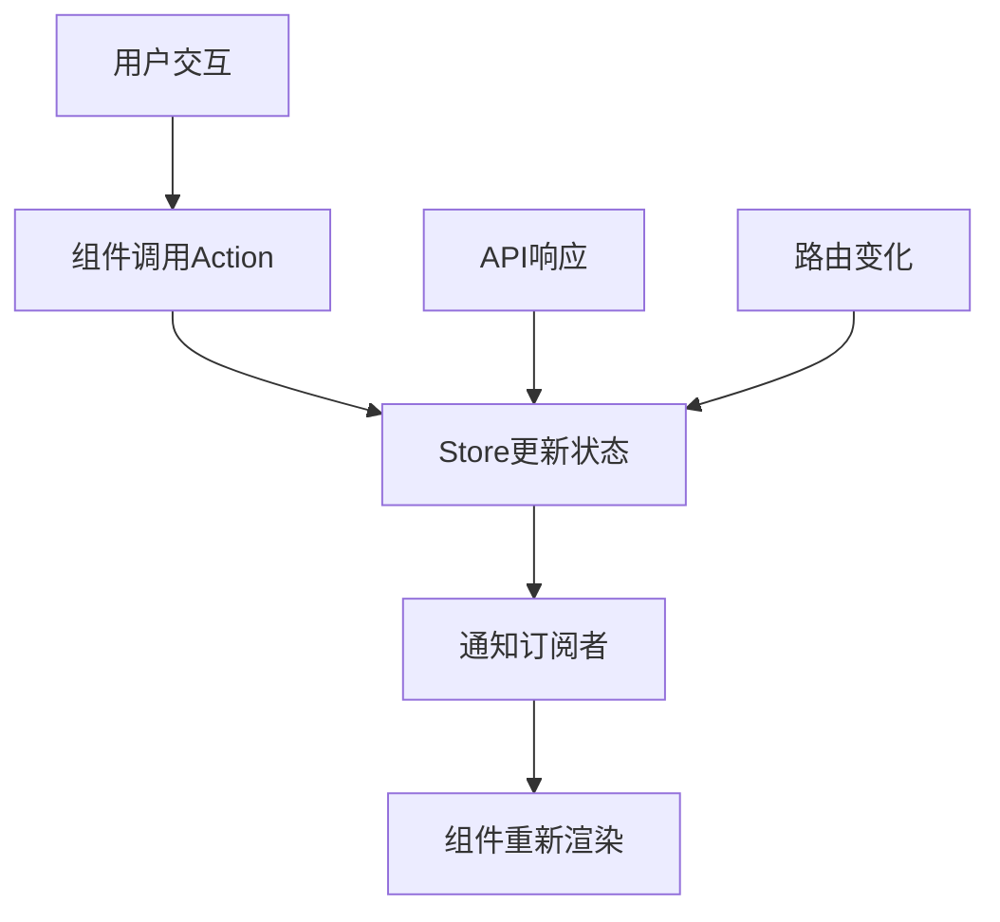
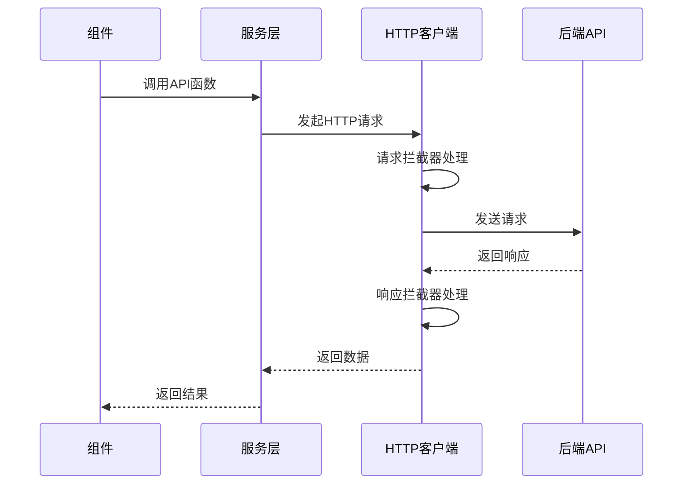
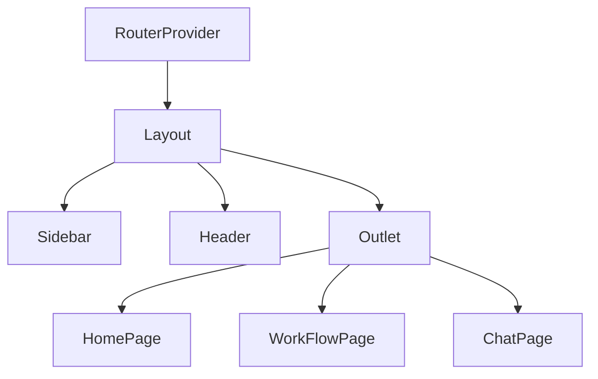
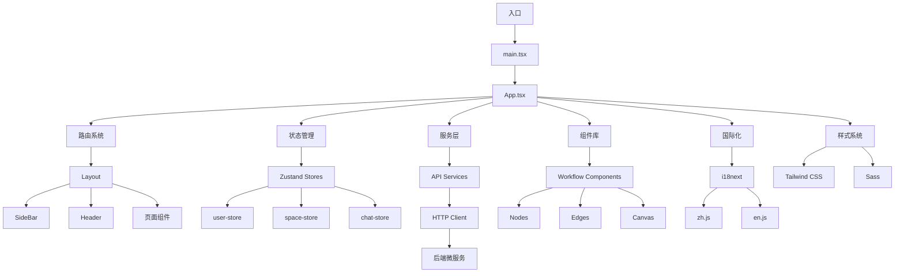

# 前端架构

<cite>
**本文档引用的文件**  
- [main.tsx](file://console/frontend/src/main.tsx)
- [app.tsx](file://console/frontend/src/app.tsx)
- [router/index.tsx](file://console/frontend/src/router/index.tsx)
- [layouts/index.tsx](file://console/frontend/src/layouts/index.tsx)
- [user-store.tsx](file://console/frontend/src/store/user-store.tsx)
- [http.ts](file://console/frontend/src/utils/http.ts)
- [i18n/index.ts](file://console/frontend/src/i18n/index.ts)
- [workflow/nodes/index.tsx](file://console/frontend/src/components/workflow/nodes/index.tsx)
- [workflow/edges/index.tsx](file://console/frontend/src/components/workflow/edges/index.tsx)
- [workflow/hooks/use-node-common.tsx](file://console/frontend/src/components/workflow/hooks/use-node-common.tsx)
- [services/flow.ts](file://console/frontend/src/services/flow.ts)
- [package.json](file://console/frontend/package.json)
</cite>

## 目录
1. [简介](#简介)
2. [项目结构](#项目结构)
3. [入口点与主组件](#入口点与主组件)
4. [组件体系设计](#组件体系设计)
5. [状态管理（Zustand）](#状态管理zustand)
6. [API客户端与微服务通信](#api客户端与微服务通信)
7. [路由系统](#路由系统)
8. [国际化（i18n）](#国际化i18n)
9. [样式管理（Tailwind CSS）](#样式管理tailwind-css)
10. [前端架构图](#前端架构图)

## 简介
本架构文档深入分析了Astron Agent前端应用的设计与实现。该应用基于React技术栈构建，采用现代化的前端工程化方案，支持多语言、多租户、工作流编排等复杂功能。系统通过Zustand进行状态管理，使用React Router实现路由控制，并通过自定义HTTP客户端与后端微服务进行通信。整体架构注重可维护性、可扩展性和用户体验。

## 项目结构
前端项目位于`console/frontend`目录下，采用标准的React项目结构，结合Vite构建工具。项目组织清晰，按功能模块划分目录，便于维护和扩展。

**Diagram sources**  
- [console/frontend/src](file://console/frontend/src)

**Section sources**  
- [console/frontend/src](file://console/frontend/src)

## 入口点与主组件
### 入口文件 (main.tsx)
`main.tsx`是应用的入口文件，负责初始化React应用、配置全局依赖和启动渲染流程。

该文件首先导入并配置Monaco编辑器主题，然后引入Ant Design的国际化语言包（中文和英文），并配置全局样式文件。应用通过`ConfigProvider`组件注入Ant Design的国际化配置，并最终渲染根组件`App`。

**Diagram sources**  
- [main.tsx](file://console/frontend/src/main.tsx#L1-L29)

**Section sources**  
- [main.tsx](file://console/frontend/src/main.tsx#L1-L29)

### 主组件 (app.tsx)
`app.tsx`是应用的主组件，负责协调全局状态、初始化用户信息和空间信息，并提供路由上下文。

该组件使用多个自定义Hook（`useUserStore`、`useEnterprise`、`useSpaceType`）来管理用户、企业及空间状态。在组件挂载时，通过`useEffect`钩子调用`getUserInfo()`获取用户信息，并初始化空间相关数据。组件返回`RouterProvider`，将路由系统注入应用。

**Section sources**  
- [app.tsx](file://console/frontend/src/app.tsx#L1-L55)

## 组件体系设计
### 工作流组件体系
工作流相关组件位于`components/workflow`目录下，采用React Flow库构建可视化工作流编辑器。

#### 节点 (Nodes)
工作流节点是流程图的基本单元，每个节点由`NodeWrapper`、`NodeHeader`和`NodeContent`组成。`BaseNode`组件通过`useNodeCommon` Hook判断节点类型（普通节点或迭代子节点），并渲染相应的UI结构。

**Diagram sources**  
- [workflow/nodes/index.tsx](file://console/frontend/src/components/workflow/nodes/index.tsx#L1-L27)
- [components/workflow/hooks/use-node-common.tsx](file://console/frontend/src/components/workflow/hooks/use-node-common.tsx)

#### 边 (Edges)
边组件负责连接节点，表示工作流中的执行路径。边的实现利用React Flow提供的边渲染机制，支持自定义样式和交互行为。

#### 画布 (Canvas)
画布由`reactflow`库提供，作为工作流编辑器的容器，管理节点和边的布局、拖拽、缩放等交互功能。

**Section sources**  
- [workflow/nodes/index.tsx](file://console/frontend/src/components/workflow/nodes/index.tsx#L1-L27)
- [workflow/edges/index.tsx](file://console/frontend/src/components/workflow/edges/index.tsx)
- [components/workflow/hooks/use-node-common.tsx](file://console/frontend/src/components/workflow/hooks/use-node-common.tsx)

## 状态管理（Zustand）
应用采用Zustand作为状态管理解决方案，替代了传统的Redux。Zustand提供了更简洁的API和更好的TypeScript支持。

### Store组织
状态存储分散在`store`目录下的多个文件中，每个文件对应一个功能模块的状态：
- `user-store.tsx`: 用户信息和登录状态
- `space-store.ts`: 空间和企业信息
- `chat-store.ts`: 聊天会话状态
- `global-store.ts`: 全局UI状态
- `spark-store/*`: 星火相关功能状态

### 数据流
状态更新遵循单向数据流原则。组件通过`useStore` Hook订阅状态，当用户交互或API响应触发状态变更时，store中的action函数被调用，更新状态并通知所有订阅者重新渲染。

**Section sources**  
- [store/user-store.tsx](file://console/frontend/src/store/user-store.tsx#L1-L106)
- [store/index.ts](file://console/frontend/src/store/index.ts)

## API客户端与微服务通信
### HTTP客户端实现
`utils/http.ts`文件封装了基于Axios的HTTP客户端，提供了统一的请求配置、拦截器和错误处理机制。

#### 请求拦截器
- 自动添加认证头（Authorization）
- 添加空间ID（space-id）和企业ID（enterprise-id）上下文
- 处理JWT令牌刷新（PKCE模式）
- 防止重复请求

#### 响应拦截器
- 统一处理业务错误码
- 处理401未授权跳转登录
- 处理特定错误码（如套餐耗尽、账号封禁等）
- 返回标准化的响应数据

### 服务层组织
`services`目录下按功能模块组织API客户端：
- `flow.ts`: 工作流相关API
- `chat.ts`: 聊天功能API
- `space.ts`: 空间管理API
- `login.ts`: 登录认证API
- `agent.ts`: Agent管理API

每个服务文件导出具体的API函数，供上层组件调用。

**Diagram sources**  
- [http.ts](file://console/frontend/src/utils/http.ts#L1-L486)
- [services/flow.ts](file://console/frontend/src/services/flow.ts)

**Section sources**  
- [http.ts](file://console/frontend/src/utils/http.ts#L1-L486)
- [services/flow.ts](file://console/frontend/src/services/flow.ts)

## 路由系统
应用使用React Router v6实现客户端路由控制。路由配置定义在`router/index.tsx`文件中，采用懒加载（lazy loading）优化首屏加载性能。

### 路由结构
- `/home`: 首页
- `/space`: 个人空间
- `/enterprise/:enterpriseId/*`: 企业空间
- `/chat/:botId/:version?`: 聊天页面
- `/work_flow/:id/arrange`: 工作流编辑
- `/work_flow/:id/overview`: 工作流分析
- `/store/plugin`: 插件商店

### 布局系统
`layouts/index.tsx`文件定义了应用布局组件，包含侧边栏（Sidebar）和头部（Header）。布局组件通过`Outlet`渲染子路由内容，并根据路由动态显示或隐藏头部。

**Diagram sources**  
- [router/index.tsx](file://console/frontend/src/router/index.tsx#L1-L271)
- [layouts/index.tsx](file://console/frontend/src/layouts/index.tsx#L1-L99)

**Section sources**  
- [router/index.tsx](file://console/frontend/src/router/index.tsx#L1-L271)
- [layouts/index.tsx](file://console/frontend/src/layouts/index.tsx#L1-L99)

## 国际化（i18n）
应用使用i18next实现国际化支持，支持中文和英文两种语言。

### 实现机制
- `i18n/index.ts`初始化i18next，配置语言检测、资源文件和持久化
- 语言资源定义在`locales/zh.js`和`locales/en.js`中
- 使用`i18next-browser-languagedetector`自动检测浏览器语言
- 语言偏好持久化存储在localStorage中

### 语言切换
应用优先从`recoil-persist`或`locale-storage`中读取保存的语言设置，若不存在则使用浏览器语言作为默认值。语言变更时，通过`i18n.on('languageChanged')`事件更新HTTP请求头。

**Section sources**  
- [i18n/index.ts](file://console/frontend/src/i18n/index.ts#L1-L69)
- [locales/zh.js](file://console/frontend/src/locales/zh.js)
- [locales/en.js](file://console/frontend/src/locales/en.js)

## 样式管理（Tailwind CSS）
应用采用Tailwind CSS作为主要的样式解决方案，结合Sass进行补充。

### 技术栈
- `tailwindcss`: 3.3.5
- `postcss`: 8.4.31
- `autoprefixer`: 10.4.16
- `sass`: ^1.86.0

### 样式文件
- `global.scss`: 全局样式和变量
- `applies.scss`: 通用样式类
- `classes.scss`: 自定义CSS类
- `antd.scss`: Ant Design组件样式覆盖
- `flow.scss`: 工作流相关样式

### 集成方式
在`main.tsx`中导入所有样式文件，确保样式在应用启动时加载。Tailwind的`@apply`指令用于在Sass文件中复用实用类。

**Section sources**  
- [main.tsx](file://console/frontend/src/main.tsx#L1-L29)
- [styles/global.scss](file://console/frontend/src/styles/global.scss)
- [styles/flow.scss](file://console/frontend/src/styles/flow.scss)

## 前端架构图

**Diagram sources**  
- [main.tsx](file://console/frontend/src/main.tsx#L1-L29)
- [app.tsx](file://console/frontend/src/app.tsx#L1-L55)
- [router/index.tsx](file://console/frontend/src/router/index.tsx#L1-L271)
- [store/user-store.tsx](file://console/frontend/src/store/user-store.tsx#L1-L106)
- [services/flow.ts](file://console/frontend/src/services/flow.ts)
- [components/workflow/nodes/index.tsx](file://console/frontend/src/components/workflow/nodes/index.tsx#L1-L27)
- [i18n/index.ts](file://console/frontend/src/i18n/index.ts#L1-L69)
- [styles/global.scss](file://console/frontend/src/styles/global.scss)

**Section sources**  
- [main.tsx](file://console/frontend/src/main.tsx#L1-L29)
- [app.tsx](file://console/frontend/src/app.tsx#L1-L55)
- [router/index.tsx](file://console/frontend/src/router/index.tsx#L1-L271)
- [store/user-store.tsx](file://console/frontend/src/store/user-store.tsx#L1-L106)
- [services/flow.ts](file://console/frontend/src/services/flow.ts)
- [components/workflow/nodes/index.tsx](file://console/frontend/src/components/workflow/nodes/index.tsx#L1-L27)
- [i18n/index.ts](file://console/frontend/src/i18n/index.ts#L1-L69)
- [styles/global.scss](file://console/frontend/src/styles/global.scss)