# 状态管理

<cite>
**本文档引用的文件**   
- [chat-store.ts](file://console/frontend/src/store/chat-store.ts)
- [global-store.ts](file://console/frontend/src/store/global-store.ts)
- [user-store.tsx](file://console/frontend/src/store/user-store.tsx)
- [spark-common.ts](file://console/frontend/src/store/spark-store/spark-common.ts)
- [order-store.ts](file://console/frontend/src/store/spark-store/order-store.ts)
- [bot-state.ts](file://console/frontend/src/store/spark-store/bot-state.ts)
- [space-store.ts](file://console/frontend/src/store/space-store.ts)
- [use-chat.ts](file://console/frontend/src/hooks/use-chat.ts)
- [flow/index.ts](file://console/frontend/src/components/workflow/types/zustand/flow/index.ts)
</cite>

## 目录
1. [项目结构](#项目结构)
2. [核心状态管理实现](#核心状态管理实现)
3. [状态存储设计与组织](#状态存储设计与组织)
4. [状态持久化策略](#状态持久化策略)
5. [自定义Hooks与Store交互](#自定义hooks与store交互)
6. [状态更新模式与异步操作](#状态更新模式与异步操作)
7. [错误处理机制](#错误处理机制)
8. [状态流图](#状态流图)

## 项目结构

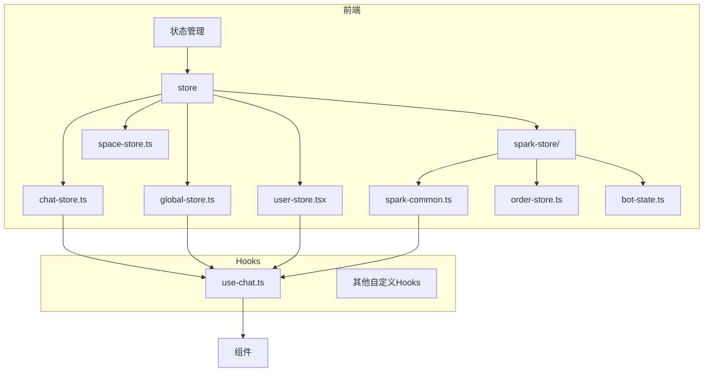

**Diagram sources**
- [chat-store.ts](file://console/frontend/src/store/chat-store.ts)
- [use-chat.ts](file://console/frontend/src/hooks/use-chat.ts)

## 核心状态管理实现

本项目采用Zustand作为全局状态管理解决方案，实现了多个独立的store来管理不同类型的应用状态。Zustand提供了一种轻量级、简单且高效的状态管理方式，通过create函数创建store，并支持中间件如persist来实现状态持久化。

系统中的状态管理遵循单一职责原则，将不同的状态域分离到独立的store中，包括聊天状态、用户信息、全局配置、工作流状态等。这种分割策略提高了代码的可维护性和可测试性，同时避免了状态的过度耦合。

**Section sources**
- [chat-store.ts](file://console/frontend/src/store/chat-store.ts)
- [global-store.ts](file://console/frontend/src/store/global-store.ts)
- [user-store.tsx](file://console/frontend/src/store/user-store.tsx)

## 状态存储设计与组织

### 聊天状态存储

聊天状态存储（chat-store）管理与聊天会话相关的所有状态，包括消息列表、流式响应、加载状态和工作流操作等。该store采用了细粒度的状态分割，将不同的功能模块分离到独立的状态字段中。

```mermaid
classDiagram
class ChatState {
+messageList : MessageListType[]
+chatFileListNoReq : UploadFileInfo[]
+streamingMessage : MessageListType | null
+streamId : string
+answerPercent : number
+controllerRef : AbortController
+isLoading : boolean
+currentToolName : string
+traceSource : string
+deepThinkText : string
+currentChatId : number
+workflowOperation : string[]
+isWorkflowOption : boolean
+workflowOption : {option : Option[], content : string}
+chatType : 'text' | 'voice'
+vmsInteractiveRef : any
+vmsInteractiveRefStatus : string
+vmsInteractiveRefPlayer : any
}
class ChatActions {
+initChatStore() : void
+setMessageList(messageList) : void
+setChatFileListNoReq(updater) : void
+addMessage(message) : void
+startStreamingMessage(message) : void
+updateStreamingMessage(content) : void
+finishStreamingMessage(sid?, reqId?) : void
+clearStreamingMessage() : void
+setStreamId(streamId) : void
+setAnswerPercent(answerPercent) : void
+setControllerRef(controllerRef) : void
+setIsLoading(isLoading) : void
+setCurrentToolName(currentToolName) : void
+setTraceSource(traceSource) : void
+setDeepThinkText(deepThinkText) : void
+setCurrentChatId(currentChatId) : void
+setWorkflowOperation(workflowOperation) : void
+setIsWorkflowOption(isWorkflowOption) : void
+setWorkflowOption(workflowOption) : void
+setVmsInteractiveRef(vmsInteractiveRef) : void
+setVmsInteractiveRefPlayer(vmsInteractiveRefPlayer) : void
+setVmsInteractiveRefStatus(vmsInteractiveRefStatus) : void
+getVmsInteractiveRefPlayer() : any
+getVmsInteractiveRefStatus() : string
+setChatType(chatType) : void
+getChatType() : 'text' | 'voice'
}
ChatState <|-- ChatActions
```

**Diagram sources**
- [chat-store.ts](file://console/frontend/src/store/chat-store.ts)

### 用户状态存储

用户状态存储（user-store）管理用户身份验证和用户信息相关的状态。该store不仅存储用户的基本信息，还提供了获取用户角色、登出等操作方法。

```mermaid
classDiagram
class User {
+id : number
+uid : string
+username : string
+avatar : string
+nickname : string
+mobile : string
+accountStatus : number
+userAgreement : number
+createTime : string
+updateTime : string
+deleted : number
+spaceType : SpaceType
+roleType : RoleType
+spaceId : string
+enterpriseServiceType : EnterpriseServiceType
}
class UserState {
+user : User
+isLogin : boolean
}
class UserActions {
+getUserInfo() : Promise<void>
+setUserRole(spaceType, roleType, spaceId?) : void
+getUserRole() : {spaceType, roleType, spaceId, userId} | null
+logOut() : void
+setMobile(mobile) : void
+getIsLogin() : boolean
}
UserState <|-- UserActions
UserState --> User
```

**Diagram sources**
- [user-store.tsx](file://console/frontend/src/store/user-store.tsx)

### 全局状态存储

全局状态存储（global-store）管理应用级别的全局配置和资源，包括头像配置、知识库和工具列表等。与其他store不同的是，该store的getter方法会触发异步API调用以获取最新数据。

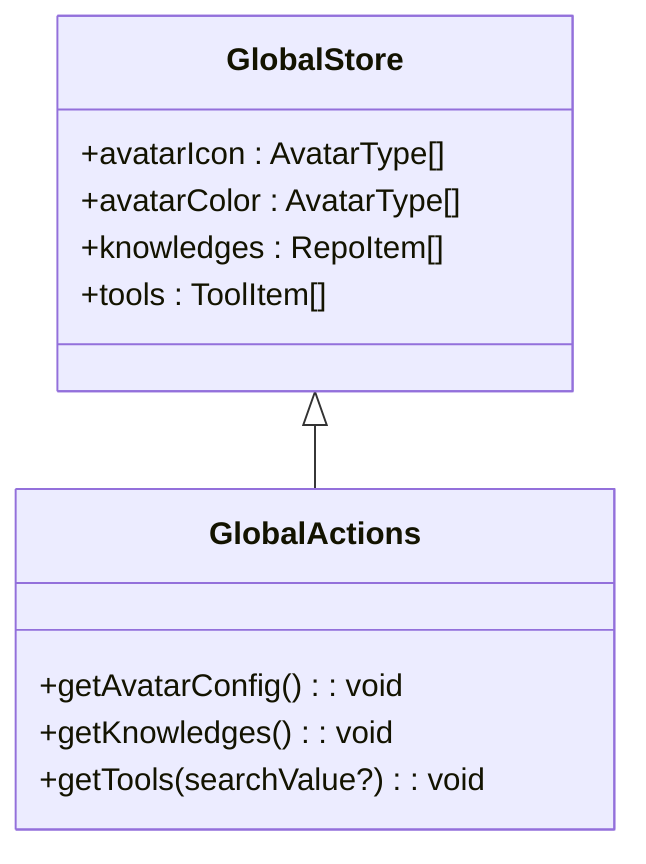

**Diagram sources**
- [global-store.ts](file://console/frontend/src/store/global-store.ts)

### 工作流状态存储

工作流状态存储（flow-store）管理React Flow相关的状态，包括节点、边、缩放级别和流程实例等。该store专门用于处理可视化工作流编辑器的状态管理。

```mermaid
classDiagram
class FlowState {
+template? : string
+input_keys? : object
+memory_keys? : Array<string>
+handle_keys? : Array<string>
}
class FlowStoreType {
+loadHistory(nodes, edges) : void
+sseData : object
+isBuilding : boolean
+isPending : boolean
+zoom : number
+setZoom(zoom) : void
+reactFlowInstance : ReactFlowInstance | null
+setReactFlowInstance(newState) : void
+flowState : FlowState | undefined
+nodes : Node[]
+edges : Edge[]
+onNodesChange : OnNodesChange
+onEdgesChange : OnEdgesChange
+deleteNodeRef(nodeId, outputId) : void
+setNodes(update) : void
+setEdges(update, noNeedTakeSnapshot?) : void
+setNode(id, update) : void
+delayCheckNode(id) : void
+checkNode(id) : boolean
+deleteNode(nodeId) : void
+paste(selection) : void
+lastCopiedSelection : {nodes, edges} | null
+isBuilt : boolean
+onConnect(connection) : void
+removeNodeRef(souceId, targetId, inputEdges?) : void
+updateNodeRef(id) : void
+delayUpdateNodeRef(id) : void
+switchNodeRef(connection, oldEdge) : void
+moveToPosition(viewport) : void
}
FlowStoreType --> FlowState
```

**Diagram sources**
- [flow/index.ts](file://console/frontend/src/components/workflow/types/zustand/flow/index.ts)

## 状态持久化策略

项目采用了Zustand的persist中间件来实现状态的持久化存储，确保用户刷新页面后仍能保持关键状态。不同的store根据其状态的重要性选择了不同的存储策略。

### Spark公共状态持久化

spark-common-store使用localStorage来持久化用户的个性化设置，如发音人配置和背景音乐等。通过partialize配置，只选择性地持久化需要长期保存的状态。

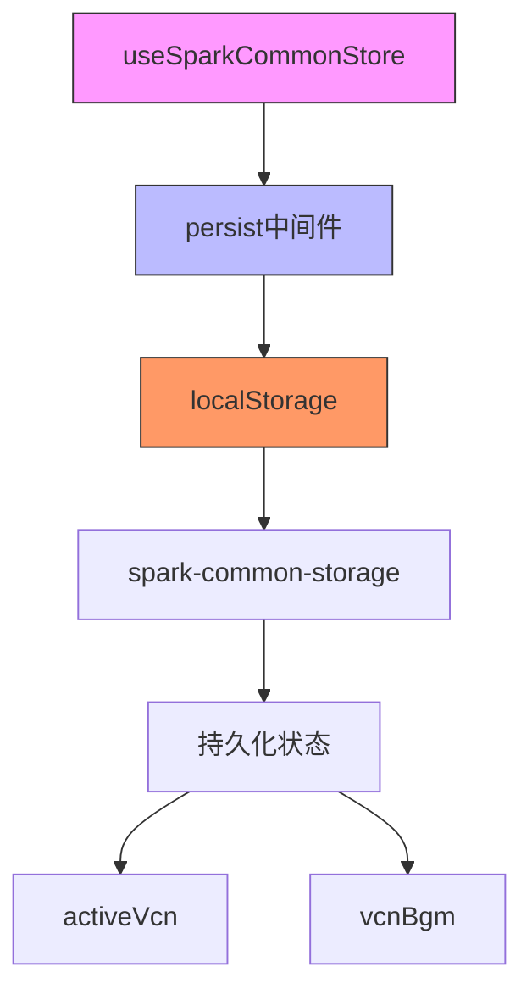

**Diagram sources**
- [spark-common.ts](file://console/frontend/src/store/spark-store/spark-common.ts)

### 订单状态持久化

order-store使用sessionStorage来持久化用户的订单信息和空间类型。sessionStorage的特点是数据在浏览器会话期间保持，关闭浏览器后清除，适合存储临时但重要的用户状态。

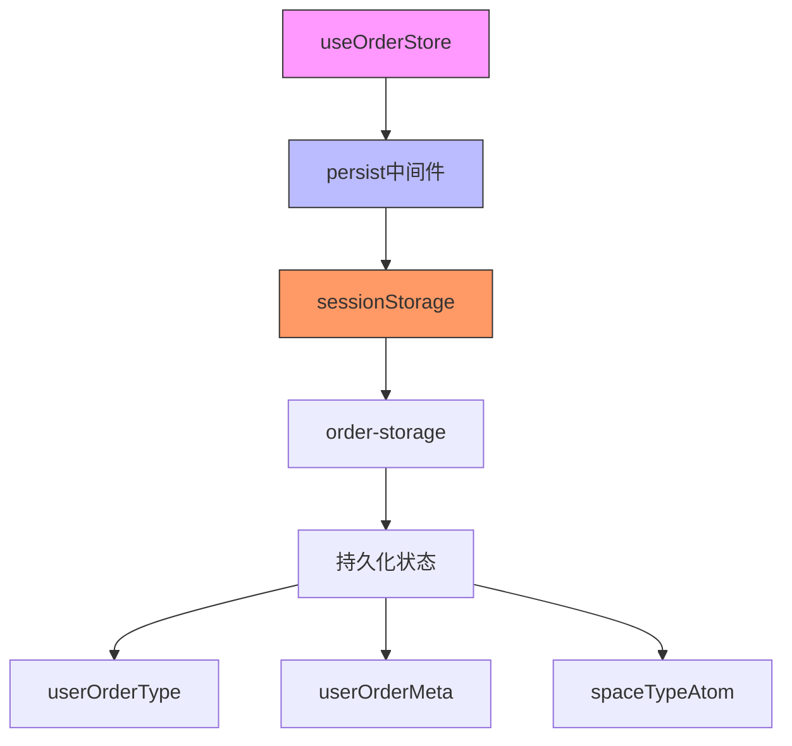

**Diagram sources**
- [order-store.ts](file://console/frontend/src/store/spark-store/order-store.ts)

### 空间状态持久化

space-store同样使用sessionStorage来持久化用户的空间信息，包括空间ID、名称、类型和头像等。这些信息在用户会话期间需要保持一致。

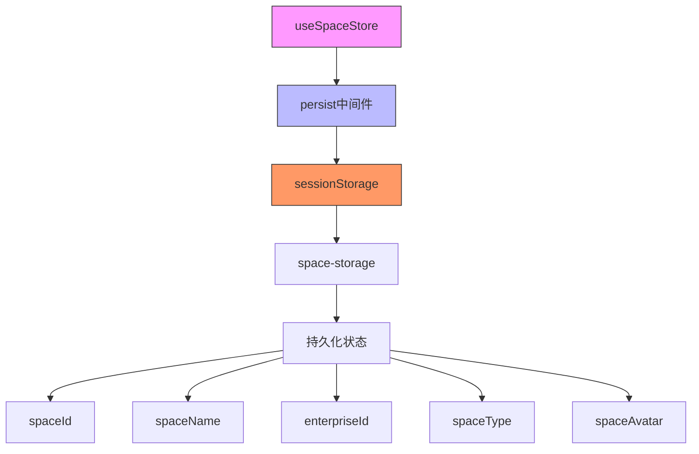

**Diagram sources**
- [space-store.ts](file://console/frontend/src/store/space-store.ts)

## 自定义Hooks与Store交互

### 聊天Hook实现

use-chat自定义Hook封装了与聊天状态store的交互逻辑，提供了发送消息、重新回答等高级操作。该Hook通过useChatStore的selector模式订阅store中的特定状态，实现了高效的重新渲染控制。

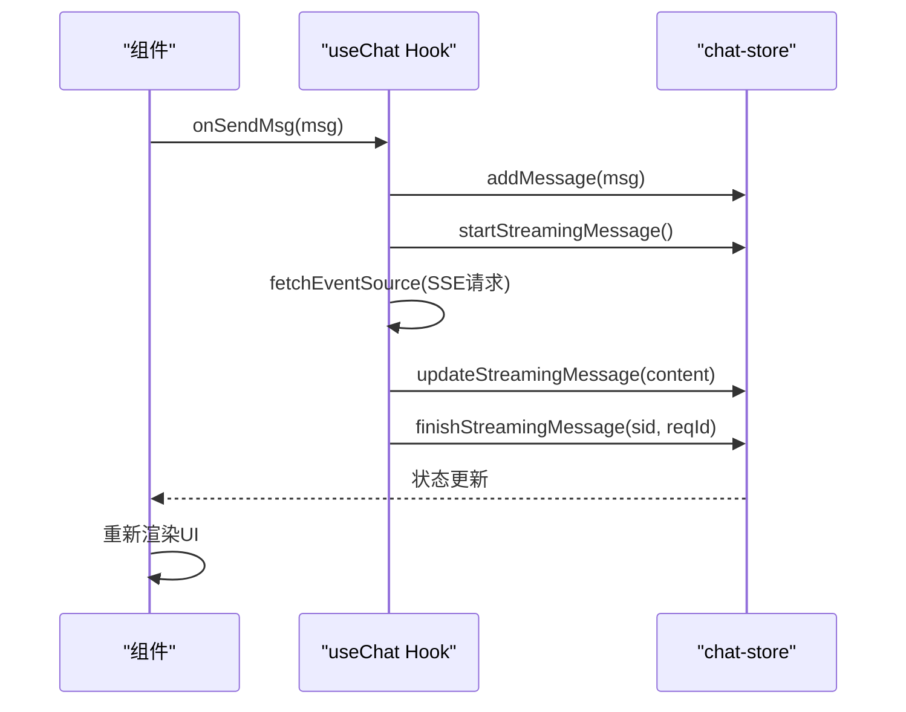

**Diagram sources**
- [use-chat.ts](file://console/frontend/src/hooks/use-chat.ts)
- [chat-store.ts](file://console/frontend/src/store/chat-store.ts)

### 状态订阅模式

自定义Hook通过Zustand的selector模式订阅store中的状态，只在相关状态变化时触发重新渲染，避免了不必要的性能开销。

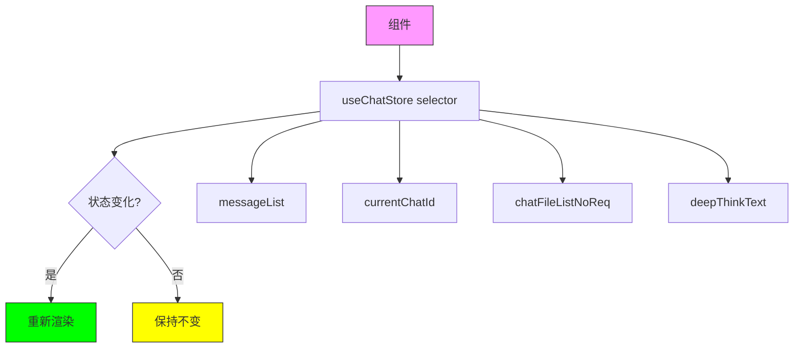

**Diagram sources**
- [use-chat.ts](file://console/frontend/src/hooks/use-chat.ts)

## 状态更新模式与异步操作

### 流式响应处理

聊天状态store实现了完整的流式响应处理机制，通过SSE（Server-Sent Events）接收服务器的流式数据，并逐步更新UI。

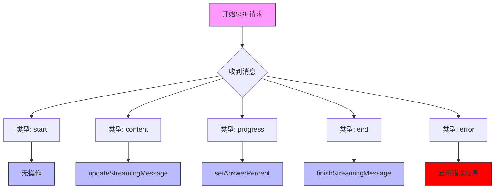

**Diagram sources**
- [use-chat.ts](file://console/frontend/src/hooks/use-chat.ts)

### 状态更新链

状态更新遵循严格的顺序，确保UI的一致性和正确性。从开始流式响应到完成，每个阶段都有明确的状态转换。

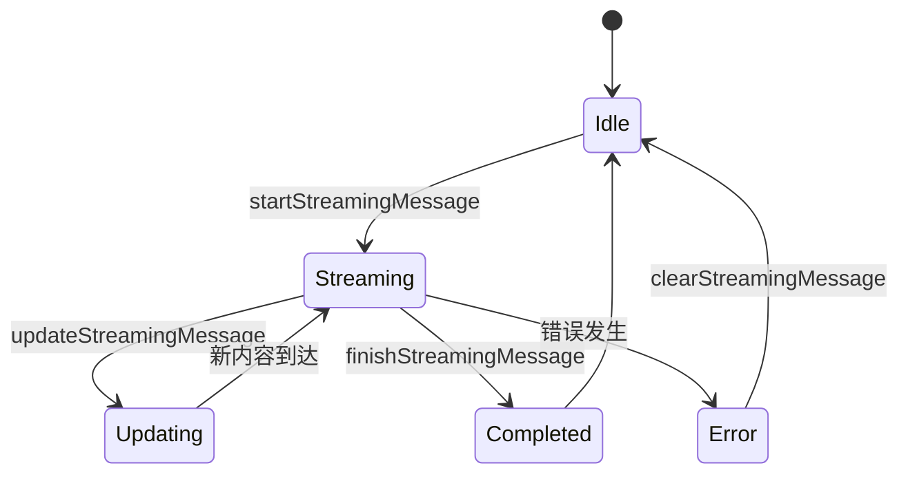

**Diagram sources**
- [chat-store.ts](file://console/frontend/src/store/chat-store.ts)

## 错误处理机制

### SSE错误处理

系统实现了完善的SSE错误处理机制，能够捕获连接错误、请求失败等异常情况，并进行适当的用户提示。

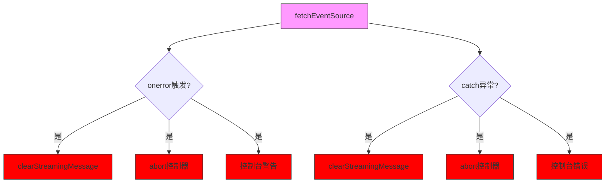

**Diagram sources**
- [use-chat.ts](file://console/frontend/src/hooks/use-chat.ts)

### 统一错误处理

对于服务器返回的特定错误码，系统采用统一的错误处理策略，显示预定义的友好错误信息。

```mermaid
flowchart TD
A[收到SSE消息] --> B{包含错误码?}
B --> |是| C{错误码在ERROR_CODE中?}
C --> |是| D[updateStreamingMessage(ERROR_TEXT)]
C --> |否| E[正常处理]
D --> F[finishStreamingMessage]
style A fill:#f9f,stroke:#333
style D fill:#f00,stroke:#333
style F fill:#f00,stroke:#333
```

**Diagram sources**
- [use-chat.ts](file://console/frontend/src/hooks/use-chat.ts)

## 状态流图

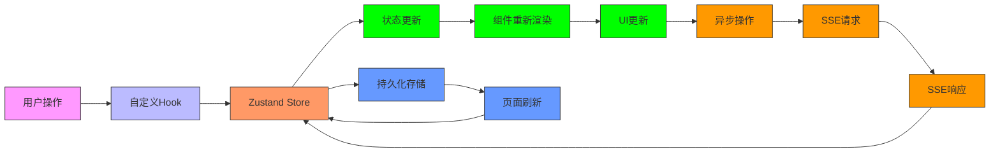

**Diagram sources**
- [chat-store.ts](file://console/frontend/src/store/chat-store.ts)
- [use-chat.ts](file://console/frontend/src/hooks/use-chat.ts)
- [spark-common.ts](file://console/frontend/src/store/spark-store/spark-common.ts)