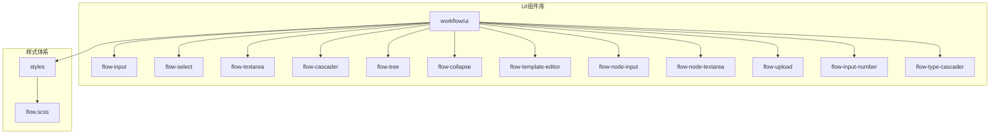
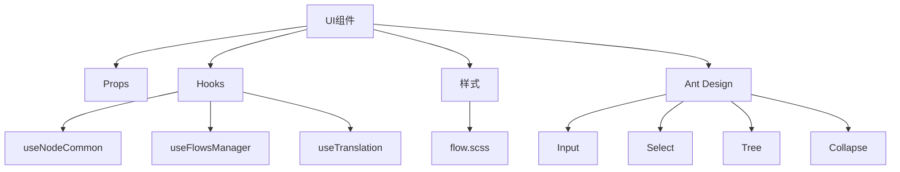
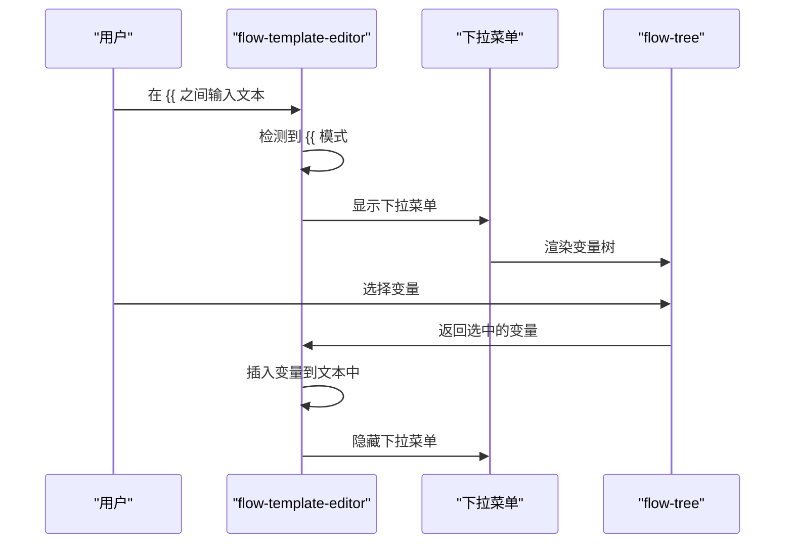
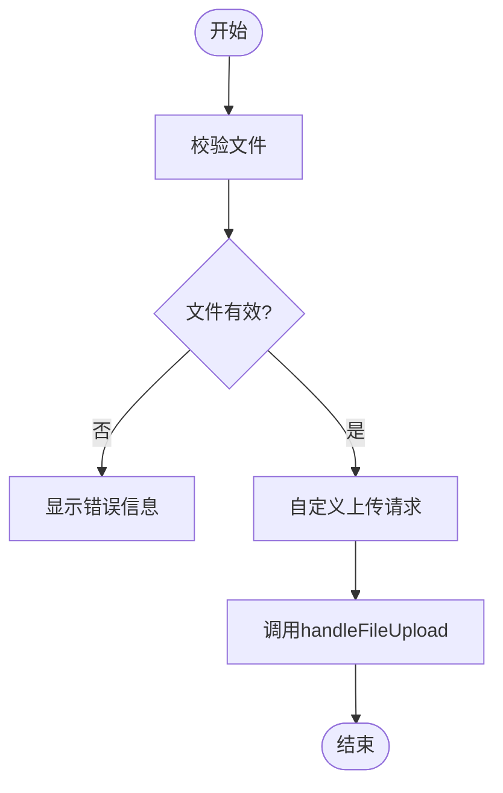
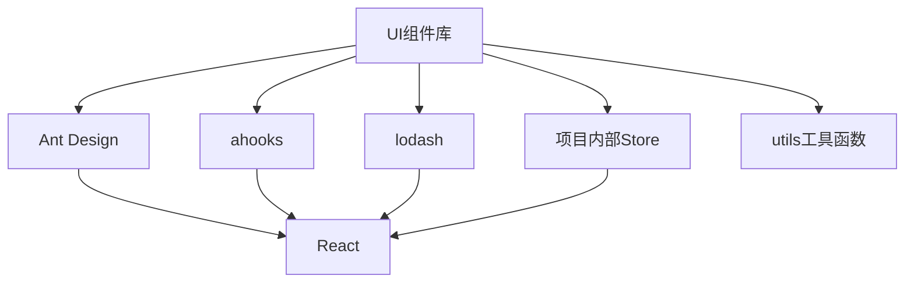

# UI工具组件

<cite>
**本文档引用的文件**
- [flow-input.tsx](file://console/frontend/src/components/workflow/ui/flow-input.tsx)
- [flow-select.tsx](file://console/frontend/src/components/workflow/ui/flow-select.tsx)
- [flow-textarea.tsx](file://console/frontend/src/components/workflow/ui/flow-textarea.tsx)
- [flow-cascader.tsx](file://console/frontend/src/components/workflow/ui/flow-cascader.tsx)
- [flow-tree.tsx](file://console/frontend/src/components/workflow/ui/flow-tree.tsx)
- [flow-collapse.tsx](file://console/frontend/src/components/workflow/ui/flow-collapse.tsx)
- [flow-template-editor.tsx](file://console/frontend/src/components/workflow/ui/flow-template-editor.tsx)
- [flow-node-input.tsx](file://console/frontend/src/components/workflow/ui/flow-node-input.tsx)
- [flow-node-textarea.tsx](file://console/frontend/src/components/workflow/ui/flow-node-textarea.tsx)
- [flow-upload.tsx](file://console/frontend/src/components/workflow/ui/flow-upload.tsx)
- [flow-input-number.tsx](file://console/frontend/src/components/workflow/ui/flow-input-number.tsx)
- [flow-type-cascader.tsx](file://console/frontend/src/components/workflow/ui/flow-type-cascader.tsx)
- [flow.scss](file://console/frontend/src/styles/flow.scss)
- [index.tsx](file://console/frontend/src/components/workflow/ui/index.tsx)
</cite>

## 目录
1. [简介](#简介)
2. [项目结构](#项目结构)
3. [核心组件](#核心组件)
4. [架构概述](#架构概述)
5. [详细组件分析](#详细组件分析)
6. [依赖分析](#依赖分析)
7. [性能考虑](#性能考虑)
8. [故障排除指南](#故障排除指南)
9. [结论](#结论)
10. [附录](#附录)（如有必要）

## 简介
本文档详细描述了astron-agent项目中工作流专用UI组件库的实现。该组件库专为工作流场景设计，提供了丰富的表单控件、布局组件和富文本编辑器，以满足动态参数配置、类型安全输入和复杂数据结构编辑的特殊需求。文档将深入探讨这些组件的实现细节、样式体系设计以及最佳实践。

## 项目结构
工作流UI组件库位于`console/frontend/src/components/workflow/ui/`目录下，采用模块化设计，将各种UI组件封装为独立的可复用单元。该目录下的组件专门针对工作流场景进行了定制化开发，与Ant Design等基础UI库形成互补。



**图示来源**
- [flow-input.tsx](file://console/frontend/src/components/workflow/ui/flow-input.tsx)
- [flow.scss](file://console/frontend/src/styles/flow.scss)

**章节来源**
- [flow-input.tsx](file://console/frontend/src/components/workflow/ui/flow-input.tsx)
- [flow.scss](file://console/frontend/src/styles/flow.scss)

## 核心组件
工作流UI组件库的核心组件包括表单控件（输入框、选择器、级联选择等）、布局组件（折叠面板、树形结构）和富文本编辑器。这些组件通过封装Ant Design基础组件并添加工作流场景特有的交互逻辑和样式，实现了对复杂工作流需求的支持。

**章节来源**
- [flow-input.tsx](file://console/frontend/src/components/workflow/ui/flow-input.tsx)
- [flow-select.tsx](file://console/frontend/src/components/workflow/ui/flow-select.tsx)
- [flow-textarea.tsx](file://console/frontend/src/components/workflow/ui/flow-textarea.tsx)

## 架构概述
工作流UI组件库的架构设计遵循模块化和可复用原则。每个组件都是一个独立的React函数组件，通过props接收配置和数据，通过hooks管理内部状态和逻辑。组件库与状态管理store（如use-flows-manager）紧密集成，实现了组件状态与应用全局状态的同步。



**图示来源**
- [flow-input.tsx](file://console/frontend/src/components/workflow/ui/flow-input.tsx)
- [flow-select.tsx](file://console/frontend/src/components/workflow/ui/flow-select.tsx)
- [flow-tree.tsx](file://console/frontend/src/components/workflow/ui/flow-tree.tsx)

## 详细组件分析
本节将对工作流UI组件库中的关键组件进行深入分析，包括其实现细节、交互逻辑和使用场景。

### 表单控件分析
工作流UI组件库提供了多种定制化的表单控件，以满足工作流场景下的特殊需求。

#### 输入框组件 (flow-input)
`flow-input`组件是对Ant Design `Input`组件的封装，主要添加了阻止键盘事件冒泡的功能，防止在工作流画布上输入时触发画布的快捷键操作。

```mermaid
classDiagram
class FlowInput {
+inputRef : RefObject
+useEffect() : void
+handleKeyDown(event) : void
+render() : JSX.Element
}
FlowInput --> "1" "阻止事件冒泡"
```

**图示来源**
- [flow-input.tsx](file://console/frontend/src/components/workflow/ui/flow-input.tsx)

#### 选择器组件 (flow-select)
`flow-select`组件是对Ant Design `Select`组件的封装，自定义了下拉箭头图标，并添加了阻止鼠标滚轮事件冒泡的功能，防止在下拉菜单滚动时影响工作流画布的缩放。

```mermaid
classDiagram
class FLowSelect {
+suffixIcon : JSX.Element
+dropdownRender(menu) : JSX.Element
+handleWheel(e) : void
+render() : JSX.Element
}
FLowSelect --> "1" "自定义图标"
FLowSelect --> "1" "阻止事件冒泡"
```

**图示来源**
- [flow-select.tsx](file://console/frontend/src/components/workflow/ui/flow-select.tsx)

#### 文本域组件 (flow-textarea)
`flow-textarea`组件是对原生`textarea`元素的封装，支持自适应高度和阻止鼠标滚轮事件冒泡。当`adaptiveHeight`属性为`true`时，文本域会根据内容自动调整高度。

```mermaid
classDiagram
class FlowTextArea {
+textareaId : string
+useEffect() : void
+handleWheel(e) : void
+handleKeyDown(e) : void
+render() : JSX.Element
}
FlowTextArea --> "1" "自适应高度"
FlowTextArea --> "1" "阻止事件冒泡"
```

**图示来源**
- [flow-textarea.tsx](file://console/frontend/src/components/workflow/ui/flow-textarea.tsx)

#### 级联选择器组件 (flow-cascader)
`flow-cascader`组件是对Ant Design `Cascader`组件的封装，用于选择复杂的数据结构。它通过`optionRender`属性自定义了下拉菜单的渲染逻辑，将数据结构的类型信息以标签形式显示。

```mermaid
classDiagram
class FlowCascader {
+titleRender(nodeData) : JSX.Element
+optionRender(option) : JSX.Element
+handleOnSelect(_, node) : void
+render() : JSX.Element
}
FlowCascader --> "1" "自定义渲染"
FlowCascader --> "1" "类型标签"
```

**图示来源**
- [flow-cascader.tsx](file://console/frontend/src/components/workflow/ui/flow-cascader.tsx)

**章节来源**
- [flow-cascader.tsx](file://console/frontend/src/components/workflow/ui/flow-cascader.tsx)

### 布局组件分析
工作流UI组件库提供了折叠面板和树形结构等布局组件，用于组织和展示复杂的数据结构。

#### 折叠面板组件 (flow-collapse)
`flow-collapse`组件是对Ant Design `Collapse`组件的封装，用于折叠和展开内容区域。它自定义了展开/收起图标的旋转动画，并设置了默认展开状态。

```mermaid
classDiagram
class FLowCollapse {
+expandIcon(isActive) : JSX.Element
+render() : JSX.Element
}
FLowCollapse --> "1" "自定义图标"
FLowCollapse --> "1" "旋转动画"
```

**图示来源**
- [flow-collapse.tsx](file://console/frontend/src/components/workflow/ui/flow-collapse.tsx)

#### 树形结构组件 (flow-tree)
`flow-tree`组件是对Ant Design `Tree`组件的封装，用于展示层次化的数据结构。它自定义了节点开关图标的样式和旋转动画，并默认展开所有节点。

```mermaid
classDiagram
class FLowTree {
+switcherIcon(expanded) : JSX.Element
+render() : JSX.Element
}
FLowTree --> "1" "自定义图标"
FLowTree --> "1" "旋转动画"
```

**图示来源**
- [flow-tree.tsx](file://console/frontend/src/components/workflow/ui/flow-tree.tsx)

**章节来源**
- [flow-tree.tsx](file://console/frontend/src/components/workflow/ui/flow-tree.tsx)

### 富文本编辑器分析
`flow-template-editor`是工作流UI组件库中最复杂的组件之一，它是一个支持变量插入的富文本编辑器，允许用户在模板中引用工作流中的变量。

#### 模板编辑器组件 (flow-template-editor)
`flow-template-editor`组件实现了类似代码编辑器的体验，支持在文本中插入`{{variable}}`格式的变量。当用户在`{{`和`}}`之间输入时，会弹出一个下拉菜单，显示可选的变量列表。



**图示来源**
- [flow-template-editor.tsx](file://console/frontend/src/components/workflow/ui/flow-template-editor.tsx)

#### 节点输入组件 (flow-node-input)
`flow-node-input`组件是`flow-input`的增强版，与工作流状态管理store集成。它通过`useFlowsManager` hook监听全局状态变化，并在输入值变化时触发防抖更新，以减少频繁的状态更新。

```mermaid
classDiagram
class FlowNodeInput {
+getCurrentStore : Function
+updateNodeInputData : Function
+delayCheckNode : Function
+handleChangeDebounce(value) : void
+handleValueChange(value) : void
+render() : JSX.Element
}
FlowNodeInput --> "1" "状态管理"
FlowNodeInput --> "1" "防抖更新"
```

**图示来源**
- [flow-node-input.tsx](file://console/frontend/src/components/workflow/ui/flow-node-input.tsx)

#### 节点文本域组件 (flow-node-textarea)
`flow-node-textarea`组件是`flow-textarea`的增强版，同样与工作流状态管理store集成。它通过防抖函数在用户停止输入500ms后才触发状态更新，优化了性能。

```mermaid
classDiagram
class FlowNodeTextArea {
+handleChangeDebounce(value) : void
+handleValueChange(value) : void
+render() : JSX.Element
}
FlowNodeTextArea --> "1" "防抖更新"
```

**图示来源**
- [flow-node-textarea.tsx](file://console/frontend/src/components/workflow/ui/flow-node-textarea.tsx)

**章节来源**
- [flow-node-input.tsx](file://console/frontend/src/components/workflow/ui/flow-node-input.tsx)
- [flow-node-textarea.tsx](file://console/frontend/src/components/workflow/ui/flow-node-textarea.tsx)

### 其他组件分析
除了上述核心组件外，工作流UI组件库还提供了文件上传、数字输入等其他实用组件。

#### 文件上传组件 (flow-upload)
`flow-upload`组件是对Ant Design `Upload`组件的封装，支持拖拽上传和文件类型、大小校验。上传的文件会通过`handleFileUpload`回调函数传递给父组件进行处理。



**图示来源**
- [flow-upload.tsx](file://console/frontend/src/components/workflow/ui/flow-upload.tsx)

#### 数字输入组件 (flow-input-number)
`flow-input-number`组件是对Ant Design `InputNumber`组件的封装，隐藏了增减按钮，并阻止了键盘事件冒泡。

```mermaid
classDiagram
class FlowInputNumber {
+render() : JSX.Element
}
FlowInputNumber --> "1" "隐藏控件"
FlowInputNumber --> "1" "阻止事件冒泡"
```

**图示来源**
- [flow-input-number.tsx](file://console/frontend/src/components/workflow/ui/flow-input-number.tsx)

**章节来源**
- [flow-upload.tsx](file://console/frontend/src/components/workflow/ui/flow-upload.tsx)
- [flow-input-number.tsx](file://console/frontend/src/components/workflow/ui/flow-input-number.tsx)

## 依赖分析
工作流UI组件库依赖于多个外部库和内部模块。主要依赖包括Ant Design作为基础UI库，ahooks提供实用的React hooks，lodash提供工具函数，以及项目内部的状态管理store。



**图示来源**
- [flow-input.tsx](file://console/frontend/src/components/workflow/ui/flow-input.tsx)
- [flow-select.tsx](file://console/frontend/src/components/workflow/ui/flow-select.tsx)
- [flow-node-input.tsx](file://console/frontend/src/components/workflow/ui/flow-node-input.tsx)

**章节来源**
- [flow-input.tsx](file://console/frontend/src/components/workflow/ui/flow-input.tsx)
- [flow-node-input.tsx](file://console/frontend/src/components/workflow/ui/flow-node-input.tsx)

## 性能考虑
工作流UI组件库在设计时充分考虑了性能优化。主要的性能优化措施包括：

1. **组件记忆化**：所有组件都使用`React.memo`进行记忆化，避免不必要的重新渲染。
2. **防抖更新**：对于频繁触发的状态更新（如输入框内容变化），使用防抖函数（debounce）延迟更新，减少状态更新频率。
3. **事件委托**：通过阻止事件冒泡，防止组件内部的交互事件影响到工作流画布的全局事件处理。
4. **虚拟化**：对于大型数据结构的展示，可以考虑使用虚拟滚动等技术，但当前组件库中尚未实现。

这些优化措施确保了在复杂工作流场景下，UI组件库能够保持流畅的用户体验。

## 故障排除指南
在使用工作流UI组件库时，可能会遇到一些常见问题。以下是一些故障排除建议：

1. **组件不更新**：检查是否正确使用了`useFlowsManager`等状态管理hook，并确保状态更新逻辑正确。
2. **样式不生效**：确认`flow.scss`文件已正确引入，并检查CSS类名是否拼写正确。
3. **事件冒泡问题**：如果发现组件内部的交互影响了工作流画布，检查是否在关键事件处理函数中调用了`event.stopPropagation()`。
4. **下拉菜单不显示**：检查`flow-cascader`或`flow-template-editor`的`treeData`是否正确传递，并确保数据结构符合组件要求。

**章节来源**
- [flow-input.tsx](file://console/frontend/src/components/workflow/ui/flow-input.tsx)
- [flow-select.tsx](file://console/frontend/src/components/workflow/ui/flow-select.tsx)
- [flow-template-editor.tsx](file://console/frontend/src/components/workflow/ui/flow-template-editor.tsx)

## 结论
astron-agent项目的工作流UI组件库是一个高度定制化的前端组件集合，专为满足复杂工作流场景的需求而设计。通过封装和扩展Ant Design等基础UI库，该组件库提供了丰富的表单控件、布局组件和富文本编辑器，支持动态参数配置、类型安全输入和复杂数据结构编辑。组件库采用模块化设计，具有良好的可维护性和可扩展性，为构建高效、直观的工作流编辑器提供了坚实的基础。

## 附录
### 使用示例
以下是一个使用`flow-input`和`flow-select`组件的简单示例：

```jsx
import { FlowInput, FLowSelect } from '@/components/workflow/ui';

function MyWorkflowNode() {
  const [inputValue, setInputValue] = useState('');
  const [selectValue, setSelectValue] = useState('');

  return (
    <div>
      <FlowInput 
        value={inputValue} 
        onChange={setInputValue} 
        placeholder="请输入文本" 
      />
      <FLowSelect 
        value={selectValue} 
        onChange={setSelectValue}
      >
        <FLowSelect.Option value="option1">选项1</FLowSelect.Option>
        <FLowSelect.Option value="option2">选项2</FLowSelect.Option>
      </FLowSelect>
    </div>
  );
}
```

### 最佳实践
1. **状态管理**：对于需要与工作流全局状态同步的组件，优先使用`flow-node-input`和`flow-node-textarea`等集成了状态管理的组件。
2. **性能优化**：在处理大量数据时，考虑使用防抖和节流技术，避免频繁的状态更新。
3. **样式覆盖**：如需自定义组件样式，建议通过`className`属性传入自定义CSS类，而不是直接修改组件内部的样式。
4. **可访问性**：确保所有交互元素都有适当的ARIA标签和键盘支持，以提高应用的可访问性。