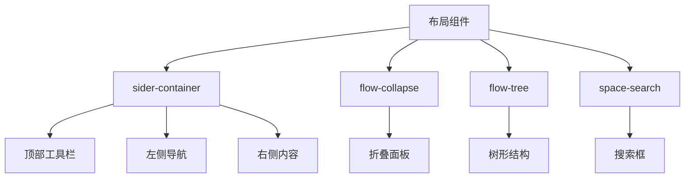
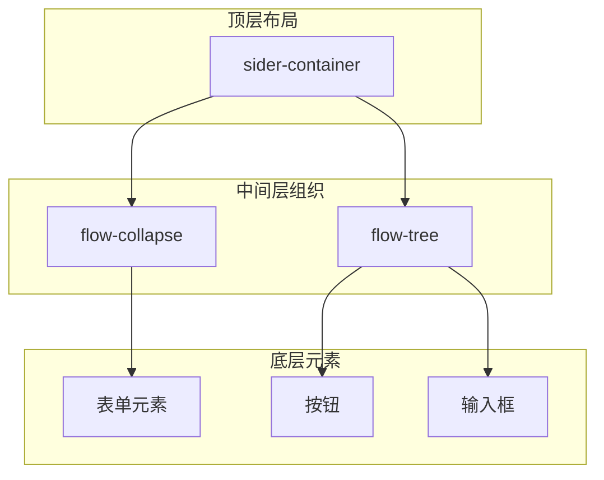
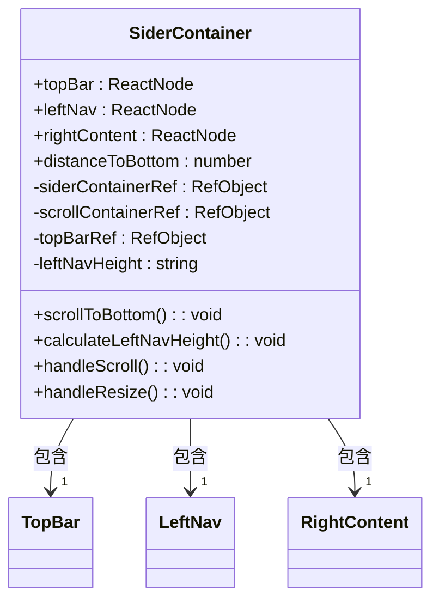
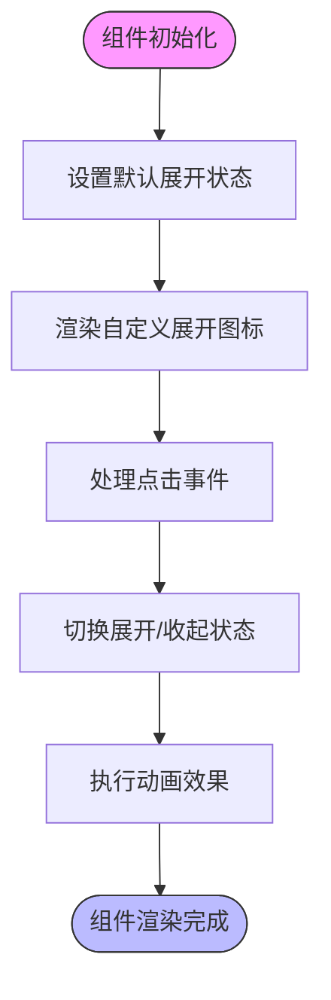
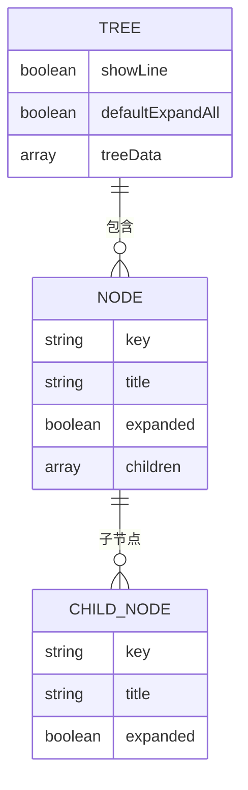
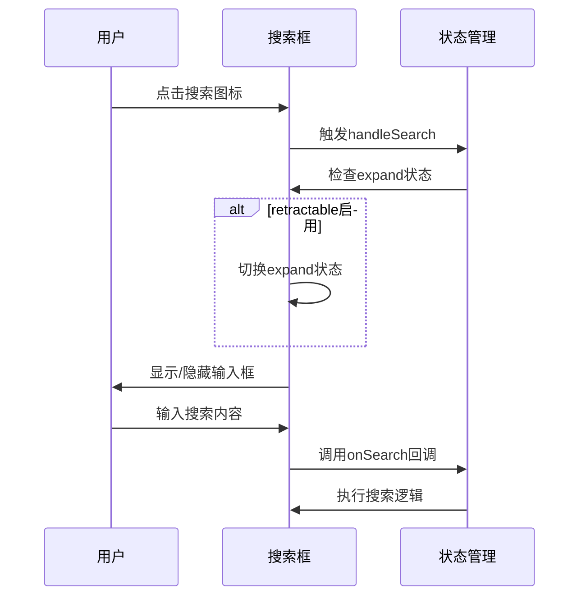
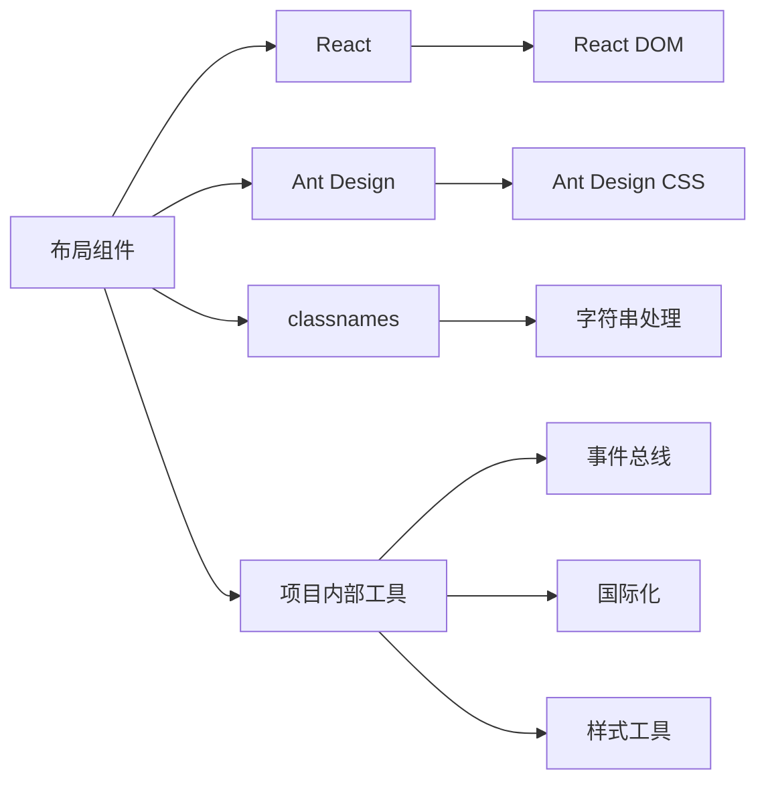

# 布局组件

<cite>
**本文档引用的文件**  
- [sider-container/index.tsx](file://console/frontend/src/components/sider-container/index.tsx)
- [sider-container/index.module.scss](file://console/frontend/src/components/sider-container/index.module.scss)
- [workflow/ui/flow-collapse.tsx](file://console/frontend/src/components/workflow/ui/flow-collapse.tsx)
- [workflow/ui/flow-tree.tsx](file://console/frontend/src/components/workflow/ui/flow-tree.tsx)
- [space/space-search/index.tsx](file://console/frontend/src/components/space/space-search/index.tsx)
- [space/space-search/index.module.scss](file://console/frontend/src/components/space/space-search/index.module.scss)
</cite>

## 目录
1. [简介](#简介)
2. [项目结构](#项目结构)
3. [核心组件](#核心组件)
4. [架构概述](#架构概述)
5. [详细组件分析](#详细组件分析)
6. [依赖分析](#依赖分析)
7. [性能考虑](#性能考虑)
8. [故障排除指南](#故障排除指南)
9. [结论](#结论)

## 简介
本文档详细描述了工作流界面中的布局容器实现，重点介绍折叠面板和树形结构组件的设计原理与使用场景。这些组件用于组织复杂的工作流配置界面，支持层级展开/收起和视觉分组。文档将解释组件的受控模式、动画效果实现和无障碍访问支持，并提供在工作流编辑器中的集成示例。

## 项目结构
项目中的布局组件主要位于`console/frontend/src/components`目录下，采用模块化设计，将不同的UI功能分离到独立的组件中。核心布局容器包括侧边栏容器、折叠面板和树形结构等，这些组件通过React和Ant Design实现，支持响应式布局和无障碍访问。

**Diagram sources**
- [sider-container/index.tsx](file://console/frontend/src/components/sider-container/index.tsx)
- [workflow/ui/flow-collapse.tsx](file://console/frontend/src/components/workflow/ui/flow-collapse.tsx)
- [workflow/ui/flow-tree.tsx](file://console/frontend/src/components/workflow/ui/flow-tree.tsx)

**Section sources**
- [sider-container/index.tsx](file://console/frontend/src/components/sider-container/index.tsx)
- [workflow/ui/flow-collapse.tsx](file://console/frontend/src/components/workflow/ui/flow-collapse.tsx)

## 核心组件
核心布局组件包括侧边栏容器(sider-container)、折叠面板(flow-collapse)和树形结构(flow-tree)。这些组件共同构成了工作流界面的基础布局框架，支持复杂的配置界面组织和用户交互。

**Section sources**
- [sider-container/index.tsx](file://console/frontend/src/components/sider-container/index.tsx)
- [workflow/ui/flow-collapse.tsx](file://console/frontend/src/components/workflow/ui/flow-collapse.tsx)
- [workflow/ui/flow-tree.tsx](file://console/frontend/src/components/workflow/ui/flow-tree.tsx)

## 架构概述
布局组件采用分层架构设计，顶层是侧边栏容器，负责整体布局的组织；中间层是折叠面板和树形结构，负责内容的分组和层级展示；底层是各种UI元素，负责具体的内容呈现。

**Diagram sources**
- [sider-container/index.tsx](file://console/frontend/src/components/sider-container/index.tsx)
- [workflow/ui/flow-collapse.tsx](file://console/frontend/src/components/workflow/ui/flow-collapse.tsx)
- [workflow/ui/flow-tree.tsx](file://console/frontend/src/components/workflow/ui/flow-tree.tsx)

## 详细组件分析

### 侧边栏容器分析
侧边栏容器组件(sider-container)实现了复杂的布局管理功能，支持顶部工具栏、左侧导航和右侧内容区域的灵活配置。

#### 组件实现

**Diagram sources**
- [sider-container/index.tsx](file://console/frontend/src/components/sider-container/index.tsx)

**Section sources**
- [sider-container/index.tsx](file://console/frontend/src/components/sider-container/index.tsx)

### 折叠面板分析
折叠面板组件(flow-collapse)基于Ant Design的Collapse组件封装，提供了统一的样式和交互体验。

#### 设计原理

**Diagram sources**
- [workflow/ui/flow-collapse.tsx](file://console/frontend/src/components/workflow/ui/flow-collapse.tsx)

**Section sources**
- [workflow/ui/flow-collapse.tsx](file://console/frontend/src/components/workflow/ui/flow-collapse.tsx)

### 树形结构分析
树形结构组件(flow-tree)基于Ant Design的Tree组件封装，用于展示层级数据结构。

#### 功能特性

**Diagram sources**
- [workflow/ui/flow-tree.tsx](file://console/frontend/src/components/workflow/ui/flow-tree.tsx)

**Section sources**
- [workflow/ui/flow-tree.tsx](file://console/frontend/src/components/workflow/ui/flow-tree.tsx)

### 搜索框组件分析
搜索框组件(space-search)实现了可展开/收起的搜索功能，支持响应式布局。

#### 交互流程

**Diagram sources**
- [space/space-search/index.tsx](file://console/frontend/src/components/space/space-search/index.tsx)

**Section sources**
- [space/space-search/index.tsx](file://console/frontend/src/components/space/space-search/index.tsx)

## 依赖分析
布局组件依赖于多个外部库和内部模块，形成了复杂的依赖关系网络。

**Diagram sources**
- [sider-container/index.tsx](file://console/frontend/src/components/sider-container/index.tsx)
- [workflow/ui/flow-collapse.tsx](file://console/frontend/src/components/workflow/ui/flow-collapse.tsx)
- [workflow/ui/flow-tree.tsx](file://console/frontend/src/components/workflow/ui/flow-tree.tsx)

**Section sources**
- [sider-container/index.tsx](file://console/frontend/src/components/sider-container/index.tsx)
- [workflow/ui/flow-collapse.tsx](file://console/frontend/src/components/workflow/ui/flow-collapse.tsx)
- [workflow/ui/flow-tree.tsx](file://console/frontend/src/components/workflow/ui/flow-tree.tsx)

## 性能考虑
布局组件在设计时充分考虑了性能优化，采用了多种技术手段来提升用户体验。

1. **虚拟滚动**: 对于长列表场景，建议结合虚拟滚动技术
2. **懒加载**: 复杂组件采用懒加载策略
3. **memoization**: 使用React.memo进行组件记忆化
4. **事件委托**: 减少事件监听器数量
5. **防抖节流**: 对频繁触发的事件进行优化

**Section sources**
- [sider-container/index.tsx](file://console/frontend/src/components/sider-container/index.tsx)
- [workflow/ui/flow-collapse.tsx](file://console/frontend/src/components/workflow/ui/flow-collapse.tsx)

## 故障排除指南
当布局组件出现问题时，可以按照以下步骤进行排查：

1. **检查依赖**: 确认所有依赖库已正确安装
2. **验证props**: 检查传递给组件的props是否正确
3. **查看样式**: 确认CSS样式未被意外覆盖
4. **调试事件**: 检查事件处理函数是否正常工作
5. **检查响应式**: 验证在不同屏幕尺寸下的表现

**Section sources**
- [sider-container/index.tsx](file://console/frontend/src/components/sider-container/index.tsx)
- [workflow/ui/flow-collapse.tsx](file://console/frontend/src/components/workflow/ui/flow-collapse.tsx)
- [workflow/ui/flow-tree.tsx](file://console/frontend/src/components/workflow/ui/flow-tree.tsx)

## 结论
本文档详细介绍了工作流界面中的布局组件实现，包括侧边栏容器、折叠面板和树形结构等核心组件。这些组件通过合理的架构设计和性能优化，为复杂的工作流配置界面提供了强大的布局支持。通过受控模式、动画效果和无障碍访问支持，这些组件能够满足多样化的用户需求。