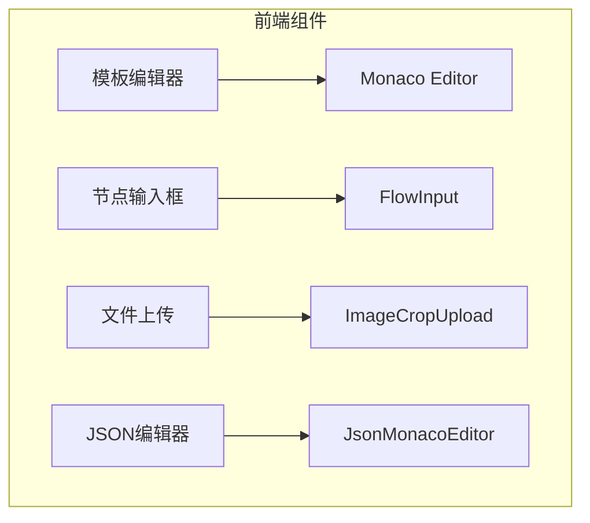
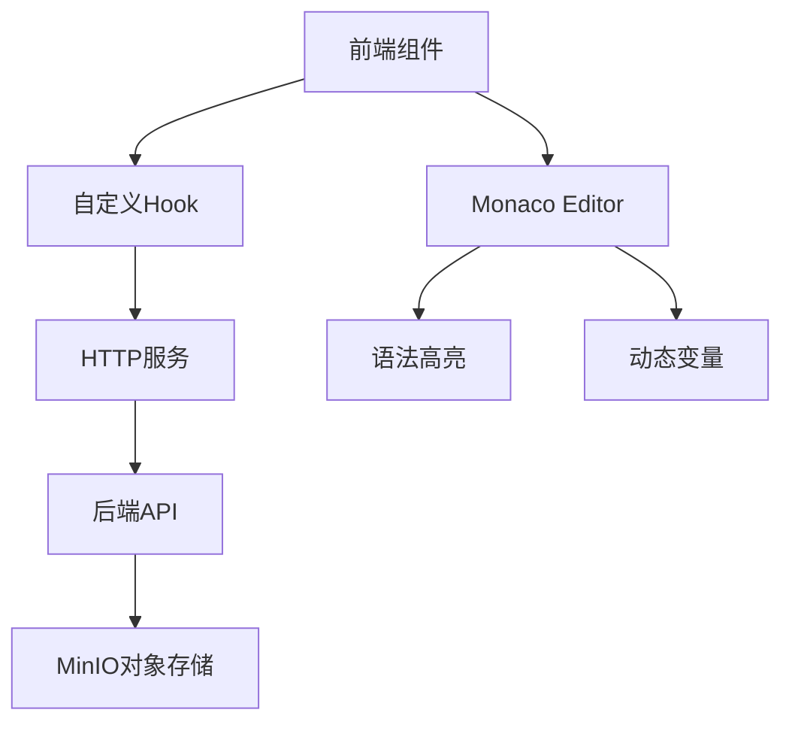
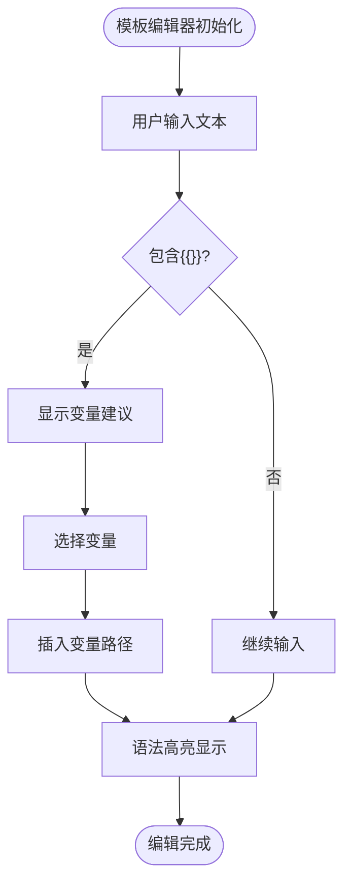
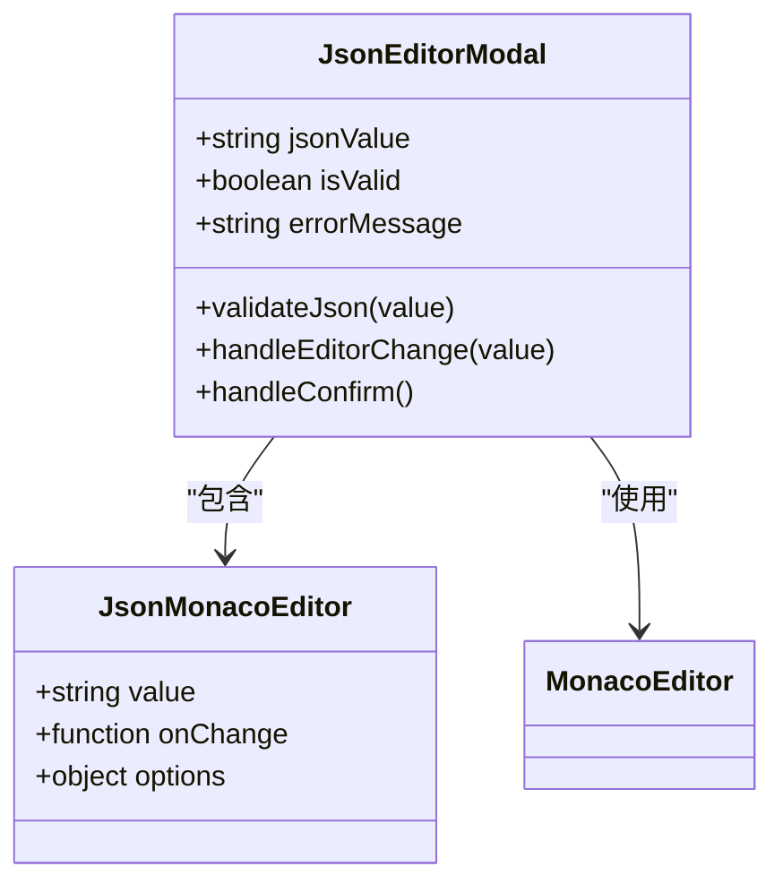
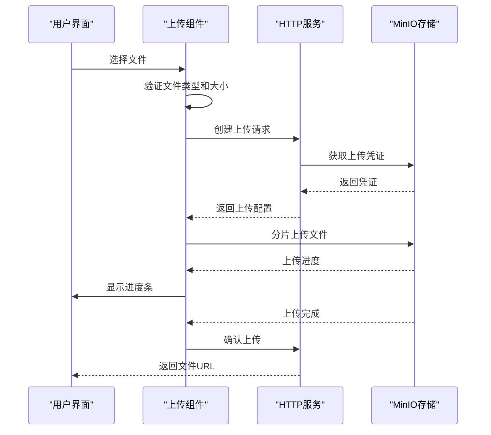
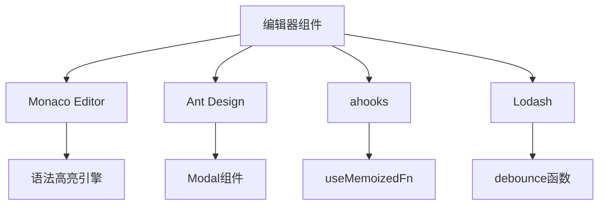

# 编辑器组件

<cite>
**本文档引用的文件**  
- [flow-template-editor.tsx](file://console/frontend/src/components/workflow/ui/flow-template-editor.tsx)
- [json-modal/index.tsx](file://console/frontend/src/components/modal/json-modal/index.tsx)
- [JsonMonacoEditor.tsx](file://console/frontend/src/components/monaco-editor/JsonMonacoEditor.tsx)
- [index.tsx](file://console/frontend/src/components/monaco-editor/index.tsx)
- [upload-avatar/index.tsx](file://console/frontend/src/components/space/space-modal/upload-avatar/index.tsx)
- [use-image-crop-upload.ts](file://console/frontend/src/hooks/use-image-crop-upload.ts)
- [use-chat-file-upload.ts](file://console/frontend/src/hooks/use-chat-file-upload.ts)
- [common.ts](file://console/frontend/src/services/common.ts)
- [README.md](file://docker/ragflow/README.md)
</cite>

## 目录
1. [简介](#简介)
2. [项目结构](#项目结构)
3. [核心组件](#核心组件)
4. [架构概述](#架构概述)
5. [详细组件分析](#详细组件分析)
6. [依赖分析](#依赖分析)
7. [性能考虑](#性能考虑)
8. [故障排除指南](#故障排除指南)
9. [结论](#结论)

## 简介
本文档详细描述了 Astron Agent 项目中用于复杂数据编辑的专用编辑器组件。重点涵盖模板编辑器、节点输入框、节点文本域和文件上传组件的实现细节，包括数据绑定方法、错误处理策略和最佳实践。

## 项目结构
项目前端编辑器组件主要位于 `console/frontend/src/components` 目录下，按功能模块组织。核心编辑器功能通过 Monaco Editor 实现，文件上传功能与 MinIO 对象存储集成。

**图示来源**
- [flow-template-editor.tsx](file://console/frontend/src/components/workflow/ui/flow-template-editor.tsx)
- [JsonMonacoEditor.tsx](file://console/frontend/src/components/monaco-editor/JsonMonacoEditor.tsx)
- [upload-avatar/index.tsx](file://console/frontend/src/components/space/space-modal/upload-avatar/index.tsx)

**本节来源**
- [flow-template-editor.tsx](file://console/frontend/src/components/workflow/ui/flow-template-editor.tsx)
- [json-modal/index.tsx](file://console/frontend/src/components/modal/json-modal/index.tsx)

## 核心组件
核心编辑器组件包括模板编辑器、JSON编辑器、节点输入框和文件上传组件。这些组件支持工作流中的复杂数据编辑需求，提供语法高亮、动态变量插入和对象存储集成等功能。

**本节来源**
- [flow-template-editor.tsx](file://console/frontend/src/components/workflow/ui/flow-template-editor.tsx)
- [json-modal/index.tsx](file://console/frontend/src/components/modal/json-modal/index.tsx)
- [upload-avatar/index.tsx](file://console/frontend/src/components/space/space-modal/upload-avatar/index.tsx)

## 架构概述
编辑器组件采用分层架构，前端组件通过服务层与后端API通信，后端通过MinIO客户端与对象存储交互。Monaco Editor提供代码编辑功能，自定义Hook处理文件上传逻辑。

**图示来源**
- [index.tsx](file://console/frontend/src/components/monaco-editor/index.tsx)
- [use-image-crop-upload.ts](file://console/frontend/src/hooks/use-image-crop-upload.ts)
- [common.ts](file://console/frontend/src/services/common.ts)

## 详细组件分析

### 模板编辑器分析
模板编辑器支持动态变量插入和语法高亮，允许用户在工作流中引用上下文数据。通过双花括号 `{{}}` 语法实现变量插入，支持智能提示和路径导航。

**图示来源**
- [flow-template-editor.tsx](file://console/frontend/src/components/workflow/ui/flow-template-editor.tsx)

**本节来源**
- [flow-template-editor.tsx](file://console/frontend/src/components/workflow/ui/flow-template-editor.tsx)

### JSON编辑器分析
JSON编辑器提供语法验证和格式化功能，确保用户输入的JSON数据有效。集成Monaco Editor实现语法高亮和自动格式化，提供实时验证反馈。

**图示来源**
- [json-modal/index.tsx](file://console/frontend/src/components/modal/json-modal/index.tsx)
- [JsonMonacoEditor.tsx](file://console/frontend/src/components/monaco-editor/JsonMonacoEditor.tsx)

**本节来源**
- [json-modal/index.tsx](file://console/frontend/src/components/modal/json-modal/index.tsx)

### 文件上传组件分析
文件上传组件与MinIO对象存储集成，支持头像和资源文件上传。通过分片上传和进度反馈提供良好的用户体验，包含错误处理和重试机制。

**图示来源**
- [upload-avatar/index.tsx](file://console/frontend/src/components/space/space-modal/upload-avatar/index.tsx)
- [use-image-crop-upload.ts](file://console/frontend/src/hooks/use-image-crop-upload.ts)
- [README.md](file://docker/ragflow/README.md)

**本节来源**
- [upload-avatar/index.tsx](file://console/frontend/src/components/space/space-modal/upload-avatar/index.tsx)
- [use-image-crop-upload.ts](file://console/frontend/src/hooks/use-image-crop-upload.ts)

## 依赖分析
编辑器组件依赖多个外部库和内部模块。Monaco Editor提供代码编辑功能，Ant Design提供UI组件，ahooks提供React Hook工具。

**图示来源**
- [json-modal/index.tsx](file://console/frontend/src/components/modal/json-modal/index.tsx)
- [flow-template-editor.tsx](file://console/frontend/src/components/workflow/ui/flow-template-editor.tsx)

**本节来源**
- [json-modal/index.tsx](file://console/frontend/src/components/modal/json-modal/index.tsx)
- [flow-template-editor.tsx](file://console/frontend/src/components/workflow/ui/flow-template-editor.tsx)

## 性能考虑
编辑器组件在性能方面进行了多项优化。使用防抖技术减少频繁的状态更新，虚拟滚动处理大型JSON数据，懒加载策略减少初始加载时间。

## 故障排除指南
常见问题包括文件上传失败、JSON格式错误和变量引用无效。检查网络连接、验证文件类型和大小限制，确保变量路径正确。

**本节来源**
- [json-modal/index.tsx](file://console/frontend/src/components/modal/json-modal/index.tsx)
- [upload-avatar/index.tsx](file://console/frontend/src/components/space/space-modal/upload-avatar/index.tsx)

## 结论
Astron Agent的编辑器组件提供了强大的数据编辑功能，支持复杂工作流场景。通过集成Monaco Editor和MinIO存储，实现了高效的代码编辑和文件管理能力。