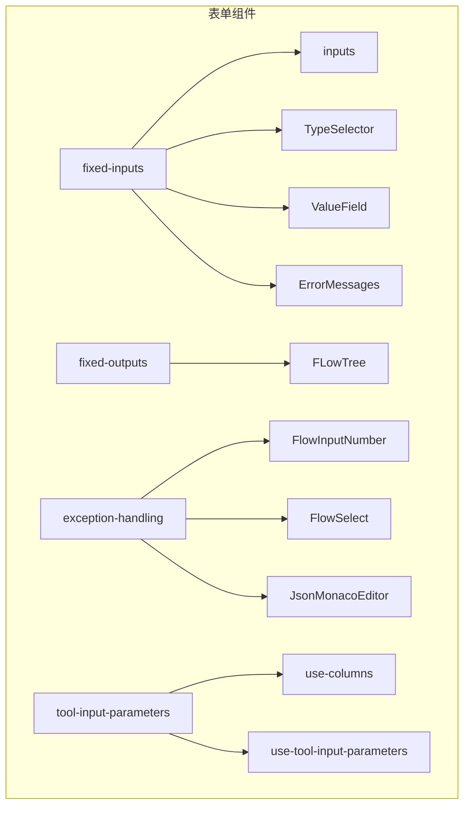
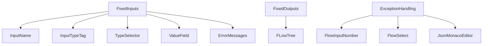
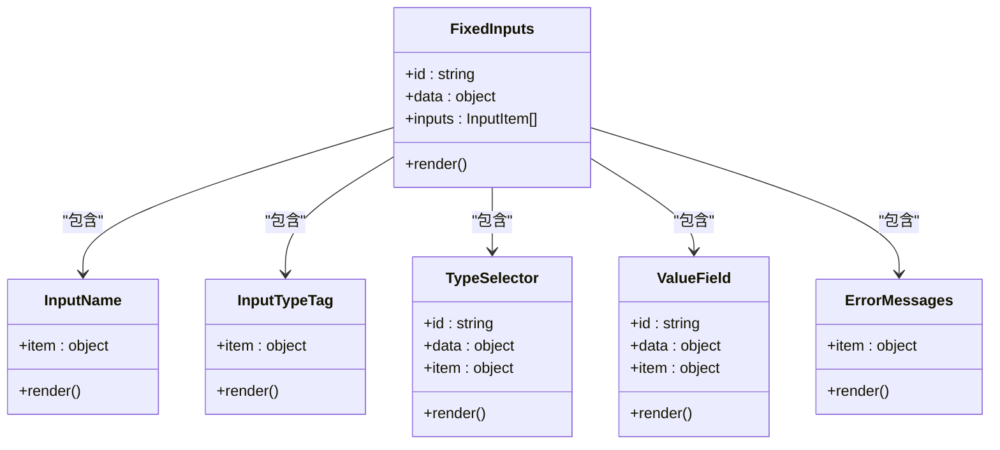
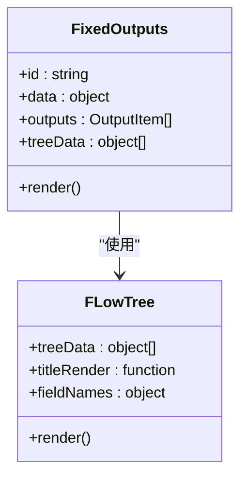
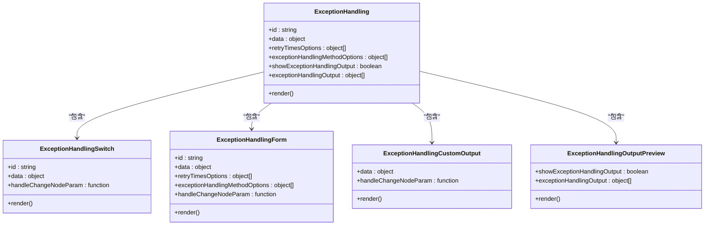
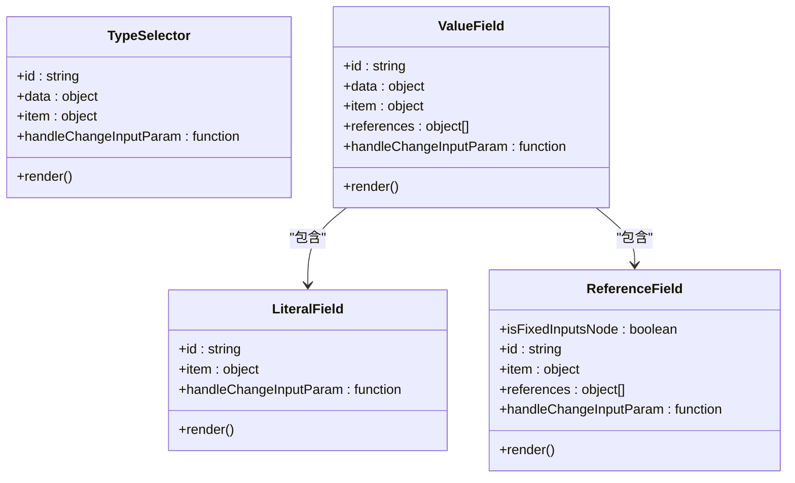
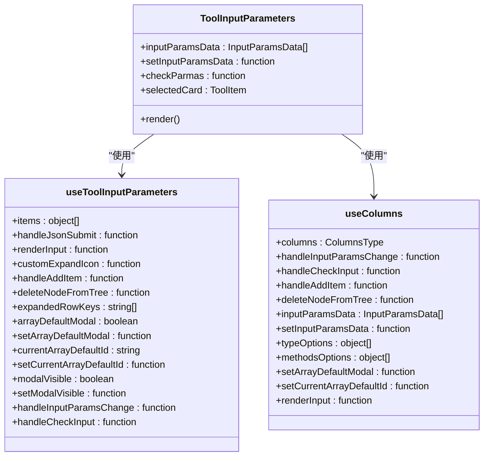
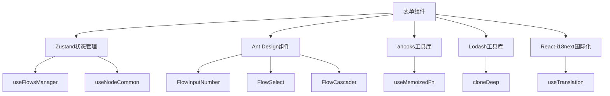

# 表单组件

<cite>
**本文档引用的文件**  
- [fixed-inputs/index.tsx](file://console/frontend/src/components/workflow/nodes/components/fixed-inputs/index.tsx)
- [fixed-outputs/index.tsx](file://console/frontend/src/components/workflow/nodes/components/fixed-outputs/index.tsx)
- [exception-handling/index.tsx](file://console/frontend/src/components/workflow/nodes/components/exception-handling/index.tsx)
- [inputs/index.tsx](file://console/frontend/src/components/workflow/nodes/components/inputs/index.tsx)
- [tool-input-parameters/index.tsx](file://console/frontend/src/components/table/tool-input-parameters/index.tsx)
- [use-node-common.tsx](file://console/frontend/src/components/workflow/hooks/use-node-common.tsx)
- [ui/index.tsx](file://console/frontend/src/components/workflow/ui/index.tsx)
- [model-params-table.tsx](file://console/frontend/src/pages/model-management/components/model-params-table.tsx)
- [json-modal/index.tsx](file://console/frontend/src/components/modal/json-modal/index.tsx)
- [use-columns.tsx](file://console/frontend/src/components/table/tool-input-parameters/hooks/use-columns.tsx)
</cite>

## 目录
1. [简介](#简介)
2. [项目结构](#项目结构)
3. [核心组件](#核心组件)
4. [架构概述](#架构概述)
5. [详细组件分析](#详细组件分析)
6. [依赖分析](#依赖分析)
7. [性能考虑](#性能考虑)
8. [故障排除指南](#故障排除指南)
9. [结论](#结论)

## 简介
本文档详细描述了工作流场景下的专用表单控件实现，涵盖输入框、数字输入、文本域、选择器、级联选择器等组件的设计与实现。文档解释了这些组件如何支持动态参数绑定、类型验证和实时状态更新，说明了组件的props接口定义、事件处理机制和样式定制方法，并提供了在工作流节点配置中的实际使用示例，展示如何与Zustand状态管理集成。同时包含性能优化建议和常见问题解决方案。

## 项目结构
表单组件主要位于前端代码库的`components`目录下，特别是`workflow/nodes/components`和`table`子目录中。这些组件被设计为可复用的UI元素，用于工作流节点配置、模型参数管理等场景。

**图表来源**
- [fixed-inputs/index.tsx](file://console/frontend/src/components/workflow/nodes/components/fixed-inputs/index.tsx)
- [fixed-outputs/index.tsx](file://console/frontend/src/components/workflow/nodes/components/fixed-outputs/index.tsx)
- [exception-handling/index.tsx](file://console/frontend/src/components/workflow/nodes/components/exception-handling/index.tsx)
- [tool-input-parameters/index.tsx](file://console/frontend/src/components/table/tool-input-parameters/index.tsx)

**章节来源**
- [fixed-inputs/index.tsx](file://console/frontend/src/components/workflow/nodes/components/fixed-inputs/index.tsx)
- [fixed-outputs/index.tsx](file://console/frontend/src/components/workflow/nodes/components/fixed-outputs/index.tsx)
- [exception-handling/index.tsx](file://console/frontend/src/components/workflow/nodes/components/exception-handling/index.tsx)

## 核心组件
核心表单组件包括固定输入、固定输出和异常处理三大模块，它们共同构成了工作流节点的配置界面。这些组件通过Zustand状态管理实现数据流控制，支持动态参数绑定和实时验证。

**章节来源**
- [fixed-inputs/index.tsx](file://console/frontend/src/components/workflow/nodes/components/fixed-inputs/index.tsx)
- [fixed-outputs/index.tsx](file://console/frontend/src/components/workflow/nodes/components/fixed-outputs/index.tsx)
- [exception-handling/index.tsx](file://console/frontend/src/components/workflow/nodes/components/exception-handling/index.tsx)

## 架构概述
表单组件采用分层架构设计，上层组件（如`FixedInputs`）负责整体布局和状态管理，底层组件（如`TypeSelector`、`ValueField`）负责具体的输入控件实现。这种设计实现了关注点分离，提高了组件的可维护性和可复用性。

**图表来源**
- [fixed-inputs/index.tsx](file://console/frontend/src/components/workflow/nodes/components/fixed-inputs/index.tsx)
- [fixed-outputs/index.tsx](file://console/frontend/src/components/workflow/nodes/components/fixed-outputs/index.tsx)
- [exception-handling/index.tsx](file://console/frontend/src/components/workflow/nodes/components/exception-handling/index.tsx)

## 详细组件分析

### 固定输入组件分析
固定输入组件`FixedInputs`是工作流节点配置的核心部分，负责管理节点的输入参数。它通过`useNodeCommon` Hook获取节点的输入信息，并渲染相应的输入控件。

**图表来源**
- [fixed-inputs/index.tsx](file://console/frontend/src/components/workflow/nodes/components/fixed-inputs/index.tsx)

**章节来源**
- [fixed-inputs/index.tsx](file://console/frontend/src/components/workflow/nodes/components/fixed-inputs/index.tsx)

### 固定输出组件分析
固定输出组件`FixedOutputs`负责展示工作流节点的输出结构。它使用`FLowTree`组件以树形结构展示输出参数的层次关系。

**图表来源**
- [fixed-outputs/index.tsx](file://console/frontend/src/components/workflow/nodes/components/fixed-outputs/index.tsx)

**章节来源**
- [fixed-outputs/index.tsx](file://console/frontend/src/components/workflow/nodes/components/fixed-outputs/index.tsx)

### 异常处理组件分析
异常处理组件`ExceptionHandling`提供了一套完整的异常处理配置界面，包括超时设置、重试次数、异常处理方法等。

**图表来源**
- [exception-handling/index.tsx](file://console/frontend/src/components/workflow/nodes/components/exception-handling/index.tsx)

**章节来源**
- [exception-handling/index.tsx](file://console/frontend/src/components/workflow/nodes/components/exception-handling/index.tsx)

### 输入控件组件分析
输入控件组件包括`TypeSelector`、`ValueField`等，它们提供了具体的输入界面元素。

**图表来源**
- [inputs/index.tsx](file://console/frontend/src/components/workflow/nodes/components/inputs/index.tsx)

**章节来源**
- [inputs/index.tsx](file://console/frontend/src/components/workflow/nodes/components/inputs/index.tsx)

### 工具输入参数组件分析
工具输入参数组件`ToolInputParameters`用于配置工具节点的输入参数，支持参数的增删改查操作。

**图表来源**
- [tool-input-parameters/index.tsx](file://console/frontend/src/components/table/tool-input-parameters/index.tsx)
- [tool-input-parameters/hooks/use-columns.tsx](file://console/frontend/src/components/table/tool-input-parameters/hooks/use-columns.tsx)

**章节来源**
- [tool-input-parameters/index.tsx](file://console/frontend/src/components/table/tool-input-parameters/index.tsx)

## 依赖分析
表单组件依赖于多个核心模块，包括状态管理、UI组件库和工具函数。

**图表来源**
- [use-node-common.tsx](file://console/frontend/src/components/workflow/hooks/use-node-common.tsx)
- [ui/index.tsx](file://console/frontend/src/components/workflow/ui/index.tsx)

**章节来源**
- [use-node-common.tsx](file://console/frontend/src/components/workflow/hooks/use-node-common.tsx)

## 性能考虑
表单组件在性能方面进行了多项优化，包括使用`useMemoizedFn`进行函数记忆化，避免不必要的重新渲染；使用`useMemo`缓存计算结果；以及通过`takeSnapshot`和`autoSaveCurrentFlow`实现高效的自动保存机制。

## 故障排除指南
常见问题包括输入验证失败、状态更新不及时、组件渲染异常等。解决方案包括检查参数名称是否符合命名规范、确保状态更新通过正确的Hook进行、验证JSON格式是否正确等。

**章节来源**
- [model-params-table.tsx](file://console/frontend/src/pages/model-management/components/model-params-table.tsx)
- [json-modal/index.tsx](file://console/frontend/src/components/modal/json-modal/index.tsx)

## 结论
本文档详细介绍了工作流场景下的专用表单控件实现，涵盖了从基础输入控件到复杂配置界面的各个方面。通过合理的架构设计和状态管理，这些组件提供了强大的功能和良好的用户体验，为工作流节点的配置提供了坚实的基础。