# 工作流组件

<cite>
**本文档引用的文件**
- [flow/index.ts](file://console/frontend/src/components/workflow/types/zustand/flow/index.ts)
- [use-flow-store.ts](file://console/frontend/src/components/workflow/store/use-flow-store.ts)
- [reactflowUtils.ts](file://console/frontend/src/components/workflow/utils/reactflowUtils.ts)
- [use-node-common.tsx](file://console/frontend/src/components/workflow/hooks/use-node-common.tsx)
- [index.tsx](file://console/frontend/src/components/workflow/nodes/start/index.tsx)
- [index.tsx](file://console/frontend/src/components/workflow/nodes/end/index.tsx)
- [index.tsx](file://console/frontend/src/components/workflow/nodes/llm/index.tsx)
- [index.tsx](file://console/frontend/src/components/workflow/nodes/knowledge/index.tsx)
- [index.tsx](file://console/frontend/src/components/workflow/nodes/plugin/index.tsx)
- [index.tsx](file://console/frontend/src/components/workflow/edges/index.tsx)
</cite>

## 目录
1. [项目结构](#项目结构)
2. [核心组件](#核心组件)
3. [节点类型系统](#节点类型系统)
4. [自定义节点和边的渲染机制](#自定义节点和边的渲染机制)
5. [工作流状态管理](#工作流状态管理)
6. [节点事件处理和通信](#节点事件处理和通信)
7. [性能优化策略](#性能优化策略)

## 项目结构

工作流组件主要位于 `console/frontend/src/components/workflow` 目录下，采用模块化设计，各组件职责分明。

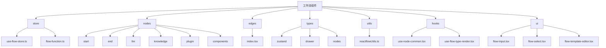

**Diagram sources**
- [console/frontend/src/components/workflow](file://console/frontend/src/components/workflow)

**Section sources**
- [console/frontend/src/components/workflow](file://console/frontend/src/components/workflow)

## 核心组件

工作流组件的核心是基于 React Flow 库构建的可视化编排系统，主要包括节点（Node）、边（Edge）和画布（Canvas）三个核心部分。

### 节点（Node）

节点是工作流的基本组成单元，每个节点代表一个特定的功能或操作。节点组件通过 `BaseNode` 组件进行统一包装，包含节点头部和内容区域。

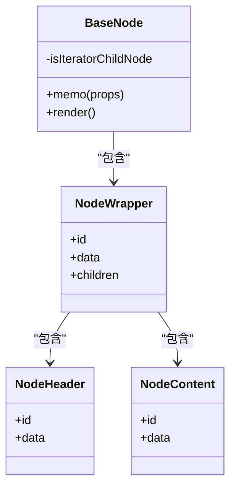

**Diagram sources**
- [console/frontend/src/components/workflow/nodes/index.tsx](file://console/frontend/src/components/workflow/nodes/index.tsx)
- [console/frontend/src/components/workflow/nodes/node-common](file://console/frontend/src/components/workflow/nodes/node-common)

**Section sources**
- [console/frontend/src/components/workflow/nodes/index.tsx](file://console/frontend/src/components/workflow/nodes/index.tsx)

### 边（Edge）

边用于连接节点，表示数据流或执行顺序。自定义边组件 `CustomEdge` 提供了删除边的功能，通过点击边上的删除图标可以移除连接。

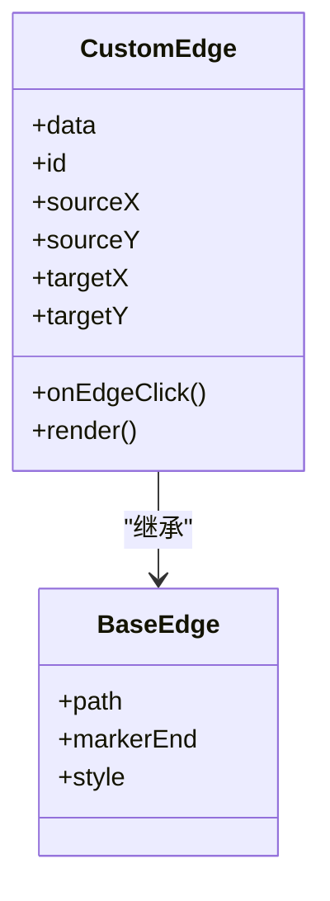

**Diagram sources**
- [console/frontend/src/components/workflow/edges/index.tsx](file://console/frontend/src/components/workflow/edges/index.tsx)

**Section sources**
- [console/frontend/src/components/workflow/edges/index.tsx](file://console/frontend/src/components/workflow/edges/index.tsx)

### 画布（Canvas）

画布是节点和边的容器，提供了缩放、平移等交互功能。画布状态由 Zustand 状态管理库统一管理。

## 节点类型系统

工作流支持多种节点类型，每种节点都有其特定的功能和配置。

### 开始节点

开始节点是工作流的入口，用于定义输入参数。

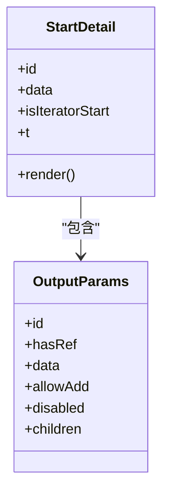

**Diagram sources**
- [console/frontend/src/components/workflow/nodes/start/index.tsx](file://console/frontend/src/components/workflow/nodes/start/index.tsx)

**Section sources**
- [console/frontend/src/components/workflow/nodes/start/index.tsx](file://console/frontend/src/components/workflow/nodes/start/index.tsx)

### 结束节点

结束节点是工作流的出口，用于定义输出模式和内容。

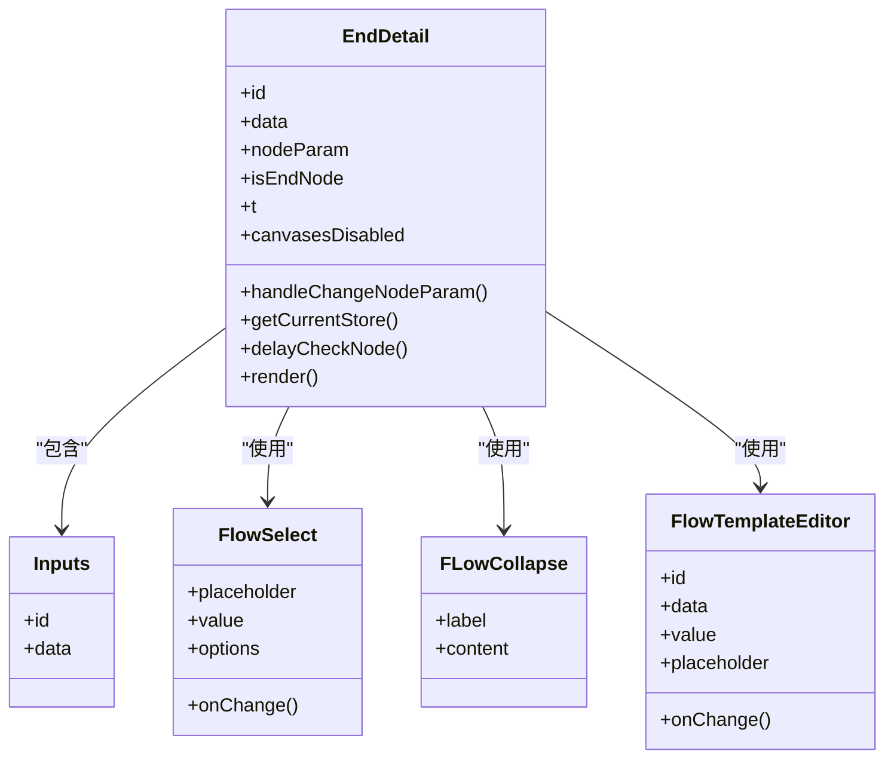

**Diagram sources**
- [console/frontend/src/components/workflow/nodes/end/index.tsx](file://console/frontend/src/components/workflow/nodes/end/index.tsx)

**Section sources**
- [console/frontend/src/components/workflow/nodes/end/index.tsx](file://console/frontend/src/components/workflow/nodes/end/index.tsx)

### LLM节点

LLM节点用于调用大语言模型，支持系统提示词和用户提示词的配置。

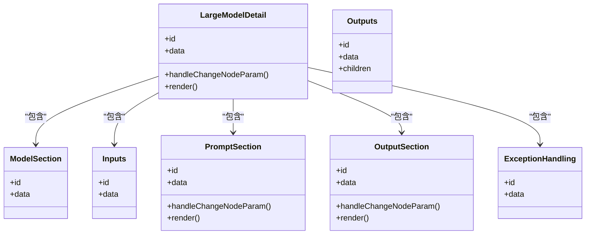

**Diagram sources**
- [console/frontend/src/components/workflow/nodes/llm/index.tsx](file://console/frontend/src/components/workflow/nodes/llm/index.tsx)

**Section sources**
- [console/frontend/src/components/workflow/nodes/llm/index.tsx](file://console/frontend/src/components/workflow/nodes/llm/index.tsx)

### 知识库节点

知识库节点用于连接知识库，支持多个知识库的配置。

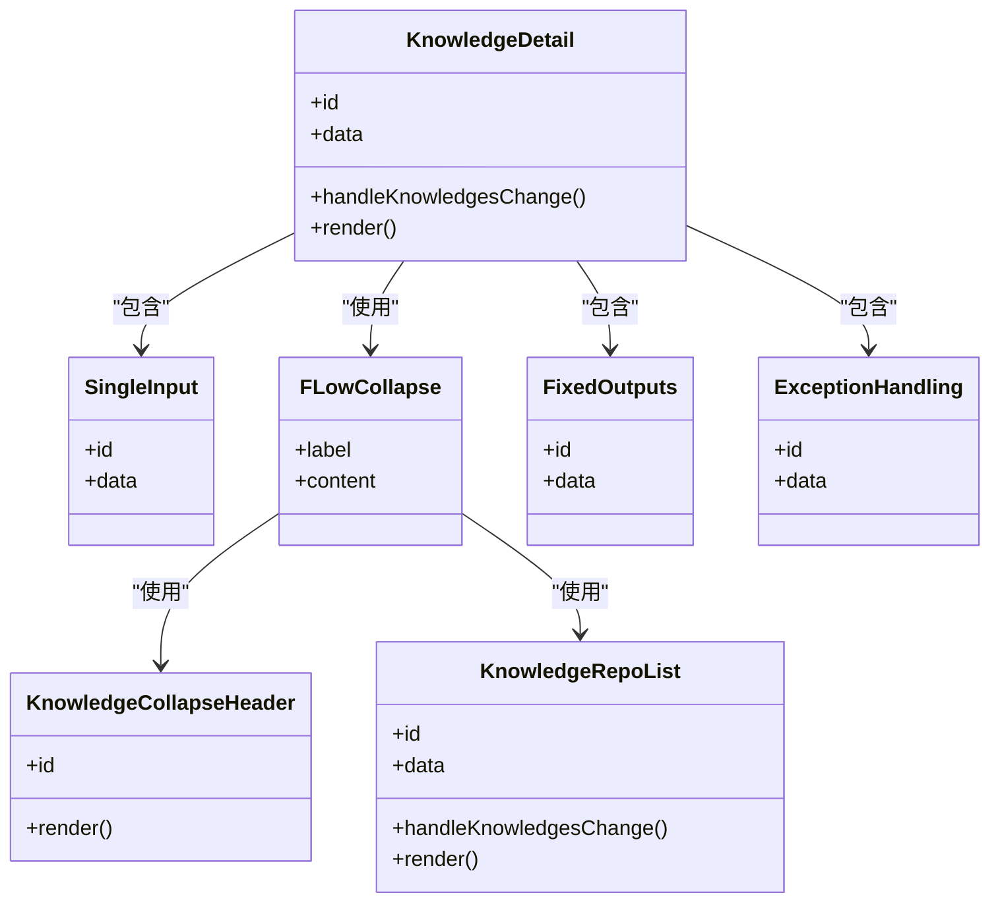

**Diagram sources**
- [console/frontend/src/components/workflow/nodes/knowledge/index.tsx](file://console/frontend/src/components/workflow/nodes/knowledge/index.tsx)

**Section sources**
- [console/frontend/src/components/workflow/nodes/knowledge/index.tsx](file://console/frontend/src/components/workflow/nodes/knowledge/index.tsx)

### 插件节点

插件节点用于调用外部插件，支持输入和输出的固定配置。

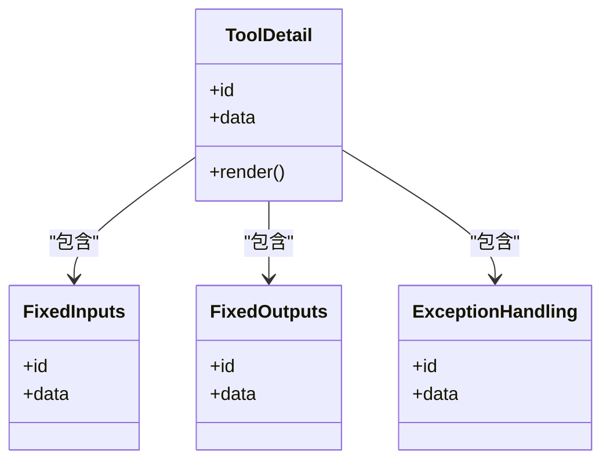

**Diagram sources**
- [console/frontend/src/components/workflow/nodes/plugin/index.tsx](file://console/frontend/src/components/workflow/nodes/plugin/index.tsx)

**Section sources**
- [console/frontend/src/components/workflow/nodes/plugin/index.tsx](file://console/frontend/src/components/workflow/nodes/plugin/index.tsx)

## 自定义节点和边的渲染机制

### 节点渲染

节点的渲染通过 `use-node-common.tsx` 中的 `useNodeCommon` Hook 实现，该 Hook 提供了节点的通用信息和操作函数。

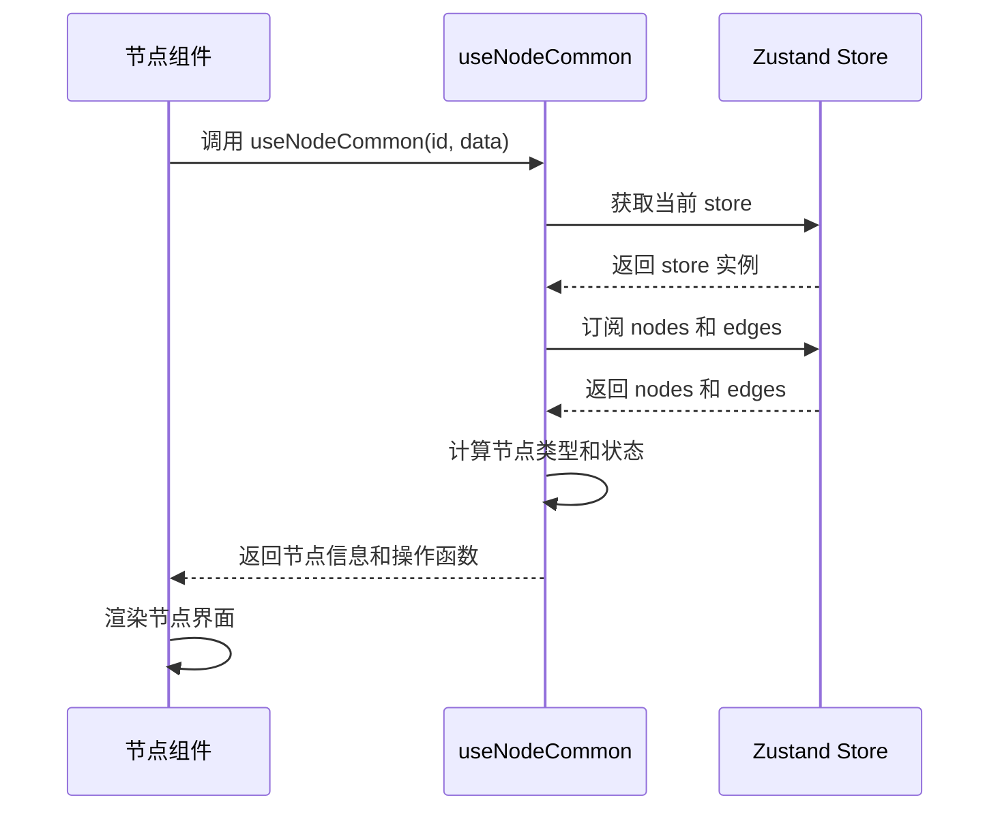

**Diagram sources**
- [console/frontend/src/components/workflow/hooks/use-node-common.tsx](file://console/frontend/src/components/workflow/hooks/use-node-common.tsx)

**Section sources**
- [console/frontend/src/components/workflow/hooks/use-node-common.tsx](file://console/frontend/src/components/workflow/hooks/use-node-common.tsx)

### 边的连接逻辑

边的连接逻辑通过 React Flow 的 `onConnect` 回调实现，当用户连接两个节点时，会触发相应的处理函数。

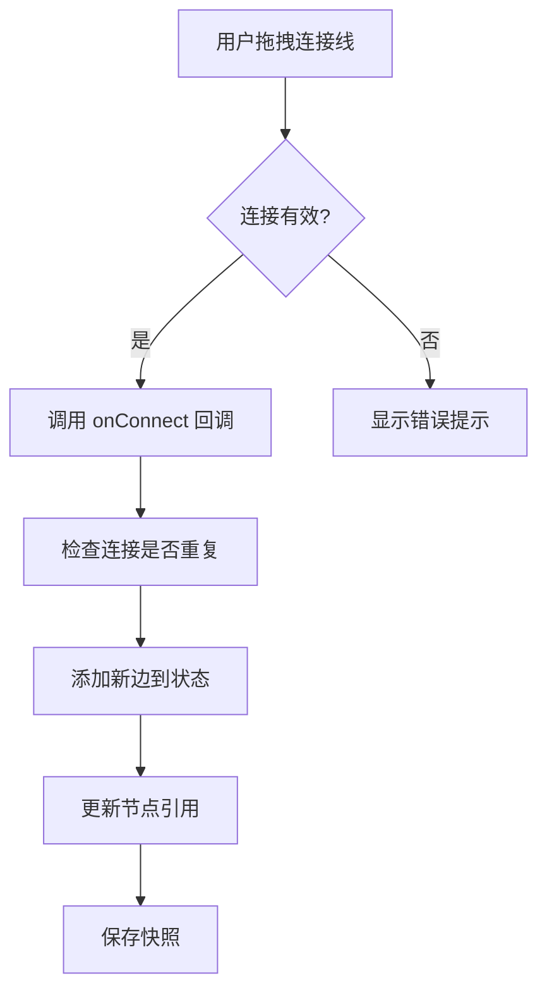

**Diagram sources**
- [console/frontend/src/components/workflow/store/flow-function.ts](file://console/frontend/src/components/workflow/store/flow-function.ts)

**Section sources**
- [console/frontend/src/components/workflow/store/flow-function.ts](file://console/frontend/src/components/workflow/store/flow-function.ts)

## 工作流状态管理

工作流状态使用 Zustand 库进行管理，实现了高效的状态更新和订阅机制。

### 状态定义

状态定义在 `flow/index.ts` 中，包含了工作流所需的所有状态和操作函数。

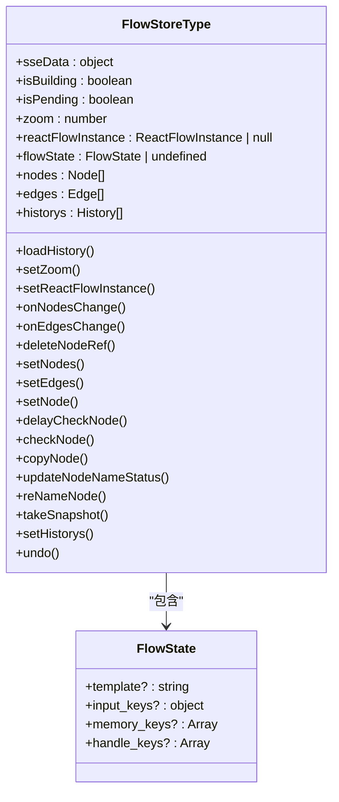

**Diagram sources**
- [console/frontend/src/components/workflow/types/zustand/flow/index.ts](file://console/frontend/src/components/workflow/types/zustand/flow/index.ts)

**Section sources**
- [console/frontend/src/components/workflow/types/zustand/flow/index.ts](file://console/frontend/src/components/workflow/types/zustand/flow/index.ts)

### 状态管理实现

状态管理的实现基于 `create` 函数创建 Zustand store，将各种操作函数注入到 store 中。

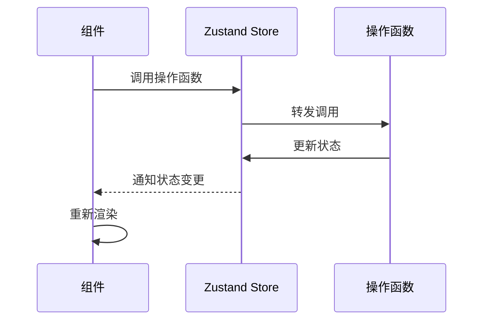

**Diagram sources**
- [console/frontend/src/components/workflow/store/use-flow-store.ts](file://console/frontend/src/components/workflow/store/use-flow-store.ts)

**Section sources**
- [console/frontend/src/components/workflow/store/use-flow-store.ts](file://console/frontend/src/components/workflow/store/use-flow-store.ts)

## 节点事件处理和通信

### 节点事件处理

节点事件处理通过 `use-node-common.tsx` 中的 `useNodeFunc` Hook 实现，提供了节点参数变更、输出行添加/删除等操作。

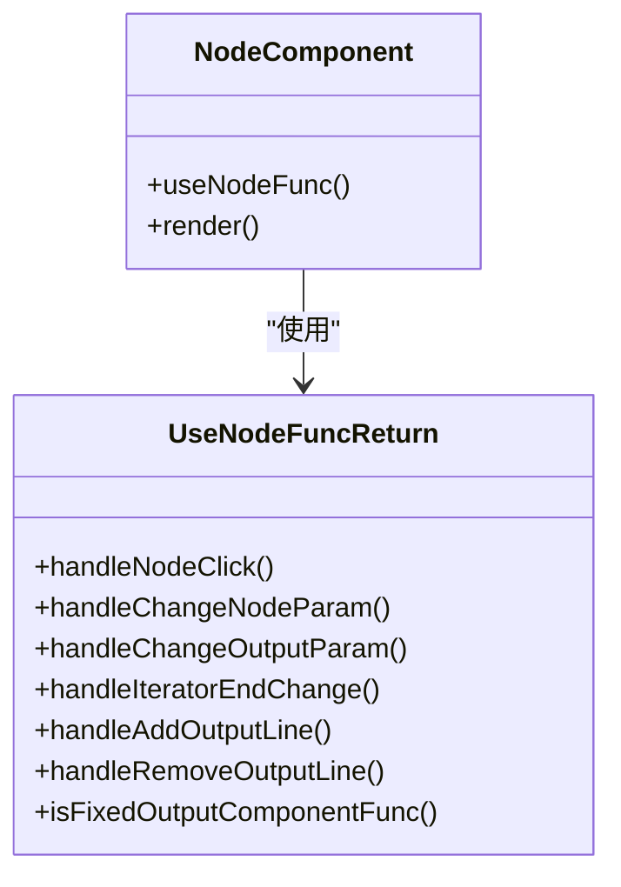

**Diagram sources**
- [console/frontend/src/components/workflow/hooks/use-node-common.tsx](file://console/frontend/src/components/workflow/hooks/use-node-common.tsx)

**Section sources**
- [console/frontend/src/components/workflow/hooks/use-node-common.tsx](file://console/frontend/src/components/workflow/hooks/use-node-common.tsx)

### 节点间通信

节点间通信通过边（Edge）实现，数据流沿着边从一个节点传递到另一个节点。状态管理器负责维护节点间的引用关系。

```mermaid
flowchart LR
A[节点A] -- 数据 --> B[节点B]
B -- 数据 --> C[节点C]
D[节点D] -- 数据 --> E[节点E]
subgraph 状态管理
F[Zustand Store]
F --> A : 管理状态
F --> B : 管理状态
F --> C : 管理状态
F --> D : 管理状态
F --> E : 管理状态
end
```

**Diagram sources**
- [console/frontend/src/components/workflow/store/use-flow-store.ts](file://console/frontend/src/components/workflow/store/use-flow-store.ts)

**Section sources**
- [console/frontend/src/components/workflow/store/use-flow-store.ts](file://console/frontend/src/components/workflow/store/use-flow-store.ts)

## 性能优化策略

### 虚拟滚动

对于包含大量节点的工作流，可以实现虚拟滚动来提高性能，只渲染可视区域内的节点。

### 懒加载

节点的配置面板可以采用懒加载策略，只有在节点被选中时才加载其配置组件。

### 状态更新优化

使用 Zustand 的选择器功能，让组件只订阅其关心的状态部分，避免不必要的重新渲染。

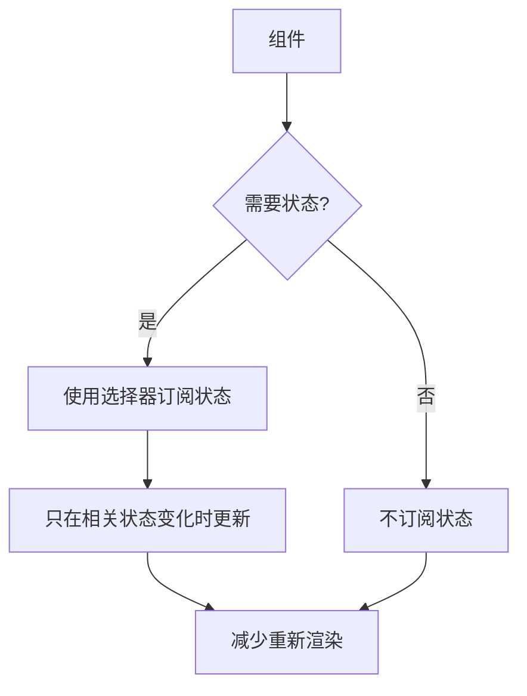

**Diagram sources**
- [console/frontend/src/components/workflow/store/use-flow-store.ts](file://console/frontend/src/components/workflow/store/use-flow-store.ts)

**Section sources**
- [console/frontend/src/components/workflow/store/use-flow-store.ts](file://console/frontend/src/components/workflow/store/use-flow-store.ts)