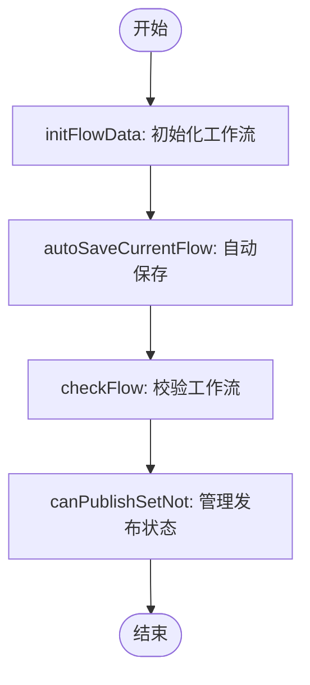

# 流程管理状态

<cite>
**本文档引用的文件**  
- [use-flows-manager.ts](file://console/frontend/src/components/workflow/store/use-flows-manager.ts)
- [flow-manager-function.ts](file://console/frontend/src/components/workflow/store/flow-manager-function.ts)
- [use-flow-store.ts](file://console/frontend/src/components/workflow/store/use-flow-store.ts)
- [use-iterator-flow-store.ts](file://console/frontend/src/components/workflow/store/use-iterator-flow-store.ts)
- [flow-function.ts](file://console/frontend/src/components/workflow/store/flow-function.ts)
- [node.py](file://core/workflow/engine/node.py)
- [flow.py](file://core/workflow/domain/entities/flow.py)
</cite>

## 目录
1. [引言](#引言)
2. [项目结构](#项目结构)
3. [核心组件](#核心组件)
4. [架构概述](#架构概述)
5. [详细组件分析](#详细组件分析)
6. [依赖分析](#依赖分析)
7. [性能考虑](#性能考虑)
8. [故障排除指南](#故障排除指南)
9. [结论](#结论)

## 引言
本文档全面解析工作流管理状态的架构设计，重点说明use-flows-manager对多工作流实例的管理机制。分析flow-manager-function提供的工作流生命周期管理方法，包括创建、加载、保存、删除等操作。解释use-iterator-flow-store在迭代节点场景下的特殊状态管理需求和实现方案。

## 项目结构
本项目采用前后端分离架构，前端使用React和Zustand进行状态管理，后端使用Python和FastAPI构建服务。工作流管理相关代码主要分布在前端的`console/frontend/src/components/workflow/store/`目录和后端的`core/workflow/`目录中。

**图表来源**
- [use-flows-manager.ts](file://console/frontend/src/components/workflow/store/use-flows-manager.ts)
- [flow-manager-function.ts](file://console/frontend/src/components/workflow/store/flow-manager-function.ts)
- [node.py](file://core/workflow/engine/node.py)
- [flow.py](file://core/workflow/domain/entities/flow.py)

**章节来源**
- [use-flows-manager.ts](file://console/frontend/src/components/workflow/store/use-flows-manager.ts)
- [node.py](file://core/workflow/engine/node.py)

## 核心组件
工作流管理状态的核心组件包括use-flows-manager、use-flow-store和use-iterator-flow-store。这些组件共同协作，实现了对多工作流实例的统一管理和状态同步。

**章节来源**
- [use-flows-manager.ts](file://console/frontend/src/components/workflow/store/use-flows-manager.ts)
- [use-flow-store.ts](file://console/frontend/src/components/workflow/store/use-flow-store.ts)
- [use-iterator-flow-store.ts](file://console/frontend/src/components/workflow/store/use-iterator-flow-store.ts)

## 架构概述
工作流管理状态的架构设计采用了分层模式，将状态管理分为全局管理器和具体工作流实例两个层次。use-flows-manager作为全局管理器，负责协调多个工作流实例的状态；use-flow-store和use-iterator-flow-store则分别管理普通工作流和迭代工作流的具体状态。

**图表来源**
- [use-flows-manager.ts](file://console/frontend/src/components/workflow/store/use-flows-manager.ts)
- [use-flow-store.ts](file://console/frontend/src/components/workflow/store/use-flow-store.ts)
- [use-iterator-flow-store.ts](file://console/frontend/src/components/workflow/store/use-iterator-flow-store.ts)

## 详细组件分析

### use-flows-manager分析
use-flows-manager是工作流管理的核心组件，负责管理多个工作流实例的状态。它通过Zustand创建一个全局状态store，提供了一系列方法来操作工作流。

#### 状态管理机制
use-flows-manager通过`currentStore`属性来动态切换当前操作的工作流实例。当需要操作普通工作流时，`currentStore`指向use-flow-store；当需要操作迭代工作流时，`currentStore`指向use-iterator-flow-store。

**图表来源**
- [use-flows-manager.ts](file://console/frontend/src/components/workflow/store/use-flows-manager.ts)
- [use-iterator-flow-store.ts](file://console/frontend/src/components/workflow/store/use-iterator-flow-store.ts)

**章节来源**
- [use-flows-manager.ts](file://console/frontend/src/components/workflow/store/use-flows-manager.ts)

### flow-manager-function分析
flow-manager-function提供了工作流生命周期管理的具体实现，包括创建、加载、保存、删除等操作。

#### 工作流生命周期管理方法
flow-manager-function中的方法实现了工作流的完整生命周期管理：

1. **初始化**：`initFlowData`方法从后端API获取工作流数据并初始化状态
2. **自动保存**：`autoSaveCurrentFlow`方法在用户操作后自动保存工作流
3. **校验**：`checkFlow`方法对工作流进行完整性校验
4. **发布状态管理**：`canPublishSetNot`方法管理工作流的可发布状态

**图表来源**
- [flow-manager-function.ts](file://console/frontend/src/components/workflow/store/flow-manager-function.ts)

**章节来源**
- [flow-manager-function.ts](file://console/frontend/src/components/workflow/store/flow-manager-function.ts)

### use-iterator-flow-store分析
use-iterator-flow-store专门用于管理迭代节点场景下的特殊状态需求。

#### 迭代节点状态管理
在迭代节点场景下，需要特殊的状态管理机制来处理子工作流的独立性和与父工作流的关联性。

**图表来源**
- [use-iterator-flow-store.ts](file://console/frontend/src/components/workflow/store/use-iterator-flow-store.ts)
- [use-flow-store.ts](file://console/frontend/src/components/workflow/store/use-flow-store.ts)

**章节来源**
- [use-iterator-flow-store.ts](file://console/frontend/src/components/workflow/store/use-iterator-flow-store.ts)

## 依赖分析
工作流管理状态组件之间存在明确的依赖关系。use-flows-manager依赖于flow-manager-function提供具体实现，同时依赖于use-flow-store和use-iterator-flow-store来管理具体工作流实例的状态。

**图表来源**
- [use-flows-manager.ts](file://console/frontend/src/components/workflow/store/use-flows-manager.ts)
- [flow-manager-function.ts](file://console/frontend/src/components/workflow/store/flow-manager-function.ts)

**章节来源**
- [use-flows-manager.ts](file://console/frontend/src/components/workflow/store/use-flows-manager.ts)

## 性能考虑
工作流管理状态的设计考虑了性能优化，主要体现在以下几个方面：

1. **防抖机制**：在自动保存操作中使用了防抖技术，避免频繁的API调用
2. **状态隔离**：通过Zustand的store隔离，避免不必要的状态更新
3. **批量操作**：在模型加载等操作中使用Promise.all进行批量处理

## 故障排除指南
在使用工作流管理状态时，可能会遇到以下常见问题：

1. **状态不同步**：确保在切换工作流类型时正确调用`setCurrentStore`
2. **自动保存失败**：检查网络连接和API服务状态
3. **校验错误**：使用`checkFlow`方法进行完整性校验，定位问题节点

**章节来源**
- [use-flows-manager.ts](file://console/frontend/src/components/workflow/store/use-flows-manager.ts)
- [flow-manager-function.ts](file://console/frontend/src/components/workflow/store/flow-manager-function.ts)

## 结论
本文档全面解析了工作流管理状态的架构设计，重点说明了use-flows-manager对多工作流实例的管理机制，分析了flow-manager-function提供的工作流生命周期管理方法，并解释了use-iterator-flow-store在迭代节点场景下的特殊状态管理需求和实现方案。该架构设计合理，具有良好的可扩展性和维护性。