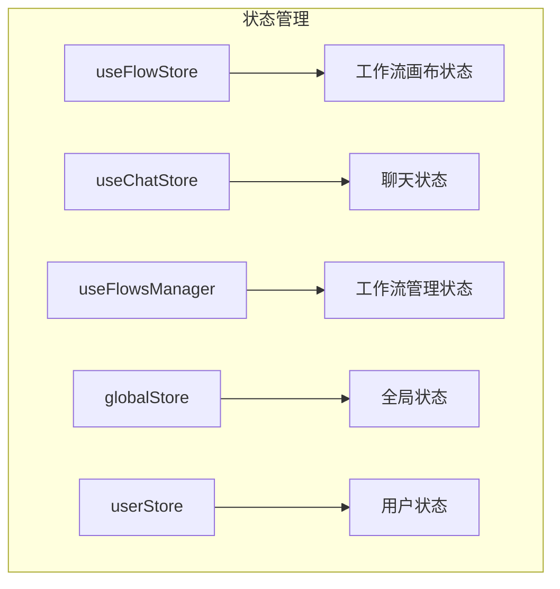
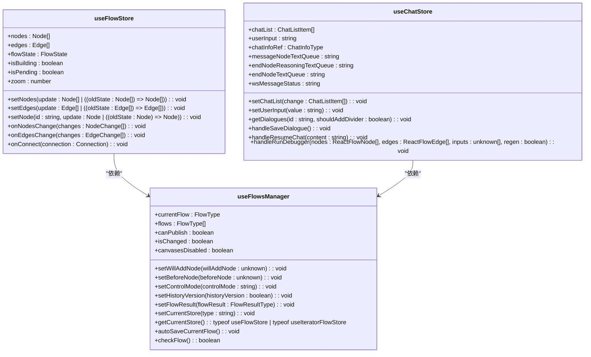
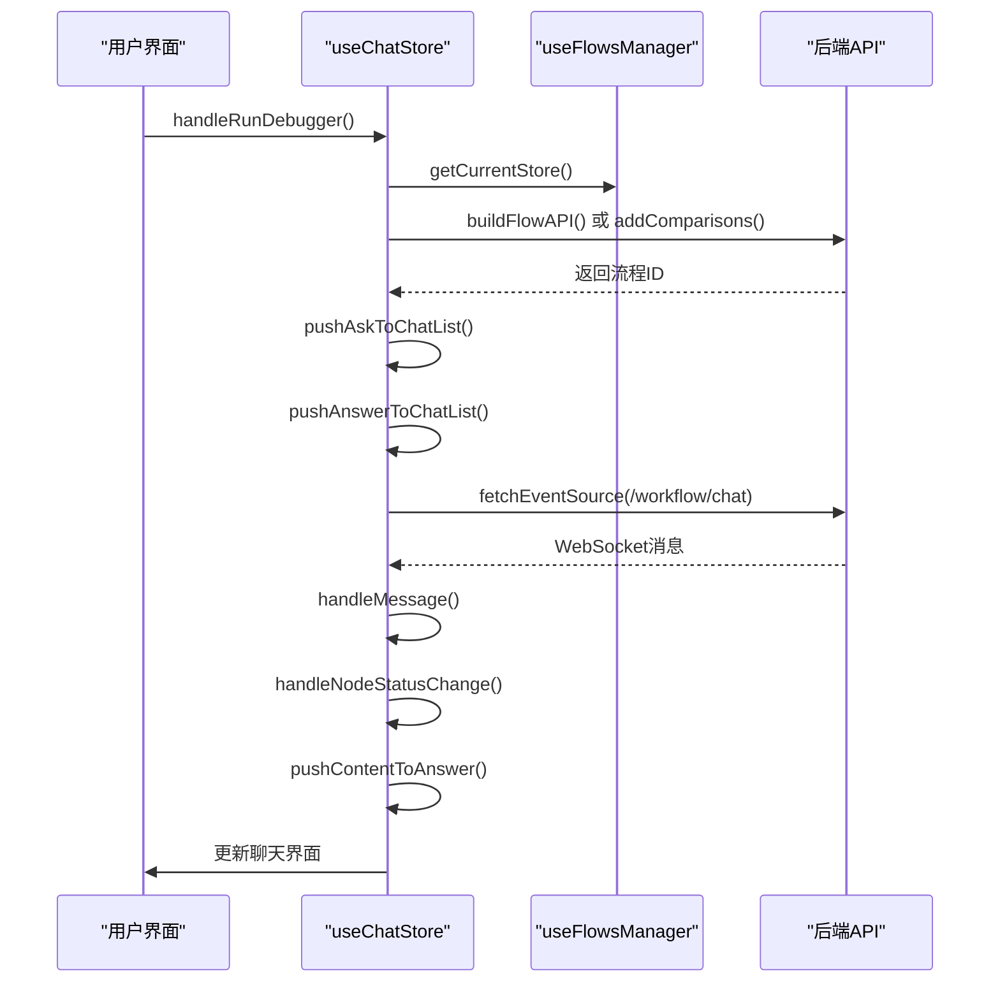
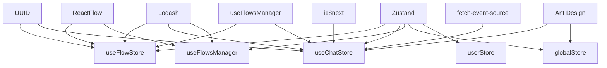
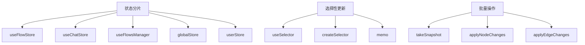

# 状态管理

<cite>
**本文档引用的文件**
- [use-flow-store.ts](file://console/frontend/src/components/workflow/store/use-flow-store.ts)
- [flow-function.ts](file://console/frontend/src/components/workflow/store/flow-function.ts)
- [use-chat-store.ts](file://console/frontend/src/components/workflow/store/use-chat-store.ts)
- [flow-chat-function.ts](file://console/frontend/src/components/workflow/store/flow-chat-function.ts)
- [use-flows-manager.ts](file://console/frontend/src/components/workflow/store/use-flows-manager.ts)
- [flow/index.ts](file://console/frontend/src/components/workflow/types/zustand/flow/index.ts)
- [global-store.ts](file://console/frontend/src/store/global-store.ts)
- [user-store.tsx](file://console/frontend/src/store/user-store.tsx)
</cite>

## 目录
1. [引言](#引言)
2. [项目结构](#项目结构)
3. [核心组件](#核心组件)
4. [架构概述](#架构概述)
5. [详细组件分析](#详细组件分析)
6. [依赖分析](#依赖分析)
7. [性能考虑](#性能考虑)
8. [故障排除指南](#故障排除指南)
9. [结论](#结论)

## 引言
本文档详细分析了基于Zustand的状态管理架构，重点描述了工作流画布状态、节点数据、执行上下文等核心状态的定义和管理方式。文档涵盖了状态存储的设计模式，包括原子状态划分、状态持久化和跨组件状态共享机制，以及状态更新流程、异步操作处理和副作用管理。

## 项目结构
工作流状态管理主要集中在`console/frontend/src/components/workflow/store`目录下，采用Zustand作为状态管理库。该架构通过多个store来管理不同类型的状态，包括工作流画布状态、聊天状态和全局状态。



**Diagram sources**
- [use-flow-store.ts](file://console/frontend/src/components/workflow/store/use-flow-store.ts)
- [use-chat-store.ts](file://console/frontend/src/components/workflow/store/use-chat-store.ts)
- [use-flows-manager.ts](file://console/frontend/src/components/workflow/store/use-flows-manager.ts)
- [global-store.ts](file://console/frontend/src/store/global-store.ts)
- [user-store.tsx](file://console/frontend/src/store/user-store.tsx)

## 核心组件
工作流状态管理的核心组件包括`useFlowStore`、`useChatStore`和`useFlowsManager`，它们分别管理工作流画布、聊天会话和工作流管理相关的状态。

**Section sources**
- [use-flow-store.ts](file://console/frontend/src/components/workflow/store/use-flow-store.ts)
- [use-chat-store.ts](file://console/frontend/src/components/workflow/store/use-chat-store.ts)
- [use-flows-manager.ts](file://console/frontend/src/components/workflow/store/use-flows-manager.ts)

## 架构概述
基于Zustand的状态管理架构采用了模块化设计，将不同领域的状态分离到不同的store中。这种设计模式提高了代码的可维护性和可测试性，同时通过Zustand的中间件机制实现了状态持久化和副作用管理。



**Diagram sources**
- [use-flow-store.ts](file://console/frontend/src/components/workflow/store/use-flow-store.ts)
- [use-chat-store.ts](file://console/frontend/src/components/workflow/store/use-chat-store.ts)
- [use-flows-manager.ts](file://console/frontend/src/components/workflow/store/use-flows-manager.ts)

## 详细组件分析
### 工作流状态管理分析
工作流状态管理通过`useFlowStore`实现，该store定义了工作流画布的核心状态，包括节点、边、缩放级别和构建状态。

#### 原子状态划分
`useFlowStore`将状态划分为多个原子单元，每个单元负责管理特定类型的数据：

```mermaid
flowchart TD
A[FlowStoreType] --> B[画布状态]
A --> C[节点状态]
A --> D[边状态]
A --> E[构建状态]
A --> F[历史状态]
B --> B1[zoom: number]
B --> B2[reactFlowInstance: ReactFlowInstance]
B --> B3[moveToPosition(viewport: Viewport)]
C --> C1[nodes: Node[]]
C --> C2[setNodes(update: Node[] | ((oldState: Node[]) => Node[]))]
C --> C3[setNode(id: string, update: Node | ((oldState: Node) => Node))]
C --> C4[onNodesChange(changes: NodeChange[])]
D --> D1[edges: Edge[]]
D --> D2[setEdges(update: Edge[] | ((oldState: Edge[]) => Edge[]))]
D --> D3[onEdgesChange(changes: EdgeChange[])]
D --> D4[onConnect(connection: Connection)]
E --> E1[isBuilding: boolean]
E --> E2[isPending: boolean]
E --> E3[isBuilt: boolean]
F --> F1[historys: History[]]
F --> F2[takeSnapshot()]
F --> F3[undo()]
F --> F4[setHistorys(update: History[] | ((oldState: History[]) => History[]))]
```

**Diagram sources**
- [flow/index.ts](file://console/frontend/src/components/workflow/types/zustand/flow/index.ts)
- [use-flow-store.ts](file://console/frontend/src/components/workflow/store/use-flow-store.ts)

#### 状态持久化和跨组件共享
状态持久化通过`takeSnapshot`和`undo`机制实现，每次状态变更都会创建一个快照，存储在`historys`数组中。跨组件状态共享通过Zustand的全局store机制实现，任何组件都可以通过`useFlowStore` hook访问和修改状态。

**Section sources**
- [use-flow-store.ts](file://console/frontend/src/components/workflow/store/use-flow-store.ts)
- [flow-function.ts](file://console/frontend/src/components/workflow/store/flow-function.ts)

### 聊天状态管理分析
聊天状态管理通过`useChatStore`实现，该store管理聊天会话相关的状态，包括聊天列表、用户输入和WebSocket消息状态。

#### 状态更新流程
聊天状态的更新流程涉及多个异步操作，包括获取对话历史、保存对话和处理WebSocket消息：



**Diagram sources**
- [use-chat-store.ts](file://console/frontend/src/components/workflow/store/use-chat-store.ts)
- [flow-chat-function.ts](file://console/frontend/src/components/workflow/store/flow-chat-function.ts)

#### 异步操作处理和副作用管理
异步操作通过`fetchEventSource`实现，该函数用于建立WebSocket连接并处理流式响应。副作用管理通过Zustand的action机制实现，每个异步操作都封装在一个action中，确保状态变更的可预测性。

**Section sources**
- [use-chat-store.ts](file://console/frontend/src/components/workflow/store/use-chat-store.ts)
- [flow-chat-function.ts](file://console/frontend/src/components/workflow/store/flow-chat-function.ts)

## 依赖分析
工作流状态管理依赖于多个外部库和内部模块，形成了一个复杂的依赖网络。



**Diagram sources**
- [use-flow-store.ts](file://console/frontend/src/components/workflow/store/use-flow-store.ts)
- [use-chat-store.ts](file://console/frontend/src/components/workflow/store/use-chat-store.ts)
- [use-flows-manager.ts](file://console/frontend/src/components/workflow/store/use-flows-manager.ts)
- [global-store.ts](file://console/frontend/src/store/global-store.ts)
- [user-store.tsx](file://console/frontend/src/store/user-store.tsx)

**Section sources**
- [use-flow-store.ts](file://console/frontend/src/components/workflow/store/use-flow-store.ts)
- [use-chat-store.ts](file://console/frontend/src/components/workflow/store/use-chat-store.ts)
- [use-flows-manager.ts](file://console/frontend/src/components/workflow/store/use-flows-manager.ts)

## 性能考虑
状态管理架构在设计时考虑了多个性能优化策略，包括状态分片、选择性更新和批量操作。

### 状态分片和选择性更新
通过将状态划分为多个独立的store，实现了状态分片，减少了不必要的重新渲染。选择性更新通过Zustand的selector机制实现，组件只订阅它们需要的状态部分。



**Diagram sources**
- [use-flow-store.ts](file://console/frontend/src/components/workflow/store/use-flow-store.ts)
- [use-chat-store.ts](file://console/frontend/src/components/workflow/store/use-chat-store.ts)
- [use-flows-manager.ts](file://console/frontend/src/components/workflow/store/use-flows-manager.ts)

## 故障排除指南
### 常见问题
1. **状态更新不生效**：检查是否正确使用了`setNodes`、`setEdges`等更新函数，确保传入的更新函数或新状态值正确。
2. **WebSocket连接失败**：检查网络连接和API端点配置，确保`fetchEventSource`的URL和headers正确。
3. **历史记录无法撤销**：检查`takeSnapshot`是否在每次状态变更前被调用，确保`historys`数组中有足够的快照。

### 调试技巧
1. 使用浏览器开发者工具的React DevTools检查状态树，观察状态变更。
2. 在关键的action函数中添加console.log，跟踪状态变更流程。
3. 使用Zustand的middleware机制添加日志记录，监控所有状态变更。

**Section sources**
- [use-flow-store.ts](file://console/frontend/src/components/workflow/store/use-flow-store.ts)
- [use-chat-store.ts](file://console/frontend/src/components/workflow/store/use-chat-store.ts)
- [flow-function.ts](file://console/frontend/src/components/workflow/store/flow-function.ts)
- [flow-chat-function.ts](file://console/frontend/src/components/workflow/store/flow-chat-function.ts)

## 结论
基于Zustand的状态管理架构为工作流应用提供了强大而灵活的状态管理能力。通过模块化设计、原子状态划分和高效的更新机制，该架构能够有效管理复杂的工作流状态，同时保持良好的性能和可维护性。未来可以进一步优化状态选择器的使用，减少不必要的重新渲染，并探索更高级的状态持久化策略。