# 画布状态管理

<cite>
**本文档引用的文件**
- [use-flow-store.ts](file://console/frontend/src/components/workflow/store/use-flow-store.ts)
- [flow-function.ts](file://console/frontend/src/components/workflow/store/flow-function.ts)
- [flow/index.ts](file://console/frontend/src/components/workflow/types/zustand/flow/index.ts)
- [use-flows-manager.ts](file://console/frontend/src/components/workflow/store/use-flows-manager.ts)
- [flow-manager-function.ts](file://console/frontend/src/components/workflow/store/flow-manager-function.ts)
- [use-flow-common.ts](file://console/frontend/src/components/workflow/hooks/use-flow-common.ts)
- [flow.ts](file://console/frontend/src/services/flow.ts)
- [reactflowUtils.ts](file://console/frontend/src/components/workflow/utils/reactflowUtils.ts)
</cite>

## 目录
1. [概述](#概述)
2. [系统架构](#系统架构)
3. [核心状态管理组件](#核心状态管理组件)
4. [画布元素状态管理](#画布元素状态管理)
5. [画布操作方法](#画布操作方法)
6. [状态持久化策略](#状态持久化策略)
7. [后端同步机制](#后端同步机制)
8. [性能优化技巧](#性能优化技巧)
9. [订阅与响应式更新](#订阅与响应式更新)
10. [最佳实践](#最佳实践)

## 概述

astron-agent的工作流画布状态管理系统采用基于Zustand的状态管理模式，结合ReactFlow组件库，实现了复杂的工作流编辑器的状态管理需求。该系统支持节点、边、布局等画布元素的完整生命周期管理，包括增删改查、连接操作、布局更新等功能。

### 核心特性

- **模块化状态管理**：采用分层架构，分离画布状态和全局状态
- **响应式更新**：基于Zustand的自动状态订阅和更新机制
- **持久化存储**：支持本地存储和云端同步
- **历史回滚**：提供撤销/重做功能
- **性能优化**：防抖、节流等性能优化策略

## 系统架构

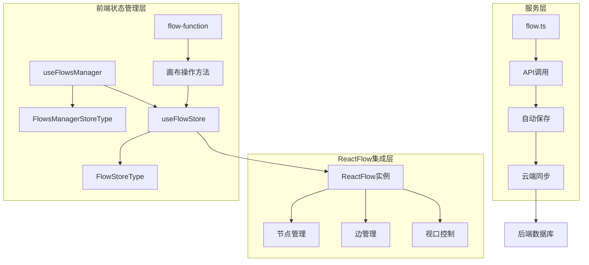

**图表来源**
- [use-flow-store.ts](file://console/frontend/src/components/workflow/store/use-flow-store.ts#L1-L83)
- [use-flows-manager.ts](file://console/frontend/src/components/workflow/store/use-flows-manager.ts#L1-L219)

## 核心状态管理组件

### useFlowStore - 画布核心状态

`useFlowStore`是画布状态管理的核心，基于Zustand创建，负责管理节点、边、视口等画布元素的状态。

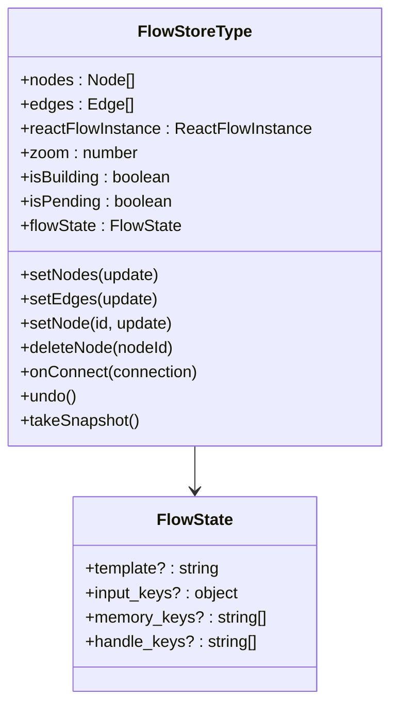

**图表来源**
- [flow/index.ts](file://console/frontend/src/components/workflow/types/zustand/flow/index.ts#L1-L65)

### useFlowsManager - 全局状态管理

`useFlowsManager`作为全局状态管理器，协调多个画布实例和全局应用状态。

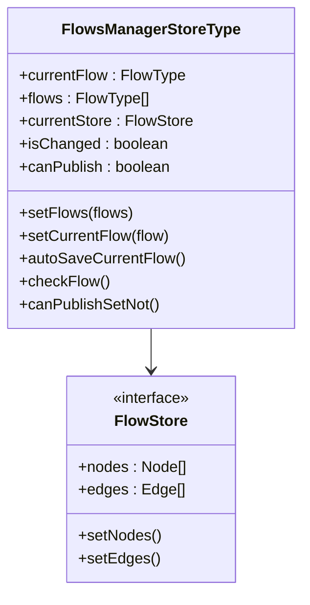

**图表来源**
- [use-flows-manager.ts](file://console/frontend/src/components/workflow/store/use-flows-manager.ts#L1-L219)

**章节来源**
- [use-flow-store.ts](file://console/frontend/src/components/workflow/store/use-flow-store.ts#L1-L83)
- [use-flows-manager.ts](file://console/frontend/src/components/workflow/store/use-flows-manager.ts#L1-L219)

## 画布元素状态管理

### 节点状态管理

节点是工作流画布的基本组成单元，包含丰富的元数据和状态信息。

#### 节点数据结构

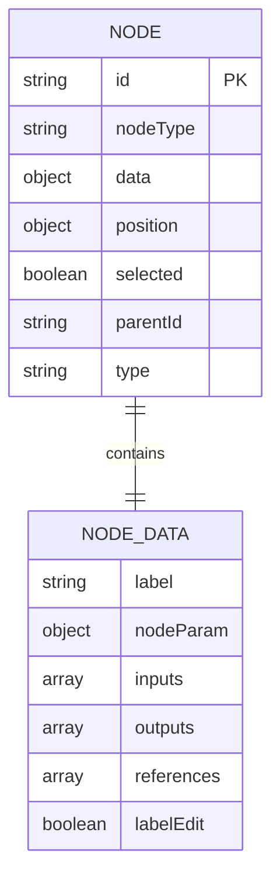

#### 节点操作方法

系统提供了完整的节点生命周期管理方法：

- **节点创建**：通过`handleAddNode`系列钩子函数
- **节点查询**：通过`checkNode`和`delayCheckNode`方法
- **节点修改**：通过`setNode`和`updateNodeRef`方法
- **节点删除**：通过`deleteNode`方法，自动清理引用关系

### 边状态管理

边表示节点之间的连接关系，包含类型、样式和数据信息。

#### 边数据结构

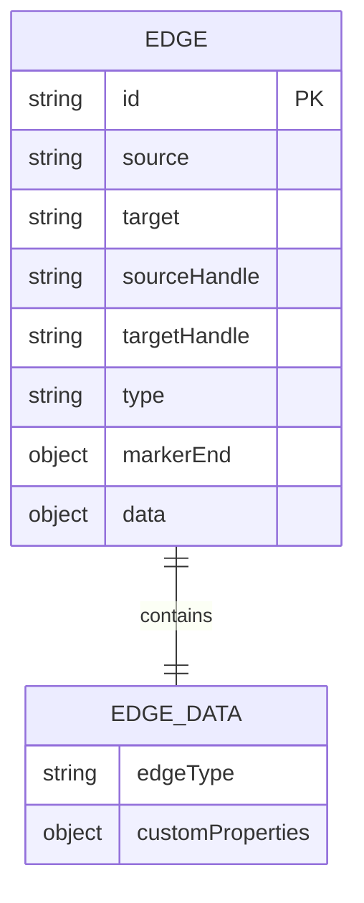

#### 边操作方法

- **边连接**：通过`onConnect`方法处理节点连接
- **边删除**：通过`removeNodeRef`方法清理边关系
- **边切换**：通过`switchNodeRef`方法重新连接边

### 布局状态管理

布局状态包括画布的缩放级别、视口位置和节点排列。

#### 视口控制

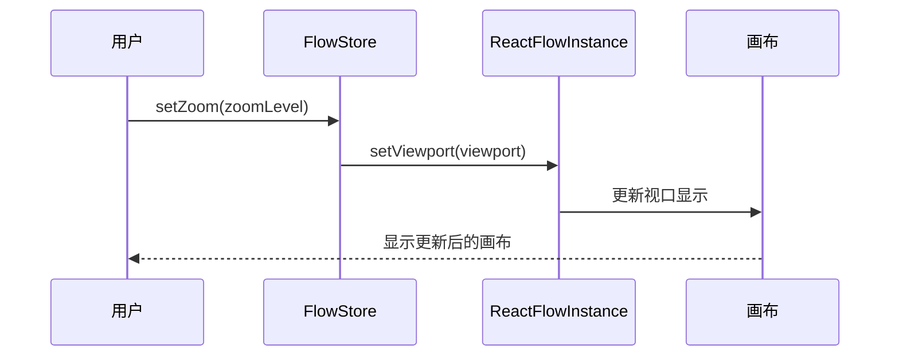

**图表来源**
- [flow-function.ts](file://console/frontend/src/components/workflow/store/flow-function.ts#L40-L50)

**章节来源**
- [flow-function.ts](file://console/frontend/src/components/workflow/store/flow-function.ts#L1-L733)
- [use-flow-common.ts](file://console/frontend/src/components/workflow/hooks/use-flow-common.ts#L1-L518)

## 画布操作方法

### 节点增删改查方法

#### 节点创建

节点创建通过统一的添加节点流程实现：

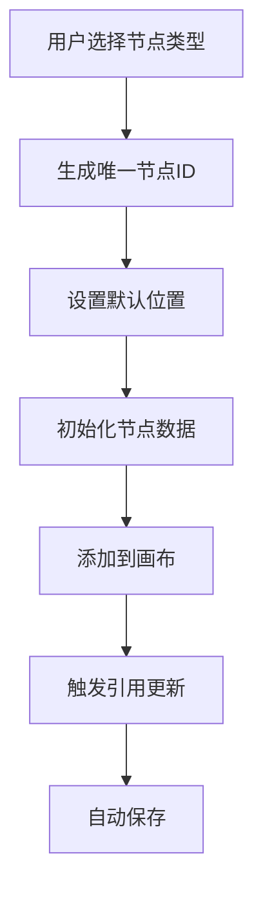

**图表来源**
- [use-flow-common.ts](file://console/frontend/src/components/workflow/hooks/use-flow-common.ts#L30-L150)

#### 节点查询和验证

系统提供多种节点查询和验证方法：

- **即时验证**：`checkNode`方法立即验证节点状态
- **延迟验证**：`delayCheckNode`方法防抖验证
- **批量验证**：`checkFlow`方法验证整个工作流

#### 节点修改

节点修改支持单个字段更新和批量更新：

- **单字段更新**：`setNode`方法更新指定字段
- **复杂更新**：支持函数式更新模式
- **引用更新**：自动更新相关节点的引用关系

#### 节点删除

节点删除包含完整的清理流程：

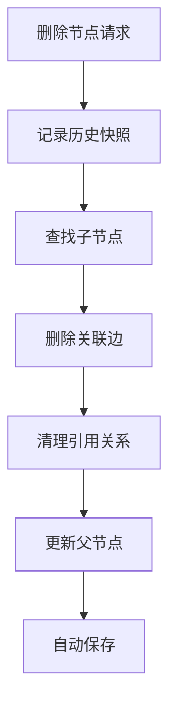

**图表来源**
- [flow-function.ts](file://console/frontend/src/components/workflow/store/flow-function.ts#L350-L400)

### 连接操作方法

#### 边连接管理

边连接操作包括创建、删除和切换：

- **创建连接**：`onConnect`方法处理新边创建
- **删除连接**：`removeNodeRef`方法清理边关系
- **切换连接**：`switchNodeRef`方法重新连接

#### 引用关系管理

系统维护复杂的节点引用关系：

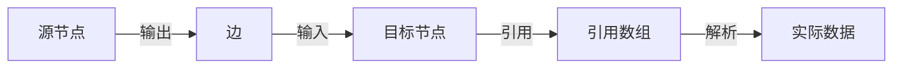

**图表来源**
- [flow-function.ts](file://console/frontend/src/components/workflow/store/flow-function.ts#L450-L550)

### 布局更新方法

#### 自动布局

系统支持自动布局功能，根据节点关系自动生成合理的布局：

- **层级布局**：按执行顺序排列节点
- **紧凑布局**：优化空间利用率
- **自定义布局**：支持用户手动调整

#### 视口控制

视口控制提供画布导航功能：

- **缩放控制**：`setZoom`方法控制缩放级别
- **位置跳转**：`moveToPosition`方法快速定位
- **全览模式**：自动调整视口以显示所有节点

**章节来源**
- [flow-function.ts](file://console/frontend/src/components/workflow/store/flow-function.ts#L1-L733)
- [use-flow-common.ts](file://console/frontend/src/components/workflow/hooks/use-flow-common.ts#L1-L518)

## 状态持久化策略

### 本地存储策略

系统采用多层次的持久化策略：

#### 快照机制

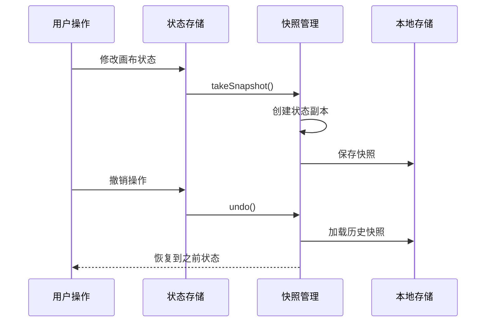

**图表来源**
- [flow-function.ts](file://console/frontend/src/components/workflow/store/flow-function.ts#L60-L80)

#### 自动保存机制

系统实现了智能的自动保存策略：

- **防抖保存**：300ms防抖延迟，避免频繁保存
- **增量保存**：只保存变更的部分
- **错误恢复**：保存失败时的重试机制

### 云端同步策略

#### 实时同步

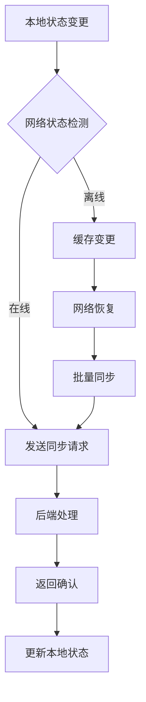

**图表来源**
- [flow-manager-function.ts](file://console/frontend/src/components/workflow/store/flow-manager-function.ts#L350-L400)

#### 版本控制

系统支持版本控制功能：

- **自动版本**：每次保存自动生成版本号
- **分支管理**：支持并行开发和测试
- **合并冲突**：智能解决合并冲突

**章节来源**
- [flow-manager-function.ts](file://console/frontend/src/components/workflow/store/flow-manager-function.ts#L1-L868)
- [flow.ts](file://console/frontend/src/services/flow.ts#L1-L205)

## 后端同步机制

### API服务层

系统通过专门的服务层处理与后端的数据交互：

#### 核心API方法

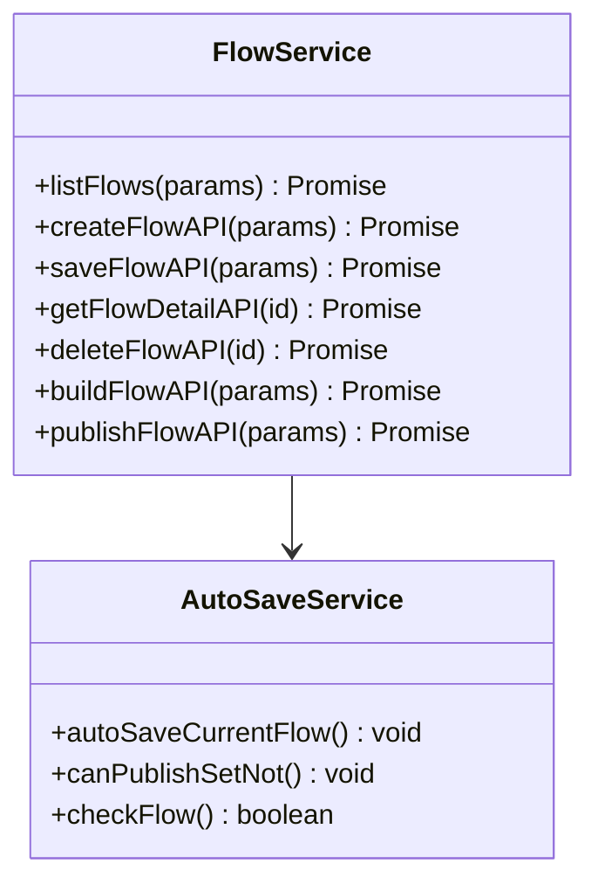

**图表来源**
- [flow.ts](file://console/frontend/src/services/flow.ts#L1-L205)

#### 数据同步流程

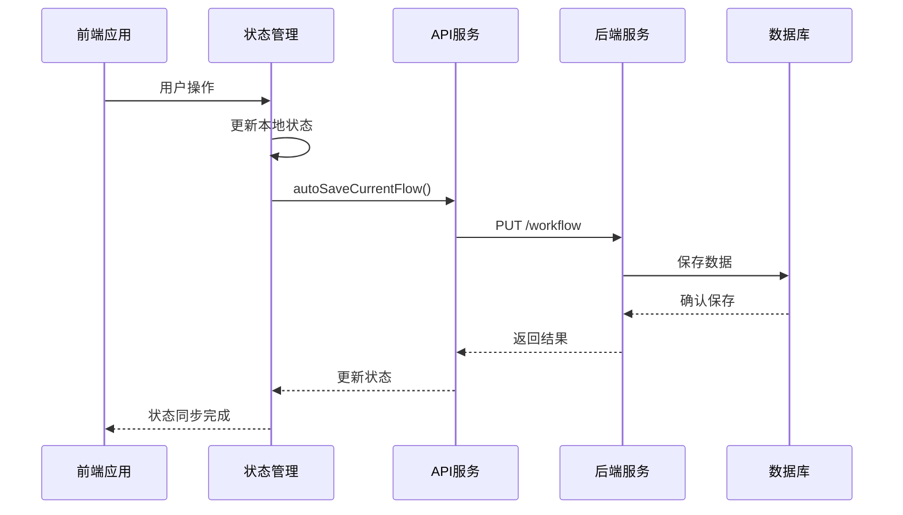

**图表来源**
- [flow-manager-function.ts](file://console/frontend/src/components/workflow/store/flow-manager-function.ts#L350-L400)

### 错误处理和重试

#### 网络错误处理

系统实现了完善的错误处理机制：

- **网络超时**：3秒超时限制
- **重试机制**：最多3次重试
- **降级策略**：离线模式下的本地优先

#### 数据一致性保证

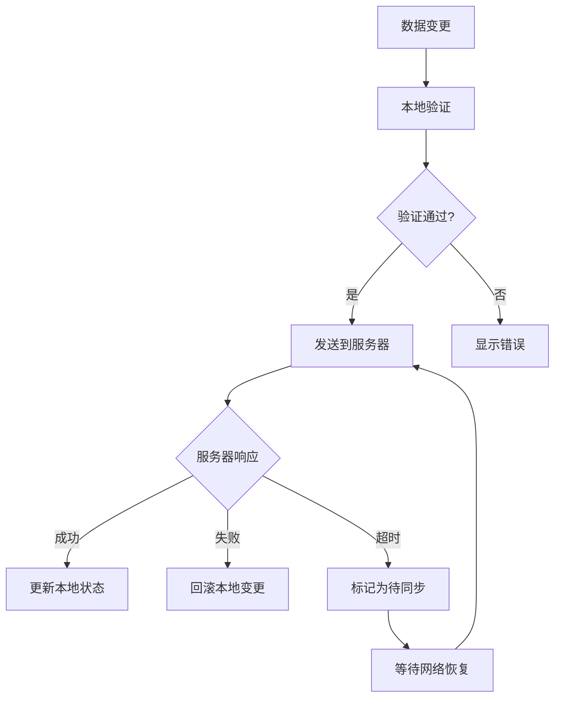

**章节来源**
- [flow.ts](file://console/frontend/src/services/flow.ts#L1-L205)
- [flow-manager-function.ts](file://console/frontend/src/components/workflow/store/flow-manager-function.ts#L350-L450)

## 性能优化技巧

### 状态更新优化

#### 防抖和节流

系统在多个层面实现了性能优化：

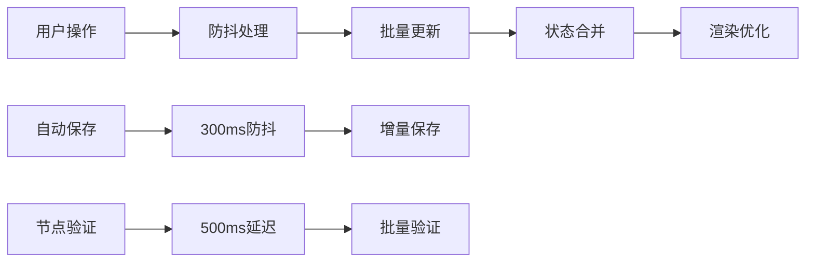

**图表来源**
- [flow-function.ts](file://console/frontend/src/components/workflow/store/flow-function.ts#L200-L250)

#### 内存管理

- **对象池**：重用节点和边对象
- **弱引用**：避免内存泄漏
- **垃圾回收**：及时清理无用状态

### 渲染性能优化

#### 虚拟化

对于大型工作流，系统实现了虚拟化渲染：

- **可见区域渲染**：只渲染可视区域内的节点
- **懒加载**：按需加载节点内容
- **批处理**：合并DOM更新操作

#### 事件优化

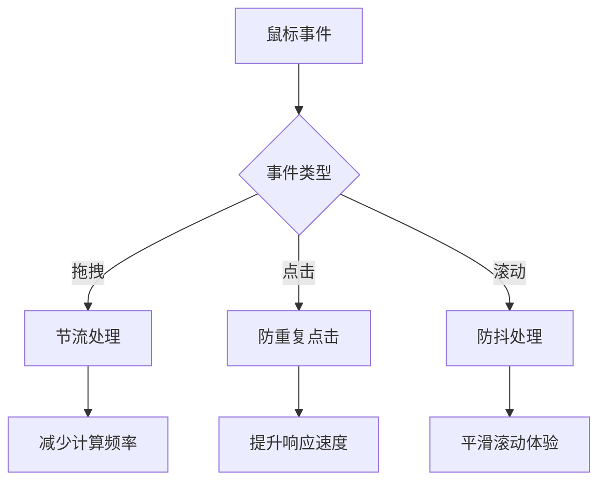

**章节来源**
- [flow-function.ts](file://console/frontend/src/components/workflow/store/flow-function.ts#L200-L300)

## 订阅与响应式更新

### Zustand订阅机制

系统基于Zustand的响应式特性实现状态订阅：

#### 订阅模式

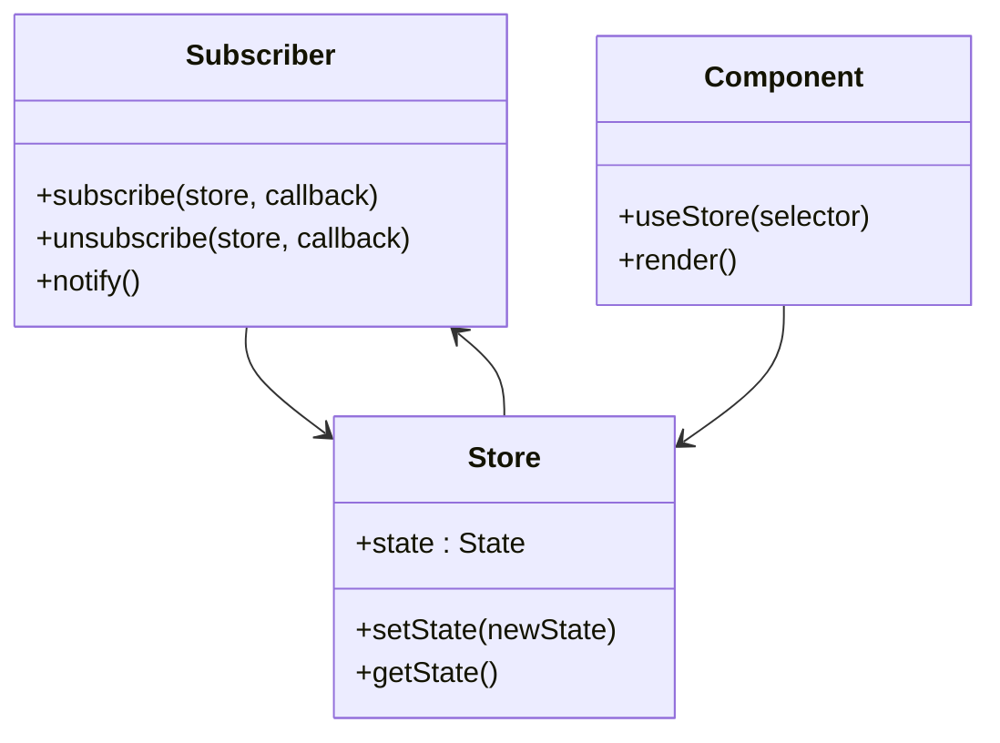

#### 响应式更新流程

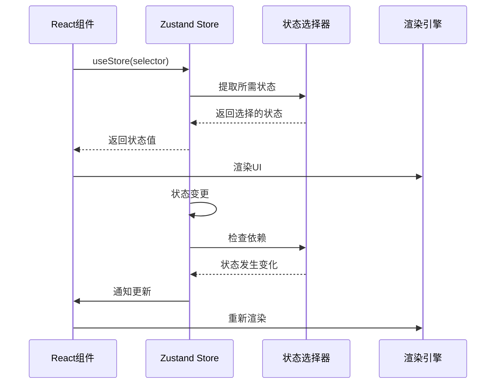

### 组件级订阅

系统支持细粒度的组件级订阅：

- **选择性订阅**：只订阅必要的状态部分
- **计算属性**：基于状态计算派生数据
- **条件渲染**：根据状态变化控制渲染逻辑

**章节来源**
- [use-flow-store.ts](file://console/frontend/src/components/workflow/store/use-flow-store.ts#L1-L83)

## 最佳实践

### 状态设计原则

#### 单一职责

每个状态模块都有明确的职责边界：

- **画布状态**：专注于节点、边、布局管理
- **应用状态**：管理全局应用配置和用户偏好
- **业务状态**：处理具体业务逻辑

#### 不可变性

系统严格遵循不可变性原则：

```typescript
// 推荐：使用不可变更新
setNodes(nodes => nodes.map(node => 
  node.id === id ? { ...node, data: newData } : node
))

// 避免：直接修改状态
nodes[id].data = newData  // 错误做法
```

### 错误处理最佳实践

#### 分层错误处理

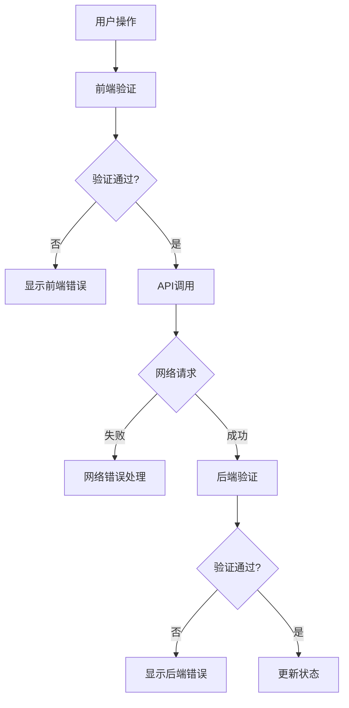

#### 用户体验优化

- **加载状态**：长时间操作显示加载指示器
- **错误提示**：友好的错误消息和解决方案
- **恢复机制**：提供错误恢复选项

### 测试策略

#### 单元测试

```typescript
describe('FlowStore', () => {
  it('should add node correctly', () => {
    const store = useFlowStore.getState()
    store.addNode(nodeData)
    expect(store.nodes).toContainEqual(expectedNode)
  })
  
  it('should handle edge connections', () => {
    const store = useFlowStore.getState()
    store.onConnect(connection)
    expect(store.edges).toContainEqual(expectedEdge)
  })
})
```

#### 集成测试

测试状态管理的整体行为：

- **状态同步**：验证前后端状态一致性
- **并发操作**：测试多用户同时编辑场景
- **错误恢复**：验证错误情况下的恢复能力

### 调试和监控

#### 开发者工具

系统集成了开发者工具支持：

- **状态检查器**：实时查看状态树
- **时间旅行**：回溯状态变更历史
- **性能分析**：监控状态更新性能

#### 生产监控

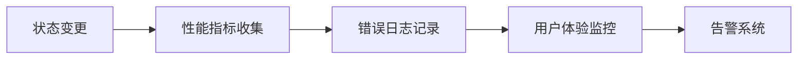

通过这些最佳实践，可以构建一个稳定、高效、易维护的工作流画布状态管理系统。