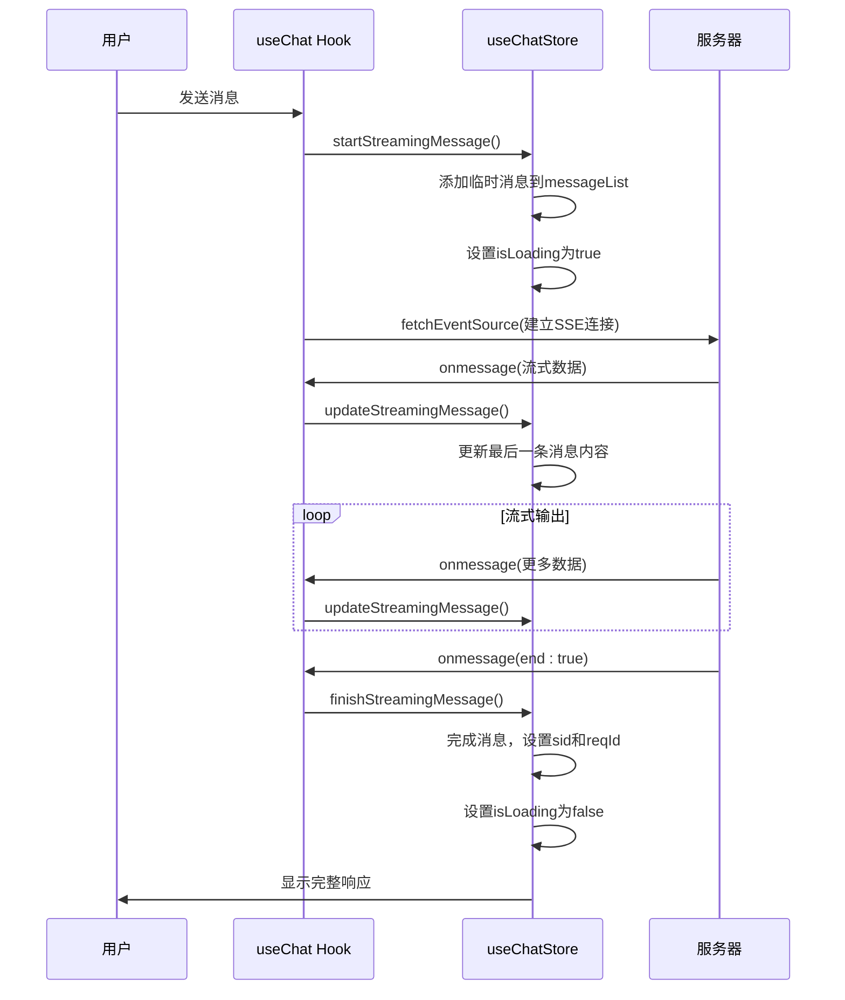
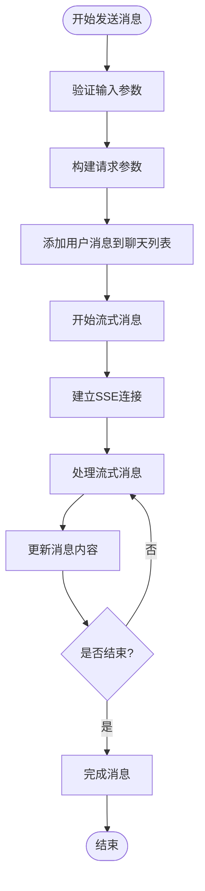
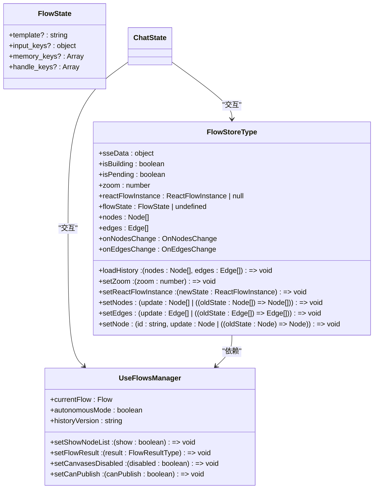
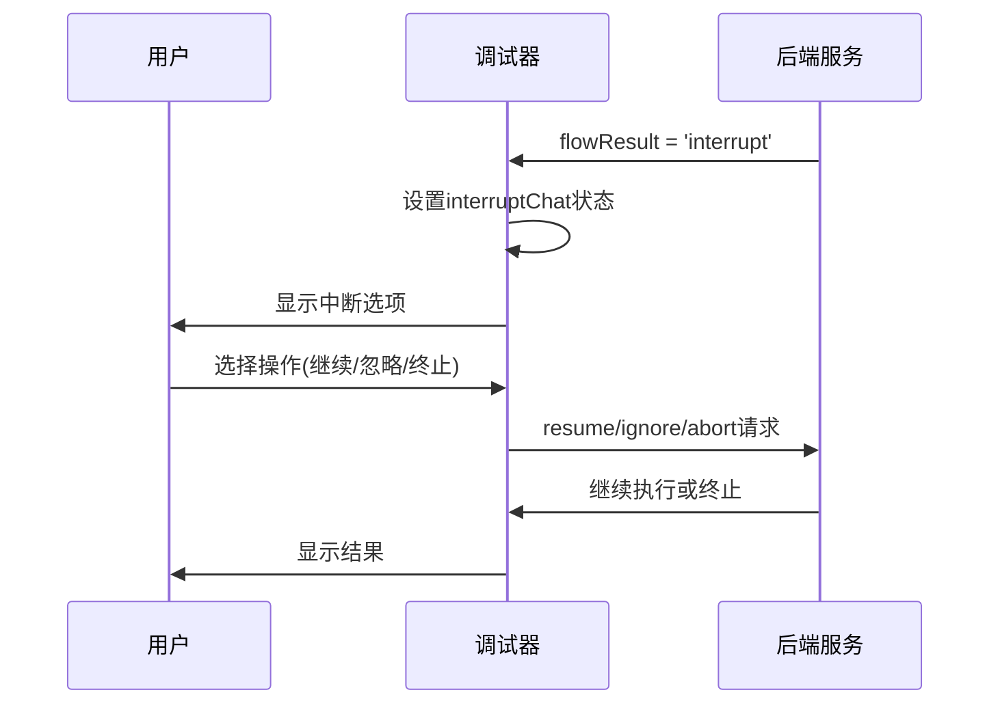

# 聊天状态管理

<cite>
**本文档引用的文件**   
- [chat-store.ts](file://console/frontend/src/store/chat-store.ts)
- [use-chat.ts](file://console/frontend/src/hooks/use-chat.ts)
- [flow-chat-function.ts](file://console/frontend/src/components/workflow/store/flow-chat-function.ts)
- [chat.ts](file://console/frontend/src/types/chat.ts)
- [use-flow-store.ts](file://console/frontend/src/components/workflow/store/use-flow-store.ts)
- [use-flows-manager.ts](file://console/frontend/src/components/workflow/store/use-flows-manager.ts)
</cite>

## 目录
1. [引言](#引言)
2. [聊天状态管理核心](#聊天状态管理核心)
3. [聊天交互方法](#聊天交互方法)
4. [聊天状态与画布状态的交互](#聊天状态与画布状态的交互)
5. [调试模式下的特殊处理](#调试模式下的特殊处理)
6. [结论](#结论)

## 引言
本文档深入分析工作流中聊天状态的管理方式，重点解析`use-chat-store`中消息历史、会话上下文、流式响应等状态的定义和管理。阐述`flow-chat-function`提供的聊天交互方法，包括消息发送、流式接收、会话管理等。说明聊天状态与画布状态的交互关系，以及在调试模式下的特殊处理逻辑。

## 聊天状态管理核心

`use-chat-store`是整个聊天功能的核心状态管理模块，基于Zustand库实现，负责维护聊天会话的完整状态。该store定义了聊天会话所需的所有状态变量和操作方法，确保聊天功能的稳定运行。

### 消息历史管理
消息历史通过`messageList`状态进行管理，存储了完整的聊天记录。每条消息都包含发送时间、消息内容、消息类型等信息。通过`addMessage`、`setMessageList`等方法可以添加和更新消息列表。

```mermaid
classDiagram
class MessageListType {
+id? : number
+message : string
+reasoning? : string
+traceSource? : string
+sourceType? : string
+chatFileList? : UploadFileInfo[]
+reqId? : number
+reqType? : string
+sid? : string
+tools? : string[]
+updateTime? : string
+workflowEventData? : WorkflowEventData
}
class ChatState {
+messageList : MessageListType[]
+chatFileListNoReq : UploadFileInfo[]
+streamingMessage : MessageListType | null
+streamId : string
+answerPercent : number
+controllerRef : AbortController
+isLoading : boolean
+currentToolName : string
+traceSource : string
+deepThinkText : string
+currentChatId : number
+workflowOperation : string[]
+isWorkflowOption : boolean
+workflowOption : {option : Option[]; content? : string}
+vmsInteractiveRef : any
+vmsInteractiveRefStatus : string
+vmsInteractiveRefPlayer : any
+chatType : string
}
class ChatActions {
+initChatStore() : void
+setMessageList(messageList : MessageListType[]) : void
+setChatFileListNoReq(chatFileListNoReq : UploadFileInfo[]) : void
+addMessage(message : MessageListType) : void
+startStreamingMessage(message : MessageListType) : void
+updateStreamingMessage(content : string) : void
+finishStreamingMessage(sid? : string, reqId? : number) : void
+clearStreamingMessage() : void
+setStreamId(streamId : string) : void
+setAnswerPercent(answerPercent : number) : void
+setControllerRef(controllerRef : AbortController) : void
+setIsLoading(isLoading : boolean) : void
+setCurrentToolName(currentToolName : string) : void
+setTraceSource(traceSource : string) : void
+setDeepThinkText(deepThinkText : string) : void
+setCurrentChatId(currentChatId : number) : void
+setWorkflowOperation(workflowOperation : string[]) : void
+setIsWorkflowOption(isWorkflowOption : boolean) : void
+setWorkflowOption(workflowOption : {option : Option[]; content? : string}) : void
+setVmsInteractiveRef(vmsInteractiveRef : any) : void
+setVmsInteractiveRefPlayer(vmsInteractiveRefPlayer : any) : void
+setVmsInteractiveRefStatus(vmsInteractiveRefStatus : string) : void
+getVmsInteractiveRefPlayer() : any
+getVmsInteractiveRefStatus() : string
+setChatType(chatType : string) : void
+getChatType() : string
}
ChatState --> MessageListType : "包含"
ChatActions --> ChatState : "操作"
```

**图示来源**
- [chat-store.ts](file://console/frontend/src/store/chat-store.ts#L0-L193)
- [chat.ts](file://console/frontend/src/types/chat.ts#L200-L300)

### 会话上下文管理
会话上下文通过`currentChatId`状态进行管理，标识当前正在交互的聊天会话。同时，`chatFileListNoReq`状态管理了与当前会话相关的文件列表，支持文件上传和管理功能。

### 流式响应管理
流式响应是聊天功能的关键特性，通过一系列专门的状态和方法进行管理：

- `streamingMessage`: 存储正在流式输出的消息
- `streamId`: 对话流的唯一标识符
- `answerPercent`: 回答进度百分比
- `isLoading`: 是否正在加载状态

流式响应的管理通过`startStreamingMessage`、`updateStreamingMessage`和`finishStreamingMessage`三个核心方法实现完整的生命周期管理。



**图示来源**
- [chat-store.ts](file://console/frontend/src/store/chat-store.ts#L100-L150)
- [use-chat.ts](file://console/frontend/src/hooks/use-chat.ts#L100-L200)

**本节来源**
- [chat-store.ts](file://console/frontend/src/store/chat-store.ts#L0-L193)
- [chat.ts](file://console/frontend/src/types/chat.ts#L200-L340)

## 聊天交互方法

`flow-chat-function`模块提供了完整的聊天交互方法，封装了与后端服务的通信逻辑和状态管理。

### 消息发送
消息发送功能通过`onSendMsg`方法实现，该方法封装了消息发送的完整流程：

1. 验证输入参数
2. 构建请求参数
3. 调用`fetchSSE`方法建立SSE连接
4. 处理流式响应



### 流式接收
流式接收通过`fetchEventSource`库实现，采用Server-Sent Events(SSE)协议。`onmessage`回调函数处理接收到的每个数据块，解析后更新相应的状态。

关键的SSE数据结构包括：
- `choices[0].delta.content`: 主要响应内容
- `choices[0].delta.reasoning_content`: 思考链内容
- `workflow_step.progress`: 工作流执行进度
- `end`: 是否为最后一条消息

### 会话管理
会话管理功能包括：
- `handleReAnswer`: 重新回答
- `handleToChat`: 跳转到指定聊天页面
- `handleFlowToChat`: 在新窗口打开聊天页面

这些方法提供了完整的会话导航和管理能力。

**本节来源**
- [use-chat.ts](file://console/frontend/src/hooks/use-chat.ts#L0-L303)
- [flow-chat-function.ts](file://console/frontend/src/components/workflow/store/flow-chat-function.ts#L0-L1099)

## 聊天状态与画布状态的交互

聊天状态与画布状态通过`use-flow-store`和`use-flows-manager`两个store进行交互，实现了聊天功能与工作流画布的深度集成。

### 状态同步机制
当聊天消息触发工作流节点执行时，相关状态会同步更新到画布状态中：

- 节点执行状态更新
- 节点调试结果显示
- 画布视图自动定位



**图示来源**
- [use-flow-store.ts](file://console/frontend/src/components/workflow/store/use-flow-store.ts#L0-L53)
- [use-flows-manager.ts](file://console/frontend/src/components/workflow/store/use-flows-manager.ts#L0-L50)

### 交互流程
1. 用户发送消息触发工作流执行
2. `flow-chat-function`调用后端API
3. 后端返回节点执行状态
4. 前端更新画布上对应节点的状态
5. 画布视图自动定位到当前执行节点

这种双向交互机制确保了聊天状态和画布状态的实时同步。

**本节来源**
- [use-flow-store.ts](file://console/frontend/src/components/workflow/store/use-flow-store.ts#L0-L53)
- [use-flows-manager.ts](file://console/frontend/src/components/workflow/store/use-flows-manager.ts#L0-L50)
- [flow-chat-function.ts](file://console/frontend/src/components/workflow/store/flow-chat-function.ts#L0-L1099)

## 调试模式下的特殊处理

在调试模式下，系统提供了特殊的处理逻辑，以支持工作流的调试和优化。

### 调试状态管理
调试模式通过`debuggering`状态进行管理，相关状态包括：
- `interruptChat`: 中断聊天状态
- `suggestLoading`: 建议问题加载状态
- `userWheel`: 用户滚动状态

### 特殊处理逻辑
#### 中断与恢复
当工作流执行被中断时，系统会：
1. 保存中断状态
2. 显示中断选项
3. 等待用户输入
4. 根据用户选择恢复或忽略



#### 节点状态更新
在调试模式下，每个节点的执行状态都会被详细记录：
- `running`: 节点正在执行
- `success`: 节点执行成功
- `failed`: 节点执行失败
- `cancel`: 节点被取消

#### 调试工具
系统提供了多种调试工具：
- `handleRunDebugger`: 运行调试器
- `handleStopConversation`: 停止会话
- `deleteAllChat`: 删除所有聊天记录
- `clearData`: 清理调试数据

这些工具帮助开发者更好地理解和优化工作流的执行过程。

**本节来源**
- [flow-chat-function.ts](file://console/frontend/src/components/workflow/store/flow-chat-function.ts#L0-L1099)
- [use-flow-store.ts](file://console/frontend/src/components/workflow/store/use-flow-store.ts#L0-L53)

## 结论
本文档详细分析了工作流中聊天状态的管理方式，涵盖了`use-chat-store`中的消息历史、会话上下文、流式响应等状态的定义和管理。阐述了`flow-chat-function`提供的聊天交互方法，包括消息发送、流式接收、会话管理等。说明了聊天状态与画布状态的交互关系，以及在调试模式下的特殊处理逻辑。

通过深入理解这些机制，开发者可以更好地利用系统提供的功能，构建高效、稳定的聊天应用。状态管理的模块化设计和清晰的交互流程为系统的可维护性和扩展性提供了有力保障。