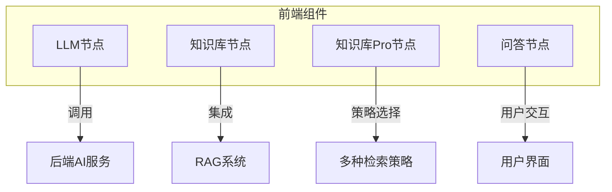
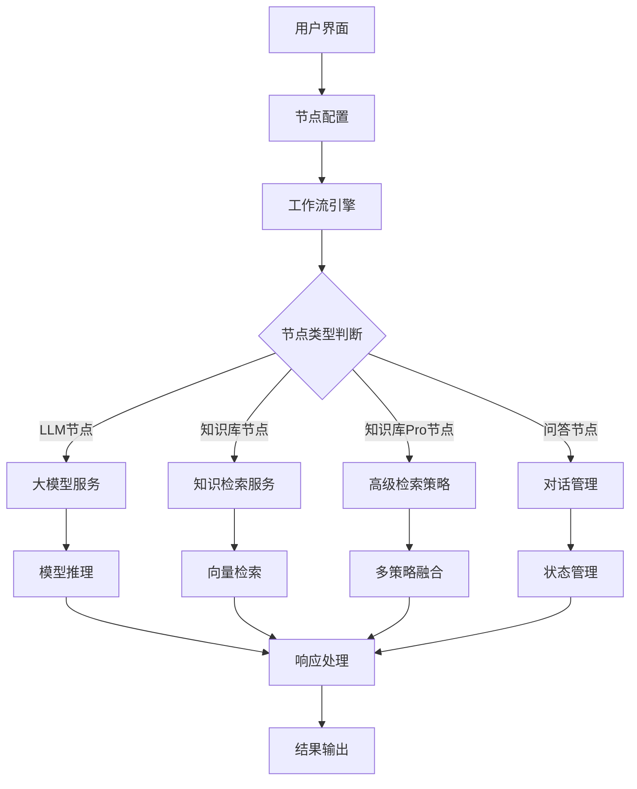
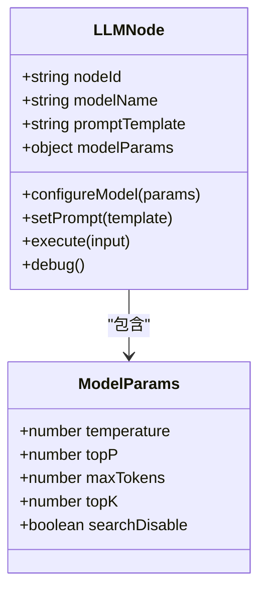
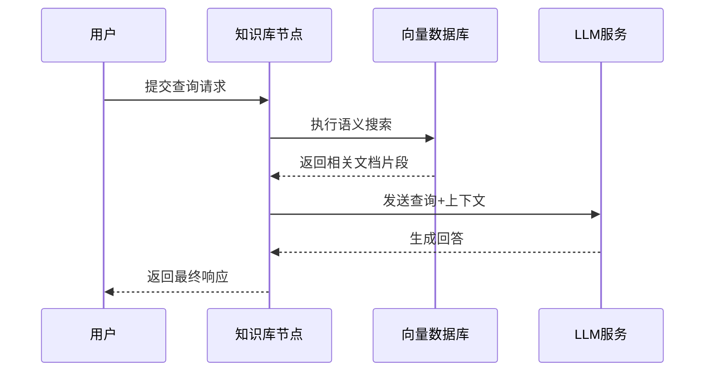
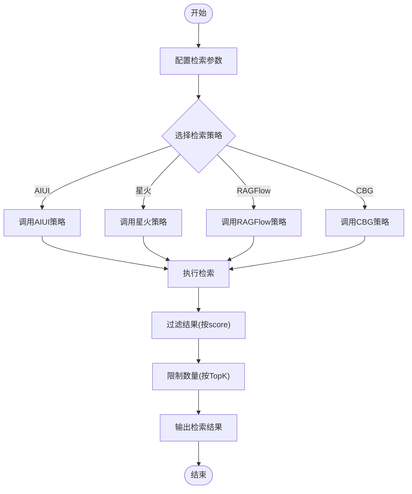
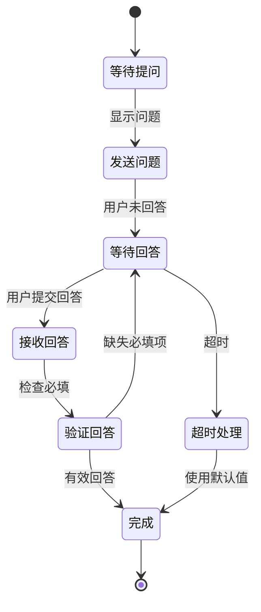
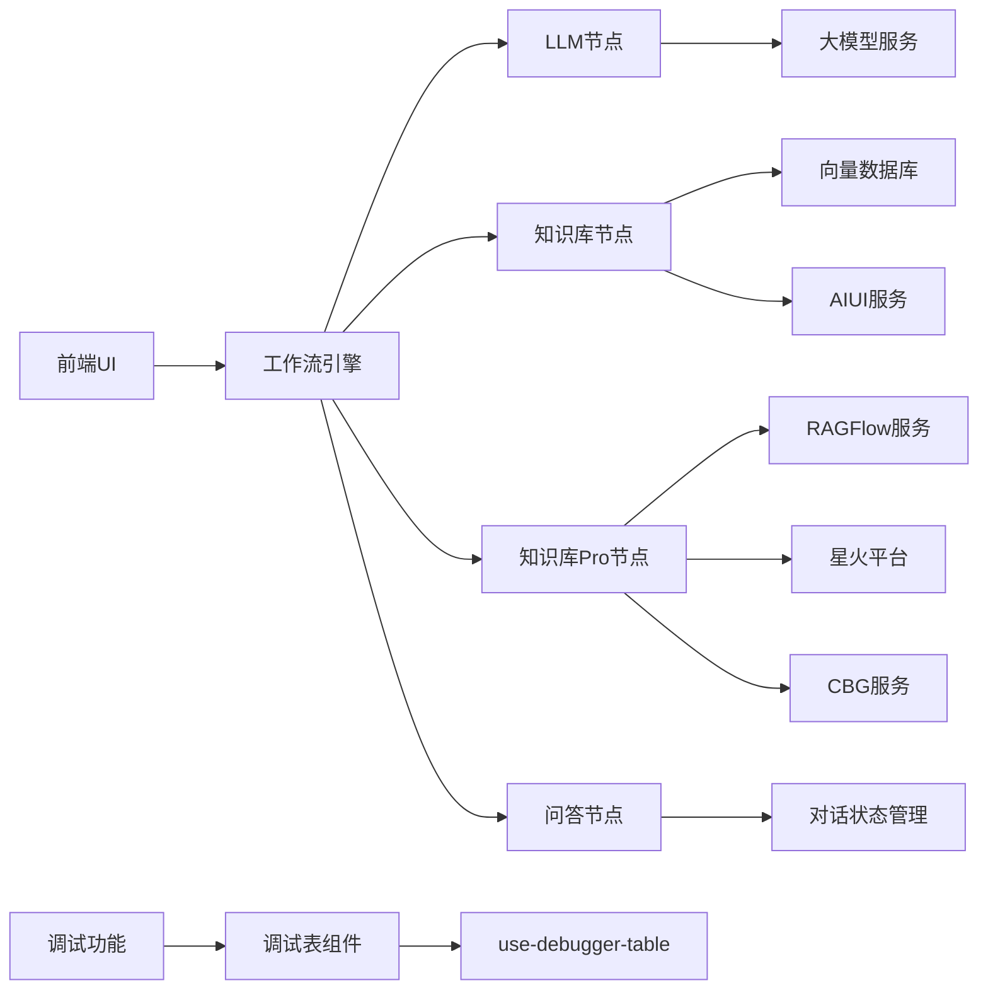

# AI节点

<cite>
**本文档中引用的文件**  
- [LargeModelNode/index.tsx](file://console/frontend/src/components/workflow/nodes/llm/index.tsx)
- [KnowledgeNode/index.tsx](file://console/frontend/src/components/workflow/nodes/knowledge/index.tsx)
- [KnowledgeProNode/index.tsx](file://console/frontend/src/components/workflow/nodes/knowledge-pro/index.tsx)
- [QuestionAnswerNode/index.tsx](file://console/frontend/src/components/workflow/nodes/question-answer/index.tsx)
- [model-params/index.tsx](file://console/frontend/src/components/workflow/nodes/components/model-params/index.tsx)
- [knowledge-pro-parameter.ts](file://console/frontend/src/components/workflow/types/modal/knowledge-pro-parameter.ts)
- [use-debugger-table.tsx](file://console/frontend/src/components/table/debugger-table/hooks/use-debugger-table.tsx)
</cite>

## 目录
1. [简介](#简介)
2. [项目结构](#项目结构)
3. [核心组件](#核心组件)
4. [架构概述](#架构概述)
5. [详细组件分析](#详细组件分析)
6. [依赖分析](#依赖分析)
7. [性能考虑](#性能考虑)
8. [故障排除指南](#故障排除指南)
9. [结论](#结论)

## 简介
本文档详细描述了AI节点系统中的LLM节点、知识库节点、知识库Pro节点和问答节点的实现机制。这些节点构成了智能工作流的核心，通过与后端AI服务集成，实现了复杂的自然语言处理和决策功能。文档将深入探讨各节点的输入输出参数、调试功能、性能优化策略以及配置方式。

## 项目结构
AI节点系统主要位于前端`console/frontend/src/components/workflow/nodes/`目录下，每个节点以独立的组件形式存在。系统采用模块化设计，将不同功能的节点分离，便于维护和扩展。

**图示来源**
- [console/frontend/src/components/workflow/nodes/](file://console/frontend/src/components/workflow/nodes/)

**本节来源**
- [console/frontend/src/components/workflow/nodes/](file://console/frontend/src/components/workflow/nodes/)

## 核心组件
系统包含四种核心AI节点：LLM节点用于大语言模型推理，知识库节点提供基础知识检索，知识库Pro节点支持高级检索策略，问答节点实现交互式对话流程。这些节点通过统一的工作流引擎协调，形成完整的AI应用解决方案。

**本节来源**
- [console/frontend/src/components/workflow/nodes/llm/index.tsx](file://console/frontend/src/components/workflow/nodes/llm/index.tsx)
- [console/frontend/src/components/workflow/nodes/knowledge/index.tsx](file://console/frontend/src/components/workflow/nodes/knowledge/index.tsx)
- [console/frontend/src/components/workflow/nodes/knowledge-pro/index.tsx](file://console/frontend/src/components/workflow/nodes/knowledge-pro/index.tsx)
- [console/frontend/src/components/workflow/nodes/question-answer/index.tsx](file://console/frontend/src/components/workflow/nodes/question-answer/index.tsx)

## 架构概述
AI节点系统采用分层架构设计，前端组件负责用户交互和配置，通过API与后端服务通信，后端集成多种AI能力提供实际的推理和检索功能。

**图示来源**
- [console/frontend/src/components/workflow/nodes/](file://console/frontend/src/components/workflow/nodes/)
- [core/workflow/](file://core/workflow/)

**本节来源**
- [console/frontend/src/components/workflow/nodes/](file://console/frontend/src/components/workflow/nodes/)

## 详细组件分析

### LLM节点分析
LLM节点（大模型节点）是系统的核心推理组件，负责调用大语言模型进行文本生成和理解。节点支持多种模型选择和参数配置，通过灵活的提示词工程实现不同的AI功能。

**图示来源**
- [console/frontend/src/components/workflow/nodes/llm/index.tsx](file://console/frontend/src/components/workflow/nodes/llm/index.tsx)
- [console/frontend/src/components/workflow/nodes/components/model-params/index.tsx](file://console/frontend/src/components/workflow/nodes/components/model-params/index.tsx)

**本节来源**
- [console/frontend/src/components/workflow/nodes/llm/index.tsx](file://console/frontend/src/components/workflow/nodes/llm/index.tsx)

### 知识库节点分析
知识库节点提供基础的知识检索功能，通过向量数据库实现语义搜索，将相关知识片段作为上下文提供给大模型，增强其回答的准确性和专业性。

**图示来源**
- [console/frontend/src/components/workflow/nodes/knowledge/index.tsx](file://console/frontend/src/components/workflow/nodes/knowledge/index.tsx)
- [core/knowledge/](file://core/knowledge/)

**本节来源**
- [console/frontend/src/components/workflow/nodes/knowledge/index.tsx](file://console/frontend/src/components/workflow/nodes/knowledge/index.tsx)

### 知识库Pro节点分析
知识库Pro节点在基础知识库节点之上提供了更高级的检索策略和参数控制，支持Top-K检索、相似度阈值设置等高级功能，满足复杂场景下的知识检索需求。

**图示来源**
- [console/frontend/src/components/workflow/nodes/knowledge-pro/index.tsx](file://console/frontend/src/components/workflow/nodes/knowledge-pro/index.tsx)
- [console/frontend/src/components/workflow/types/modal/knowledge-pro-parameter.ts](file://console/frontend/src/components/workflow/types/modal/knowledge-pro-parameter.ts)
- [core/knowledge/service/impl/](file://core/knowledge/service/impl/)

**本节来源**
- [console/frontend/src/components/workflow/nodes/knowledge-pro/index.tsx](file://console/frontend/src/components/workflow/nodes/knowledge-pro/index.tsx)

### 问答节点分析
问答节点实现交互式对话流程，支持固定选项、参数提取、超时处理等复杂对话模式，用于构建多轮对话和用户信息收集场景。

**图示来源**
- [console/frontend/src/components/workflow/nodes/question-answer/index.tsx](file://console/frontend/src/components/workflow/nodes/question-answer/index.tsx)
- [console/frontend/src/components/workflow/nodes/question-answer/components/](file://console/frontend/src/components/workflow/nodes/question-answer/components/)

**本节来源**
- [console/frontend/src/components/workflow/nodes/question-answer/index.tsx](file://console/frontend/src/components/workflow/nodes/question-answer/index.tsx)

## 依赖分析
AI节点系统依赖于多个前后端组件和服务，形成了复杂的依赖网络。

**图示来源**
- [console/frontend/src/components/workflow/nodes/](file://console/frontend/src/components/workflow/nodes/)
- [core/](file://core/)
- [console/frontend/src/components/table/debugger-table/hooks/use-debugger-table.tsx](file://console/frontend/src/components/table/debugger-table/hooks/use-debugger-table.tsx)

**本节来源**
- [console/frontend/src/components/workflow/nodes/](file://console/frontend/src/components/workflow/nodes/)
- [core/](file://core/)

## 性能考虑
系统在设计时考虑了多项性能优化策略，包括参数缓存、异步加载和资源预取等机制，确保在复杂工作流中的响应速度和稳定性。

**本节来源**
- [console/frontend/src/components/workflow/nodes/components/model-params/index.tsx](file://console/frontend/src/components/workflow/nodes/components/model-params/index.tsx)
- [console/frontend/src/components/table/debugger-table/hooks/use-debugger-table.tsx](file://console/frontend/src/components/table/debugger-table/hooks/use-debugger-table.tsx)

## 故障排除指南
当AI节点出现问题时，可通过以下步骤进行排查：检查节点配置参数、验证后端服务连接、查看调试日志、确认模型可用性。系统提供了调试功能，可模拟节点执行过程，帮助定位问题。

**本节来源**
- [console/frontend/src/components/workflow/nodes/components/node-debugger/index.tsx](file://console/frontend/src/components/workflow/nodes/components/node-debugger/index.tsx)
- [console/frontend/src/components/table/debugger-table/hooks/use-debugger-table.tsx](file://console/frontend/src/components/table/debugger-table/hooks/use-debugger-table.tsx)

## 结论
AI节点系统通过模块化设计和灵活的配置机制，提供了强大的AI能力集成方案。LLM节点、知识库节点、知识库Pro节点和问答节点各司其职，共同构建了完整的智能应用开发平台。系统支持丰富的调试功能和性能优化策略，为开发者提供了良好的使用体验。