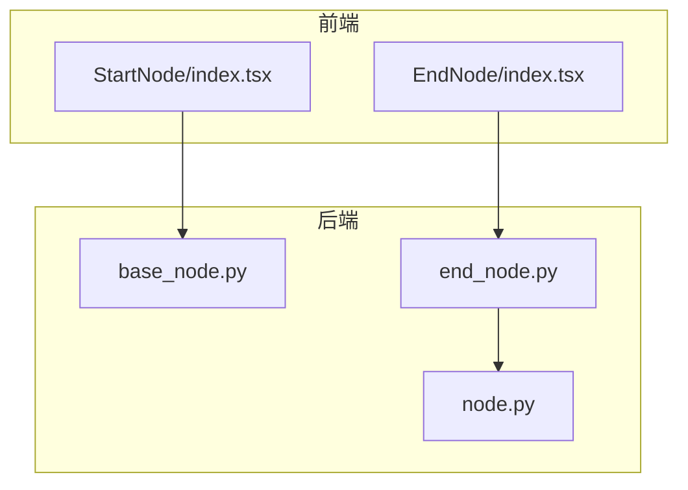
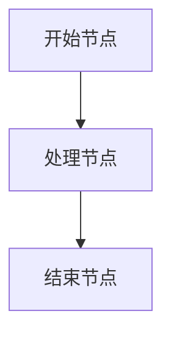
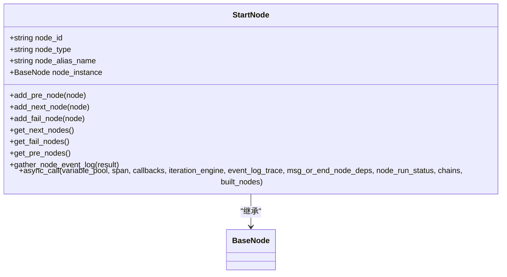
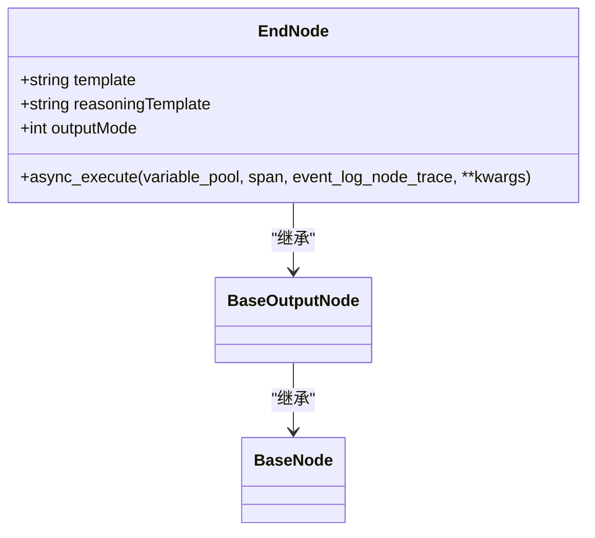
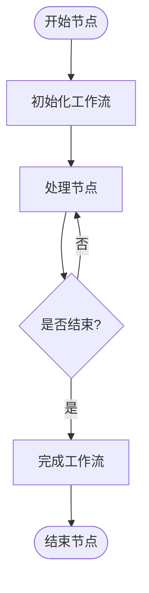
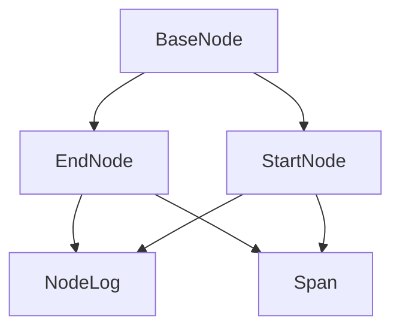

# 基础节点

<cite>
**本文档引用的文件**
- [base_node.py](file://core/workflow/engine/nodes/base_node.py)
- [end_node.py](file://core/workflow/engine/nodes/end/end_node.py)
- [node.py](file://core/workflow/engine/node.py)
- [StartNode/index.tsx](file://console/frontend/src/custom-nodes/StartNode/index.tsx)
- [EndNode/index.tsx](file://console/frontend/src/custom-nodes/EndNode/index.tsx)
</cite>

## 目录
1. [简介](#简介)
2. [项目结构](#项目结构)
3. [核心组件](#核心组件)
4. [架构概述](#架构概述)
5. [详细组件分析](#详细组件分析)
6. [依赖分析](#依赖分析)
7. [性能考虑](#性能考虑)
8. [故障排除指南](#故障排除指南)
9. [结论](#结论)
10. [附录](#附录)（如有必要）

## 简介
本文档详细描述了工作流中的开始节点和结束节点的实现。这些节点在流程控制中扮演着关键角色，开始节点作为工作流的入口点，结束节点作为工作流的出口点。文档将解释这些节点的作用、限制、UI设计、端口配置、连接规则、代码示例、节点验证规则和错误处理机制。

## 项目结构
项目结构分为前端和后端两部分。前端位于`console/frontend`目录，后端位于`core`目录。开始节点和结束节点的实现分布在前端和后端代码中。

**图示来源**
- [StartNode/index.tsx](file://console/frontend/src/custom-nodes/StartNode/index.tsx)
- [EndNode/index.tsx](file://console/frontend/src/custom-nodes/EndNode/index.tsx)
- [base_node.py](file://core/workflow/engine/nodes/base_node.py)
- [end_node.py](file://core/workflow/engine/nodes/end/end_node.py)
- [node.py](file://core/workflow/engine/node.py)

## 核心组件
核心组件包括开始节点和结束节点的实现。开始节点负责初始化工作流，结束节点负责完成工作流并返回结果。

**节来源**
- [base_node.py](file://core/workflow/engine/nodes/base_node.py)
- [end_node.py](file://core/workflow/engine/nodes/end/end_node.py)

## 架构概述
架构概述展示了开始节点和结束节点在工作流中的位置和作用。开始节点是工作流的入口，结束节点是工作流的出口。

**图示来源**
- [base_node.py](file://core/workflow/engine/nodes/base_node.py)
- [end_node.py](file://core/workflow/engine/nodes/end/end_node.py)

## 详细组件分析
详细分析开始节点和结束节点的实现细节。

### 开始节点分析
开始节点是工作流的入口点，负责初始化工作流并传递初始数据。

#### 类图

**图示来源**
- [node.py](file://core/workflow/engine/node.py)

### 结束节点分析
结束节点是工作流的出口点，负责完成工作流并返回最终结果。

#### 类图

**图示来源**
- [end_node.py](file://core/workflow/engine/nodes/end/end_node.py)
- [base_node.py](file://core/workflow/engine/nodes/base_node.py)

### 流程图

**图示来源**
- [end_node.py](file://core/workflow/engine/nodes/end/end_node.py)

## 依赖分析
分析开始节点和结束节点的依赖关系。

**图示来源**
- [base_node.py](file://core/workflow/engine/nodes/base_node.py)
- [end_node.py](file://core/workflow/engine/nodes/end/end_node.py)
- [node.py](file://core/workflow/engine/node.py)

**节来源**
- [base_node.py](file://core/workflow/engine/nodes/base_node.py)
- [end_node.py](file://core/workflow/engine/nodes/end/end_node.py)
- [node.py](file://core/workflow/engine/node.py)

## 性能考虑
开始节点和结束节点的性能主要取决于工作流的复杂性和数据处理量。优化建议包括减少不必要的数据传输和提高数据处理效率。

## 故障排除指南
常见问题包括节点连接错误、数据传输失败和工作流执行中断。解决方法包括检查节点配置、验证数据格式和调试工作流执行。

**节来源**
- [base_node.py](file://core/workflow/engine/nodes/base_node.py)
- [end_node.py](file://core/workflow/engine/nodes/end/end_node.py)

## 结论
开始节点和结束节点是工作流的核心组件，负责工作流的启动和结束。通过合理设计和实现，可以确保工作流的稳定性和高效性。