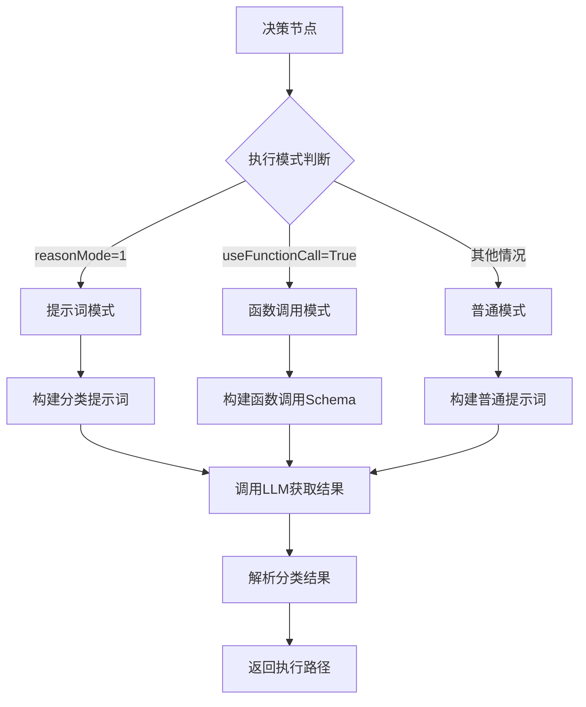
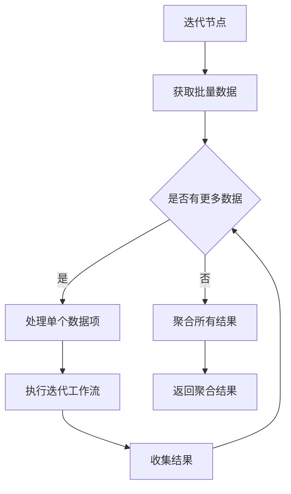
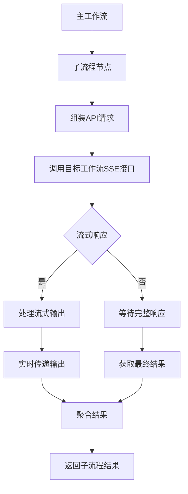
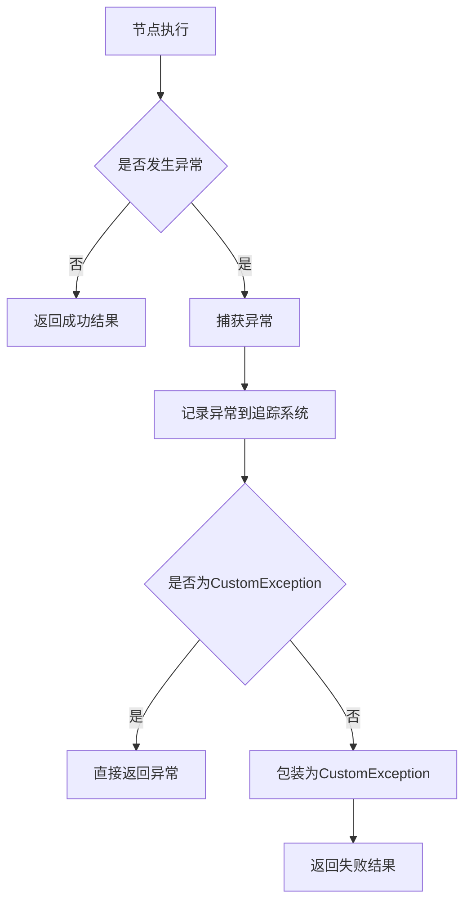

# 控制节点

<cite>
**本文档引用的文件**   
- [decision_node.py](file://core/workflow/engine/nodes/decision/decision_node.py)
- [if_else_node.py](file://core/workflow/engine/nodes/if_else/if_else_node.py)
- [iteration_node.py](file://core/workflow/engine/nodes/iteration/iteration_node.py)
- [flow_node.py](file://core/workflow/engine/nodes/flow/flow_node.py)
- [base_node.py](file://core/workflow/engine/nodes/base_node.py)
- [index.tsx](file://console/frontend/src/components/workflow/nodes/if-else/index.tsx)
- [iterator/index.tsx](file://console/frontend/src/components/workflow/nodes/iterator/index.tsx)
</cite>

## 目录
1. [引言](#引言)
2. [条件分支节点](#条件分支节点)
3. [决策节点](#决策节点)
4. [迭代节点](#迭代节点)
5. [子流程节点](#子流程节点)
6. [控制节点状态管理](#控制节点状态管理)
7. [总结](#总结)

## 引言

控制节点是工作流引擎中的核心组件，负责控制工作流的执行路径。这些节点通过条件判断、循环执行和流程嵌套等机制，实现复杂业务逻辑的编排。本文档详细描述了四种主要的控制节点：条件分支节点、决策节点、迭代节点和子流程节点，解释它们如何控制工作流的执行路径，并说明节点的条件表达式编辑器、循环配置和流程嵌套功能。

## 条件分支节点

条件分支节点（If-Else Node）是工作流中的基础控制结构，用于根据条件判断执行不同的分支路径。该节点支持多层级的条件判断，每个分支包含多个条件，并通过逻辑运算符（AND/OR）组合这些条件。

### 条件表达式编辑器

条件分支节点提供了可视化的条件表达式编辑器，允许用户配置复杂的条件逻辑。前端组件 `IfElseDetail` 实现了这一功能，支持以下特性：

- **多条件配置**：每个分支可以配置多个条件，通过"添加条件"按钮增加新的条件行
- **逻辑运算符**：支持AND和OR两种逻辑运算符，用户可以通过下拉菜单切换
- **优先级管理**：分支按照优先级顺序执行，优先级高的分支先执行
- **变量引用**：支持从其他节点引用变量作为比较的左值和右值

条件表达式的配置通过 `cases` 字段在后端存储，每个分支包含：
- `id`：分支唯一标识符
- `level`：分支优先级
- `logicalOperator`：逻辑运算符（and/or）
- `conditions`：条件列表，每个条件包含左右变量索引和比较操作符

**节点来源**
- [if_else_node.py](file://core/workflow/engine/nodes/if_else/if_else_node.py#L1-L700)
- [index.tsx](file://console/frontend/src/components/workflow/nodes/if-else/index.tsx#L1-L898)

## 决策节点

决策节点（Decision Node）是基于大语言模型的智能路由节点，通过自然语言理解对用户输入进行分类，并根据分类结果决定工作流的执行路径。

### 执行模式

决策节点支持三种执行模式，通过 `reasonMode` 和 `useFunctionCall` 参数控制：

1. **函数调用模式**（Function Call Mode）：使用大模型的函数调用能力进行意图分类
2. **提示词模式**（Prompt-based Mode）：通过结构化提示词引导模型输出JSON格式的分类结果
3. **普通模式**（Normal Mode）：直接使用提示词模板进行分类

**决策节点来源**
- [decision_node.py](file://core/workflow/engine/nodes/decision/decision_node.py#L1-L647)

### 条件表达式编辑器

决策节点的条件表达式编辑器主要通过 `intentChains` 配置意图链，每个意图链包含：

- `id`：意图链ID，格式为"intent-one-of::[UUID]"
- `name`：意图名称
- `description`：意图描述
- `intent_type`：意图类型（1表示默认意图，2表示普通意图）

前端通过 `promptPrefix` 字段允许用户自定义提示词前缀，可以引用工作流中的变量来动态生成提示词内容。

## 迭代节点

迭代节点（Iteration Node）用于处理批量数据，对输入的数组或列表中的每个元素执行相同的工作流逻辑，并将结果聚合返回。

### 循环配置

迭代节点的核心配置包括：

- `IterationStartNodeId`：迭代工作流子图的起始节点ID
- 支持对数组、列表等可迭代数据类型进行处理
- 每次迭代在独立的变量池中执行，确保数据隔离

### 执行流程

迭代节点的执行流程如下：

1. 从变量池中获取批量数据
2. 对每个数据项：
   - 创建临时变量池
   - 执行完整的迭代工作流
   - 收集执行结果
3. 将所有迭代结果聚合
4. 返回聚合后的结果

每次迭代都重置节点运行状态，确保迭代之间的独立性。通过 `_init_iteration_node` 方法重置所有节点的运行状态标志和消息流数据。

**迭代节点来源**
- [iteration_node.py](file://core/workflow/engine/nodes/iteration/iteration_node.py#L1-L373)
- [iterator/index.tsx](file://console/frontend/src/components/workflow/nodes/iterator/index.tsx#L1-L38)

## 子流程节点

子流程节点（Flow Node）实现了工作流的嵌套调用功能，允许一个工作流调用另一个工作流作为子流程执行。

### 流程嵌套功能

子流程节点的主要配置参数包括：

- `flowId`：目标工作流ID
- `appId`：应用ID，用于身份验证
- `uid`：用户ID
- `version`：可选的工作流版本
- `enableChatHistoryV2`：聊天历史配置

### 执行机制

子流程节点通过SSE（Server-Sent Events）协议调用目标工作流的API接口，支持流式响应处理。执行过程包括：

1. 组装API请求头和请求体
2. 通过HTTP POST请求调用目标工作流
3. 处理流式响应数据
4. 根据输出模式处理响应结果

输出模式支持三种类型：
- `VARIABLE_MODE`：解析JSON内容作为结构化变量
- `OLD_PROMPT_MODE`：返回内容作为单一输出
- `PROMPT_MODE`：同时返回内容和推理内容

**子流程节点来源**
- [flow_node.py](file://core/workflow/engine/nodes/flow/flow_node.py#L1-L462)

## 控制节点状态管理

控制节点的状态管理是确保工作流正确执行的关键。系统通过多种机制来管理节点状态：

### 节点运行状态

`NodeRunningStatus` 类定义了节点的运行状态，包括：
- `processing`：处理中标志
- `complete`：完成标志
- `start_with_thread`：线程启动标志
- `pre_processing`：预处理标志
- `not_run`：不执行标志

这些状态标志使用 `asyncio.Event` 实现，支持异步等待和通知。

### 变量池管理

`VariablePool` 类管理工作流执行过程中的所有变量，包括：
- 输入输出变量
- 历史记录
- 系统参数
- 流式数据队列

对于迭代节点，每次迭代都会创建变量池的深拷贝，确保迭代之间的数据隔离。

### 异常处理

所有控制节点都实现了统一的异常处理机制：
- 使用 `CustomException` 包装业务异常
- 通过 `span.record_exception()` 记录异常到追踪系统
- 在失败时返回包含错误信息的 `NodeRunResult`

**状态管理来源**
- [base_node.py](file://core/workflow/engine/nodes/base_node.py#L1-L799)

## 总结

控制节点是工作流系统的核心，通过条件分支、智能决策、循环迭代和流程嵌套等机制，实现了复杂业务逻辑的灵活编排。这些节点的设计体现了以下特点：

1. **模块化设计**：每个控制节点都是独立的模块，遵循统一的接口规范
2. **可扩展性**：通过配置而非硬编码实现功能扩展
3. **状态隔离**：确保并发执行和迭代执行的数据安全性
4. **可观测性**：集成追踪系统，便于调试和监控

这些控制节点共同构成了强大的工作流编排能力，支持从简单条件判断到复杂智能决策的各种应用场景。