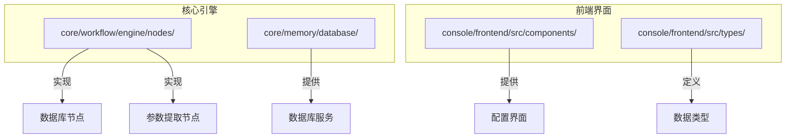
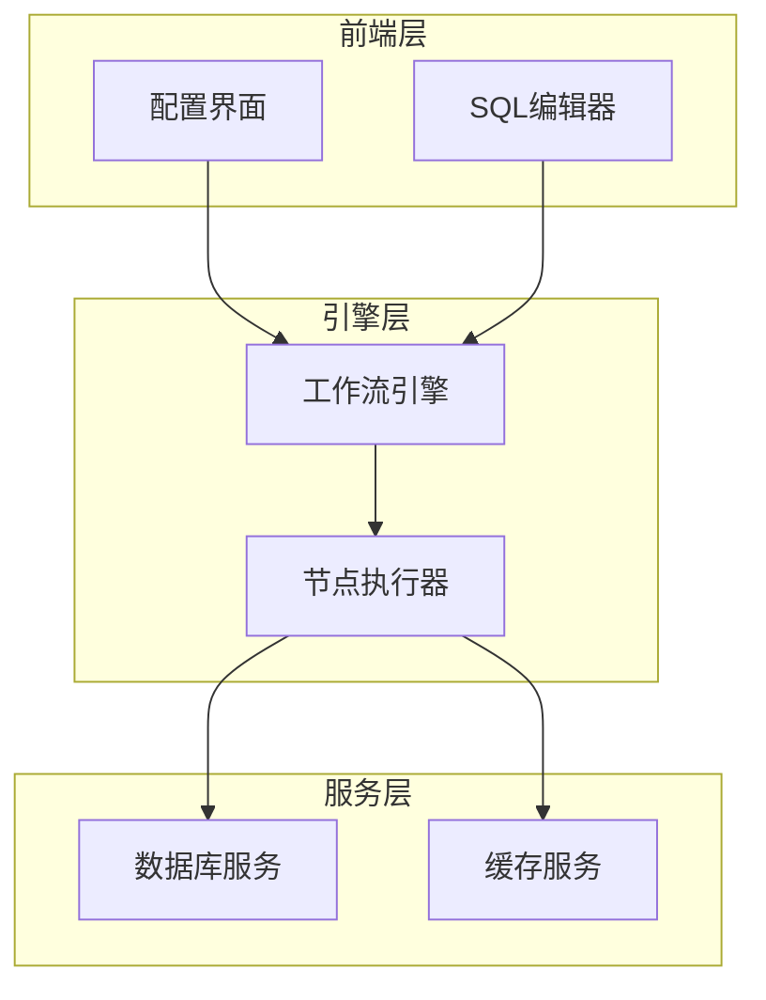
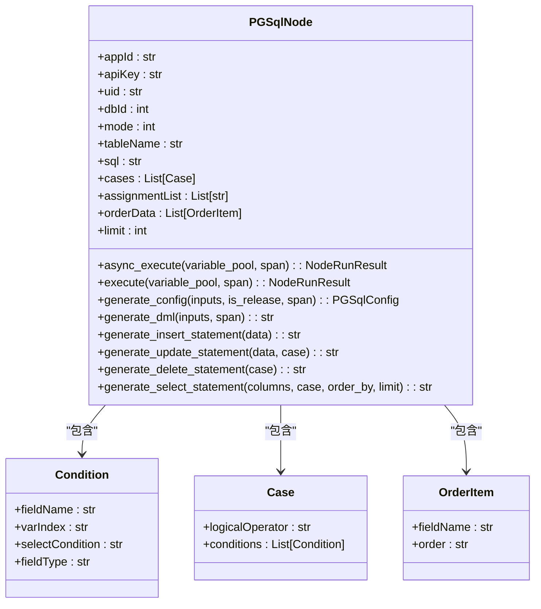
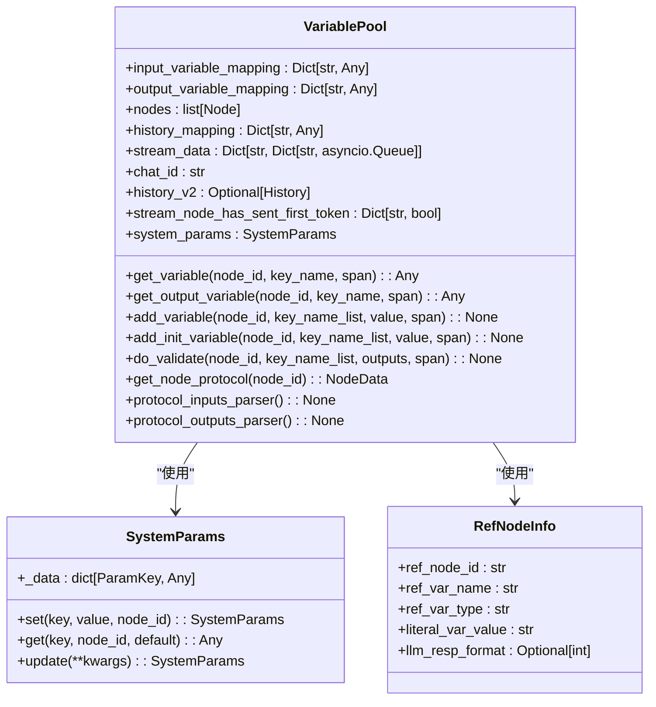
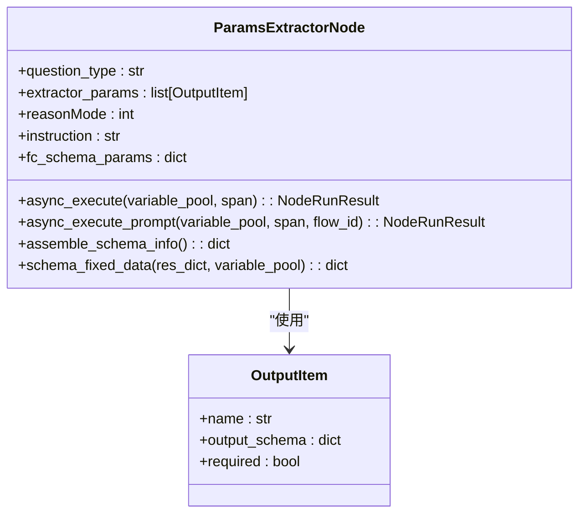
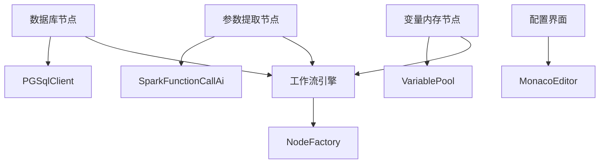

# 数据节点

<cite>
**本文档引用的文件**   
- [base_node.py](file://core/workflow/engine/nodes/base_node.py)
- [pgsql_node.py](file://core/workflow/engine/nodes/pgsql/pgsql_node.py)
- [pe_node.py](file://core/workflow/engine/nodes/params_extractor/pe_node.py)
- [variable_pool.py](file://core/workflow/engine/entities/variable_pool.py)
- [cache_node.py](file://core/workflow/engine/nodes/cache_node.py)
- [main.py](file://core/memory/database/main.py)
</cite>

## 目录
1. [引言](#引言)
2. [项目结构](#项目结构)
3. [核心组件](#核心组件)
4. [架构概述](#架构概述)
5. [详细组件分析](#详细组件分析)
6. [依赖分析](#依赖分析)
7. [性能考虑](#性能考虑)
8. [故障排除指南](#故障排除指南)
9. [结论](#结论)

## 引言
本文档详细描述了astron-agent项目中数据节点的实现，重点关注数据库节点、变量内存节点和参数提取节点。这些节点是工作流引擎的核心组成部分，负责处理数据存储、查询和转换操作。文档将解释这些节点如何通过配置界面、SQL编辑器和数据映射功能来实现数据绑定和状态同步机制。

## 项目结构
项目结构显示了数据节点相关的组件分布在不同的目录中。核心的节点实现在`core/workflow/engine/nodes/`目录下，而数据库相关的服务在`core/memory/database/`目录中。前端界面组件位于`console/frontend/src/components/`目录下，提供了用户交互的配置界面。

**Diagram sources**
- [pgsql_node.py](file://core/workflow/engine/nodes/pgsql/pgsql_node.py)
- [pe_node.py](file://core/workflow/engine/nodes/params_extractor/pe_node.py)

**Section sources**
- [pgsql_node.py](file://core/workflow/engine/nodes/pgsql/pgsql_node.py)
- [pe_node.py](file://core/workflow/engine/nodes/params_extractor/pe_node.py)

## 核心组件
数据节点系统由三个主要组件构成：数据库节点用于处理数据存储和查询，变量内存节点管理运行时状态，参数提取节点负责从输入中解析结构化数据。这些组件通过工作流引擎协调工作，实现了复杂的数据处理逻辑。

**Section sources**
- [base_node.py](file://core/workflow/engine/nodes/base_node.py)
- [variable_pool.py](file://core/workflow/engine/entities/variable_pool.py)

## 架构概述
数据节点架构采用分层设计，底层是数据库服务，中间是节点执行引擎，上层是前端配置界面。这种架构实现了关注点分离，使得数据处理逻辑与用户界面解耦，提高了系统的可维护性和可扩展性。

**Diagram sources**
- [main.py](file://core/memory/database/main.py)
- [base_node.py](file://core/workflow/engine/nodes/base_node.py)

## 详细组件分析

### 数据库节点分析
数据库节点实现了对PostgreSQL数据库的CRUD操作，支持自定义SQL执行和参数化查询。节点通过配置参数来确定操作类型，并生成相应的SQL语句。

#### 对于数据库组件：

**Diagram sources**
- [pgsql_node.py](file://core/workflow/engine/nodes/pgsql/pgsql_node.py)

### 变量内存节点分析
变量内存节点通过VariablePool类管理所有工作流中的变量状态。它负责变量的存储、检索和验证，确保数据在不同节点间的正确传递。

#### 对于状态管理组件：

**Diagram sources**
- [variable_pool.py](file://core/workflow/engine/entities/variable_pool.py)

### 参数提取节点分析
参数提取节点利用大语言模型从自然语言输入中提取结构化参数，支持函数调用和提示工程两种模式。

#### 对于参数提取组件：

**Diagram sources**
- [pe_node.py](file://core/workflow/engine/nodes/params_extractor/pe_node.py)

## 依赖分析
数据节点系统依赖于多个核心模块，包括工作流引擎、数据库服务和变量池。这些依赖关系通过依赖注入的方式管理，确保了组件间的松耦合。

**Diagram sources**
- [cache_node.py](file://core/workflow/engine/nodes/cache_node.py)

**Section sources**
- [cache_node.py](file://core/workflow/engine/nodes/cache_node.py)

## 性能考虑
数据节点在设计时考虑了性能优化，包括SQL语句的预编译、变量访问的缓存机制以及异步I/O操作。这些优化确保了在高并发场景下的响应性能。

## 故障排除指南
当数据节点出现问题时，应首先检查配置参数的正确性，然后验证数据库连接状态，最后查看日志中的错误信息。常见的问题包括SQL语法错误、参数类型不匹配和权限不足。

**Section sources**
- [pgsql_node.py](file://core/workflow/engine/nodes/pgsql/pgsql_node.py)
- [pe_node.py](file://core/workflow/engine/nodes/params_extractor/pe_node.py)

## 结论
数据节点系统通过模块化设计实现了灵活的数据处理能力。数据库节点、变量内存节点和参数提取节点各司其职，共同构成了强大的工作流数据处理基础。未来可以进一步优化查询性能和扩展更多的数据源支持。