# 节点系统

<cite>
**本文档引用的文件**
- [StartNode](file://console/frontend/src/custom-nodes/StartNode/index.tsx)
- [EndNode](file://console/frontend/src/custom-nodes/EndNode/index.tsx)
- [LargeModelNode](file://console/frontend/src/custom-nodes/LargeModelNode/index.tsx)
- [AgentNode](file://console/frontend/src/custom-nodes/AgentNode/index.tsx)
- [ToolNode](file://console/frontend/src/custom-nodes/ToolNode/index.tsx)
- [KnowledgeNode](file://console/frontend/src/custom-nodes/KnowledgeNode/index.tsx)
- [KnowledgeProNode](file://console/frontend/src/custom-nodes/KnowledgeProNode/index.tsx)
- [TextJoinerNode](file://console/frontend/src/custom-nodes/TextJoinerNode/index.tsx)
- [MessageNode](file://console/frontend/src/custom-nodes/MessageNode/index.tsx)
- [QuestionAnswerNode](file://console/frontend/src/custom-nodes/QuestionAnswerNode/index.tsx)
- [DecisionMakingNode](file://console/frontend/src/custom-nodes/DecisionMakingNode/index.tsx)
- [IfElseNode](file://console/frontend/src/custom-nodes/IfElseNode/index.tsx)
- [IteratorNode](file://console/frontend/src/custom-nodes/IteratorNode/index.tsx)
- [flow/index.tsx](file://console/frontend/src/components/workflow/nodes/flow/index.tsx)
- [plugin/index.tsx](file://console/frontend/src/components/workflow/nodes/plugin/index.tsx)
- [fixed-inputs/index.tsx](file://console/frontend/src/components/workflow/nodes/components/fixed-inputs/index.tsx)
- [fixed-outputs/index.tsx](file://console/frontend/src/components/workflow/nodes/components/fixed-outputs/index.tsx)
- [exception-handling/index.tsx](file://console/frontend/src/components/workflow/nodes/components/exception-handling/index.tsx)
- [use-node-common.tsx](file://console/frontend/src/components/workflow/hooks/use-node-common.tsx)
- [reactflowUtils.ts](file://console/frontend/src/components/workflow/utils/reactflowUtils.ts)
- [flow-node-input.tsx](file://console/frontend/src/components/workflow/ui/flow-node-input.tsx)
- [flow-template-editor.tsx](file://console/frontend/src/components/workflow/ui/flow-template-editor.tsx)
</cite>

## 目录
1. [简介](#简介)
2. [核心节点类型](#核心节点类型)
3. [通用组件体系](#通用组件体系)
4. [状态管理与数据流](#状态管理与数据流)
5. [节点配置与参数绑定](#节点配置与参数绑定)
6. [异常处理机制](#异常处理机制)
7. [节点验证与错误状态](#节点验证与错误状态)
8. [扩展新节点类型](#扩展新节点类型)
9. [用户操作反馈](#用户操作反馈)
10. [结论](#结论)

## 简介

本工作流节点系统基于React Flow构建，提供了一套完整的可视化工作流设计解决方案。系统实现了多种自定义节点类型，包括开始、结束、大模型、知识库、工具、问答等多种功能节点，支持复杂的业务流程编排。节点系统采用模块化设计，通过通用组件体系实现了输入/输出端口、调试功能、异常处理等核心功能的复用，确保了代码的可维护性和扩展性。

**节点类型**
- **开始节点**: 工作流的入口点，定义输入参数
- **结束节点**: 工作流的出口点，配置返回模式和内容
- **大模型节点**: 集成大语言模型，支持提示词配置和输出格式设置
- **知识库节点**: 连接知识库，实现基于知识的问答功能
- **工具节点**: 集成外部工具，支持API调用和数据处理
- **问答节点**: 实现交互式问答，支持固定选项和参数抽取
- **决策节点**: 基于意图识别进行流程分支决策
- **分支器节点**: 实现条件判断和流程分支
- **迭代节点**: 支持循环处理和批量操作

## 核心节点类型

### 开始节点分析

开始节点作为工作流的入口，主要负责定义工作流的输入参数。该节点通过`StartDetail`组件实现，支持配置多个输出参数，每个参数包含名称、类型和描述等属性。节点的UI设计简洁明了，突出显示输入参数配置区域。

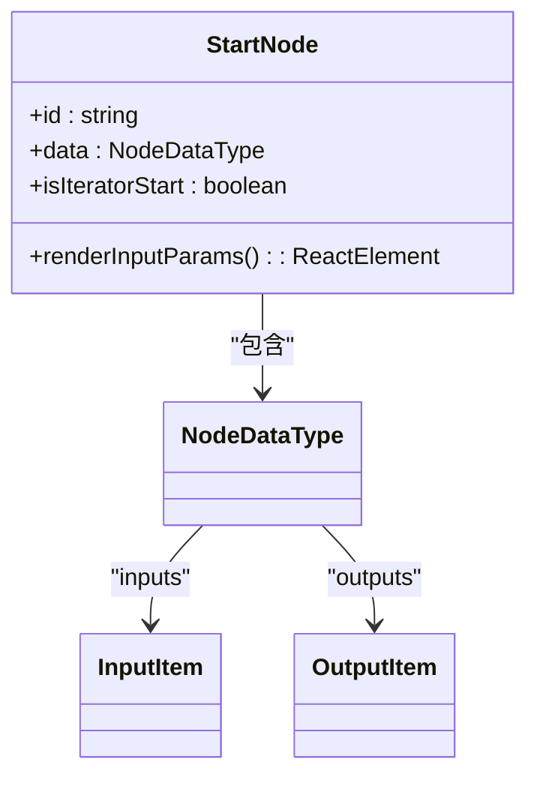
```mermaid
classDiagram
class StartNode {
+id : string
+data : NodeDataType
+isIteratorStart : boolean
+renderInputParams() : ReactElement
}
StartNode --> NodeDataType : "包含"
NodeDataType --> InputItem : "inputs"
NodeDataType --> OutputItem : "outputs"
```

**节点源码**
- [StartNode](file://console/frontend/src/custom-nodes/StartNode/index.tsx)

### 结束节点分析

结束节点作为工作流的出口，提供了灵活的返回模式配置。节点支持两种返回模式：返回参数和返回格式。在返回格式模式下，用户可以配置思考内容和回答内容模板，支持流式输出开关。

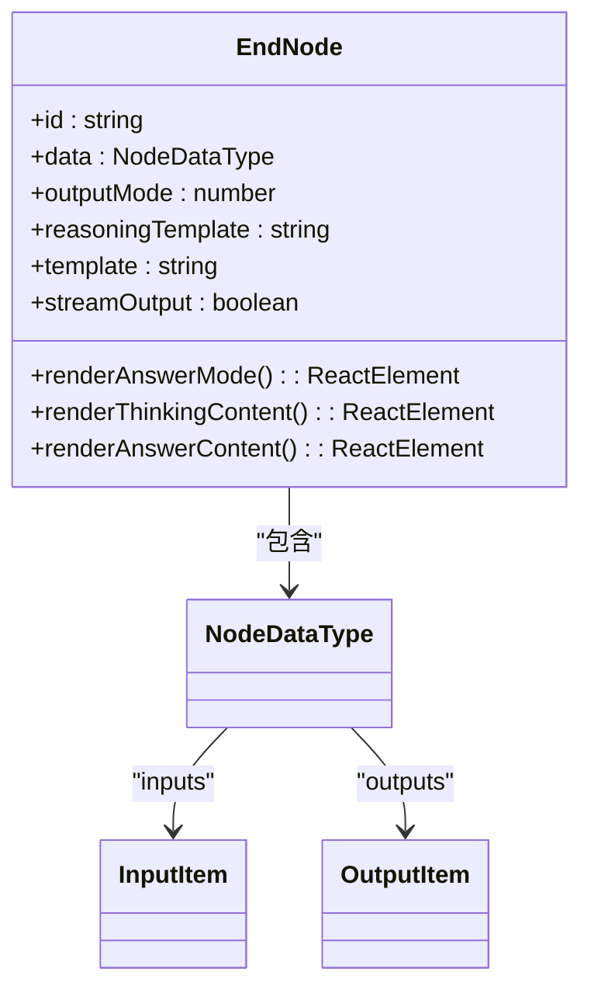
```mermaid
classDiagram
class EndNode {
+id : string
+data : NodeDataType
+outputMode : number
+reasoningTemplate : string
+template : string
+streamOutput : boolean
+renderAnswerMode() : ReactElement
+renderThinkingContent() : ReactElement
+renderAnswerContent() : ReactElement
}
EndNode --> NodeDataType : "包含"
NodeDataType --> InputItem : "inputs"
NodeDataType --> OutputItem : "outputs"
```

**节点源码**
- [EndNode](file://console/frontend/src/custom-nodes/EndNode/index.tsx)

### 大模型节点分析

大模型节点是系统的核心组件之一，用于集成大语言模型能力。节点支持系统提示词和用户提示词的独立配置，提供提示词优化和提示词库功能。输出部分支持文本和JSON两种格式，根据选择自动调整输出参数结构。

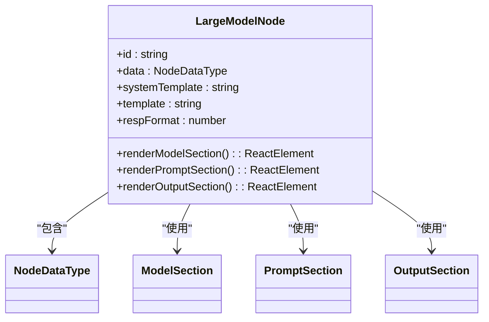
```mermaid
classDiagram
class LargeModelNode {
+id : string
+data : NodeDataType
+systemTemplate : string
+template : string
+respFormat : number
+renderModelSection() : ReactElement
+renderPromptSection() : ReactElement
+renderOutputSection() : ReactElement
}
LargeModelNode --> NodeDataType : "包含"
LargeModelNode --> ModelSection : "使用"
LargeModelNode --> PromptSection : "使用"
LargeModelNode --> OutputSection : "使用"
```

**节点源码**
- [LargeModelNode](file://console/frontend/src/custom-nodes/LargeModelNode/index.tsx)

### 知识库节点分析

知识库节点用于连接外部知识库，实现基于知识的问答功能。节点支持多知识库配置，提供知识库列表展示和参数设置功能。用户可以添加、删除和查看知识库，配置检索参数如Top K值等。

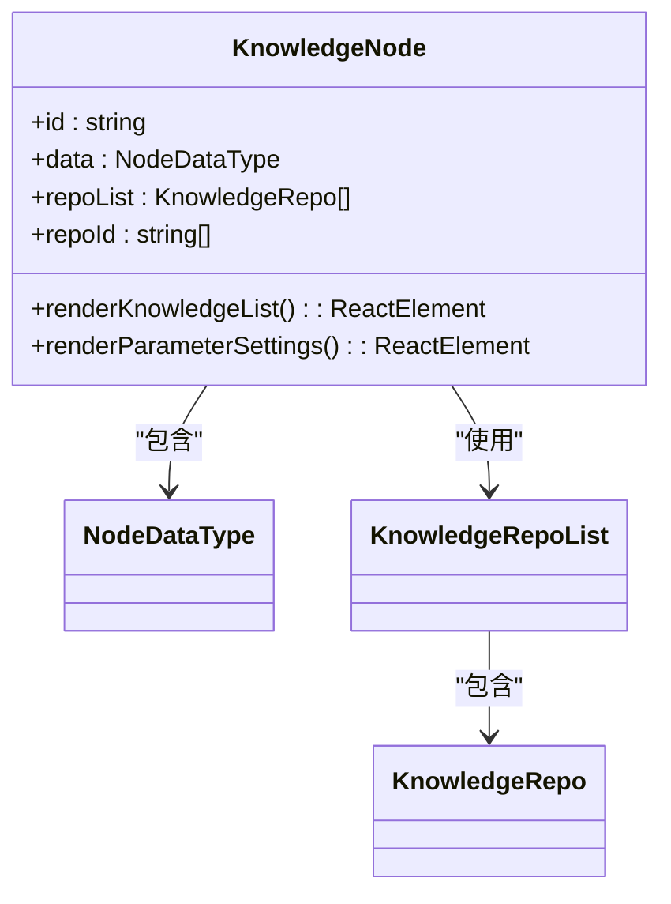
```mermaid
classDiagram
class KnowledgeNode {
+id : string
+data : NodeDataType
+repoList : KnowledgeRepo[]
+repoId : string[]
+renderKnowledgeList() : ReactElement
+renderParameterSettings() : ReactElement
}
KnowledgeNode --> NodeDataType : "包含"
KnowledgeNode --> KnowledgeRepoList : "使用"
KnowledgeRepoList --> KnowledgeRepo : "包含"
```

**节点源码**
- [KnowledgeNode](file://console/frontend/src/custom-nodes/KnowledgeNode/index.tsx)

### 工具节点分析

工具节点用于集成外部工具和服务，支持API调用和数据处理。节点采用固定输入输出模式，简化了配置流程。节点支持异常处理配置，可以设置重试策略和错误处理方式。

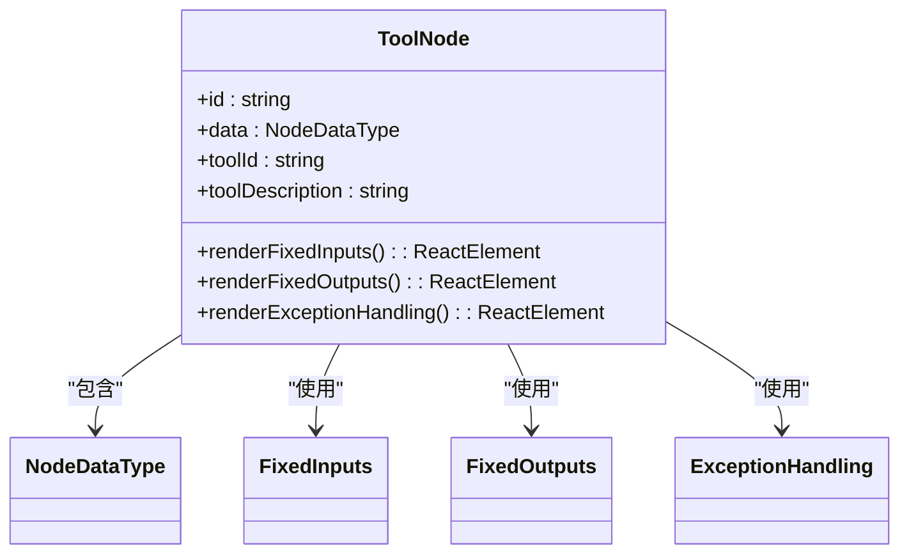
```mermaid
classDiagram
class ToolNode {
+id : string
+data : NodeDataType
+toolId : string
+toolDescription : string
+renderFixedInputs() : ReactElement
+renderFixedOutputs() : ReactElement
+renderExceptionHandling() : ReactElement
}
ToolNode --> NodeDataType : "包含"
ToolNode --> FixedInputs : "使用"
ToolNode --> FixedOutputs : "使用"
ToolNode --> ExceptionHandling : "使用"
```

**节点源码**
- [ToolNode](file://console/frontend/src/custom-nodes/ToolNode/index.tsx)

## 通用组件体系

### 输入输出端口

系统采用统一的输入输出端口设计，通过`fixed-inputs`和`fixed-outputs`组件实现。输入端口支持多种数据类型，包括字符串、数字、布尔值、数组和对象等，每种类型都有相应的值输入组件。

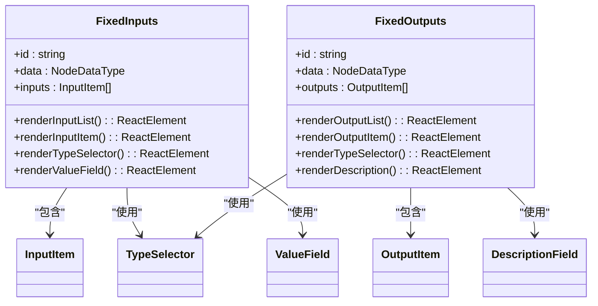
```mermaid
classDiagram
class FixedInputs {
+id : string
+data : NodeDataType
+inputs : InputItem[]
+renderInputList() : ReactElement
+renderInputItem() : ReactElement
+renderTypeSelector() : ReactElement
+renderValueField() : ReactElement
}
class FixedOutputs {
+id : string
+data : NodeDataType
+outputs : OutputItem[]
+renderOutputList() : ReactElement
+renderOutputItem() : ReactElement
+renderTypeSelector() : ReactElement
+renderDescription() : ReactElement
}
FixedInputs --> InputItem : "包含"
FixedOutputs --> OutputItem : "包含"
FixedInputs --> TypeSelector : "使用"
FixedInputs --> ValueField : "使用"
FixedOutputs --> TypeSelector : "使用"
FixedOutputs --> DescriptionField : "使用"
```

**组件源码**
- [fixed-inputs/index.tsx](file://console/frontend/src/components/workflow/nodes/components/fixed-inputs/index.tsx)
- [fixed-outputs/index.tsx](file://console/frontend/src/components/workflow/nodes/components/fixed-outputs/index.tsx)

### 调试功能

系统提供了完善的调试功能，支持单节点调试和全流程调试。调试功能通过`node-debugger`组件实现，允许用户输入测试数据并查看执行结果。调试结果以对话形式展示，便于理解节点的执行过程。

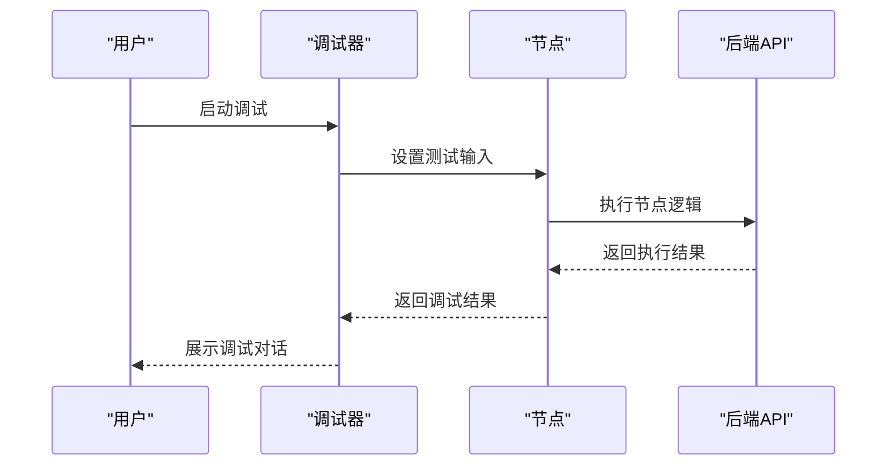
```mermaid
sequenceDiagram
participant User as "用户"
participant Debugger as "调试器"
participant Node as "节点"
participant API as "后端API"
User->>Debugger : 启动调试
Debugger->>Node : 设置测试输入
Node->>API : 执行节点逻辑
API-->>Node : 返回执行结果
Node-->>Debugger : 返回调试结果
Debugger-->>User : 展示调试对话
```

### 异常处理

异常处理是系统的重要组成部分，通过`exception-handling`组件实现。每个节点都支持配置异常处理策略，包括是否重试、重试次数、超时时间等。系统支持三种异常处理方式：中断流程、返回设定内容和执行异常流程。

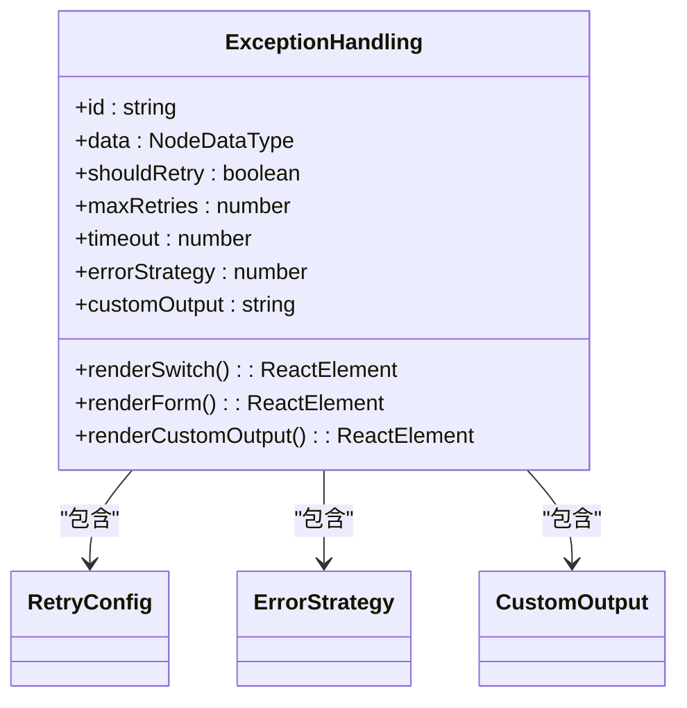
```mermaid
classDiagram
class ExceptionHandling {
+id : string
+data : NodeDataType
+shouldRetry : boolean
+maxRetries : number
+timeout : number
+errorStrategy : number
+customOutput : string
+renderSwitch() : ReactElement
+renderForm() : ReactElement
+renderCustomOutput() : ReactElement
}
ExceptionHandling --> RetryConfig : "包含"
ExceptionHandling --> ErrorStrategy : "包含"
ExceptionHandling --> CustomOutput : "包含"
```

**组件源码**
- [exception-handling/index.tsx](file://console/frontend/src/components/workflow/nodes/components/exception-handling/index.tsx)

## 状态管理与数据流

### Zustand状态管理

系统采用Zustand作为状态管理方案，通过`useFlowStore`和`useFlowsManager`等store实现全局状态管理。状态管理器负责维护节点、边、视图等核心数据，并提供相应的操作方法。

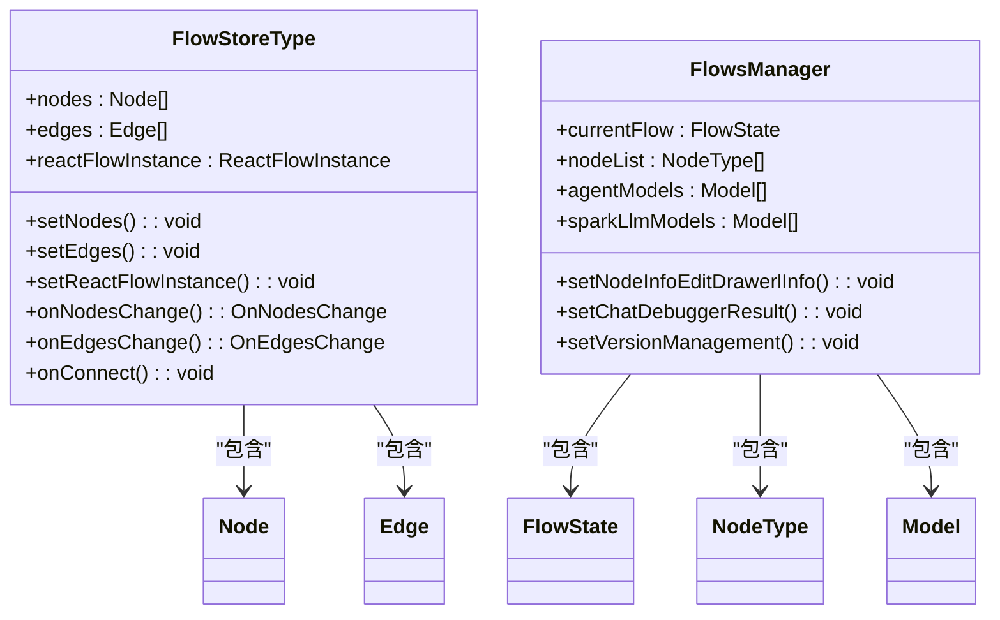
```mermaid
classDiagram
class FlowStoreType {
+nodes : Node[]
+edges : Edge[]
+reactFlowInstance : ReactFlowInstance
+setNodes() : void
+setEdges() : void
+setReactFlowInstance() : void
+onNodesChange() : OnNodesChange
+onEdgesChange() : OnEdgesChange
+onConnect() : void
}
class FlowsManager {
+currentFlow : FlowState
+nodeList : NodeType[]
+agentModels : Model[]
+sparkLlmModels : Model[]
+setNodeInfoEditDrawerlInfo() : void
+setChatDebuggerResult() : void
+setVersionManagement() : void
}
FlowStoreType --> Node : "包含"
FlowStoreType --> Edge : "包含"
FlowsManager --> FlowState : "包含"
FlowsManager --> NodeType : "包含"
FlowsManager --> Model : "包含"
```

**状态管理源码**
- [useFlowStore.tsx](file://console/frontend/src/components/workflow/store/use-flow-store.ts)
- [useFlowsManager.tsx](file://console/frontend/src/components/workflow/store/use-flows-manager.ts)

### 数据流设计

系统采用单向数据流设计，数据从状态管理器流向UI组件，用户操作通过回调函数更新状态。这种设计模式确保了数据的一致性和可预测性，便于调试和维护。

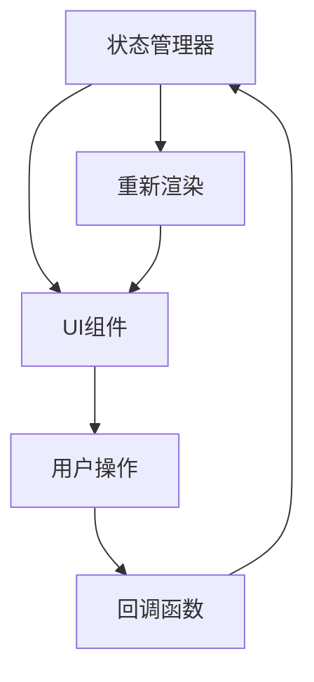
```mermaid
flowchart TD
A[状态管理器] --> B[UI组件]
B --> C[用户操作]
C --> D[回调函数]
D --> A
A --> E[重新渲染]
E --> B
```

## 节点配置与参数绑定

### 配置参数绑定

节点配置参数通过`nodeParam`对象进行管理，每个节点类型都有特定的配置参数。参数绑定通过`handleChangeNodeParam`函数实现，该函数接收一个更新函数和值，用于更新节点参数。

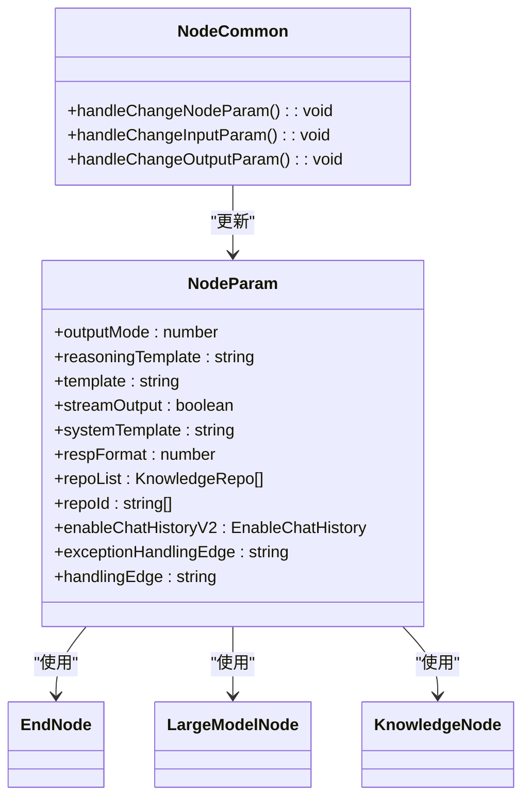
```mermaid
classDiagram
class NodeParam {
+outputMode : number
+reasoningTemplate : string
+template : string
+streamOutput : boolean
+systemTemplate : string
+respFormat : number
+repoList : KnowledgeRepo[]
+repoId : string[]
+enableChatHistoryV2 : EnableChatHistory
+exceptionHandlingEdge : string
+handlingEdge : string
}
class NodeCommon {
+handleChangeNodeParam() : void
+handleChangeInputParam() : void
+handleChangeOutputParam() : void
}
NodeCommon --> NodeParam : "更新"
NodeParam --> EndNode : "使用"
NodeParam --> LargeModelNode : "使用"
NodeParam --> KnowledgeNode : "使用"
```

**参数绑定源码**
- [use-node-common.tsx](file://console/frontend/src/components/workflow/hooks/use-node-common.tsx)

### 动态表单生成

系统支持动态表单生成，根据节点类型和配置参数自动生成相应的UI组件。表单组件包括输入框、下拉框、开关、树形选择器等，支持复杂的嵌套结构。

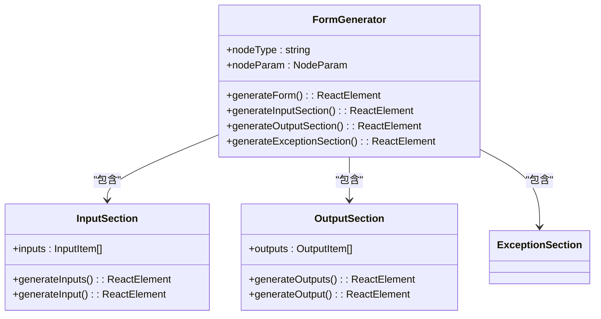
```mermaid
classDiagram
class FormGenerator {
+nodeType : string
+nodeParam : NodeParam
+generateForm() : ReactElement
+generateInputSection() : ReactElement
+generateOutputSection() : ReactElement
+generateExceptionSection() : ReactElement
}
class InputSection {
+inputs : InputItem[]
+generateInputs() : ReactElement
+generateInput() : ReactElement
}
class OutputSection {
+outputs : OutputItem[]
+generateOutputs() : ReactElement
+generateOutput() : ReactElement
}
FormGenerator --> InputSection : "包含"
FormGenerator --> OutputSection : "包含"
FormGenerator --> ExceptionSection : "包含"
```

## 异常处理机制

### 重试策略

系统支持灵活的重试策略配置，用户可以设置是否重试、最大重试次数和超时时间。重试策略通过`retryConfig`对象管理，包含`shouldRetry`、`maxRetries`和`timeout`等属性。

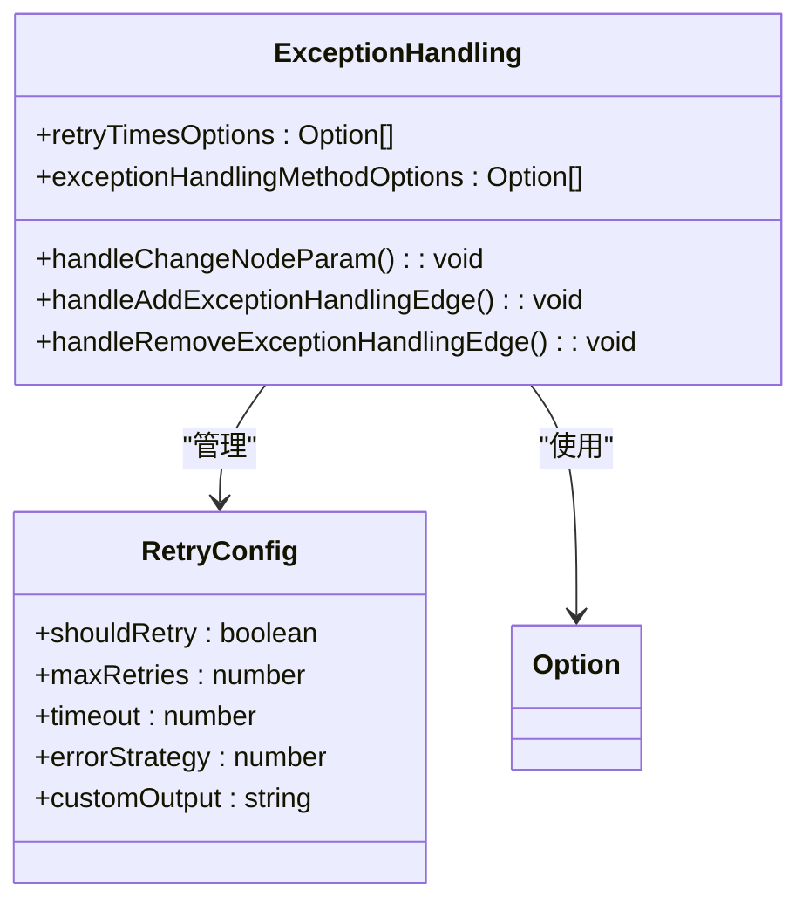
```mermaid
classDiagram
class RetryConfig {
+shouldRetry : boolean
+maxRetries : number
+timeout : number
+errorStrategy : number
+customOutput : string
}
class ExceptionHandling {
+retryTimesOptions : Option[]
+exceptionHandlingMethodOptions : Option[]
+handleChangeNodeParam() : void
+handleAddExceptionHandlingEdge() : void
+handleRemoveExceptionHandlingEdge() : void
}
ExceptionHandling --> RetryConfig : "管理"
ExceptionHandling --> Option : "使用"
```

**异常处理源码**
- [exception-handling/index.tsx](file://console/frontend/src/components/workflow/nodes/components/exception-handling/index.tsx)

### 错误处理方式

系统支持三种错误处理方式：
1. **中断流程**: 遇到错误时立即中断工作流执行
2. **返回设定内容**: 遇到错误时返回预设的错误内容
3. **执行异常流程**: 遇到错误时跳转到专门的异常处理流程

每种方式都有相应的配置界面，用户可以根据需要选择合适的处理策略。

## 节点验证与错误状态

### 输入验证

系统对节点输入进行严格的验证，确保数据的完整性和正确性。验证规则包括：
- 参数名称不能为空
- 参数名称只能包含字母、数字、连字符和下划线
- 参数名称不能重复
- URL格式必须正确
- 变量命名不能冲突

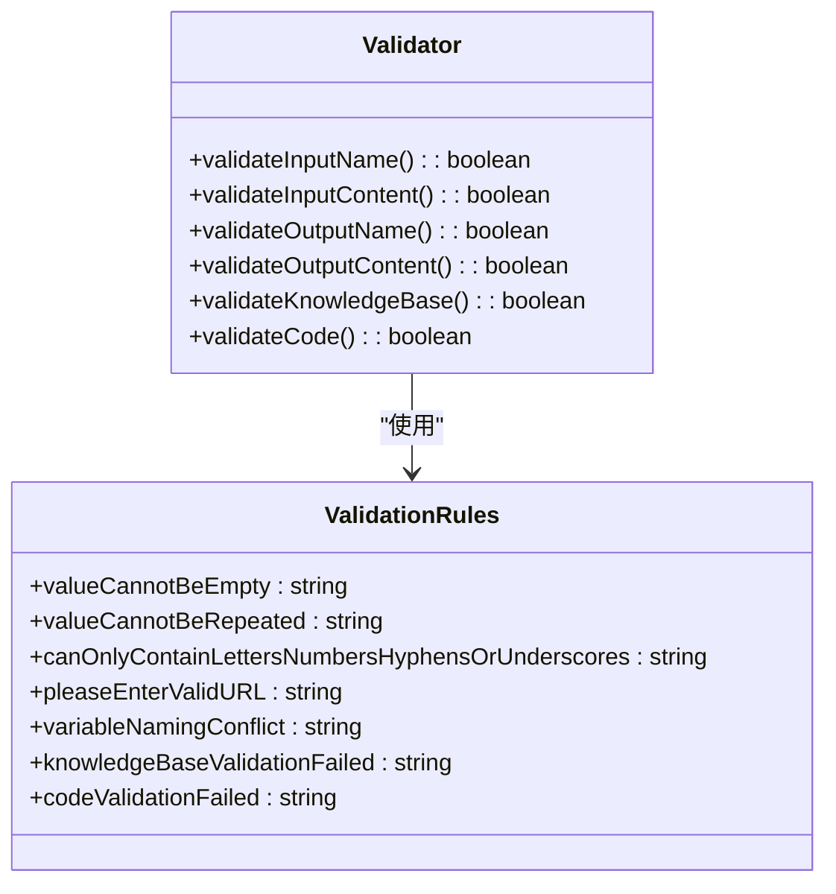
```mermaid
classDiagram
class ValidationRules {
+valueCannotBeEmpty : string
+valueCannotBeRepeated : string
+canOnlyContainLettersNumbersHyphensOrUnderscores : string
+pleaseEnterValidURL : string
+variableNamingConflict : string
+knowledgeBaseValidationFailed : string
+codeValidationFailed : string
}
class Validator {
+validateInputName() : boolean
+validateInputContent() : boolean
+validateOutputName() : boolean
+validateOutputContent() : boolean
+validateKnowledgeBase() : boolean
+validateCode() : boolean
}
Validator --> ValidationRules : "使用"
```

**验证源码**
- [reactflowUtils.ts](file://console/frontend/src/components/workflow/utils/reactflowUtils.ts)

### 错误状态显示

系统提供清晰的错误状态显示，通过红色文字和图标提示用户错误信息。错误信息定位到具体的输入字段，帮助用户快速定位和修复问题。

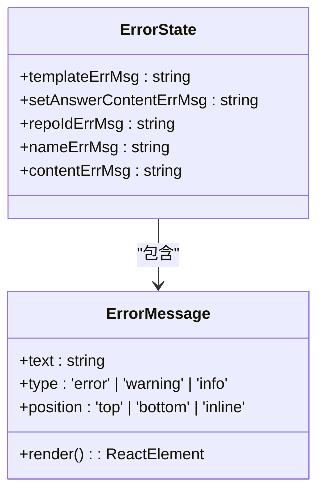
```mermaid
classDiagram
class ErrorState {
+templateErrMsg : string
+setAnswerContentErrMsg : string
+repoIdErrMsg : string
+nameErrMsg : string
+contentErrMsg : string
}
class ErrorMessage {
+text : string
+type : 'error' | 'warning' | 'info'
+position : 'top' | 'bottom' | 'inline'
+render() : ReactElement
}
ErrorState --> ErrorMessage : "包含"
```

## 扩展新节点类型

### 节点渲染

扩展新节点类型需要实现相应的渲染组件，通常遵循以下模式：
1. 创建新的节点组件文件
2. 导入必要的UI组件和hooks
3. 实现节点的UI布局和交互逻辑
4. 使用通用组件复用已有功能

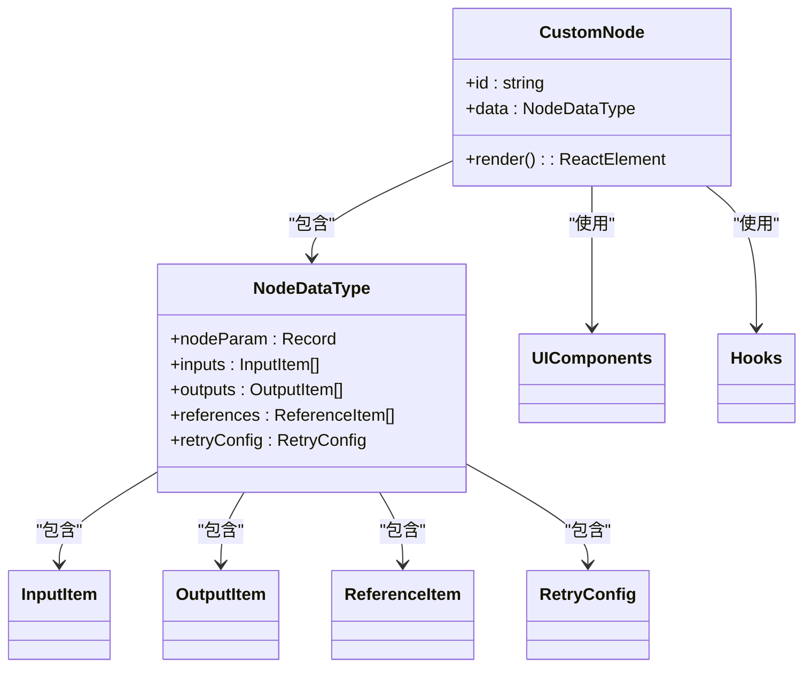
```mermaid
classDiagram
class CustomNode {
+id : string
+data : NodeDataType
+render() : ReactElement
}
CustomNode --> NodeDataType : "包含"
CustomNode --> UIComponents : "使用"
CustomNode --> Hooks : "使用"
class NodeDataType {
+nodeParam : Record<string, unknown>
+inputs : InputItem[]
+outputs : OutputItem[]
+references : ReferenceItem[]
+retryConfig : RetryConfig
}
NodeDataType --> InputItem : "包含"
NodeDataType --> OutputItem : "包含"
NodeDataType --> ReferenceItem : "包含"
NodeDataType --> RetryConfig : "包含"
```

### 事件处理

新节点需要处理各种用户交互事件，包括：
- 节点点击事件
- 参数变更事件
- 输入输出变更事件
- 调试事件
- 异常处理事件

事件处理通过hooks提供的回调函数实现，确保与系统其他部分的协调一致。

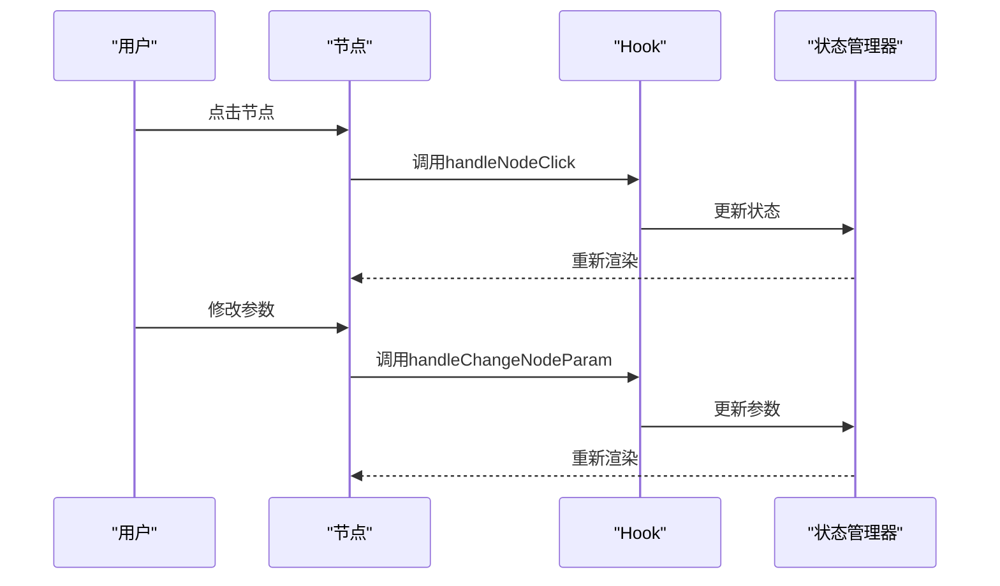
```mermaid
sequenceDiagram
participant User as "用户"
participant Node as "节点"
participant Hook as "Hook"
participant Store as "状态管理器"
User->>Node : 点击节点
Node->>Hook : 调用handleNodeClick
Hook->>Store : 更新状态
Store-->>Node : 重新渲染
User->>Node : 修改参数
Node->>Hook : 调用handleChangeNodeParam
Hook->>Store : 更新参数
Store-->>Node : 重新渲染
```

### 数据传递模式

节点间的数据传递通过边（Edge）连接实现，数据从源节点的输出端口流向目标节点的输入端口。系统支持引用传递模式，允许在输入值中引用其他节点的输出。

```mermaid
classDiagram
class Edge {
+id : string
+source : string
+target : string
+sourceHandle : string
+targetHandle : string
}
class InputValue {
+type : 'ref' | 'literal'
+content : {
+name : string
+type : string
}
}
class OutputValue {
+type : string
+default : string
}
Edge --> InputValue : "连接"
Edge --> OutputValue : "连接"
InputValue --> Reference : "引用"
OutputValue --> Reference : "生成"
```

## 用户操作反馈

### 操作反馈机制

系统提供即时的操作反馈，确保用户了解当前操作的状态。反馈机制包括：
- 表单输入的实时验证
- 参数变更的自动保存
- 节点连接的视觉反馈
- 调试执行的进度显示

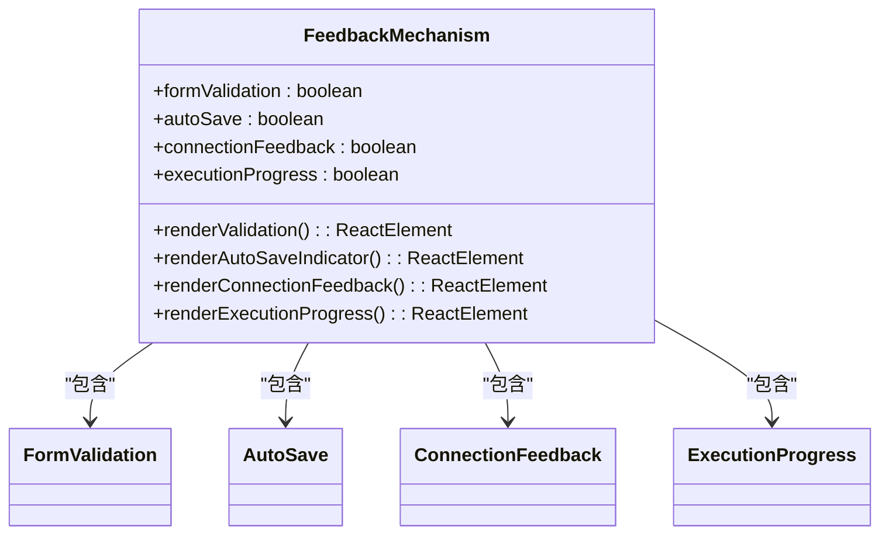
```mermaid
classDiagram
class FeedbackMechanism {
+formValidation : boolean
+autoSave : boolean
+connectionFeedback : boolean
+executionProgress : boolean
+renderValidation() : ReactElement
+renderAutoSaveIndicator() : ReactElement
+renderConnectionFeedback() : ReactElement
+renderExecutionProgress() : ReactElement
}
FeedbackMechanism --> FormValidation : "包含"
FeedbackMechanism --> AutoSave : "包含"
FeedbackMechanism --> ConnectionFeedback : "包含"
FeedbackMechanism --> ExecutionProgress : "包含"
```

### 用户体验优化

系统注重用户体验优化，通过以下方式提升操作效率：
- 提供快捷操作按钮
- 支持批量操作
- 实现智能提示
- 优化界面布局

这些优化措施使得复杂的工作流设计变得更加直观和高效。

## 结论

本工作流节点系统通过React Flow实现了强大的可视化工作流设计功能。系统采用模块化设计，通过通用组件体系实现了高复用性和可扩展性。核心节点类型覆盖了常见的业务场景，通用组件体系提供了输入/输出、调试、异常处理等基础功能。状态管理采用Zustand方案，确保了数据的一致性和可预测性。系统支持灵活的参数配置和验证机制，保证了工作流的正确性。通过清晰的错误状态显示和用户操作反馈，提升了用户体验。整体架构设计合理，为扩展新节点类型提供了良好的基础。