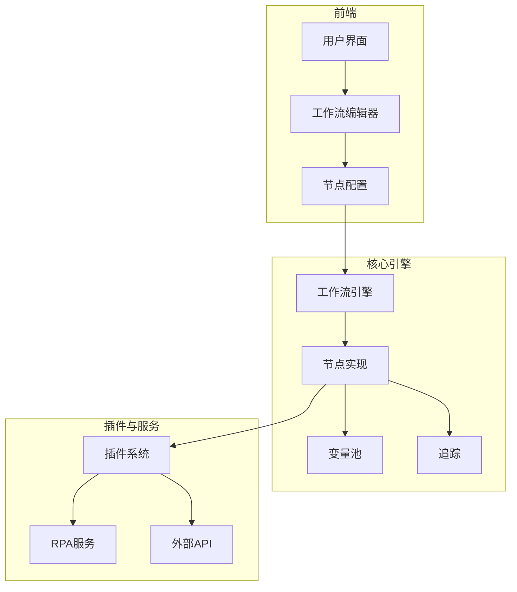
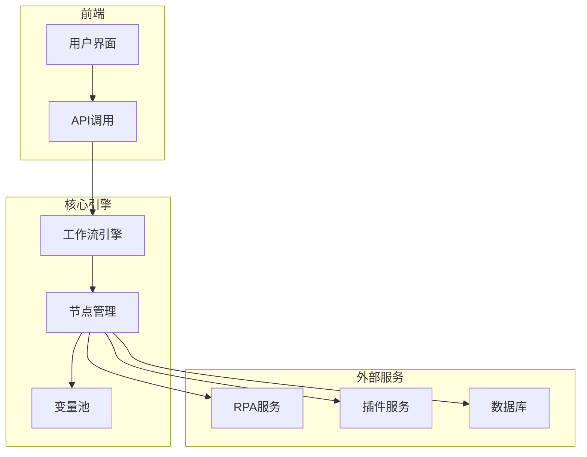
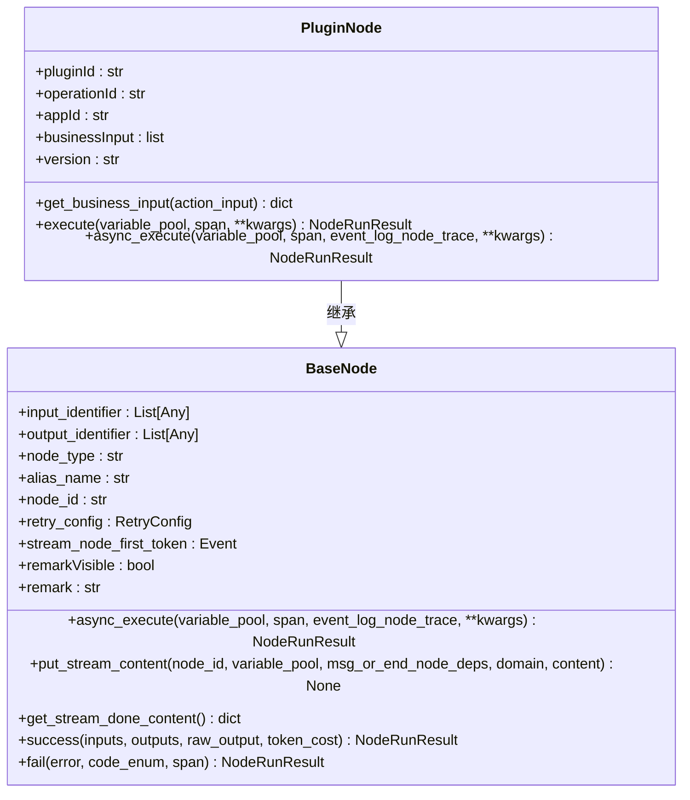
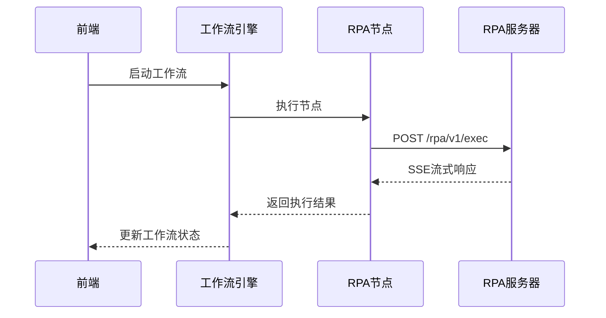
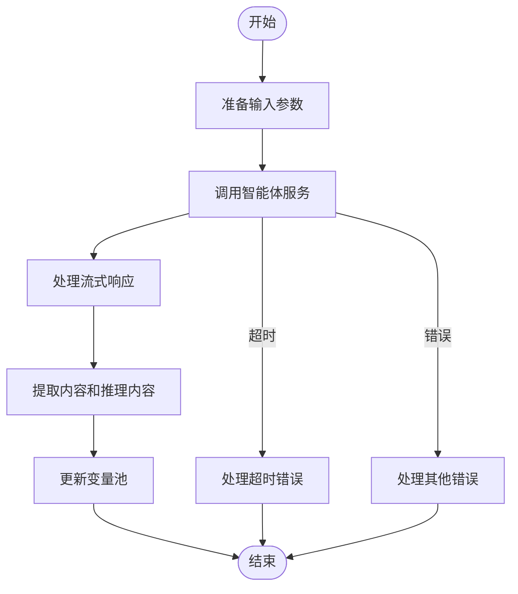
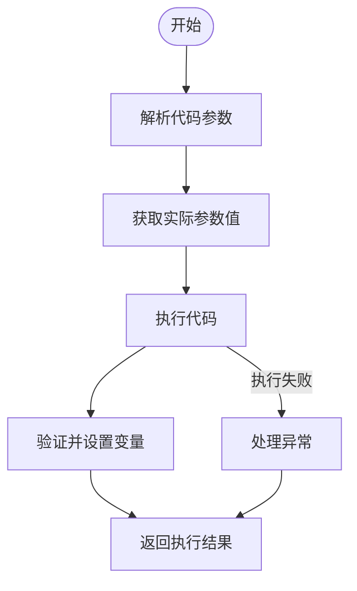
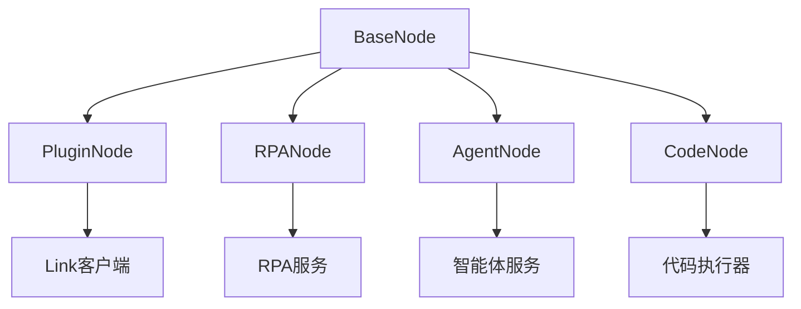

# 集成节点

<cite>
**本文档引用的文件**  
- [agent_node.py](file://core/workflow/engine/nodes/agent/agent_node.py)
- [rpa_node.py](file://core/workflow/engine/nodes/rpa/rpa_node.py)
- [code_node.py](file://core/workflow/engine/nodes/code/code_node.py)
- [plugin_node.py](file://core/workflow/engine/nodes/plugin_tool/plugin_node.py)
- [base_node.py](file://core/workflow/engine/nodes/base_node.py)
- [agent/index.tsx](file://console/frontend/src/components/workflow/nodes/agent/index.tsx)
- [rpa/index.tsx](file://console/frontend/src/components/workflow/nodes/rpa/index.tsx)
- [code/index.tsx](file://console/frontend/src/components/workflow/nodes/code/index.tsx)
- [plugin/index.tsx](file://console/frontend/src/components/workflow/nodes/plugin/index.tsx)
- [auth_handler.lua](file://docker/astronAgent/astronRPA/volumes/nginx/lua/auth_handler.lua)
- [default.conf](file://docker/astronAgent/astronRPA/volumes/nginx/default.conf)
</cite>

## 目录
1. [简介](#简介)
2. [项目结构](#项目结构)
3. [核心组件](#核心组件)
4. [架构概述](#架构概述)
5. [详细组件分析](#详细组件分析)
6. [依赖分析](#依赖分析)
7. [性能考虑](#性能考虑)
8. [故障排除指南](#故障排除指南)
9. [结论](#结论)
10. [附录](#附录)（如有必要）

## 简介
本文档详细描述了astron-agent项目中的集成节点实现，包括插件节点、RPA节点、智能体节点和代码节点。这些节点是工作流引擎的核心组件，用于集成外部服务和自定义逻辑。文档将解释这些节点如何配置、认证和处理错误，以及如何通过代码示例展示服务调用和结果处理模式。

## 项目结构
该项目采用分层架构，主要分为前端、核心引擎和插件模块。前端负责用户界面和交互，核心引擎处理工作流执行，插件模块提供外部服务集成能力。

**图源**  
- [agent/index.tsx](file://console/frontend/src/components/workflow/nodes/agent/index.tsx#L0-L740)
- [rpa/index.tsx](file://console/frontend/src/components/workflow/nodes/rpa/index.tsx#L0-L17)
- [code/index.tsx](file://console/frontend/src/components/workflow/nodes/code/index.tsx#L0-L84)
- [plugin/index.tsx](file://console/frontend/src/components/workflow/nodes/plugin/index.tsx#L0-L17)

**节源**  
- [agent/index.tsx](file://console/frontend/src/components/workflow/nodes/agent/index.tsx#L0-L740)
- [rpa/index.tsx](file://console/frontend/src/components/workflow/nodes/rpa/index.tsx#L0-L17)
- [code/index.tsx](file://console/frontend/src/components/workflow/nodes/code/index.tsx#L0-L84)
- [plugin/index.tsx](file://console/frontend/src/components/workflow/nodes/plugin/index.tsx#L0-L17)

## 核心组件
核心组件包括插件节点、RPA节点、智能体节点和代码节点，它们都继承自BaseNode类，实现了async_execute方法来处理异步执行逻辑。每个节点都有输入和输出标识符，用于数据流的连接和传递。

**节源**  
- [agent_node.py](file://core/workflow/engine/nodes/agent/agent_node.py#L0-L579)
- [rpa_node.py](file://core/workflow/engine/nodes/rpa/rpa_node.py#L0-L165)
- [code_node.py](file://core/workflow/engine/nodes/code/code_node.py#L0-L265)
- [plugin_node.py](file://core/workflow/engine/nodes/plugin_tool/plugin_node.py#L0-L239)

## 架构概述
系统架构采用微服务设计，前端通过API与核心引擎通信，核心引擎调用各种节点执行具体任务。节点可以调用外部服务，如RPA服务、插件服务等，通过HTTP请求进行交互。

**图源**  
- [agent_node.py](file://core/workflow/engine/nodes/agent/agent_node.py#L0-L579)
- [rpa_node.py](file://core/workflow/engine/nodes/rpa/rpa_node.py#L0-L165)
- [code_node.py](file://core/workflow/engine/nodes/code/code_node.py#L0-L265)
- [plugin_node.py](file://core/workflow/engine/nodes/plugin_tool/plugin_node.py#L0-L239)

## 详细组件分析
### 插件节点分析
插件节点用于执行外部工具，通过Link系统与外部服务通信。它支持操作输入和业务输入，可以调用特定的工具操作。

#### 对于对象导向组件：

**图源**  
- [plugin_node.py](file://core/workflow/engine/nodes/plugin_tool/plugin_node.py#L0-L239)
- [base_node.py](file://core/workflow/engine/nodes/base_node.py#L0-L799)

**节源**  
- [plugin_node.py](file://core/workflow/engine/nodes/plugin_tool/plugin_node.py#L0-L239)

### RPA节点分析
RPA节点用于执行自动化流程，通过调用RPA服务来执行特定的项目。它支持参数传递和结果提取。

#### 对于API/服务组件：

**图源**  
- [rpa_node.py](file://core/workflow/engine/nodes/rpa/rpa_node.py#L0-L165)
- [default.conf](file://docker/astronAgent/astronRPA/volumes/nginx/default.conf#L84-L121)

**节源**  
- [rpa_node.py](file://core/workflow/engine/nodes/rpa/rpa_node.py#L0-L165)

### 智能体节点分析
智能体节点用于与AI服务交互，支持大模型调用、知识库访问和工具使用。它通过流式响应处理AI生成的内容。

#### 对于复杂逻辑组件：

**图源**  
- [agent_node.py](file://core/workflow/engine/nodes/agent/agent_node.py#L0-L579)
- [auth_handler.lua](file://docker/astronAgent/astronRPA/volumes/nginx/lua/auth_handler.lua#L104-L164)

**节源**  
- [agent_node.py](file://core/workflow/engine/nodes/agent/agent_node.py#L0-L579)

### 代码节点分析
代码节点允许在工作流中执行Python代码，支持参数注入和结果提取。它通过代码执行器工厂创建适当的执行器。

#### 对于复杂逻辑组件：

**图源**  
- [code_node.py](file://core/workflow/engine/nodes/code/code_node.py#L0-L265)
- [base_node.py](file://core/workflow/engine/nodes/base_node.py#L0-L799)

**节源**  
- [code_node.py](file://core/workflow/engine/nodes/code/code_node.py#L0-L265)

## 依赖分析
各组件之间的依赖关系如下图所示，核心引擎依赖于各个节点实现，节点实现又依赖于基础节点类和外部服务。

**图源**  
- [plugin_node.py](file://core/workflow/engine/nodes/plugin_tool/plugin_node.py#L0-L239)
- [rpa_node.py](file://core/workflow/engine/nodes/rpa/rpa_node.py#L0-L165)
- [agent_node.py](file://core/workflow/engine/nodes/agent/agent_node.py#L0-L579)
- [code_node.py](file://core/workflow/engine/nodes/code/code_node.py#L0-L265)

**节源**  
- [plugin_node.py](file://core/workflow/engine/nodes/plugin_tool/plugin_node.py#L0-L239)
- [rpa_node.py](file://core/workflow/engine/nodes/rpa/rpa_node.py#L0-L165)
- [agent_node.py](file://core/workflow/engine/nodes/agent/agent_node.py#L0-L579)
- [code_node.py](file://core/workflow/engine/nodes/code/code_node.py#L0-L265)

## 性能考虑
- 使用异步执行提高并发性能
- 流式响应减少内存占用
- 缓存机制提高重复调用效率
- 超时配置防止长时间阻塞

## 故障排除指南
常见问题包括认证失败、服务不可用和参数错误。通过查看日志和追踪信息可以快速定位问题。

**节源**  
- [auth_handler.lua](file://docker/astronAgent/astronRPA/volumes/nginx/lua/auth_handler.lua#L104-L164)
- [base_node.py](file://core/workflow/engine/nodes/base_node.py#L0-L799)

## 结论
集成节点是astron-agent项目的核心功能，通过插件节点、RPA节点、智能体节点和代码节点的实现，提供了强大的外部服务集成和自定义逻辑处理能力。这些节点的设计考虑了可扩展性、安全性和性能，为构建复杂的工作流应用提供了坚实的基础。