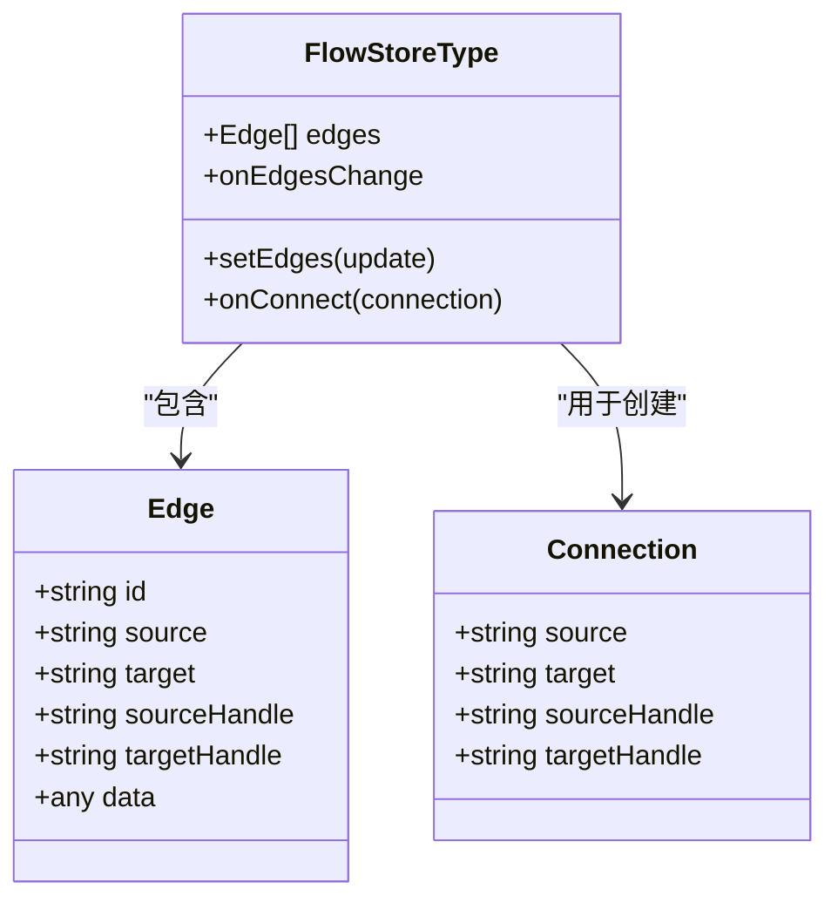
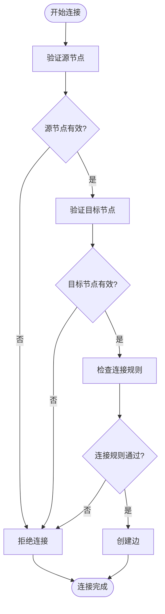
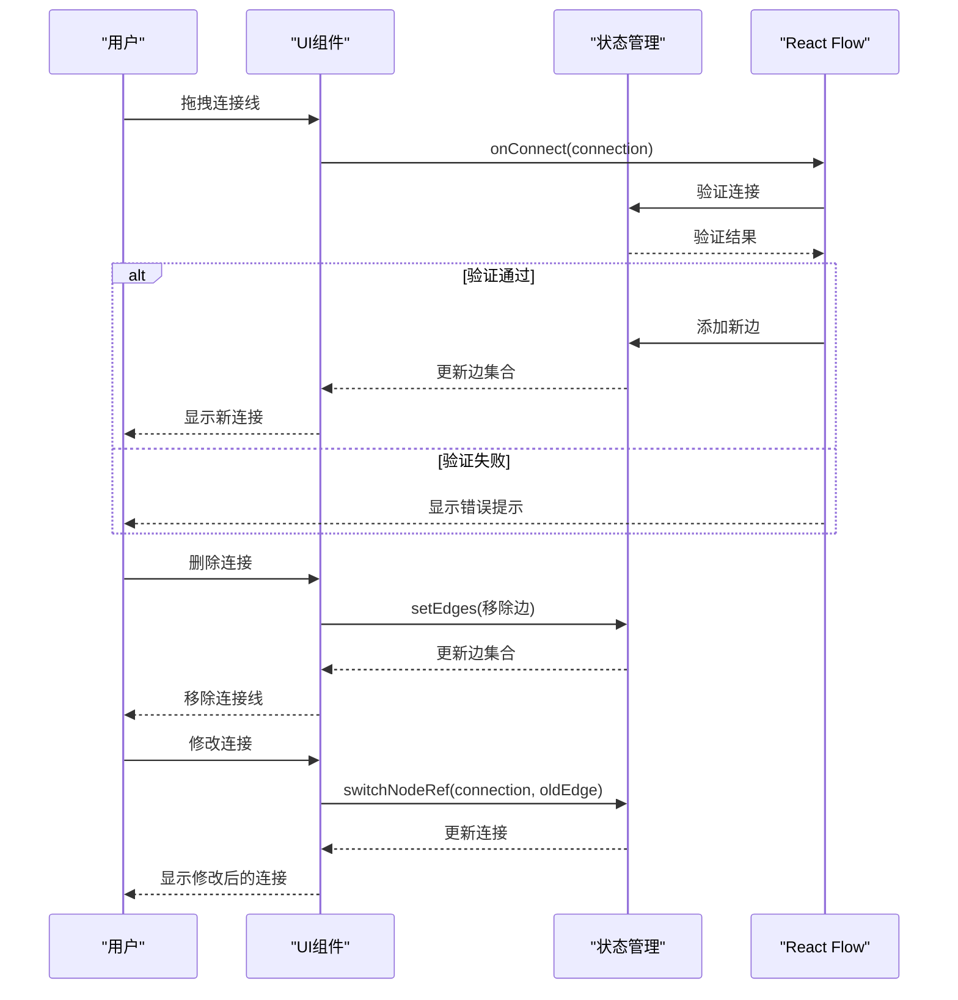
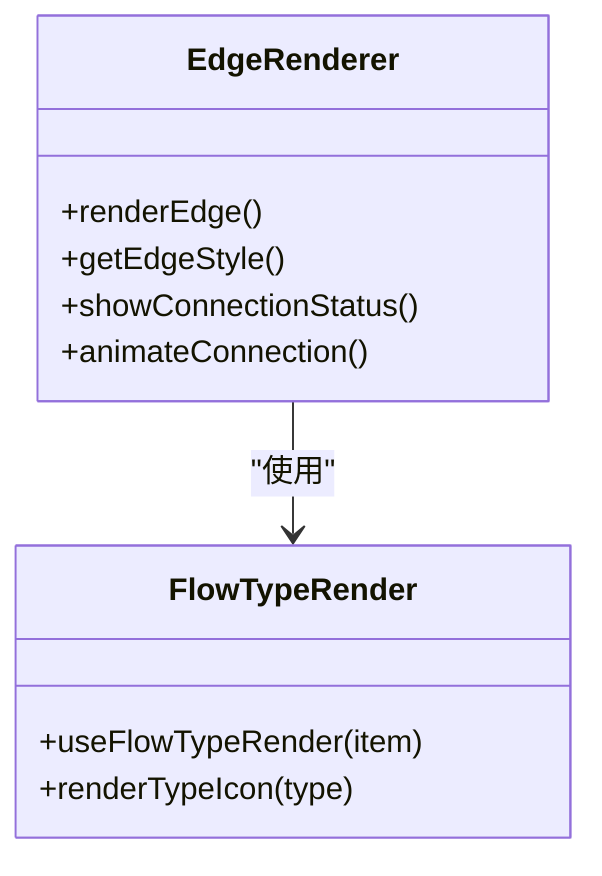
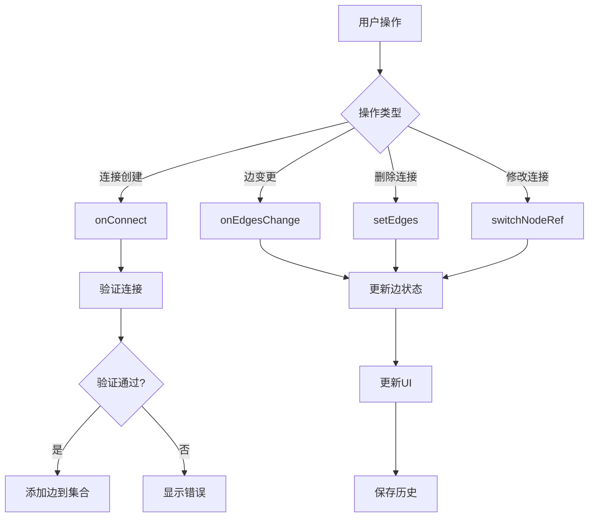

# 边系统

<cite>
**本文档引用的文件**
- [flow/index.ts](file://console/frontend/src/components/workflow/types/zustand/flow/index.ts)
- [use-flow-type-render.tsx](file://console/frontend/src/components/workflow/hooks/use-flow-type-render.tsx)
</cite>

## 目录
1. [引言](#引言)
2. [边的数据结构设计](#边的数据结构设计)
3. [连接验证规则](#连接验证规则)
4. [边的交互行为](#边的交互行为)
5. [边的可视化效果](#边的可视化效果)
6. [连接事件处理模式](#连接事件处理模式)
7. [结论](#结论)

## 引言
边系统是工作流可视化编辑器的核心组成部分，负责表示节点之间的连接关系。本系统基于React Flow库构建，实现了节点间连接线的创建、管理和渲染功能。边系统不仅处理连接的视觉呈现，还管理连接的验证、交互和元数据存储，确保工作流的逻辑正确性和用户体验。

**边系统的主要功能包括**：
- 管理节点间的连接关系
- 验证连接的有效性
- 处理连接的创建、删除和修改
- 渲染连接线的视觉效果
- 存储连接的元数据

## 边的数据结构设计
边系统使用React Flow库提供的Edge类型来定义连接的数据结构。每个边对象包含源节点、目标节点以及连接的元数据。

**Diagram sources**
- [flow/index.ts](file://console/frontend/src/components/workflow/types/zustand/flow/index.ts#L0-L53)

**边的主要属性**：
- **id**：连接的唯一标识符
- **source**：源节点的ID
- **target**：目标节点的ID
- **sourceHandle**：源节点的输出句柄
- **targetHandle**：目标节点的输入句柄
- **data**：连接的元数据

边系统通过zustand状态管理库维护所有边的集合，提供setEdges方法来更新边的状态，并通过onEdgesChange回调处理边的变更事件。

**Section sources**
- [flow/index.ts](file://console/frontend/src/components/workflow/types/zustand/flow/index.ts#L0-L53)

## 连接验证规则
边系统实现了严格的连接验证机制，确保只有有效的连接才能被创建。验证规则主要通过onConnect回调函数实现，检查连接的源和目标是否符合业务逻辑。

**Diagram sources**
- [flow/index.ts](file://console/frontend/src/components/workflow/types/zustand/flow/index.ts#L0-L53)

连接验证的主要规则包括：
- 源节点和目标节点不能相同
- 同一输入句柄只能连接一个输出句柄
- 连接必须符合节点的输入输出类型匹配规则
- 特定类型的节点有特殊的连接限制

当用户尝试创建连接时，系统会调用onConnect回调函数，该函数接收Connection对象作为参数，包含源节点、目标节点和句柄信息。如果连接验证通过，则将新的边添加到边集合中；否则，连接将被拒绝。

**Section sources**
- [flow/index.ts](file://console/frontend/src/components/workflow/types/zustand/flow/index.ts#L0-L53)

## 边的交互行为
边系统支持多种交互行为，包括连接的创建、删除和修改。这些交互行为通过React Flow提供的回调函数实现，确保用户操作的流畅性和准确性。

**Diagram sources**
- [flow/index.ts](file://console/frontend/src/components/workflow/types/zustand/flow/index.ts#L0-L53)

**主要交互行为**：
- **连接创建**：用户从源节点的输出句柄拖拽到目标节点的输入句柄，触发onConnect回调
- **连接删除**：用户点击连接线上的删除按钮，调用setEdges方法移除对应的边
- **连接修改**：用户重新连接已存在的连接，调用switchNodeRef方法更新连接
- **连接验证**：在连接创建时实时验证连接的有效性

边系统还实现了连接的撤销和重做功能，通过维护历史记录来支持用户的操作回退。每次边的变更都会被记录到historys数组中，用户可以通过undo方法恢复到之前的状态。

**Section sources**
- [flow/index.ts](file://console/frontend/src/components/workflow/types/zustand/flow/index.ts#L0-L53)

## 边的可视化效果
边系统通过自定义渲染机制实现连接线的可视化效果，包括样式定义、动画和状态指示。可视化效果不仅提升了用户体验，还提供了连接状态的直观反馈。

**Diagram sources**
- [flow/index.ts](file://console/frontend/src/components/workflow/types/zustand/flow/index.ts#L0-L53)
- [use-flow-type-render.tsx](file://console/frontend/src/components/workflow/hooks/use-flow-type-render.tsx#L0-L203)

**可视化特性**：
- **样式定义**：通过CSS类和内联样式定义连接线的外观
- **动画效果**：连接创建和删除时的过渡动画
- **颜色编码**：不同类型的连接使用不同的颜色
- **状态指示**：显示连接的有效性状态
- **交互反馈**：鼠标悬停和点击时的视觉反馈

边系统还集成了类型渲染功能，根据连接的数据类型显示相应的图标。这通过useFlowTypeRender钩子实现，根据节点的类型属性返回对应的SVG图标，帮助用户快速识别连接的数据类型。

**Section sources**
- [flow/index.ts](file://console/frontend/src/components/workflow/types/zustand/flow/index.ts#L0-L53)
- [use-flow-type-render.tsx](file://console/frontend/src/components/workflow/hooks/use-flow-type-render.tsx#L0-L203)

## 连接事件处理模式
边系统采用事件驱动的架构模式处理连接相关的事件，确保系统的响应性和可维护性。事件处理模式通过回调函数和状态更新机制实现，将用户操作与系统状态变更解耦。

**Diagram sources**
- [flow/index.ts](file://console/frontend/src/components/workflow/types/zustand/flow/index.ts#L0-L53)

**事件处理流程**：
1. 用户触发操作（如拖拽连接）
2. React Flow触发相应的回调函数
3. 回调函数执行业务逻辑（如验证连接）
4. 更新状态管理中的边集合
5. 状态更新触发UI重新渲染
6. 记录操作到历史记录中

这种事件处理模式确保了系统的可预测性和可调试性，每个操作都有明确的处理路径和状态变更。同时，通过将业务逻辑集中在状态管理中，提高了代码的可维护性和可测试性。

**Section sources**
- [flow/index.ts](file://console/frontend/src/components/workflow/types/zustand/flow/index.ts#L0-L53)

## 结论
边系统作为工作流可视化编辑器的核心组件，实现了节点间连接的完整生命周期管理。通过精心设计的数据结构、严格的验证规则、丰富的交互行为和直观的可视化效果，边系统为用户提供了高效、可靠的工作流编辑体验。

系统的关键优势包括：
- 基于React Flow的稳定基础
- 清晰的事件处理模式
- 可扩展的架构设计
- 丰富的用户体验特性

未来可以进一步优化的方向包括：
- 增强连接的智能推荐功能
- 支持更复杂的连接类型
- 提供连接性能分析工具
- 增强移动端的交互体验