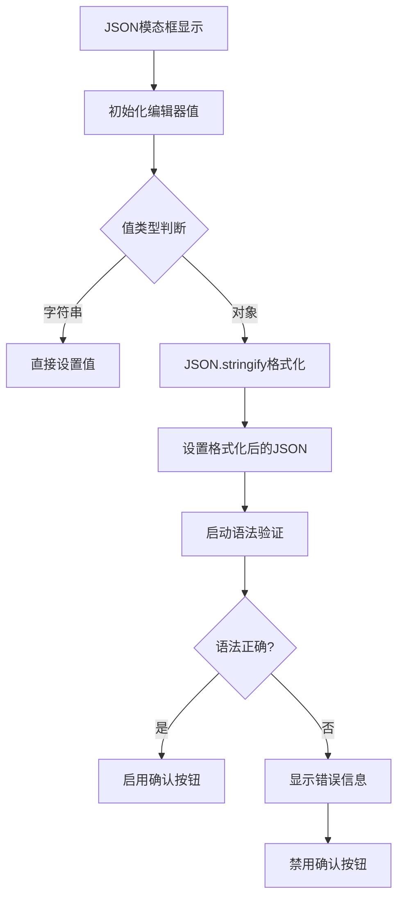
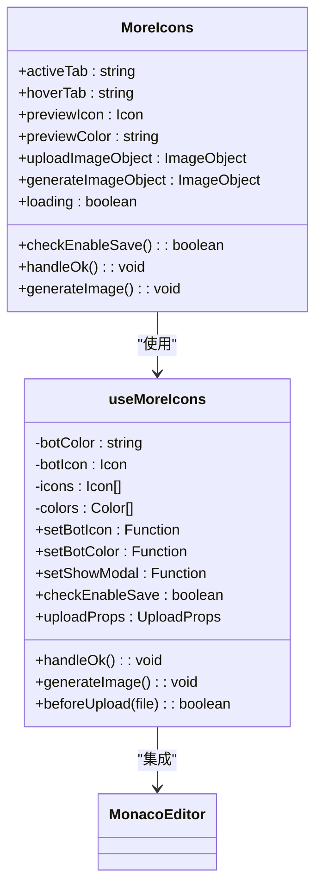
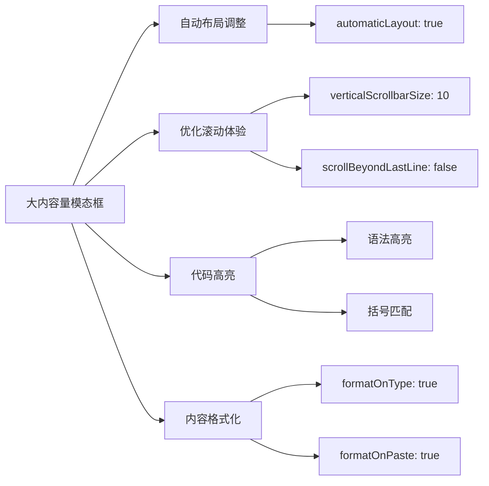
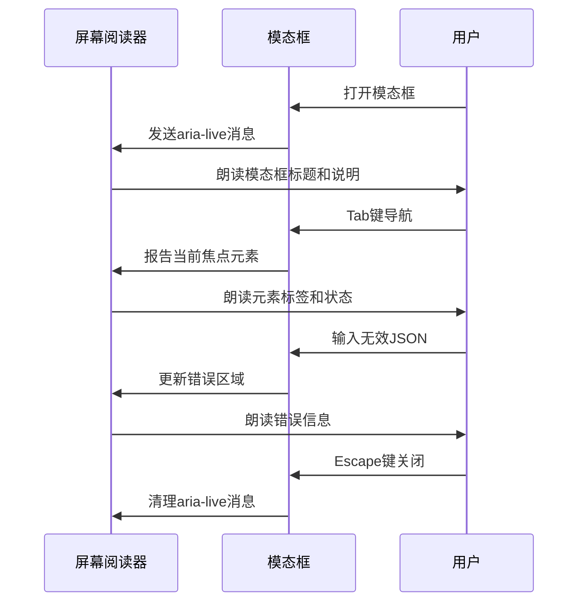

# 信息展示类模态框

<cite>
**本文档引用的文件**  
- [json-modal/index.tsx](file://console/frontend/src/components/modal/json-modal/index.tsx)
- [json-modal/index.css](file://console/frontend/src/components/modal/json-modal/index.css)
- [more-icons/index.tsx](file://console/frontend/src/components/modal/more-icons/index.tsx)
- [use-more-icons.ts](file://console/frontend/src/components/modal/more-icons/hooks/use-more-icons.ts)
- [JsonMonacoEditor.tsx](file://console/frontend/src/components/monaco-editor/JsonMonacoEditor.tsx)
</cite>

## 目录
1. [简介](#简介)
2. [JSON模态框实现方案](#json模态框实现方案)
3. [更多图标模态框实现方案](#更多图标模态框实现方案)
4. [大内容量模态框处理](#大内容量模态框处理)
5. [可访问性最佳实践](#可访问性最佳实践)
6. [结论](#结论)

## 简介
信息展示类模态框是系统中用于展示复杂数据结构和提供用户选择功能的重要组件。本文档重点解析JSON模态框和更多图标模态框的特殊用途，说明如何安全地渲染和格式化复杂数据结构以供开发者调试，描述大内容量模态框的滚动处理、代码高亮、复制到剪贴板等辅助功能，并解释图标模态框的图标分类、搜索过滤和选择交互机制。

## JSON模态框实现方案

JSON模态框主要用于安全地渲染和格式化复杂数据结构，特别适用于开发者调试场景。该组件基于Ant Design的Modal组件和Monaco Editor构建，提供了完整的JSON编辑和验证功能。

组件支持通过`initialValue`属性传入初始值，该值可以是字符串或对象类型。当传入对象时，组件会自动将其转换为格式化的JSON字符串（使用`JSON.stringify`的缩进参数），确保数据的可读性。模态框集成了实时验证功能，通过`validateJson`函数检查JSON语法的正确性，并在编辑器下方显示相应的错误信息。

**模态框来源**
- [json-modal/index.tsx](file://console/frontend/src/components/modal/json-modal/index.tsx#L0-L178)

## 更多图标模态框实现方案

更多图标模态框提供了图标选择功能，包含图库、上传和AI生成三种模式。该组件通过`activeTab`状态管理当前激活的选项卡，支持用户在不同模式间切换。

图库模式按分类展示图标，包括常用、运动、植物和探索等类别。每个图标都与颜色选择器关联，用户可以预览图标与不同背景色的组合效果。上传模式支持拖拽文件或选择文件上传，集成了文件大小和格式验证功能。AI生成模式允许用户输入描述文本，通过后端服务生成相应的图标图像。

组件通过`useMoreIcons`自定义Hook管理复杂的状态逻辑，包括预览图标、预览颜色、上传状态和AI生成状态等。该Hook还实现了保存按钮的启用条件判断，确保只有在有效状态下才能保存选择。

**模态框来源**
- [more-icons/index.tsx](file://console/frontend/src/components/modal/more-icons/index.tsx#L0-L455)
- [use-more-icons.ts](file://console/frontend/src/components/modal/more-icons/hooks/use-more-icons.ts#L0-L209)

## 大内容量模态框处理

对于大内容量的模态框，系统采用了多种技术手段确保良好的用户体验。首先，通过Monaco Editor的`automaticLayout`选项实现了编辑器的自动布局调整，确保编辑器能够正确响应容器大小的变化。

滚动处理方面，组件通过CSS样式设置了适当的滚动条大小（`verticalScrollbarSize: 10`），并禁用了不必要的视觉元素如行号、代码折叠和字形边距，以最大化内容显示区域。对于超长内容，编辑器支持平滑滚动和键盘导航，提升了可操作性。

代码高亮功能由Monaco Editor原生支持，针对JSON语言提供了语法高亮、括号匹配和错误标记等特性。复制到剪贴板功能虽然在当前组件中未直接实现，但可以通过浏览器原生的复制功能或集成第三方库来补充。

**模态框来源**
- [json-modal/index.tsx](file://console/frontend/src/components/modal/json-modal/index.tsx#L149-L177)
- [json-modal/index.css](file://console/frontend/src/components/modal/json-modal/index.css#L0-L25)

## 可访问性最佳实践

为确保屏幕阅读器用户能有效获取模态框内的信息，系统实施了多项可访问性最佳实践。首先，所有模态框都提供了有意义的标题，通过`title`属性明确传达模态框的目的。关闭按钮使用了适当的`alt`文本（"返回"或空字符串），避免对屏幕阅读器用户造成干扰。

对于表单元素，组件使用了语义化的HTML标签和ARIA属性。例如，输入框与标签正确关联，必填字段通过视觉和文本提示明确标识。错误信息区域在验证失败时动态显示，并通过颜色对比和图标增强可识别性。

键盘导航方面，模态框实现了完整的焦点管理，用户可以通过Tab键在可交互元素间顺序导航，通过Enter键激活按钮，通过Escape键关闭模态框。这些交互模式符合WAI-ARIA最佳实践，确保了辅助技术用户的操作流畅性。

**模态框来源**
- [json-modal/index.tsx](file://console/frontend/src/components/modal/json-modal/index.tsx#L108-L151)
- [more-icons/index.tsx](file://console/frontend/src/components/modal/more-icons/index.tsx#L85-L454)

## 结论
信息展示类模态框在系统中扮演着关键角色，不仅提供了安全的数据展示和编辑功能，还通过丰富的交互设计提升了用户体验。JSON模态框通过集成Monaco Editor实现了专业的代码编辑体验，而更多图标模态框则通过多模式设计满足了不同场景的图标选择需求。未来可进一步增强可访问性特性，如增加高对比度主题支持和更详细的屏幕阅读器提示，以满足更广泛的用户需求。