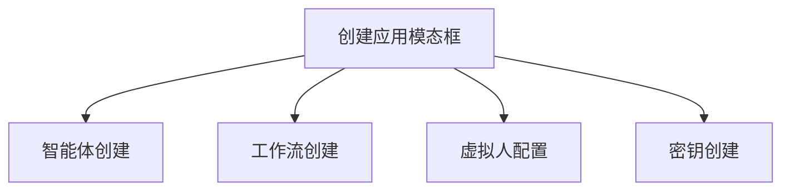
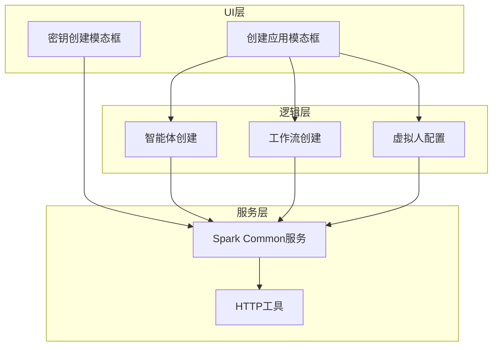
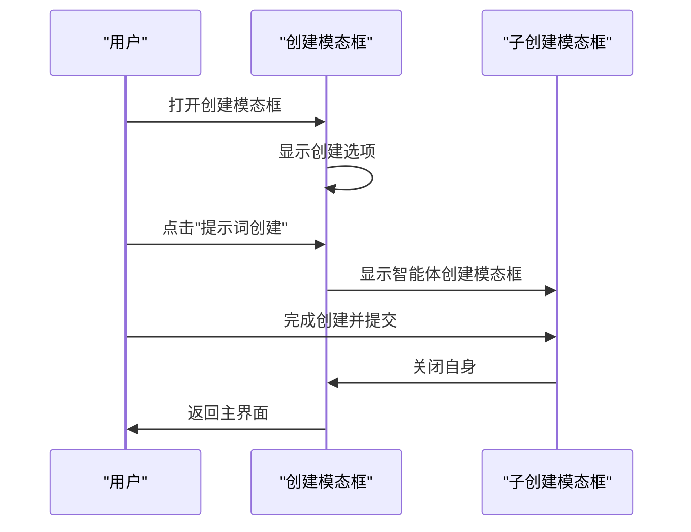
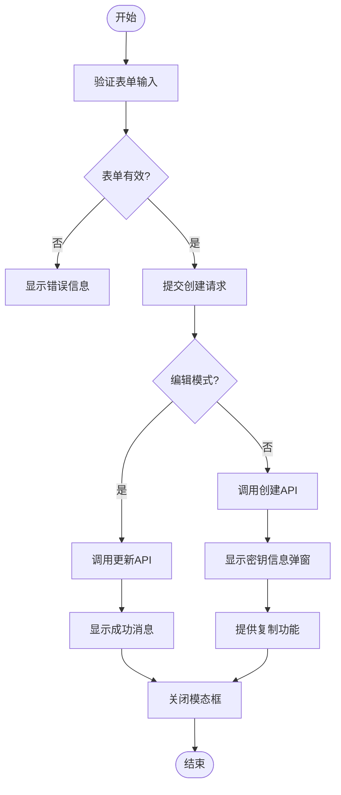
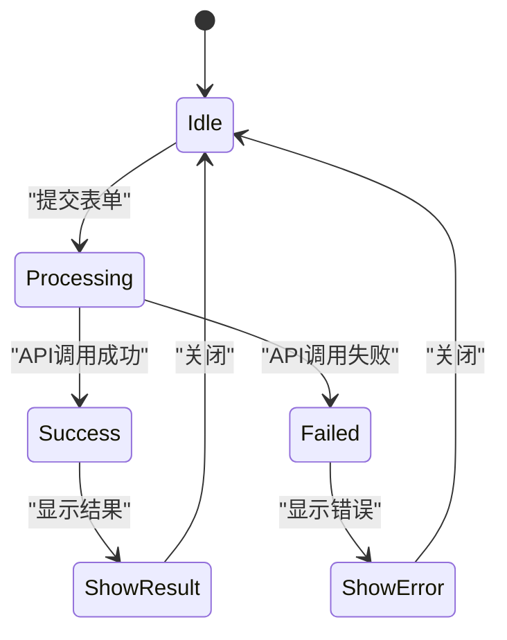
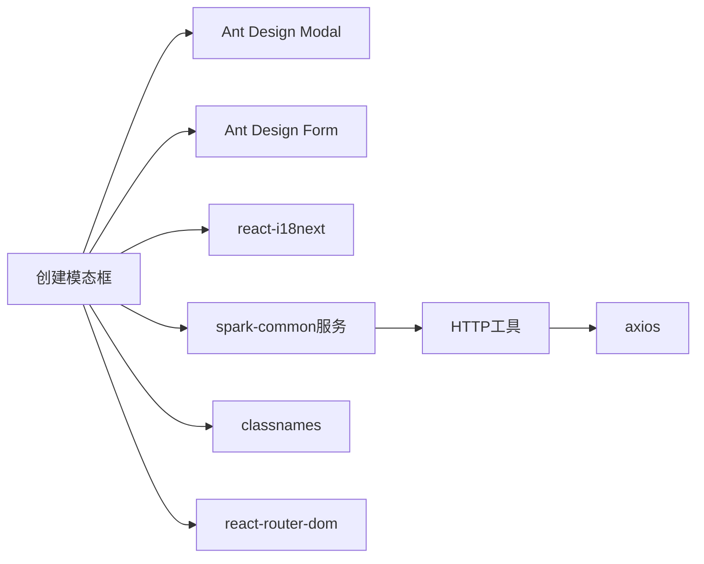

# 创建类模态框

<cite>
**本文档引用的文件**  
- [create-application-modal/index.tsx](file://console/frontend/src/components/create-application-modal/index.tsx)
- [create-key-modal/index.tsx](file://console/frontend/src/components/create-key-modal/index.tsx)
- [spark-common.ts](file://console/frontend/src/services/spark-common.ts)
- [agent-creation/index.tsx](file://console/frontend/src/components/agent-creation/index.tsx)
- [make-creation/index.tsx](file://console/frontend/src/components/make-creation/index.tsx)
- [virtual-config-modal/index.tsx](file://console/frontend/src/components/virtual-config-modal/index.tsx)
- [http.ts](file://console/frontend/src/utils/http.ts)
</cite>

## 目录
1. [简介](#简介)
2. [项目结构](#项目结构)
3. [核心组件](#核心组件)
4. [架构概述](#架构概述)
5. [详细组件分析](#详细组件分析)
6. [依赖分析](#依赖分析)
7. [性能考虑](#性能考虑)
8. [故障排除指南](#故障排除指南)
9. [结论](#结论)

## 简介
本文档详细分析了应用创建模态框和密钥创建模态框的实现机制。重点涵盖表单结构设计、输入验证逻辑、异步提交处理流程以及成功/失败状态反馈。同时描述了与后端API的集成方式，包括请求参数构造、响应处理和错误码映射。还涵盖了用户体验细节，如加载状态指示、防重复提交机制和关闭后的页面刷新策略，并提供代码示例展示如何在不同场景下复用这些创建模态框组件。

## 项目结构
项目前端部分包含多个模态框组件，其中创建类模态框主要位于`components`目录下。应用创建模态框（create-application-modal）作为入口，可触发其他具体创建流程，如智能体创建、工作流创建和虚拟人创建等。

**图表来源**
- [create-application-modal/index.tsx](file://console/frontend/src/components/create-application-modal/index.tsx)

**章节来源**
- [create-application-modal/index.tsx](file://console/frontend/src/components/create-application-modal/index.tsx)

## 核心组件
系统中的创建类模态框主要包括应用创建模态框和密钥创建模态框两大核心组件。应用创建模态框作为统一入口，通过状态管理控制不同子创建流程的显示；密钥创建模态框则专注于API密钥的创建和管理功能。

**章节来源**
- [create-application-modal/index.tsx](file://console/frontend/src/components/create-application-modal/index.tsx)
- [create-key-modal/index.tsx](file://console/frontend/src/components/create-key-modal/index.tsx)

## 架构概述
创建类模态框采用分层架构设计，上层为模态框容器组件，中层为具体创建逻辑组件，底层为服务调用和状态管理。各组件通过props传递回调函数实现通信，确保了组件间的低耦合性。

**图表来源**
- [create-application-modal/index.tsx](file://console/frontend/src/components/create-application-modal/index.tsx)
- [create-key-modal/index.tsx](file://console/frontend/src/components/create-key-modal/index.tsx)
- [spark-common.ts](file://console/frontend/src/services/spark-common.ts)

## 详细组件分析

### 应用创建模态框分析
应用创建模态框作为创建功能的统一入口，提供了多种创建选项的可视化选择界面。用户可以通过点击不同的功能卡片来启动相应的创建流程。

#### 组件交互流程

**图表来源**
- [create-application-modal/index.tsx](file://console/frontend/src/components/create-application-modal/index.tsx)

**章节来源**
- [create-application-modal/index.tsx](file://console/frontend/src/components/create-application-modal/index.tsx)

### 密钥创建模态框分析
密钥创建模态框负责处理API密钥的创建和编辑功能，包含完整的表单验证、异步提交和结果反馈机制。

#### 表单验证与提交流程

**图表来源**
- [create-key-modal/index.tsx](file://console/frontend/src/components/create-key-modal/index.tsx)

**章节来源**
- [create-key-modal/index.tsx](file://console/frontend/src/components/create-key-modal/index.tsx)

### 输入验证逻辑
创建模态框实现了严格的输入验证机制，确保用户输入的数据符合业务要求。

#### 验证规则表
| 字段 | 验证规则 | 错误消息 |
|------|--------|--------|
| 名称 | 必填，最大20字符 | "请输入名称"，"名称不能超过20个字符" |
| 描述 | 必填，最大50字符 | "请输入描述说明"，"描述不能超过50个字符" |
| 数据库名称 | 必填，小写字母开头，仅含小写字母、数字和下划线 | "请输入数据库名称"，"名称格式不正确" |

**章节来源**
- [create-key-modal/index.tsx](file://console/frontend/src/components/create-key-modal/index.tsx)
- [create-database.tsx](file://console/frontend/src/pages/resource-management/database/components/create-database.tsx)

### 异步提交处理
创建操作涉及与后端API的异步通信，系统采用了Promise链式调用和错误处理机制。

#### 异步处理状态机

**图表来源**
- [create-key-modal/index.tsx](file://console/frontend/src/components/create-key-modal/index.tsx)
- [spark-common.ts](file://console/frontend/src/services/spark-common.ts)

**章节来源**
- [create-key-modal/index.tsx](file://console/frontend/src/components/create-key-modal/index.tsx)

## 依赖分析
创建类模态框组件依赖于多个核心服务和工具模块，形成了清晰的依赖关系网络。

**图表来源**
- [create-application-modal/index.tsx](file://console/frontend/src/components/create-application-modal/index.tsx)
- [create-key-modal/index.tsx](file://console/frontend/src/components/create-key-modal/index.tsx)
- [spark-common.ts](file://console/frontend/src/services/spark-common.ts)

**章节来源**
- [create-application-modal/index.tsx](file://console/frontend/src/components/create-application-modal/index.tsx)
- [create-key-modal/index.tsx](file://console/frontend/src/components/create-key-modal/index.tsx)

## 性能考虑
创建模态框在性能方面主要考虑了以下几个方面：组件懒加载、表单验证优化、API调用节流和内存泄漏预防。通过使用React的useState和useEffect钩子，确保了组件状态的高效管理。

## 故障排除指南
常见问题及解决方案：
- **模态框无法显示**：检查父组件的visible状态是否正确传递
- **表单验证不触发**：确认Form.Item的rules属性配置正确
- **API调用失败**：检查网络连接和服务端状态
- **密钥复制功能失效**：确认浏览器权限设置允许剪贴板操作

**章节来源**
- [create-key-modal/index.tsx](file://console/frontend/src/components/create-key-modal/index.tsx)
- [http.ts](file://console/frontend/src/utils/http.ts)

## 结论
创建类模态框通过模块化设计实现了功能的高内聚低耦合，为用户提供了一致且友好的创建体验。其清晰的架构设计和完善的错误处理机制确保了系统的稳定性和可靠性，为后续功能扩展提供了良好的基础。