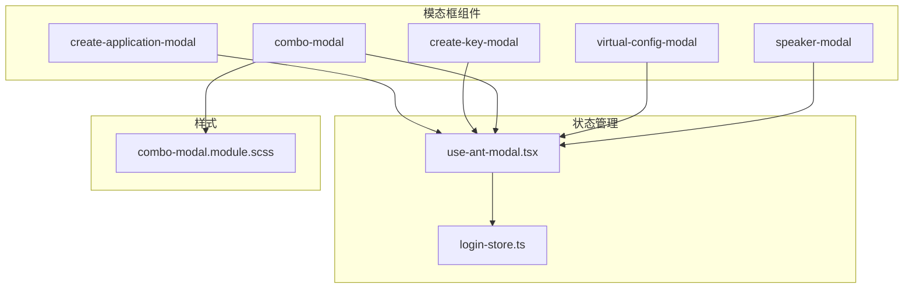
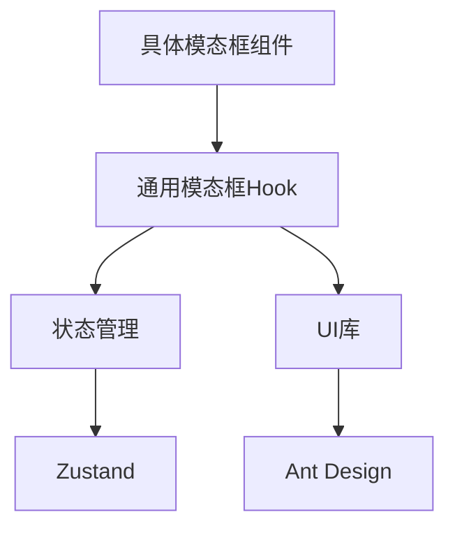
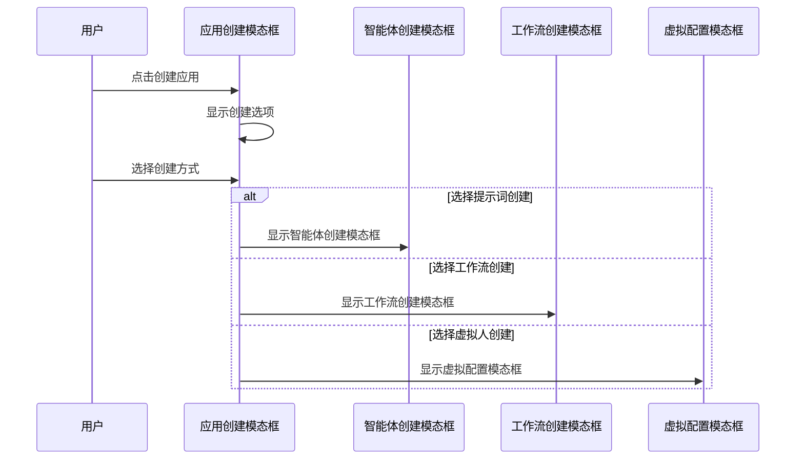
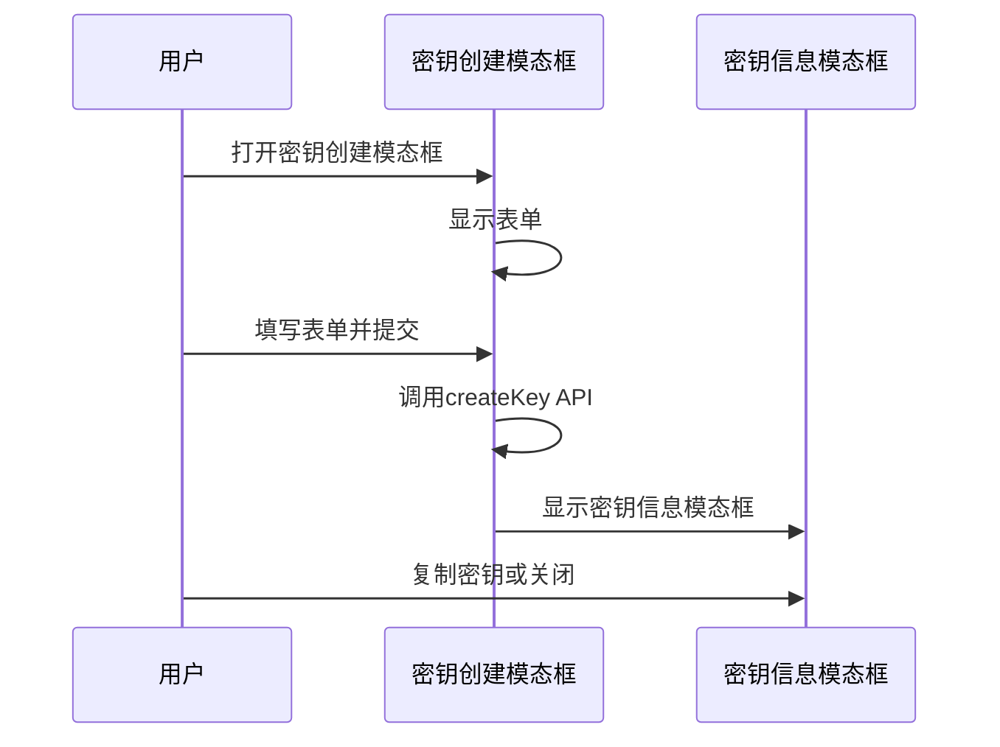
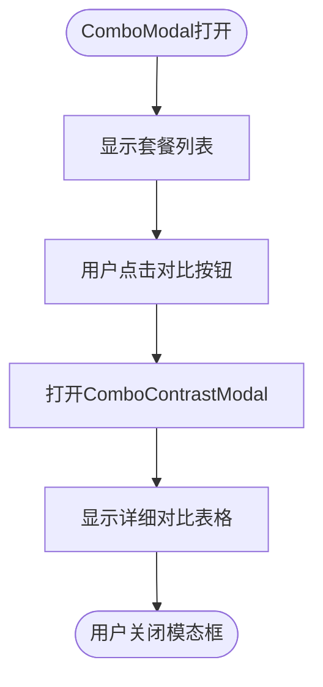
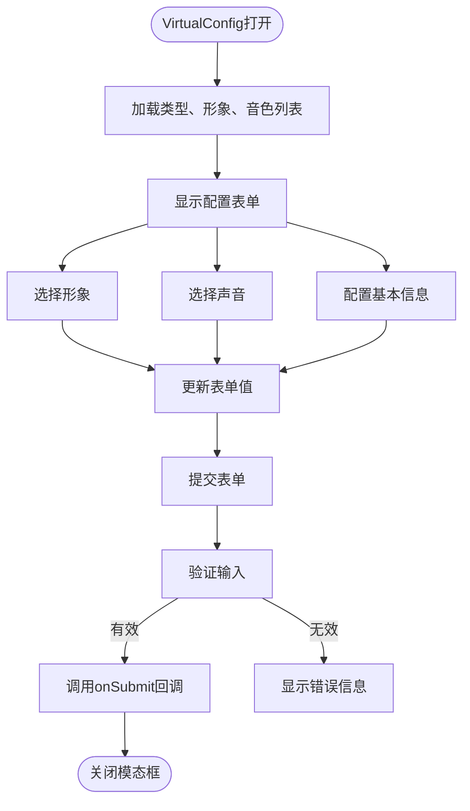
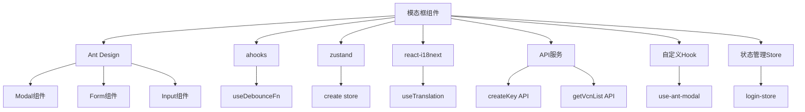

# 模态框组件

<cite>
**本文档引用的文件**  
- [create-application-modal/index.tsx](file://console/frontend/src/components/create-application-modal/index.tsx)
- [create-key-modal/index.tsx](file://console/frontend/src/components/create-key-modal/index.tsx)
- [combo-modal/combo-modal.tsx](file://console/frontend/src/components/combo-modal/combo-modal.tsx)
- [combo-modal/combo-modal.module.scss](file://console/frontend/src/components/combo-modal/combo-modal.module.scss)
- [virtual-config-modal/index.tsx](file://console/frontend/src/components/virtual-config-modal/index.tsx)
- [speaker-modal/index.tsx](file://console/frontend/src/components/speaker-modal/index.tsx)
- [use-ant-modal.tsx](file://console/frontend/src/hooks/use-ant-modal.tsx)
- [login-store.ts](file://console/frontend/src/store/login-store.ts)
</cite>

## 目录
1. [简介](#简介)
2. [项目结构](#项目结构)
3. [核心组件](#核心组件)
4. [架构概述](#架构概述)
5. [详细组件分析](#详细组件分析)
6. [依赖分析](#依赖分析)
7. [性能考虑](#性能考虑)
8. [故障排除指南](#故障排除指南)
9. [结论](#结论)

## 简介
本项目中的模态框组件是用户界面交互的核心部分，用于创建应用、密钥、组合对比、虚拟配置等关键功能。这些模态框通过Ant Design的Modal组件实现，结合自定义样式和状态管理，提供了丰富的用户体验。模态框的设计注重交互细节，包括动画效果、遮罩层行为和键盘事件处理。状态管理采用Zustand和React useState结合的方式，确保组件状态的一致性和可维护性。表单集成方面，通过Ant Design Form组件实现数据绑定和验证。异步操作处理通过Promise和async/await模式实现，确保用户操作的流畅性。错误处理机制包括表单验证错误、API调用错误等，通过message组件向用户提供反馈。

## 项目结构
项目中的模态框组件分布在`console/frontend/src/components/`目录下，每个模态框都有独立的文件夹和组件文件。主要的模态框组件包括应用创建模态框、密钥创建模态框、组合对比模态框和虚拟配置模态框。这些组件通过index.tsx文件导出，便于在其他模块中引用。样式文件采用SCSS格式，与组件文件同名，确保样式的作用域隔离。状态管理相关的hook存放在`hooks`目录下，如`use-ant-modal.tsx`用于封装模态框的通用逻辑。全局状态管理使用Zustand库，相关store文件存放在`store`目录下。

**图表来源**
- [create-application-modal/index.tsx](file://console/frontend/src/components/create-application-modal/index.tsx)
- [create-key-modal/index.tsx](file://console/frontend/src/components/create-key-modal/index.tsx)
- [combo-modal/combo-modal.tsx](file://console/frontend/src/components/combo-modal/combo-modal.tsx)
- [virtual-config-modal/index.tsx](file://console/frontend/src/components/virtual-config-modal/index.tsx)
- [speaker-modal/index.tsx](file://console/frontend/src/components/speaker-modal/index.tsx)
- [use-ant-modal.tsx](file://console/frontend/src/hooks/use-ant-modal.tsx)
- [login-store.ts](file://console/frontend/src/store/login-store.ts)
- [combo-modal/combo-modal.module.scss](file://console/frontend/src/components/combo-modal/combo-modal.module.scss)

## 核心组件
核心模态框组件包括应用创建模态框、密钥创建模态框、组合对比模态框和虚拟配置模态框。这些组件都基于Ant Design的Modal组件进行封装，通过props接收visible和onCancel等控制属性。应用创建模态框用于引导用户创建新的应用，包含选择创建方式的界面。密钥创建模态框用于创建和编辑API密钥，包含表单验证和密钥展示功能。组合对比模态框用于展示不同套餐的对比信息，帮助用户做出选择。虚拟配置模态框用于配置虚拟人的形象和声音，提供丰富的自定义选项。

**章节来源**
- [create-application-modal/index.tsx](file://console/frontend/src/components/create-application-modal/index.tsx#L0-L145)
- [create-key-modal/index.tsx](file://console/frontend/src/components/create-key-modal/index.tsx#L0-L162)
- [combo-modal/combo-modal.tsx](file://console/frontend/src/components/combo-modal/combo-modal.tsx#L0-L190)
- [virtual-config-modal/index.tsx](file://console/frontend/src/components/virtual-config-modal/index.tsx#L0-L799)

## 架构概述
模态框组件的架构采用分层设计，上层是具体的模态框组件，中层是通用的模态框hook，底层是状态管理和UI库。这种架构使得代码具有良好的可维护性和可扩展性。具体模态框组件负责UI展示和业务逻辑，通用hook封装了模态框的打开、关闭、确认等通用行为，状态管理负责跨组件的状态共享。通过这种分层，可以轻松添加新的模态框组件，只需关注业务逻辑的实现，而无需重复编写通用的模态框控制逻辑。

**图表来源**
- [use-ant-modal.tsx](file://console/frontend/src/hooks/use-ant-modal.tsx#L0-L100)
- [login-store.ts](file://console/frontend/src/store/login-store.ts#L0-L20)

## 详细组件分析

### 应用创建模态框分析
应用创建模态框是用户创建新应用的入口，提供多种创建方式的选择。用户可以选择通过提示词创建、工作流创建或虚拟人创建等方式来构建应用。该模态框通过嵌套其他模态框组件来实现不同的创建流程，如AgentCreationModal用于提示词创建，MakeCreateModal用于工作流创建，VirtualConfig用于虚拟人创建。这种设计使得主模态框保持简洁，同时通过组合其他组件实现复杂的功能。

#### 对于API/服务组件：

**图表来源**
- [create-application-modal/index.tsx](file://console/frontend/src/components/create-application-modal/index.tsx#L0-L145)

**章节来源**
- [create-application-modal/index.tsx](file://console/frontend/src/components/create-application-modal/index.tsx#L0-L145)

### 密钥创建模态框分析
密钥创建模态框用于创建和编辑API密钥，包含名称和描述的输入表单。在创建新密钥时，会显示一个信息模态框展示生成的密钥，提醒用户妥善保管。该模态框通过Ant Design的Modal和Form组件实现，利用Form的onFinish回调处理表单提交。对于编辑操作，通过isEdit prop区分创建和编辑模式，并在useEffect中设置初始表单值。密钥展示模态框使用Modal.info方法创建，包含密钥内容和复制按钮，提升用户体验。

#### 对于API/服务组件：

**图表来源**
- [create-key-modal/index.tsx](file://console/frontend/src/components/create-key-modal/index.tsx#L0-L162)

**章节来源**
- [create-key-modal/index.tsx](file://console/frontend/src/components/create-key-modal/index.tsx#L0-L162)

### 组合对比模态框分析
组合对比模态框用于展示不同套餐的对比信息，帮助用户选择合适的套餐。主模态框ComboModal展示各个套餐的基本信息，包括标题、描述、价格和功能列表。用户可以点击"功能/权益对比"按钮打开ComboContrastModal，查看详细的对比表格。该模态框通过useState管理对比模态框的显示状态，并通过props传递onCancel回调来关闭模态框。样式方面，使用SCSS定义了丰富的样式，包括渐变背景、阴影效果和响应式布局。

#### 对于复杂逻辑组件：

**图表来源**
- [combo-modal/combo-modal.tsx](file://console/frontend/src/components/combo-modal/combo-modal.tsx#L0-L190)
- [combo-modal/combo-modal.module.scss](file://console/frontend/src/components/combo-modal/combo-modal.module.scss#L0-L213)

**章节来源**
- [combo-modal/combo-modal.tsx](file://console/frontend/src/components/combo-modal/combo-modal.tsx#L0-L190)
- [combo-modal/combo-modal.module.scss](file://console/frontend/src/components/combo-modal/combo-modal.module.scss#L0-L213)

### 虚拟配置模态框分析
虚拟配置模态框用于配置虚拟人的形象和声音，提供丰富的自定义选项。该模态框包含基本信息输入、形象选择和声音配置三个主要部分。形象选择通过toggleAvatarExpanded函数控制弹窗的显示，声音配置通过toggleVoiceExpanded函数控制折叠状态。状态管理使用多个useState Hook，包括selectedAvatar、selectedVoice、enableAvatar和enableVoice等。通过useEffect Hook在组件挂载时获取类型列表、形象列表和音色列表。表单提交时，将所有配置信息整合到一个对象中，通过onSubmit回调传递给父组件。

#### 对于复杂逻辑组件：

**图表来源**
- [virtual-config-modal/index.tsx](file://console/frontend/src/components/virtual-config-modal/index.tsx#L0-L799)

**章节来源**
- [virtual-config-modal/index.tsx](file://console/frontend/src/components/virtual-config-modal/index.tsx#L0-L799)

## 依赖分析
模态框组件依赖于多个外部库和内部模块。主要依赖包括Ant Design UI库，提供Modal、Form、Input等基础组件；ahooks库，提供useDebounceFn等实用hook；zustand库，用于全局状态管理；react-i18next库，用于国际化支持。内部依赖包括services目录下的API服务模块，用于数据获取和提交；hooks目录下的自定义hook，如use-ant-modal；store目录下的状态管理模块。这些依赖关系通过import语句在组件文件中声明，确保了组件的功能完整性和可维护性。

**图表来源**
- [create-key-modal/index.tsx](file://console/frontend/src/components/create-key-modal/index.tsx#L0-L162)
- [virtual-config-modal/index.tsx](file://console/frontend/src/components/virtual-config-modal/index.tsx#L0-L799)
- [use-ant-modal.tsx](file://console/frontend/src/hooks/use-ant-modal.tsx#L0-L100)
- [login-store.ts](file://console/frontend/src/store/login-store.ts#L0-L20)

**章节来源**
- [create-key-modal/index.tsx](file://console/frontend/src/components/create-key-modal/index.tsx#L0-L162)
- [virtual-config-modal/index.tsx](file://console/frontend/src/components/virtual-config-modal/index.tsx#L0-L799)
- [use-ant-modal.tsx](file://console/frontend/src/hooks/use-ant-modal.tsx#L0-L100)
- [login-store.ts](file://console/frontend/src/store/login-store.ts#L0-L20)

## 性能考虑
模态框组件在性能方面做了多项优化。首先，通过useMemo和useCallback等React Hook避免不必要的重新渲染。其次，对于异步数据获取，使用useEffect的依赖数组确保只在必要时执行。在虚拟配置模态框中，通过filteredAvatarList的useMemo优化形象列表的过滤性能。对于大型列表的渲染，采用分页或虚拟滚动技术，但当前实现中未使用这些技术，可能在数据量大时影响性能。此外，通过debounce技术优化频繁触发的操作，如输入框的搜索功能。内存泄漏预防方面，所有useEffect都返回清理函数，及时移除事件监听器和定时器。

## 故障排除指南
常见问题包括模态框无法打开或关闭、表单验证失败、API调用错误等。对于模态框无法打开的问题，检查visible prop的值是否正确传递，以及父组件的状态管理是否正常。对于表单验证失败，检查Form.Item的rules配置是否正确，以及输入值是否符合预期格式。API调用错误通常由网络问题或参数错误引起，可通过浏览器开发者工具的Network面板查看请求详情。对于状态更新不及时的问题，确保使用了正确的状态更新函数，并在必要时使用useEffect监听状态变化。调试时，可使用console.log输出关键变量的值，或使用React DevTools检查组件状态。

**章节来源**
- [create-key-modal/index.tsx](file://console/frontend/src/components/create-key-modal/index.tsx#L0-L162)
- [virtual-config-modal/index.tsx](file://console/frontend/src/components/virtual-config-modal/index.tsx#L0-L799)

## 结论
本项目的模态框组件设计合理，功能完整，提供了良好的用户体验。通过分层架构和组件化设计，实现了代码的高内聚低耦合。状态管理采用Zustand和React useState结合的方式，既满足了全局状态共享的需求，又保持了组件的独立性。表单集成和异步操作处理规范，错误处理机制完善。未来可考虑引入虚拟滚动技术优化大型列表的渲染性能，以及使用更严格的类型定义提高代码的可维护性。总体而言，这些模态框组件为项目的用户交互提供了坚实的基础。