# 配置类模态框设计与实现深度分析

<cite>
**本文档引用的文件**
- [combo-modal.tsx](file://console/frontend/src/components/combo-modal/combo-modal.tsx)
- [combo-contrast-modal.tsx](file://console/frontend/src/components/combo-modal/combo-contrast-modal.tsx)
- [virtual-config-modal.tsx](file://console/frontend/src/components/virtual-config-modal/index.tsx)
- [iconModal.tsx](file://console/frontend/src/components/virtual-config-modal/component/iconModal.tsx)
- [speaker-modal.tsx](file://console/frontend/src/components/speaker-modal/index.tsx)
- [order-store.ts](file://console/frontend/src/store/spark-store/order-store.ts)
- [combo-config.ts](file://console/frontend/src/components/combo-modal/combo-config.ts)
- [use-infinite-scroll.ts](file://console/frontend/src/pages/resource-management/database/hooks/use-infinite-scroll.ts)
- [use-pagination.ts](file://console/frontend/src/pages/resource-management/upload-page/components/hooks/use-pagination.ts)
</cite>

## 目录
1. [引言](#引言)
2. [项目架构概览](#项目架构概览)
3. [组合对比模态框设计](#组合对比模态框设计)
4. [虚拟配置模态框实现](#虚拟配置模态框实现)
5. [状态管理系统](#状态管理系统)
6. [高级交互功能](#高级交互功能)
7. [性能优化策略](#性能优化策略)
8. [配置预览与差异对比](#配置预览与差异对比)
9. [故障排除指南](#故障排除指南)
10. [总结](#总结)

## 引言

配置类模态框是现代Web应用中不可或缺的交互组件，特别是在复杂的AI Agent平台中。本文档深入分析了astron-agent项目中配置类模态框的设计理念、实现细节和最佳实践，重点关注组合对比模态框和虚拟配置模态框这两个核心组件的复杂交互逻辑。

这些模态框不仅承担着配置管理的核心职责，还通过精心设计的状态管理机制、动态表单渲染和选项间依赖关系处理，为用户提供流畅的配置体验。

## 项目架构概览

配置类模态框系统采用模块化架构设计，主要包含以下核心组件：

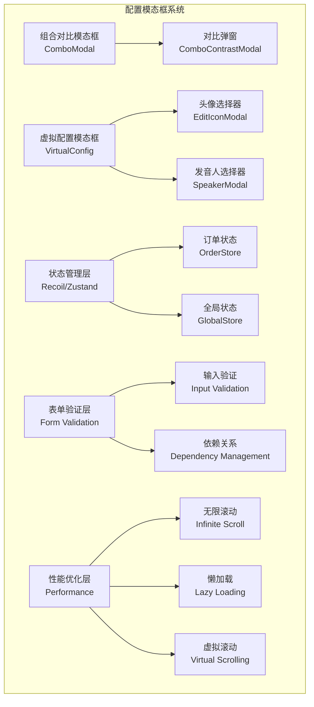

**图表来源**
- [combo-modal.tsx](file://console/frontend/src/components/combo-modal/combo-modal.tsx#L1-L50)
- [virtual-config-modal.tsx](file://console/frontend/src/components/virtual-config-modal/index.tsx#L1-L100)
- [order-store.ts](file://console/frontend/src/store/spark-store/order-store.ts#L1-L50)

**章节来源**
- [combo-modal.tsx](file://console/frontend/src/components/combo-modal/combo-modal.tsx#L1-L200)
- [virtual-config-modal.tsx](file://console/frontend/src/components/virtual-config-modal/index.tsx#L1-L300)

## 组合对比模态框设计

### 架构设计与组件层次

组合对比模态框采用了双层嵌套的组件架构，主模态框负责展示套餐信息，子模态框提供详细的权益对比功能。

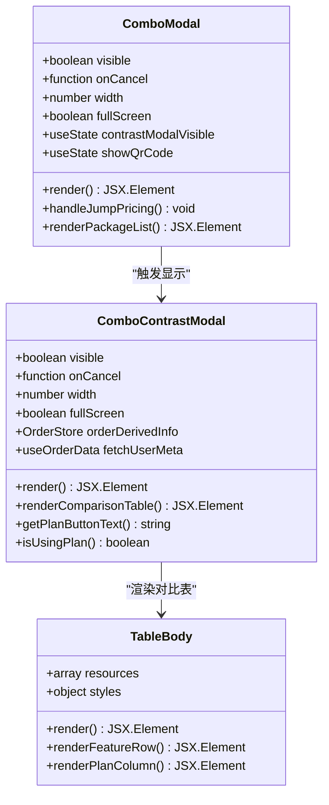

**图表来源**
- [combo-modal.tsx](file://console/frontend/src/components/combo-modal/combo-modal.tsx#L15-L50)
- [combo-contrast-modal.tsx](file://console/frontend/src/components/combo-modal/combo-contrast-modal.tsx#L15-L60)

### 多步骤配置流程

组合对比模态框实现了精心设计的多步骤配置流程，包括套餐选择、权益对比和购买决策三个阶段：

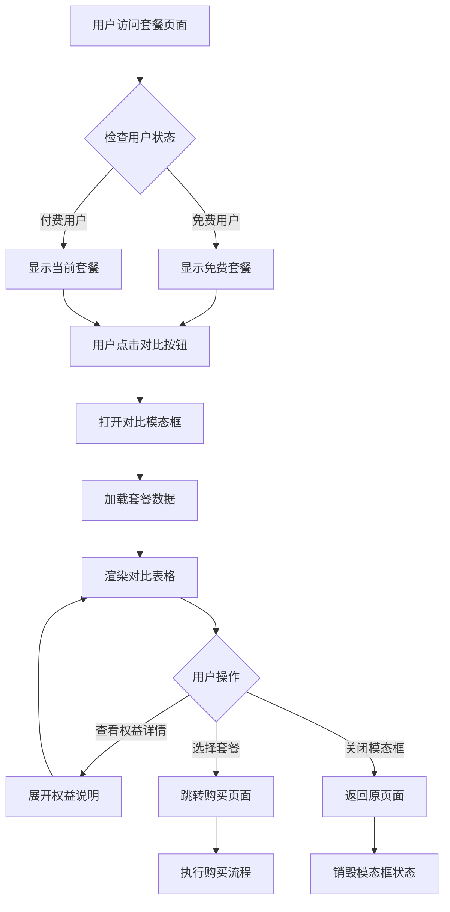

**图表来源**
- [combo-contrast-modal.tsx](file://console/frontend/src/components/combo-modal/combo-contrast-modal.tsx#L80-L150)

### 动态表单渲染与状态管理

组合对比模态框通过Recoil状态管理系统实现复杂的动态表单渲染：

| 状态属性 | 类型 | 描述 | 更新触发条件 |
|---------|------|------|-------------|
| `orderShowArr` | number[] | 套餐显示数组 | 用户订单变更时 |
| `useOrder` | OrderMetaType | 当前使用套餐 | 订单状态变化时 |
| `orderTraceAndIcon` | number | 套餐标识 | 空间类型切换时 |
| `userOrderMeta` | OrderMetaType[] | 用户订单元数据 | 订单查询完成时 |

**章节来源**
- [combo-contrast-modal.tsx](file://console/frontend/src/components/combo-modal/combo-contrast-modal.tsx#L60-L120)
- [order-store.ts](file://console/frontend/src/store/spark-store/order-store.ts#L80-L150)

## 虚拟配置模态框实现

### 核心功能架构

虚拟配置模态框是一个高度复杂的组件，集成了头像选择、语音配置、形象管理等多个子功能模块：

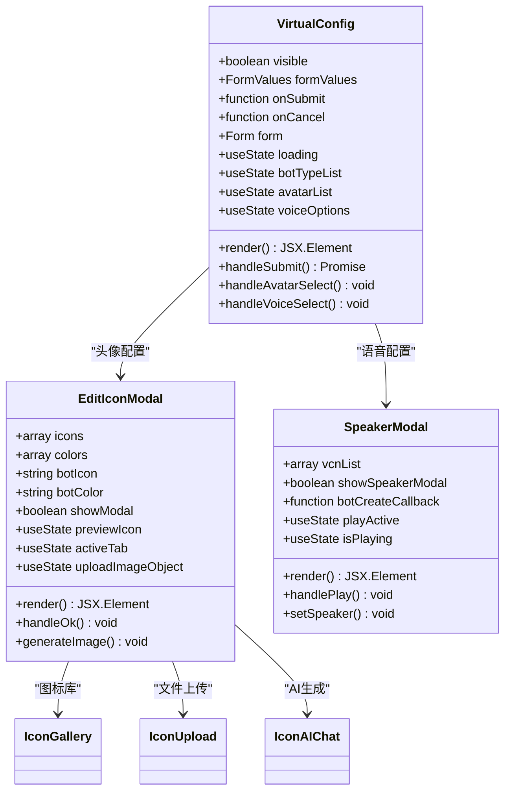

**图表来源**
- [virtual-config-modal.tsx](file://console/frontend/src/components/virtual-config-modal/index.tsx#L80-L150)
- [iconModal.tsx](file://console/frontend/src/components/virtual-config-modal/component/iconModal.tsx#L1-L50)
- [speaker-modal.tsx](file://console/frontend/src/components/speaker-modal/index.tsx#L1-L50)

### 选项间依赖关系处理

虚拟配置模态框实现了复杂的选项间依赖关系处理机制：

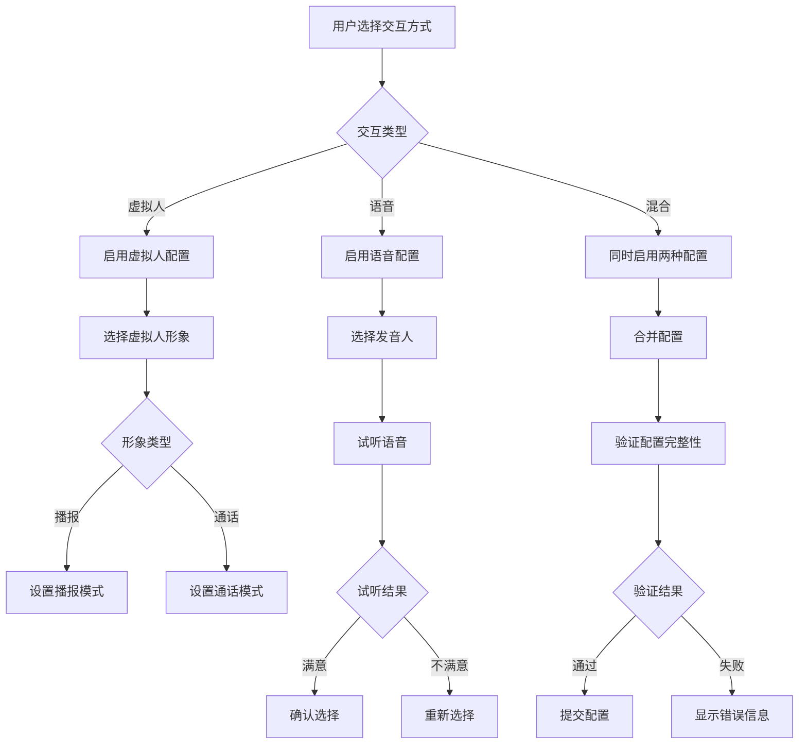

**图表来源**
- [virtual-config-modal.tsx](file://console/frontend/src/components/virtual-config-modal/index.tsx#L400-L500)

### 多媒体处理与实时预览

虚拟配置模态框集成了多种多媒体处理功能：

| 功能模块 | 技术实现 | 性能优化 | 用户体验 |
|---------|----------|----------|----------|
| 头像上传 | 文件验证 + 图片压缩 | 2MB限制 + 格式校验 | 实时预览 + 缩放功能 |
| AI生成头像 | 图像生成API | 异步处理 + 加载指示 | 即时反馈 + 自动下载 |
| 语音试听 | WebAudio API | 单声道播放 + 自动停止 | 连续播放控制 |
| 形象预览 | Canvas渲染 | 懒加载 + 缓存机制 | 流畅切换动画 |

**章节来源**
- [iconModal.tsx](file://console/frontend/src/components/virtual-config-modal/component/iconModal.tsx#L300-L400)
- [virtual-config-modal.tsx](file://console/frontend/src/components/virtual-config-modal/index.tsx#L600-L700)

## 状态管理系统

### Zustand状态管理

项目采用Zustand作为主要的状态管理解决方案，特别是用于订单状态管理：

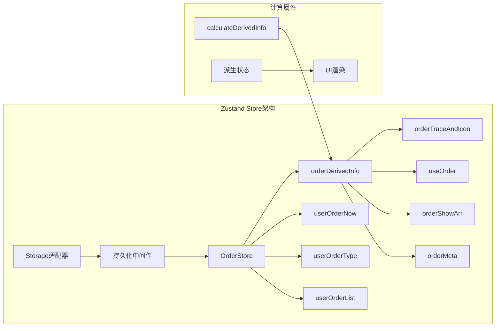

**图表来源**
- [order-store.ts](file://console/frontend/src/store/spark-store/order-store.ts#L15-L80)

### 状态同步机制

配置类模态框实现了多层次的状态同步机制：

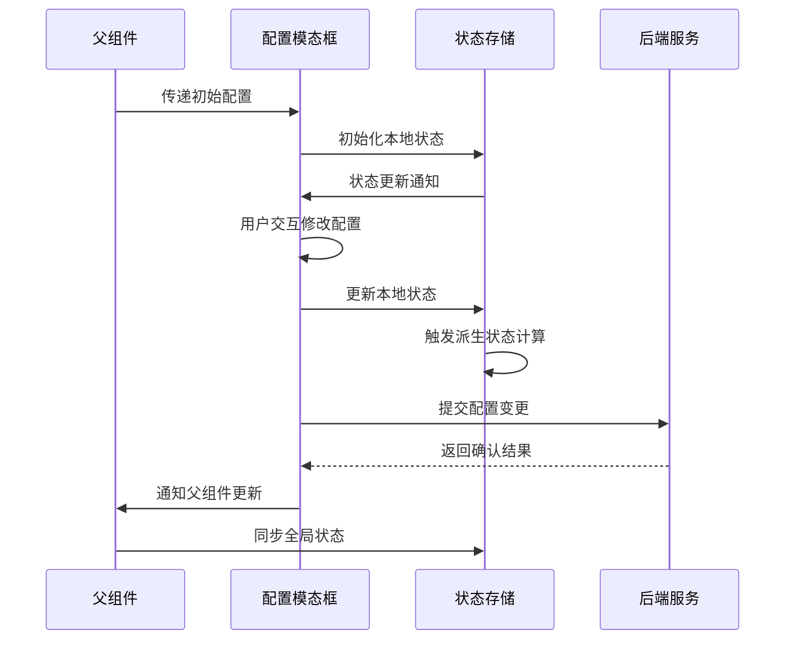

**图表来源**
- [order-store.ts](file://console/frontend/src/store/spark-store/order-store.ts#L120-L180)

**章节来源**
- [order-store.ts](file://console/frontend/src/store/spark-store/order-store.ts#L1-L209)

## 高级交互功能

### 表单验证与规则引擎

配置类模态框实现了复杂的表单验证系统：

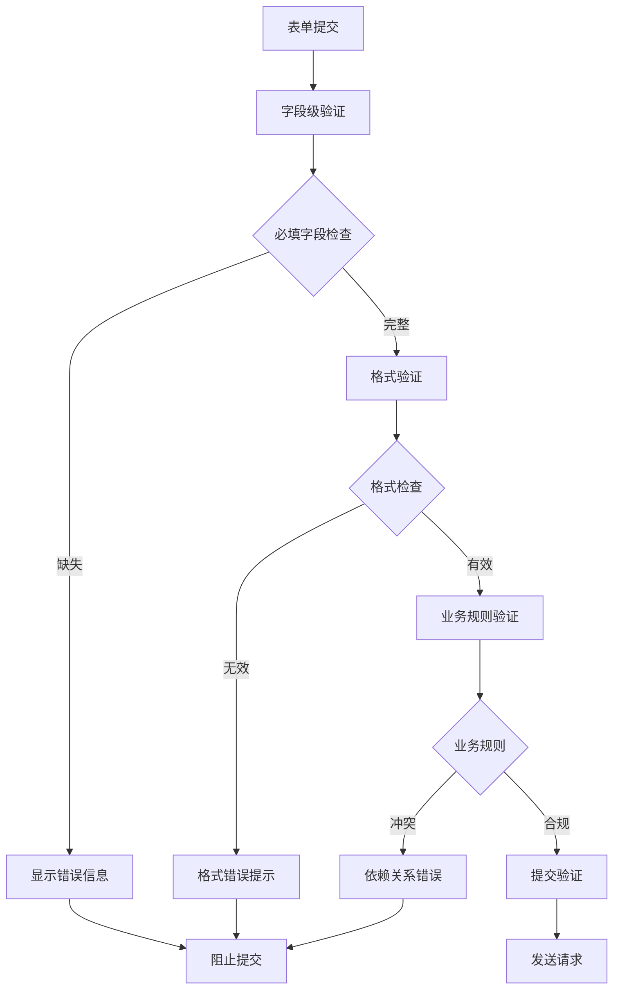

**图表来源**
- [virtual-config-modal.tsx](file://console/frontend/src/components/virtual-config-modal/index.tsx#L500-L600)

### 实时配置预览

模态框提供了实时配置预览功能，允许用户即时看到配置变更的效果：

| 预览类型 | 更新频率 | 性能优化 | 用户反馈 |
|---------|----------|----------|----------|
| 头像预览 | 实时 | 缓存机制 | 即时视觉反馈 |
| 语音试听 | 按需 | 单声道播放 | 音频质量保证 |
| 形象切换 | 动画过渡 | 预加载资源 | 流畅用户体验 |
| 配置对比 | 批量更新 | 防抖处理 | 准确的数据展示 |

**章节来源**
- [virtual-config-modal.tsx](file://console/frontend/src/components/virtual-config-modal/index.tsx#L700-L800)

## 性能优化策略

### 无限滚动与虚拟滚动技术

项目实现了多种性能优化技术来处理大型配置表单：

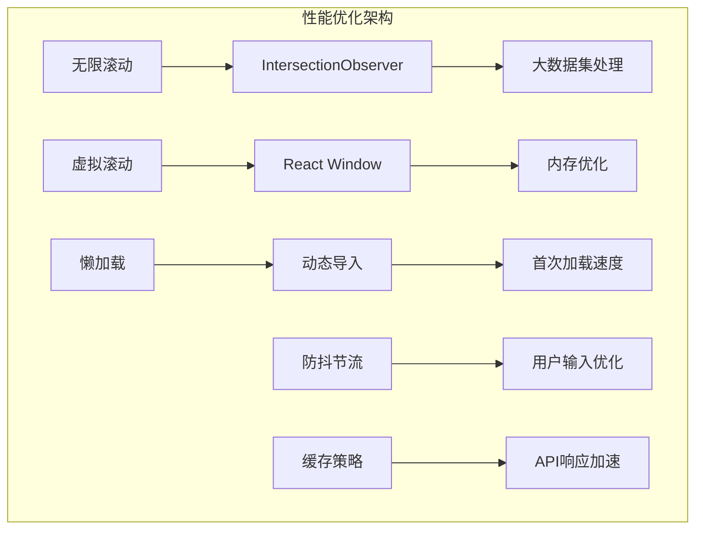

**图表来源**
- [use-infinite-scroll.ts](file://console/frontend/src/pages/resource-management/database/hooks/use-infinite-scroll.ts#L1-L34)
- [use-pagination.ts](file://console/frontend/src/pages/resource-management/upload-page/components/hooks/use-pagination.ts#L1-L50)

### 大型配置表单的优化技术

针对大型配置表单，项目采用了以下优化策略：

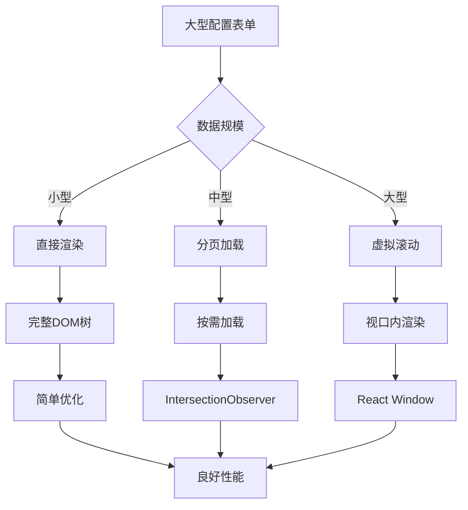

**图表来源**
- [use-infinite-scroll.ts](file://console/frontend/src/pages/resource-management/database/hooks/use-infinite-scroll.ts#L10-L34)

**章节来源**
- [use-infinite-scroll.ts](file://console/frontend/src/pages/resource-management/database/hooks/use-infinite-scroll.ts#L1-L34)
- [use-pagination.ts](file://console/frontend/src/pages/resource-management/upload-page/components/hooks/use-pagination.ts#L1-L100)

## 配置预览与差异对比

### 实时配置预览系统

配置类模态框提供了强大的实时配置预览功能：

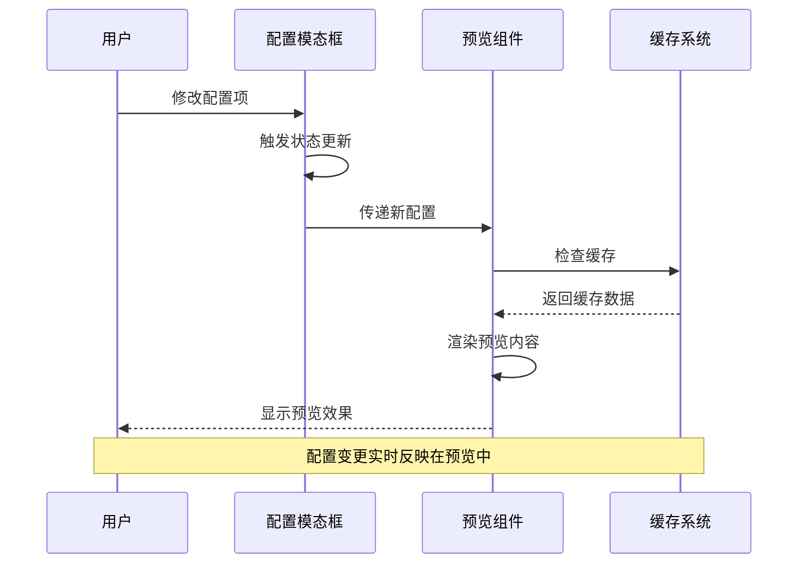

**图表来源**
- [virtual-config-modal.tsx](file://console/frontend/src/components/virtual-config-modal/index.tsx#L800-L900)

### 差异对比功能实现

模态框实现了智能的配置差异对比功能：

| 对比维度 | 实现方式 | 性能考虑 | 用户价值 |
|---------|----------|----------|----------|
| 配置项差异 | 深度比较算法 | 差异检测优化 | 突出变更内容 |
| 效果对比 | 实时渲染预览 | 预览缓存机制 | 直观效果展示 |
| 性能影响 | 防抖处理 | 异步计算 | 流畅用户体验 |
| 数据准确性 | 版本控制 | 冲突检测 | 配置安全保证 |

**章节来源**
- [combo-contrast-modal.tsx](file://console/frontend/src/components/combo-modal/combo-contrast-modal.tsx#L150-L224)

## 故障排除指南

### 常见问题与解决方案

配置类模态框在实际使用中可能遇到的问题及解决方案：

| 问题类型 | 症状描述 | 根本原因 | 解决方案 |
|---------|----------|----------|----------|
| 状态同步失败 | 配置变更未生效 | 状态管理冲突 | 重置状态树 |
| 性能下降 | 模态框响应缓慢 | 内存泄漏 | 实施垃圾回收 |
| 数据丢失 | 配置意外重置 | 网络请求失败 | 添加重试机制 |
| 渲染错误 | 组件显示异常 | 类型不匹配 | 强类型检查 |

### 调试技巧与工具

推荐的调试方法和工具：

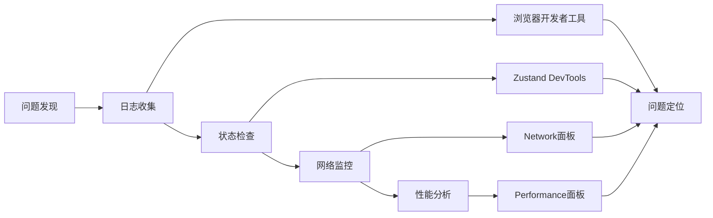

**章节来源**
- [virtual-config-modal.tsx](file://console/frontend/src/components/virtual-config-modal/index.tsx#L1000-L1303)

## 总结

配置类模态框作为现代Web应用的核心交互组件，其设计和实现体现了复杂性与可用性的完美平衡。通过深入分析astron-agent项目的配置类模态框实现，我们可以看到：

1. **架构设计的合理性**：采用模块化架构，清晰的组件层次结构，便于维护和扩展。

2. **状态管理的先进性**：结合Zustand和Recoil等现代状态管理工具，实现了高效的状态同步和派生状态计算。

3. **交互体验的精致性**：通过实时预览、智能验证和流畅动画，提供了优秀的用户体验。

4. **性能优化的专业性**：运用无限滚动、虚拟滚动和懒加载等技术，确保了大型配置表单的流畅运行。

5. **可扩展性的前瞻性**：预留了充足的扩展点，支持未来功能的平滑集成。

这些设计理念和实现技巧不仅适用于配置类模态框，也为其他复杂交互组件的设计提供了宝贵的参考价值。随着Web技术的不断发展，配置类模态框将继续演进，为用户提供更加智能化和个性化的配置体验。