# 组件体系

<cite>
**本文档引用的文件**
- [index.tsx](file://console/frontend/src/components/workflow/nodes/index.tsx)
- [panel/index.tsx](file://console/frontend/src/components/workflow/panel/index.tsx)
- [edges/index.tsx](file://console/frontend/src/components/workflow/edges/index.tsx)
- [reactflowUtils.ts](file://console/frontend/src/components/workflow/utils/reactflowUtils.ts)
- [start/index.tsx](file://console/frontend/src/components/workflow/nodes/start/index.tsx)
- [end/index.tsx](file://console/frontend/src/components/workflow/nodes/end/index.tsx)
- [llm/index.tsx](file://console/frontend/src/components/workflow/nodes/llm/index.tsx)
- [database/index.tsx](file://console/frontend/src/components/workflow/nodes/database/index.tsx)
- [flow-edit/index.tsx](file://console/frontend/src/components/workflow/modal/flow-edit/index.tsx)
- [flow-input.tsx](file://console/frontend/src/components/workflow/ui/flow-input.tsx)
- [flow-select.tsx](file://console/frontend/src/components/workflow/ui/flow-select.tsx)
- [flow-textarea.tsx](file://console/frontend/src/components/workflow/ui/flow-textarea.tsx)
- [use-flow-store.ts](file://console/frontend/src/components/workflow/store/use-flow-store.ts)
- [index.ts](file://console/frontend/src/components/workflow/types/index.ts)
</cite>

## 目录
1. [简介](#简介)
2. [项目结构](#项目结构)
3. [核心组件](#核心组件)
4. [架构概述](#架构概述)
5. [详细组件分析](#详细组件分析)
6. [依赖分析](#依赖分析)
7. [性能考虑](#性能考虑)
8. [故障排除指南](#故障排除指南)
9. [结论](#结论)
10. [附录](#附录)（如有必要）

## 简介
本文档详细描述了astron-agent项目中工作流相关组件的实现。重点分析了React组件的层次结构和设计模式，特别是workflow目录下的节点、边、画布等可视化组件的实现。文档解释了组件的props、state、事件处理机制，详细说明了UI组件库的设计，包括按钮组、模态框、表单控件等的实现。涵盖了组件的样式管理（使用Tailwind CSS和SCSS）、响应式设计、可访问性（a11y）考虑。提供了组件关系图，展示组件间的组合和通信模式。

## 项目结构
项目中的工作流组件位于`console/frontend/src/components/workflow`目录下，采用模块化的设计结构。该目录包含了节点（nodes）、边（edges）、面板（panel）、模态框（modal）、UI组件（ui）、存储（store）、类型定义（types）和工具函数（utils）等子模块。

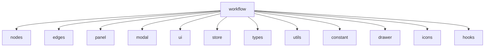

**Diagram sources**
- [console/frontend/src/components/workflow](file://console/frontend/src/components/workflow)

**Section sources**
- [console/frontend/src/components/workflow](file://console/frontend/src/components/workflow)

## 核心组件
工作流系统的核心组件包括节点（Node）、边（Edge）和画布（Canvas）。这些组件共同构成了可视化工作流编辑器的基础。节点组件负责表示工作流中的各个处理单元，边组件用于连接节点形成工作流的逻辑路径，画布组件则提供了节点和边的容器以及交互控制。

**Section sources**
- [console/frontend/src/components/workflow/nodes/index.tsx](file://console/frontend/src/components/workflow/nodes/index.tsx)
- [console/frontend/src/components/workflow/edges/index.tsx](file://console/frontend/src/components/workflow/edges/index.tsx)
- [console/frontend/src/components/workflow/panel/index.tsx](file://console/frontend/src/components/workflow/panel/index.tsx)

## 架构概述
工作流系统的架构基于React Flow库构建，采用了组件化和状态管理的设计模式。系统通过Zustand进行状态管理，实现了组件间的高效通信。UI组件库提供了统一的表单控件和交互元素，确保了界面的一致性和可维护性。

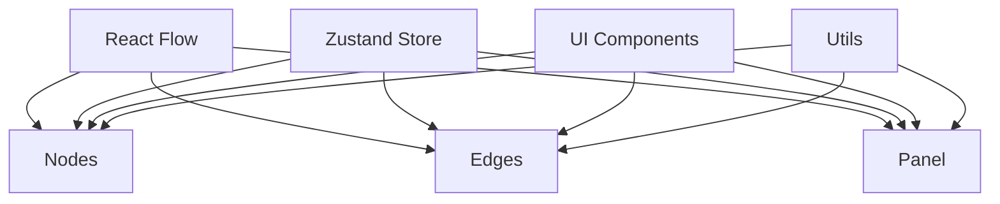

**Diagram sources**
- [console/frontend/src/components/workflow](file://console/frontend/src/components/workflow)
- [console/frontend/src/components/workflow/store/use-flow-store.ts](file://console/frontend/src/components/workflow/store/use-flow-store.ts)

## 详细组件分析
本节详细分析工作流系统中的关键组件，包括节点、边、UI组件和模态框的实现。

### 节点组件分析
节点组件是工作流系统的核心构建块，负责表示工作流中的各个处理单元。所有节点都继承自BaseNode组件，该组件根据节点类型决定渲染普通节点还是迭代器子节点。

#### 节点层次结构
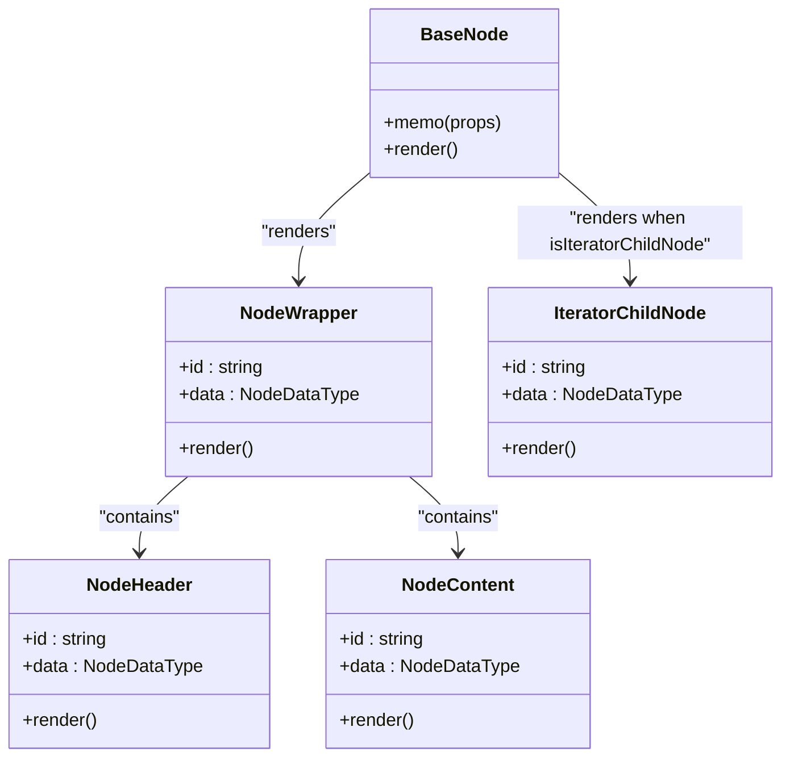

**Diagram sources**
- [console/frontend/src/components/workflow/nodes/index.tsx](file://console/frontend/src/components/workflow/nodes/index.tsx)
- [console/frontend/src/components/workflow/nodes/node-common](file://console/frontend/src/components/workflow/nodes/node-common)

**Section sources**
- [console/frontend/src/components/workflow/nodes/index.tsx](file://console/frontend/src/components/workflow/nodes/index.tsx)

#### 特定节点类型
工作流系统实现了多种特定类型的节点，每种节点都有其独特的功能和配置界面。

##### 开始节点
开始节点（Start Node）是工作流的入口点，允许用户配置输出参数。

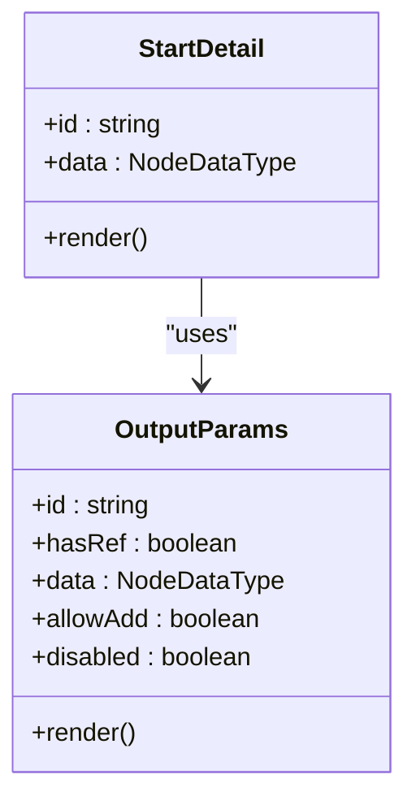

**Diagram sources**
- [console/frontend/src/components/workflow/nodes/start/index.tsx](file://console/frontend/src/components/workflow/nodes/start/index.tsx)
- [console/frontend/src/components/workflow/nodes/components/outputs](file://console/frontend/src/components/workflow/nodes/components/outputs)

**Section sources**
- [console/frontend/src/components/workflow/nodes/start/index.tsx](file://console/frontend/src/components/workflow/nodes/start/index.tsx)

##### 结束节点
结束节点（End Node）是工作流的出口点，支持不同的输出模式，包括返回参数和返回格式。

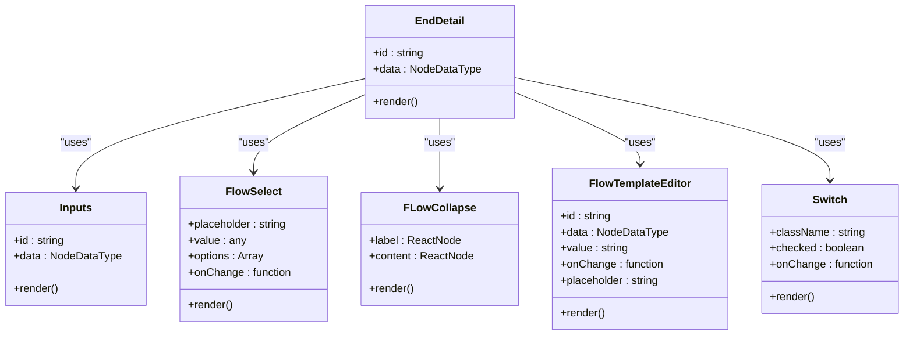

**Diagram sources**
- [console/frontend/src/components/workflow/nodes/end/index.tsx](file://console/frontend/src/components/workflow/nodes/end/index.tsx)
- [console/frontend/src/components/workflow/ui](file://console/frontend/src/components/workflow/ui)
- [console/frontend/src/components/workflow/nodes/components/inputs](file://console/frontend/src/components/workflow/nodes/components/inputs)

**Section sources**
- [console/frontend/src/components/workflow/nodes/end/index.tsx](file://console/frontend/src/components/workflow/nodes/end/index.tsx)

##### 大模型节点
大模型节点（Large Model Node）用于配置和调用大语言模型，支持系统提示和用户提示的配置。

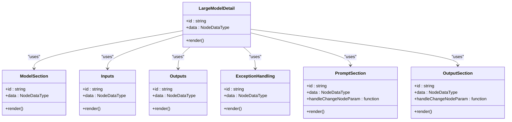

**Diagram sources**
- [console/frontend/src/components/workflow/nodes/llm/index.tsx](file://console/frontend/src/components/workflow/nodes/llm/index.tsx)
- [console/frontend/src/components/workflow/nodes/node-common](file://console/frontend/src/components/workflow/nodes/node-common)
- [console/frontend/src/components/workflow/ui](file://console/frontend/src/components/workflow/ui)

**Section sources**
- [console/frontend/src/components/workflow/nodes/llm/index.tsx](file://console/frontend/src/components/workflow/nodes/llm/index.tsx)

##### 数据库节点
数据库节点（Database Node）用于配置和执行数据库操作，支持自定义SQL和表单数据处理两种模式。

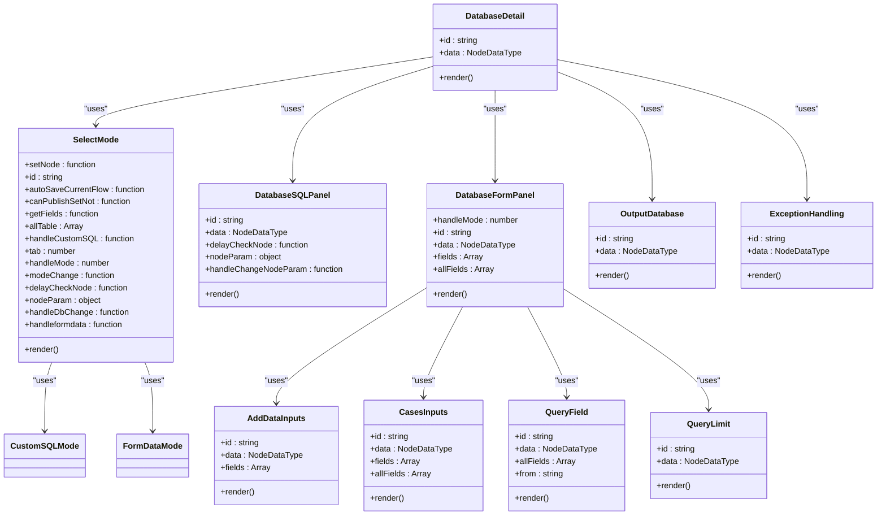

**Diagram sources**
- [console/frontend/src/components/workflow/nodes/database/index.tsx](file://console/frontend/src/components/workflow/nodes/database/index.tsx)
- [console/frontend/src/components/workflow/nodes/components](file://console/frontend/src/components/workflow/nodes/components)
- [console/frontend/src/components/workflow/ui](file://console/frontend/src/components/workflow/ui)

**Section sources**
- [console/frontend/src/components/workflow/nodes/database/index.tsx](file://console/frontend/src/components/workflow/nodes/database/index.tsx)

### 边组件分析
边组件用于连接工作流中的节点，表示数据流和控制流的方向。边组件支持点击删除操作，并根据画布的禁用状态决定是否显示删除按钮。

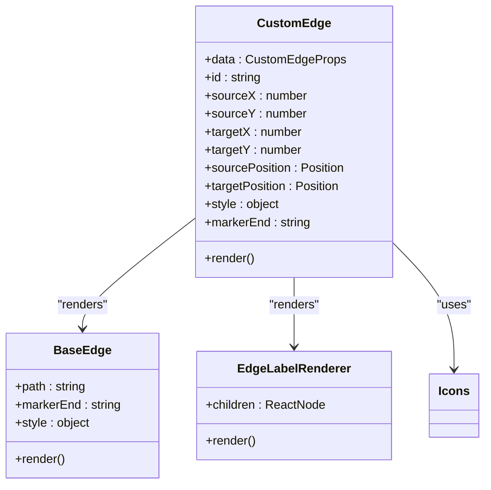

**Diagram sources**
- [console/frontend/src/components/workflow/edges/index.tsx](file://console/frontend/src/components/workflow/edges/index.tsx)
- [console/frontend/src/components/workflow/icons](file://console/frontend/src/components/workflow/icons)

**Section sources**
- [console/frontend/src/components/workflow/edges/index.tsx](file://console/frontend/src/components/workflow/edges/index.tsx)

### UI组件库分析
UI组件库提供了统一的表单控件和交互元素，确保了界面的一致性和可维护性。这些组件基于Ant Design进行封装，添加了工作流特定的样式和行为。

#### 输入组件
输入组件（FlowInput）封装了原生input元素，阻止了键盘事件的冒泡，避免了与画布交互的冲突。

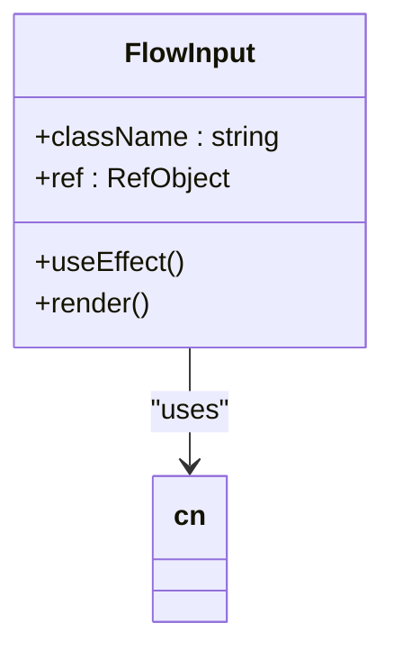

**Diagram sources**
- [console/frontend/src/components/workflow/ui/flow-input.tsx](file://console/frontend/src/components/workflow/ui/flow-input.tsx)
- [console/frontend/src/utils](file://console/frontend/src/utils)

**Section sources**
- [console/frontend/src/components/workflow/ui/flow-input.tsx](file://console/frontend/src/components/workflow/ui/flow-input.tsx)

#### 选择组件
选择组件（FlowSelect）封装了Ant Design的Select组件，添加了自定义的下拉箭头图标和滚动事件处理。

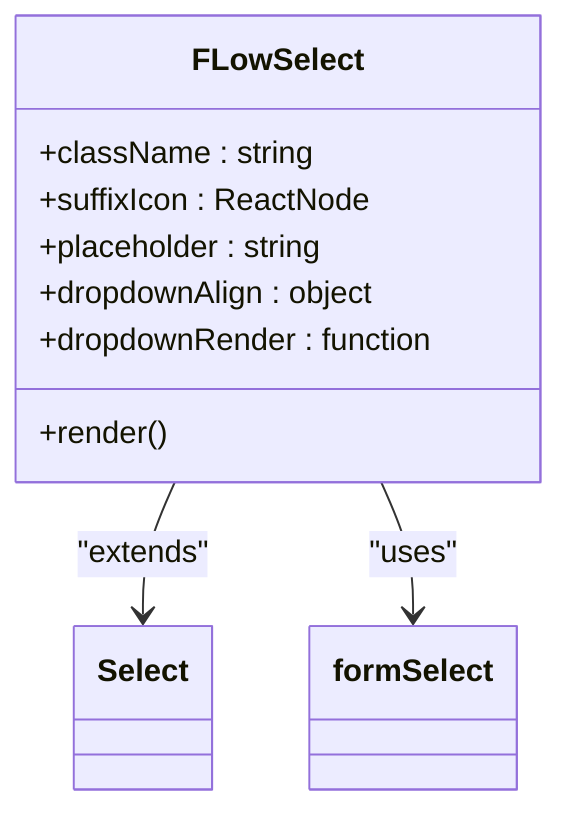

**Diagram sources**
- [console/frontend/src/components/workflow/ui/flow-select.tsx](file://console/frontend/src/components/workflow/ui/flow-select.tsx)
- [console/frontend/src/assets/imgs/main/icon_nav_dropdown.svg](file://console/frontend/src/assets/imgs/main/icon_nav_dropdown.svg)

**Section sources**
- [console/frontend/src/components/workflow/ui/flow-select.tsx](file://console/frontend/src/components/workflow/ui/flow-select.tsx)

#### 文本域组件
文本域组件（FlowTextArea）封装了原生textarea元素，支持自适应高度和滚动事件控制。

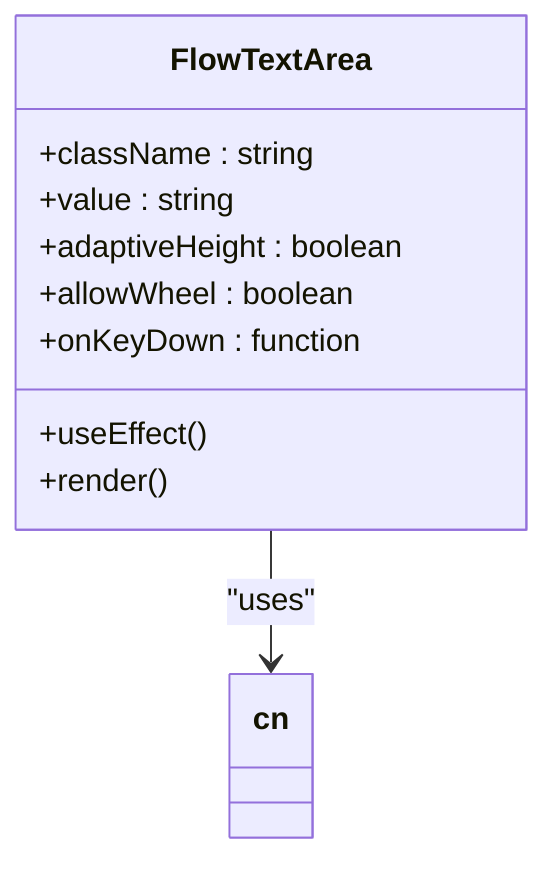

**Diagram sources**
- [console/frontend/src/components/workflow/ui/flow-textarea.tsx](file://console/frontend/src/components/workflow/ui/flow-textarea.tsx)
- [console/frontend/src/utils](file://console/frontend/src/utils)

**Section sources**
- [console/frontend/src/components/workflow/ui/flow-textarea.tsx](file://console/frontend/src/components/workflow/ui/flow-textarea.tsx)

### 模态框组件分析
模态框组件用于提供工作流的编辑和配置界面，支持工作流名称、描述、分类等信息的修改。

#### 工作流编辑模态框
工作流编辑模态框（EditModal）提供了工作流的完整编辑界面，包括名称、描述、分类和图标的选择。

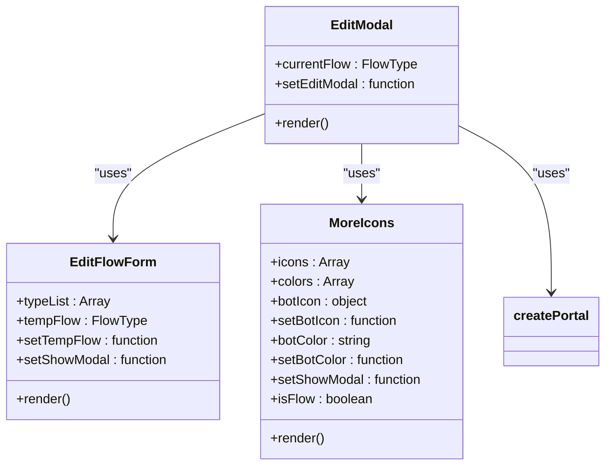

**Diagram sources**
- [console/frontend/src/components/workflow/modal/flow-edit/index.tsx](file://console/frontend/src/components/workflow/modal/flow-edit/index.tsx)
- [console/frontend/src/components/workflow/modal/flow-edit/more-icons](file://console/frontend/src/components/workflow/modal/flow-edit/more-icons)

**Section sources**
- [console/frontend/src/components/workflow/modal/flow-edit/index.tsx](file://console/frontend/src/components/workflow/modal/flow-edit/index.tsx)

## 依赖分析
工作流系统的组件间存在复杂的依赖关系，通过状态管理和事件处理机制实现组件间的通信和数据共享。

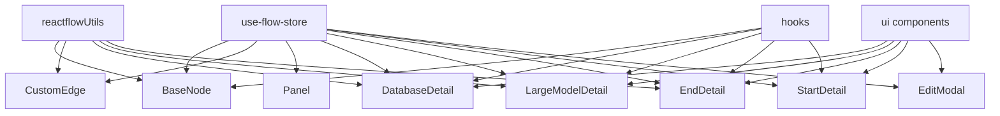

**Diagram sources**
- [console/frontend/src/components/workflow/store/use-flow-store.ts](file://console/frontend/src/components/workflow/store/use-flow-store.ts)
- [console/frontend/src/components/workflow/utils/reactflowUtils.ts](file://console/frontend/src/components/workflow/utils/reactflowUtils.ts)
- [console/frontend/src/components/workflow/ui](file://console/frontend/src/components/workflow/ui)
- [console/frontend/src/components/workflow/hooks](file://console/frontend/src/components/workflow/hooks)

**Section sources**
- [console/frontend/src/components/workflow/store/use-flow-store.ts](file://console/frontend/src/components/workflow/store/use-flow-store.ts)
- [console/frontend/src/components/workflow/utils/reactflowUtils.ts](file://console/frontend/src/components/workflow/utils/reactflowUtils.ts)

## 性能考虑
工作流系统在性能方面进行了多项优化，包括组件的memoization、事件处理的优化和状态管理的效率提升。通过使用React的memo高阶组件，避免了不必要的重新渲染。在事件处理方面，通过useMemoizedFn等工具函数优化了函数的创建和调用。状态管理采用Zustand，提供了高效的订阅和更新机制。

## 故障排除指南
当工作流组件出现问题时，可以按照以下步骤进行排查：
1. 检查节点参数是否完整且正确
2. 验证节点间的连接是否符合逻辑
3. 确认状态管理store中的数据是否正确
4. 检查UI组件的props传递是否正确
5. 查看控制台是否有错误信息

**Section sources**
- [console/frontend/src/components/workflow/utils/reactflowUtils.ts](file://console/frontend/src/components/workflow/utils/reactflowUtils.ts)
- [console/frontend/src/components/workflow/store/use-flow-store.ts](file://console/frontend/src/components/workflow/store/use-flow-store.ts)

## 结论
本文档详细分析了astron-agent项目中工作流相关组件的实现。通过模块化的设计和组件化的架构，工作流系统实现了高度的可扩展性和可维护性。UI组件库提供了统一的界面元素，确保了用户体验的一致性。状态管理机制有效地协调了组件间的通信和数据共享。整体架构设计合理，为复杂的工作流编辑提供了稳定可靠的基础。

## 附录
### 类型定义
工作流系统使用TypeScript进行类型定义，确保了代码的类型安全和可维护性。

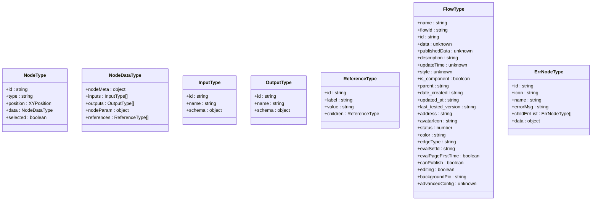

**Diagram sources**
- [console/frontend/src/components/workflow/types/index.ts](file://console/frontend/src/components/workflow/types/index.ts)

**Section sources**
- [console/frontend/src/components/workflow/types/index.ts](file://console/frontend/src/components/workflow/types/index.ts)