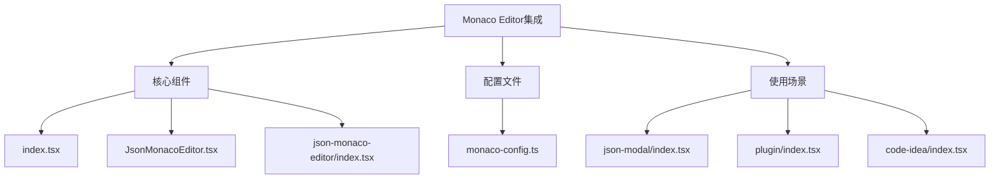
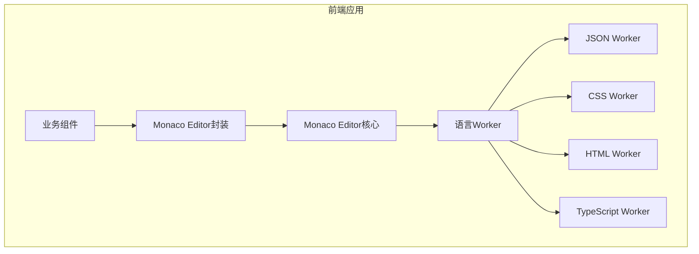
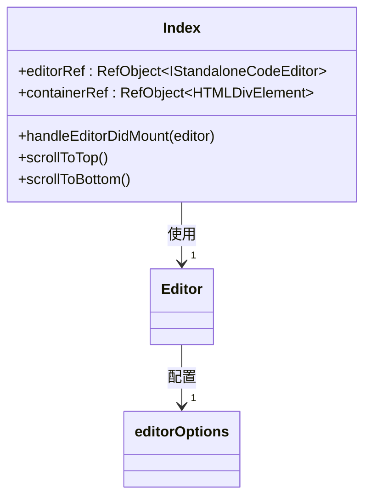
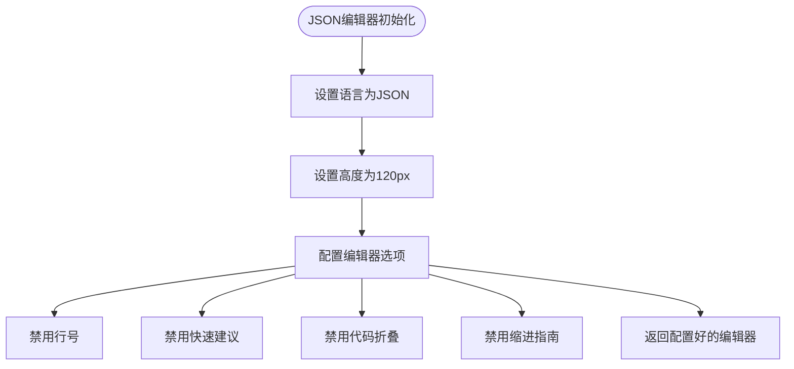
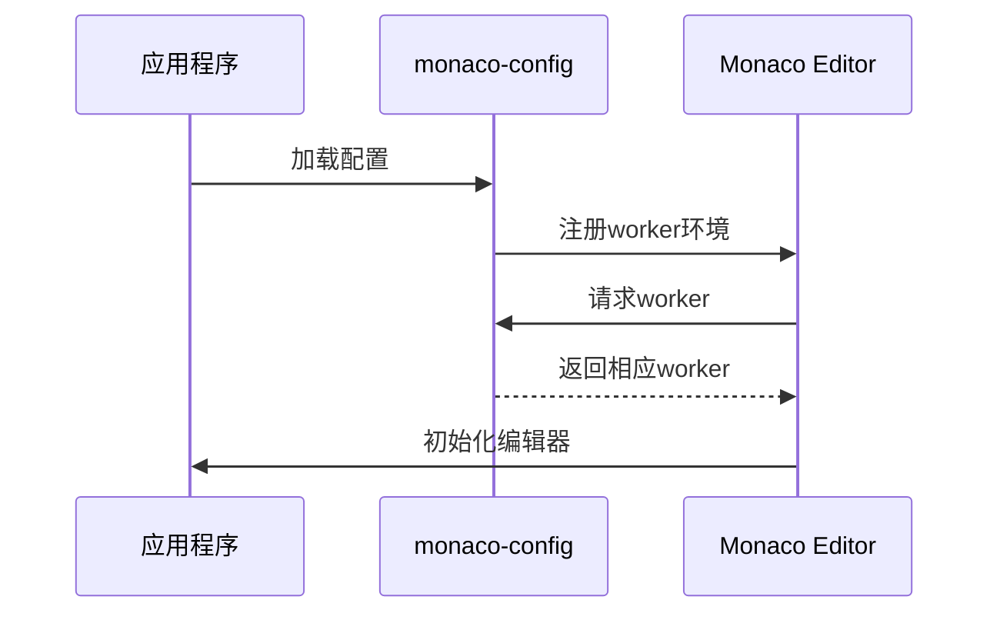

# 代码编辑器

<cite>
**本文档引用的文件**   
- [JsonMonacoEditor.tsx](file://console/frontend/src/components/monaco-editor/JsonMonacoEditor.tsx)
- [index.tsx](file://console/frontend/src/components/monaco-editor/index.tsx)
- [json-monaco-editor/index.tsx](file://console/frontend/src/components/monaco-editor/json-monaco-editor/index.tsx)
- [monaco-config.ts](file://console/frontend/src/config/monaco-config.ts)
- [json-modal/index.tsx](file://console/frontend/src/components/modal/json-modal/index.tsx)
- [plugin/index.tsx](file://console/frontend/src/components/modal/plugin/index.tsx)
- [code-idea/index.tsx](file://console/frontend/src/components/workflow/drawer/code-idea/index.tsx)
- [main.tsx](file://console/frontend/src/main.tsx)
</cite>

## 目录
1. [简介](#简介)
2. [项目结构](#项目结构)
3. [核心组件](#核心组件)
4. [架构概述](#架构概述)
5. [详细组件分析](#详细组件分析)
6. [依赖分析](#依赖分析)
7. [性能考虑](#性能考虑)
8. [故障排除指南](#故障排除指南)
9. [结论](#结论)

## 简介
本文档详细分析了Monaco Editor在项目中的集成与定制，重点描述JSON格式的代码编辑器实现，包括语法高亮、智能提示、错误检查、自动补全等功能。文档还解释了编辑器配置项、主题定制、键盘快捷键设置等，并涵盖与表单系统的集成，包括值绑定、验证、变更事件处理等。通过代码示例展示如何配置Monaco Editor以支持特定语言模式和自定义功能，并分析性能优化策略，如懒加载、内存管理、大型文件处理等。

## 项目结构
项目中的Monaco Editor集成主要位于`console/frontend/src/components/monaco-editor`目录下，包含核心编辑器组件和JSON专用编辑器组件。配置文件位于`console/frontend/src/config/monaco-config.ts`，而编辑器的使用场景分布在多个模块中，如插件管理、工作流节点等。



**Diagram sources**
- [index.tsx](file://console/frontend/src/components/monaco-editor/index.tsx)
- [JsonMonacoEditor.tsx](file://console/frontend/src/components/monaco-editor/JsonMonacoEditor.tsx)
- [json-monaco-editor/index.tsx](file://console/frontend/src/components/monaco-editor/json-monaco-editor/index.tsx)
- [monaco-config.ts](file://console/frontend/src/config/monaco-config.ts)

**Section sources**
- [console/frontend/src/components/monaco-editor](file://console/frontend/src/components/monaco-editor)
- [console/frontend/src/config/monaco-config.ts](file://console/frontend/src/config/monaco-config.ts)

## 核心组件
核心组件包括`index.tsx`中的基础Monaco Editor封装，以及针对JSON格式优化的`JsonMonacoEditor.tsx`和`json-monaco-editor/index.tsx`。这些组件提供了统一的API接口，便于在不同场景下复用。

**Section sources**
- [index.tsx](file://console/frontend/src/components/monaco-editor/index.tsx)
- [JsonMonacoEditor.tsx](file://console/frontend/src/components/monaco-editor/JsonMonacoEditor.tsx)
- [json-monaco-editor/index.tsx](file://console/frontend/src/components/monaco-editor/json-monaco-editor/index.tsx)

## 架构概述
Monaco Editor的架构基于React封装，通过`@monaco-editor/react`库提供React友好的API。编辑器配置在`monaco-config.ts`中进行全局设置，包括语言worker的注册和主题配置。组件通过props传递配置项，实现了高度的可定制性。



**Diagram sources**
- [monaco-config.ts](file://console/frontend/src/config/monaco-config.ts)
- [index.tsx](file://console/frontend/src/components/monaco-editor/index.tsx)

## 详细组件分析

### 基础编辑器组件分析
基础编辑器组件`index.tsx`使用`forwardRef`允许父组件访问编辑器实例，并暴露`scrollToTop`和`scrollToBottom`方法。组件还处理了wheel事件的绑定和解绑，确保资源的正确释放。



**Diagram sources**
- [index.tsx](file://console/frontend/src/components/monaco-editor/index.tsx)

#### JSON编辑器组件分析
JSON编辑器组件`JsonMonacoEditor.tsx`和`json-monaco-editor/index.tsx`都继承自基础编辑器，但针对JSON格式进行了特殊配置。它们禁用了行号、代码折叠、缩进指南等特性，并关闭了快速建议功能，以提供更简洁的JSON编辑体验。



**Diagram sources**
- [JsonMonacoEditor.tsx](file://console/frontend/src/components/monaco-editor/JsonMonacoEditor.tsx)
- [json-monaco-editor/index.tsx](file://console/frontend/src/components/monaco-editor/json-monaco-editor/index.tsx)

### 配置与集成分析
`monaco-config.ts`文件配置了Monaco Editor的worker环境，为不同语言注册了相应的worker。这使得编辑器能够支持JSON、CSS、HTML、TypeScript等多种语言的语法高亮和智能提示。



**Diagram sources**
- [monaco-config.ts](file://console/frontend/src/config/monaco-config.ts)

## 依赖分析
项目依赖`monaco-editor`和`@monaco-editor/react`两个核心包。前者提供编辑器的核心功能，后者提供React集成。通过vite的worker import语法，实现了worker的代码分割和懒加载。

```mermaid
graph LR
A[应用程序] --> B[@monaco-editor/react]
B --> C[monaco-editor]
C --> D[editor.worker]
C --> E[json.worker]
C --> F[css.worker]
C --> G[html.worker]
C --> H[ts.worker]
```

**Diagram sources**
- [package.json](file://console/frontend/package.json)
- [monaco-config.ts](file://console/frontend/src/config/monaco-config.ts)

## 性能考虑
通过worker的懒加载机制，只有在需要时才会加载相应的语言worker，减少了初始加载时间。编辑器的配置也考虑了性能，如禁用不必要的功能（如minimap），优化了滚动性能。

**Section sources**
- [monaco-config.ts](file://console/frontend/src/config/monaco-config.ts)
- [index.tsx](file://console/frontend/src/components/monaco-editor/index.tsx)

## 故障排除指南
常见问题包括worker加载失败、编辑器高度计算错误等。确保worker路径正确，使用`loader.config`正确配置monaco实例。对于高度问题，可以监听窗口大小变化并重新计算编辑器高度。

**Section sources**
- [monaco-config.ts](file://console/frontend/src/config/monaco-config.ts)
- [index.tsx](file://console/frontend/src/components/monaco-editor/index.tsx)

## 结论
Monaco Editor在项目中得到了有效的集成和定制，通过合理的封装和配置，提供了良好的JSON编辑体验。未来可以进一步优化性能，如实现编辑器的虚拟滚动，以支持更大的JSON文件。