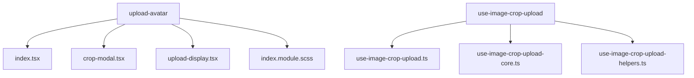
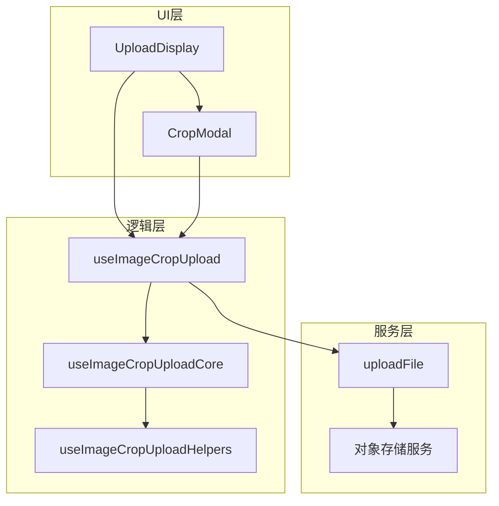
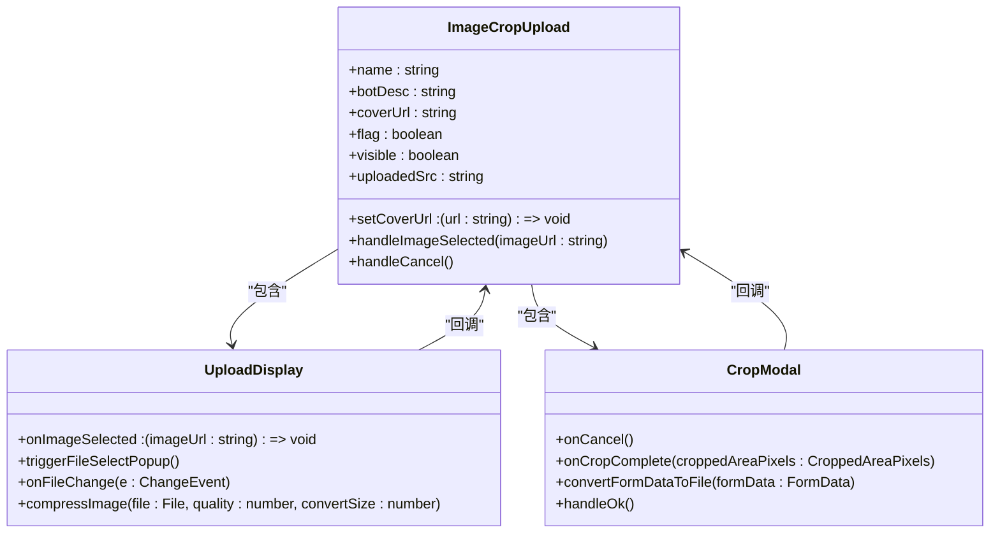
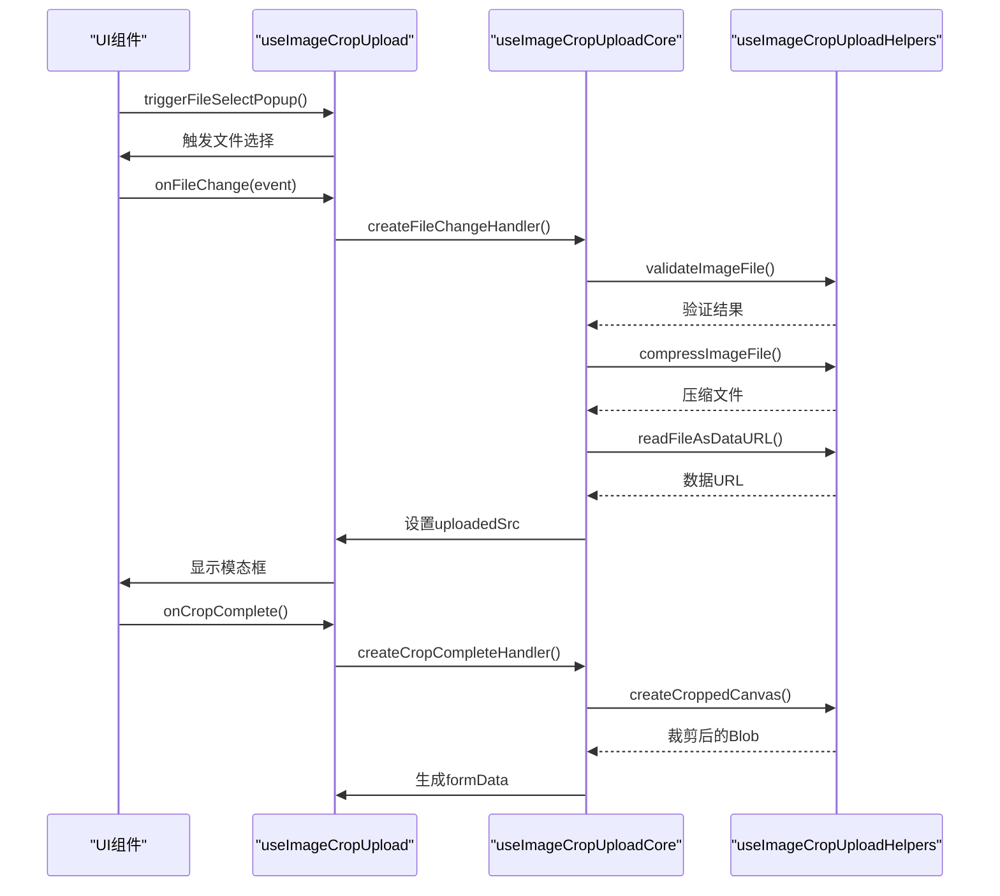
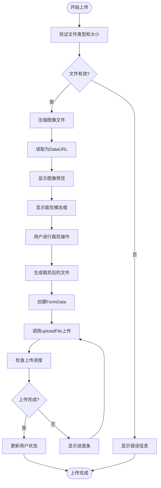
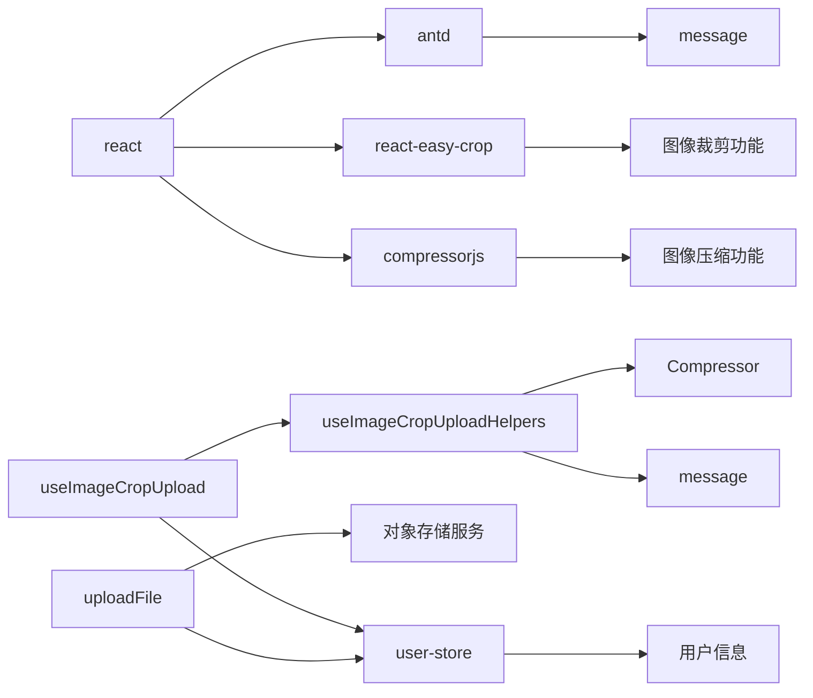

# 头像上传组件

<cite>
**本文档引用文件**  
- [index.tsx](file://console/frontend/src/components/upload-avatar/index.tsx)
- [crop-modal.tsx](file://console/frontend/src/components/upload-avatar/crop-modal.tsx)
- [upload-display.tsx](file://console/frontend/src/components/upload-avatar/upload-display.tsx)
- [use-image-crop-upload.ts](file://console/frontend/src/hooks/use-image-crop-upload.ts)
- [use-image-crop-upload-core.ts](file://console/frontend/src/hooks/use-image-crop-upload-core.ts)
- [use-image-crop-upload-helpers.ts](file://console/frontend/src/hooks/use-image-crop-upload-helpers.ts)
- [user-store.tsx](file://console/frontend/src/store/user-store.tsx)
- [utils.ts](file://console/frontend/src/utils/utils.ts)
</cite>

## 目录
1. [简介](#简介)
2. [项目结构](#项目结构)
3. [核心组件](#核心组件)
4. [架构概述](#架构概述)
5. [详细组件分析](#详细组件分析)
6. [依赖分析](#依赖分析)
7. [性能考虑](#性能考虑)
8. [故障排除指南](#故障排除指南)
9. [结论](#结论)

## 简介
本文档详细分析了头像上传组件的完整实现流程。该组件提供了文件选择、图像预览、裁剪功能、上传进度显示和错误处理机制。组件与后端对象存储服务集成，支持签名生成、上传凭证获取和跨域处理。通过压缩、格式转换和尺寸限制等技术优化用户体验。组件已集成到用户个人中心，支持状态管理和实时预览。

## 项目结构
头像上传组件位于前端代码库的特定目录中，采用模块化设计，分离了显示、裁剪和逻辑处理功能。

**Diagram sources**
- [index.tsx](file://console/frontend/src/components/upload-avatar/index.tsx)
- [use-image-crop-upload.ts](file://console/frontend/src/hooks/use-image-crop-upload.ts)

**Section sources**
- [index.tsx](file://console/frontend/src/components/upload-avatar/index.tsx)
- [use-image-crop-upload.ts](file://console/frontend/src/hooks/use-image-crop-upload.ts)

## 核心组件
头像上传组件由多个核心文件组成，包括主组件、裁剪模态框、上传显示组件以及自定义Hook。这些组件协同工作，提供完整的头像上传体验。组件支持拖拽上传、实时预览、裁剪框交互等用户体验优化功能。

**Section sources**
- [index.tsx](file://console/frontend/src/components/upload-avatar/index.tsx)
- [crop-modal.tsx](file://console/frontend/src/components/upload-avatar/crop-modal.tsx)
- [upload-display.tsx](file://console/frontend/src/components/upload-avatar/upload-display.tsx)

## 架构概述
头像上传组件采用分层架构设计，将UI展示、用户交互和业务逻辑分离。组件通过自定义Hook管理状态和处理复杂的图像处理逻辑。

**Diagram sources**
- [index.tsx](file://console/frontend/src/components/upload-avatar/index.tsx)
- [use-image-crop-upload.ts](file://console/frontend/src/hooks/use-image-crop-upload.ts)
- [utils.ts](file://console/frontend/src/utils/utils.ts)

## 详细组件分析

### 主组件分析
主组件负责协调上传显示和裁剪模态框，管理组件状态。

**Diagram sources**
- [index.tsx](file://console/frontend/src/components/upload-avatar/index.tsx)
- [upload-display.tsx](file://console/frontend/src/components/upload-avatar/upload-display.tsx)
- [crop-modal.tsx](file://console/frontend/src/components/upload-avatar/crop-modal.tsx)

**Section sources**
- [index.tsx](file://console/frontend/src/components/upload-avatar/index.tsx)
- [upload-display.tsx](file://console/frontend/src/components/upload-avatar/upload-display.tsx)
- [crop-modal.tsx](file://console/frontend/src/components/upload-avatar/crop-modal.tsx)

### 图像处理逻辑分析
图像处理逻辑通过自定义Hook实现，分离了文件处理、压缩和裁剪功能。

**Diagram sources**
- [use-image-crop-upload.ts](file://console/frontend/src/hooks/use-image-crop-upload.ts)
- [use-image-crop-upload-core.ts](file://console/frontend/src/hooks/use-image-crop-upload-core.ts)
- [use-image-crop-upload-helpers.ts](file://console/frontend/src/hooks/use-image-crop-upload-helpers.ts)

**Section sources**
- [use-image-crop-upload.ts](file://console/frontend/src/hooks/use-image-crop-upload.ts)
- [use-image-crop-upload-core.ts](file://console/frontend/src/hooks/use-image-crop-upload-core.ts)
- [use-image-crop-upload-helpers.ts](file://console/frontend/src/hooks/use-image-crop-upload-helpers.ts)

### 文件上传流程分析
文件上传流程包括前端处理和后端集成，确保文件安全上传到对象存储服务。

**Diagram sources**
- [upload-display.tsx](file://console/frontend/src/components/upload-avatar/upload-display.tsx)
- [crop-modal.tsx](file://console/frontend/src/components/upload-avatar/crop-modal.tsx)
- [utils.ts](file://console/frontend/src/utils/utils.ts)

**Section sources**
- [upload-display.tsx](file://console/frontend/src/components/upload-avatar/upload-display.tsx)
- [crop-modal.tsx](file://console/frontend/src/components/upload-avatar/crop-modal.tsx)
- [utils.ts](file://console/frontend/src/utils/utils.ts)

## 依赖分析
头像上传组件依赖多个外部库和内部服务，形成了完整的依赖链。

**Diagram sources**
- [use-image-crop-upload.ts](file://console/frontend/src/hooks/use-image-crop-upload.ts)
- [use-image-crop-upload-helpers.ts](file://console/frontend/src/hooks/use-image-crop-upload-helpers.ts)
- [user-store.tsx](file://console/frontend/src/store/user-store.tsx)
- [utils.ts](file://console/frontend/src/utils/utils.ts)

**Section sources**
- [use-image-crop-upload.ts](file://console/frontend/src/hooks/use-image-crop-upload.ts)
- [use-image-crop-upload-helpers.ts](file://console/frontend/src/hooks/use-image-crop-upload-helpers.ts)
- [user-store.tsx](file://console/frontend/src/store/user-store.tsx)
- [utils.ts](file://console/frontend/src/utils/utils.ts)

## 性能考虑
头像上传组件在性能方面进行了多项优化，包括图像压缩、异步处理和进度显示。

- **图像压缩**: 使用compressorjs库对图像进行压缩，减少文件大小
- **异步处理**: 所有文件操作均采用异步方式，避免阻塞UI线程
- **进度显示**: 提供上传进度条，改善用户体验
- **内存管理**: 及时清理不再使用的图像数据URL
- **错误处理**: 完善的错误处理机制，确保组件稳定性

**Section sources**
- [use-image-crop-upload-helpers.ts](file://console/frontend/src/hooks/use-image-crop-upload-helpers.ts)
- [crop-modal.tsx](file://console/frontend/src/components/upload-avatar/crop-modal.tsx)

## 故障排除指南
以下是头像上传组件常见问题及解决方案：

1. **文件无法上传**
   - 检查文件大小是否超过5MB限制
   - 确认文件类型为支持的图像格式
   - 检查网络连接是否正常

2. **图像预览不显示**
   - 确认浏览器支持FileReader API
   - 检查文件是否成功读取为DataURL
   - 查看控制台是否有JavaScript错误

3. **裁剪功能失效**
   - 确认react-easy-crop库正确加载
   - 检查图像源是否有效
   - 验证裁剪参数是否正确传递

4. **上传进度不更新**
   - 检查uploadFile函数是否正确实现进度事件监听
   - 确认服务器端支持上传进度报告
   - 验证进度状态更新逻辑

**Section sources**
- [upload-display.tsx](file://console/frontend/src/components/upload-avatar/upload-display.tsx)
- [crop-modal.tsx](file://console/frontend/src/components/upload-avatar/crop-modal.tsx)
- [use-image-crop-upload.ts](file://console/frontend/src/hooks/use-image-crop-upload.ts)

## 结论
头像上传组件通过模块化设计和分层架构，提供了完整的头像上传解决方案。组件实现了文件选择、图像预览、裁剪、压缩和上传功能，与后端对象存储服务无缝集成。通过自定义Hook分离关注点，提高了代码的可维护性和复用性。组件支持拖拽上传、实时预览和进度显示等用户体验优化功能，已成功集成到用户个人中心，支持状态管理。未来可进一步优化图像处理算法，支持更多图像格式，并增强错误处理和用户体验。