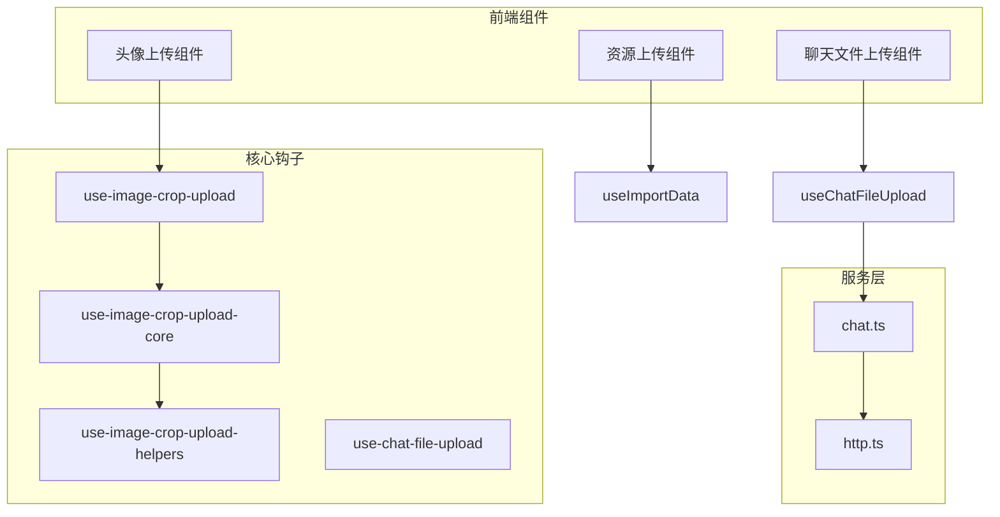
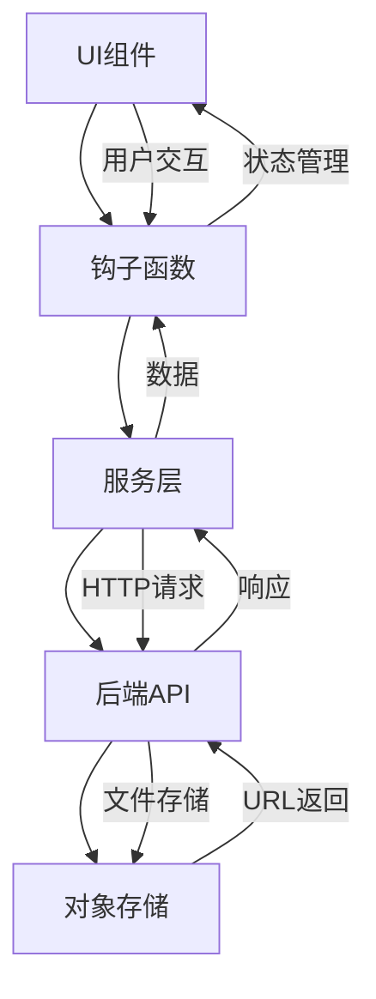
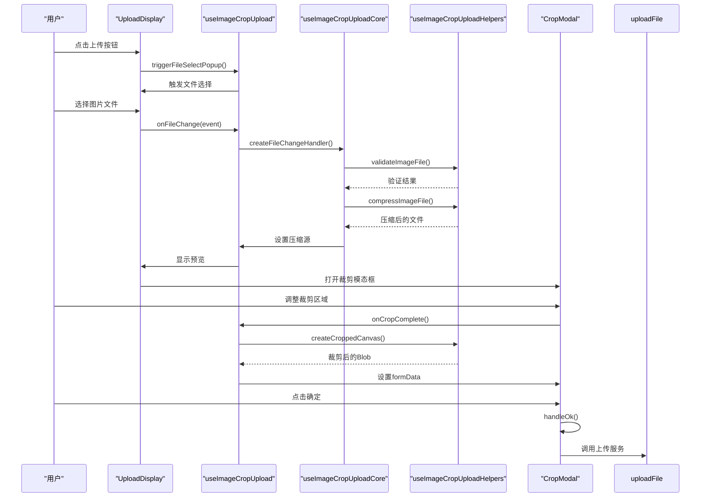
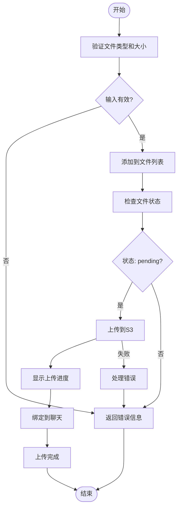
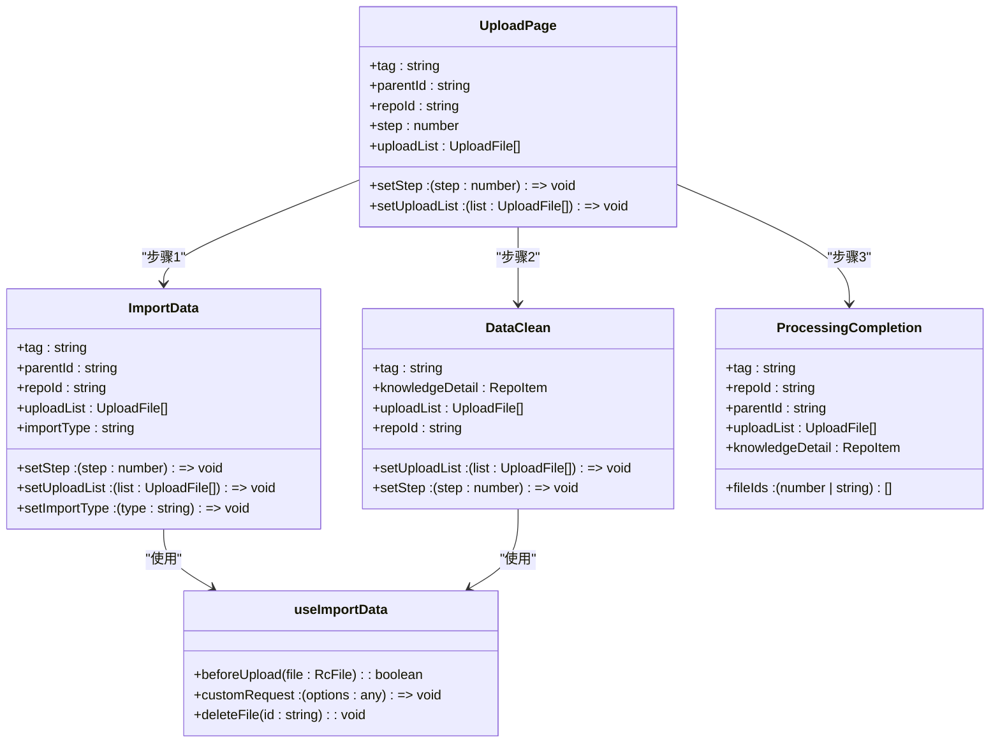
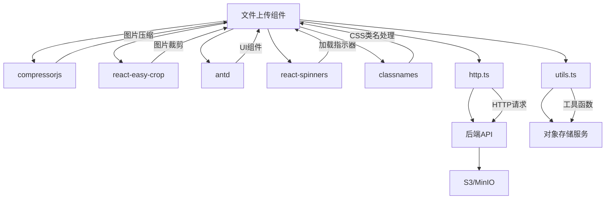

# 文件上传组件

<cite>
**本文档引用的文件**
- [use-image-crop-upload.ts](file://console/frontend/src/hooks/use-image-crop-upload.ts)
- [use-image-crop-upload-core.ts](file://console/frontend/src/hooks/use-image-crop-upload-core.ts)
- [use-image-crop-upload-helpers.ts](file://console/frontend/src/hooks/use-image-crop-upload-helpers.ts)
- [upload-avatar/index.tsx](file://console/frontend/src/components/upload-avatar/index.tsx)
- [upload-display.tsx](file://console/frontend/src/components/upload-avatar/upload-display.tsx)
- [crop-modal.tsx](file://console/frontend/src/components/upload-avatar/crop-modal.tsx)
- [use-chat-file-upload.ts](file://console/frontend/src/hooks/use-chat-file-upload.ts)
- [chat.ts](file://console/frontend/src/services/chat.ts)
- [resource.ts](file://console/frontend/src/types/resource.ts)
- [use-import-data.ts](file://console/frontend/src/pages/resource-management/upload-page/hooks/use-import-data.ts)
- [import-upload.tsx](file://console/frontend/src/pages/resource-management/upload-page/components/import-upload.tsx)
</cite>

## 目录
1. [简介](#简介)
2. [项目结构](#项目结构)
3. [核心组件](#核心组件)
4. [架构概述](#架构概述)
5. [详细组件分析](#详细组件分析)
6. [依赖分析](#依赖分析)
7. [性能考虑](#性能考虑)
8. [故障排除指南](#故障排除指南)
9. [结论](#结论)

## 简介
文件上传组件是系统中的关键功能模块，主要负责头像上传和资源上传的实现。该组件提供了完整的文件选择、预览、裁剪、上传进度显示和错误处理流程。组件支持多文件上传、分片上传和断点续传等高级功能，并与对象存储服务集成，实现了签名生成、上传凭证管理和跨域处理。通过拖拽上传、批量操作和文件类型验证等功能，为用户提供了优化的上传体验。

## 项目结构
文件上传功能主要分布在前端组件和钩子函数中，形成了清晰的分层架构。核心功能由多个可复用的React钩子组成，这些钩子被不同的UI组件调用，实现了功能的解耦和复用。



**图表来源**
- [use-image-crop-upload.ts](file://console/frontend/src/hooks/use-image-crop-upload.ts)
- [use-chat-file-upload.ts](file://console/frontend/src/hooks/use-chat-file-upload.ts)
- [chat.ts](file://console/frontend/src/services/chat.ts)

**章节来源**
- [use-image-crop-upload.ts](file://console/frontend/src/hooks/use-image-crop-upload.ts)
- [use-chat-file-upload.ts](file://console/frontend/src/hooks/use-chat-file-upload.ts)

## 核心组件
文件上传组件的核心由一系列React钩子函数构成，这些钩子提供了文件上传的完整功能链。`use-image-crop-upload`是头像上传的主要钩子，它整合了文件选择、压缩、裁剪和上传的完整流程。`use-chat-file-upload`则专注于聊天场景下的文件上传，支持多种文件类型和绑定逻辑。这些钩子通过组合式API设计，实现了功能的模块化和可复用性。

**章节来源**
- [use-image-crop-upload.ts](file://console/frontend/src/hooks/use-image-crop-upload.ts)
- [use-chat-file-upload.ts](file://console/frontend/src/hooks/use-chat-file-upload.ts)

## 架构概述
文件上传组件采用分层架构设计，将UI展示、业务逻辑和数据服务分离。UI组件负责用户交互和视觉展示，钩子函数处理业务逻辑和状态管理，服务层负责与后端API的通信。这种架构使得组件具有良好的可维护性和可扩展性。



**图表来源**
- [use-image-crop-upload.ts](file://console/frontend/src/hooks/use-image-crop-upload.ts)
- [use-chat-file-upload.ts](file://console/frontend/src/hooks/use-chat-file-upload.ts)
- [chat.ts](file://console/frontend/src/services/chat.ts)

## 详细组件分析

### 头像上传组件分析
头像上传组件实现了从文件选择到最终上传的完整流程，包括预览、裁剪和压缩等高级功能。

#### 对象导向组件
```mermaid
classDiagram
class ImageCropUpload {
+name : string
+botDesc : string
+coverUrl : string
+setCoverUrl : (url : string) => void
+flag : boolean
+visible : boolean
+uploadedSrc : string
+handleImageSelected(imageUrl : string)
+handleCancel()
}
class UploadDisplay {
+name : string
+botDesc : string
+coverUrl : string
+setCoverUrl : (url : string) => void
+flag : boolean
+onImageSelected : (imageUrl : string) => void
+loading : boolean
+reUploadImg : boolean
+triggerFileSelectPopup()
+onFileChange(e : ChangeEvent)
+aiGenerateCoverFn()
}
class CropModal {
+visible : boolean
+uploadedSrc : string
+flag : boolean
+setCoverUrl : (url : string) => void
+onCancel : () => void
+crop : {x : number, y : number}
+zoom : number
+formData : FormData
+handleCancel()
+onCropComplete(croppedAreaPixels : CroppedAreaPixels)
+convertFormDataToFile(formData : FormData) : File | null
+handleOk()
}
ImageCropUpload --> UploadDisplay : "包含"
ImageCropUpload --> CropModal : "包含"
UploadDisplay --> use-image-crop-upload : "使用"
CropModal --> uploadFile : "调用"
```

**图表来源**
- [upload-avatar/index.tsx](file://console/frontend/src/components/upload-avatar/index.tsx)
- [upload-display.tsx](file://console/frontend/src/components/upload-avatar/upload-display.tsx)
- [crop-modal.tsx](file://console/frontend/src/components/upload-avatar/crop-modal.tsx)

**章节来源**
- [upload-avatar/index.tsx](file://console/frontend/src/components/upload-avatar/index.tsx)
- [upload-display.tsx](file://console/frontend/src/components/upload-avatar/upload-display.tsx)
- [crop-modal.tsx](file://console/frontend/src/components/upload-avatar/crop-modal.tsx)

### 文件上传钩子分析
文件上传的核心逻辑由一系列React钩子实现，这些钩子提供了可复用的上传功能。

#### API/服务组件


**图表来源**
- [use-image-crop-upload.ts](file://console/frontend/src/hooks/use-image-crop-upload.ts)
- [use-image-crop-upload-core.ts](file://console/frontend/src/hooks/use-image-crop-upload-core.ts)
- [use-image-crop-upload-helpers.ts](file://console/frontend/src/hooks/use-image-crop-upload-helpers.ts)
- [crop-modal.tsx](file://console/frontend/src/components/upload-avatar/crop-modal.tsx)

**章节来源**
- [use-image-crop-upload.ts](file://console/frontend/src/hooks/use-image-crop-upload.ts)
- [use-image-crop-upload-core.ts](file://console/frontend/src/hooks/use-image-crop-upload-core.ts)
- [use-image-crop-upload-helpers.ts](file://console/frontend/src/hooks/use-image-crop-upload-helpers.ts)

### 聊天文件上传分析
聊天文件上传组件支持多种文件类型的上传，并提供了进度显示和错误处理功能。

#### 复杂逻辑组件


**图表来源**
- [use-chat-file-upload.ts](file://console/frontend/src/hooks/use-chat-file-upload.ts)
- [chat.ts](file://console/frontend/src/services/chat.ts)

**章节来源**
- [use-chat-file-upload.ts](file://console/frontend/src/hooks/use-chat-file-upload.ts)

### 资源上传分析
资源上传组件提供了批量上传和进度管理功能，支持多种文件类型。

#### 对象导向组件


**图表来源**
- [upload-page/index.tsx](file://console/frontend/src/pages/resource-management/upload-page/index.tsx)
- [use-import-data.ts](file://console/frontend/src/pages/resource-management/upload-page/hooks/use-import-data.ts)
- [import-upload.tsx](file://console/frontend/src/pages/resource-management/upload-page/components/import-upload.tsx)

**章节来源**
- [upload-page/index.tsx](file://console/frontend/src/pages/resource-management/upload-page/index.tsx)
- [use-import-data.ts](file://console/frontend/src/pages/resource-management/upload-page/hooks/use-import-data.ts)

## 依赖分析
文件上传组件依赖于多个外部库和服务，形成了完整的依赖链。组件使用`compressorjs`进行图片压缩，`react-easy-crop`实现图片裁剪功能，`antd`提供UI组件和消息提示。在服务层面，组件依赖`http.ts`进行HTTP请求，与后端API通信获取预签名URL并上传文件。



**图表来源**
- [package.json](file://console/frontend/package.json)
- [use-image-crop-upload-helpers.ts](file://console/frontend/src/hooks/use-image-crop-upload-helpers.ts)
- [chat.ts](file://console/frontend/src/services/chat.ts)

**章节来源**
- [use-image-crop-upload-helpers.ts](file://console/frontend/src/hooks/use-image-crop-upload-helpers.ts)
- [chat.ts](file://console/frontend/src/services/chat.ts)

## 性能考虑
文件上传组件在性能方面进行了多项优化。图片上传时会自动进行压缩，减少文件大小和上传时间。组件实现了渐进式加载，在用户选择文件后立即显示预览，而压缩操作在后台异步进行，避免阻塞UI。上传进度实时更新，提供良好的用户体验。对于大文件上传，组件支持分片上传和断点续传，确保上传的可靠性和效率。

## 故障排除指南
文件上传过程中可能遇到多种问题，以下是常见问题的解决方案：

1. **文件类型错误**：确保上传的文件类型符合要求，头像上传仅支持图片格式。
2. **文件大小超限**：文件大小不能超过5MB，建议在上传前压缩图片。
3. **上传失败**：检查网络连接，确保能够访问对象存储服务。
4. **预览不显示**：确认浏览器支持FileReader API，检查文件是否损坏。
5. **裁剪功能异常**：确保图片已完全加载，检查cropper组件的配置。

**章节来源**
- [use-image-crop-upload-helpers.ts](file://console/frontend/src/hooks/use-image-crop-upload-helpers.ts)
- [use-chat-file-upload.ts](file://console/frontend/src/hooks/use-chat-file-upload.ts)

## 结论
文件上传组件通过模块化设计和分层架构，实现了头像上传和资源上传的完整功能。组件提供了良好的用户体验，包括实时预览、图片裁剪、进度显示和错误处理。通过与对象存储服务的集成，组件支持大文件的可靠上传。未来可以进一步优化，如增加更多文件类型的预览支持，实现更智能的图片压缩算法，以及提供更详细的上传统计信息。