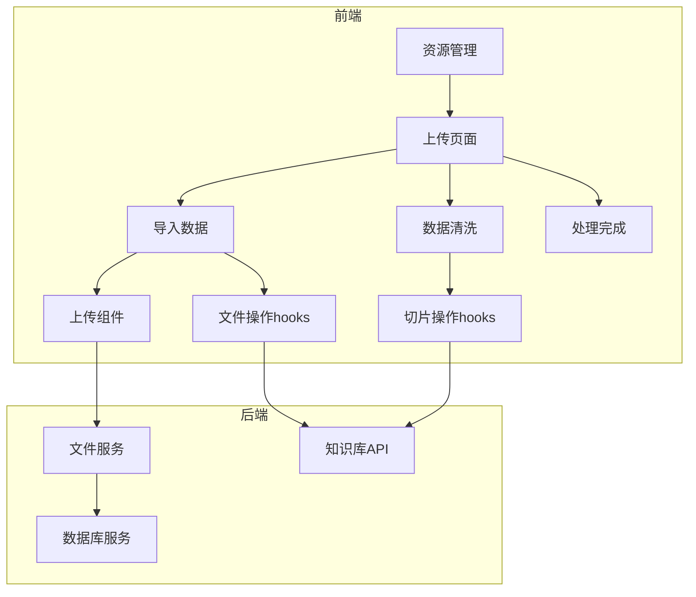
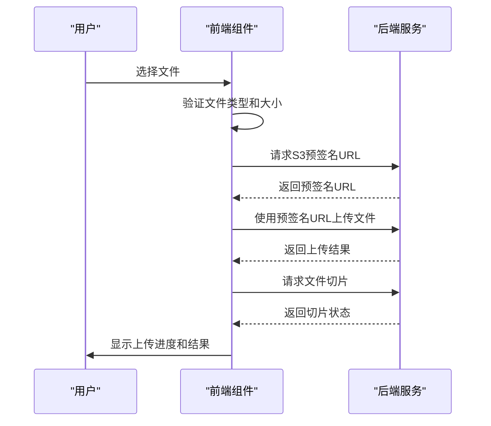
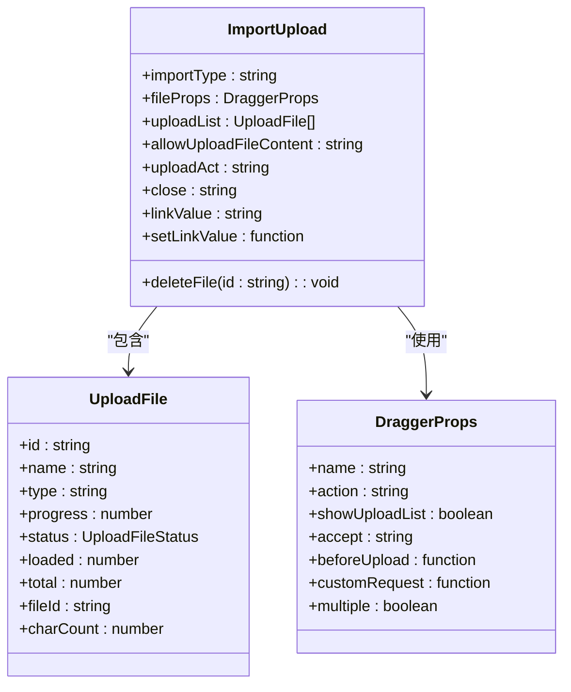
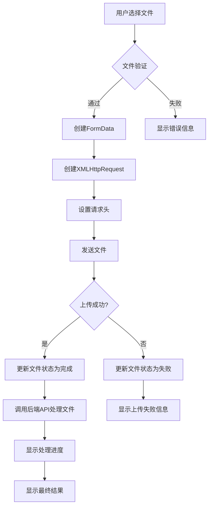
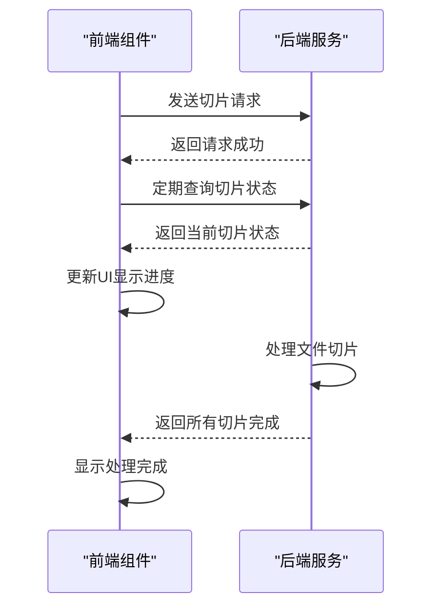
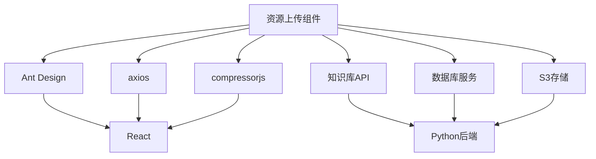

# 资源上传组件

<cite>
**本文档引用的文件**   
- [use-image-crop-upload.ts](file://console/frontend/src/hooks/use-image-crop-upload.ts)
- [use-chat-file-upload.ts](file://console/frontend/src/hooks/use-chat-file-upload.ts)
- [import-upload.tsx](file://console/frontend/src/pages/resource-management/upload-page/components/import-upload.tsx)
- [use-import-data.ts](file://console/frontend/src/pages/resource-management/upload-page/hooks/use-import-data.ts)
- [use-slice-operations.ts](file://console/frontend/src/pages/resource-management/upload-page/components/hooks/use-slice-operations.ts)
- [knowledge.ts](file://console/frontend/src/services/knowledge.ts)
- [file_service.py](file://core/workflow/service/file_service.py)
- [file_icon_config.ts](file://console/frontend/src/config/file-icon-config.ts)
</cite>

## 目录
1. [简介](#简介)
2. [项目结构](#项目结构)
3. [核心组件](#核心组件)
4. [架构概述](#架构概述)
5. [详细组件分析](#详细组件分析)
6. [依赖分析](#依赖分析)
7. [性能考虑](#性能考虑)
8. [故障排除指南](#故障排除指南)
9. [结论](#结论)

## 简介
资源上传组件是astron-agent系统中的关键功能模块，负责处理多类型文件上传的完整流程。该组件支持文档、数据集、多媒体等多种资源文件的上传，实现了文件选择、批量上传、上传进度管理、错误处理和状态反馈等核心功能。组件与数据库服务深度集成，支持元数据处理、文件索引创建和存储路径管理。对于大文件，组件实现了分片上传和断点续传等高级功能。上传流程分为三个主要步骤：文件导入、数据清洗和处理完成，确保了上传过程的可靠性和用户体验。

## 项目结构
资源上传组件主要分布在前端控制台的resource-management模块中，采用React框架和TypeScript语言实现。组件遵循模块化设计，将不同功能分离到独立的hooks和组件中，提高了代码的可维护性和复用性。

**Diagram sources**
- [import-upload.tsx](file://console/frontend/src/pages/resource-management/upload-page/components/import-upload.tsx)
- [use-import-data.ts](file://console/frontend/src/pages/resource-management/upload-page/hooks/use-import-data.ts)
- [use-slice-operations.ts](file://console/frontend/src/pages/resource-management/upload-page/components/hooks/use-slice-operations.ts)
- [file_service.py](file://core/workflow/service/file_service.py)

**Section sources**
- [import-upload.tsx](file://console/frontend/src/pages/resource-management/upload-page/components/import-upload.tsx)
- [use-import-data.ts](file://console/frontend/src/pages/resource-management/upload-page/hooks/use-import-data.ts)

## 核心组件
资源上传组件的核心功能由多个React hooks和组件协同实现。`useImageCropUpload`提供了图片上传和裁剪功能，支持文件大小限制和压缩。`useChatFileUpload`专门处理聊天场景中的文件上传，支持S3预签名URL上传和进度跟踪。`useImportData`和`useSliceOperations`分别处理文件导入和切片操作，实现了完整的上传流程管理。

**Section sources**
- [use-image-crop-upload.ts](file://console/frontend/src/hooks/use-image-crop-upload.ts)
- [use-chat-file-upload.ts](file://console/frontend/src/hooks/use-chat-file-upload.ts)
- [use-import-data.ts](file://console/frontend/src/pages/resource-management/upload-page/hooks/use-import-data.ts)
- [use-slice-operations.ts](file://console/frontend/src/pages/resource-management/upload-page/components/hooks/use-slice-operations.ts)

## 架构概述
资源上传组件采用前后端分离架构，前端负责用户交互和上传流程管理，后端提供文件验证和存储服务。组件通过REST API与后端通信，使用FormData进行文件传输。上传流程分为三个阶段：文件选择阶段使用拖拽或文件选择器获取文件；上传阶段通过XMLHttpRequest发送文件并跟踪进度；处理阶段调用后端API进行文件切片和索引创建。

**Diagram sources**
- [use-chat-file-upload.ts](file://console/frontend/src/hooks/use-chat-file-upload.ts)
- [knowledge.ts](file://console/frontend/src/services/knowledge.ts)
- [file_service.py](file://core/workflow/service/file_service.py)

## 详细组件分析

### 文件上传组件分析
文件上传组件实现了完整的文件上传流程，包括文件选择、验证、上传和状态管理。组件支持多种文件类型，通过accept属性限制可上传的文件类型，并在上传前进行客户端验证。

#### 对于文件上传组件：

**Diagram sources**
- [import-upload.tsx](file://console/frontend/src/pages/resource-management/upload-page/components/import-upload.tsx)
- [resource.ts](file://console/frontend/src/types/resource.ts)

### 文件导入流程分析
文件导入流程通过`useImportData` hook实现，管理文件上传的完整生命周期。流程包括文件验证、上传请求构建、进度跟踪和结果处理。组件使用XMLHttpRequest进行文件上传，能够精确跟踪上传进度并提供实时反馈。

#### 对于文件导入流程：

**Diagram sources**
- [use-import-data.ts](file://console/frontend/src/pages/resource-management/upload-page/hooks/use-import-data.ts)
- [knowledge.ts](file://console/frontend/src/services/knowledge.ts)

### 文件切片操作分析
文件切片操作是资源上传组件的关键功能，负责将上传的文件分割成适合处理的块。`useSliceOperations` hook管理切片流程，包括默认切片和自定义切片两种模式。组件通过轮询机制检查切片状态，确保用户能够及时了解处理进度。

#### 对于文件切片操作：

**Diagram sources**
- [use-slice-operations.ts](file://console/frontend/src/pages/resource-management/upload-page/components/hooks/use-slice-operations.ts)
- [knowledge.ts](file://console/frontend/src/services/knowledge.ts)

## 依赖分析
资源上传组件依赖多个外部库和服务，包括Ant Design UI组件库、axios HTTP客户端和compressorjs图片压缩库。组件与后端服务通过REST API通信，依赖知识库、数据库等模块提供文件处理和存储功能。

**Diagram sources**
- [package.json](file://console/frontend/package.json)
- [knowledge.ts](file://console/frontend/src/services/knowledge.ts)
- [file_service.py](file://core/workflow/service/file_service.py)

**Section sources**
- [package.json](file://console/frontend/package.json)
- [knowledge.ts](file://console/frontend/src/services/knowledge.ts)

## 性能考虑
资源上传组件在性能方面进行了多项优化。对于大文件上传，组件实现了分片上传机制，避免了单次请求过大导致的超时问题。图片上传时，组件会自动压缩图片以减少传输数据量。上传进度通过XMLHttpRequest的progress事件实时更新，提供了流畅的用户体验。后端服务对文件类型和大小进行验证，防止无效文件占用系统资源。

## 故障排除指南
当上传功能出现问题时，可以按照以下步骤进行排查：

1. 检查网络连接是否正常
2. 确认文件类型是否在允许的范围内
3. 验证文件大小是否超过限制
4. 检查后端服务是否正常运行
5. 查看浏览器控制台是否有错误信息
6. 确认用户权限是否足够

常见问题包括文件类型不支持、文件大小超限、网络超时等。组件提供了详细的错误提示，帮助用户快速定位问题。

**Section sources**
- [use-import-data.ts](file://console/frontend/src/pages/resource-management/upload-page/hooks/use-import-data.ts)
- [use-image-crop-upload.ts](file://console/frontend/src/hooks/use-image-crop-upload.ts)

## 结论
资源上传组件是一个功能完整、架构清晰的文件上传解决方案。组件通过模块化设计和hooks分离关注点，提高了代码的可维护性。上传流程设计合理，提供了良好的用户体验。与后端服务的集成紧密，支持文件切片、索引创建等高级功能。未来可以考虑增加更多文件类型支持、优化大文件上传性能、增强错误处理机制等。