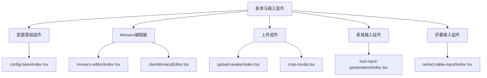
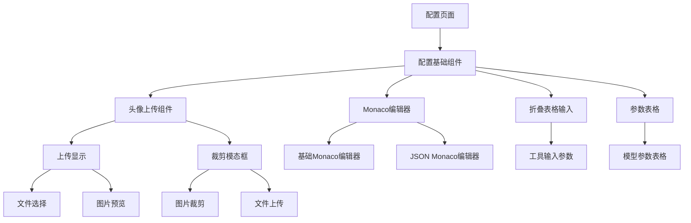
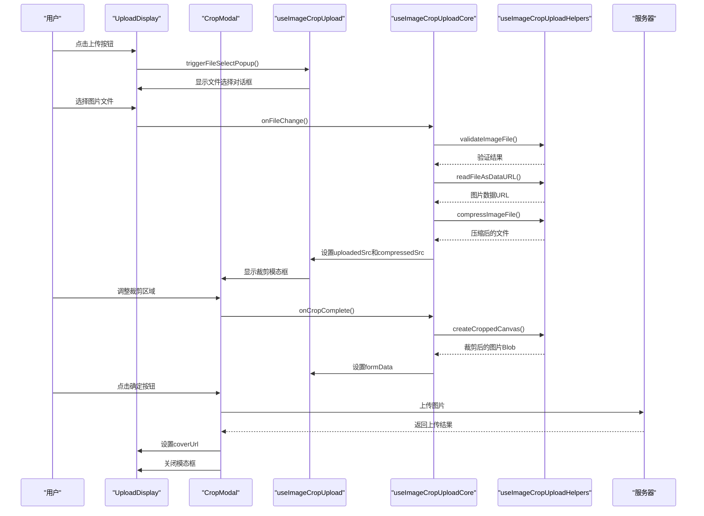
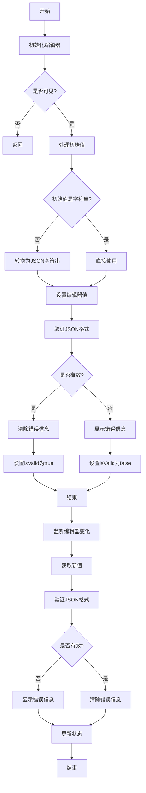
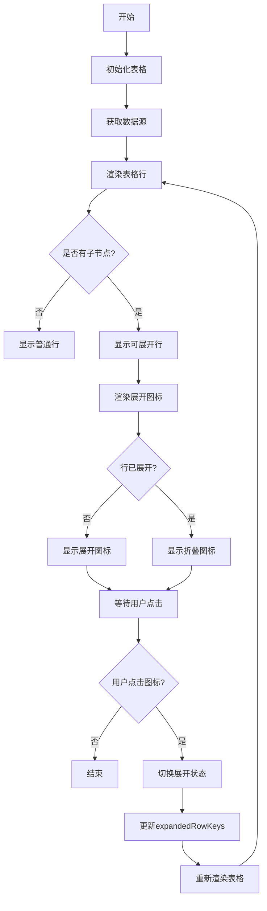
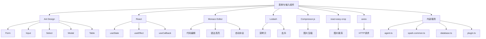

# 表单与输入组件

<cite>
**本文档引用的文件**
- [config-base/index.tsx](file://console/frontend/src/components/config-page-component/config-base/index.tsx)
- [upload-avatar/index.tsx](file://console/frontend/src/components/upload-avatar/index.tsx)
- [upload-avatar/crop-modal.tsx](file://console/frontend/src/components/upload-avatar/crop-modal.tsx)
- [monaco-editor/index.tsx](file://console/frontend/src/components/monaco-editor/index.tsx)
- [monaco-editor/JsonMonacoEditor.tsx](file://console/frontend/src/components/monaco-editor/JsonMonacoEditor.tsx)
- [ui/global/retract-table-input/index.tsx](file://console/frontend/src/components/ui/global/retract-table-input/index.tsx)
- [table/tool-input-parameters/index.tsx](file://console/frontend/src/components/table/tool-input-parameters/index.tsx)
- [modal/json-modal/index.tsx](file://console/frontend/src/components/modal/json-modal/index.tsx)
- [hooks/use-image-crop-upload.ts](file://console/frontend/src/hooks/use-image-crop-upload.ts)
- [hooks/use-image-crop-upload-core.ts](file://console/frontend/src/hooks/use-image-crop-upload-core.ts)
- [hooks/use-image-crop-upload-helpers.ts](file://console/frontend/src/hooks/use-image-crop-upload-helpers.ts)
- [config-page/index.tsx](file://console/frontend/src/pages/config-page/index.tsx)
- [model-management/components/model-params-table.tsx](file://console/frontend/src/pages/model-management/components/model-params-table.tsx)
</cite>

## 目录
1. [简介](#简介)
2. [项目结构](#项目结构)
3. [核心组件](#核心组件)
4. [架构概述](#架构概述)
5. [详细组件分析](#详细组件分析)
6. [依赖分析](#依赖分析)
7. [性能考虑](#性能考虑)
8. [故障排除指南](#故障排除指南)
9. [结论](#结论)

## 简介
本文档详细分析了Astron Agent项目中的表单与输入组件，重点研究配置页面和创建流程中的复杂表单控件实现。文档涵盖了配置基础组件（ConfigBase）、Monaco代码编辑器集成、头像上传组件、折叠表格输入等复杂表单控件的设计和实现。同时，文档解释了表单状态管理、数据验证、错误提示等机制，并涵盖了与后端API的集成模式，包括数据绑定、提交处理、错误反馈等。

## 项目结构
本项目中的表单与输入组件主要分布在`console/frontend/src/components`目录下，按功能模块组织。核心表单组件包括配置基础组件、Monaco编辑器、上传组件和表格输入组件等。



**图表来源**
- [config-base/index.tsx](file://console/frontend/src/components/config-page-component/config-base/index.tsx)
- [monaco-editor/index.tsx](file://console/frontend/src/components/monaco-editor/index.tsx)
- [upload-avatar/index.tsx](file://console/frontend/src/components/upload-avatar/index.tsx)
- [tool-input-parameters/index.tsx](file://console/frontend/src/components/table/tool-input-parameters/index.tsx)
- [retract-table-input/index.tsx](file://console/frontend/src/components/ui/global/retract-table-input/index.tsx)

**章节来源**
- [config-base/index.tsx](file://console/frontend/src/components/config-page-component/config-base/index.tsx)
- [monaco-editor/index.tsx](file://console/frontend/src/components/monaco-editor/index.tsx)
- [upload-avatar/index.tsx](file://console/frontend/src/components/upload-avatar/index.tsx)

## 核心组件
本项目中的表单与输入组件主要包括配置基础组件（ConfigBase）、Monaco代码编辑器、头像上传组件、折叠表格输入等。这些组件共同构成了配置页面和创建流程的核心用户界面。

**章节来源**
- [config-base/index.tsx](file://console/frontend/src/components/config-page-component/config-base/index.tsx)
- [upload-avatar/index.tsx](file://console/frontend/src/components/upload-avatar/index.tsx)
- [monaco-editor/index.tsx](file://console/frontend/src/components/monaco-editor/index.tsx)

## 架构概述
表单与输入组件的架构设计遵循React组件化原则，采用组合模式构建复杂的用户界面。各组件通过props传递数据和回调函数，实现数据流的单向流动。



**图表来源**
- [config-base/index.tsx](file://console/frontend/src/components/config-page-component/config-base/index.tsx)
- [upload-avatar/index.tsx](file://console/frontend/src/components/upload-avatar/index.tsx)
- [monaco-editor/index.tsx](file://console/frontend/src/components/monaco-editor/index.tsx)
- [tool-input-parameters/index.tsx](file://console/frontend/src/components/table/tool-input-parameters/index.tsx)
- [model-params-table.tsx](file://console/frontend/src/pages/model-management/components/model-params-table.tsx)

## 详细组件分析

### 配置基础组件分析
配置基础组件（ConfigBase）是配置页面的核心组件，负责管理助手的配置信息，包括基本信息、模型选择、提示词设置等。

#### 对象导向组件：
```mermaid
classDiagram
class BaseConfig {
+currentRobot : robotType
+setCurrentRobot : (value : any) => void
+currentTab : string
+setCurrentTab : (value : string) => void
-fabuFlag : boolean
-openWxmol : boolean
-globalLoading : boolean
-botCreateActiveV : {cn : string}
-modelList : any[]
-questionTipActive : number
-prologue : string
-createBotton : any
-botTemplateInfoValue : any
-detailInfo : any
-baseinfo : any
-inputExample : string[]
-bottypeList : any[]
-selectSource : any[]
-prompt : string
-promptList : any[]
-choosedAlltool : any
-supportSystemFlag : boolean
-supportContextFlag : boolean
-promptNow : any
-coverUrl : string
-isChanged : boolean
-promptData : string
-suggest : boolean
-resource : boolean
-conversationStarter : string
-conversation : boolean
-presetQuestion : string[]
-feedback : boolean
-personalityData : {enablePersonality : boolean, personalityConfig : {personality? : string, sceneType? : 1 | 2, sceneInfo? : string} | null}
-files : any[]
-repoConfig : {topK : number, scoreThreshold : number}
-flows : any[]
-loadingPrompt : boolean
-loading : boolean
-config : {}
-tools : any[]
-tree : any
-knowledges : any[]
-chatModelList : any[]
-isSending : boolean
-visible : boolean
-resetChatSwitch : boolean
-growOrShrinkConfig : {prompt : boolean, tools : boolean, knowledges : boolean, chatStrong : boolean, flows : boolean}
-publishModalShow : boolean
-vcnList : VcnItem[]
-form : FormInstance
-model : string
-modelOptions : ModelListData[]
-pendingModelData : {modelId? : string, modelDomain? : string} | null
+getModelListData() : void
+handleModelDisplay(modelId? : string, modelDomain? : string) : void
+handleModelChange(value : string) : void
+handleModelChangeNew(e : string, index : number) : void
+buildRequestObject(isRag : boolean, useFormValues : boolean, isForPublish? : boolean) : any
+validatePersonality() : boolean
+savebot(e : any) : void
+releaseFn(e : any) : void
+aiGen() : void
+changeConfig() : void
+getLeafNodes(tree : TreeNode) : TreeNode[]
+clickOutside(event : MouseEvent) : void
+closeModal() : void
+handleInputBoxSend(text : string) : void
+handleShowTipPk(type : string) : void
+addModelPk() : void
+handleInputBoxClear() : void
}
class ChatProps {
+currentRobot : robotType
+setCurrentRobot : (value : any) => void
+currentTab : string
+setCurrentTab : (value : string) => void
}
class BaseModelConfig {
+visible : boolean
+isSending : boolean
+optionsVisible : boolean
+modelInfo : ModelConfig
}
class ModelConfig {
+plan : ModelInfo
+summary : ModelInfo
}
class ModelInfo {
+hasAuthorization : boolean
+llmId : number
+modelId : number
+api : string
+llmSource : string
+patchId : any[]
+serviceId : string
+name : string
+value : string
+configs : any[]
}
BaseConfig --> ChatProps : "implements"
BaseConfig --> BaseModelConfig : "uses"
BaseConfig --> ModelConfig : "uses"
BaseConfig --> ModelInfo : "uses"
```

**图表来源**
- [config-base/index.tsx](file://console/frontend/src/components/config-page-component/config-base/index.tsx)
- [types.ts](file://console/frontend/src/components/config-page-component/config-base/types.ts)

### 头像上传组件分析
头像上传组件实现了完整的图片上传、裁剪和预览功能，支持文件验证、压缩和上传进度显示。

#### API/服务组件：


**图表来源**
- [upload-avatar/index.tsx](file://console/frontend/src/components/upload-avatar/index.tsx)
- [upload-avatar/crop-modal.tsx](file://console/frontend/src/components/upload-avatar/crop-modal.tsx)
- [hooks/use-image-crop-upload.ts](file://console/frontend/src/hooks/use-image-crop-upload.ts)
- [hooks/use-image-crop-upload-core.ts](file://console/frontend/src/hooks/use-image-crop-upload-core.ts)
- [hooks/use-image-crop-upload-helpers.ts](file://console/frontend/src/hooks/use-image-crop-upload-helpers.ts)

### Monaco编辑器组件分析
Monaco编辑器组件封装了Monaco Editor，提供了JSON格式的代码编辑功能，支持语法高亮、自动补全等特性。

#### 复杂逻辑组件：


**图表来源**
- [monaco-editor/index.tsx](file://console/frontend/src/components/monaco-editor/index.tsx)
- [monaco-editor/JsonMonacoEditor.tsx](file://console/frontend/src/components/monaco-editor/JsonMonacoEditor.tsx)
- [modal/json-modal/index.tsx](file://console/frontend/src/components/modal/json-modal/index.tsx)

### 折叠表格输入组件分析
折叠表格输入组件实现了可展开/折叠的表格输入功能，支持嵌套数据结构的编辑。

#### 复杂逻辑组件：


**图表来源**
- [table/tool-input-parameters/index.tsx](file://console/frontend/src/components/table/tool-input-parameters/index.tsx)
- [table/tool-input-parameters/hooks/use-columns.tsx](file://console/frontend/src/components/table/tool-input-parameters/hooks/use-columns.tsx)
- [table/tool-input-parameters/hooks/use-tool-input-parameters.ts](file://console/frontend/src/components/table/tool-input-parameters/hooks/use-tool-input-parameters.ts)

## 依赖分析
表单与输入组件依赖于多个第三方库和内部服务，形成了复杂的依赖关系网络。



**图表来源**
- [config-base/index.tsx](file://console/frontend/src/components/config-page-component/config-base/index.tsx)
- [upload-avatar/index.tsx](file://console/frontend/src/components/upload-avatar/index.tsx)
- [monaco-editor/index.tsx](file://console/frontend/src/components/monaco-editor/index.tsx)
- [services/](file://console/frontend/src/services/)

## 性能考虑
表单与输入组件在性能方面进行了多项优化，包括图片压缩、去抖处理、懒加载等。

1. **图片压缩**：使用Compressor.js对上传的图片进行压缩，减少文件大小，提高上传速度。
2. **去抖处理**：对频繁触发的事件（如输入框变化）使用lodash.debounce进行去抖，减少不必要的计算。
3. **懒加载**：对大型组件（如Monaco Editor）进行懒加载，减少初始加载时间。
4. **虚拟滚动**：对大型表格使用虚拟滚动，提高渲染性能。
5. **状态管理**：使用React的useState和useReducer进行状态管理，避免不必要的重新渲染。

## 故障排除指南
在使用表单与输入组件时，可能会遇到一些常见问题，以下是一些解决方案。

1. **图片上传失败**：检查文件大小是否超过限制，文件类型是否为图片格式。
2. **Monaco Editor不显示**：检查是否正确引入了Monaco Editor的CSS和JS文件。
3. **表格数据不更新**：确保数据源已正确更新，并触发了组件的重新渲染。
4. **表单验证不工作**：检查验证规则是否正确配置，错误信息是否正确显示。
5. **API调用失败**：检查网络连接，API地址是否正确，请求参数是否符合要求。

**章节来源**
- [config-base/index.tsx](file://console/frontend/src/components/config-page-component/config-base/index.tsx)
- [upload-avatar/index.tsx](file://console/frontend/src/components/upload-avatar/index.tsx)
- [monaco-editor/index.tsx](file://console/frontend/src/components/monaco-editor/index.tsx)

## 结论
本文档详细分析了Astron Agent项目中的表单与输入组件，涵盖了配置基础组件、Monaco编辑器、头像上传组件、折叠表格输入等核心组件的设计和实现。通过本文档，开发者可以更好地理解和使用这些组件，提高开发效率和代码质量。