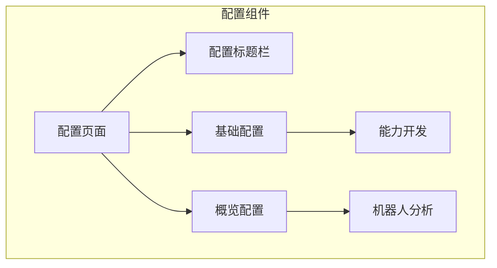
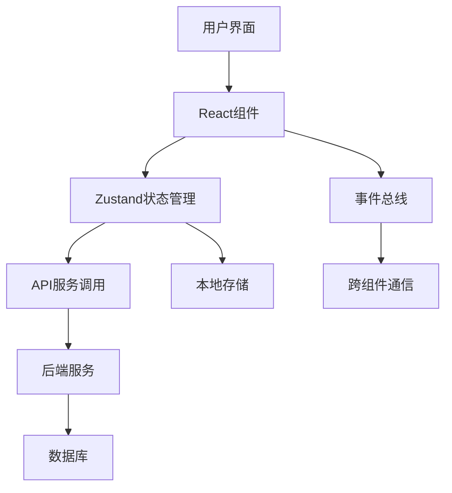
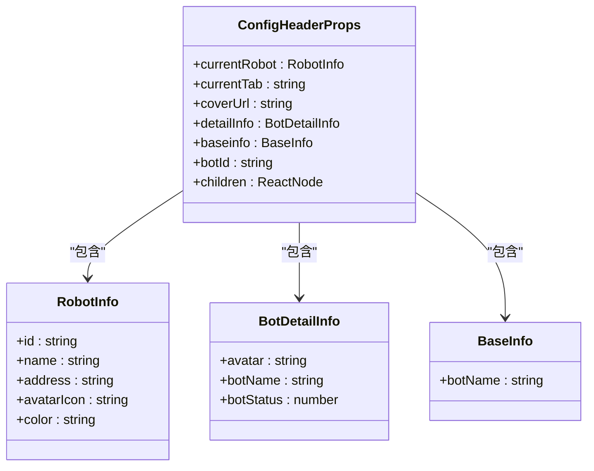
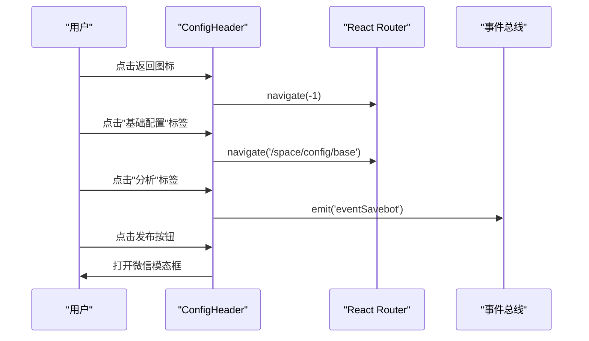
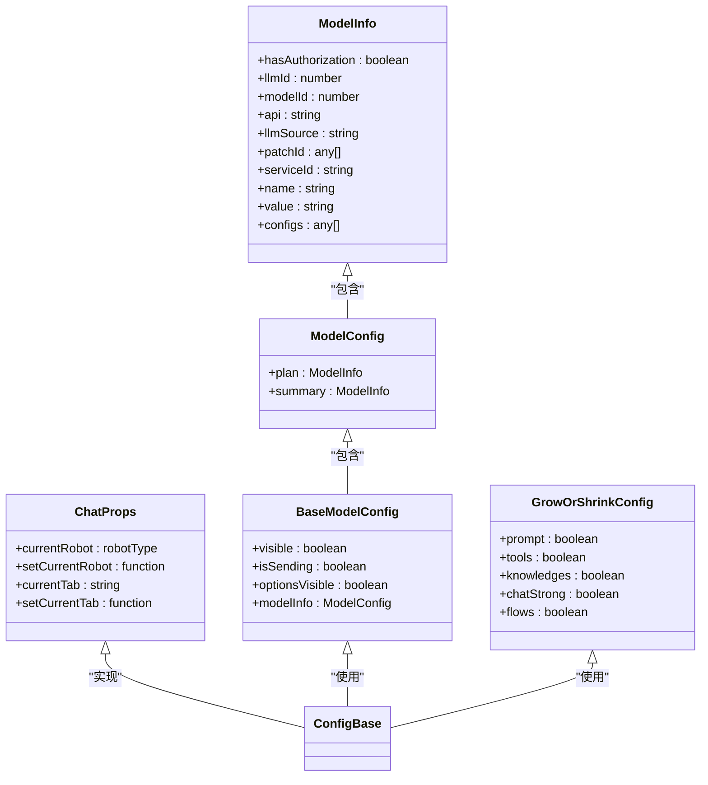
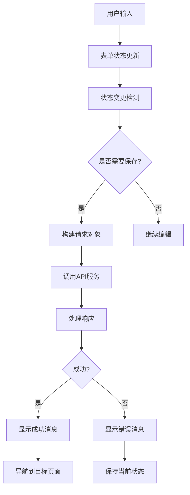

# 配置组件

<cite>
**本文档引用的文件**   
- [ConfigHeader.tsx](file://console/frontend/src/components/config-page-component/config-header/ConfigHeader.tsx)
- [config-base/index.tsx](file://console/frontend/src/components/config-page-component/config-base/index.tsx)
- [types.ts](file://console/frontend/src/components/config-page-component/config-base/types.ts)
- [spark-common.ts](file://console/frontend/src/services/spark-common.ts)
- [bot-state.ts](file://console/frontend/src/store/spark-store/bot-state.ts)
- [config-page/index.tsx](file://console/frontend/src/pages/config-page/index.tsx)
</cite>

## 目录
1. [简介](#简介)
2. [项目结构](#项目结构)
3. [核心组件](#核心组件)
4. [架构概述](#架构概述)
5. [详细组件分析](#详细组件分析)
6. [依赖分析](#依赖分析)
7. [性能考虑](#性能考虑)
8. [故障排除指南](#故障排除指南)
9. [结论](#结论)
10. [附录](#附录) (如有必要)

## 简介
本文档详细分析了Astron Agent项目中的配置组件，重点研究ConfigBase和ConfigHeader组件的实现。文档涵盖了配置页面的基础布局、标题栏设计、配置项分组、状态管理机制，以及配置数据的双向绑定、变更检测和保存处理等核心逻辑。同时，文档还探讨了配置项的动态渲染、条件显示、权限控制等高级功能，并提供了构建可复用配置组件的最佳实践。

## 项目结构
配置组件主要位于前端代码库的`components/config-page-component`目录下，采用模块化设计，将不同功能的配置组件分离到独立的子目录中。这种结构提高了代码的可维护性和可扩展性。

**图表来源**
- [config-page/index.tsx](file://console/frontend/src/pages/config-page/index.tsx#L1-L40)
- [config-header/ConfigHeader.tsx](file://console/frontend/src/components/config-page-component/config-header/ConfigHeader.tsx#L1-L198)
- [config-base/index.tsx](file://console/frontend/src/components/config-page-component/config-base/index.tsx#L1-L2030)

**本节来源**
- [config-page/index.tsx](file://console/frontend/src/pages/config-page/index.tsx#L1-L40)
- [config-header/ConfigHeader.tsx](file://console/frontend/src/components/config-page-component/config-header/ConfigHeader.tsx#L1-L198)

## 核心组件
配置组件的核心由ConfigBase和ConfigHeader两个主要组件构成。ConfigBase组件负责管理配置页面的主要内容和逻辑，包括基础信息配置、能力开发、知识库集成等。ConfigHeader组件则负责提供页面的标题栏和导航功能，包含机器人信息展示、状态指示和操作按钮。

**本节来源**
- [config-base/index.tsx](file://console/frontend/src/components/config-page-component/config-base/index.tsx#L1-L2030)
- [ConfigHeader.tsx](file://console/frontend/src/components/config-page-component/config-header/ConfigHeader.tsx#L1-L198)

## 架构概述
配置组件采用React函数式组件和Hooks的现代前端架构，结合Ant Design UI组件库构建用户界面。状态管理采用Zustand作为全局状态管理工具，与React的useState、useEffect等内置Hooks协同工作，实现了高效的状态管理和组件通信。

**图表来源**
- [config-base/index.tsx](file://console/frontend/src/components/config-page-component/config-base/index.tsx#L1-L2030)
- [spark-common.ts](file://console/frontend/src/services/spark-common.ts#L1-L559)
- [bot-state.ts](file://console/frontend/src/store/spark-store/bot-state.ts#L1-L41)

## 详细组件分析
### ConfigHeader组件分析
ConfigHeader组件是配置页面的头部导航组件，负责展示机器人基本信息、状态指示和主要操作按钮。该组件通过props接收机器人信息和当前标签页状态，并根据这些状态动态更新UI。

#### 组件接口定义

**图表来源**
- [ConfigHeader.tsx](file://console/frontend/src/components/config-page-component/config-header/ConfigHeader.tsx#L1-L198)

#### 组件交互流程

**图表来源**
- [ConfigHeader.tsx](file://console/frontend/src/components/config-page-component/config-header/ConfigHeader.tsx#L1-L198)

### ConfigBase组件分析
ConfigBase组件是配置页面的核心内容组件，负责管理所有配置项的展示和交互。该组件实现了复杂的表单管理、状态同步和API交互逻辑。

#### 状态管理机制

**图表来源**
- [config-base/index.tsx](file://console/frontend/src/components/config-page-component/config-base/index.tsx#L1-L2030)
- [types.ts](file://console/frontend/src/components/config-page-component/config-base/types.ts#L1-L147)

#### 配置数据流

**图表来源**
- [config-base/index.tsx](file://console/frontend/src/components/config-page-component/config-base/index.tsx#L1-L2030)

**本节来源**
- [config-base/index.tsx](file://console/frontend/src/components/config-page-component/config-base/index.tsx#L1-L2030)
- [types.ts](file://console/frontend/src/components/config-page-component/config-base/types.ts#L1-L147)

## 依赖分析
配置组件依赖于多个内部和外部模块，形成了一个复杂的依赖网络。这些依赖关系确保了组件的功能完整性和可扩展性。

```mermaid
graph TD
A[ConfigBase] --> B[ConfigHeader]
A --> C[CapabilityDevelopment]
A --> D[UploadCover]
A --> E[PromptTry]
A --> F[WxModal]
A --> G[Form]
A --> H[Input]
A --> I[Button]
A --> J[Select]
A --> K[message]
A --> L[Spin]
A --> M[Row]
A --> N[Col]
A --> O[Tabs]
A --> P[useSearchParams]
A --> Q[useNavigate]
A --> R[useTranslation]
A --> S[eventBus]
A --> T[debounce]
A --> U[uuid]
A --> V[configListRepos]
A --> W[handleAgentStatus]
A --> X[getBotInfo]
A --> Y[getBotType]
A --> Z[insertBot]
AA[updateBot] --> A
AB[listRepos] --> A
AC[quickCreateBot] --> A
AD[getModelList] --> A
AE[useSparkCommonStore] --> A
AF[useBotStateStore] --> A
AG[usePrompt] --> A
```

**图表来源**
- [config-base/index.tsx](file://console/frontend/src/components/config-page-component/config-base/index.tsx#L1-L2030)

**本节来源**
- [config-base/index.tsx](file://console/frontend/src/components/config-page-component/config-base/index.tsx#L1-L2030)
- [spark-common.ts](file://console/frontend/src/services/spark-common.ts#L1-L559)

## 性能考虑
配置组件在设计时考虑了多个性能优化点，包括：
- 使用useMemo和useCallback Hooks避免不必要的重新渲染
- 采用防抖(debounce)技术处理频繁触发的事件
- 使用Zustand进行高效的状态管理，避免全局状态更新导致的性能问题
- 懒加载(lazy loading)大型组件和资源
- 合理使用React的key属性优化列表渲染性能

## 故障排除指南
### 常见问题及解决方案
1. **配置无法保存**
   - 检查必填字段是否已填写
   - 确认封面图是否已上传
   - 检查网络连接状态
   - 查看浏览器控制台是否有错误信息

2. **模型选择不生效**
   - 确认模型列表是否已正确加载
   - 检查模型ID和域名是否匹配
   - 验证模型权限是否足够

3. **人设配置保存失败**
   - 确认人设描述是否已填写
   - 检查场景描述是否完整（如果选择了场景类型）
   - 验证输入内容是否符合长度要求

4. **知识库同步问题**
   - 检查知识库服务是否正常运行
   - 确认知识库ID是否正确
   - 验证网络连接是否稳定

**本节来源**
- [config-base/index.tsx](file://console/frontend/src/components/config-page-component/config-base/index.tsx#L1-L2030)
- [ConfigHeader.tsx](file://console/frontend/src/components/config-page-component/config-header/ConfigHeader.tsx#L1-L198)

## 结论
Astron Agent的配置组件采用了现代化的前端架构和设计模式，实现了功能丰富且易于维护的配置管理系统。通过模块化设计、合理的状态管理和清晰的依赖关系，该组件为用户提供了一个直观、高效的配置体验。未来可以进一步优化性能，增加更多高级配置功能，并完善错误处理和用户体验。