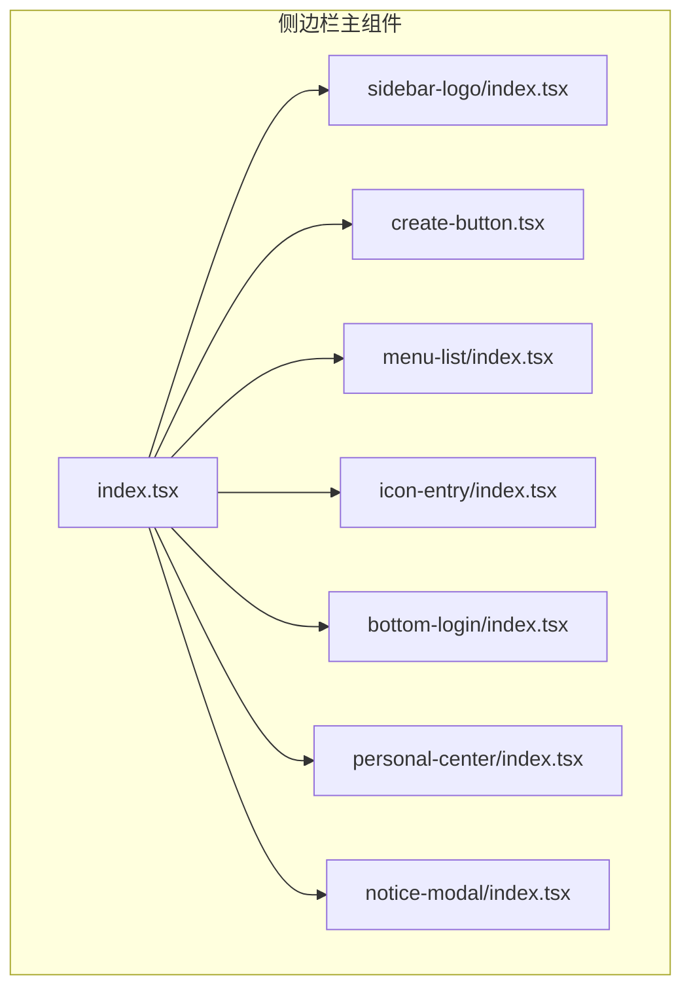
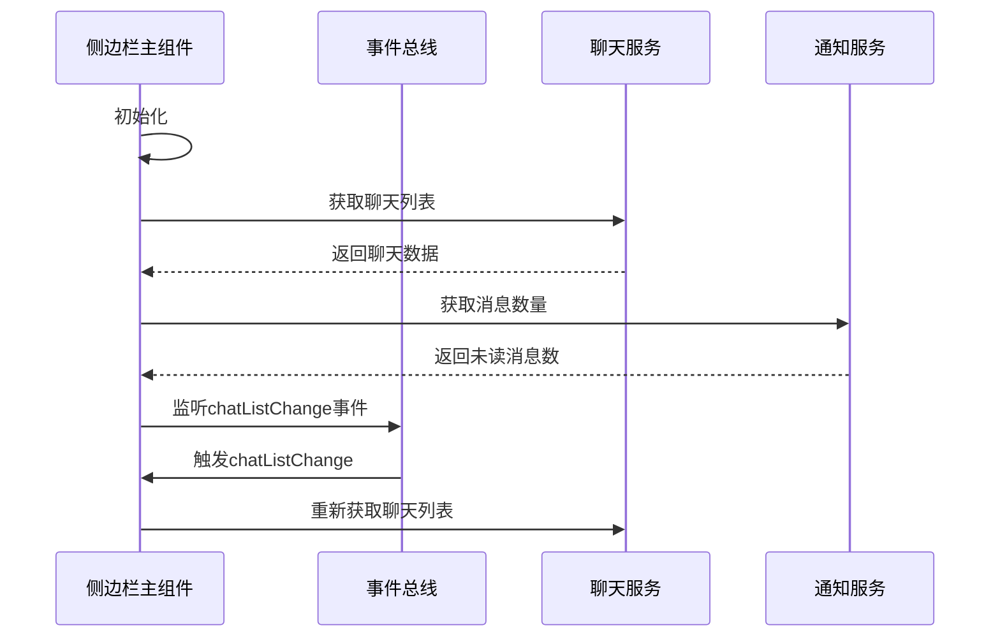
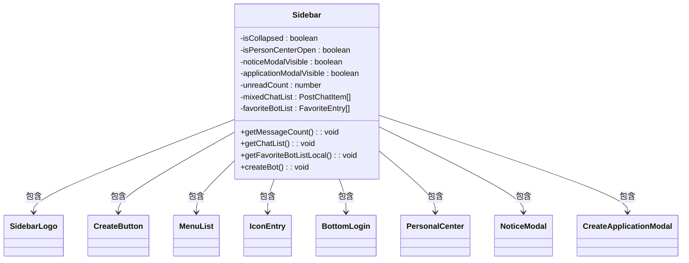
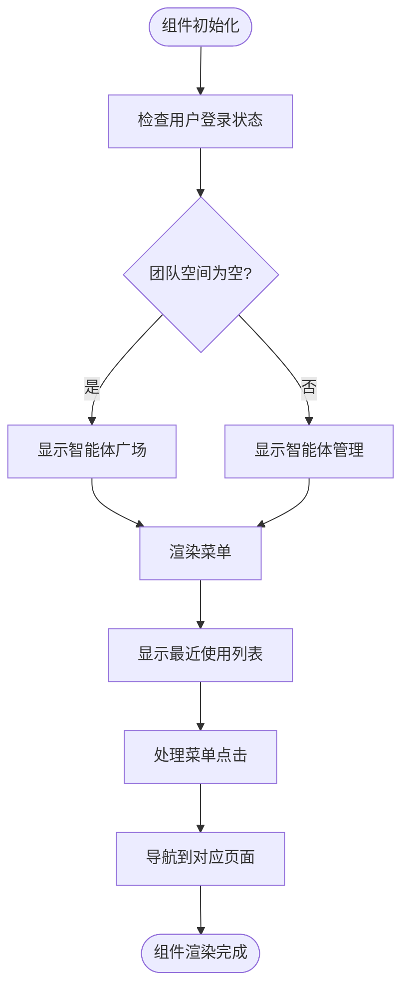
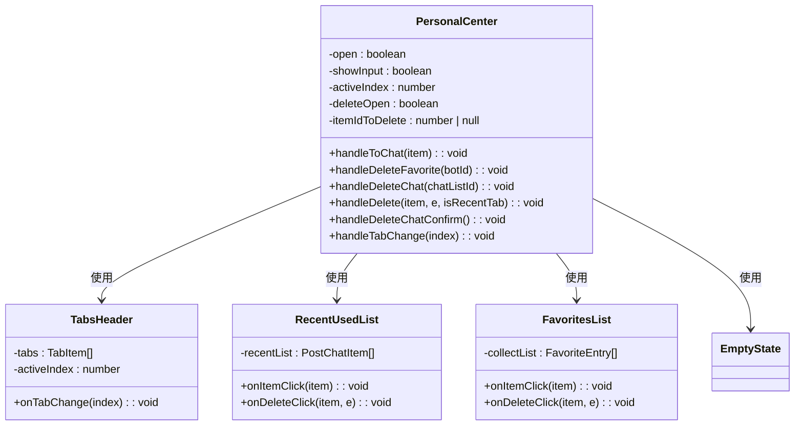
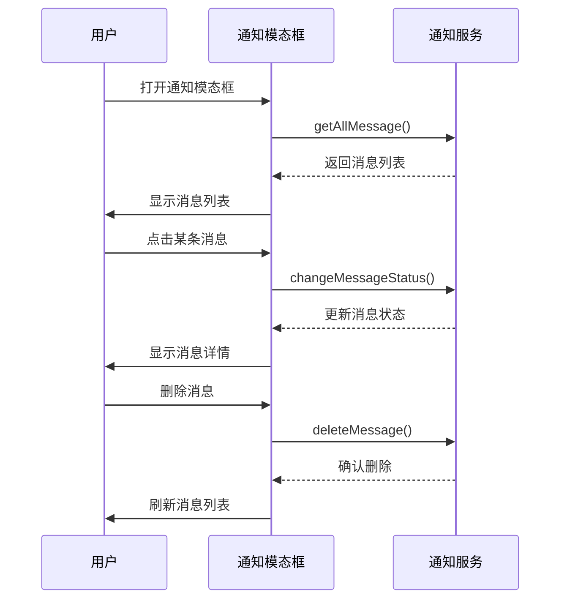
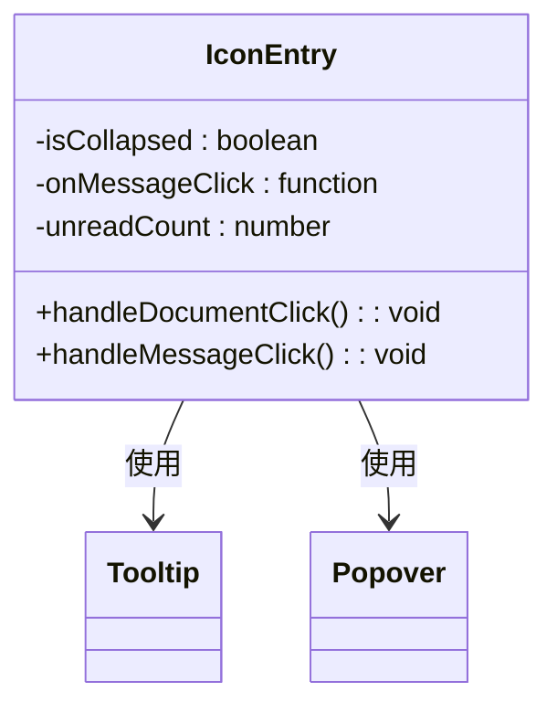
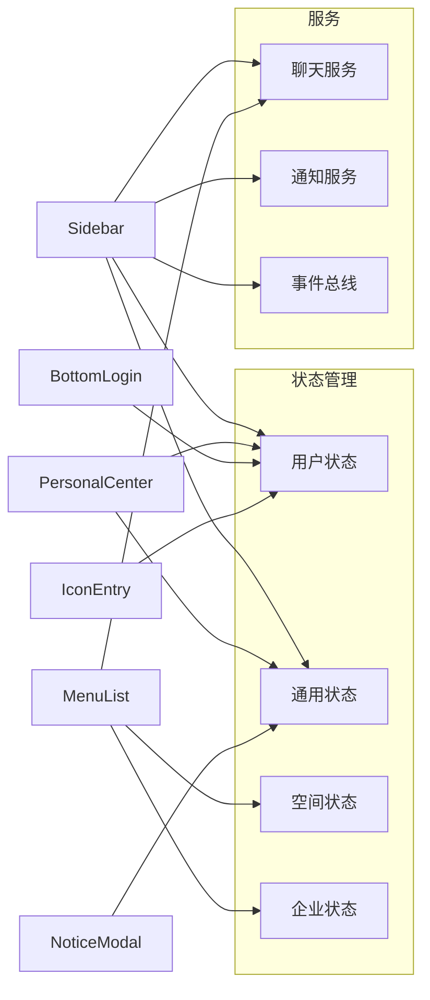

# 侧边栏组件

<cite>
**本文档引用的文件**  
- [index.tsx](file://console/frontend/src/components/sidebar/index.tsx)
- [menu-list/index.tsx](file://console/frontend/src/components/sidebar/menu-list/index.tsx)
- [personal-center/index.tsx](file://console/frontend/src/components/sidebar/personal-center/index.tsx)
- [notice-modal/index.tsx](file://console/frontend/src/components/sidebar/notice-modal/index.tsx)
- [icon-entry/index.tsx](file://console/frontend/src/components/sidebar/icon-entry/index.tsx)
- [bottom-login/index.tsx](file://console/frontend/src/components/sidebar/bottom-login/index.tsx)
- [sidebar-logo/index.tsx](file://console/frontend/src/components/sidebar/sidebar-logo/index.tsx)
- [create-button.tsx](file://console/frontend/src/components/sidebar/create-button.tsx)
- [index.module.scss](file://console/frontend/src/components/sidebar/personal-center/index.module.scss)
- [index.module.scss](file://console/frontend/src/components/sidebar/notice-modal/index.module.scss)
</cite>

## 目录
1. [简介](#简介)
2. [项目结构](#项目结构)
3. [核心组件](#核心组件)
4. [架构概述](#架构概述)
5. [详细组件分析](#详细组件分析)
6. [依赖分析](#依赖分析)
7. [性能考虑](#性能考虑)
8. [故障排除指南](#故障排除指南)
9. [结论](#结论)

## 简介
侧边栏组件是Astron Agent平台的核心导航组件，为用户提供主要的导航功能、消息通知、个人中心访问以及创建新应用的入口。该组件设计为可折叠/展开，支持响应式布局，并集成了权限控制机制。侧边栏包含多个子组件，如导航菜单、通知模态框、个人中心等，共同构成了用户与平台交互的主要界面。

## 项目结构
侧边栏组件位于`console/frontend/src/components/sidebar/`目录下，采用模块化设计，将不同功能拆分为独立的子组件。这种结构提高了代码的可维护性和可重用性。

**图源**  
- [index.tsx](file://console/frontend/src/components/sidebar/index.tsx)
- [sidebar-logo/index.tsx](file://console/frontend/src/components/sidebar/sidebar-logo/index.tsx)
- [create-button.tsx](file://console/frontend/src/components/sidebar/create-button.tsx)
- [menu-list/index.tsx](file://console/frontend/src/components/sidebar/menu-list/index.tsx)
- [icon-entry/index.tsx](file://console/frontend/src/components/sidebar/icon-entry/index.tsx)
- [bottom-login/index.tsx](file://console/frontend/src/components/sidebar/bottom-login/index.tsx)
- [personal-center/index.tsx](file://console/frontend/src/components/sidebar/personal-center/index.tsx)
- [notice-modal/index.tsx](file://console/frontend/src/components/sidebar/notice-modal/index.tsx)

**本节来源**  
- [index.tsx](file://console/frontend/src/components/sidebar/index.tsx)

## 核心组件
侧边栏组件由多个子组件构成，每个子组件负责特定的功能。主组件`Sidebar`负责协调各子组件的状态和交互，而子组件则专注于各自的UI和逻辑实现。组件间通过props传递数据和回调函数，保持了良好的解耦。

**本节来源**  
- [index.tsx](file://console/frontend/src/components/sidebar/index.tsx)

## 架构概述
侧边栏采用React函数式组件和Hooks的现代React架构。组件状态管理主要通过useState和useEffect实现，同时利用Redux-like状态管理库（通过useUserStore等hook）来管理全局状态。组件间通信通过事件总线（eventBus）实现，允许跨组件的事件通知。

**图源**  
- [index.tsx](file://console/frontend/src/components/sidebar/index.tsx)
- [menu-list/index.tsx](file://console/frontend/src/components/sidebar/menu-list/index.tsx)
- [notice-modal/index.tsx](file://console/frontend/src/components/sidebar/notice-modal/index.tsx)

## 详细组件分析
侧边栏由多个功能独立的子组件构成，每个组件都有其特定的职责和实现方式。

### 侧边栏主组件分析
主组件`Sidebar`是整个侧边栏的容器，负责管理折叠状态、消息数量以及协调各子组件的交互。

#### 对于API/服务组件：

**图源**  
- [index.tsx](file://console/frontend/src/components/sidebar/index.tsx)

**本节来源**  
- [index.tsx](file://console/frontend/src/components/sidebar/index.tsx)

### 导航菜单组件分析
`MenuList`组件负责显示主要的导航选项，包括空间切换、功能模块入口和最近使用列表。

#### 对于复杂逻辑组件：

**图源**  
- [menu-list/index.tsx](file://console/frontend/src/components/sidebar/menu-list/index.tsx)

**本节来源**  
- [menu-list/index.tsx](file://console/frontend/src/components/sidebar/menu-list/index.tsx)

### 个人中心组件分析
`PersonalCenter`组件提供用户个人信息管理、最近使用和收藏的智能体管理功能。

#### 对于对象导向组件：

**图源**  
- [personal-center/index.tsx](file://console/frontend/src/components/sidebar/personal-center/index.tsx)

**本节来源**  
- [personal-center/index.tsx](file://console/frontend/src/components/sidebar/personal-center/index.tsx)

### 通知模态框组件分析
`NoticeModal`组件提供系统消息、公告和私信的通知查看功能。

#### 对于API/服务组件：

**图源**  
- [notice-modal/index.tsx](file://console/frontend/src/components/sidebar/notice-modal/index.tsx)

**本节来源**  
- [notice-modal/index.tsx](file://console/frontend/src/components/sidebar/notice-modal/index.tsx)

### 图标入口组件分析
`IconEntry`组件提供文档中心、消息中心等快捷入口。

#### 对于对象导向组件：

**图源**  
- [icon-entry/index.tsx](file://console/frontend/src/components/sidebar/icon-entry/index.tsx)

**本节来源**  
- [icon-entry/index.tsx](file://console/frontend/src/components/sidebar/icon-entry/index.tsx)

## 依赖分析
侧边栏组件依赖于多个外部服务和状态管理模块，形成了一个复杂的依赖网络。

**图源**  
- [index.tsx](file://console/frontend/src/components/sidebar/index.tsx)
- [menu-list/index.tsx](file://console/frontend/src/components/sidebar/menu-list/index.tsx)
- [personal-center/index.tsx](file://console/frontend/src/components/sidebar/personal-center/index.tsx)
- [notice-modal/index.tsx](file://console/frontend/src/components/sidebar/notice-modal/index.tsx)
- [bottom-login/index.tsx](file://console/frontend/src/components/sidebar/bottom-login/index.tsx)
- [icon-entry/index.tsx](file://console/frontend/src/components/sidebar/icon-entry/index.tsx)

**本节来源**  
- [index.tsx](file://console/frontend/src/components/sidebar/index.tsx)
- [menu-list/index.tsx](file://console/frontend/src/components/sidebar/menu-list/index.tsx)
- [personal-center/index.tsx](file://console/frontend/src/components/sidebar/personal-center/index.tsx)
- [notice-modal/index.tsx](file://console/frontend/src/components/sidebar/notice-modal/index.tsx)
- [bottom-login/index.tsx](file://console/frontend/src/components/sidebar/bottom-login/index.tsx)
- [icon-entry/index.tsx](file://console/frontend/src/components/sidebar/icon-entry/index.tsx)

## 性能考虑
侧边栏组件在设计时考虑了性能优化，通过以下方式确保流畅的用户体验：
- 使用React.memo对子组件进行记忆化，避免不必要的重新渲染
- 采用虚拟滚动技术处理大量数据列表
- 合理使用useCallback和useMemo优化函数和计算属性
- 通过事件总线减少组件间的直接依赖，降低重新渲染的范围
- 对API调用进行合理的缓存和节流处理

## 故障排除指南
当侧边栏组件出现问题时，可以参考以下常见问题的解决方案：

**本节来源**  
- [index.tsx](file://console/frontend/src/components/sidebar/index.tsx)
- [menu-list/index.tsx](file://console/frontend/src/components/sidebar/menu-list/index.tsx)
- [personal-center/index.tsx](file://console/frontend/src/components/sidebar/personal-center/index.tsx)

## 结论
侧边栏组件是Astron Agent平台的核心导航组件，通过模块化设计和合理的状态管理，实现了丰富的功能和良好的用户体验。组件支持响应式布局、权限控制和动态内容更新，为用户提供了高效的操作界面。通过进一步优化性能和用户体验，该组件可以更好地服务于平台的长期发展。