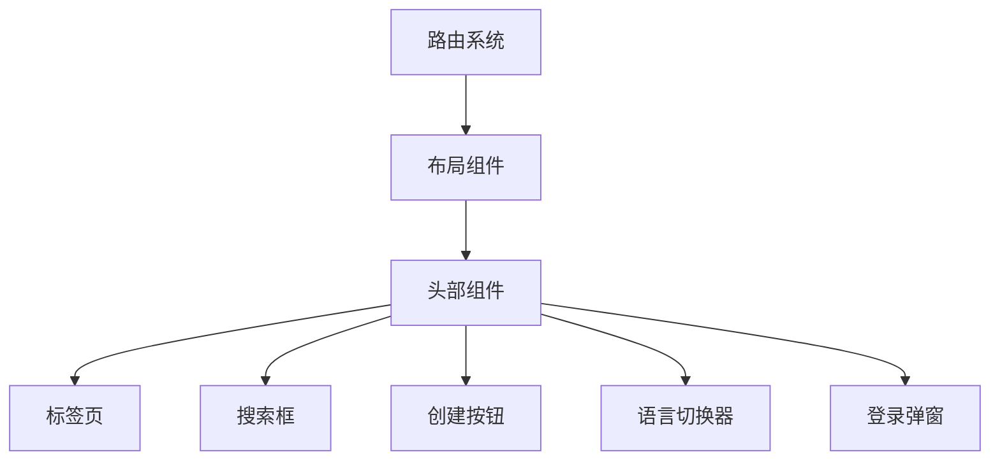
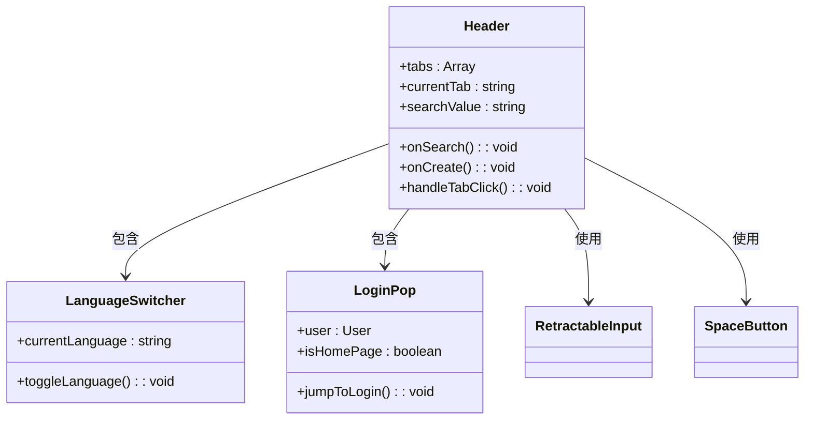
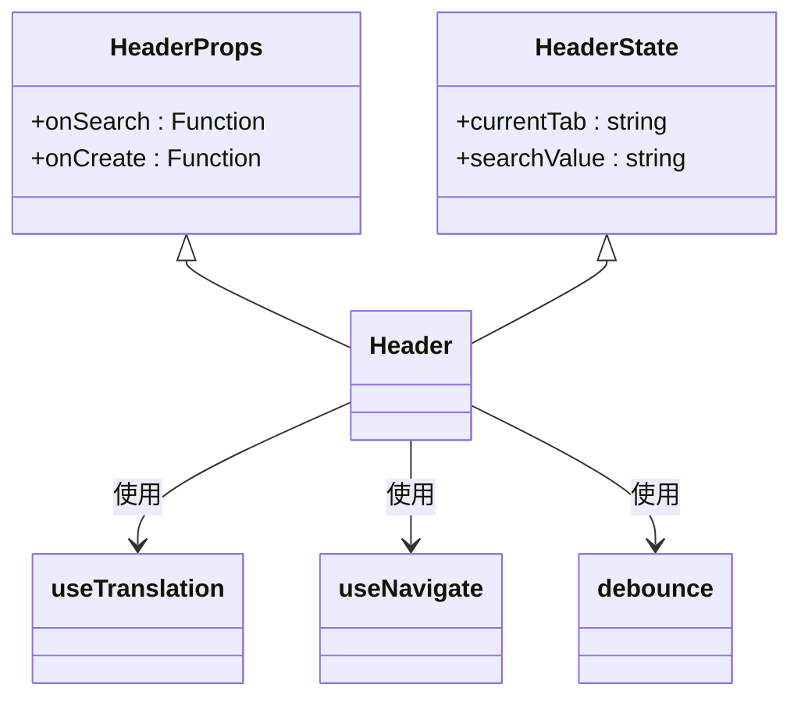
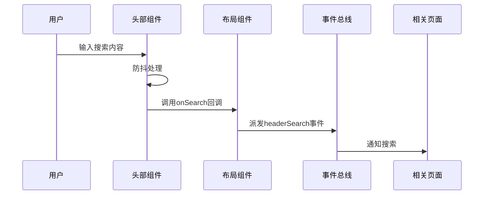
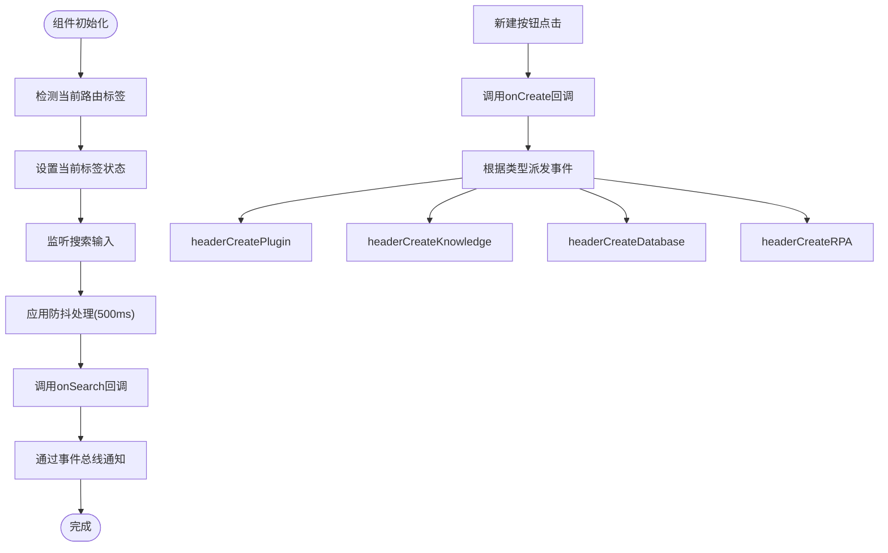
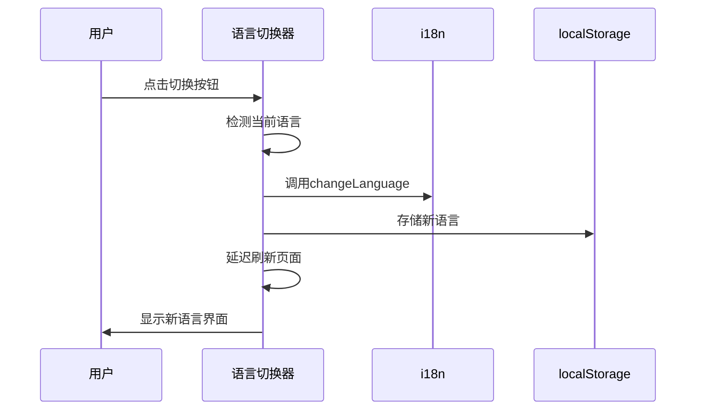
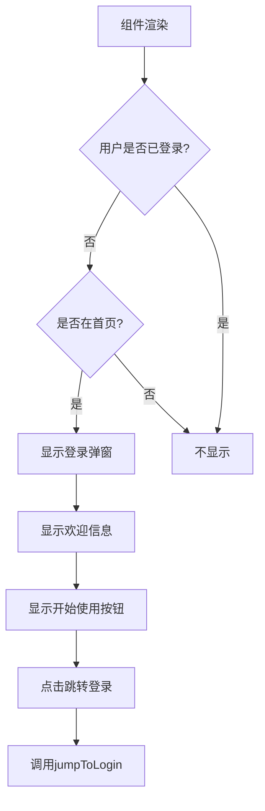
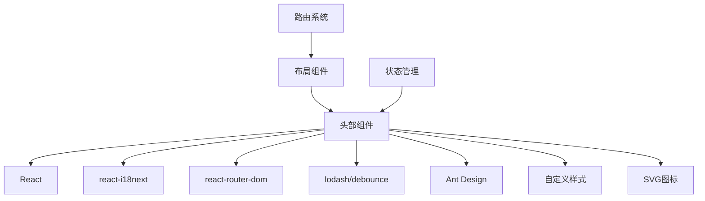

# 头部组件

<cite>
**本文档引用文件**  
- [header/index.tsx](file://console/frontend/src/components/header/index.tsx)
- [header/index.module.scss](file://console/frontend/src/components/header/index.module.scss)
- [language-switcher/index.tsx](file://console/frontend/src/components/language-switcher/index.tsx)
- [login-pop/index.tsx](file://console/frontend/src/components/login-pop/index.tsx)
- [login-pop/style.module.scss](file://console/frontend/src/components/login-pop/style.module.scss)
- [layouts/index.tsx](file://console/frontend/src/layouts/index.tsx)
- [i18n/index.ts](file://console/frontend/src/i18n/index.ts)
- [locales/zh.js](file://console/frontend/src/locales/zh.js)
- [locales/en.js](file://console/frontend/src/locales/en.js)
- [styles/global.scss](file://console/frontend/src/styles/global.scss)
- [router/index.tsx](file://console/frontend/src/router/index.tsx)
- [pages/resource-management/index.tsx](file://console/frontend/src/pages/resource-management/index.tsx)
- [store/user-store.tsx](file://console/frontend/src/store/user-store.tsx)
</cite>

## 目录
1. [简介](#简介)
2. [项目结构](#项目结构)
3. [核心组件](#核心组件)
4. [架构概述](#架构概述)
5. [详细组件分析](#详细组件分析)
6. [依赖分析](#依赖分析)
7. [性能考虑](#性能考虑)
8. [故障排除指南](#故障排除指南)
9. [结论](#结论)

## 简介
本项目中的头部组件是用户界面的核心导航区域，包含语言切换器、登录弹窗等关键子组件。头部组件实现了响应式设计和主题适配机制，支持国际化和用户身份状态管理。通过分析代码结构，我们可以深入了解其设计原则和实现方式。

## 项目结构
头部组件位于`console/frontend/src/components/header`目录下，与其他UI组件如语言切换器、登录弹窗等共同构成完整的头部区域。整体结构遵循模块化设计原则，各组件职责分明。

**图示来源**  
- [header/index.tsx](file://console/frontend/src/components/header/index.tsx)
- [layouts/index.tsx](file://console/frontend/src/layouts/index.tsx)
- [router/index.tsx](file://console/frontend/src/router/index.tsx)

**本节来源**  
- [header/index.tsx](file://console/frontend/src/components/header/index.tsx)
- [layouts/index.tsx](file://console/frontend/src/layouts/index.tsx)

## 核心组件
头部组件包含多个核心子组件，每个组件都有明确的职责和功能。主要组件包括标签页导航、搜索功能、创建按钮、语言切换器和登录弹窗等。

**本节来源**  
- [header/index.tsx](file://console/frontend/src/components/header/index.tsx)
- [language-switcher/index.tsx](file://console/frontend/src/components/language-switcher/index.tsx)
- [login-pop/index.tsx](file://console/frontend/src/components/login-pop/index.tsx)

## 架构概述
头部组件采用React函数式组件结合Hooks的现代前端架构，通过props传递和事件总线机制实现组件间通信。整体架构体现了高内聚、低耦合的设计原则。

**图示来源**  
- [header/index.tsx](file://console/frontend/src/components/header/index.tsx)
- [language-switcher/index.tsx](file://console/frontend/src/components/language-switcher/index.tsx)
- [login-pop/index.tsx](file://console/frontend/src/components/login-pop/index.tsx)

## 详细组件分析
### 头部主组件分析
头部主组件实现了标签页导航、搜索和创建功能，通过React Router进行路由管理，使用防抖技术优化搜索性能。

#### 对象导向组件

**图示来源**  
- [header/index.tsx](file://console/frontend/src/components/header/index.tsx)

#### API/服务组件

**图示来源**  
- [header/index.tsx](file://console/frontend/src/components/header/index.tsx)
- [layouts/index.tsx](file://console/frontend/src/layouts/index.tsx)

#### 复杂逻辑组件

**图示来源**  
- [header/index.tsx](file://console/frontend/src/components/header/index.tsx)
- [layouts/index.tsx](file://console/frontend/src/layouts/index.tsx)

**本节来源**  
- [header/index.tsx](file://console/frontend/src/components/header/index.tsx)
- [header/index.module.scss](file://console/frontend/src/components/header/index.module.scss)

### 语言切换器分析
语言切换器组件实现了中英文切换功能，通过react-i18next库进行国际化管理，将语言偏好存储在localStorage中。

**图示来源**  
- [language-switcher/index.tsx](file://console/frontend/src/components/language-switcher/index.tsx)
- [i18n/index.ts](file://console/frontend/src/i18n/index.ts)

**本节来源**  
- [language-switcher/index.tsx](file://console/frontend/src/components/language-switcher/index.tsx)
- [i18n/index.ts](file://console/frontend/src/i18n/index.ts)

### 登录弹窗分析
登录弹窗组件根据用户登录状态和页面位置决定是否显示，为未登录用户提供便捷的登录入口。

**图示来源**  
- [login-pop/index.tsx](file://console/frontend/src/components/login-pop/index.tsx)
- [store/user-store.tsx](file://console/frontend/src/store/user-store.tsx)

**本节来源**  
- [login-pop/index.tsx](file://console/frontend/src/components/login-pop/index.tsx)
- [login-pop/style.module.scss](file://console/frontend/src/components/login-pop/style.module.scss)

## 依赖分析
头部组件依赖多个外部库和内部模块，形成了清晰的依赖关系网络。

**图示来源**  
- [header/index.tsx](file://console/frontend/src/components/header/index.tsx)
- [language-switcher/index.tsx](file://console/frontend/src/components/language-switcher/index.tsx)
- [login-pop/index.tsx](file://console/frontend/src/components/login-pop/index.tsx)

**本节来源**  
- [header/index.tsx](file://console/frontend/src/components/header/index.tsx)
- [language-switcher/index.tsx](file://console/frontend/src/components/language-switcher/index.tsx)
- [login-pop/index.tsx](file://console/frontend/src/components/login-pop/index.tsx)

## 性能考虑
头部组件在性能方面做了多项优化，包括搜索输入的防抖处理、组件的懒加载以及状态管理的优化。

- **防抖优化**：搜索功能使用500ms防抖，避免频繁触发搜索请求
- **条件渲染**：根据路由动态显示/隐藏头部组件
- **事件总线**：使用自定义事件进行组件间通信，降低耦合度
- **资源预加载**：关键资源提前加载，提升用户体验

## 故障排除指南
### 常见问题及解决方案
1. **语言切换不生效**
   - 检查localStorage中的locale-storage值
   - 确认i18n配置是否正确加载
   - 验证语言文件路径是否正确

2. **搜索功能无响应**
   - 检查onSearch回调函数是否正确传递
   - 验证事件监听器是否正常工作
   - 确认防抖设置是否合理

3. **登录弹窗不显示**
   - 检查用户登录状态
   - 验证当前页面路径是否匹配
   - 确认组件条件渲染逻辑

**本节来源**  
- [header/index.tsx](file://console/frontend/src/components/header/index.tsx)
- [login-pop/index.tsx](file://console/frontend/src/components/login-pop/index.tsx)
- [layouts/index.tsx](file://console/frontend/src/layouts/index.tsx)

## 结论
头部组件作为项目的核心导航区域，实现了丰富的功能和良好的用户体验。通过模块化设计和合理的状态管理，组件具有良好的可维护性和扩展性。未来可以考虑增加更多个性化设置选项，进一步提升用户交互体验。