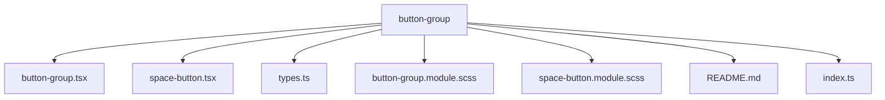
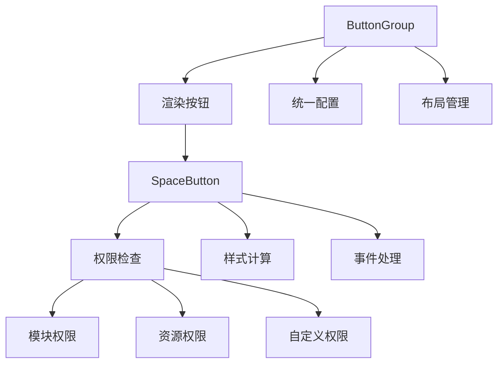
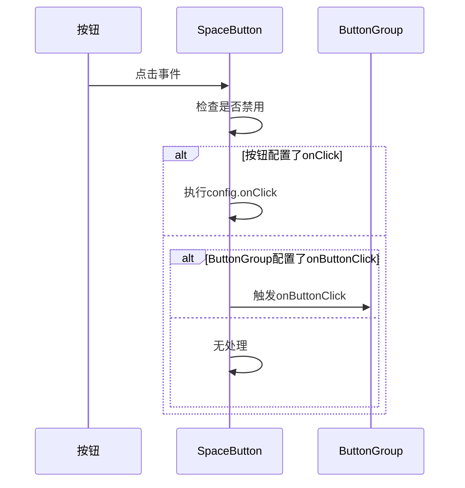
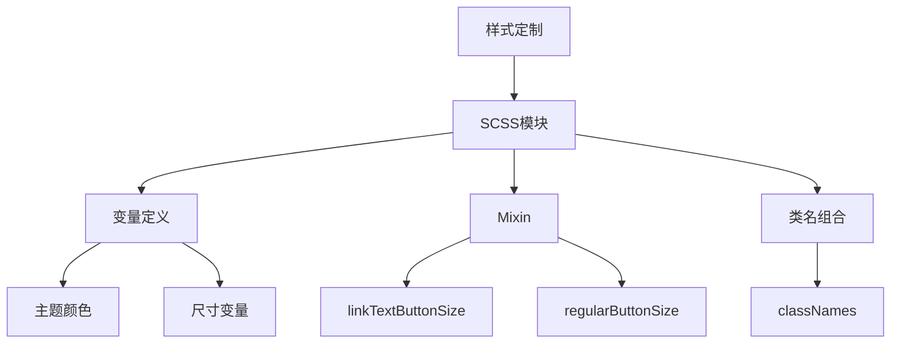
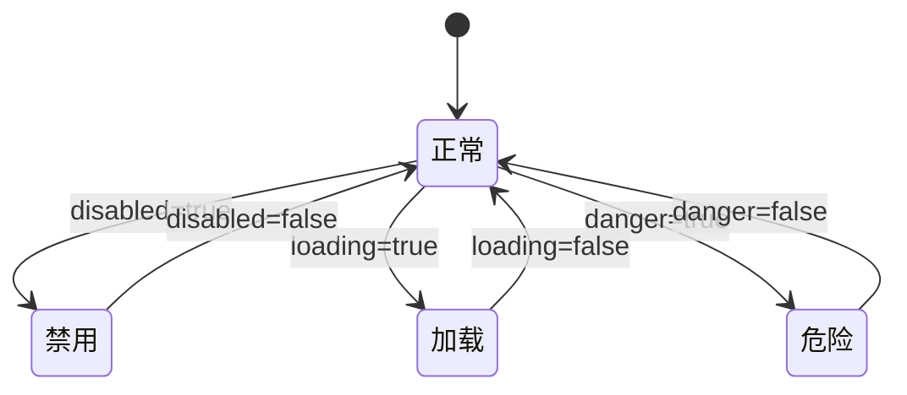
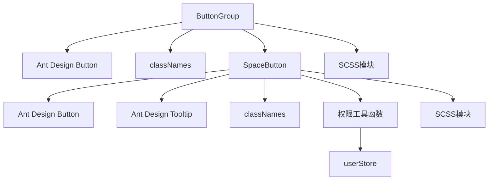

# 按钮组件

<cite>
**本文档引用的文件**
- [button-group.tsx](file://console/frontend/src/components/button-group/button-group.tsx)
- [space-button.tsx](file://console/frontend/src/components/button-group/space-button.tsx)
- [types.ts](file://console/frontend/src/components/button-group/types.ts)
- [button-group.module.scss](file://console/frontend/src/components/button-group/button-group.module.scss)
- [space-button.module.scss](file://console/frontend/src/components/button-group/space-button.module.scss)
- [README.md](file://console/frontend/src/components/button-group/README.md)
</cite>

## 目录
1. [简介](#简介)
2. [项目结构](#项目结构)
3. [核心组件](#核心组件)
4. [架构概述](#架构概述)
5. [详细组件分析](#详细组件分析)
6. [依赖分析](#依赖分析)
7. [性能考虑](#性能考虑)
8. [故障排除指南](#故障排除指南)
9. [结论](#结论)
10. [附录](#附录)（如有必要）

## 简介
按钮组件是一套基于权限控制的按钮组件，专为空间管理场景设计。它们提供了统一的权限验证、样式管理和交互处理功能。该组件系统由 ButtonGroup（按钮组）和 SpaceButton（单个按钮）两个核心组件构成，支持灵活的权限配置、样式定制和事件处理机制。

## 项目结构
按钮组件位于 `console/frontend/src/components/button-group` 目录下，采用模块化设计，包含主组件、样式文件、类型定义和文档说明。



**Diagram sources**
- [button-group.tsx](file://console/frontend/src/components/button-group/button-group.tsx)
- [space-button.tsx](file://console/frontend/src/components/button-group/space-button.tsx)

**Section sources**
- [button-group.tsx](file://console/frontend/src/components/button-group/button-group.tsx)
- [space-button.tsx](file://console/frontend/src/components/button-group/space-button.tsx)

## 核心组件
按钮组件系统由两个核心组件构成：ButtonGroup 作为按钮组容器组件，支持多个按钮的统一管理；SpaceButton 作为单个按钮组件，内置权限控制和状态管理。组件提供了完整的 TypeScript 类型支持，确保类型安全。

**Section sources**
- [button-group.tsx](file://console/frontend/src/components/button-group/button-group.tsx#L1-L65)
- [space-button.tsx](file://console/frontend/src/components/button-group/space-button.tsx#L1-L215)

## 架构概述
按钮组件采用分层架构设计，将按钮组容器与单个按钮功能分离，实现了关注点分离。ButtonGroup 负责整体布局和统一配置，而 SpaceButton 负责具体的按钮渲染、权限检查和交互处理。



**Diagram sources**
- [button-group.tsx](file://console/frontend/src/components/button-group/button-group.tsx#L1-L65)
- [space-button.tsx](file://console/frontend/src/components/button-group/space-button.tsx#L1-L215)

## 详细组件分析
按钮组件系统提供了丰富的功能特性，包括灵活的 props 接口、完善的事件处理机制、基于 SCSS 模块的样式定制方案，以及对响应式设计和可访问性的全面支持。

### 组件 Props 接口分析
按钮组件提供了详细的 props 接口定义，支持类型安全的开发体验。

#### ButtonGroup Props
| 属性 | 类型 | 默认值 | 说明 |
| --- | --- | --- | --- |
| buttons | `ButtonConfig[]` | - | 按钮配置数组 |
| userRole | `UserRole?` | - | 用户角色信息，不传时自动从 userStore 获取 |
| className | `string?` | - | 自定义样式类名 |
| size | `'large' \| 'middle' \| 'small'` | `'middle'` | 按钮大小 |
| onButtonClick | `(key: string, event: React.MouseEvent) => void` | - | 统一的按钮点击处理函数 |
| style | `React.CSSProperties?` | - | 自定义样式 |
| vertical | `boolean` | `false` | 是否垂直排列 |
| split | `boolean` | `true` | 是否显示分割线 |

#### SpaceButton Props
| 属性 | 类型 | 默认值 | 说明 |
| --- | --- | --- | --- |
| config | `ButtonConfig` | - | 按钮配置 |
| userRole | `UserRole?` | - | 用户角色信息，不传时自动从 userStore 获取 |
| className | `string?` | - | 自定义样式类名 |
| style | `React.CSSProperties?` | - | 自定义样式 |
| size | `'large' \| 'middle' \| 'small'` | - | 按钮大小 |
| onClick | `(key: string, event: React.MouseEvent) => void` | - | 点击事件处理函数 |
| inGroup | `boolean` | `false` | 是否在按钮组中 |

#### ButtonConfig 配置
| 属性 | 类型 | 默认值 | 说明 |
| --- | --- | --- | --- |
| key | `string` | - | 按钮唯一标识符 |
| text | `string` | - | 按钮文本 |
| icon | `React.ReactNode?` | - | 按钮图标 |
| type | `'primary' \| 'default' \| 'dashed' \| 'link' \| 'text'` | `'default'` | 按钮类型 |
| size | `'large' \| 'middle' \| 'small'` | - | 按钮大小 |
| disabled | `boolean` | `false` | 是否禁用 |
| tooltip | `string?` | - | 提示文本 |
| danger | `boolean` | `false` | 是否为危险按钮 |
| loading | `boolean` | `false` | 是否显示加载状态 |
| onClick | `(key: string, event: React.MouseEvent) => void` | - | 按钮点击处理函数 |
| permission | `PermissionConfig?` | - | 权限配置 |
| visible | `boolean \| ((userRole: UserRole) => boolean)` | `true` | 显示条件 |

**Section sources**
- [types.ts](file://console/frontend/src/components/button-group/types.ts#L1-L105)

### 事件处理机制分析
按钮组件的事件处理机制采用了优先级模式，确保了灵活的事件处理能力。



**Diagram sources**
- [space-button.tsx](file://console/frontend/src/components/button-group/space-button.tsx#L152-L213)
- [button-group.tsx](file://console/frontend/src/components/button-group/button-group.tsx#L1-L65)

**Section sources**
- [space-button.tsx](file://console/frontend/src/components/button-group/space-button.tsx#L152-L213)

### 样式定制方案分析
按钮组件采用 SCSS 模块进行样式管理，提供了灵活的样式定制方案。



**Diagram sources**
- [button-group.module.scss](file://console/frontend/src/components/button-group/button-group.module.scss)
- [space-button.module.scss](file://console/frontend/src/components/button-group/space-button.module.scss)

**Section sources**
- [button-group.module.scss](file://console/frontend/src/components/button-group/button-group.module.scss#L1-L104)
- [space-button.module.scss](file://console/frontend/src/components/button-group/space-button.module.scss#L1-L213)

### 响应式设计与可访问性实现
按钮组件充分考虑了响应式设计和可访问性需求，提供了完整的支持。

#### 响应式设计
组件通过 SCSS 媒体查询和弹性布局实现了响应式设计，确保在不同屏幕尺寸下都能提供良好的用户体验。按钮大小支持 large、middle、small 三种规格，可根据容器大小自动调整。

#### 可访问性实现
组件实现了完整的可访问性支持，包括键盘导航和 ARIA 标签。按钮元素具有适当的 role 属性，支持键盘焦点导航，并提供了 focus-visible 样式以增强可访问性。

```scss
// 可访问性支持
.spaceButtonGroup {
  .button {
    &:focus-visible {
      outline: 2px solid var(--primary-color);
      outline-offset: 2px;
      border-radius: 4px;
    }
  }
}
```

**Section sources**
- [button-group.module.scss](file://console/frontend/src/components/button-group/button-group.module.scss#L98-L103)
- [space-button.module.scss](file://console/frontend/src/components/button-group/space-button.module.scss#L20-L30)

### 实际使用示例
以下展示了按钮组件在不同场景下的使用方法。

#### 简单按钮组
```typescript
import React from 'react';
import ButtonGroup from '@/components/space/ButtonGroup';
import { EditOutlined, DeleteOutlined, ShareAltOutlined } from '@ant-design/icons';

const MyComponent = () => {
  const buttons = [
    {
      key: 'edit',
      text: '编辑',
      icon: <EditOutlined />,
      type: 'primary' as const
    },
    {
      key: 'share',
      text: '分享',
      icon: <ShareAltOutlined />,
      type: 'default' as const
    },
    {
      key: 'delete',
      text: '删除',
      icon: <DeleteOutlined />,
      type: 'default' as const,
      danger: true
    }
  ];

  const handleButtonClick = (buttonKey: string, event: React.MouseEvent) => {
    console.log('按钮点击:', buttonKey);
  };

  return (
    <ButtonGroup
      buttons={buttons}
      onButtonClick={handleButtonClick}
    />
  );
};
```

#### 带权限控制的按钮组
```typescript
import React from 'react';
import ButtonGroup from '@/components/space/ButtonGroup';
import { ModuleType, OperationType, SpaceType, RoleType } from '@/components/space/ButtonGroup';
import type { ButtonConfig, UserRole } from '@/components/space/ButtonGroup';

const PermissionButtonGroup = () => {
  const userRole: UserRole = {
    spaceType: SpaceType.ENTERPRISE,
    roleType: RoleType.ADMIN
  };

  const buttons: ButtonConfig[] = [
    {
      key: 'edit',
      text: '编辑',
      icon: <EditOutlined />,
      type: 'primary',
      permission: {
        module: ModuleType.AGENT_MANAGEMENT,
        operation: OperationType.UPDATE
      }
    },
    {
      key: 'delete',
      text: '删除',
      icon: <DeleteOutlined />,
      danger: true,
      permission: {
        module: ModuleType.AGENT_MANAGEMENT,
        operation: OperationType.DELETE,
        resourceOwnerId: 'owner123',
        currentUserId: 'user456'
      }
    },
    {
      key: 'advanced',
      text: '高级功能',
      permission: {
        customCheck: (userRole) => userRole.roleType === RoleType.SUPER_ADMIN
      }
    }
  ];

  return (
    <ButtonGroup
      buttons={buttons}
      userRole={userRole}
      onButtonClick={(key) => console.log('点击了:', key)}
    />
  );
};
```

#### 单独使用 SpaceButton
```typescript
import React from 'react';
import { SpaceButton } from '@/components/space/ButtonGroup';
import { PlusOutlined } from '@ant-design/icons';

const SingleButton = () => {
  const buttonConfig = {
    key: 'create',
    text: '创建',
    icon: <PlusOutlined />,
    type: 'primary' as const,
    tooltip: '创建新的资源'
  };

  return (
    <SpaceButton
      config={buttonConfig}
      onClick={(key) => console.log('创建操作')}
    />
  );
};
```

**Section sources**
- [README.md](file://console/frontend/src/components/button-group/README.md#L38-L164)

### 设计原则分析
按钮组件遵循了统一的设计原则，确保了视觉一致性、交互反馈和状态管理的完整性。

#### 视觉一致性
组件通过统一的 SCSS 变量和 Mixin 确保了视觉一致性。主题颜色、字体大小、边框半径等样式属性都通过变量定义，便于全局统一管理。

#### 交互反馈
组件提供了丰富的交互反馈，包括 hover 状态、点击状态、禁用状态和加载状态。通过 CSS 伪类和状态类名实现了平滑的交互效果。

#### 状态管理
组件通过 props 和内部状态实现了完整的状态管理。按钮的禁用、加载、危险等状态都通过布尔值控制，并在样式中正确反映。



**Diagram sources**
- [space-button.module.scss](file://console/frontend/src/components/button-group/space-button.module.scss#L1-L213)
- [button-group.module.scss](file://console/frontend/src/components/button-group/button-group.module.scss#L1-L104)

**Section sources**
- [space-button.module.scss](file://console/frontend/src/components/button-group/space-button.module.scss#L1-L213)

## 依赖分析
按钮组件依赖于多个外部库和内部模块，形成了完整的依赖关系网络。



**Diagram sources**
- [button-group.tsx](file://console/frontend/src/components/button-group/button-group.tsx#L1-L65)
- [space-button.tsx](file://console/frontend/src/components/button-group/space-button.tsx#L1-L215)

**Section sources**
- [button-group.tsx](file://console/frontend/src/components/button-group/button-group.tsx#L1-L65)
- [space-button.tsx](file://console/frontend/src/components/button-group/space-button.tsx#L1-L215)

## 性能考虑
按钮组件在设计时充分考虑了性能优化，采用了多种策略确保高效渲染。

### 配置缓存
建议将按钮配置提取到组件外部，避免每次渲染都创建新的配置对象，减少不必要的重新渲染。

```typescript
// ✅ 推荐：将按钮配置提取到组件外部
const BUTTON_CONFIGS = [
  { key: 'edit', text: '编辑', icon: <EditOutlined /> },
  { key: 'delete', text: '删除', icon: <DeleteOutlined /> }
];

const MyComponent = () => {
  return <ButtonGroup buttons={BUTTON_CONFIGS} />;
};
```

### 权限检查优化
权限检查逻辑经过优化，避免了不必要的计算。组件支持自动从 userStore 获取用户角色，减少了 props 传递的开销。

**Section sources**
- [README.md](file://console/frontend/src/components/button-group/README.md#L364-L415)
- [space-button.tsx](file://console/frontend/src/components/button-group/space-button.tsx#L1-L215)

## 故障排除指南
以下是一些常见问题及其解决方案。

### 按钮未显示
检查以下几点：
1. 用户是否有相应的权限
2. `visible` 配置是否正确
3. `userRole` 是否正确传入或从 userStore 获取

### 权限检查失败
权限检查失败的按钮会返回 `null`，不会在界面上显示。如果所有按钮都没有权限，整个按钮组也会返回 `null`。

### 样式问题
可以通过以下方式自定义按钮样式：
1. 使用 `className` 属性添加自定义样式类
2. 使用 `style` 属性直接设置样式
3. 修改对应的 SCSS 模块文件

**Section sources**
- [README.md](file://console/frontend/src/components/button-group/README.md#L448-L468)

## 结论
按钮组件是一套功能完善、设计合理的 UI 组件，为项目提供了统一的按钮管理解决方案。通过权限控制、样式定制和事件处理机制，组件能够满足各种复杂的业务需求。其模块化设计和类型安全特性使得组件易于使用和维护，是项目中不可或缺的基础组件。

## 附录
### 更新日志
- **v1.0.0**: 初始版本，支持基础按钮组功能和权限控制
- **v1.1.0**: 新增自动从 userStore 获取用户角色功能
- **v1.1.1**: 优化权限检查逻辑，提升性能

**Section sources**
- [README.md](file://console/frontend/src/components/button-group/README.md#L469-L474)