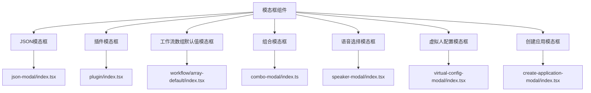
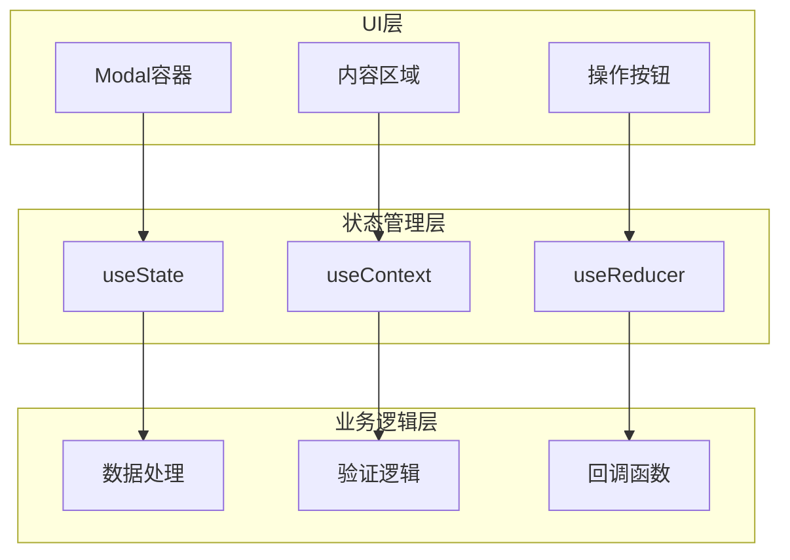
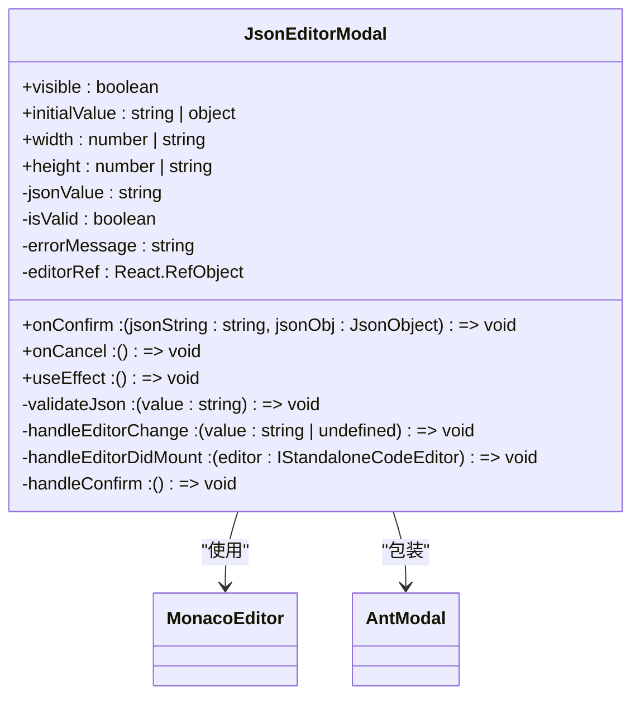
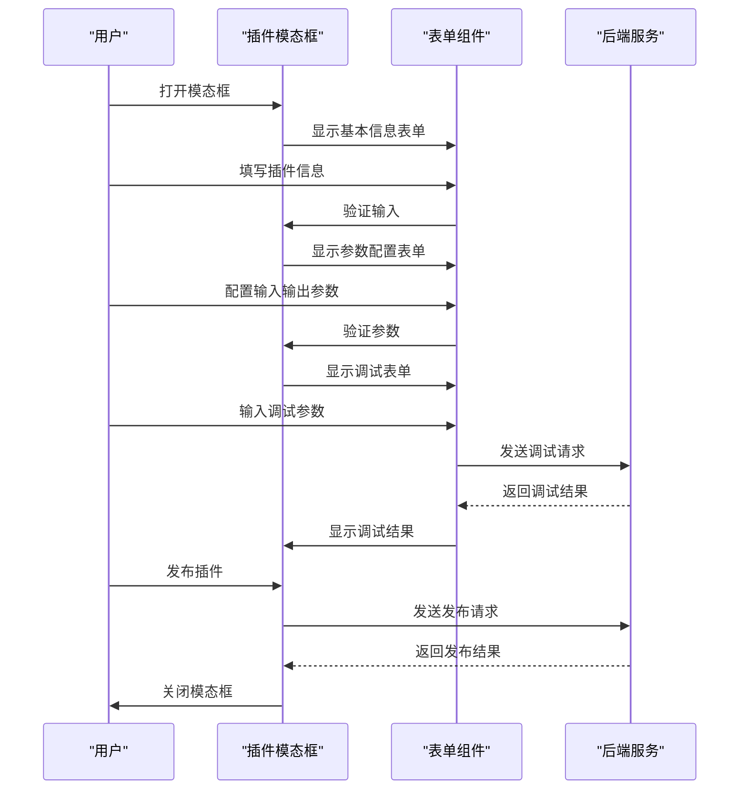
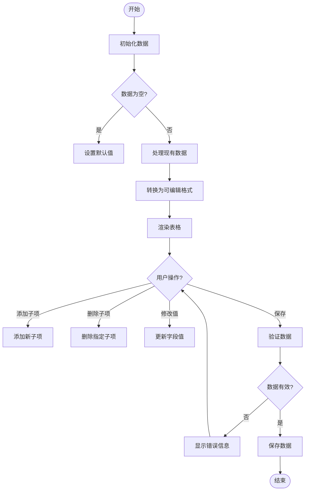
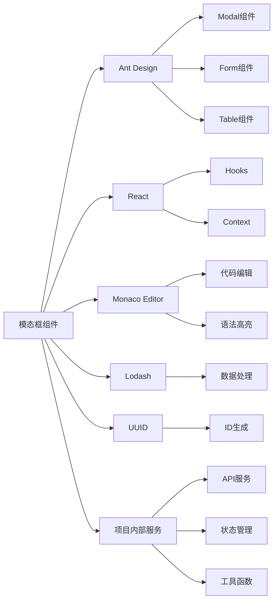

# 模态框组件

<cite>
**本文档引用的文件**  
- [json-modal/index.tsx](file://console/frontend/src/components/modal/json-modal/index.tsx)
- [plugin/array-default.tsx](file://console/frontend/src/components/modal/plugin/array-default.tsx)
- [workflow/array-default/index.tsx](file://console/frontend/src/components/modal/workflow/array-default/index.tsx)
- [workflow/array-default/hooks/use-array-default.tsx](file://console/frontend/src/components/modal/workflow/array-default/hooks/use-array-default.tsx)
- [workflow/array-default/hooks/use-columns.tsx](file://console/frontend/src/components/modal/workflow/array-default/hooks/use-columns.tsx)
- [plugin/index.tsx](file://console/frontend/src/components/modal/plugin/index.tsx)
- [combo-modal/index.ts](file://console/frontend/src/components/combo-modal/index.ts)
- [speaker-modal/index.tsx](file://console/frontend/src/components/speaker-modal/index.tsx)
- [virtual-config-modal/index.tsx](file://console/frontend/src/components/virtual-config-modal/index.tsx)
- [create-application-modal/index.tsx](file://console/frontend/src/components/create-application-modal/index.tsx)
- [model-context.tsx](file://console/frontend/src/pages/model-management/context/model-context.tsx)
- [model-modal-components.tsx](file://console/frontend/src/pages/model-management/components/model-modal-components.tsx)
</cite>

## 目录
1. [简介](#简介)
2. [项目结构](#项目结构)
3. [核心组件](#核心组件)
4. [架构概述](#架构概述)
5. [详细组件分析](#详细组件分析)
6. [依赖分析](#依赖分析)
7. [性能考虑](#性能考虑)
8. [故障排除指南](#故障排除指南)
9. [结论](#结论)
10. [附录](#附录)（如有必要）

## 简介
本项目中的模态框组件是用户界面交互的核心元素，用于在不离开当前页面的情况下展示重要信息、收集用户输入或执行特定操作。模态框的设计遵循一致的用户体验原则，确保在不同场景下都能提供清晰、直观的交互体验。本文档将详细分析项目中各类模态框的实现，包括JSON模态框、插件模态框、工作流数组默认值模态框等，解释其通用props接口、内容渲染机制和样式定制方案。

## 项目结构
模态框组件主要位于`console/frontend/src/components/modal`目录下，按功能和使用场景进行组织。每个模态框组件通常包含独立的目录或文件，便于维护和复用。此外，一些特定业务场景的模态框也分散在相关功能模块中，如模型管理、资源管理等页面。

**Diagram sources**
- [json-modal/index.tsx](file://console/frontend/src/components/modal/json-modal/index.tsx)
- [plugin/index.tsx](file://console/frontend/src/components/modal/plugin/index.tsx)
- [workflow/array-default/index.tsx](file://console/frontend/src/components/modal/workflow/array-default/index.tsx)
- [combo-modal/index.ts](file://console/frontend/src/components/combo-modal/index.ts)
- [speaker-modal/index.tsx](file://console/frontend/src/components/speaker-modal/index.tsx)
- [virtual-config-modal/index.tsx](file://console/frontend/src/components/virtual-config-modal/index.tsx)
- [create-application-modal/index.tsx](file://console/frontend/src/components/create-application-modal/index.tsx)

**Section sources**
- [console/frontend/src/components/modal](file://console/frontend/src/components/modal)

## 核心组件
模态框组件的核心在于其通用性、可配置性和用户体验。通过分析代码，我们发现模态框通常基于Ant Design的Modal组件进行封装，以提供一致的外观和行为。核心功能包括状态管理、内容渲染、事件处理和样式定制。

**Section sources**
- [json-modal/index.tsx](file://console/frontend/src/components/modal/json-modal/index.tsx)
- [plugin/array-default.tsx](file://console/frontend/src/components/modal/plugin/array-default.tsx)
- [workflow/array-default/index.tsx](file://console/frontend/src/components/modal/workflow/array-default/index.tsx)

## 架构概述
模态框组件的架构设计遵循分层原则，将UI展示、状态管理和业务逻辑分离。通过使用React Hooks和Context API，实现了组件间的状态共享和通信，提高了代码的可维护性和可测试性。

**Diagram sources**
- [json-modal/index.tsx](file://console/frontend/src/components/modal/json-modal/index.tsx)
- [workflow/array-default/hooks/use-array-default.tsx](file://console/frontend/src/components/modal/workflow/array-default/hooks/use-array-default.tsx)
- [model-context.tsx](file://console/frontend/src/pages/model-management/context/model-context.tsx)

## 详细组件分析
### JSON模态框分析
JSON模态框用于编辑和验证JSON格式的数据，通常在需要用户输入结构化数据的场景下使用。它集成了Monaco Editor，提供了语法高亮、格式化和错误提示等功能。

#### 对象导向组件：

**Diagram sources**
- [json-modal/index.tsx](file://console/frontend/src/components/modal/json-modal/index.tsx)

**Section sources**
- [json-modal/index.tsx](file://console/frontend/src/components/modal/json-modal/index.tsx)

### 插件模态框分析
插件模态框是一个复杂的多步骤表单，用于创建和配置插件。它通过步骤指示器引导用户完成基本信息填写、参数配置和调试验证三个阶段。

#### API/服务组件：

**Diagram sources**
- [plugin/index.tsx](file://console/frontend/src/components/modal/plugin/index.tsx)

**Section sources**
- [plugin/index.tsx](file://console/frontend/src/components/modal/plugin/index.tsx)

### 工作流数组默认值模态框分析
工作流数组默认值模态框用于设置复杂数据结构的默认值，支持嵌套对象和数组的编辑。它通过递归算法处理数据结构，并提供展开/折叠、添加/删除子项等交互功能。

#### 复杂逻辑组件：

**Diagram sources**
- [workflow/array-default/index.tsx](file://console/frontend/src/components/modal/workflow/array-default/index.tsx)
- [workflow/array-default/hooks/use-array-default.tsx](file://console/frontend/src/components/modal/workflow/array-default/hooks/use-array-default.tsx)
- [workflow/array-default/hooks/use-columns.tsx](file://console/frontend/src/components/modal/workflow/array-default/hooks/use-columns.tsx)

**Section sources**
- [workflow/array-default/index.tsx](file://console/frontend/src/components/modal/workflow/array-default/index.tsx)
- [workflow/array-default/hooks/use-array-default.tsx](file://console/frontend/src/components/modal/workflow/array-default/hooks/use-array-default.tsx)
- [workflow/array-default/hooks/use-columns.tsx](file://console/frontend/src/components/modal/workflow/array-default/hooks/use-columns.tsx)

### 组合模态框分析
组合模态框提供了一种灵活的模态框组合方式，允许开发者将多个独立的模态框组件组合在一起，形成更复杂的交互界面。这种设计模式提高了组件的复用性和可扩展性。

**Section sources**
- [combo-modal/index.ts](file://console/frontend/src/components/combo-modal/index.ts)

### 语音选择模态框分析
语音选择模态框用于选择和试听不同的语音角色，支持官方音色和自定义音色的管理。它通过音频播放功能让用户预览不同音色的效果，提升了用户体验。

**Section sources**
- [speaker-modal/index.tsx](file://console/frontend/src/components/speaker-modal/index.tsx)

### 虚拟人配置模态框分析
虚拟人配置模态框用于创建和配置虚拟人角色，集成了形象选择、语音设置和场景配置等功能。它通过分步引导用户完成复杂的配置过程，确保了操作的直观性和易用性。

**Section sources**
- [virtual-config-modal/index.tsx](file://console/frontend/src/components/virtual-config-modal/index.tsx)

### 创建应用模态框分析
创建应用模态框作为应用入口，提供了多种创建方式的选择，包括提示词创建、工作流创建和虚拟人创建。它通过视觉化的卡片布局引导用户选择合适的创建路径。

**Section sources**
- [create-application-modal/index.tsx](file://console/frontend/src/components/create-application-modal/index.tsx)

## 依赖分析
模态框组件依赖于多个外部库和内部模块，形成了一个复杂的依赖网络。通过分析这些依赖关系，可以更好地理解组件的集成方式和潜在的耦合问题。

**Diagram sources**
- [go.mod](file://console/frontend/package.json)
- [json-modal/index.tsx](file://console/frontend/src/components/modal/json-modal/index.tsx)
- [plugin/index.tsx](file://console/frontend/src/components/modal/plugin/index.tsx)

**Section sources**
- [console/frontend/package.json](file://console/frontend/package.json)
- [console/frontend/src/components/modal](file://console/frontend/src/components/modal)

## 性能考虑
模态框组件在性能方面主要关注渲染效率、内存使用和响应速度。通过使用React.memo、useCallback等优化技术，减少了不必要的重新渲染。同时，对于大型数据集的处理，采用了虚拟滚动和懒加载等策略，确保了界面的流畅性。

## 故障排除指南
### 常见问题及解决方案
1. **模态框无法打开**：检查`visible`属性是否正确绑定，确保状态管理逻辑无误。
2. **数据验证失败**：确认输入数据格式符合要求，检查验证逻辑是否正确实现。
3. **性能问题**：对于大型数据集，考虑使用虚拟滚动或分页加载。
4. **样式冲突**：使用CSS模块化或BEM命名规范避免样式污染。

**Section sources**
- [json-modal/index.tsx](file://console/frontend/src/components/modal/json-modal/index.tsx)
- [workflow/array-default/index.tsx](file://console/frontend/src/components/modal/workflow/array-default/index.tsx)

## 结论
通过对项目中各类模态框组件的深入分析，我们可以看到它们在设计上遵循了统一的原则，同时针对不同场景进行了专门的优化。这些组件不仅提供了丰富的功能，还注重用户体验和性能表现。未来可以进一步探索组件的可配置性和可扩展性，以适应更多样化的业务需求。